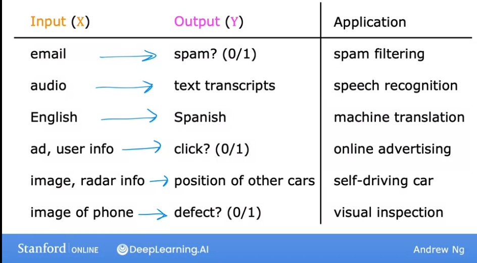
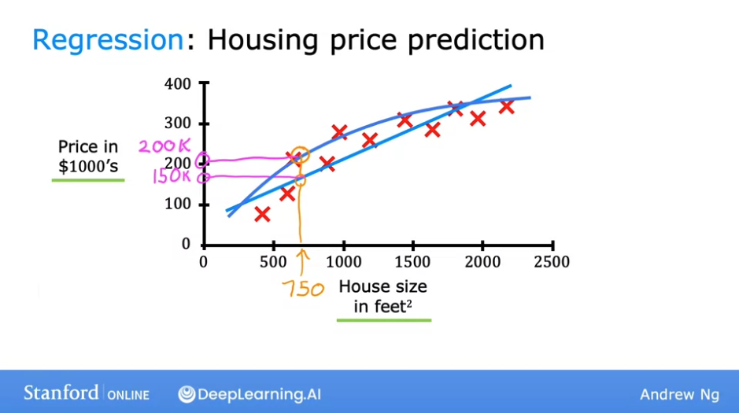
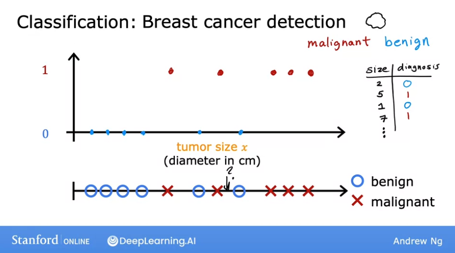
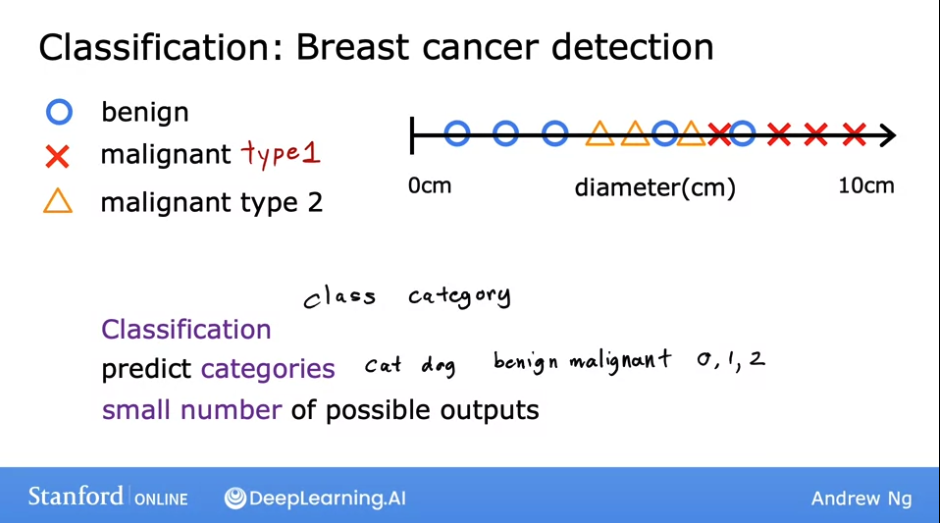
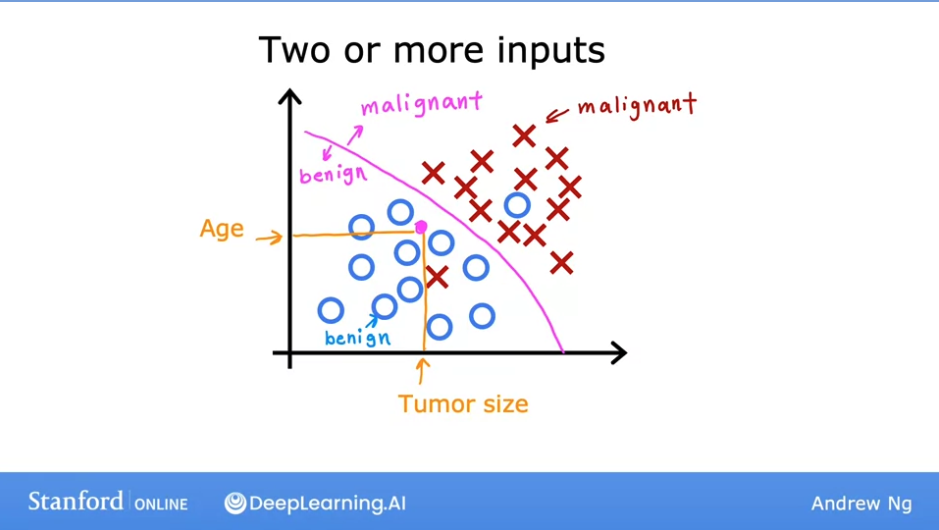
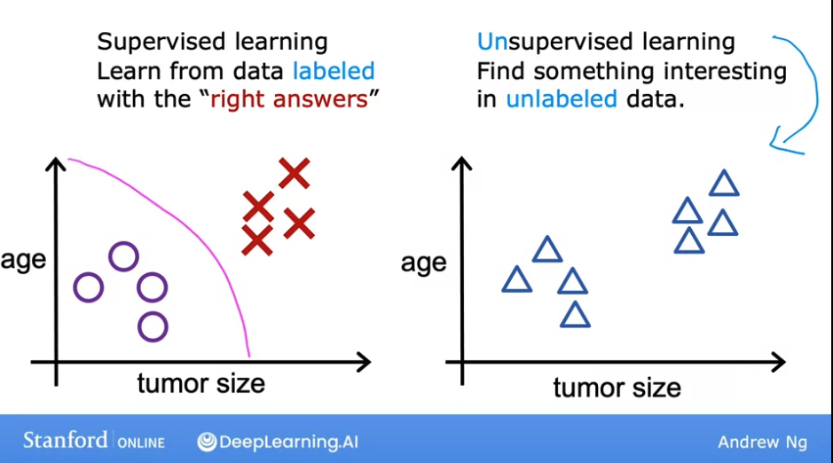
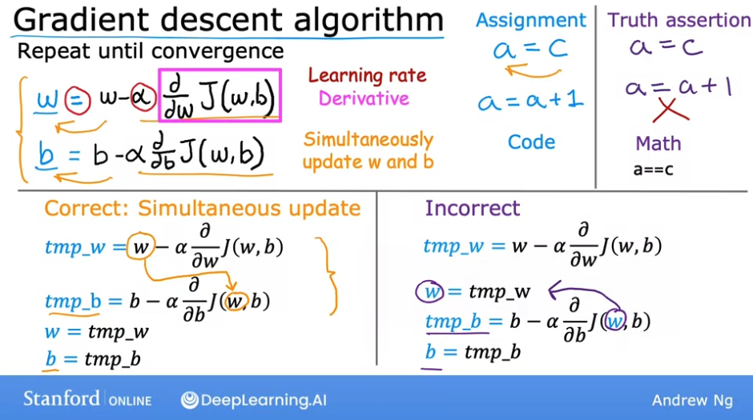
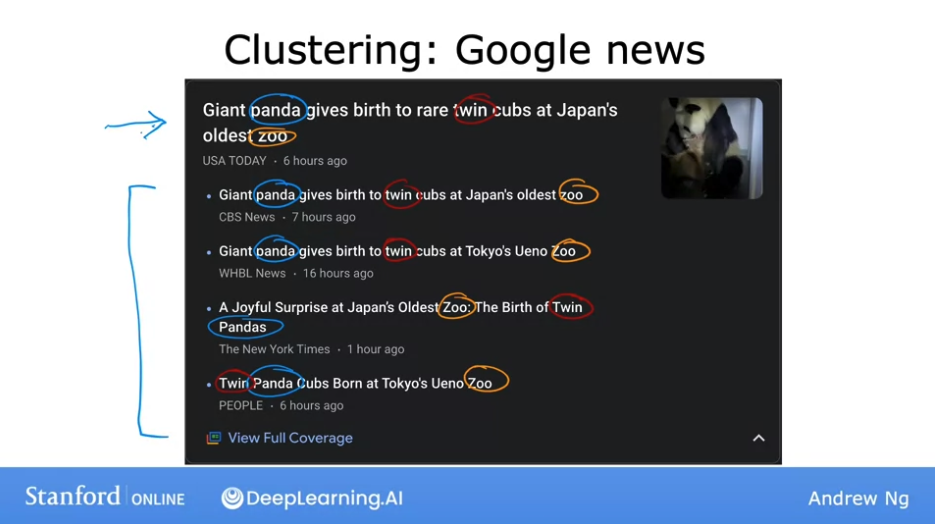
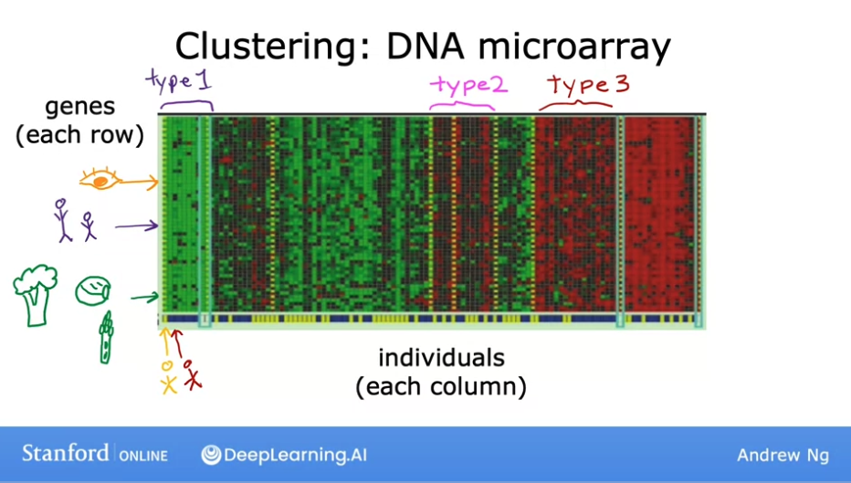

# Week 1 - Introduction to Machine Learning

## Welcome to machine learning

Machine learning is the science of getting computers to learn without being explicitly programmed.

## Application of machine learning

Why is machine learning so widely used today? There are a few basic things that we could prgoram a machine to do, such a s how to find the shortest path from a to b. But for the msot part, we just did not know how to write an explicit program to do many of the more interesting things, such as perform a web search, recognize human speech, or build a self driving car.

The only way we knew how to do these things was to have a machine learn to do it by itself.

## What is machine learning?

A definition of machine learning by Arthur Samuel in 1959:

```
Machine learning is the field of study that gives computers the ability to
learn without being explicitly programmed.
```

Machine learning algorithms:

- Supervised learning: used most in real-world application, and seen the most rapid advancements. (Courses 1 and 2)
- Unsupervised learning (Course 3)
- Recommender systems (Course 3)
- Reinforcement learning (Course 3)

By far, the most used types of learning algorithms today are supervised learning, unsupervised learning and recommender systems.

During the course we will spend a lot of time in **practical advice for applying learning algorithms**. Teaching about learning algorithms is like giving someone a set of tools; but more important than having the tools is knowing **how to apply them**.

In this class, we will learn about the best practices for how to actually develop a practical, valuable machine learning system.

## Supervised learning - Part 1

Supervised learning refers to algorithms that **learn x to y, or input to output mappings**.

The key characterisitc of supervised learning algorithms is that **you give your learning algorithm examples to learn from.** That include the right answers; i.e. the correct label `y` for a given input `x`. By seeing the correct pairs of input `x` and desired output `y`, the learning algorithm eventually learns to take just the input alone without the output label and **gives a reasonable accurate prediction or guess of the output**.

Examples:



Supervised learning with regression:



**Regression**: predict a number out of infinitely many possible outputs.

## Supervised learning - Part 2

A second major type of supervisted learning algorithm is called **classification algorithm**.

**Classification algorithms** try to predict a **category** or **class** for a given input, out of a small set of possible outputs. 

Example: Breast cancer detection

 
 


## Unsupervised learning - Part 1

After supervised learning, the most widely used form of machine learning is **unsupervised learning.**

The main difference with supervised learning is that the provided data is not labeled, i.e. **not associated with any outpat labels `y`**.

In the case of breast cancer detecion, you would be given data on patient's tumor size and age, but not whether the tumor is benign or malignat. And we're not asked to diagnose whether the tumor is malignant or not, because we're not given any labels.

Instead, our job is to find some structure or pattern in the data; or just find something interesting in the data.



An unsupervised algorithm might decide that the data **can be assigned to two different groups or two different clusters.** This is called a **clustering algorithm** because it places the unlabled data into different clusters.



When writing code, it is more natural to do simultaneous update anyways.


This has many applications: for example, Google News does it every day by looking at all news articles in the internet and grouping related stories together.

You can see from an example how Google uses this algorithm: notice that the words "panda", "twins" and "zoo" appears in all news stories.



This clustering algorithm figures out on its own which words suggest that certain articles are in the same group: there is no Googlew News employee that manually tells the algorithm to find articles that contain the word "panda". So the algorithm figures that by itself, **without supervision**.

That's why the **clustering algorithm is a type of unsupervised algorithm**.

Another example: **DNA microarray**



We just tell the algorithm: "here's a bunch of data. I don't know what the different types of people are, but can you automatically find structure in the data?". And the algorithm automatically figures out the major types of individuals, without us giving it the right answers from examples in advance.

## Unsupervised learning - Part 2

In **unsupervised learning, the data comes only with inputs `x` but no output labels `y`**, and the algorithm has to find some structure or some patterns or something interesting in the data,

Apart from the **clustering algorithm**, we will see two other types of unsupervised learning:

- **anomaly detection**: used to detect unusual events. This is really important for fraud detection in the financial system, where unusual events or transactions could be signs of fraud. 
- **dimensionality reduction**: lets you take a big dataset and almost magically compress it to a much smaller dataset while losing as little information as possible.

