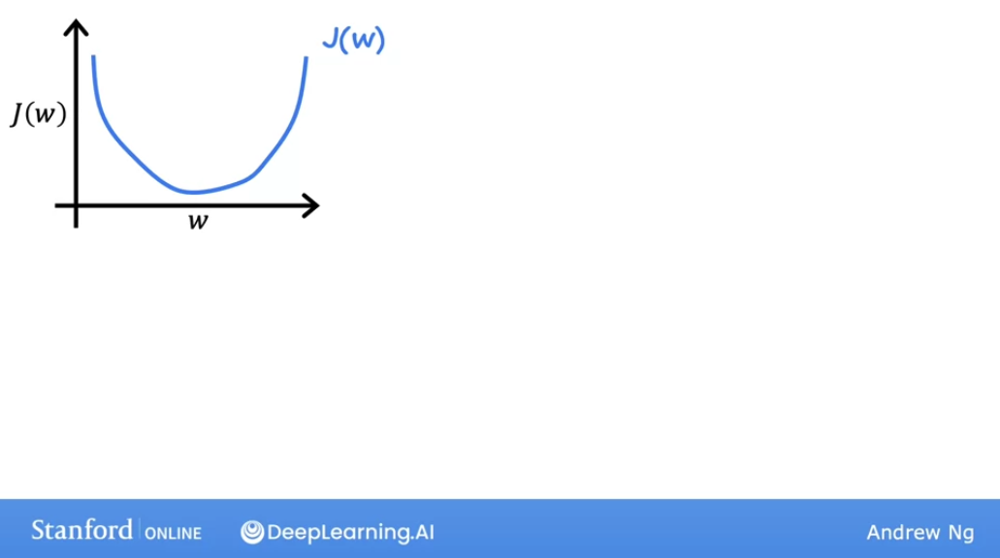

# Gradient descent

## Visualization of gradient descent

We can use the algorithm called **gradient descent** to find the values of $w$ and $b$ that result in the smallest possible cost in a systematic way, instead of trial and error.

Gradient descent is used all over the place in ML, not just for linear regression. For example, in deep learning.

Here's an overview of what we'll do with gradient descent.


We have the cost function $J(w,b)$, that we want to minimize by finding the proper value for those parameteres $w$ and $b$. In the example we've seen so far, this is a cost function for a linerat regression, but gradient descent wcan be used to minimize any function. So if we have a cost function with $w_1$, $w_2$, etc, and $b$, we want to minimize $J$ over those parameters, i.e: pick values for them that minimize $J$.


What we are going to do, just to start off, is to **do some initial guesses for $w$ and $b$**. In linear regression, it won't matter what the initial values are so it is common to initialize both of them to 0.


With the gradient descent algorithm, what we are going to do is to **keep changing $w$ and $b$ a bit to try to reduce the cost $J$**, until it hopefully settles at or near a minimum.


One important note: for some functions $J$ might not have a soupbowl or hammock shape: **it's possible for there to be more than one minimum**.

Let's look at an example, and notice that **this cost function is not for a linear regression, i.e. the cost function is not a squared error function.**


What you see above is the cost function that you might get if you are training a neural network model.

If we imagine we are standing on a point of that surface, on a hill.


Your goal is to start there and get to the bottom of one of the valleys as efficiently as possible.

**What the gradient descent algorithm does is:** take a 360 degree look around and ask myself, if I were to take a step in one direction, and I want to go downhill as quickly as possible, what direction do I choose to take that baby step?

In our example, starting where the man is drawn, the best direction is roughly:


That is the **direction of steepest descent**. That means that a step in that direction makes you go faster and more efficiently to a valley that a step in any other direction.

After taking that first step, we repeat the process. And we keep going and repeating the process until we find ourselves at the bottom of the valley, at a local minimum.


We just went through **multiple steps of gradient descent**.

However, it is important to know that **gradient descent has an intersting property:** since we chose $w$ and $b$ arbitrarily, if we had chosen other starting values and repeated the process of gradient descent, we would have ended on a totally different valley.


The bottom of **both the first and second valleys are called local minima**, because if you start going dow the first valley, gradient descent won't lead you to the second valley, and the same is true if you started going down the second valley, but vicecersa.

## Implementing gradient descent

Let's write down the gradient descent algorithm:

$w = w - α \frac{∂}{∂w} J(w, b)$

$b = b - α \frac{∂}{∂b} J(w, b)$

What this expression is saying is: update your value of $w$ by taking its current value and adjusting it a small amount (the expression on the right).

First: notice that we are using assignment and not mathematical equality for the equal notation.

Second, $α$ is the **learning rate**. It is a number **between 0 and 1** and it **controls how "big of a step" you take downhill**. If $α$ is large, that corresponds to a very aggressive gradient descent procedure, where you take huge steps downhill, and viceversa.

Finally, the term:

$\frac{∂}{∂w} J(w, b)$

is the **derivative term of the cost function $J$**. For now, you can think of it as the **direction in which you want to take your step downhill**.

One important thing: remember that our model has two parameters, $w$ and $b$.

So we are going to repeat the gradient descent step for the two equations above until the algorithm converges, reaching the local minimum where those two parameters no longer change (much).

**IMPORTANT:** we always want to do **simultaneous update of $w$ and $b$**. That means calculating the right side of the equation simultaneously, before assigning the results to the updated value.

## Gradient descent intuiton

Let's get a better intuition of what gradient descent is doing.

Let's use a slightly simpler example where we work on minimizing just one parameter, $w$, and thus the cost function is $J(w)$. That means that the gradient descent now looks like this:

$w = w - α \frac{∂}{∂w} J(w)$

And we are only trying to minimize the cost by minimizing the parameter $w$.

So this is like our previous example where we had temporarily set $b = 0$, and we can look at a two-dimensional graph of the cost function $J$.



So let's first inititialize gradient descent with a starting value for $w$ at random.

And then let's use the gradient descent formula to update $w$.


But we first need to understand what the derivative term $\frac{∂}{∂w} J(w)$ means.

We can think of the derivative on that point in the line that we have picked randomly by drawing the tangent line to the curve at that point. And **the slope of that line is the derivative of the function $J$ at that point.**

You can get the slop by dividing the height vs width of triangle. When the slope is positive (the tangent line pointing upwards toward the right of the graph), then **the derivative is a positive number.**

So in this case, the updated $w$ will be smaller than the original $w$, since **the learning rate is always a positive number**, and in this case the derivative is positive.


And you can see that in the graph, $w$ decreases, i.e. moves to the left, and approaches the minimum of the cost $J(w)$ function.

.png)

And the same will be true, but inversed if the starting point of $w$ is at a place of the curve where the slope is negative: the derivative will be negative, and since we are multiplying by $-α$, the updated value for $w$ will be greater than the original.

That means we are moving toward the right of the curve, and thus toward the minimum of our cost function.


## Learning rate

The choice of the learning rate $α$ will have a huge impact on the efficiency of your implementation of gradient descent. If $α$ is chosen poorly rate of descent may not even work at all. 

Let's take a deeper look at the learning rate to help us choose better learning rates for our implementations of gradient descent.

Let's first see what could happen if the learning rate $α$ is **too small**.

If we start our gradient descent algorithm at a random place in our $J(w)$ curve, like so:


And we select a very small learning rate $α$ like $0.0000001$, we will give miniscule steps as update $w$ and approach the minimum.

The outcome of this process is that we do end up decreasing the cost $J(w)# (i.e. approaching its minimum), but **incredibly slowly.**


Now, if the learning rate $α$ is **too large**:

We start with a point over the curve $J(w)$ that is already close to the minimum, and its derivative is negative, so we should update $w$ to the right.


However, since the learning rate $α$ is too large, we will take a step that crosses over to the other side of the minimum (overshoots), and actually gets away from it, so the cost $J(w)$ has actually **increased**.


Now, at this point, the derivate tells us to **decrease** $w$, but since the learning rate is too large, we might take a huge step, going all the way to the other side of the minimum, further increasing $J(w)$.


And we can continue this process overshooting continually, getting further and further away from the minimum. So, if the learning rate is too large, **gradient descent may overshoot and never reach a minimum.** It will **fail to converge, or diverge.**


Here's another question, that you might be wondering: what happens when the param $w$ is already located at a minimum and we want to calculate gradient descent?


If we are located at the point shown in the graph, with, for e.g. a value of $5$, and we draw its **tangent** there, it will be completely horizontal, which means it has a **slope of value $0$**.

Thus, the derivative term is $0$ for the current value of $w$:


So basically, $w$ will not update, it will stay at $5$. That means that if we have reached a local minimum, further steps of gradient descent will not update the value of the parameters.

This also explains **why we can reach a local minimum if we have a _fixed_ learning rate**. Let's visualize a cost function and an initial point on the curve up to the right:


With the first step, the slope is pretty vertical, so the derivative is large. Thus the step will also be large.


But on the second step, the slope will be a little less vertical, and thus the step to take will be smaller.


And thus for each subsequent step, as we approach the minimum, the derivative gets smaller and smaller, closer to 0, until we reach the minimum.


## Gradient descent for linear regression

Up until now, we've seen the linear regression model and then its cost function $J(w)$, and then the gradient descent algorithm. 

Now, we're going to put everything together and use the squared error cost function for the linear regression model with gradient descent. This will allow us to train the linear regression model to fit a straight line through the training data.

Let's see now what the actual gradient descent formulas for $w$ and $b$ look like when we calculate the partial derivatives of the cost function:


So the formulas result in:

$w = w - α \frac{∂}{∂w} J(w,b) $

$w = w - α ({1\over {m}} {\sum_{i=1}^m (f_{w,b}(x^{(i)}) - y^{(i)})x^{(i)}}))$

and:

$b = b - α \frac{∂}{∂w} J(w,b)$

$b = b - α ({1\over {m}} {\sum_{i=1}^m (f_{w,b}(x^{(i)}) - y^{(i)}}))$

The derivates come from:


Remember that on a cost function of some unknown function such as one produced by a depp learning network, your cost function can have multiple local minimum.

However, for a **linear regression**, using the **squared error cost function**, the graph will always have a soupbowl shape. It is a **convex function**, which has a unique **global minimum**:


And if you run gradient descent for such a cost function, it **will always converge to that global minimum**, provided you don't provided a learning rate that causes the algorithm to overshoot.

## Running gradient descent

Let's see what happens when you run gradient descent for linear regression with the algorithm in action.

First we have a plot of our data, and our contour plot and 3D plot of $J(w,b)$.

Let's initialize our data to $b = 900$ and $w = - 0.1$, and see the model line (straight line fit) that we get (pretty far off!):


Now, let's take one step with the **gradient descent algorith** and see how our fitted line is updated, and how the point in the contour plot moves:


And let's continue now, until we converge:


That's **gradient descent**. And now you can use the $f_{(w,b)}(x)$ model to predict the price of a house based on its price.

To be more precise: this process of gradient descent is called **batch gradient descent**. This means that **for every step of the algorithm we use all the training examples to recalculate our parameters**.


There are **other versions** of gradient descent that do not use the whole training set, but small subsets of the data at each step.

## Optional lab: Gradient Descent

[LINK](https://www.coursera.org/learn/machine-learning/ungradedLab/lE1al/optional-lab-gradient-descent/)

[Local link](./labs/Week%201/Optional%20Lab%20-%20Gradient%20Descent.ipynb)

In this lab, you will:
- automate the process of optimizing $w$ and $b$ using gradient descent.

```py
import math, copy
import numpy as np
import matplotlib.pyplot as plt
```

**Problem Statement**

Let's use the same two data points as before - a house with 1000 square feet sold for \\$300,000 and a house with 2000 square feet sold for \\$500,000.

| Size (1000 sqft)     | Price (1000s of dollars) |
| ----------------| ------------------------ |
| 1               | 300                      |
| 2               | 500                      |


```py
# Load our data set
x_train = np.array([1.0, 2.0])   #features
y_train = np.array([300.0, 500.0])   #target value
```

**Compute cost**
This was developed in the last lab. We'll need it again here.
```py
# Function to calculate the cost
def compute_cost(x, y, w, b):
   
    m = x.shape[0] 
    cost = 0
    
    for i in range(m):
        f_wb = w * x[i] + b
        cost = cost + (f_wb - y[i])**2
    total_cost = 1 / (2 * m) * cost

    return total_cost
```

**Gradient descent summary**
So far in this course, you have developed a linear model that predicts $f_{w,b}(x^{(i)})$:
$$f_{w,b}(x^{(i)}) = wx^{(i)} + b \tag{1}$$
In linear regression, you utilize input training data to fit the parameters $w$,$b$ by minimizing a measure of the error between our predictions $f_{w,b}(x^{(i)})$ and the actual data $y^{(i)}$. The measure is called the $cost$, $J(w,b)$. In training you measure the cost over all of our training samples $x^{(i)},y^{(i)}$
$$J(w,b) = \frac{1}{2m} \sum\limits_{i = 0}^{m-1} (f_{w,b}(x^{(i)}) - y^{(i)})^2\tag{2}$$ 


In lecture, *gradient descent* was described as:

$$\begin{align*} \text{repeat}&\text{ until convergence:} \; \lbrace \newline
\;  w &= w -  \alpha \frac{\partial J(w,b)}{\partial w} \tag{3}  \; \newline 
 b &= b -  \alpha \frac{\partial J(w,b)}{\partial b}  \newline \rbrace
\end{align*}$$
where, parameters $w$, $b$ are updated simultaneously.  
The gradient is defined as:
$$
\begin{align}
\frac{\partial J(w,b)}{\partial w}  &= \frac{1}{m} \sum\limits_{i = 0}^{m-1} (f_{w,b}(x^{(i)}) - y^{(i)})x^{(i)} \tag{4}\\
  \frac{\partial J(w,b)}{\partial b}  &= \frac{1}{m} \sum\limits_{i = 0}^{m-1} (f_{w,b}(x^{(i)}) - y^{(i)}) \tag{5}\\
\end{align}
$$

Here *simultaniously* means that you calculate the partial derivatives for all the parameters before updating any of the parameters.

**Implement Gradient Descent**
You will implement gradient descent algorithm for one feature. You will need three functions. 
- `compute_gradient` implementing equation (4) and (5) above
- `compute_cost` implementing equation (2) above (code from previous lab)
- `gradient_descent`, utilizing compute_gradient and compute_cost

Conventions:
- The naming of python variables containing partial derivatives follows this pattern,$\frac{\partial J(w,b)}{\partial b}$  will be `dj_db`.
- w.r.t is With Respect To, as in partial derivative of $J(wb)$ With Respect To $b$.

**compute_gradient**
`compute_gradient`  implements (4) and (5) above and returns $\frac{\partial J(w,b)}{\partial w}$,$\frac{\partial J(w,b)}{\partial b}$. The embedded comments describe the operations.

```py
def compute_gradient(x, y, w, b): 
    """
    Computes the gradient for linear regression 
    Args:
      x (ndarray (m,)): Data, m examples 
      y (ndarray (m,)): target values
      w,b (scalar)    : model parameters  
    Returns
      dj_dw (scalar): The gradient of the cost w.r.t. the parameters w
      dj_db (scalar): The gradient of the cost w.r.t. the parameter b     
     """
    
    # Number of training examples
    m = x.shape[0]    
    dj_dw = 0
    dj_db = 0
    
    for i in range(m):  
        f_wb = w * x[i] + b 
        dj_dw_i = (f_wb - y[i]) * x[i] 
        dj_db_i = f_wb - y[i] 
        dj_db += dj_db_i
        dj_dw += dj_dw_i 
    dj_dw = dj_dw / m 
    dj_db = dj_db / m 
        
    return dj_dw, dj_db
```
The lectures described how gradient descent utilizes the partial derivative of the cost with respect to a parameter at a point to update that parameter.   
Let's use our `compute_gradient` function to find and plot some partial derivatives of our cost function relative to one of the parameters, $w_0$.


Above, the left plot shows $\frac{\partial J(w,b)}{\partial w}$ or the slope of the cost curve relative to $w$ at three points. On the right side of the plot, the derivative is positive, while on the left it is negative. Due to the 'bowl shape', the derivatives will always lead gradient descent toward the bottom where the gradient is zero.
 
The left plot has fixed $b=100$. Gradient descent will utilize both $\frac{\partial J(w,b)}{\partial w}$ and $\frac{\partial J(w,b)}{\partial b}$ to update parameters. The 'quiver plot' on the right provides a means of viewing the gradient of both parameters. The arrow sizes reflect the magnitude of the gradient at that point. The direction and slope of the arrow reflects the ratio of $\frac{\partial J(w,b)}{\partial w}$ and $\frac{\partial J(w,b)}{\partial b}$ at that point.

Note that the gradient points *away* from the minimum. Review equation (3) above. The scaled gradient is *subtracted* from the current value of $w$ or $b$. This moves the parameter in a direction that will reduce cost.

**Gradient Descent**
Now that gradients can be computed,  gradient descent, described in equation (3) above can be implemented below in `gradient_descent`. The details of the implementation are described in the comments. Below, you will utilize this function to find optimal values of $w$ and $b$ on the training data.

```py
def gradient_descent(x, y, w_in, b_in, alpha, num_iters, cost_function, gradient_function): 
    """
    Performs gradient descent to fit w,b. Updates w,b by taking 
    num_iters gradient steps with learning rate alpha
    
    Args:
      x (ndarray (m,))  : Data, m examples 
      y (ndarray (m,))  : target values
      w_in,b_in (scalar): initial values of model parameters  
      alpha (float):     Learning rate
      num_iters (int):   number of iterations to run gradient descent
      cost_function:     function to call to produce cost
      gradient_function: function to call to produce gradient
      
    Returns:
      w (scalar): Updated value of parameter after running gradient descent
      b (scalar): Updated value of parameter after running gradient descent
      J_history (List): History of cost values
      p_history (list): History of parameters [w,b] 
      """
    
    # An array to store cost J and w's at each iteration primarily for graphing later
    J_history = []
    p_history = []
    b = b_in
    w = w_in
    
    for i in range(num_iters):
        # Calculate the gradient and update the parameters using gradient_function
        dj_dw, dj_db = gradient_function(x, y, w , b)     

        # Update Parameters using equation (3) above
        b = b - alpha * dj_db                            
        w = w - alpha * dj_dw                            

        # Save cost J at each iteration
        if i<100000:      # prevent resource exhaustion 
            J_history.append( cost_function(x, y, w , b))
            p_history.append([w,b])
        # Print cost every at intervals 10 times or as many iterations if < 10
        if i% math.ceil(num_iters/10) == 0:
            print(f"Iteration {i:4}: Cost {J_history[-1]:0.2e} ",
                  f"dj_dw: {dj_dw: 0.3e}, dj_db: {dj_db: 0.3e}  ",
                  f"w: {w: 0.3e}, b:{b: 0.5e}")
 
    return w, b, J_history, p_history #return w and J,w history for graphing
```

And now:
```py
# initialize parameters
w_init = 0
b_init = 0
# some gradient descent settings
iterations = 10000
tmp_alpha = 1.0e-2
# run gradient descent
w_final, b_final, J_hist, p_hist = gradient_descent(x_train ,y_train, w_init, b_init, tmp_alpha, 
                                                    iterations, compute_cost, compute_gradient)
print(f"(w,b) found by gradient descent: ({w_final:8.4f},{b_final:8.4f})")
```

Results in:
```py
Iteration    0: Cost 7.93e+04  dj_dw: -6.500e+02, dj_db: -4.000e+02   w:  6.500e+00, b: 4.00000e+00
Iteration 1000: Cost 3.41e+00  dj_dw: -3.712e-01, dj_db:  6.007e-01   w:  1.949e+02, b: 1.08228e+02
Iteration 2000: Cost 7.93e-01  dj_dw: -1.789e-01, dj_db:  2.895e-01   w:  1.975e+02, b: 1.03966e+02
Iteration 3000: Cost 1.84e-01  dj_dw: -8.625e-02, dj_db:  1.396e-01   w:  1.988e+02, b: 1.01912e+02
Iteration 4000: Cost 4.28e-02  dj_dw: -4.158e-02, dj_db:  6.727e-02   w:  1.994e+02, b: 1.00922e+02
Iteration 5000: Cost 9.95e-03  dj_dw: -2.004e-02, dj_db:  3.243e-02   w:  1.997e+02, b: 1.00444e+02
Iteration 6000: Cost 2.31e-03  dj_dw: -9.660e-03, dj_db:  1.563e-02   w:  1.999e+02, b: 1.00214e+02
Iteration 7000: Cost 5.37e-04  dj_dw: -4.657e-03, dj_db:  7.535e-03   w:  1.999e+02, b: 1.00103e+02
Iteration 8000: Cost 1.25e-04  dj_dw: -2.245e-03, dj_db:  3.632e-03   w:  2.000e+02, b: 1.00050e+02
Iteration 9000: Cost 2.90e-05  dj_dw: -1.082e-03, dj_db:  1.751e-03   w:  2.000e+02, b: 1.00024e+02
(w,b) found by gradient descent: (199.9929,100.0116)
```

Take a moment and note some characteristics of the gradient descent process printed above.  

- The cost starts large and rapidly declines as described in the slide from the lecture.
- The partial derivatives, `dj_dw`, and `dj_db` also get smaller, rapidly at first and then more slowly. As shown in the diagram from the lecture, as the process nears the 'bottom of the bowl' progress is slower due to the smaller value of the derivative at that point.
- progress slows though the learning rate, alpha, remains fixed

**Cost versus iterations of gradient descent**
A plot of cost versus iterations is a useful measure of progress in gradient descent. Cost should always decrease in successful runs. The change in cost is so rapid initially, it is useful to plot the initial decent on a different scale than the final descent. In the plots below, note the scale of cost on the axes and the iteration step.

```py
# plot cost versus iteration  
fig, (ax1, ax2) = plt.subplots(1, 2, constrained_layout=True, figsize=(12,4))
ax1.plot(J_hist[:100])
ax2.plot(1000 + np.arange(len(J_hist[1000:])), J_hist[1000:])
ax1.set_title("Cost vs. iteration(start)");  ax2.set_title("Cost vs. iteration (end)")
ax1.set_ylabel('Cost')            ;  ax2.set_ylabel('Cost') 
ax1.set_xlabel('iteration step')  ;  ax2.set_xlabel('iteration step') 
plt.show()
```


**Predictions**
Now that you have discovered the optimal values for the parameters $w$ and $b$, you can now use the model to predict housing values based on our learned parameters. As expected, the predicted values are nearly the same as the training values for the same housing. Further, the value not in the prediction is in line with the expected value.

```py
print(f"1000 sqft house prediction {w_final*1.0 + b_final:0.1f} Thousand dollars")
print(f"1200 sqft house prediction {w_final*1.2 + b_final:0.1f} Thousand dollars")
print(f"2000 sqft house prediction {w_final*2.0 + b_final:0.1f} Thousand dollars")
# 1000 sqft house prediction 300.0 Thousand dollars
# 1200 sqft house prediction 340.0 Thousand dollars
# 2000 sqft house prediction 500.0 Thousand dollars
```

**Increased Learning Rate**
In the lecture, there was a discussion related to the proper value of the learning rate, $\alpha$ in equation(3). The larger $\alpha$ is, the faster gradient descent will converge to a solution. But, if it is too large, gradient descent will diverge. Above you have an example of a solution which converges nicely.

Let's try increasing the value of  $\alpha$ and see what happens:
```py
# initialize parameters
w_init = 0
b_init = 0
# set alpha to a large value
iterations = 10
tmp_alpha = 8.0e-1
# run gradient descent
w_final, b_final, J_hist, p_hist = gradient_descent(x_train ,y_train, w_init, b_init, tmp_alpha, 
                                                    iterations, compute_cost, compute_gradient)
```
Results in:
```py
Iteration    0: Cost 2.58e+05  dj_dw: -6.500e+02, dj_db: -4.000e+02   w:  5.200e+02, b: 3.20000e+02
Iteration    1: Cost 7.82e+05  dj_dw:  1.130e+03, dj_db:  7.000e+02   w: -3.840e+02, b:-2.40000e+02
Iteration    2: Cost 2.37e+06  dj_dw: -1.970e+03, dj_db: -1.216e+03   w:  1.192e+03, b: 7.32800e+02
Iteration    3: Cost 7.19e+06  dj_dw:  3.429e+03, dj_db:  2.121e+03   w: -1.551e+03, b:-9.63840e+02
Iteration    4: Cost 2.18e+07  dj_dw: -5.974e+03, dj_db: -3.691e+03   w:  3.228e+03, b: 1.98886e+03
Iteration    5: Cost 6.62e+07  dj_dw:  1.040e+04, dj_db:  6.431e+03   w: -5.095e+03, b:-3.15579e+03
Iteration    6: Cost 2.01e+08  dj_dw: -1.812e+04, dj_db: -1.120e+04   w:  9.402e+03, b: 5.80237e+03
Iteration    7: Cost 6.09e+08  dj_dw:  3.156e+04, dj_db:  1.950e+04   w: -1.584e+04, b:-9.80139e+03
Iteration    8: Cost 1.85e+09  dj_dw: -5.496e+04, dj_db: -3.397e+04   w:  2.813e+04, b: 1.73730e+04
Iteration    9: Cost 5.60e+09  dj_dw:  9.572e+04, dj_db:  5.916e+04   w: -4.845e+04, b:-2.99567e+04
```

Above, $w$ and $b$ are bouncing back and forth between positive and negative with the absolute value increasing with each iteration. Further, each iteration $\frac{\partial J(w,b)}{\partial w}$ changes sign and cost is increasing rather than decreasing. This is a clear sign that the *learning rate is too large* and the solution is diverging. 
Let's visualize this with a plot.


Above, the left graph shows $w$'s progression over the first few steps of gradient descent. $w$ oscillates from positive to negative and cost grows rapidly. Gradient Descent is operating on both $w$ and $b$ simultaneously, so one needs the 3-D plot on the right for the complete picture.