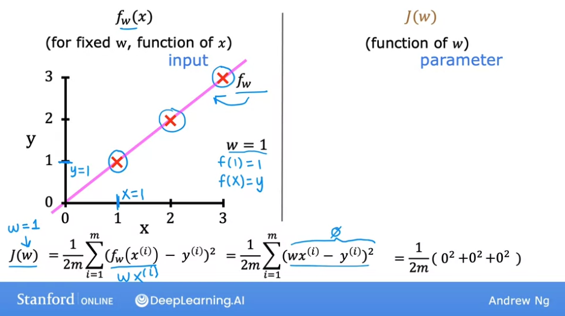

# Week 1 - Regression Model

## Linear regression model - Part 1

We'll see the first model of supervised learning: the **Linear Regression Model**.

This is just fitting a straight line to your data and it's probably the most widely used learning algorithm in the world today.

Many of the concepts here will also apply to other ML models we'll see later.

Let's use the example of prediciting the prices of a house based on its size. We're going to use a dataset from Portland, USA. 

Using this dataset, we can build a **linear regression model, which will fit a straight line to the data**, looking like this:


Using this model, you can see that if you want to predict the price of a house of 1250 sq. feet, it will cost around 220k dollars.

**Regression models** are called so because they predict numbers as the output, like prices in dollars.  **Any supervised learning model that predicts a number such as 220k, 1,5 or -33.2 is addressing what's called a regression problem**.

Linear regression is one example of many others.

An additional way of looking at the data from our house pricing example is via a table:


Each column represents the input and the output, the same as with the x-axis and y-axis of the graph.

### Terminology

**Training set:** the data that you use to train your model. (Notice that your client's house, from the example, is not part of the training set).

**Input variable, feature, or input feature:** the input, denoted with lowercase x. 

**Output variable or target variable:** the output, denoted with lowercase y.

See in the image below more: 


## Linear regression model - Part 2

Recall that in **supervised learning**, the **training set** contains both:
- **input features**: such as the size of the houses
- **output targets:** such as the price of the houses.

The output targets are the right answers to the model that we'll learn from.

To train the model, you feed the training set, both the input features and the output targets to your learning algorithm. Then your supervised learning algorithm will produce a **function**. We'll write this function as lowercase `f`. Historically, this function used to be called a **hypothesis**, but we'll call it a **function** `f` in this class. 

The job with `f` is to take a new input `x` and output an estimate or a prediction, which we will call `y-hat` (`ŷ`).

In ML, the convention is that **$ŷ$ is the estimate or the prediction for $y$**.

The function $f$ is called the **model**.

$x$ is called the **input or input feature** and the **output of the model is the prediction $ŷ$**.

The model's prediction is the estimated value of $y$. When the symbol is just the letter $y$, then that refers to the **target**, which is the **actual true value in the training set.**

In contrast, $ŷ$ is an estimate, which **may or may not be the actual true value.** In the case of the houses, the true price of the house is unknown until it is sold.

The model $f$, given a size, outputs a price which is the **estimator or prediction of what the true price will be.**


Now, **how do represent $f$**? What is the **math formula we use to compute $f$**?

For now, we are using a straight line, and the line is represented by:


**Why are we choosing a linear function (a straight line)** instead of some non-linear function like a curve or a parabola?

Sometimes you want to fit more complex non-linear functions as well, like a curve. But since this linear function is relatively simple and easy to work with, we'll first use a line as a foundation that will eventually help us to get to more complex models that are non-linear. 

This particular model has a name, it's called **linear regression**. More specifically, this is **linear regression with one variable**, where the phrase "one variable" means that there's a single input variable or feature $x$, namely the size of the house.

Another name for a linear model with one input variable is **univariate linear regression**.


## Optional Lab: Model Representation


### Problem statement

As in the lecture, you will use the motivating example of housing price prediction.
This lab will use a simple data set with only two data points - a house with 1000 square feet sold for `$`300,000 and a house with 2000 square feet sold for $500,000. These two points will constitute our data or training set. In this lab, the units of size are 1000 sqft and the units of price are 1000s of dollars.

| Size (1000 sqft)     | Price (1000s of dollars) |
| -------------------| ------------------------ |
| 1.0               | 300                      |
| 2.0               | 500                      |

You would like to fit a linear regression model (shown above as the blue straight line) through these two points, so you can then predict price for other houses - say, a house with 1200 sqft.

```py
import numpy as np
import matplotlib.pyplot as plt
plt.style.use('./deeplearning.mplstyle')

# x_train is the input variable (size in 1000 square feet)
# y_train is the target (price in 1000s of dollars)
x_train = np.array([1.0, 2.0])
y_train = np.array([300.0, 500.0])
print(f"x_train = {x_train}")
print(f"y_train = {y_train}")

# We will use m to denote the number of training examples. 
# Numpy arrays have a .shape parameter. x_train.shape returns a python tuple with an entry for each dimension. 
# x_train.shape[0] is the length of the array and number of examples as shown below.

# m is the number of training examples
print(f"x_train.shape: {x_train.shape}")
m = x_train.shape[0]
print(f"Number of training examples is: {m}")

# One can also use the Python `len()` function as shown below.
# m is the number of training examples
m = len(x_train)
print(f"Number of training examples is: {m}")
```

We will use (x$^{(i)}$, y$^{(i)}$) to denote the $i^{th}$ training example. Since Python is zero indexed, (x$^{(0)}$, y$^{(0)}$) is (1.0, 300.0) and (x$^{(1)}$, y$^{(1)}$) is (2.0, 500.0). 

To access a value in a Numpy array, one indexes the array with the desired offset. For example the syntax to access location zero of `x_train` is `x_train[0]`.

Run the next code block below to get the $i^{th}$ training example.

```py
i = 0 # Change this to 1 to see (x^1, y^1)

x_i = x_train[i]
y_i = y_train[i]
print(f"(x^({i}), y^({i})) = ({x_i}, {y_i})")
```

You can plot these two points using the `scatter()` function in the `matplotlib` library, as shown in the cell below. 
- The function arguments `marker` and `c` show the points as red crosses (the default is blue dots).

You can use other functions in the `matplotlib` library to set the title and labels to display.

```py
# Plot the data points
plt.scatter(x_train, y_train, marker='x', c='r')
# Set the title
plt.title("Housing Prices")
# Set the y-axis label
plt.ylabel('Price (in 1000s of dollars)')
# Set the x-axis label
plt.xlabel('Size (1000 sqft)')
plt.show()
```


 As described in lecture, the model function for linear regression (which is a function that maps from `x` to `y`) is represented as 

$$ f_{w,b}(x^{(i)}) = wx^{(i)} + b \tag{1}$$

The formula above is how you can represent straight lines - different values of $w$ and $b$ give you different straight lines on the plot.

Let's try to get a better intuition for this through the code blocks below. Let's start with $w = 100$ and $b = 100$. 

```py
w = 100
b = 100
print(f"w: {w}")
print(f"b: {b}")
```

Now, let's compute the value of $f_{w,b}(x^{(i)})$ for your two data points. You can explicitly write this out for each data point as - 

- for $x^{(0)}$, `f_wb = w * x[0] + b`

- for $x^{(1)}$, `f_wb = w * x[1] + b`

For a large number of data points, this can get unwieldy and repetitive. So instead, you can calculate the function output in a `for` loop as shown in the `compute_model_output` function below.
> **Note**: The argument description `(ndarray (m,))` describes a Numpy n-dimensional array of shape (m,). `(scalar)` describes an argument without dimensions, just a magnitude.  
> **Note**: `np.zero(n)` will return a one-dimensional numpy array with $n$ entries   

```py
def compute_model_output(x, w, b):
    """
    Computes the prediction of a linear model
    Args:
      x (ndarray (m,)): Data, m examples 
      w,b (scalar)    : model parameters  
    Returns
      f_wb (ndarray (m,)): model prediction
    """
    m = x.shape[0]
    f_wb = np.zeros(m)
    for i in range(m):
        f_wb[i] = w * x[i] + b
        
    return f_wb
```

Now let's call the `compute_model_output` function and plot the output.

```py
tmp_f_wb = compute_model_output(x_train, w, b)

# Plot our model prediction
plt.plot(x_train, tmp_f_wb, c='b',label='Our Prediction')

# Plot the data points
plt.scatter(x_train, y_train, marker='x', c='r',label='Actual Values')

# Set the title
plt.title("Housing Prices")
# Set the y-axis label
plt.ylabel('Price (in 1000s of dollars)')
# Set the x-axis label
plt.xlabel('Size (1000 sqft)')
plt.legend()
plt.show()
```


As you can see, setting  𝑤=100 and  𝑏=100 does not result in a line that fits our data.

If we adjust so that:

- $w = 200$
- $b = 100$

We now get:


Now that we have a model, we can use it to make our original prediction. Let's predict the price of a house with 1200 sqft. Since the units of $x$ are in 1000's of sqft, $x$ is 1.2.

```py
w = 200                         
b = 100    
x_i = 1.2
cost_1200sqft = w * x_i + b    

print(f"${cost_1200sqft:.0f} thousand dollars")
```

$340 thousand dollars

## Cost function formula


In ML, **parameters are the variables of the model that you can adjust during training to improve the model**.

Sometimes, the parameters $w$ and $b$ are also called **coefficients** or **weights**.

Depending of the values we give to the parameters, we'll get a different function `f(x)`:


Notice that $b$ is also called the **y-intercept** because that's where it crosses the y axis. 

And notice that $w$ is the **slope** of our line.


In the graph above, notice the difference between $y$ and $ŷ$, where the first is the **target** or actual value, belonging to the dataset, and the second one is the **estimate**, given by the function.

Now the question is: **how do you find values for $w$ and $b$ so that the prediction of $ŷ$ is close to the true target $y^{(i)}$, for many or maybe all training examples $(x^{(i)},y^{(i)})$**?

To answer that question, let's first take a look at how to measure how well a line fits the training data. To do that, we're going to construct **a cost function**.

The **cost function takes the prediction $ŷ$ and compares it to the target $y$ by taking $ŷ - y$**.

The difference is called the **error**, and it measures **how far off the prediction is from the target.**

We'll actually want to compute the **square of this error:**

$$(ŷ - y)^2$$

And we are going to compute this term for different training examples $i$ in the training set.

$$(ŷ^{(i)} - y{(i)})^2$$

We want to measure the error across the entire training set. We'll sum the squared errors using a **summation**:

$$\sum_{i=1}^m (ŷ^{(i)} - y{(i)})^2$$

where $m$ is the number of training examples in this dataset. Notice that if we have more training examples $m$ is larger and the cost function will calculate a bigger number. 

This is why we compute the **average squared error** instead of the **total squared error**, by dividing by $m$.

$${\sum_{i=1}^m (ŷ^{(i)} - y{(i)})^2}\over {m}$$

By convention, the cost function that machine learning people use actually divides by 2 times m. The extra division by 2 is just meant to make some of our later calculations look neater, but the cost function still works whether you include this division by 2 or not.

$${\sum_{i=1}^m (ŷ^{(i)} - y{(i)})^2}\over {2m}$$

This expression is the **cost function and it's represented with $J$**:

$$J_{(w,b)} = {{\sum_{i=1}^m (ŷ^{(i)} - y{(i)})^2}\over {2m}}$$

Since:

$$ ŷ^{(i)} = f_{w,b}(x^{(i)})$$

We can replace the $ŷ$ in the formula above, and end up with:

$$J_{(w,b)} = {{\sum_{i=1}^m (f_{w,b}(x^{(i)}) - y{(i)})^2}\over {2m}}$$

Eventually we're going to want to find values of $w$ and $b$ that make the cost function small. But before going there, let's first gain more intuition about what $J_{(w,b)}$ is really computing.

## Cost function intuition


Now, let's build some intuition about what the cost function is really doing. Let's recap first:

You want to find values for $w$, and $b$, so that the straight line fits the training data well. To measure how well a choice of $w$ and $b$ fits the training data, you have a cost function $J$. What the cost function  does is, it measures the difference between the model's predictions, and the actual true values for y. What you see later, is that linear regression would try to find values for $w$, and $b$, then make a J of $w$ be as small as possible.

In math we write it like so:


Let's first try with a simplified version of the regresion model, setting $b$ to `0`. (Notice that this also means that the line will cross the `y` axis at `0`)


Now, using this simplified model, let's see how the cost function changes as you choose different values for the parameter $w$. 

Let's look at graphs of the model $f(x)$, and the cost function $J(w)$.

First, notice that for $f_w(x)$, when the parameter $w$ is fixed, that is, is always a constant value, then $f_w(x)$ is only a function of x, which means that the estimated value of $y$ depends only on the value of the input $x$.

In contrast, looking to the right, the cost function $J$, is a function of $w$, where $w$ controls the slope of the line defined by $f_w$. The cost defined by $J$ depends on a parameter, in this case, the parameter $w$. 

We can plot them side by side to see how they are related. We'll start with the model $f_w(x)$ on the left, and three points $(1,1)$, $(2,2)$ and $(3,3)$. We'll also start by setting a fixed value of `1` to $w$ and create the linear line model over the data.


Now we can calculate the cost for this case, i.e. when $w$ equals `1`.

Our cost function is:

$$J_{(w,b)} = {{\sum_{i=1}^m (f_{w,b}(x^{(i)}) - y{(i)})^2}\over {2m}}$$

And we can replace $f_{w,b}(x)$ with what we know is our linear model, i.e. $wx^{(i)}$, then we end up with:

$$J_{(w,b)} = {{\sum_{i=1}^m wx^{(i)} - y{(i)}^2}\over {2m}}$$

And for this dataset, for all three data points of our training sample, $J(w)$ when $w$ is `1` is 0!



And we can plot that on the right, with a graph of  $J(w)$ on the `y` axis and  $w$ on the `x` axis. So when $w$ is `1`, then $J(w)$ is `0`:


We can also see what happens for other values of $w$. What happens when $w$ is `0.5`? We can see that now the $error$ for each training point is different to $0$, and they sum up, so that $J(w) = J(0.5)$ is now different to `0`:


You can see that the $J(0.5)$ is around `0.58` and is marked on the graph.

Now lets take $J(0)$, for which $f_w(x)$ is just an horizontal line, shown in yellow below:


And the result of the cost function ends up being even higher when $J(0)$: $J(0) = around 2.3$


And if you continue computing the cost function for different values of $w$ and plot them, you can get to see the shape of the cost function $J(w)$:


You can see here it is a parabola. Given this, **how can you choose the value of** **$w$** **that results in $f(x)$ fitting the data well?**

As we said, we need to choose a value of $w$ for which $J(w)$ is as minimum as possible. **Since** **$J(w)$** **is the function that measures how big the squared errors are, minimizing it will minimize the error of our model.**

And we can see here that $w$ being `1` is the value that minimizes the values of $J(w)$ and makes our model best fit our training data.

## Visualizing the cost function

Let's see someother visualizations of the cost function.


Now, we won't set $b$ to be `0`.

Let's star with an example for the house prices dataset, in which we arbitrarily set:
- $b = 50$
- $w = 0.06$

This looks like:


In the last example, since we had set $b = 0$, our cost function had only `1` dimension, and has the shape of a **parabola**.

Since now our cost function $J(w,b)$ is dependant on two parameters, we need to graph it as a 3D plot, where $b$ and $w$ are the two axis and a third one for $J(w, b)$, which looks like:


We can use **contour plots** to graph these kind of 3D graphs in 2D:


The above is the contour plot of our cost function $J$ for the housing prices example dataset.

Notice that the contour plot has as axis $w$ and $b$, and the contour lines on it mark the points for which different values of $(w, b)$ have the same result for $J(w, b)$.

## Visualization examples

Let's look at some more visualizations of $w$ and $b$. 

Let's start by taking $b = 800$ and $w = -0.15$. Notice that with these values, our model $f(x)$ intercepts the y axis at `800` and the slope is negative since $w$ is negative. 

We can immediately notice that this is not a good fit for our data: many training points are far away from the model, and the acutal point in the contour graph is far away from the minimum:


Let's look now for:
- $b = 360$
- $w = 0$


And now:
- $b = 500$
- $w = -0.15$


With these values we are further away from the minimum than in the previous example.

Last example, which is pretty close to the minimum:
- $b = 71$
- $w = 0.13$


See how the errors calculated for each training data point against the prediction are very small compared to other models. And how for this model, $J(w, b)$ is very near the minimum of the contour graph.

## Optional lab: Cost function

[LINK](https://www.coursera.org/learn/machine-learning/ungradedLab/udPHh/optional-lab-cost-function)

[Local link](./Optional%20Lab%20-%20Cost%20Function.ipynb)