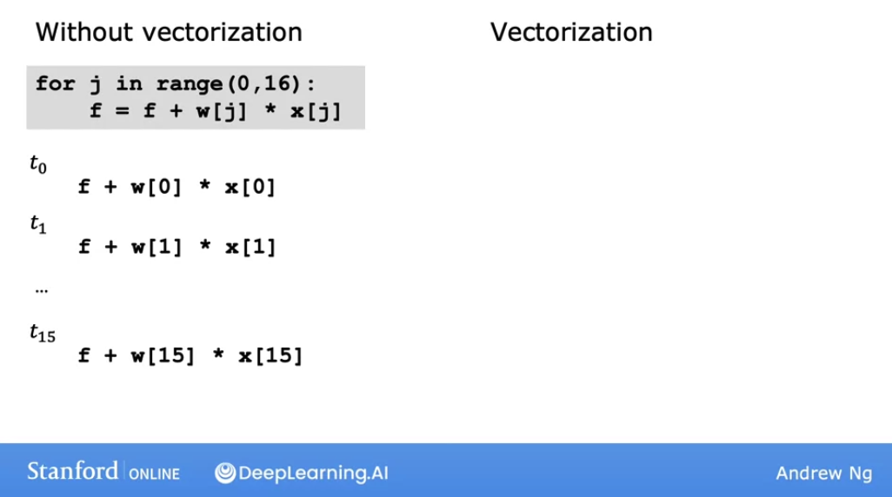
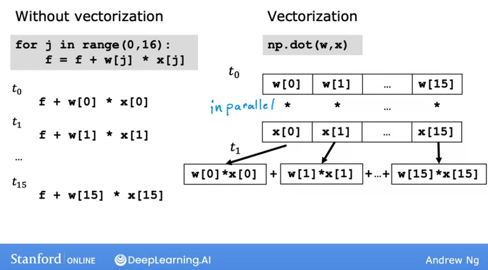
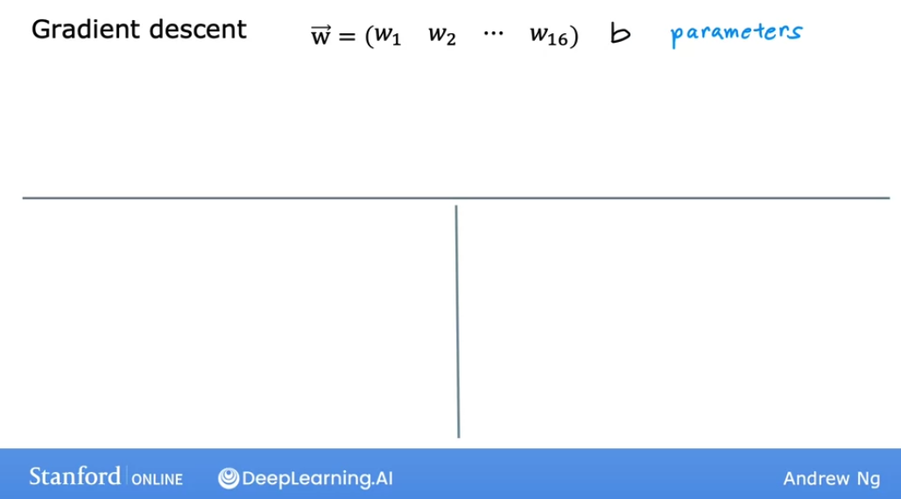
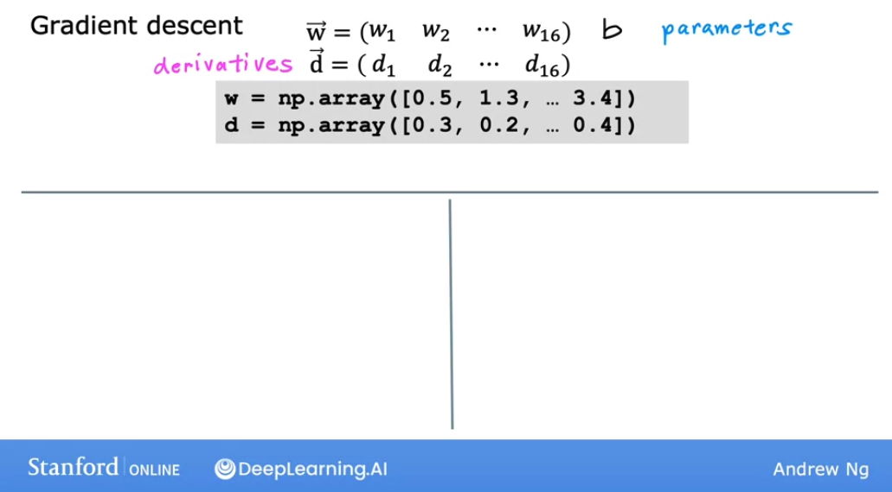
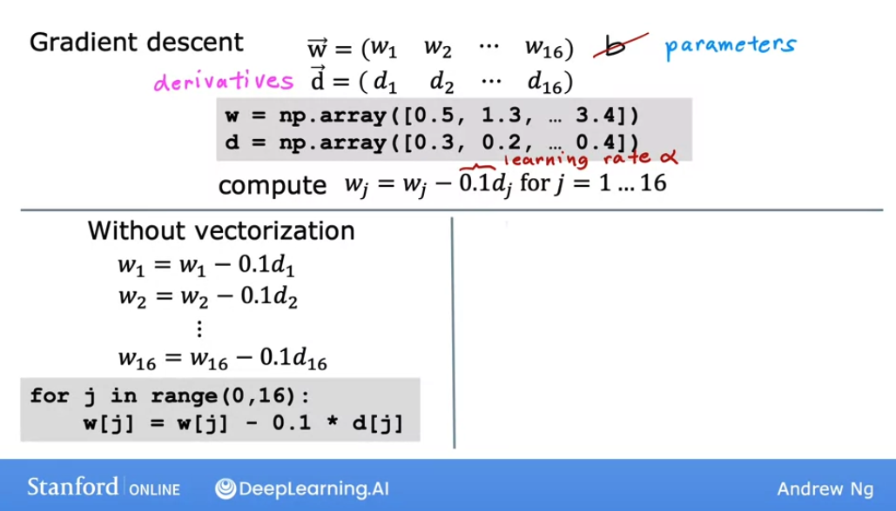

# Multiple features

## Multiple features

Let's start by looking at the version of linear regression that looks at not just one feature, but a lot of different features. In the original version of linear regression, you had a single feature $x$, the size of the house, and you're able to predict $y$, the price of the house.


But now, what if, on top of knowing the size of the house, you knew the number of bedrooms, the number of floors and the age of the home in years? This looks like it woud give you much more information with which to predict the price:


We'l introduce new notation:


See in the image above, how each feature is now represented by an $x$ with a subscript:

$x_j$, where $j$ is the $j^(th)$ feature
$n$ is the total number of features, in this case $4$

As before, we will use $x^{(i)}$ to denote the $i^{th}$ training example. But since now any $x^{(i)}$ will be a list of four numbers, $x$ will be a vector that includes all the features, and we represent it like so:

$$\vec{x}^{(i)}$$


As a concrete example, when $i = 2$:

$$\vec{x}^{(2)} = [1416, 3, 2, 40]$$

To refer to a specific examples, we use:

${\vec{x}}_j^{(i)}$, where $j$ is the number of the feature in in $i^{th}$ training example.

So for example:

${\vec{x}}_3^{(2)} = 2$


Let's now look what a model would look like:


Notice that now for each feature, we have a parameter $w$, so for $n$ features, our model will look like:

$$f_{w,b} = w_1x_1 + w_2x_2 + ... + w_nx_n + b$$

Now we are going to introduce new notation to rewrite the equation above:

If we have a vector $\vec{w}$ that holds all the parameters $w$, like so:

$$ \vec{w} = [w_1\space w_2\space w_3\space ...\space w_n ]$$

In the formula above, we also have $b$, which is just a scalar number.

$\vec{w}$ and $b$ together are the **parameters of the model**.

Then we also have the vector $\vec{x}$ for all the features:

$$ \vec{x} = [x_1\space x_2\space x_3\space ...\space x_n ]$$


So now we can rewrite the model as:

$$ f_{\vec{w}, b} (\vec{x}) = \vec{w} \cdot \vec{x} + b$$

where we use the dot product for the multiplication between the vectors.


This is called **multiple linear regresssion**.

This is **NOT MULTIVARIATE REGRESSION**

## Vectorization - Part 1

When you're implementing a learning algorithm, using **vectorization** will not only make your code shorter but also make it run much more efficiently. Learning how to write vectorized code will allow you to also take advantage of modern numerical linear algebra libraries (such as numPy), as well as maybe even GPU hardware (graphics processing unit), hardware objectively designed to speed up computer graphics in your computer, but which can be used when you write vectorized code to help you execute your code much more quickly.

let's look at a concrete example of what vectorization means: 

Let's start with an example with parameters $\vec{w}$ and $b$, with $n = 3$ (number of features).

In Python code, using numPy, you define these like so:

```py
w = np.array([1.0, 2.5, -3.3])
b = 4
x = np.array(10, 20, 30)
```


Notice the difference in the indexing: **in linear algebra we start with 1, while in Python and numPy the first value is accessed with index 0**.

Now let's look an implementation without vectorization for this model:

$$f_{\vec{w},b} \vec{x} = w_1x_1 + w_2x_2 + w_3x_3 + b$$

In code, this would look like:

```py
f = w[0] * x[0] + w[1] * x[1] + w[2] * x[2] + b
```

You could do it like this, but what if instead of $n =3$, you had $n = 10000$? It would be inefficient for you to code, and for the comptuer to compute. 

Another way, without using vectorization, but using summation and a for-loop in the code would be:

$$f_{\vec{w},b} (\vec{x})= \sum_{j=1}^n w_j  x_j + b$$

And the code:

```py
f = 0
for j in range(0, n):
  f = f + w[j] * x[j]
f = f + b
```

This still doesn't use vectorization and is not efficient.

So let's see how we can do this using **vectorization**:

$$f_{\vec{w},b} (\vec{x})= \vec{w} \cdot \vec{x} + b$$

```py
f = np.dot(w, x) + b
```

This implements the mathematical dot product between the vectors $\vec{w}$ and $\vec{x}$, and adds $b$ at the end.

Especially when $n$ is large, this will **run much faster than the two previous code examples**.

Vectorization has two distinct benefits:

- makes the code shorter and more concise, easier to understand
- makes the code run much faster 

The reason it runs faster is because, behind the scenes, the **numPy** dot functions uses parallel hardware in computers to do calculations (both in normal CPUs and in GPUs).

## Vectorization - Part 2

Let's figure out how vectorized calculations take much less time than doing non-vectorized calculations, by taking a look at how they work on a computer behind the scenes.

Let's first take a look at this for-loop, which runs without vectorization:

```py
for j in range(0, 16):
  f = f + w[j] * x[j]
```

We can see that `j` ranges from 0 to 15, and the computer runs the operations sequentially, one after the other.



In contrast, the following function in numPy is implementened in the computer hardware with vectorization:

```py
np.dot(w, x)
```

Now, the computer gets all the values of vectors `w` and `x` and, **in a single step**, it multiples each pair within `w` and `x` with each other, parallely, at the same time. This is done in timestap $t_0$.

After that, in a subsequent step $t_1$, the computer takes the 16 numbers that are the result of the multiplications and adds them all together using specialized hardware, to add them altogether efficiently.



This matters more when you're running algorithms on large data sets or trying to train large models, which is often the case with machine learning.

Let's now take a look at a concrete example, with 16 features and 16 parameters (apart from `b`, so 17 in total):



And now you calculate 16 **derivative** terms for each of the 16 weights `w`, and store them in a numPy array:



```py
w = np.array([0.5, 1.3, ..., 3.4])
d = np.array([0.3, 0,2, ..., 0.4])
```
For this example, let's first ignore the parameter **b**.

Now, we need to compute the update for each of these 16 parameters: so $w_j$ is updated by $w_j$ minus the learning rate $alpha$, times $d_j$ (the derivative), for $j$ being 1 through 16.

$$ w_j = w_j - 0.1 d_j \space\text{for}\space j = 1 ... 16 $$

In code, without vectorization you would be doing something like this:

```py
for j in range(16):
  w[j] = w[j] - 0.1*d[j]
```



In contrast, with vectorization, you can imagine the computer parallel processing power like this: it takes all sixteen values in the vector and substracts, in parallel, `0.1` times the values in in vector `d` and assigns all sixteen calculations back to `w`, all at the same time and all in one step.

In code, you'd have:

```py
w = w - 0.1 * d
```

In the background, the comptuer takes these numPy arrays `w` and `d` and uses parallel processing to carry out the 16 calculations at the same time.

## Optional Lab - Python, NumPy and Vectorization

Importing numpy:

```py
import numpy as np
import time
```

$\vec{\mathbf{x}}$

Data creation routines in NumPy will generally have a first parameter which is the shape of the object. This can either be a single value for a 1-D result or a tuple (n,m,...) specifying the shape of the result. Below are examples of creating vectors using these routines.

**NumPy routines which allocate memory and fill arrays with value:**
```py
a = np.zeros(4)
print(f"np.zeros(4) :   a = {a}, a shape = {a.shape}, a data type = {a.dtype}")
# np.zeros(4) :   a = [0. 0. 0. 0.], a shape = (4,), a data type = float64

a = np.zeros((4,))
print(f"np.zeros(4,) :  a = {a}, a shape = {a.shape}, a data type = {a.dtype}")
# np.zeros(4,) :  a = [0. 0. 0. 0.], a shape = (4,), a data type = float64

a = np.random.random_sample(4)
print(f"np.random.random_sample(4): a = {a}, a shape = {a.shape}, a data type = {a.dtype}")
# np.random.random_sample(4): a = [0.48086073 0.54874874 0.25354602 0.37859087], a shape = (4,), a data type = float64
```

Some data creation routines do not take a shape tuple:
**NumPy routines which allocate memory and fill arrays with value but do not accept shape as input argument**
```py
a = np.arange(4.)
print(f"np.arange(4.):     a = {a}, a shape = {a.shape}, a data type = {a.dtype}")
# np.arange(4.):     a = [0. 1. 2. 3.], a shape = (4,), a data type = float64

a = np.random.rand(4)
print(f"np.random.rand(4): a = {a}, a shape = {a.shape}, a data type = {a.dtype}")
# np.random.rand(4): a = [0.36752644 0.77074865 0.44402351 0.37667294], a shape = (4,), a data type = float64
```

Values can be specified manually as well.
**NumPy routines which allocate memory and fill with user specified values**
```py
a = np.array([5,4,3,2]))
print(f"np.array([5,4,3,2]):  a = {a},     a shape = {a.shape}, a data type = {a.dtype}"
# np.array([5,4,3,2]):  a = [5 4 3 2],     a shape = (4,), a data type = int64

a = np.array([5.,4,3,2])
print(f"np.array([5.,4,3,2]): a = {a}, a shape = {a.shape}, a data type = {a.dtype}")
# np.array([5.,4,3,2]): a = [5. 4. 3. 2.], a shape = (4,), a data type = float64
```
These have all created a one-dimensional vector  `a` with four elements. `a.shape` returns the dimensions. Here we see a.shape = `(4,)` indicating a 1-d array with 4 elements.  

**Indexing in vectors**

```py
#vector indexing operations on 1-D vectors
a = np.arange(10)
print(a)
# [0 1 2 3 4 5 6 7 8 9]

#access an element
print(f"a[2].shape: {a[2].shape} a[2]  = {a[2]}, Accessing an element returns a scalar")
# a[2].shape: () a[2]  = 2, Accessing an element returns a scalar

# access the last element, negative indexes count from the end
print(f"a[-1] = {a[-1]}")
# a[-1] = 9

#indexs must be within the range of the vector or they will produce and error
try:
    c = a[10]
except Exception as e:
    print("The error message you'll see is:")
    print(e)
# The error message you'll see is:
# index 10 is out of bounds for axis 0 with size 10
```

**Slicing vectors**

Slicing creates an array of indices using a set of three values (`start:stop:step`). A subset of values is also valid. Its use is best explained by example:

```py
#vector slicing operations
a = np.arange(10)
print(f"a         = {a}")

#access 5 consecutive elements (start:stop:step)
c = a[2:7:1];     print("a[2:7:1] = ", c)

# access 3 elements separated by two 
c = a[2:7:2];     print("a[2:7:2] = ", c)

# access all elements index 3 and above
c = a[3:];        print("a[3:]    = ", c)

# access all elements below index 3
c = a[:3];        print("a[:3]    = ", c)

# access all elements
c = a[:];         print("a[:]     = ", c)

# a         = [0 1 2 3 4 5 6 7 8 9]
# a[2:7:1] =  [2 3 4 5 6]
# a[2:7:2] =  [2 4 6]
# a[3:]    =  [3 4 5 6 7 8 9]
# a[:3]    =  [0 1 2]
# a[:]     =  [0 1 2 3 4 5 6 7 8 9]
```

**Single vector operations**

```py
a = np.array([1,2,3,4])
print(f"a             : {a}")
# a             : [1 2 3 4]

# negate elements of a
b = -a 
print(f"b = -a        : {b}")
# b = -a        : [-1 -2 -3 -4]

# sum all elements of a, returns a scalar
b = np.sum(a) 
print(f"b = np.sum(a) : {b}")
# b = np.sum(a) : 10

# get the mean of all values in a vector
b = np.mean(a)
print(f"b = np.mean(a): {b}")
# b = np.mean(a): 2.5

# exponentiate all values in vector to a given power
b = a**2
print(f"b = a**2      : {b}")
# b = a**2      : [ 1  4  9 16]
```

**Vector Vector element-wise operations**
Most of the NumPy arithmetic, logical and comparison operations apply to vectors as well. These operators work on an element-by-element basis. For example 
$$ c_i = a_i + b_i $$

```py
a = np.array([ 1, 2, 3, 4])
b = np.array([-1,-2, 3, 4])
print(f"Binary operators work element wise: {a + b}")
# Binary operators work element wise: [0 0 6 8]
```

Of course, for this to work correctly, the vectors must be of the same size:

```py
#try a mismatched vector operation
c = np.array([1, 2])
try:
    d = a + c
except Exception as e:
    print("The error message you'll see is:")
    print(e)
# The error message you'll see is:
# operands could not be broadcast together with shapes (4,) (2,) 
```

**Scalar-Vector operations**

Vectors can be 'scaled' by scalar values. A scalar value is just a number. The scalar multiplies all the elements of the vector.
```py
a = np.array([1, 2, 3, 4])

# multiply a by a scalar
b = 5 * a 
print(f"b = 5 * a : {b}")
# b = 5 * a : [ 5 10 15 20]
```

**Vector-vector dot product**

The dot product is a mainstay of Linear Algebra and NumPy. This is an operation used extensively in this course and should be well understood.

The dot product multiplies the values in two vectors element-wise and then sums the result.
Vector dot product requires the dimensions of the two vectors to be the same.

Let's implement our own version of the dot product below:

**Using a for loop**, implement a function which returns the dot product of two vectors. The function to return given inputs $a$ and $b$:
$$ x = \sum_{i=0}^{n-1} a_i b_i $$
Assume both `a` and `b` are the same shape.

```py
def my_dot(a, b): 
    """
   Compute the dot product of two vectors
 
    Args:
      a (ndarray (n,)):  input vector 
      b (ndarray (n,)):  input vector with same dimension as a
    
    Returns:
      x (scalar): 
    """
    x=0
    # Loop through the number of features in any of the vectors,
    # (should match for both) - in this case, 4 (from 0 to 3 included)
    for i in range(a.shape[0]):
        x = x + a[i] * b[i]
    return x

# test 1-D
a = np.array([1, 2, 3, 4])
b = np.array([-1, 4, 3, 2])
print(f"my_dot(a, b) = {my_dot(a, b)}")
# my_dot(a, b) = 24
```

Note, the dot product is expected to return a scalar value. 

Let's try the same operations using `np.dot`.  

```py
# test 1-D
a = np.array([1, 2, 3, 4])
b = np.array([-1, 4, 3, 2])
c = np.dot(a, b)
print(f"NumPy 1-D np.dot(a, b) = {c}, np.dot(a, b).shape = {c.shape} ")
# NumPy 1-D np.dot(a, b) = 24, np.dot(a, b).shape = () 

c = np.dot(b, a)
print(f"NumPy 1-D np.dot(b, a) = {c}, np.dot(a, b).shape = {c.shape} ")
# NumPy 1-D np.dot(b, a) = 24, np.dot(a, b).shape = () 

```

**The Need for Speed: vector vs for loop**
We utilized the NumPy  library because it improves speed memory efficiency. Let's demonstrate:

```py
np.random.seed(1)
a = np.random.rand(10000000)  # very large arrays
b = np.random.rand(10000000)

tic = time.time()  # capture start time
c = np.dot(a, b)
toc = time.time()  # capture end time

print(f"np.dot(a, b) =  {c:.4f}")
print(f"Vectorized version duration: {1000*(toc-tic):.4f} ms ")

tic = time.time()  # capture start time
c = my_dot(a,b)
toc = time.time()  # capture end time

print(f"my_dot(a, b) =  {c:.4f}")
print(f"loop version duration: {1000*(toc-tic):.4f} ms ")

del(a);del(b)  #remove these big arrays from memory
```
And notice the results:
```py
# np.dot(a, b) =  2501072.5817
# Vectorized version duration: 157.3179 ms 
# my_dot(a, b) =  2501072.5817
# loop version duration: 9340.0886 ms 
```
So, vectorization provides a large speed up in this example. This is because NumPy makes better use of available data parallelism in the underlying hardware. GPU's and modern CPU's implement Single Instruction, Multiple Data (SIMD) pipelines allowing multiple operations to be issued in parallel. This is critical in Machine Learning where the data sets are often very large.

**Vector-Vector operations in Course 1**
Vector-Vector operations will appear frequently in course 1. Here is why:
- Going forward, our examples will be stored in an array, `X_train` of dimension (m,n). This will be explained more in context, but here it is important to note it is a 2 Dimensional array or matrix (see next section on matrices).
- `w` will be a 1-dimensional vector of shape (n,).
- we will perform operations by looping through the examples, extracting each example to work on individually by indexing X. For example:`X[i]`
- `X[i]` returns a value of shape (n,), a 1-dimensional vector. Consequently, operations involving `X[i]` are often vector-vector.  

That is a somewhat lengthy explanation, but aligning and understanding the shapes of your operands is important when performing vector operations.

```py
# show common Course 1 example
X = np.array([[1],[2],[3],[4]])
w = np.array([2])
c = np.dot(X[1], w)

print(f"X[1] has shape {X[1].shape}")
print(f"w has shape {w.shape}")
print(f"c has shape {c.shape}")
# X[1] has shape (1,)
# w has shape (1,)
# c has shape ()
```

**Matrices**

Matrices, are two dimensional arrays. The elements of a matrix are all of the same type. In notation, matrices are denoted with capitol, bold letter such as $\mathbf{X}$. In this and other labs, `m` is often the number of rows and `n` the number of columns. The elements of a matrix can be referenced with a two dimensional index. In math settings, numbers in the index typically run from 1 to n. In computer science and these labs, indexing will run from 0 to n-1.  
<figure>
    <center> <center/>
    <figcaption> Generic Matrix Notation, 1st index is row, 2nd is column </figcaption>
</figure>

**Matrix creation**

The same functions that created 1-D vectors will create 2-D or n-D arrays. Here are some examples.

Below, the shape tuple is provided to achieve a 2-D result. Notice how NumPy uses brackets to denote each dimension. Notice further than NumPy, when printing, will print one row per line.

```py
a = np.zeros((1, 5))                                       
print(f"a shape = {a.shape}, a = {a}")                     
# a shape = (1, 5), a = [[0. 0. 0. 0. 0.]]

a = np.zeros((3, 1))                                                                   
print(f"a shape = {a.shape}, a = {a}") 
# a shape = (3, 1), a = [[0.]
#  [0.]
#  [0.]]

a = np.random.random_sample((1, 1))  
print(f"a shape = {a.shape}, a = {a}")
# a shape = (1, 1), a = [[0.04997798]]
```

One can also manually specify data. Dimensions are specified with additional brackets matching the format in the printing above.
```py
a = np.array([[5], [4], [3]])
print(f" a shape = {a.shape}, np.array: a = {a}")
#  a shape = (3, 1), np.array: a = [[5]
#  [4]
#  [3]]

a = np.array([[5],   # One can also
              [4],   # separate values
              [3]]); #into separate rows
print(f" a shape = {a.shape}, np.array: a = {a}")
#  a shape = (3, 1), np.array: a = [[5]
#  [4]
#  [3]]
```
Notice how both matrices are actually the same.

**Indexing on matrices**

Matrices include a second index. The two indexes describe [row, column]. Access can either return an element or a row/column. See below:

```py
#vector indexing operations on matrices
a = np.arange(6).reshape(-1, 2)   #reshape is a convenient way to create matrices
print(f"a.shape: {a.shape}, \na= {a}")
# a.shape: (3, 2), 
# a= [[0 1]
#  [2 3]
#  [4 5]]

#access an element
print(f"\na[2,0].shape:   {a[2, 0].shape}, a[2,0] = {a[2, 0]},     type(a[2,0]) = {type(a[2, 0])} Accessing an element returns a scalar\n")
# a[2,0].shape:   (), a[2,0] = 4,     type(a[2,0]) = <class 'numpy.int64'> Accessing an element returns a scalar

#access a row
print(f"a[2].shape:   {a[2].shape}, a[2]   = {a[2]}, type(a[2])   = {type(a[2])}")
# a[2].shape:   (2,), a[2]   = [4 5], type(a[2])   = <class 'numpy.ndarray'>
```
It is worth drawing attention to the last example. Accessing a matrix by just specifying the row will return a *1-D vector*.

**Reshape**  
The previous example used [reshape](https://numpy.org/doc/stable/reference/generated/numpy.reshape.html) to shape the array.  
```py
a = np.arange(6).reshape(-1, 2) 
```   
This line of code first created a *1-D Vector* of six elements. It then reshaped that vector into a *2-D* array using the reshape command. This could have been written:
```py
a = np.arange(6).reshape(3, 2)
```
To arrive at the same 3 row, 2 column array.
The -1 argument tells the routine to compute the number of rows given the size of the array and the number of columns.


**Slicing**

Slicing creates an array of indices using a set of three values (`start:stop:step`). A subset of values is also valid. Its use is best explained by example:

```py
#vector 2-D slicing operations
a = np.arange(20).reshape(-1, 10)
print(f"a = \n{a}")
# a = 
# [[ 0  1  2  3  4  5  6  7  8  9]
#  [10 11 12 13 14 15 16 17 18 19]]

#access 5 consecutive elements with (start:stop:step) from row of index 0
print("a[0, 2:7:1] = ", a[0, 2:7:1], ",  a[0, 2:7:1].shape =", a[0, 2:7:1].shape, "a 1-D array")
# a[0, 2:7:1] =  [2 3 4 5 6] ,  a[0, 2:7:1].shape = (5,) a 1-D array

#access 5 consecutive elements (start:stop:step) in two rows
print("a[:, 2:7:1] = \n", a[:, 2:7:1], ",  a[:, 2:7:1].shape =", a[:, 2:7:1].shape, "a 2-D array")
# a[:, 2:7:1] = 
#  [[ 2  3  4  5  6]
#  [12 13 14 15 16]] ,  a[:, 2:7:1].shape = (2, 5) a 2-D array

# access all elements
print("a[:,:] = \n", a[:,:], ",  a[:,:].shape =", a[:,:].shape)
# a[:,:] = 
#  [[ 0  1  2  3  4  5  6  7  8  9]
#  [10 11 12 13 14 15 16 17 18 19]] ,  a[:,:].shape = (2, 10)

# access all elements in one row (very common usage)
print("a[1,:] = ", a[1,:], ",  a[1,:].shape =", a[1,:].shape, "a 1-D array")
# a[1,:] =  [10 11 12 13 14 15 16 17 18 19] ,  a[1,:].shape = (10,) a 1-D array

# same as
print("a[1]   = ", a[1],   ",  a[1].shape   =", a[1].shape, "a 1-D array")
# a[1]   =  [10 11 12 13 14 15 16 17 18 19] ,  a[1].shape   = (10,) a 1-D array
```