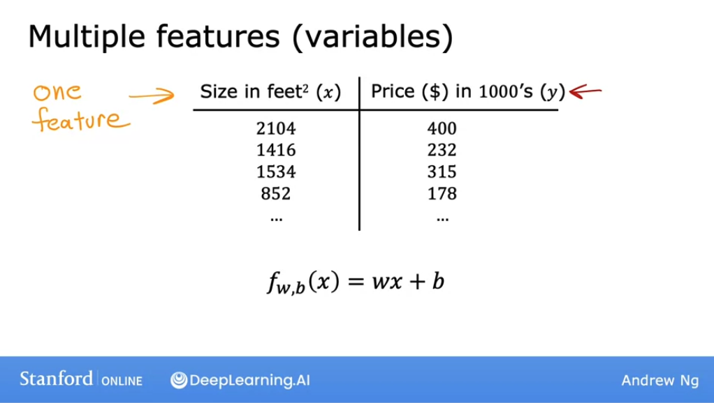
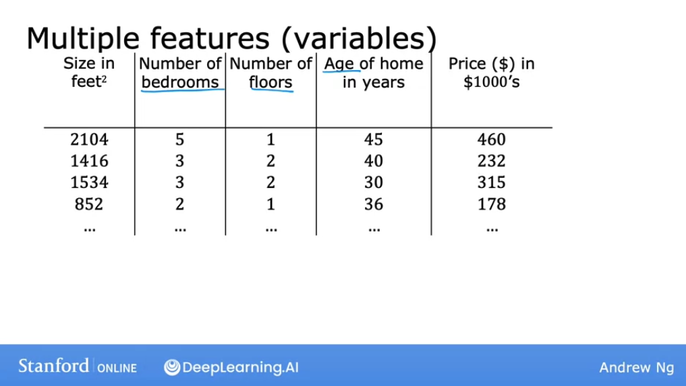
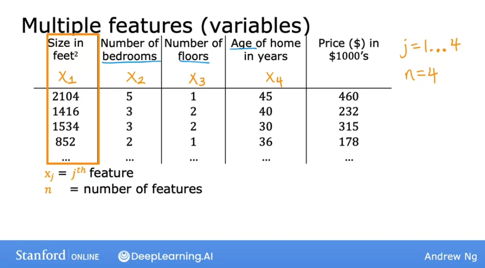
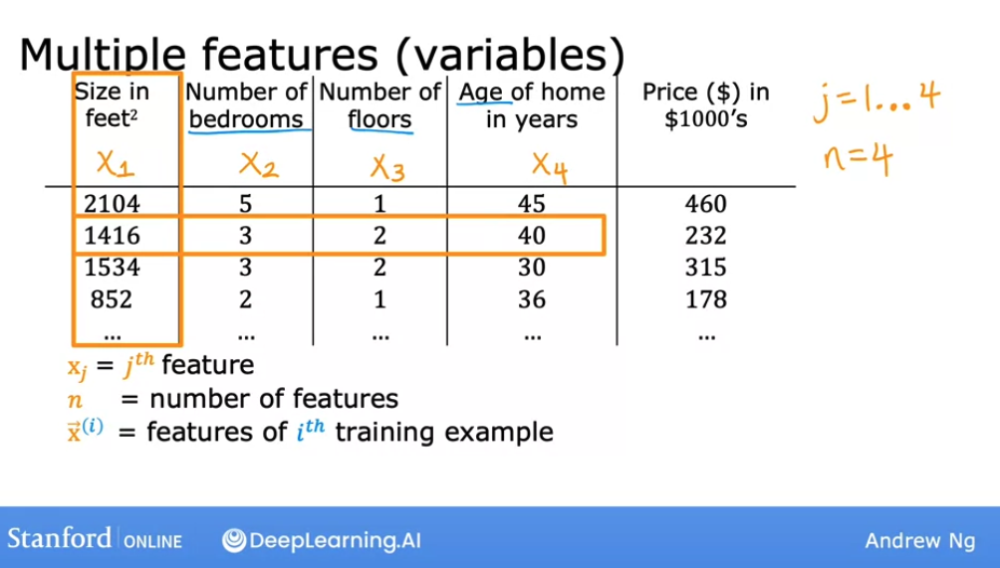
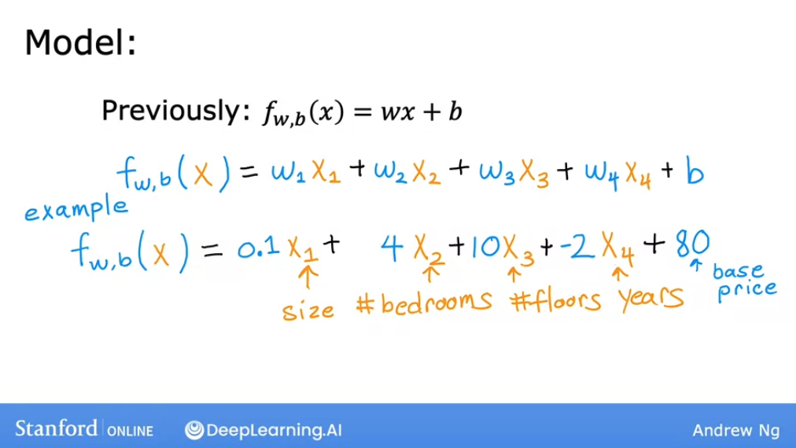
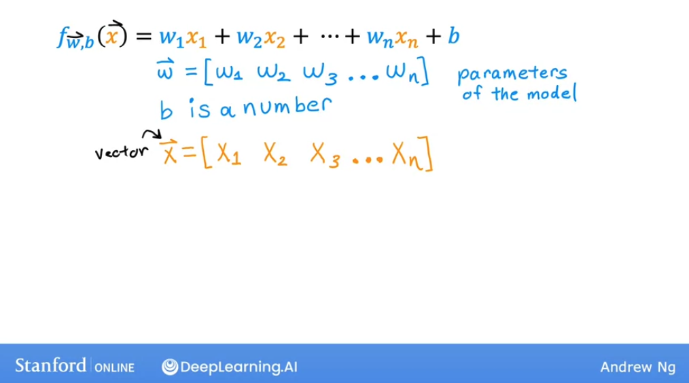
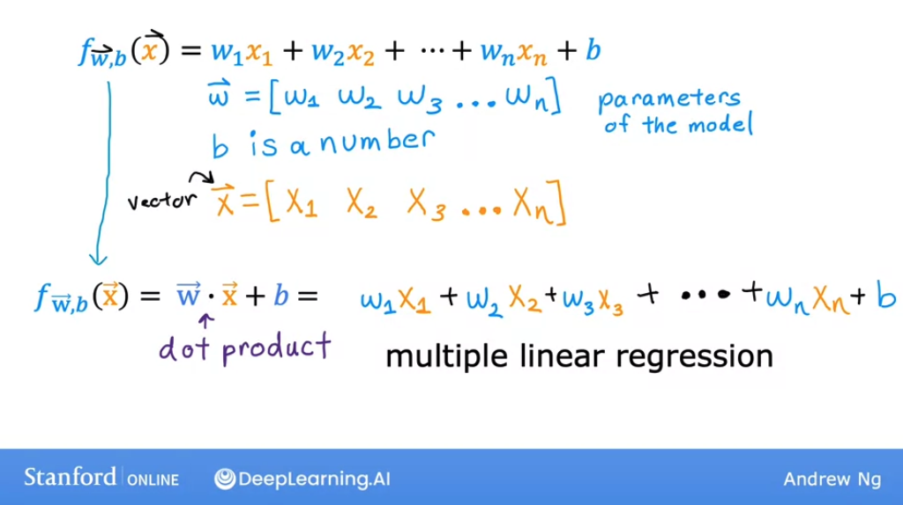
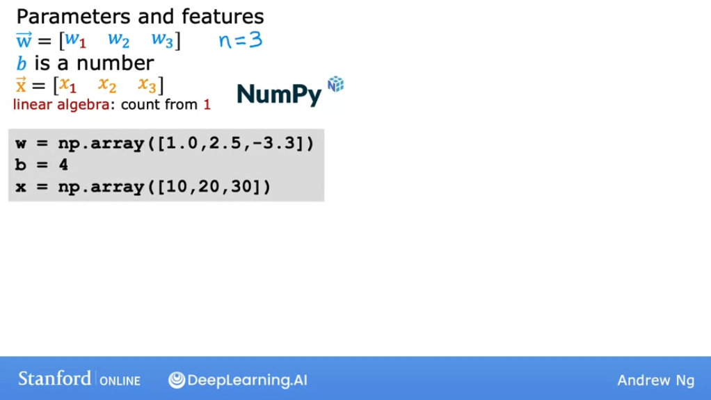

# Multiple features

## Multiple features

Let's start by looking at the version of linear regression that looks at not just one feature, but a lot of different features. In the original version of linear regression, you had a single feature $x$, the size of the house, and you're able to predict $y$, the price of the house.



But now, what if, on top of knowing the size of the house, you knew the number of bedrooms, the number of floors and the age of the home in years? This looks like it woud give you much more information with which to predict the price:



We'l introduce new notation:



See in the image above, how each feature is now represented by an $x$ with a subscript:

$x_j$, where $j$ is the $j^(th)$ feature
$n$ is the total number of features, in this case $4$

As before, we will use $x^{(i)}$ to denote the $i^{th}$ training example. But since now any $x^{(i)}$ will be a list of four numbers, $x$ will be a vector that includes all the features, and we represent it like so:

$$\vec{x}^{(i)}$$



As a concrete example, when $i = 2$:

$$\vec{x}^{(2)} = [1416, 3, 2, 40]$$

To refer to a specific examples, we use:

${\vec{x}}_j^{(i)}$, where $j$ is the number of the feature in in $i^{th}$ training example.

So for example:

${\vec{x}}_3^{(2)} = 2$


Let's now look what a model would look like:



Notice that now for each feature, we have a parameter $w$, so for $n$ features, our model will look like:

$$f_{w,b} = w_1x_1 + w_2x_2 + ... + w_nx_n + b$$

Now we are going to introduce new notation to rewrite the equation above:

If we have a vector $\vec{w}$ that holds all the parameters $w$, like so:

$$ \vec{w} = [w_1\space w_2\space w_3\space ...\space w_n ]$$

In the formula above, we also have $b$, which is just a scalar number.

$\vec{w}$ and $b$ together are the **parameters of the model**.

Then we also have the vector $\vec{x}$ for all the features:

$$ \vec{x} = [x_1\space x_2\space x_3\space ...\space x_n ]$$



So now we can rewrite the model as:

$$ f_{\vec{w}, b} (\vec{x}) = \vec{w} \cdot \vec{x} + b$$

where we use the dot product for the multiplication between the vectors.



This is called **multiple linear regresssion**.

This is **NOT MULTIVARIATE REGRESSION**

## Vectorization - Part 1

When you're implementing a learning algorithm, using **vectorization** will not only make your code shorter but also make it run much more efficiently. Learning how to write vectorized code will allow you to also take advantage of modern numerical linear algebra libraries (such as numPy), as well as maybe even GPU hardware (graphics processing unit), hardware objectively designed to speed up computer graphics in your computer, but which can be used when you write vectorized code to help you execute your code much more quickly.

let's look at a concrete example of what vectorization means: 

Let's start with an example with parameters $\vec{w}$ and $b$, with $n = 3$ (number of features).

In Python code, using numPy, you define these like so:

```py
w = np.array([1.0, 2.5, -3.3])
b = 4
x = np.array(10, 20, 30)
```



Notice the difference in the indexing: **in linear algebra we start with 1, while in Python and numPy the first value is accessed with index 0**.

Now let's look an implementation without vectorization for this model:

$$f_{\vec{w},b} \vec{x} = w_1x_1 + w_2x_2 + w_3x_3 + b$$

In code, this would look like:

```py
f = w[0] * x[0] + w[1] * x[1] + w[2] * x[2] + b
```

You could do it like this, but what if instead of $n =3$, you had $n = 10000$? It would be inefficient for you to code, and for the comptuer to compute. 

Another way, without using vectorization, but using summation and a for-loop in the code would be:

$$f_{\vec{w},b} (\vec{x})= \sum_{j=1}^n w_j  x_j + b$$

And the code:

```py
f = 0
for j in range(0, n):
  f = f + w[j] * x[j]
f = f + b
```

This still doesn't use vectorization and is not efficient.

So let's see how we can do this using **vectorization**:

$$f_{\vec{w},b} (\vec{x})= \vec{w} \cdot \vec{x} + b$$

```py
f = np.dot(w, x) + b
```

This implements the mathematical dot product between the vectors $\vec{w}$ and $\vec{x}$, and adds $b$ at the end.

Especially when $n$ is large, this will **run much faster than the two previous code examples**.

Vectorization has two distinct benefits:

- makes the code shorter and more concise, easier to understand
- makes the code run much faster 

The reason it runs faster is because, behind the scenes, the **numPy** dot functions uses parallel hardware in computers to do calculations (both in normal CPUs and in GPUs).

## Vectorization - Part 2

Let's figure out how vectorized calculations take much less time than doing non-vectorized calculations.