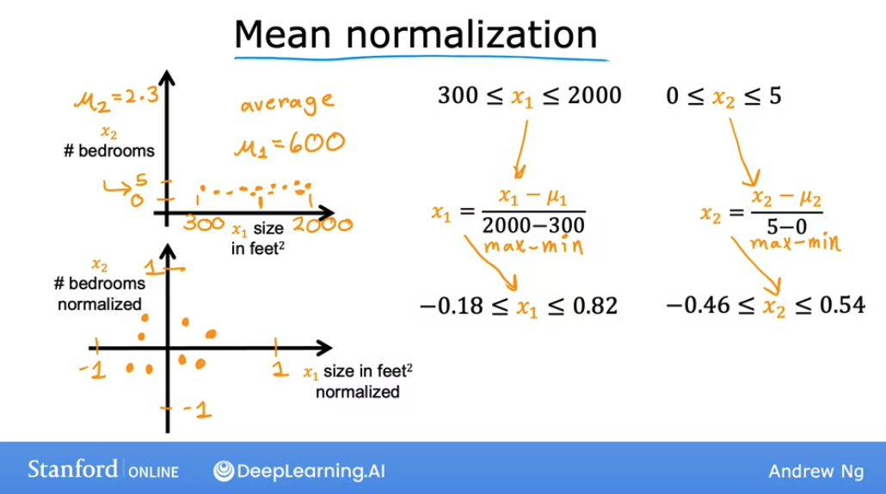

# Gradient descent in practice

## Feature scaling - Part 1

Let's take a look at techinques that will make gradient descent work much better.

We will now see a feature called **feature scaling**, which enables gradient descent to run much faster.

Let's first take a look at the **relationsjip between the size of a feature**, i.e. how big are the number for that feature, and the size of its associated parameter ($w$).

As a concrete example, let's predict the price of a house using two features: $x_1$, the size of the house and $x_2$ the number of bedrooms.

$x_1$ typically ranges from 300 to 2000 square feet, while for $x_2$ the data ranges from 0 to 5 bedrooms. Thus, $x_1$ takes a relatively large range of values, while $x_2$ takes a relatively short range of values.

So if we look at an example of a house that has a size of 2000 square feet and 5 bedrooms, and a price of \$500k, what should reasonable values for the size of parameters $w_1$ and $w_2$ be?


Let's try by taking a look at one possible set of parameters: say $w_1$ is 50 and $w_2$ is 0.1 and $b$ is 50 for the purposes of discussion.

So:

$$ w_1 = 50 \space\space\space w_2 = 0.1 \space\space\space b = 50$$

And thus:

$$ \text{price} = 50 * 2000 + 0.1 * 5 + 50 = 100000k$$

100.000k (100 million dollars) is very far from the actual price of $500.000. So this is not a good set of parameter choices for $w_1$ and $w_2$.

Now, let's turn $w_1$ and $w_2$ around: 

So:

$$ w_1 = 0.1 \space\space\space w_2 = 50 \space\space\space b = 50$$

And thus:

$$ \text{price} = 50 * 0.1 + 0.1 * 50 + 50 = 500k$$

So notice that this version of the model predicts a price of $500,000 which is a much more reasonable estimate and happens to be the same price as the true price of the house.

So hopefully you might notice that:
- when a possible range of values of a feature is large (like the size in square feet - which goes all the way up to 2000) **it's more likely that a good model will learn to choose a relatively small parameter value** (like 0.1.) 
- when the possible values of the feature are small, like the number of bedrooms, **then a reasonable value for its parameters will be relatively large** like 50

So how does this relate to gradient descent? Let's take a look at the scatter plot of the features, where the size in square feet is the horizontal axis $x_1$, while the number of bedroooms $x_2$ is on the vertical axis. 

If you plot the training data, you'll notice that the horizontal axis is on a much larger scale -or much larger range of values- compared to the vertical axis.


Let's take a look at how the **cost function** will look on a **contour plot**:


You can see that the horizontal axis has a much narrower range than the vertical (in this example, between 0 and 1), while on the verical axis, it takes on much larger values (like between 10 and 100).

So the contours form **ovals or ellipses** which are shorter on the horizontal direction and longer on the vertical 

The reason for this is that **a small change in $w_1$ will have a large impact on the estimated price and thus a large impact on the cost $J(\vec{\mathbf{x}},b)$**, because $w_1$ is multiplied by a very large number (the size in square feet in this case).

In contrast, **it takes a much larger changes in $w_2$ in order to change the predictions much, and thus, small changes in $w_2$ don't change the cost function $J$ nearly as much**.

So what's the problem with this? What this might cause is that, when running gradient descent with the data as-is, **the algorithm will end up bouncing back and forth for a long time before it can finally find its way to the global minimum, because the contours are so tall and skinny.**


In situations like this, a useful thing to do is to **scale the features**: performing some transformation of your training data, so that $x_1$ now ranges from 0 to 1, and $x_2$ has the same range as well. And that makes the data points on the graph more uniformly scattered:


You can see also that the new sacles on the plot are different than those on the graph on the top. **The key point that the new scales for $x_1$ and $x_2$ have now comparable ranges of values to each other.**

And if you run a gradient descent on a cost function with these rescales features, the **the contours will look more like circles, and less tall and skinny.** And the gradient descent **can find a much more direct path to the global minimum**.


## Feature scaling - Part 2

Let's look at how you can implement feature scaling, to take features that take on very different ranges of values and scale them to have comparable ranges of values to each other. 

So, how do you actually scale features? 

### Dividing by max value

If $x_1$ ranges from 3 to 2000, you can scale that feature by **taking each original $x_1$ value and dividing it by the largest value in the range**, in this case 200.

$$ 300 \le x_1 \le 2000$$
$$ x_1,scaled = \frac{x_1}{2000}$$
$$ 0.15 \le x_1,scaled \le 1$$

And the same is true for $x_2$:
$$ 0 \le x_2 \le 5$$
$$ x_2,scaled = \frac{x_2}{5}$$
$$ 0 \le x_2,scaled \le 1$$

Notice how the scatterplot of datapoints looks now:


### Mean normalization

With **mean normalization** we rescale our features so that they are centered around 0, which means that we will now have negative and positive values, usually betwen -1 and 1.

To calculate it, first calculate the average of the data range ($\mu$).

So if the average of $x_1$ is 600, substract the average from each value and divide everything over the range (maximum value minus minimum value):

$$ x_1 = \frac{x_1 - \mu}{max_{range}-min_{range}}$$

So we can do this for the max and the min values in the ranges:
$$ 300 \le x_1 \le 2000$$
$$ x_{1,scaled} = \frac{x_1 - \mu}{2000-300}$$
$$ -0.18 \le x_{1,scaled} \le 0.82$$

And same for $x_2$ which has an average of 2.3:

$$ 0 \le x_2 \le 5$$
$$ x_{2,scaled} = \frac{x_2 - \mu}{5 - 0}$$
$$ -0.46 \le x_{2,scaled} \le 0.54$$

And notice how the scatterplot looks:



### Z-score normalization

This needs the calculation of the standard deviation $\sigma$ of each feature (additionally to the average). And the calculation is as follows:

$$ 300 \le x_1 \le 2000$$
$$ x_{1,scaled} = \frac{x_1 - \mu_1}{\sigma_1}$$
$$ -0.67 \le x_{1,scaled} \le 3.1$$

And same for $x_2$:

$$ 0 \le x_2 \le 5$$
$$ x_{2,scaled} = \frac{x_2 - \mu_2}{\sigma_2}$$
$$ -1.6 \le x_{2,scaled} \le 1.9$$

And the graph looks like:


### Rules of thumb for feature scaling

As a rule of thumb, when performing feature scaling, we want to aim for getting the features to range from approximately $-1$ to $1$:

$$ \text{aim for about -1}\le x_j \le 1 \space \text{for each feature} \space x_j$$

These values can be flexible, values near those values are acceptable. We must be really careful to rescale when the values **are either too large or too small**:


When in doubt, rescale, since there is no harm in doing it.

## Checking gradient descent for convergence

When running gradient descent, how can you tell if the algorithm is converging? That is: whether it's helping you to find parameters close to the global minimum of the cost function. 

By learning to recognize what a well-running implementation of gradient descent looks like, we will also be better able to choose a good learning rate $\alpha$.

A good way to make sure that the gradient descent is working well is to **plot the cost function $J$ against each iteration of gradient descent**:


This curve is called a **learning curve**. 

Concretely if you look at the pink point on the curve, at 100 iterations, it means that after 100 iterations of gradient descent, the cost J is the value indicated by the vertical axis. And same for 200 iterations:


Looking at this graph helps you to see how the cost $J$ changes after each iteration of gradient descent: if gradient descent is working properly, then **the cost $J$ should decrease after every single iteration**. If $J$ ever increases after one iteration, that means either $\alpha$ is chosen poorly (it usually means $\alpha$ is too large), or there could be a bug in the code.

Another useful thing that this curve can tell you is that by the time you reach around 300 iterations, the cost $J$ is leveling off and is no longer decreasing much. By 400 iterations, it looks like the curve has flattened out. **This means that gradient descent has more or less converged because the curve is no longer decreasing.**

> The number of iterations that gradient descent takes to converge can vary a lot between different applications. In one application, it may converge after 30 iterations, while for others it amke take 1000 or 100,000 iterations.
> It turns out to be very difficult to tell in advance how many iterations gradient descent needs to converge, which is why a learning curve is useful.

Another way to decide when your model is done training is with an **automatic convergence test.**

In this techine, one chooses an epsilon ($\epsilon$) representing a small number. If the cost $J$ decreases by less than this number in one iteration, then you're likely on the flattened part of the curve and you can declare **convergence**.

However, choosing the right threshold epsilon is pretty difficult.

## Choosing a learning rate

Let's take a look at how we can choose a good learning rate for your model.

Concretely, if you plot the cost for a number of iterations and notice that the costs sometimes goes up and sometimes goes down, you should take that as a clear sign that gradient descent is not working properly.

This can be because of two reasons:
- a bug in the code
- the learning rate $\alpha$ is too large

In this case, as we have already seen, what's happening is that our gradient descent algorithm is overshooting over the minimum.


To fix this, simply decrease your learning rate until you see your cost consistently decrease until you reach a global minimum.

For debugging purposes: **with a small enough learning rate ($\alpha$), $J$ should decrease on every iteration**.

This means that if you find that your current choice of alpha is not making you cost decrease, you can try to replace it by a very small value just to test if it decreases after a small number of iterations. Once that is checked, alpha should be increased again to a rational value that makes the algorithm run acceptably fast.

## Optional Lab: Feature scaling and learning rate

[LINK](https://www.coursera.org/learn/machine-learning/ungradedLab/kIf25/optional-lab-feature-scaling-and-learning-rate/lab?path=%2Fnotebooks%2FC1_W2_Lab03_Feature_Scaling_and_Learning_Rate_Soln.ipynb)

[Local file](./labs/Week%202/Optional%20Lab%20-%20Feature%20scaling%20and%20learning%20rate.ipynb)

**Goals**
In this lab you will:
- Utilize  the multiple variables routines developed in the previous lab
- run Gradient Descent on a data set with multiple features
- explore the impact of the *learning rate alpha* on gradient descent
- improve performance of gradient descent by *feature scaling* using z-score normalization

**Problem Statement**

As in the previous labs, you will use the motivating example of housing price prediction. The training data set contains many examples with 4 features (size, bedrooms, floors and age) shown in the table below. Note, in this lab, the Size feature is in sqft while earlier labs utilized 1000 sqft.  This data set is larger than the previous lab.

We would like to build a linear regression model using these values so we can then predict the price for other houses - say, a house with 1200 sqft, 3 bedrooms, 1 floor, 40 years old. 

**Dataset**
| Size (sqft) | Number of Bedrooms  | Number of floors | Age of  Home | Price (1000s dollars)  |   
| ----------------| ------------------- |----------------- |--------------|----------------------- |  
| 952             | 2                   | 1                | 65           | 271.5                  |  
| 1244            | 3                   | 2                | 64           | 232                    |  
| 1947            | 3                   | 2                | 17           | 509.8                  |  
| ...             | ...                 | ...              | ...          | ...                    |

```py
# load the dataset
X_train, y_train = load_house_data()
X_features = ['size(sqft)','bedrooms','floors','age']
```

Let's first view the dataset and its features by plotting each feature versus price.

```py
fig,ax=plt.subplots(1, 4, figsize=(12, 3), sharey=True)
for i in range(len(ax)):
    ax[i].scatter(X_train[:,i],y_train)
    ax[i].set_xlabel(X_features[i])
ax[0].set_ylabel("Price (1000's)")
plt.show()
```

Plotting each feature vs. the target, price, provides some indication of which features have the strongest influence on price. Above:
- increasing size also increases price
- bedrooms and floors don't seem to have a strong impact on price
- newer houses have higher prices than older houses.

**Reminder: gradient descent with multiple variables**

Gradient Descent With Multiple Variables
Here are the equations you developed in the last lab on gradient descent for multiple variables.:

$$\begin{align*} \text{repeat}&\text{ until convergence:} \; \lbrace \newline\;
& w_j := w_j -  \alpha \frac{\partial J(\mathbf{w},b)}{\partial w_j} \tag{1}  \; & \text{for j = 0..n-1}\newline
&b\ \ := b -  \alpha \frac{\partial J(\mathbf{w},b)}{\partial b}  \newline \rbrace
\end{align*}$$

where, n is the number of features, parameters $w_j$,  $b$, are updated simultaneously and where  

$$
\begin{align}
\frac{\partial J(\mathbf{w},b)}{\partial w_j}  &= \frac{1}{m} \sum\limits_{i = 0}^{m-1} (f_{\mathbf{w},b}(\mathbf{x}^{(i)}) - y^{(i)})x_{j}^{(i)} \tag{2}  \\
\frac{\partial J(\mathbf{w},b)}{\partial b}  &= \frac{1}{m} \sum\limits_{i = 0}^{m-1} (f_{\mathbf{w},b}(\mathbf{x}^{(i)}) - y^{(i)}) \tag{3}
\end{align}
$$
* m is the number of training examples in the data set

    
*  $f_{\mathbf{w},b}(\mathbf{x}^{(i)})$ is the model's prediction, while $y^{(i)}$ is the target value

**Learning rate**

The lectures discussed some of the issues related to setting the learning rate $\alpha$. The learning rate controls the size of the update to the parameters. See equation (1) above. It is shared by all the parameters.  

Let's run gradient descent and try a few settings of $\alpha$ on our data set:

1. **$\alpha$ = 9.9e-7**

```py
#set alpha to 9.9e-7
_, _, hist = run_gradient_descent(X_train, y_train, 10, alpha = 9.9e-7)

Iteration Cost          w0       w1       w2       w3       b       djdw0    djdw1    djdw2    djdw3    djdb  
---------------------|--------|--------|--------|--------|--------|--------|--------|--------|--------|--------|
        0 9.55884e+04  5.5e-01  1.0e-03  5.1e-04  1.2e-02  3.6e-04 -5.5e+05 -1.0e+03 -5.2e+02 -1.2e+04 -3.6e+02
        1 1.28213e+05 -8.8e-02 -1.7e-04 -1.0e-04 -3.4e-03 -4.8e-05  6.4e+05  1.2e+03  6.2e+02  1.6e+04  4.1e+02
        2 1.72159e+05  6.5e-01  1.2e-03  5.9e-04  1.3e-02  4.3e-04 -7.4e+05 -1.4e+03 -7.0e+02 -1.7e+04 -4.9e+02
        3 2.31358e+05 -2.1e-01 -4.0e-04 -2.3e-04 -7.5e-03 -1.2e-04  8.6e+05  1.6e+03  8.3e+02  2.1e+04  5.6e+02
        4 3.11100e+05  7.9e-01  1.4e-03  7.1e-04  1.5e-02  5.3e-04 -1.0e+06 -1.8e+03 -9.5e+02 -2.3e+04 -6.6e+02
        5 4.18517e+05 -3.7e-01 -7.1e-04 -4.0e-04 -1.3e-02 -2.1e-04  1.2e+06  2.1e+03  1.1e+03  2.8e+04  7.5e+02
        6 5.63212e+05  9.7e-01  1.7e-03  8.7e-04  1.8e-02  6.6e-04 -1.3e+06 -2.5e+03 -1.3e+03 -3.1e+04 -8.8e+02
        7 7.58122e+05 -5.8e-01 -1.1e-03 -6.2e-04 -1.9e-02 -3.4e-04  1.6e+06  2.9e+03  1.5e+03  3.8e+04  1.0e+03
        8 1.02068e+06  1.2e+00  2.2e-03  1.1e-03  2.3e-02  8.3e-04 -1.8e+06 -3.3e+03 -1.7e+03 -4.2e+04 -1.2e+03
        9 1.37435e+06 -8.7e-01 -1.7e-03 -9.1e-04 -2.7e-02 -5.2e-04  2.1e+06  3.9e+03  2.0e+03  5.1e+04  1.4e+03
w,b found by gradient descent: w: [-0.87 -0.   -0.   -0.03], b: -0.00
```
It appears the learning rate is too high.  The solution does not converge. Cost is *increasing* rather than decreasing. Let's plot the result:

```py
plot_cost_i_w(X_train, y_train, hist)
```

The plot on the right shows the value of one of the parameters, $w_0$. At each iteration, it is overshooting the optimal value and as a result, cost ends up *increasing* rather than approaching the minimum. Note that this is not a completely accurate picture as there are 4 parameters being modified each pass rather than just one. 

(This plot is only showing $w_0$ with the other parameters fixed at benign values. In this and later plots you may notice the blue and orange lines being slightly off.)

2. **$\alpha$ = 9e-7**

Let's try a bit smaller value and see what happens.
```py
#set alpha to 9e-7
_,_,hist = run_gradient_descent(X_train, y_train, 10, alpha = 9e-7)

Iteration Cost          w0       w1       w2       w3       b       djdw0    djdw1    djdw2    djdw3    djdb  
---------------------|--------|--------|--------|--------|--------|--------|--------|--------|--------|--------|
        0 6.64616e+04  5.0e-01  9.1e-04  4.7e-04  1.1e-02  3.3e-04 -5.5e+05 -1.0e+03 -5.2e+02 -1.2e+04 -3.6e+02
        1 6.18990e+04  1.8e-02  2.1e-05  2.0e-06 -7.9e-04  1.9e-05  5.3e+05  9.8e+02  5.2e+02  1.3e+04  3.4e+02
        2 5.76572e+04  4.8e-01  8.6e-04  4.4e-04  9.5e-03  3.2e-04 -5.1e+05 -9.3e+02 -4.8e+02 -1.1e+04 -3.4e+02
        3 5.37137e+04  3.4e-02  3.9e-05  2.8e-06 -1.6e-03  3.8e-05  4.9e+05  9.1e+02  4.8e+02  1.2e+04  3.2e+02
        4 5.00474e+04  4.6e-01  8.2e-04  4.1e-04  8.0e-03  3.2e-04 -4.8e+05 -8.7e+02 -4.5e+02 -1.1e+04 -3.1e+02
        5 4.66388e+04  5.0e-02  5.6e-05  2.5e-06 -2.4e-03  5.6e-05  4.6e+05  8.5e+02  4.5e+02  1.2e+04  2.9e+02
        6 4.34700e+04  4.5e-01  7.8e-04  3.8e-04  6.4e-03  3.2e-04 -4.4e+05 -8.1e+02 -4.2e+02 -9.8e+03 -2.9e+02
        7 4.05239e+04  6.4e-02  7.0e-05  1.2e-06 -3.3e-03  7.3e-05  4.3e+05  7.9e+02  4.2e+02  1.1e+04  2.7e+02
        8 3.77849e+04  4.4e-01  7.5e-04  3.5e-04  4.9e-03  3.2e-04 -4.1e+05 -7.5e+02 -3.9e+02 -9.1e+03 -2.7e+02
        9 3.52385e+04  7.7e-02  8.3e-05 -1.1e-06 -4.2e-03  8.9e-05  4.0e+05  7.4e+02  3.9e+02  1.0e+04  2.5e+02
w,b found by gradient descent: w: [ 7.74e-02  8.27e-05 -1.06e-06 -4.20e-03], b: 0.00
```
Cost is decreasing throughout the run showing that alpha is not too large. 
```py
plot_cost_i_w(X_train, y_train, hist)
```

On the left, you see that cost is decreasing as it should. On the right, you can see that $w_0$ is still oscillating around the minimum, but it is decreasing each iteration rather than increasing. Note above that `dj_dw[0]` changes sign with each iteration as `w[0]` jumps over the optimal value.
**This alpha value will converge.** You can vary the number of iterations to see how it behaves.

3. **$\alpha$ = 1e-7**

Let's try a bit smaller value for $\alpha$ and see what happens.

```py
#set alpha to 1e-7
_,_,hist = run_gradient_descent(X_train, y_train, 10, alpha = 1e-7)

Iteration Cost          w0       w1       w2       w3       b       djdw0    djdw1    djdw2    djdw3    djdb  
---------------------|--------|--------|--------|--------|--------|--------|--------|--------|--------|--------|
        0 4.42313e+04  5.5e-02  1.0e-04  5.2e-05  1.2e-03  3.6e-05 -5.5e+05 -1.0e+03 -5.2e+02 -1.2e+04 -3.6e+02
        1 2.76461e+04  9.8e-02  1.8e-04  9.2e-05  2.2e-03  6.5e-05 -4.3e+05 -7.9e+02 -4.0e+02 -9.5e+03 -2.8e+02
        2 1.75102e+04  1.3e-01  2.4e-04  1.2e-04  2.9e-03  8.7e-05 -3.4e+05 -6.1e+02 -3.1e+02 -7.3e+03 -2.2e+02
        3 1.13157e+04  1.6e-01  2.9e-04  1.5e-04  3.5e-03  1.0e-04 -2.6e+05 -4.8e+02 -2.4e+02 -5.6e+03 -1.8e+02
        4 7.53002e+03  1.8e-01  3.3e-04  1.7e-04  3.9e-03  1.2e-04 -2.1e+05 -3.7e+02 -1.9e+02 -4.2e+03 -1.4e+02
        5 5.21639e+03  2.0e-01  3.5e-04  1.8e-04  4.2e-03  1.3e-04 -1.6e+05 -2.9e+02 -1.5e+02 -3.1e+03 -1.1e+02
        6 3.80242e+03  2.1e-01  3.8e-04  1.9e-04  4.5e-03  1.4e-04 -1.3e+05 -2.2e+02 -1.1e+02 -2.3e+03 -8.6e+01
        7 2.93826e+03  2.2e-01  3.9e-04  2.0e-04  4.6e-03  1.4e-04 -9.8e+04 -1.7e+02 -8.6e+01 -1.7e+03 -6.8e+01
        8 2.41013e+03  2.3e-01  4.1e-04  2.1e-04  4.7e-03  1.5e-04 -7.7e+04 -1.3e+02 -6.5e+01 -1.2e+03 -5.4e+01
        9 2.08734e+03  2.3e-01  4.2e-04  2.1e-04  4.8e-03  1.5e-04 -6.0e+04 -1.0e+02 -4.9e+01 -7.5e+02 -4.3e+01
w,b found by gradient descent: w: [2.31e-01 4.18e-04 2.12e-04 4.81e-03], b: 0.00
```
Cost is decreasing throughout the run, showing that $\alpha$ is not too large. 
```py
plot_cost_i_w(X_train, y_train, hist)
```


On the left, you see that cost is decreasing as it should. On the right you can see that $w_0$ is decreasing without crossing the minimum. Note above that `dj_w0` is negative throughout the run. This solution will also converge, though not quite as quickly as the previous example.

**Feature Scaling**

The lectures described the importance of rescaling the dataset so the features have a similar range.

Let's look again at the situation with **$\alpha$ = 9e-7**. This is pretty close to the maximum value we can set $\alpha$  to without diverging. This is a short run showing the first few iterations:


Above, while cost is being decreased, its clear that $w_0$ is making more rapid progress than the other parameters due to its much larger gradient.

The graphic below shows the result of a very long run with $\alpha$ = 9e-7. This takes several hours.


Above, you can see cost decreased slowly after its initial reduction. Notice the difference between `w0` and `w1`,`w2`,`w3` as well as  `dj_dw0` and `dj_dw1-3`. `w0` reaches its near final value very quickly and `dj_dw0` has quickly decreased to a small value showing that `w0` is near the final value. The other parameters were reduced much more slowly.

Why is this?  Is there something we can improve? See below:


The figure above shows why $w$'s are updated unevenly. 
- $\alpha$ is shared by all parameter updates ($w$'s and $b$).
- the common error term is multiplied by the features for the $w$'s. (not $b$).
- the features vary significantly in magnitude making some features update much faster than others. In this case, $w_0$ is multiplied by 'size(sqft)', which is generally > 1000,  while $w_1$ is multiplied by 'number of bedrooms', which is generally 2-4. 
    
The solution is **Feature Scaling.**

The lectures discussed three different techniques: 
- Feature scaling, essentially dividing each positive feature by its maximum value, or more generally, rescale each feature by both its minimum and maximum values using (x-min)/(max-min). Both ways normalizes features to the range of -1 and 1, where the former method works for positive features which is simple and serves well for the lecture's example, and the latter method works for any features.
- Mean normalization: $x_i := \dfrac{x_i - \mu_i}{max - min} $ 
- Z-score normalization which we will explore below. 


**z-score normalization**
After z-score normalization, all features will have a mean of 0 and a standard deviation of 1.

To implement z-score normalization, adjust your input values as shown in this formula:
$$x^{(i)}_j = \dfrac{x^{(i)}_j - \mu_j}{\sigma_j} \tag{4}$$ 
where $j$ selects a feature or a column in the $\mathbf{X}$ matrix. $µ_j$ is the mean of all the values for feature (j) and $\sigma_j$ is the standard deviation of feature (j).
$$
\begin{align}
\mu_j &= \frac{1}{m} \sum_{i=0}^{m-1} x^{(i)}_j \tag{5}\\
\sigma^2_j &= \frac{1}{m} \sum_{i=0}^{m-1} (x^{(i)}_j - \mu_j)^2  \tag{6}
\end{align}
$$

>**Implementation Note:** When normalizing the features, it is important
to store the values used for normalization - the mean value and the standard deviation used for the computations. After learning the parameters
from the model, we often want to predict the prices of houses we have not
seen before. Given a new x value (living room area and number of bed-
rooms), we must first normalize x using the mean and standard deviation
that we had previously computed from the training set.

**Implementation**

```py
def zscore_normalize_features(X):
    """
    computes  X, zcore normalized by column
    
    Args:
      X (ndarray (m,n))     : input data, m examples, n features
      
    Returns:
      X_norm (ndarray (m,n)): input normalized by column
      mu (ndarray (n,))     : mean of each feature
      sigma (ndarray (n,))  : standard deviation of each feature
    """
    # find the mean of each column/feature
    mu     = np.mean(X, axis=0)                 # mu will have shape (n,)
    # find the standard deviation of each column/feature
    sigma  = np.std(X, axis=0)                  # sigma will have shape (n,)
    # element-wise, subtract mu for that column from each example, divide by std for that column
    X_norm = (X - mu) / sigma      

    return (X_norm, mu, sigma)
 
#check our work - this does the same as above, but with scikit-learn
from sklearn.preprocessing import scale
scale(X_orig, axis=0, with_mean=True, with_std=True, copy=True)
```

Let's look at the steps involved in Z-score normalization. The plot below shows the transformation step by step.

```py
mu     = np.mean(X_train,axis=0)   
sigma  = np.std(X_train,axis=0) 
X_mean = (X_train - mu)
X_norm = (X_train - mu)/sigma      

fig,ax=plt.subplots(1, 3, figsize=(12, 3))
ax[0].scatter(X_train[:,0], X_train[:,3])
ax[0].set_xlabel(X_features[0]); ax[0].set_ylabel(X_features[3]);
ax[0].set_title("unnormalized")
ax[0].axis('equal')

ax[1].scatter(X_mean[:,0], X_mean[:,3])
ax[1].set_xlabel(X_features[0]); ax[0].set_ylabel(X_features[3]);
ax[1].set_title(r"X - $\mu$")
ax[1].axis('equal')

ax[2].scatter(X_norm[:,0], X_norm[:,3])
ax[2].set_xlabel(X_features[0]); ax[0].set_ylabel(X_features[3]);
ax[2].set_title(r"Z-score normalized")
ax[2].axis('equal')
plt.tight_layout(rect=[0, 0.03, 1, 0.95])
fig.suptitle("distribution of features before, during, after normalization")
plt.show()
```


The plot above shows the relationship between two of the training set parameters, "age" and "size(sqft)". *These are plotted with equal scale*. 
- Left: Unnormalized: The range of values or the variance of the 'size(sqft)' feature is much larger than that of age
- Middle: The first step removes the mean or average value from each feature. This leaves features that are centered around zero. It's difficult to see the difference for the 'age' feature, but 'size(sqft)' is clearly around zero.
- Right: The second step divides by the standard deviation. This leaves both features centered at zero with a similar scale.

Let's normalize the data and compare it to the original data.

```py
# normalize the original features
X_norm, X_mu, X_sigma = zscore_normalize_features(X_train)
print(f"X_mu = {X_mu}, \nX_sigma = {X_sigma}")
print(f"Peak to Peak range by column in Raw        X:{np.ptp(X_train,axis=0)}")   
print(f"Peak to Peak range by column in Normalized X:{np.ptp(X_norm,axis=0)}")
```
```py
X_mu = [1.42e+03 2.72e+00 1.38e+00 3.84e+01], 
X_sigma = [411.62   0.65   0.49  25.78]
Peak to Peak range by column in Raw        X:[2.41e+03 4.00e+00 1.00e+00 9.50e+01]
Peak to Peak range by column in Normalized X:[5.85 6.14 2.06 3.69]
```
The peak to peak range of each column **is reduced from a factor of thousands to a factor of 2-3 by normalization.**

```py
fig,ax=plt.subplots(1, 4, figsize=(12, 3))
for i in range(len(ax)):
    norm_plot(ax[i],X_train[:,i],)
    ax[i].set_xlabel(X_features[i])
ax[0].set_ylabel("count");
fig.suptitle("distribution of features before normalization")
plt.show()
fig,ax=plt.subplots(1,4,figsize=(12,3))
for i in range(len(ax)):
    norm_plot(ax[i],X_norm[:,i],)
    ax[i].set_xlabel(X_features[i])
ax[0].set_ylabel("count"); 
fig.suptitle("distribution of features after normalization")

plt.show()
```


Notice, above, the range of the normalized data (x-axis) is centered around zero and roughly +/- 2. Most importantly, the range (x-axis) is similar for each feature.

Let's re-run our gradient descent algorithm with normalized data.
Note the **vastly larger value of alpha**. This will speed up gradient descent.

```py
w_norm, b_norm, hist = run_gradient_descent(X_norm, y_train, 1000, 1.0e-1, )

Iteration Cost          w0       w1       w2       w3       b       djdw0    djdw1    djdw2    djdw3    djdb  
---------------------|--------|--------|--------|--------|--------|--------|--------|--------|--------|--------|
        0 5.76170e+04  8.9e+00  3.0e+00  3.3e+00 -6.0e+00  3.6e+01 -8.9e+01 -3.0e+01 -3.3e+01  6.0e+01 -3.6e+02
      100 2.21086e+02  1.1e+02 -2.0e+01 -3.1e+01 -3.8e+01  3.6e+02 -9.2e-01  4.5e-01  5.3e-01 -1.7e-01 -9.6e-03
      200 2.19209e+02  1.1e+02 -2.1e+01 -3.3e+01 -3.8e+01  3.6e+02 -3.0e-02  1.5e-02  1.7e-02 -6.0e-03 -2.6e-07
      300 2.19207e+02  1.1e+02 -2.1e+01 -3.3e+01 -3.8e+01  3.6e+02 -1.0e-03  5.1e-04  5.7e-04 -2.0e-04 -6.9e-12
      400 2.19207e+02  1.1e+02 -2.1e+01 -3.3e+01 -3.8e+01  3.6e+02 -3.4e-05  1.7e-05  1.9e-05 -6.6e-06 -2.7e-13
      500 2.19207e+02  1.1e+02 -2.1e+01 -3.3e+01 -3.8e+01  3.6e+02 -1.1e-06  5.6e-07  6.2e-07 -2.2e-07 -2.6e-13
      600 2.19207e+02  1.1e+02 -2.1e+01 -3.3e+01 -3.8e+01  3.6e+02 -3.7e-08  1.9e-08  2.1e-08 -7.3e-09 -2.6e-13
      700 2.19207e+02  1.1e+02 -2.1e+01 -3.3e+01 -3.8e+01  3.6e+02 -1.2e-09  6.2e-10  6.9e-10 -2.4e-10 -2.6e-13
      800 2.19207e+02  1.1e+02 -2.1e+01 -3.3e+01 -3.8e+01  3.6e+02 -4.1e-11  2.1e-11  2.3e-11 -8.1e-12 -2.7e-13
      900 2.19207e+02  1.1e+02 -2.1e+01 -3.3e+01 -3.8e+01  3.6e+02 -1.4e-12  7.0e-13  7.6e-13 -2.7e-13 -2.6e-13
w,b found by gradient descent: w: [110.56 -21.27 -32.71 -37.97], b: 363.16
```

The scaled features get very accurate results **much, much faster!**. Notice the gradient of each parameter is tiny by the end of this fairly short run. A learning rate of 0.1 is a good start for regression with normalized features.

Let's plot our predictions versus the target values. Note, the prediction is made using the normalized feature while the plot is shown using the original feature values.

```py
#predict target using normalized features
m = X_norm.shape[0]
yp = np.zeros(m)
for i in range(m):
    yp[i] = np.dot(X_norm[i], w_norm) + b_norm

# plot predictions and targets versus original features    
fig,ax=plt.subplots(1,4,figsize=(12, 3),sharey=True)
for i in range(len(ax)):
    ax[i].scatter(X_train[:,i],y_train, label = 'target')
    ax[i].set_xlabel(X_features[i])
    ax[i].scatter(X_train[:,i],yp,color=dlc["dlorange"], label = 'predict')
ax[0].set_ylabel("Price"); ax[0].legend();
fig.suptitle("target versus prediction using z-score normalized model")
plt.show()
```


The results look good. A few points to note:
- with multiple features, we can no longer have a single plot showing results versus features.
- when generating the plot, the normalized features were used. Any predictions using the parameters learned from a normalized training set must also be normalized.

**Prediction**

The point of generating our model is to use it to predict housing prices that are not in the data set. Let's predict the price of a house with 1200 sqft, 3 bedrooms, 1 floor, 40 years old. Recall, that you must normalize the data with the mean and standard deviation derived when the training data was normalized. 

```py
# First, normalize out example.
x_house = np.array([1200, 3, 1, 40])
x_house_norm = (x_house - X_mu) / X_sigma
print(x_house_norm)
# [-0.53  0.43 -0.79  0.06]

x_house_predict = np.dot(x_house_norm, w_norm) + b_norm
print(f" predicted price of a house with 1200 sqft, 3 bedrooms, 1 floor, 40 years old = ${x_house_predict*1000:0.0f}")
# predicted price of a house with 1200 sqft, 3 bedrooms, 1 floor, 40 years old = $318709
```

**Cost contours**

Another way to view feature scaling is in terms of the cost contours. **When feature scales do not match, the plot of cost versus parameters in a contour plot is asymmetric.**

In the plot below, the scale of the parameters is matched. The left plot is the cost contour plot of w[0], the square feet versus w[1], the number of bedrooms before normalizing the features. The plot is so asymmetric, the curves completing the contours are not visible. In contrast, when the features are normalized, the cost contour is much more symmetric. The result is that updates to parameters during gradient descent can make equal progress for each parameter. 

```py
plt_equal_scale(X_train, X_norm, y_train)
```


## Feature engineering


The choice of features can have a huge impact on your learning algorithm's performance. In fact, for many practical applications, choosing or entering the right features is a critical step to making the algorithm work well. 

Let's take a look at how you can **engineer the most appropiate features** for our learning algorithm.

Let's study **feature engineering** by going back to the example of predicting house prices.

If you have two features for a house:

- $x_1$ is the width of the lot (frontage)
- $x_2$ is the depth of the lot.

Assuming a rectangular shape for the plot, we can simply build a model where the features are $x_1$ and $x_2$, and it can work moderately well.

$$ f_{\vec{w},b} = w_1 x_1 + w_2 x_2 + b $$


But notice that the area of the plot can be calculated by multiplying $x_1$ and $x_2$.

We might have an intuition that the area of the land is more predictive of the price (than the frontage and depth as separate features).

So we can define a new feature, $x_3$, the area of the plot, that is defined as $x_1$ times $x_2$.

So now we can have a model that is:

$$ f_{\vec{w},b} = w_1 x_1 + w_2 x_2 + w_3 x_3 + b $$

So **the model can now choose (calculate) parameters $w_1$, $w_2$ and $w_3$ depending on whether the data shows that the frontage, the depth or the are of the lot is the most important factor for predicting the price of the house.**


This is an example of **feature engineering**: using intuition or knowledge of the data to design new features, by transforming or combining original features, to make it easier for the learning algorithm to make accurate predictions.


## Polynomial Regression

So far, we have only fitted **straight lines** to our data. Let's now take the dieas of multiple linear regression and feature engineering and combine them to come up with a new algorithm called **polynomial regression**, which allows us to fit curves, non-linear function, to your data.

If we have a housing data set that looks like this:


It doesn't look like a straight line fits this data very well. So maybe we want to fit a curve, maybe a **quadratic** function to the data, like this:

$$ f_{\vec{w},b} = w_1 x + w_2 x^2 + b $$


Notice that this includes as features a size $x$ and also $x^2$, which is the size of the house **squared**. Maybe this could give use a better fit to the data.

But then we realized that a quadractic model doesn't make much sense here because such a curve eventually comes down, and it doesn't make sense for prices to start coming down after a certain price.

So we then choose a **cubic** function, where we not only have $x^2$, we also have $x^3$, or the size of the house to the power of three.

$$ f_{\vec{w},b} = w_1 x + w_2 x^2 + w_3 x^3 + b $$


We can see in the graph the curve that this model produces, which is a somewhat better fir to the data because the price does eventually come up again as the size increases.

Both of these are examples of **polynomial regression**, because we took our original featre $x$ and raised it to two, three or any other power.

**IMPORTANT:** when we create features that are original featres to a certain power, then **features scaling becomes** increasingly important. Why? Let's take a look:

- if the size of a house ranges from 1 to 1000 ($1$ to $10^3$)
- the size squared ($x^2$) will range from 1 to 1.000.000 ($1$ to $10^6$)
- the size cubed ($x^3$) will range from 1 to 1.000.000.000 ($1$ to $10^9$)

So these new features $x^2$ and $x^3$ take **very different ranges of values** compared to the original feature of $x$. 

If we are using gradient descent, we have to use **feature scaling** to get our features into comparable ranges of values.

### Choice of features

One last example of how we really have a wide range of choirces of features to use: another reasonable alternative to taking the size squared and size cube is to use the square root of the size: $\sqrt{x}$.

And the model might look like:


$$ f_{\vec{w},b} = w_1 x + w_2 \sqrt{x} + b $$

Notice how the square root function looks: it becomes a bit less steep as $x$ increases, but it doesn't ever completely flatten out, and it never comes back down.

So, you may ask yourself: **how do I decide what features to use?** That's something we will learn in the second course of this specialization: how we can choose different features and different models that include or don't include these features, and the process for measuring how well these different models perform to help us decide which feature to include or not.

## Optional Lab: Feature Engineering and Polynomial Regression

[LINK](https://www.coursera.org/learn/machine-learning/ungradedLab/Xat0X/optional-lab-feature-engineering-and-polynomial-regression/lab?path=%2Fnotebooks%2FC1_W2_Lab04_FeatEng_PolyReg_Soln.ipynb)

[Internal link](./labs/Week%202/Optional%20lab%20-%20Feature%20engineering%20and%20Polynomial%20regression.ipynb)

In this lab, we will explore **feature engineering** and **polynomial regression**, which allow us to use the machinery of linear regression to fit very complicated (and even non-linear) functions.

First, we'll import our tools:

```py
import numpy as np
import matplotlib.pyplot as plt
from lab_utils_multi import zscore_normalize_features, run_gradient_descent_feng
np.set_printoptions(precision=2)  # reduced display precision on numpy arrays
```

### Overview

Out of the box, linear regression provides a means of building models of the form:
$$f_{\mathbf{w},b} = w_0x_0 + w_1x_1+ ... + w_{n-1}x_{n-1} + b \tag{1}$$ 
What if your features/data are non-linear or are combinations of features? For example,  Housing prices do not tend to be linear with living area but penalize very small or very large houses resulting in the curves shown in the graphic above. 

How can we use the machinery of linear regression to fit this curve? Recall, the 'machinery' we have is the ability to modify the parameters $\mathbf{w}$, $\mathbf{b}$ in (1) to 'fit' the equation to the training data. However, no amount of adjusting of $\mathbf{w}$,$\mathbf{b}$ in (1) will achieve a fit to a non-linear curve.

### Polynomial Features

Above we were considering a scenario where the data was non-linear. Let's try using what we know so far to fit a non-linear curve. We'll start with a simple quadratic: $y = 1+x^2$

You're familiar with all the routines we're using. They are available in the lab_utils.py file for review. We'll use [`np.c_[..]`](https://numpy.org/doc/stable/reference/generated/numpy.c_.html) which is a NumPy routine to concatenate along the column boundary.

```py
# create target data
x = np.arange(0, 20, 1)
y = 1 + x**2
X = x.reshape(-1, 1)

print("x", x)
print("y", y)
print("X", X)

model_w,model_b = run_gradient_descent_feng(X,y,iterations=1000, alpha = 1e-2)

plt.scatter(x, y, marker='x', c='r', label="Actual Value"); plt.title("no feature engineering")
plt.plot(x,X@model_w + model_b, label="Predicted Value");  plt.xlabel("X"); plt.ylabel("y"); plt.legend(); plt.show()
```

```py
print("x", x)
x [ 0  1  2  3  4  5  6  7  8  9 10 11 12 13 14 15 16 17 18 19]

print("y", y)
y [  1   2   5  10  17  26  37  50  65  82 101 122 145 170 197 226 257 290
 325 362]

print("X", X)
X [[ 0]
 [ 1]
 [ 2]
 [ 3]
 [ 4]
 [ 5]
 [ 6]
 [ 7]
 [ 8]
 [ 9]
 [10]
 [11]
 [12]
 [13]
 [14]
 [15]
 [16]
 [17]
 [18]
 [19]]


Iteration         0, Cost: 1.65756e+03
Iteration       100, Cost: 6.94549e+02
Iteration       200, Cost: 5.88475e+02
Iteration       300, Cost: 5.26414e+02
Iteration       400, Cost: 4.90103e+02
Iteration       500, Cost: 4.68858e+02
Iteration       600, Cost: 4.56428e+02
Iteration       700, Cost: 4.49155e+02
Iteration       800, Cost: 4.44900e+02
Iteration       900, Cost: 4.42411e+02
w,b found by gradient descent: w: [18.7], b: -52.0834
```

Well, as expected, not a great fit. What is needed is something like $y= w_0x_0^2 + b$, or a **polynomial feature**.

To accomplish this, you can modify the *input data* to *engineer* the needed features. If you swap the original data with a version that squares the $x$ value, then you can achieve $y= w_0x_0^2 + b$. Let's try it. Swap `X` for `X**2` below:

```py
# create target data
x = np.arange(0, 20, 1)
y = 1 + x**2

# Engineer features 
X = x**2      #<-- added engineered feature
```

```py
X = X.reshape(-1, 1)  #X should be a 2-D Matrix
model_w,model_b = run_gradient_descent_feng(X, y, iterations=10000, alpha = 1e-5)

plt.scatter(x, y, marker='x', c='r', label="Actual Value"); plt.title("Added x**2 feature")
plt.plot(x, np.dot(X,model_w) + model_b, label="Predicted Value"); plt.xlabel("x"); plt.ylabel("y"); plt.legend(); plt.show()
```
```py
Iteration         0, Cost: 7.32922e+03
Iteration      1000, Cost: 2.24844e-01
Iteration      2000, Cost: 2.22795e-01
Iteration      3000, Cost: 2.20764e-01
Iteration      4000, Cost: 2.18752e-01
Iteration      5000, Cost: 2.16758e-01
Iteration      6000, Cost: 2.14782e-01
Iteration      7000, Cost: 2.12824e-01
Iteration      8000, Cost: 2.10884e-01
Iteration      9000, Cost: 2.08962e-01
w,b found by gradient descent: w: [1.], b: 0.0490
```


Great! near perfect fit. Notice the values of $\mathbf{w}$ and b printed right above the graph: `w,b found by gradient descent: w: [1.], b: 0.0490`. Gradient descent modified our initial values of $\mathbf{w},b $ to be (1.0,0.049) or a model of $y=1*x_0^2+0.049$, very close to our target of $y=1*x_0^2+1$. If you ran it longer, it could be a better match. 

### Selecting Features

Above, we knew that an $x^2$ term was required. It may not always be obvious which features are required. One could add a variety of potential features to try and find the most useful. For example, what if we had instead tried : $y=w_0x_0 + w_1x_1^2 + w_2x_2^3+b$ ? 

```py
# create target data
x = np.arange(0, 20, 1)
y = x**2

# engineer features .
X = np.c_[x, x**2, x**3]   #<-- added engineered feature
```

```py
model_w,model_b = run_gradient_descent_feng(X, y, iterations=10000, alpha=1e-7)

plt.scatter(x, y, marker='x', c='r', label="Actual Value"); plt.title("x, x**2, x**3 features")
plt.plot(x, X@model_w + model_b, label="Predicted Value"); plt.xlabel("x"); plt.ylabel("y"); plt.legend(); plt.show()
```
```py
Iteration         0, Cost: 1.14029e+03
Iteration      1000, Cost: 3.28539e+02
Iteration      2000, Cost: 2.80443e+02
Iteration      3000, Cost: 2.39389e+02
Iteration      4000, Cost: 2.04344e+02
Iteration      5000, Cost: 1.74430e+02
Iteration      6000, Cost: 1.48896e+02
Iteration      7000, Cost: 1.27100e+02
Iteration      8000, Cost: 1.08495e+02
Iteration      9000, Cost: 9.26132e+01
w,b found by gradient descent: w: [0.08 0.54 0.03], b: 0.0106
```


Note the value of $\mathbf{w}$, `[0.08 0.54 0.03]` and b is `0.0106`.This implies the model after fitting/training is:
$$ y = 0.08x + 0.54x^2 + 0.03x^3 + 0.0106 $$
Gradient descent has emphasized the data that is the best fit to the $x^2$ data by increasing the $w_1$ term relative to the others.  If you were to run for a very long time, it would continue to reduce the impact of the other terms. 
>Gradient descent is picking the 'correct' features for us by emphasizing its associated parameter

Let's review this idea:
- less weight value implies less important/correct feature, and in extreme, when the weight becomes zero or very close to zero, the associated feature is not useful in fitting the model to the data.
- above, after fitting, the weight associated with the $x^2$ feature is much larger than the weights for $x$ or $x^3$ as it is the most useful in fitting the data. 

### An Alternate View
Above, polynomial features were chosen based on how well they matched the target data. Another way to think about this is to note that we are still using linear regression once we have created new features. Given that, the best features will be linear relative to the target. This is best understood with an example.

```py
# create target data
x = np.arange(0, 20, 1)
y = x**2

# engineer features .
X = np.c_[x, x**2, x**3]   #<-- added engineered feature
X_features = ['x','x^2','x^3']

print("X",X)
```
```py
X [[   0    0    0]
 [   1    1    1]
 [   2    4    8]
 [   3    9   27]
 [   4   16   64]
 [   5   25  125]
 [   6   36  216]
 [   7   49  343]
 [   8   64  512]
 [   9   81  729]
 [  10  100 1000]
 [  11  121 1331]
 [  12  144 1728]
 [  13  169 2197]
 [  14  196 2744]
 [  15  225 3375]
 [  16  256 4096]
 [  17  289 4913]
 [  18  324 5832]
 [  19  361 6859]]
```
```py
fig,ax=plt.subplots(1, 3, figsize=(12, 3), sharey=True)
for i in range(len(ax)):
    ax[i].scatter(X[:,i],y)
    ax[i].set_xlabel(X_features[i])
ax[0].set_ylabel("y")
plt.show()
```


Above, it is clear that the $x^2$ feature mapped against the target value $y$ is linear. Linear regression can then easily generate a model using that feature.

### Scaling features

As described in the last lab, if the data set has features with significantly different scales, one should apply feature scaling to speed gradient descent. In the example above, there is $x$, $x^2$ and $x^3$ which will naturally have very different scales. Let's apply Z-score normalization to our example.

```py
# create target data
x = np.arange(0,20,1)
X = np.c_[x, x**2, x**3]
print(f"Peak to Peak range by column in Raw        X:{np.ptp(X,axis=0)}")
## Peak to Peak range by column in Raw        X:[  19  361 6859]

# add mean_normalization 
X = zscore_normalize_features(X)     
print(f"Peak to Peak range by column in Normalized X:{np.ptp(X,axis=0)}")
## Peak to Peak range by column in Normalized X:[3.3  3.18 3.28]
```

Now we can try again with a more aggressive value of alpha:

```py
x = np.arange(0,20,1)
y = x**2

X = np.c_[x, x**2, x**3]
X = zscore_normalize_features(X) 

model_w, model_b = run_gradient_descent_feng(X, y, iterations=100000, alpha=1e-1)

plt.scatter(x, y, marker='x', c='r', label="Actual Value"); plt.title("Normalized x x**2, x**3 feature")
plt.plot(x,X@model_w + model_b, label="Predicted Value"); plt.xlabel("x"); plt.ylabel("y"); plt.legend(); plt.show()
```
```py
Iteration         0, Cost: 9.42147e+03
Iteration     10000, Cost: 3.90938e-01
Iteration     20000, Cost: 2.78389e-02
Iteration     30000, Cost: 1.98242e-03
Iteration     40000, Cost: 1.41169e-04
Iteration     50000, Cost: 1.00527e-05
Iteration     60000, Cost: 7.15855e-07
Iteration     70000, Cost: 5.09763e-08
Iteration     80000, Cost: 3.63004e-09
Iteration     90000, Cost: 2.58497e-10
w,b found by gradient descent: w: [5.27e-05 1.13e+02 8.43e-05], b: 123.5000
```


Feature scaling allows this to converge much faster.   
Note again the values of $\mathbf{w}$. The $w_1$ term, which is the $x^2$ term is the most emphasized. Gradient descent has all but eliminated the $x^3$ term.

### Complex Functions
With feature engineering, even quite complex functions can be modeled:

```py
x = np.arange(0,20,1)
y = np.cos(x/2)

X = np.c_[x, x**2, x**3,x**4, x**5, x**6, x**7, x**8, x**9, x**10, x**11, x**12, x**13]
X = zscore_normalize_features(X) 

model_w,model_b = run_gradient_descent_feng(X, y, iterations=1000000, alpha = 1e-1)

plt.scatter(x, y, marker='x', c='r', label="Actual Value"); plt.title("Normalized x x**2, x**3 feature")
plt.plot(x,X@model_w + model_b, label="Predicted Value"); plt.xlabel("x"); plt.ylabel("y"); plt.legend(); plt.show()
```
```py
Iteration         0, Cost: 2.20188e-01
Iteration    100000, Cost: 1.70074e-02
Iteration    200000, Cost: 1.27603e-02
Iteration    300000, Cost: 9.73032e-03
Iteration    400000, Cost: 7.56440e-03
Iteration    500000, Cost: 6.01412e-03
Iteration    600000, Cost: 4.90251e-03
Iteration    700000, Cost: 4.10351e-03
Iteration    800000, Cost: 3.52730e-03
Iteration    900000, Cost: 3.10989e-03

w,b found by gradient descent: 
w: [ -1.34 -10.    24.78   5.96 -12.49 -16.26  -9.51   0.59   8.7   11.94
   9.27   0.79 -12.82]
b: -0.0073
```

## Optional Lab: Linear Regression using Scikit-Learn

[LINK](https://www.coursera.org/learn/machine-learning/ungradedLab/uaIsm/optional-lab-linear-regression-with-scikit-learn/lab?path=%2Fnotebooks%2FC1_W2_Lab05_Sklearn_GD_Soln.ipynb)

[Internal Link](./labs/Week%202/Optional%20Lab%20-%20Linear%20Regression%20using%20Scikit-Learn.ipynb)

There is an open-source, commercially usable machine learning toolkit called [scikit-learn](https://scikit-learn.org/stable/index.html). This toolkit contains implementations of many of the algorithms that you will work with in this course.

In this lab you will:
- Utilize  scikit-learn to implement linear regression using Gradient Descent

You will utilize functions from scikit-learn as well as matplotlib and NumPy. 

```py
import numpy as np
import matplotlib.pyplot as plt
from sklearn.linear_model import SGDRegressor
from sklearn.preprocessing import StandardScaler
from lab_utils_multi import  load_house_data
from lab_utils_common import dlc
np.set_printoptions(precision=2)
plt.style.use('./deeplearning.mplstyle')
```

### Gradient Descent

Scikit-learn has a gradient descent regression model [sklearn.linear_model.SGDRegressor](https://scikit-learn.org/stable/modules/generated/sklearn.linear_model.SGDRegressor.html#examples-using-sklearn-linear-model-sgdregressor).  Like your previous implementation of gradient descent, this model performs best with normalized inputs. [sklearn.preprocessing.StandardScaler](https://scikit-learn.org/stable/modules/generated/sklearn.preprocessing.StandardScaler.html#sklearn.preprocessing.StandardScaler) will perform z-score normalization as in a previous lab. Here it is referred to as 'standard score'.

#### Load the data set

```py
X_train, y_train = load_house_data()
X_features = ['size(sqft)','bedrooms','floors','age']
```

#### Scale/normalize the training data
```py
scaler = StandardScaler()
X_norm = scaler.fit_transform(X_train)
print(f"Peak to Peak range by column in Raw        X:{np.ptp(X_train,axis=0)}")   
print(f"Peak to Peak range by column in Normalized X:{np.ptp(X_norm,axis=0)}")

# Peak to Peak range by column in Raw        X:[2.41e+03 4.00e+00 1.00e+00 9.50e+01]
# Peak to Peak range by column in Normalized X:[5.85 6.14 2.06 3.69]
```

#### Create and fit the regression model

```py
sgdr = SGDRegressor(max_iter=1000)
sgdr.fit(X_norm, y_train)
print(sgdr)
print(f"number of iterations completed: {sgdr.n_iter_}, number of weight updates: {sgdr.t_}")

# SGDRegressor(alpha=0.0001, average=False, early_stopping=False, epsilon=0.1,
#              eta0=0.01, fit_intercept=True, l1_ratio=0.15,
#              learning_rate='invscaling', loss='squared_loss', max_iter=1000,
#              n_iter_no_change=5, penalty='l2', power_t=0.25, random_state=None,
#              shuffle=True, tol=0.001, validation_fraction=0.1, verbose=0,
#              warm_start=False)
# number of iterations completed: 135, number of weight updates: 13366.0
```

#### View parameters
Note, the parameters are associated with the *normalized* input data. The fit parameters are very close to those found in the previous lab with this data.

```py
b_norm = sgdr.intercept_
w_norm = sgdr.coef_
print(f"model parameters:                   w: {w_norm}, b:{b_norm}")
print( "model parameters from previous lab: w: [110.56 -21.27 -32.71 -37.97], b: 363.16")

# model parameters:                   w: [110.26 -21.14 -32.54 -38.05], b:[363.14]
# model parameters from previous lab: w: [110.56 -21.27 -32.71 -37.97], b: 363.16
```

#### Make predictions
Predict the targets of the training data. Use both the `predict` routine and compute using $w$ and $b$.

```py
# make a prediction using sgdr.predict()
y_pred_sgd = sgdr.predict(X_norm)
# make a prediction using w,b. 
y_pred = np.dot(X_norm, w_norm) + b_norm  
print(f"prediction using np.dot() and sgdr.predict match: {(y_pred == y_pred_sgd).all()}")
# prediction using np.dot() and sgdr.predict match: True

print(f"Prediction on training set:\n{y_pred[:4]}" )
print(f"Target values \n{y_train[:4]}")
# Prediction on training set:
# [295.14 485.9  389.53 492.07]
# Target values 
# [300.  509.8 394.  540. ]
```

#### Plot Results
Let's plot the predictions versus the target values.

```py
# plot predictions and targets vs original features    
fig,ax=plt.subplots(1,4,figsize=(12,3),sharey=True)
for i in range(len(ax)):
    ax[i].scatter(X_train[:,i],y_train, label = 'target')
    ax[i].set_xlabel(X_features[i])
    ax[i].scatter(X_train[:,i],y_pred,color=dlc["dlorange"], label = 'predict')
ax[0].set_ylabel("Price"); ax[0].legend();
fig.suptitle("target versus prediction using z-score normalized model")
plt.show()
```

