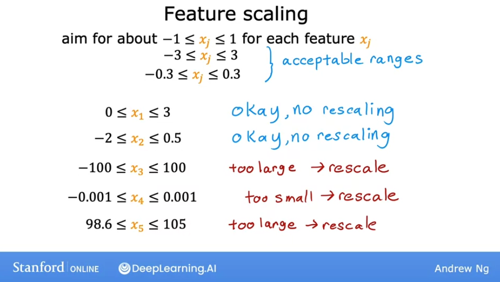

# Gradient descent in practice

## Feature scaling - Part 1

Let's take a look at techinques that will make gradient descent work much better.

We will now see a feature called **feature scaling**, which enables gradient descent to run much faster.

Let's first take a look at the **relationsjip between the size of a feature**, i.e. how big are the number for that feature, and the size of its associated parameter ($w$).

As a concrete example, let's predict the price of a house using two features: $x_1$, the size of the house and $x_2$ the number of bedrooms.

$x_1$ typically ranges from 300 to 2000 square feet, while for $x_2$ the data ranges from 0 to 5 bedrooms. Thus, $x_1$ takes a relatively large range of values, while $x_2$ takes a relatively short range of values.

So if we look at an example of a house that has a size of 2000 square feet and 5 bedrooms, and a price of \$500k, what should reasonable values for the size of parameters $w_1$ and $w_2$ be?

Let's try by taking a look at one possible set of parameters: say $w_1$ is 50 and $w_2$ is 0.1 and $b$ is 50 for the purposes of discussion.

So:

$$ w_1 = 50 \space\space\space w_2 = 0.1 \space\space\space b = 50$$

And thus:

$$ \text{price} = 50 * 2000 + 0.1 * 5 + 50 = 100000k$$

100.000k (100 million dollars) is very far from the actual price of $500.000. So this is not a good set of parameter choices for $w_1$ and $w_2$.

Now, let's turn $w_1$ and $w_2$ around: 

So:

$$ w_1 = 0.1 \space\space\space w_2 = 50 \space\space\space b = 50$$

And thus:

$$ \text{price} = 50 * 0.1 + 0.1 * 50 + 50 = 500k$$

So notice that this version of the model predicts a price of $500,000 which is a much more reasonable estimate and happens to be the same price as the true price of the house.

So hopefully you might notice that:
- when a possible range of values of a feature is large (like the size in square feet - which goes all the way up to 2000) **it's more likely that a good model will learn to choose a relatively small parameter value** (like 0.1.) 
- when the possible values of the feature are small, like the number of bedrooms, **then a reasonable value for its parameters will be relatively large** like 50

So how does this relate to gradient descent? Let's take a look at the scatter plot of the features, where the size in square feet is the horizontal axis $x_1$, while the number of bedroooms $x_2$ is on the vertical axis. 

If you plot the training data, you'll notice that the horizontal axis is on a much larger scale -or much larger range of values- compared to the vertical axis.

Let's take a look at how the **cost function** will look on a **contour plot**:

You can see that the horizontal axis has a much narrower range than the vertical (in this example, between 0 and 1), while on the verical axis, it takes on much larger values (like between 10 and 100).

So the contours form **ovals or ellipses** which are shorter on the horizontal direction and longer on the vertical 

The reason for this is that **a small change in $w_1$ will have a large impact on the estimated price and thus a large impact on the cost $J(\vec{\mathbf{x}},b)$**, because $w_1$ is multiplied by a very large number (the size in square feet in this case).

In contrast, **it takes a much larger changes in $w_2$ in order to change the predictions much, and thus, small changes in $w_2$ don't change the cost function $J$ nearly as much**.

So what's the problem with this? What this might cause is that, when running gradient descent with the data as-is, **the algorithm will end up bouncing back and forth for a long time before it can finally find its way to the global minimum, because the contours are so tall and skinny.**

In situations like this, a useful thing to do is to **scale the features**: performing some transformation of your training data, so that $x_1$ now ranges from 0 to 1, and $x_2$ has the same range as well. And that makes the data points on the graph more uniformly scattered:

You can see also that the new sacles on the plot are different than those on the graph on the top. **The key point that the new scales for $x_1$ and $x_2$ have now comparable ranges of values to each other.**

And if you run a gradient descent on a cost function with these rescales features, the **the contours will look more like circles, and less tall and skinny.** And the gradient descent **can find a much more direct path to the global minimum**.

## Feature scaling - Part 2

Let's look at how you can implement feature scaling, to take features that take on very different ranges of values and scale them to have comparable ranges of values to each other. 

So, how do you actually scale features? 

### Dividing by max value

If $x_1$ ranges from 3 to 2000, you can scale that feature by **taking each original $x_1$ value and dividing it by the largest value in the range**, in this case 200.

$$ 300 \le x_1 \le 2000$$
$$ x_1,scaled = \frac{x_1}{2000}$$
$$ 0.15 \le x_1,scaled \le 1$$

And the same is true for $x_2$:
$$ 0 \le x_2 \le 5$$
$$ x_2,scaled = \frac{x_2}{5}$$
$$ 0 \le x_2,scaled \le 1$$

Notice how the scatterplot of datapoints looks now:

### Mean normalization

With **mean normalization** we rescale our features so that they are centered around 0, which means that we will now have negative and positive values, usually betwen -1 and 1.

To calculate it, first calculate the average of the data range ($\mu$).

So if the average of $x_1$ is 600, substract the average from each value and divide everything over the range (maximum value minus minimum value):

$$ x_1 = \frac{x_1 - \mu}{max_{range}-min_{range}}$$

So we can do this for the max and the min values in the ranges:
$$ 300 \le x_1 \le 2000$$
$$ x_{1,scaled} = \frac{x_1 - \mu}{2000-300}$$
$$ -0.18 \le x_{1,scaled} \le 0.82$$

And same for $x_2$ which has an average of 2.3:

$$ 0 \le x_2 \le 5$$
$$ x_{2,scaled} = \frac{x_2 - \mu}{5 - 0}$$
$$ -0.46 \le x_{2,scaled} \le 0.54$$

And notice how the scatterplot looks:

### Z-score normalization

This needs the calculation of the standard deviation $\sigma$ of each feature (additionally to the average). And the calculation is as follows:

$$ 300 \le x_1 \le 2000$$
$$ x_{1,scaled} = \frac{x_1 - \mu_1}{\sigma_1}$$
$$ -0.67 \le x_{1,scaled} \le 3.1$$

And same for $x_2$:

$$ 0 \le x_2 \le 5$$
$$ x_{2,scaled} = \frac{x_2 - \mu_2}{\sigma_2}$$
$$ -1.6 \le x_{2,scaled} \le 1.9$$

And the graph looks like:

### Rules of thumb for feature scaling

As a rule of thumb, when performing feature scaling, we want to aim for getting the features to range from approximately $-1$ to $1$:

$$ \text{aim for about -1}\le x_j \le 1 \space \text{for each feature} \space x_j$$

These values can be flexible, values near those values are acceptable. We must be really careful to rescale when the values **are either too large or too small**:

When in doubt, rescale, since there is no harm in doing it.

## Checking gradient descent for convergence

When running gradient descent, how can you tell if the algorithm is converging? That is: whether it's helping you to find parameters close to the global minimum of the cost function. 

By learning to recognize what a well-running implementation of gradient descent looks like, we will also be better able to choose a good learning rate $\alpha$.

A good way to make sure that the gradient descent is working well is to **plot the cost function $J$ against each iteration of gradient descent**:

This curve is called a **learning curve**. 

Concretely if you look at the pink point on the curve, at 100 iterations, it means that after 100 iterations of gradient descent, the cost J is the value indicated by the vertical axis. And same for 200 iterations:

Looking at this graph helps you to see how the cost $J$ changes after each iteration of gradient descent: if gradient descent is working properly, then **the cost $J$ should decrease after every single iteration**. If $J$ ever increases after one iteration, that means either $\alpha$ is chosen poorly (it usually means $\alpha$ is too large), or there could be a bug in the code.

Another useful thing that this curve can tell you is that by the time you reach around 300 iterations, the cost $J$ is leveling off and is no longer decreasing much. By 400 iterations, it looks like the curve has flattened out. **This means that gradient descent has more or less converged because the curve is no longer decreasing.**

> The number of iterations that gradient descent takes to converge can vary a lot between different applications. In one application, it may converge after 30 iterations, while for others it amke take 1000 or 100,000 iterations.
> It turns out to be very difficult to tell in advance how many iterations gradient descent needs to converge, which is why a learning curve is useful.

Another way to decide when your model is done training is with an **automatic convergence test.**

In this techine, one chooses an epsilon ($\epsilon$) representing a small number. If the cost $J$ decreases by less than this number in one iteration, then you're likely on the flattened part of the curve and you can declare **convergence**.

However, choosing the right threshold epsilon is pretty difficult.

## Choosing a learning rate

Let's take a look at how we can choose a good learning rate for your model.

Concretely, if you plot the cost for a number of iterations and notice that the costs sometimes goes up and sometimes goes down, you should take that as a clear sign that gradient descent is not working properly.

This can be because of two reasons:
- a bug in the code
- the learning rate $\alpha$ is too large

In this case, as we have already seen, what's happening is that our gradient descent algorithm is overshooting over the minimum.

To fix this, simply decrease your learning rate until you see your cost consistently decrease until you reach a global minimum.

For debugging purposes: **with a small enough learning rate ($\alpha$), $J$ should decrease on every iteration**.

This means that if you find that your current choice of alpha is not making you cost decrease, you can try to replace it by a very small value just to test if it decreases after a small number of iterations. Once that is checked, alpha should be increased again to a rational value that makes the algorithm run acceptably fast.

## Optional Lab: Feature scaling and learning rate

