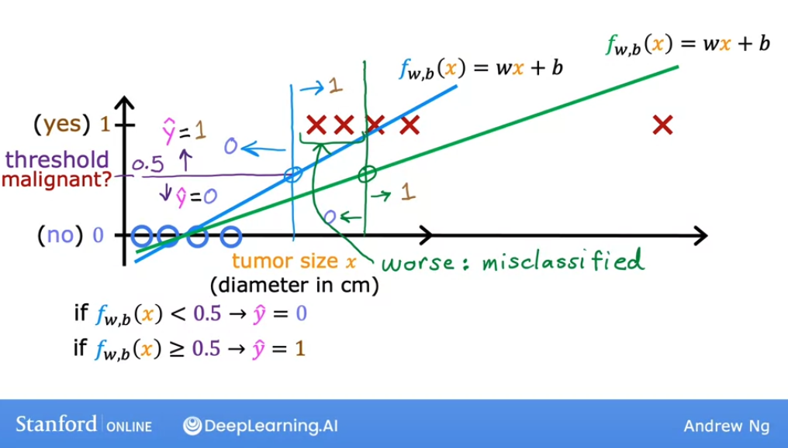

# Classification with logistic regression

## Motivations

In **classification**, our output variable $y$ can take only a small handful of possible values, instead of any number in an infinite range of numbers, like in regression.

Linear regression is not a good algorithm for classification problems: let's understand why by looking at a couple of problems.


In each of these problems. the output variable can only have two values: this specific problem is called **binary classification**. 

Binary refers to only being two **classes** or **categories** that are possible results. "Class" and "category" can be used interchangably.

In binary classification, the classes are only two: `no` or `yes`, `false` or `true`, or, even mor useful for classification problems `0` and `1`.

In this case, `0` is called the **negative class** and `1` the **positive class**, to refer to "absence" and "presence", respectively.

Let's see how do we build a classification algorithm:


Notice how we have our model with tumor size in the $x$ axis and or $classes$ `0` and `1` on the $y$ axis. We see that from a certain $x$ value to the right, all tumors are classified as malignant with `1`.

Let's see what would happen if we tried to use **linear regression** for this dataset. 


The problem with the line above is that it predicts values for all numbers, not just the classes `0` and `1`, but also negative values and above `1`.

So we could define a threshold, at `0.5` on the $y$ axis, check where that intersects our line, and then define that everything below that value of $x$ will be negative, and everything above will be positive:


For this particular dataset, it seems that this could be a good fit. But what happens if our dataset has one more training example?


This new datapoint shouldn't change the classification: the vertical line that we drew that classifies tumors to the left and right of that value of $x$ should still work.

The problem is that if we have that new datapoint, our beset fit line for linear regression will change, and if we continue using the threshold of `0.5` on the $y$ axis, the intersection with the $x$ will change.



So, adding a new training example to our set shouldn't change our classification. But for **linear regression** it does, and this is why it's not a good algorithm for classifing.

## Optional Labl: Classification

[LINK](https://www.coursera.org/learn/machine-learning/ungradedLab/0Ew8Q/optional-lab-classification/lab?path=%2Fnotebooks%2FC1_W3_Lab01_Classification_Soln.ipynb#)

[Internal Link](./labs/Week%203/C1_W3_Lab01_Classification_Soln.ipynb)

In this lab, you will contrast regression and classification.

```py
import numpy as np
%matplotlib widget
import matplotlib.pyplot as plt
from lab_utils_common import dlc, plot_data
from plt_one_addpt_onclick import plt_one_addpt_onclick
plt.style.use('./deeplearning.mplstyle')
```

**Classification Problems**

Examples of classification problems are things like: identifying email as Spam or Not Spam or determining if a tumor is malignant or benign. In particular, these are examples of *binary* classification where there are two possible outcomes.  Outcomes can be  described in pairs of 'positive'/'negative' such as 'yes'/'no, 'true'/'false' or '1'/'0'. 

Plots of classification data sets often use symbols to indicate the outcome of an example. In the plots below, 'X' is used to represent the positive values while 'O' represents negative outcomes. 

```py
x_train = np.array([0., 1, 2, 3, 4, 5])
y_train = np.array([0,  0, 0, 1, 1, 1])
X_train2 = np.array([[0.5, 1.5], [1,1], [1.5, 0.5], [3, 0.5], [2, 2], [1, 2.5]])
y_train2 = np.array([0, 0, 0, 1, 1, 1])
```

```py
pos = y_train == 1
neg = y_train == 0

fig,ax = plt.subplots(1,2,figsize=(8,3))
#plot 1, single variable
ax[0].scatter(x_train[pos], y_train[pos], marker='x', s=80, c = 'red', label="y=1")
ax[0].scatter(x_train[neg], y_train[neg], marker='o', s=100, label="y=0", facecolors='none', 
              edgecolors=dlc["dlblue"],lw=3)

ax[0].set_ylim(-0.08,1.1)
ax[0].set_ylabel('y', fontsize=12)
ax[0].set_xlabel('x', fontsize=12)
ax[0].set_title('one variable plot')
ax[0].legend()

#plot 2, two variables
plot_data(X_train2, y_train2, ax[1])
ax[1].axis([0, 4, 0, 4])
ax[1].set_ylabel('$x_1$', fontsize=12)
ax[1].set_xlabel('$x_0$', fontsize=12)
ax[1].set_title('two variable plot')
ax[1].legend()
plt.tight_layout()
plt.show()
```


Note in the plots above:
- In the single variable plot, positive results are shown both a red 'X's and as y=1. Negative results are blue 'O's and are located at y=0.
   - Recall in the case of linear regression, y would not have been limited to two values but could have been any value.
- In the two-variable plot, the y axis is not available.  Positive results are shown as red 'X's, while negative results use the blue 'O' symbol.
    - Recall in the case of linear regression with multiple variables, y would not have been limited to two values and a similar plot would have been three-dimensional.

**Linear Regression approach**

In the previous week, you applied linear regression to build a prediction model. Let's try that approach here using the simple example that was described in the lecture. The model will predict if a tumor is benign or malignant based on tumor size.  Try the following:
- Click on 'Run Linear Regression' to find the best linear regression model for the given data.
    - Note the resulting linear model does **not** match the data well. 
One option to improve the results is to apply a *threshold*. 
- Tick the box on the 'Toggle 0.5 threshold' to show the predictions if a threshold is applied.
    - These predictions look good, the predictions match the data
- *Important*: Now, add further 'malignant' data points on the far right, in the large tumor size range (near 10), and re-run linear regression.
    - Now, the model predicts the larger tumor, but data point at x=3 is being incorrectly predicted!
- to clear/renew the plot, rerun the cell containing the plot command.

```py
w_in = np.zeros((1))
b_in = 0
plt.close('all') 
addpt = plt_one_addpt_onclick( x_train,y_train, w_in, b_in, logistic=False)
```


The example above demonstrates that the linear model is insufficient to model categorical data. The model can be extended as described in the following lab.

## Logistic regression

**Logistic regression** is probably the single most widely used classification algorithm in the world.

Let's continue with the exampel of classifying if a tumor is malignantm with `0` for "no" and `1` for "yes".

We saw before that **linear regression** is a bad choice for applying to these types of data and problems. Instead, **logistic regression** will end up applying a curve to the dataset that looks like this:


So if a tumor comes in with a tumor of a particular size, marked in the graph below, the intersection with the $y$ axis will be of around `0.7`, which indicates that this tumor is more probably malignant than benign - closer to `1` than `0`:


However, the output label $y$ is never `0.7`, it's always either `0` or `1`. So to build out to the **logistic regression** algorithm, we need to describe first the **sigmoid function** (also called **logistic function**):


Notice from the start the difference in the $x$ axis. The **sigmoid function** is centered around `0` (in this case, displayed between `-3` and `3`) and commonly labeled as $z$.

The equation of this function is:

$$ g(z) = \frac{1}{1 + e^{-z}} $$

and:

$$ 0 < g(z) < 1 $$

So you can see that if $z$ is very big, the functions tends to 1, and if $z$ is very small, if tends to 0. Also if $z$ is 0, $g$ is exactly `0.5`:


Let's use this to build up to the logistic regression algorithm.

First, if we remember that that a linear function is defined as:

$$ f_{\vec{\mathbf{w}}, b} (\vec{\mathbf{x}})= \vec{\mathbf{w}} \cdot \vec{\mathbf{x}} + b$$

Let's throw this forumla into our variable $z$:

$$ \mathbf{z}= \vec{\mathbf{w}} \cdot \vec{\mathbf{x}} + b$$

And now less pass our $z$ to the sigmoid function:

$$ g(z) = \frac{1}{1 + e^{-z}} $$

Putting everything together, we get the **logistic regression** model:

$$ f_{\vec{\mathbf{w}}, b} (\vec{\mathbf{x}})= g(\vec{\mathbf{w}} \cdot \vec{\mathbf{x}} + b) = \frac{1}{1 + e^{-(\vec{\mathbf{w}} \cdot \vec{\mathbf{x}} + b)}}$$


Now let's see how do we interpret its output:

The best way to interpret is is to think of the logistic regression model outputting **the probablity that the class will be `1`**, given a certain input $x$.

For example, if $x$ is tumor size and $y$ can take values `0` and `1`, and a patient comes in with a tumor size that serves as our input,  and outputs a result of `0.7`, then **the model is telling us that this tumor has 70% probability of being of class malignant (`1`).**


Therefore, the tumor has a 30% change of being benign as well, since:

$$ P(y = 0) + P(y = 1) = 1 $$

In some papers, the notations you might see is:

$$ f_{\vec{\mathbf{w}}, b} (\vec{\mathbf{x}})= P( y = 1 |  \vec{\mathbf{x}}; \vec{\mathbf{w}}, b) $$

This means, the **"the probability of the input being of class 1, given the input features $x$ and parameters $w$ and $b$**.

The semicolon just denote that $w$ and $b$ are just parameters that affect the computation of $x$.


## Optional Lab: Sigmoid function and logistic regression

[LINK](https://www.coursera.org/learn/machine-learning/ungradedLab/9LMHw/optional-lab-sigmoid-function-and-logistic-regression/lab?path=%2Fnotebooks%2FC1_W3_Lab02_Sigmoid_function_Soln.ipynb)

[Internal link](./labs/Week%203/C1_W3_Lab02_Sigmoid_function_Soln.ipynb)

In this ungraded lab, you will 
- explore the sigmoid function (also known as the logistic function)
- explore logistic regression; which uses the sigmoid function

**Sigmoid or Logistic Function**
As discussed in the lecture videos, for a classification task, we can start by using our linear regression model, $f_{\mathbf{w},b}(\mathbf{x}^{(i)}) = \mathbf{w} \cdot  \mathbf{x}^{(i)} + b$, to predict $y$ given $x$. 
- However, we would like the predictions of our classification model to be between 0 and 1 since our output variable $y$ is either 0 or 1. 
- This can be accomplished by using a "sigmoid function" which maps all input values to values between 0 and 1. 


Let's implement the sigmoid function and see this for ourselves.

**Formula for Sigmoid function**
The formula for a sigmoid function is as follows:  

$$g(z) = \frac{1}{1+e^{-z}}\tag{1}$$

In the case of logistic regression, z (the input to the sigmoid function), is the output of a linear regression model. 
- In the case of a single example, $z$ is scalar.
- in the case of multiple examples, $z$ may be a vector consisting of $m$ values, one for each example. 
- The implementation of the sigmoid function should cover both of these potential input formats.

Let's implement this in Python.

NumPy has a function called [`exp()`](https://numpy.org/doc/stable/reference/generated/numpy.exp.html), which offers a convenient way to calculate the exponential ( $e^{z}$) of all elements in the input array (`z`).
 
It also works with a single number as an input, as shown below.

```py
# Input is an array. 
input_array = np.array([1,2,3])
exp_array = np.exp(input_array)

print("Input to exp:", input_array)
print("Output of exp:", exp_array)
# Input to exp: [1 2 3]
# Output of exp: [ 2.72  7.39 20.09]


# Input is a single number
input_val = 1  
exp_val = np.exp(input_val)

print("Input to exp:", input_val)
print("Output of exp:", exp_val)
# Input to exp: 1
# Output of exp: 2.718281828459045
```

The `sigmoid` function is implemented in python as shown in the cell below.

```py
def sigmoid(z):
    """
    Compute the sigmoid of z

    Args:
        z (ndarray): A scalar, numpy array of any size.

    Returns:
        g (ndarray): sigmoid(z), with the same shape as z
         
    """

    g = 1/(1+np.exp(-z))
   
    return g
```

Let's see what the output of this function is for various value of `z`:

```py
# Generate an array of evenly spaced values between -10 and 10
z_tmp = np.arange(-10,11)

# Use the function implemented above to get the sigmoid values
y = sigmoid(z_tmp)

# Code for pretty printing the two arrays next to each other
np.set_printoptions(precision=3) 
print("Input (z), Output (sigmoid(z))")
print(np.c_[z_tmp, y])
# Input (z), Output (sigmoid(z))
# [[-1.000e+01  4.540e-05]
#  [-9.000e+00  1.234e-04]
#  [-8.000e+00  3.354e-04]
#  [-7.000e+00  9.111e-04]
#  [-6.000e+00  2.473e-03]
#  [-5.000e+00  6.693e-03]
#  [-4.000e+00  1.799e-02]
#  [-3.000e+00  4.743e-02]
#  [-2.000e+00  1.192e-01]
#  [-1.000e+00  2.689e-01]
#  [ 0.000e+00  5.000e-01]
#  [ 1.000e+00  7.311e-01]
#  [ 2.000e+00  8.808e-01]
#  [ 3.000e+00  9.526e-01]
#  [ 4.000e+00  9.820e-01]
#  [ 5.000e+00  9.933e-01]
#  [ 6.000e+00  9.975e-01]
#  [ 7.000e+00  9.991e-01]
#  [ 8.000e+00  9.997e-01]
#  [ 9.000e+00  9.999e-01]
#  [ 1.000e+01  1.000e+00]]
```

The values in the left column are `z`, and the values in the right column are `sigmoid(z)`. As you can see, the input values to the sigmoid range from -10 to 10, and the output values range from 0 to 1. 

Now, let's try to plot this function using the `matplotlib` library.
```py
# Plot z vs sigmoid(z)
fig,ax = plt.subplots(1,1,figsize=(5,3))
ax.plot(z_tmp, y, c="b")

ax.set_title("Sigmoid function")
ax.set_ylabel('sigmoid(z)')
ax.set_xlabel('z')
draw_vthresh(ax,0)
```


As you can see, the sigmoid function approaches  `0` as `z` goes to large negative values and approaches `1` as `z` goes to large positive values.

**Logistic regression**
 A logistic regression model applies the sigmoid to the familiar linear regression model as shown below:

$$ f_{\mathbf{w},b}(\mathbf{x}^{(i)}) = g(\mathbf{w} \cdot \mathbf{x}^{(i)} + b ) \tag{2} $$ 

where

$$g(z) = \frac{1}{1+e^{-z}}\tag{3}$$

Let's apply logistic regression to the categorical data example of tumor classification.  
First, load the examples and initial values for the parameters.

```py
x_train = np.array([0., 1, 2, 3, 4, 5])
y_train = np.array([0,  0, 0, 1, 1, 1])

w_in = np.zeros((1))
b_in = 0
```

Try the following steps:
- Click on 'Run Logistic Regression' to find the best logistic regression model for the given training data
    - Note the resulting model fits the data quite well.
    - Note, the orange line is '$z$' or $\mathbf{w} \cdot \mathbf{x}^{(i)} + b$  above. It does not match the line in a linear regression model.
Further improve these results by applying a *threshold*. 
- Tick the box on the 'Toggle 0.5 threshold' to show the predictions if a threshold is applied.
    - These predictions look good. The predictions match the data
    - Now, add further data points in the large tumor size range (near 10), and re-run logistic regression.
    - unlike the linear regression model, this model continues to make correct predictions


## Decision boundary

Let's first recap. We have the **logistic regression model**:

$$ f_{\vec{\mathbf{w}}, b} (\vec{\mathbf{x}})= g(\vec{\mathbf{w}} \cdot \vec{\mathbf{x}} + b) = \frac{1}{1 + e^{-(\vec{\mathbf{w}} \cdot \vec{\mathbf{x}} + b)}}$$

and:

$$ f_{\vec{\mathbf{w}}, b} (\vec{\mathbf{x}})= P( y = 1 |  \vec{\mathbf{x}}; \vec{\mathbf{w}}, b) $$

What we want the learning algorithm to predict is if the value of $y$ is going to be `0` or `1`. One thing you might do is **set a threshold above which you predict that $y$ is `1`, and below which $y$ is `0`**:


So, a common choice would be to pick a **threshold of `0.5`**, so that if $f(x)$ is equal than or greater than `0.5`, then we predict $y$ as `1`, or positive, and if less, then we predict $y$ as `0`, or negative. And we write those prediction as:

$$ \text{Yes}: \hat{y} = 1$$
$$\text{No}:\hat{y} = 0 $$

So, now let's dive deeper into when the model would predict `1`: in other words, when is $ f_{\vec{\mathbf{w}}, b} \ge 0.5 $ ? 

Recall that $ f_{\vec{\mathbf{w}}, b}(x)$ is just equal to $g(z)$, so $f_{\vec{\mathbf{w}}, b}(x)$ is equal or greater than 0.5 when $g(z)$ is greater or equal than 0.5.

So, when $g(z)$ is greater or equal than 0.5.?

Let's take a look at the sigmoid curve:


$g(z)$ is greater than `0.5` whenever $z$ is greater than `0`.

And when is $z$ greater than `0`? Well:


**when $(\vec{\mathbf{w}} \cdot \vec{\mathbf{x}} + b)$ is greater than 0!**

So what we see here is that the model predicts:

- $\hat{y} = 1$, when $\vec{\mathbf{w}} \cdot \vec{\mathbf{x}} + b \ge 0$
- $\hat{y} = 0$, when $\vec{\mathbf{w}} \cdot \vec{\mathbf{x}} + b \lt 0$

So, given this, let's see how the model makes predictions:


Above we see a classification problem where we have now two features $x_1$ and $x_2$. The red crosses denote positive examples or $\hat{y} = 1$ and the blue circles denote negative examples or $\hat{y} = 0$.

So the logistic regression model will now make predictions using the model:

$$ f_{\vec{\mathbf{w}}, b} (\vec{\mathbf{x}})= g(z) = g(\vec{\mathbf{w}} \cdot \vec{\mathbf{x}} + b) = g(x_1 x_1 + w_2x_2 + b)$$

Let's say that for this example the value of the parameters are:

- $w_1 = 1$
- $w_2 = 1$
- $b = -3$

So let's figure out when $\vec{\mathbf{w}} \cdot \vec{\mathbf{x}} + b$ is greater or equal than 0, and when it is less than 0:

To figure that out, there's a very interesting line to look at, that is exactly when $\vec{\mathbf{w}} \cdot \vec{\mathbf{x}} + b$ is exactly 0.

$$ z = \vec{\mathbf{w}} \cdot \vec{\mathbf{x}} + b = 0 $$

This line is the **decision boundary**. It's the line where we are almost neutral about wether $y$ is 1 or 0.

For the values that we gave to the parameters, we can replace them in the formula and get:

$$ z = x_1 + x_2 -3 = 0 $$

And when is $x_1 + x_2 -3 = 0$? Well, that corresponds to the line:

$$ x_1 + x_2 = 3$$

which we can see plotted in the graph below, the **decision boundary**, where the features $x$ are to the right of it, then $y = 1$ and if they are to its left, then $y = 0$.


Now let's see a more complex example, where the decision boundary is no longer a straight line.

We already saw how to use polynomials in lineal regression, and we can do the same for logistic regression. So, let's $z$ to be $w_1 x_1^2 + w_2x_2^2 + b$, and put that into a logistic regression:

$$ f_{\vec{\mathbf{w}}, b} (\vec{\mathbf{x}})= g(z) = g(w_1 x_1^2 + w_2x_2^2 + b)$$

And now we choose the parameters:
- $w_1 = 1$
- $w_2 = 1$
- $b = -1$

So now we have:
$$ z = x_1^2 + x_2^2 - 1 = 0 $$

And the **decision boundary** is when $z = 0$, so:

- $$ x_1^2 + x_2^2 - 1 = 0 $$
- $$ x_1^2 + x_2^2 = 1 $$

And the equation above, plotted in the diagram is the following circle:


We can see that: 
- when $x_1^2 + x_2^2 \ge 1$, that is, the area outside of the circle, then $\hat{y} = 1$.
- when $x_1^2 + x_2^2 \lt 1$, that is, the area inside of the circle, then $\hat{y} = 0$.

We can even come up with more complex decision boundaries than the above, by **having even higher order polynomial terms.**

For example:

$$ f_{\vec{\mathbf{w}}, b} (\vec{\mathbf{x}})= g(z) = g(w_1 x_1^2 + w_2x_2^2 + w_3 x_1^2 + w_4 x_1 x_2 + w_5 x_2^2)$$

will prodcue an ellipse:


And something even more complex can even lloke like:


In this examples, the model will predict $\hat{y} =1$ inside the circle and $\hat{y} = 0$ outside of it:


You can see that **logistic regression is able to fit pretty complex shapes of data.**

## Optional Lab: Logisitc Regression and Decision Boundary

[LINK](https://www.coursera.org/learn/machine-learning/ungradedLab/ULi82/optional-lab-decision-boundary/lab?path=%2Fnotebooks%2FC1_W3_Lab03_Decision_Boundary_Soln.ipynb)

[Internal link](./labs/Week%203/C1_W3_Lab03_Decision_Boundary_Soln.ipynb)

In this lab, you will:
- Plot the decision boundary for a logistic regression model. This will give you a better sense of what the model is predicting.

```py
import numpy as np
%matplotlib widget
import matplotlib.pyplot as plt
from lab_utils_common import plot_data, sigmoid, draw_vthresh
plt.style.use('./deeplearning.mplstyle')
```

**Dataset**

Let's suppose you have following training dataset
- The input variable `X` is a numpy array which has 6 training examples, each with two features
- The output variable `y` is also a numpy array with 6 examples, and `y` is either `0` or `1`

```py
X = np.array([[0.5, 1.5], [1,1], [1.5, 0.5], [3, 0.5], [2, 2], [1, 2.5]])
y = np.array([0, 0, 0, 1, 1, 1]).reshape(-1,1)
# array([[0.5, 1.5],
#        [1. , 1. ],
#        [1.5, 0.5],
#        [3. , 0.5],
#        [2. , 2. ],
#        [1. , 2.5]])
# array([[0],
#        [0],
#        [0],
#        [1],
#        [1],
#        [1]])
```

**Plot data**

Let's use a helper function to plot this data. The data points with label $y=1$ are shown as red crosses, while the data points with label $y=0$ are shown as blue circles.

```py
fig,ax = plt.subplots(1,1,figsize=(4,4))
plot_data(X, y, ax)

ax.axis([0, 4, 0, 3.5])
ax.set_ylabel('$x_1$')
ax.set_xlabel('$x_0$')
plt.show()
```


**Logistic regression model**

Suppose you'd like to train a logistic regression model on this data which has the form:   

  $$f(x) = g(w_0x_0+w_1x_1 + b)$$
  
where $g(z) = \frac{1}{1+e^{-z}}$, which is the sigmoid function.


Let's say that you trained the model and get the parameters as $b = -3, w_0 = 1, w_1 = 1$. That is,

$$f(x) = g(x_0+x_1-3)$$

(You'll learn how to fit these parameters to the data further in the course)
  
  
Let's try to understand what this trained model is predicting by plotting its decision boundary.

**Refresher on logistic regression and decision boundary**

Recall that for logistic regression, the model is represented as: 

  $$f_{\mathbf{w},b}(\mathbf{x}^{(i)}) = g(\mathbf{w} \cdot \mathbf{x}^{(i)} + b) \tag{1}$$

where $g(z)$ is known as the sigmoid function and it maps all input values to values between 0 and 1:

  $$g(z) = \frac{1}{1+e^{-z}}\tag{2}$$

and $\mathbf{w} \cdot \mathbf{x}$ is the vector dot product:
  
  $$\mathbf{w} \cdot \mathbf{x} = w_0 x_0 + w_1 x_1$$
  
We interpret the output of the model ($f_{\mathbf{w},b}(x)$) as the probability that $y=1$ given $\mathbf{x}$ and parameterized by $\mathbf{w}$ and $b$.

Therefore, to get a final prediction ($y=0$ or $y=1$) from the logistic regression model, we can use the following heuristic:

  - if $f_{\mathbf{w},b}(x) >= 0.5$, predict $y=1$
  
  - if $f_{\mathbf{w},b}(x) < 0.5$, predict $y=0$
  
  
Let's plot the sigmoid function to see where $g(z) >= 0.5$:

```py
# Plot sigmoid(z) over a range of values from -10 to 10
z = np.arange(-10,11)

fig,ax = plt.subplots(1,1,figsize=(5,3))
# Plot z vs sigmoid(z)
ax.plot(z, sigmoid(z), c="b")

ax.set_title("Sigmoid function")
ax.set_ylabel('sigmoid(z)')
ax.set_xlabel('z')
draw_vthresh(ax,0)
```


As you can see, $g(z) >= 0.5$ for $z >=0$

For a logistic regression model, $z = \mathbf{w} \cdot \mathbf{x} + b$. Therefore,

  - if $\mathbf{w} \cdot \mathbf{x} + b >= 0$, the model predicts $y=1$
  
  - if $\mathbf{w} \cdot \mathbf{x} + b < 0$, the model predicts $y=0$
  
  
  
### Plotting decision boundary

Now, let's go back to our example to understand how the logistic regression model is making predictions.

Our logistic regression model has the form:

  $$f(\mathbf{x}) = g(-3 + x_0+x_1)$$


From what you've learnt above, you can see that this model predicts $y=1$ if $-3 + x_0+x_1 >= 0$

Let's see what this looks like graphically. We'll start by plotting $-3 + x_0+x_1 = 0$, which is equivalent to $x_1 = 3 - x_0$.

```py
# Choose values between 0 and 6
x0 = np.arange(0,6)

x1 = 3 - x0
fig,ax = plt.subplots(1,1,figsize=(5,4))
# Plot the decision boundary
ax.plot(x0,x1, c="b")
ax.axis([0, 4, 0, 3.5])

# Fill the region below the line
ax.fill_between(x0,x1, alpha=0.2)

# Plot the original data
plot_data(X,y,ax)
ax.set_ylabel(r'$x_1$')
ax.set_xlabel(r'$x_0$')
plt.show()
```


In the plot above, the blue line represents the line $x_0 + x_1 - 3 = 0$ and it should intersect the x1 axis at 3 (if we set $x_1$ = 3, $x_0$ = 0) and the x0 axis at 3 (if we set $x_1$ = 0, $x_0$ = 3). 


The shaded region represents $-3 + x_0+x_1 < 0$. The region above the line is $-3 + x_0+x_1 > 0$.


Any point in the shaded region (under the line) is classified as $y=0$.  Any point on or above the line is classified as $y=1$. This line is known as the "decision boundary".

Also, as we've seen in the lectures, by using higher order polynomial terms (eg: $f(x) = g( x_0^2 + x_1 -1)$, we can come up with more complex non-linear boundaries.