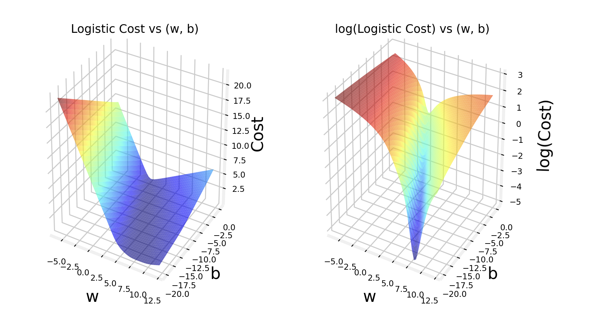

# Cost function for logistic regression

## Cost function for logistic regression

Remember: **the cost function gives you a way to measure how well a specific set of parameters fit the training data**, and therefore a way to choose better parameters.

We'll see first how the sqaured error cost function is **not an ideal cost function for logistic regression.** And we'll choose a better cost function.


Above we see the training set for a logistic regression model.

Each row corresponds to a patient that paid a visit to the doctor, and their diagnosis.

- $i$ is the index of the training example
- $m$ is that amount of training examples
- $j$ is the index of the feature
- $n$ is the amount of features

So we have:

- features that go from $x_1$ up to $x_n$
- since this is a **binary classification task**, the target label $y$ takes values of either `0` or `1`

And the logistic regression model is defined by the equation:

$$ f_{\vec{\mathbf{w}}, b} (\vec{\mathbf{x}})= g(\vec{\mathbf{w}} \cdot \vec{\mathbf{x}} + b) = \frac{1}{1 + e^{-(\vec{\mathbf{w}} \cdot \vec{\mathbf{x}} + b)}}$$

The question that we want to answer is: **given this training set, how can we calculate parameters $\mathbf{w}$ and $\mathbf{b}$?**

Recall, from linear regression **the squared error cost function**:

$$J(\vec{\mathbf{w}},\mathbf{b}) = \frac{1}{2m} \sum\limits_{i = 1}^{m} (f_{\mathbf{w},b}(\vec{\mathbf{x}}^{(i)}) - y^{(i)})^2$$ 

Recall that in **linear regression**:

- we have the model $ f_{\vec{\mathbf{w}}, b} (\vec{\mathbf{x}})= \vec{\mathbf{w}} \cdot \vec{\mathbf{x}} + b$
- the cost function takes a **bowl shape**, which is **convex**, and allows our **gradient descent algorithm** to find the global minium.

However, in **logistic regression**:
- we have the model $ f_{\vec{\mathbf{w}}, b} (\vec{\mathbf{x}})= \frac{1}{1 + e^{-(\vec{\mathbf{w}} \cdot \vec{\mathbf{x}} + b)}}$
- if we plot the cost function using this values of $f(x)$, we get a **non-convex** line, and if we tried to use gradient descent, there are lots of local minima that we can get stuck in and never find the global minimum.


So for **logistic regression**, the squared error cost function is not a good choice.

In order to build a new cost function for logistic regression, we need to change the definition of the cost function that we have above: we'll call the term inside the sumation the **loss of a training example**:

$$ \text{Loss} \Rightarrow L(f_{\mathbf{\vec{w}},b}(\vec{\mathbf{x}}^{(i)}), y^{(i)})  $$

So we are denoting the loss $L$ as a function of:
- the prediction of the learning algorithm $f_{\mathbf{\vec{w}},b}(\vec{\mathbf{x}}^{(i)})$
- the true label $y^i$

The loss, given those two variables, is one half of the squared difference:

$$ L(f_{\mathbf{\vec{w}},b}(\vec{\mathbf{x}}^{(i)}), y^{(i)}) = \frac{1}{2} (f_{\mathbf{\vec{w}},b}(\vec{\mathbf{x}}^{(i)}) - y^{(i)}) ^ 2$$

By choosing a different form for this loss function, we can keep the overall cost function to be a convex curve.

### Logistic regression cost function

The loss function inputs $f$ and the true label $y$, and tells us how well we are doing in that example.

Let's first write the definition of the loss function that we will use for this regresssion:

$$   
L(f_{\mathbf{\vec{w}},b}(\vec{\mathbf{x}}^{(i)}), y^{(i)}) = 
     \begin{cases}
       -\log{(f_{\mathbf{\vec{w}},b}(\vec{\mathbf{x}}^{(i)}))} &\quad\text{if } y^{(i)} = 1\\
       -\log{(1 - f_{\mathbf{\vec{w}},b}(\vec{\mathbf{x}}^{(i)}))} &\quad\text{if } y^{(i)} = 0\\
     \end{cases}
$$

Let's take a look at why this loss function makes sense.

Let's consider first the case of $y = 1$ and plot what this function looks like, to get some intuition into what this function is doing. 

Remember that the loss function measures **how well you are doing on one example**, while it si by summing up the losses in all your examples that you can get the cost function, which measures **how well you are doing in the entire training set.**

So if we plot $\log(f)$ and $-\log(f)$, we get:


Notice that both curves intersect the $x$ axis on 1, and this is important for us in $-\log(f)$, since after 1, all values of the curve are negative.

Now, $f$ is the output of a logistic regression. This it is always between `0` and `1`. Therefor the only part of the curve that is relevant is what's between `0` and `1`, marked in the following graph:


Now, let's zoom in and take a closer look at that part of the graph:


#### Graph when $y^{(i)} = 1$
If the algorithm predicts a probability close to `1`, and the true label $y^{(i)} = 1$, then the loss is very small, approaches `0`, **because we are very close to the right answer.**.

Now, continuing with the example of the true label being `1`, $y^{(i)} = 1$, - that is, the example really being a malignant tumor -, then if the algorithm predicts `0.5`, we would get a higher value. And if it predicted `0.1`, it would be much higher again.

This is because our algorithm would be predicting that there is only a 10% chance of the tumor being malignant, when the true value actually says that tumor is indeed malignat. That is why the loss is so high:


So, when $y^{(i)} = 1$, the loss function incentivizes, or nudges, pushed the algorithm to make more accurate predictions, because the **loss is lowest when $f_{\mathbf{\vec{w}},b}(\vec{\mathbf{x}}^{(i)})$ predicts values close to the true label $y^{(i)}$ close to `1`.**

#### Graph when $y^{(i)} = 0$

In this case, the loss function is:

$$  -\log{(1 - f_{\mathbf{\vec{w}},b}(\vec{\mathbf{x}}^{(i)}))} $$
In this case, the range of $f$ is limited to `0` to `1` (again, because logistic regression only outputs values between those two numbers). And if we zoom in to that part, it looks like so:


In the graph above, the $y$ axis shows the value of the loss $L$ for different values of $f_{\mathbf{\vec{w}},b}(\vec{\mathbf{x}}^{(i)})$. So when $f$ is 0 or very close to 0, the loss is also going to be very small: if the true label $y$ is $0$ and the model's prediction is also 0, then we nearly got it right.

Instead, the larger the value of $f$ gets, the larger the loss, since the prediction will be further away from the true label 0. In fact, as the prediction approaches 1, the loss approaches infinity.

Going back to the tumor prediction example, this says that if our model predicts that a tumor is almost certain, with 99,9% probability, of being malignat, but the true label shows that it is not malignant ($y = 0$), then we penalize the model with a very high loss.


---
So, for both cases, **the further the prediction $f_{\mathbf{\vec{w}},b}(\vec{\mathbf{x}}^{(i)})$ is from target $y^{(i)}$, the higher the loss.**

---
So now, we have redefined our cost function as:

$$J(\vec{\mathbf{w}},\mathbf{b}) = \frac{1}{m} \sum\limits_{i = 1}^{m} L(f_{\mathbf{w},b}(\vec{\mathbf{x}}^{(i)}), y^{(i)})$$

and defined the loss for a single training examples as: 

$$L(f_{\mathbf{\vec{w}},b}(\vec{\mathbf{x}}^{(i)}), y^{(i)})  $$

which is what is summed up per example in the summation above.

And we came up for a new definition for **the loss function for logistic regression**:

$$   
L(f_{\mathbf{\vec{w}},b}(\vec{\mathbf{x}}^{(i)}), y^{(i)}) = 
     \begin{cases}
       -\log{(f_{\mathbf{\vec{w}},b}(\vec{\mathbf{x}}^{(i)}))} &\quad\text{if } y^{(i)} = 1\\
       -\log{(1 - f_{\mathbf{\vec{w}},b}(\vec{\mathbf{x}}^{(i)}))} &\quad\text{if } y^{(i)} = 0\\
     \end{cases}
$$

**With this choice of loss function, the overall cost function $J(w,b)$ will be convex, and can thus reliably use gradient descent to take us to the global minimum.**

So, if we can find the values for $w$ and $b$ that minimize the cost function, then we have found great values for our logistic regression model.

## Optional Lab: Logistic Regression, Logistic Loss

[LINK](https://www.coursera.org/learn/machine-learning/ungradedLab/pOtDs/optional-lab-logistic-loss/lab?path=%2Fnotebooks%2FC1_W3_Lab04_LogisticLoss_Soln.ipynb)

[Internal Link](./labs/Week%203/C1_W3_Lab04_LogisticLoss_Soln.ipynb)

In this ungraded lab, you will:
- explore the reason the squared error loss is not appropriate for logistic regression
- explore the logistic loss function

```py
import numpy as np
%matplotlib widget
import matplotlib.pyplot as plt
from plt_logistic_loss import  plt_logistic_cost, plt_two_logistic_loss_curves, plt_simple_example
from plt_logistic_loss import soup_bowl, plt_logistic_squared_error
plt.style.use('./deeplearning.mplstyle')
```

**Squared error for logistic regression?**

Recall for **Linear** Regression we have used the **squared error cost function**:
The equation for the squared error cost with one variable is:
  $$J(w,b) = \frac{1}{2m} \sum\limits_{i = 0}^{m-1} (f_{w,b}(x^{(i)}) - y^{(i)})^2 \tag{1}$$ 
 
where 
  $$f_{w,b}(x^{(i)}) = wx^{(i)} + b \tag{2}$$

Recall, the squared error cost had the nice property that following the derivative of the cost leads to the minimum.

```py
soup_bowl()
```


This cost function worked well for linear regression, it is natural to consider it for logistic regression as well. However, as the slide above points out, $f_{wb}(x)$ now has a non-linear component, the sigmoid function:   $f_{w,b}(x^{(i)}) = sigmoid(wx^{(i)} + b )$.   Let's try a squared error cost on the example from an earlier lab, now including the sigmoid.

Here is our training data:

```py
x_train = np.array([0., 1, 2, 3, 4, 5],dtype=np.longdouble)
y_train = np.array([0,  0, 0, 1, 1, 1],dtype=np.longdouble)
plt_simple_example(x_train, y_train)
```


Now, let's get a surface plot of the cost using a *squared error cost*:
  $$J(w,b) = \frac{1}{2m} \sum\limits_{i = 0}^{m-1} (f_{w,b}(x^{(i)}) - y^{(i)})^2 $$ 
 
where 
  $$f_{w,b}(x^{(i)}) = sigmoid(wx^{(i)} + b )$$

```py
plt.close('all')
plt_logistic_squared_error(x_train,y_train)
plt.show()
```


While this produces a pretty interesting plot, the surface above not nearly as smooth as the 'soup bowl' from linear regression!    

Logistic regression requires a cost function more suitable to its non-linear nature. This starts with a Loss function. This is described below.

**Logistic Loss function**

Logistic Regression uses a loss function more suited to the task of categorization where the target is 0 or 1 rather than any number. 

>**Definition Note:**   In this course, these definitions are used:  
**Loss** is a measure of the difference of a single example to its target value while the  
**Cost** is a measure of the losses over the training set


This is defined: 
* $loss(f_{\mathbf{w},b}(\mathbf{x}^{(i)}), y^{(i)})$ is the cost for a single data point, which is:

$$
  loss(f_{\mathbf{w},b}(\mathbf{x}^{(i)}), y^{(i)}) = \begin{cases}
    - \log\left(f_{\mathbf{w},b}\left( \mathbf{x}^{(i)} \right) \right) & \text{if $y^{(i)}=1$}\\
    - \log \left( 1 - f_{\mathbf{w},b}\left( \mathbf{x}^{(i)} \right) \right) & \text{if $y^{(i)}=0$}
  \end{cases}
$$


*  $f_{\mathbf{w},b}(\mathbf{x}^{(i)})$ is the model's prediction, while $y^{(i)}$ is the target value.

*  $f_{\mathbf{w},b}(\mathbf{x}^{(i)}) = g(\mathbf{w} \cdot\mathbf{x}^{(i)}+b)$ where function $g$ is the sigmoid function.

The defining feature of this loss function is the fact that it uses two separate curves. One for the case when the target is zero or ($y=0$) and another for when the target is one ($y=1$). 

Combined, these curves provide the behavior useful for a loss function, namely, **being zero when the prediction matches the target and rapidly increasing in value as the prediction differs from the target.**

Consider the curves below:


Combined, the curves are similar to the quadratic curve of the squared error loss. Note, the x-axis is $f_{\mathbf{w},b}$ which is the output of a sigmoid. The sigmoid output is strictly between 0 and 1.

The loss function above can be rewritten to be easier to implement.
    $$loss(f_{\mathbf{w},b}(\mathbf{x}^{(i)}), y^{(i)}) = (-y^{(i)} \log\left(f_{\mathbf{w},b}\left( \mathbf{x}^{(i)} \right) \right) - \left( 1 - y^{(i)}\right) \log \left( 1 - f_{\mathbf{w},b}\left( \mathbf{x}^{(i)} \right) \right)$$
  
This is a rather formidable-looking equation. It is less daunting when you consider $y^{(i)}$ can have only two values, 0 and 1. One can then consider the equation in two pieces:  
when $ y^{(i)} = 0$, the left-hand term is eliminated:
$$
\begin{align}
loss(f_{\mathbf{w},b}(\mathbf{x}^{(i)}), 0) &= (-(0) \log\left(f_{\mathbf{w},b}\left( \mathbf{x}^{(i)} \right) \right) - \left( 1 - 0\right) \log \left( 1 - f_{\mathbf{w},b}\left( \mathbf{x}^{(i)} \right) \right) \\
&= -\log \left( 1 - f_{\mathbf{w},b}\left( \mathbf{x}^{(i)} \right) \right)
\end{align}
$$
and when $ y^{(i)} = 1$, the right-hand term is eliminated:
$$
\begin{align}
  loss(f_{\mathbf{w},b}(\mathbf{x}^{(i)}), 1) &=  (-(1) \log\left(f_{\mathbf{w},b}\left( \mathbf{x}^{(i)} \right) \right) - \left( 1 - 1\right) \log \left( 1 - f_{\mathbf{w},b}\left( \mathbf{x}^{(i)} \right) \right)\\
  &=  -\log\left(f_{\mathbf{w},b}\left( \mathbf{x}^{(i)} \right) \right)
\end{align}
$$

OK, with this new logistic loss function, a cost function can be produced that incorporates the loss from all the examples. This will be the topic of the next lab. For now, let's take a look at the cost vs parameters curve for the simple example we considered above:

```py
plt.close('all')
cst = plt_logistic_cost(x_train,y_train)
```



This curve is well suited to gradient descent! It does not have plateaus, local minima, or discontinuities. Note, it is not a bowl as in the case of squared error. Both the cost and the log of the cost are plotted to illuminate the fact that the curve, when the cost is small, has a slope and continues to decline.

## Simplified Cost Function

Let'ssee a slightly simpler way to write out the loss and cost functions, so that the implementation can be a bit simpler when we get to gradient descent for fitting the parameters of a logistic regression model.

This is the loss function that we have up to now:

$$
  loss(f_{\mathbf{w},b}(\mathbf{x}^{(i)}), y^{(i)}) = \begin{cases}
    - \log\left(f_{\mathbf{w},b}\left( \mathbf{x}^{(i)} \right) \right) & \text{if $y^{(i)}=1$}\\
    - \log \left( 1 - f_{\mathbf{w},b}\left( \mathbf{x}^{(i)} \right) \right) & \text{if $y^{(i)}=0$}
  \end{cases}
$$

And since we know that $y$ can only take values `0` and `1`, since we are in a binary classification problem, we can simplify the equation.

First, the loss function above can be rewritten to be easier to implement: 
    $$loss(f_{\mathbf{w},b}(\mathbf{x}^{(i)}), y^{(i)}) = (-y^{(i)} \log\left(f_{\mathbf{w},b}\left( \mathbf{x}^{(i)} \right) \right) - \left( 1 - y^{(i)}\right) \log \left( 1 - f_{\mathbf{w},b}\left( \mathbf{x}^{(i)} \right) \right)$$
  
This equation is actually completely equivalent to the two part equation written above. Why?

Consider that $y^{(i)}$ can have only two values, 0 and 1. One can then consider the equation in two pieces:  

**when $ y^{(i)} = 0$**, the left-hand term is eliminated:
$$
\begin{align*}
loss(f_{\mathbf{w},b}(\mathbf{x}^{(i)}), 0) &= (-(0) \log\left(f_{\mathbf{w},b}\left( \mathbf{x}^{(i)} \right) \right) - \left( 1 - 0\right) \log \left( 1 - f_{\mathbf{w},b}\left( \mathbf{x}^{(i)} \right) \right) \\
&= -\log \left( 1 - f_{\mathbf{w},b}\left( \mathbf{x}^{(i)} \right) \right)
\end{align*}
$$
**and when $ y^{(i)} = 1$**, the right-hand term is eliminated:
$$
\begin{align*}
  loss(f_{\mathbf{w},b}(\mathbf{x}^{(i)}), 1) &=  (-(1) \log\left(f_{\mathbf{w},b}\left( \mathbf{x}^{(i)} \right) \right) - \left( 1 - 1\right) \log \left( 1 - f_{\mathbf{w},b}\left( \mathbf{x}^{(i)} \right) \right)\\
  &=  -\log\left(f_{\mathbf{w},b}\left( \mathbf{x}^{(i)} \right) \right)
\end{align*}
$$

So we can use the one line version of the equation to write the loss in a simpler way.

So let's us it to write the **cost function for the logistic regression**.

Recall that the cost $J$ is **just the average loss, averaged across the entire training set of $m$ examples**:

$$J(\vec{\mathbf{w}},\mathbf{b}) = \frac{1}{m} \sum\limits_{i = 1}^{m} [L(f_{\mathbf{w},b}(\vec{\mathbf{x}}^{(i)}), y^{(i)})]$$ 

So if we plug in the definition of the simplified loss function into the **cost function**, we get:

$$
\begin{align*}
J(\vec{\mathbf{w}},\mathbf{b})  &= \frac{1}{m} \sum\limits_{i = 1}^{m} [L(f_{\mathbf{w},b}(\vec{\mathbf{x}}^{(i)}), y^{(i)})] \\
&= -\frac{1}{m} \sum\limits_{i = 1}^{m} [
  -y^{(i)} \log\left(f_{\mathbf{w},b}\left( \mathbf{x}^{(i)} \right) \right) - \left( 1  y^{(i)}\right) \log \left( 1 + f_{\mathbf{w},b}\left( \mathbf{x}^{(i)} \right) \right)
]
\end{align*}
$$

Notice the negative sign has been extracted (out of the summation.)

The above is the cost function that everyone uses to train a logistic regression model.

The reason this is the function that is used as the cost function for a logistic regression, when there could be hundred other functions that could have been chosen, is that **this particular function is derived from statistics and a statistical principle called maximum likelihood estimation.** It's an idea from statistics on how to efficiently find parameters for different models.

This particular cost function has the nice property that it is convex, which allows us to implement gradient descent over it.