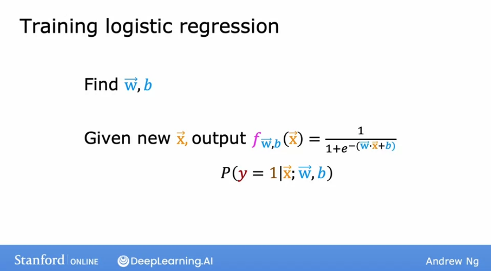

# Gradient Descent Implementation

## Gradient Descent Implementation

To fit the parameters of a **logistic regression model**, we're going to try to find the values of the parameters $w$ and $b$ that minimize the cost function $J$ of $w$ and $b$, and we'll again apply gradient descent to do this. 

Now we'll focus on how to find a good choice of the parameters $w$ and $b$. After you've done so, if you give the model a new input, $x$, say a new patients at the hospital with a certain tumor size and age, then these are diagnosis. The model can then make a prediction, or it can try to estimate the probability that the label $y$ is one:

The algorithm we can use to minimize the cost function is, again, **gradient descent.**

Let's start again with out cost function:

$$
J(\vec{\mathbf{w}},\mathbf{b}) = -\frac{1}{m} \sum\limits_{i = 1}^{m} [
  y^{(i)} \log\left(f_{\mathbf{w},b}\left( \mathbf{x}^{(i)} \right) \right) + \left( 1 - y^{(i)}\right) \log \left( 1 + f_{\mathbf{w},b}\left( \mathbf{x}^{(i)} \right) \right)
]
$$

 here's the usual gradient descent algorithm, where you repeatedly update each parameter as the old value minus $\alpha$, the learning rate, times this derivative term of the cost function:

$$\begin{align*} \text{repeat}&\text{ until convergence:} \; \lbrace \newline\;
& w_j := w_j -  \alpha \frac{\partial J(\mathbf{w},b)}{\partial w_j} \; & \text{for j = 0..n-1 where n is the num of features}\newline
&b\ \ := b -  \alpha \frac{\partial J(\mathbf{w},b)}{\partial b}  \newline \rbrace
\end{align*}$$

And applying calculus, we get the partial derivatives of our cost function: 

$$ \frac{\partial J(\mathbf{w},b)}{\partial w_j} = \frac{1}{m} \sum\limits_{i = 1}^{m} (f_{\mathbf{\vec{w}},b}(\mathbf{\vec{x}}^{(i)}) - y^{(i)})x_j^{(i)} $$ 
$$ \frac{\partial J(\mathbf{w},b)}{\partial b} = \frac{1}{m} \sum\limits_{i = 1}^{m} (f_{\mathbf{\vec{w}},b}(\mathbf{\vec{x}}^{(i)}) - y^{(i)})$$ 

> Notice that they are very similar, with t