# The problem of overfitting

## The problem of overfitting

Sometimes in an application of algorithms like linear regression or logistic regression, the algorithm can run into a problem called **overfitting**, which can cause it to perform poorly. 

To help us understand what is overfitting, let's take a look at a few examples. Let's first go back to our original example of predicting housing prices with linear regression, predicting price from house size.

Suppose our data looks like this:

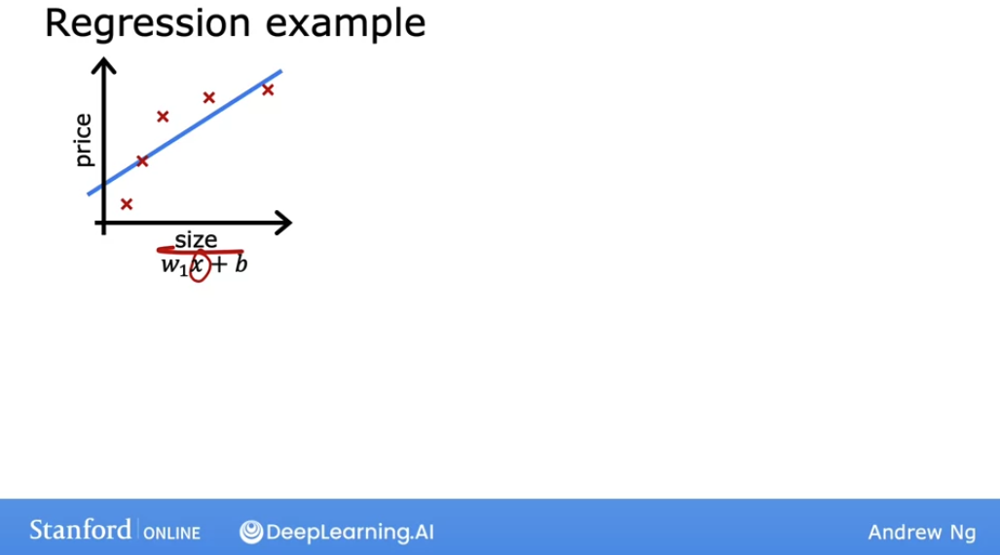

In the examplea above, see how we used linear regression to fit a linear function to the data. But this is not a very good fit: in reality house prices flatten out after a certain point, but our curve continues linearly up.

So the algorithm does not fit the training set well: **there is an underlying pattern in the data that our model does not represent well.**
- The technical term for this is **underfitting** the training data. 
- It is also said that the algorithm has **high bias**.

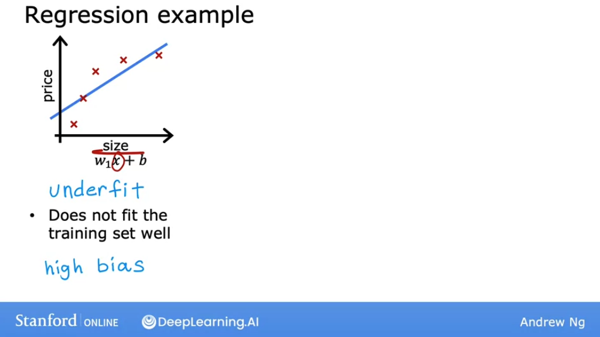

Now let's see a second variation of the model, using a quadratic function, with two features, $x_1$ and $x_2$, which is squared, and two corresponding parameters.

And we get a curve like this, that fits the data pretty well.

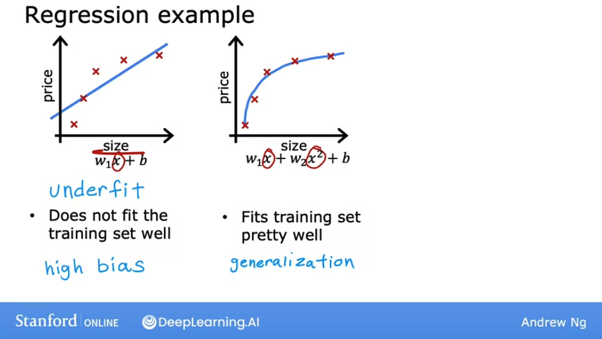

And if we were to get the data for a house that wasn't in the training examples, this model would probably do quite well predicting its price based on its features.

The idea that we want our learning algorithm to predict well, even on examples that are not on the training set, is called **generalization**. 

Now let's look at the other extreme: what if we fit a fourth-order polynomial to the data? 

With this function we can get a function that passes through all training data points exactly, and we might get a curve that looks like this:

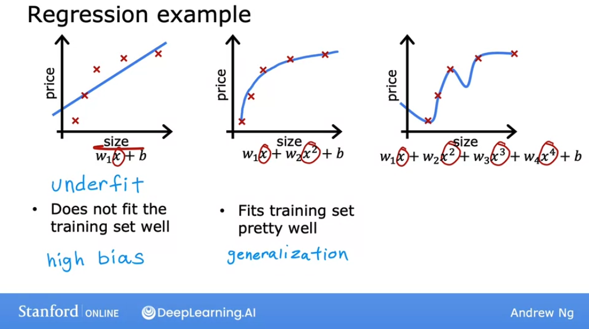

This seems to be fitting the training set **extremely** well, even probably having the cost being reduced to 0. 

But let's take a look at what happens in some cases:

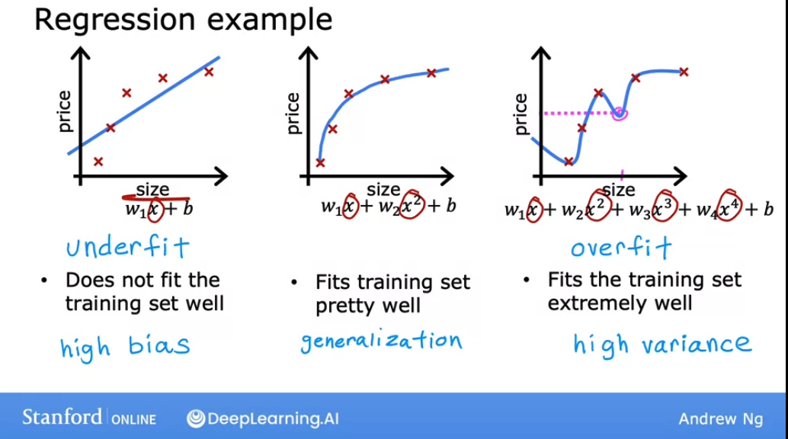

We can see that a house marked by the violet point has a lower price than a house which is smaller, which doesn't make sense. So this is not a particularly good model for predicting.

The technical term is: **overfit**. We say that this model has **overfit** the data, or it has an overfitting the problem. It doesn't look like this model would generalize to new problems it hasn't seen before.

Another term for this is that the algorithm has **high variance**. 

> Both **high variance** and **overfit** are used interchangably, same as **high bias** and **underfit**.

The intuition behind **overfitting** or **high-variance** is that the algorithm is trying very hard to fit every single training example. But if our training set were just even a little bit different, say one house was priced just a little bit more or a little bit less, then the function that the algorithm fits could end up being totally different. If two different machine learning engineers were to fit this fourth-order polynomial model, to just slightly different datasets, they could end up with totally different predictions or highly variable predictions. That's why we say the algorithm has **high variance**.

So, in summary, we want to find a model that fits the model **"just right"**, without underfitting or overfitting the data:

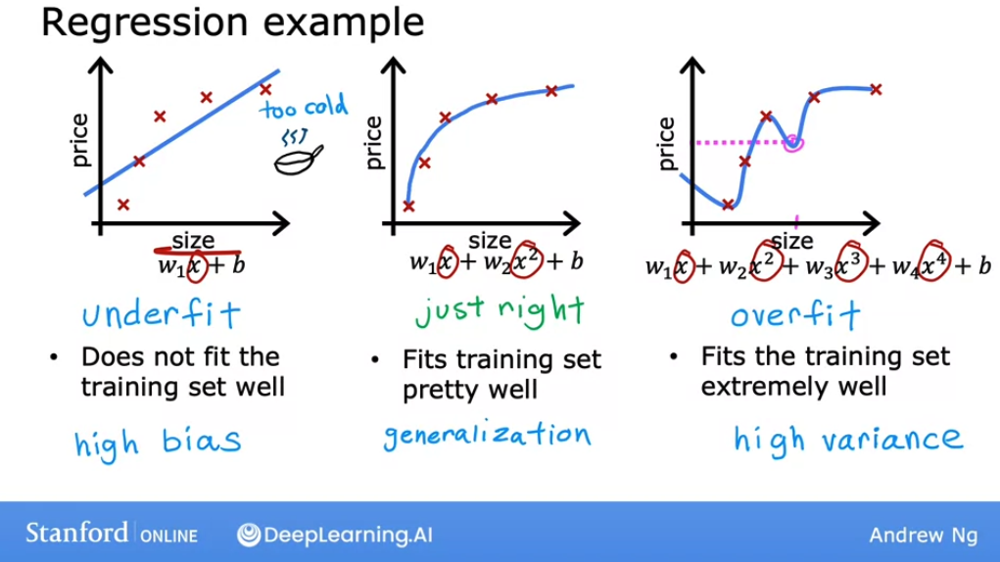

### Overfitting in classification

Overfitting applies a classification as well. H

ere's a classification example with two features, $x_1$ and $x_2$, where $x_1$ is maybe the tumor size and $x_2$ is the age of patient. 

We're trying to classify if a tumor is malignant or benign, as denoted by these crosses and circles. One thing we could do is fit a simple logistic regression model, where as usual, $g$ is the sigmoid function. If we do that, we end up with a straight line as the decision boundary. 

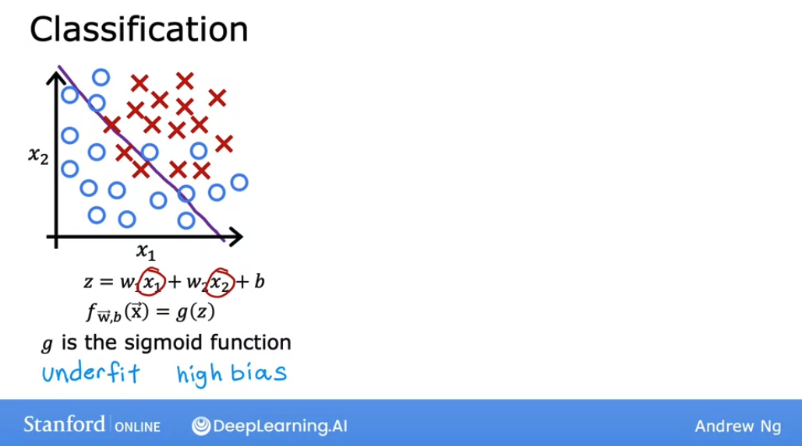

This purple line is the line where $z$ is equal to zero and separates the positive and negative examples. This straight line looks okay, but it doesn't look like a very good fit to the data either. This is an example of **underfitting** or of **high bias.**

Let's look at another example. If we were to add to our features some quadratic terms, then $z$ becomes the new term in the sigmoid function. And the decision boundary -that is, where $z$ equals zero can look more like an ellipse or part of an ellipse, which is a pretty good fit to the data, even though it does not perfectly classify every single training example in the training set.

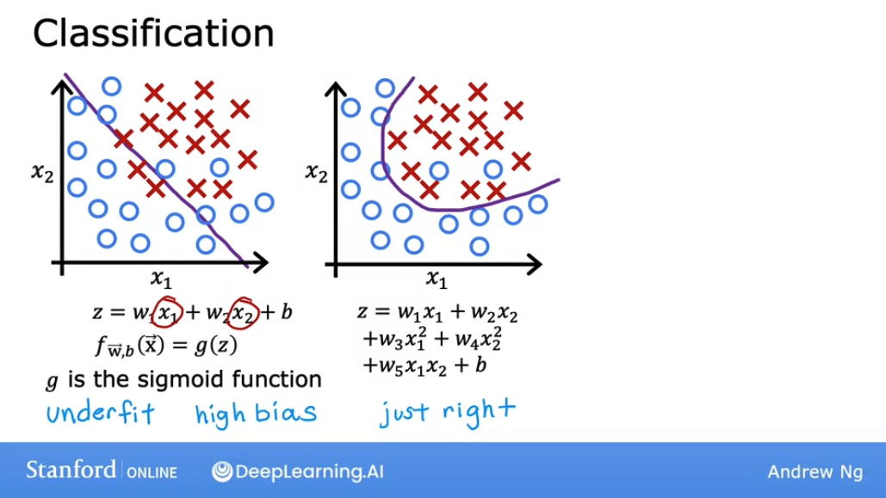

Notice how some of these crosses get classified among the circles. But this model looks pretty good. I'm going to call it just right. It looks like this generalized pretty well to new patients.

Finally, at the other extreme, if we were to fit a very high-order polynomial with many features like these, then the model may try really hard and contourt or twist itself to find a decision boundary that fits our training data perfectly.

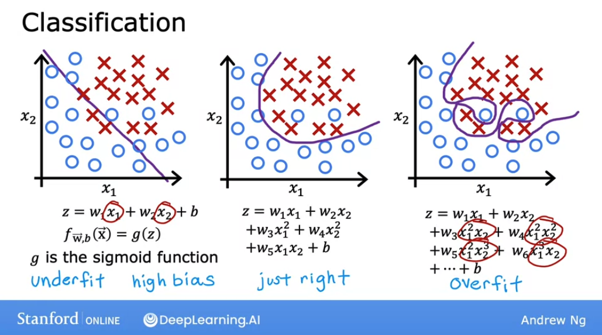

Having all these higher-order polynomial features allows the algorithm to choose this really overly complex decision boundary. If the features are tumor size and age, and you're trying to classify tumors as malignant or benign, then this doesn't really look like a very good model for making predictions. Once again, this is an instance of overfitting and high variance because its model, despite doing very well on the training set, doesn't look like it'll generalize well to new examples

## Adressing overfitting

Let's talk about what we can do to address overfitting. 

Let's say we fit a model and it has high variance, i.e is overfitted. Here's our overfit house price prediction model:

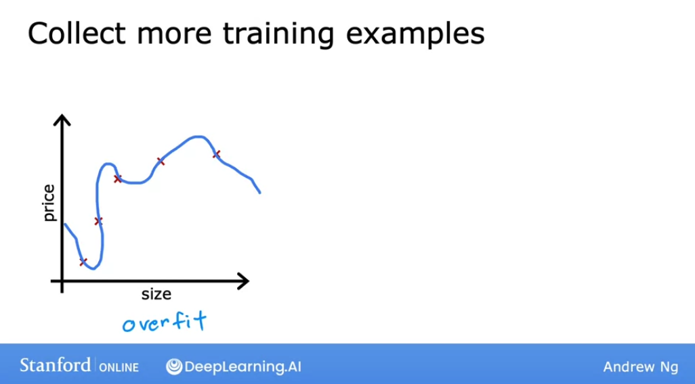

### 1. Collecting more training data

One way to address this problem is to **collect more training data.**

If we aree able to get more data, that is, more training examples on sizes and prices of houses, then with the larger training set, the learning algorithm will learn to fit a function that is less wiggly:

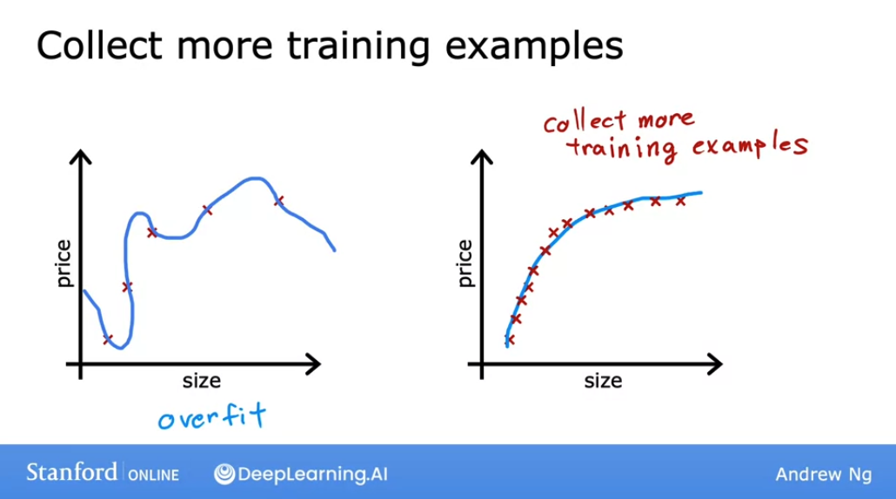

We can continue to fit a high order polynomial or some other function with a lot of features, and if we have enough training examples, it will still do okay. 

To summarize, **the number one tool we can use against overfitting is to get more training data.** However, getting more data isn't always an option: maybe only so many houses have been sold in this location, so maybe there just isn't more data to be add.

### 2. Select features to include/exclude

A second option for addressing overfitting **is to try to use fewer features.**

In the models we saw before, features included the size x, as well as the size squared, and this x squared, and x cubed and $x^4$ and so on. These were a lot of polynomial features. 

In cases like this, **one way to reduce overfitting is to just not use so many of these polynomial features**. 

Let's look at a different example. Maybe we have a lot of different features of a house of which we are trying to predict its price, ranging from the size, number of bedrooms, number of floors, the age, average income of the neighborhood, etc. 

**If we have a lot of features like these, but don't have enough training data, then our learning algorithm may also overfit to our training set**. 

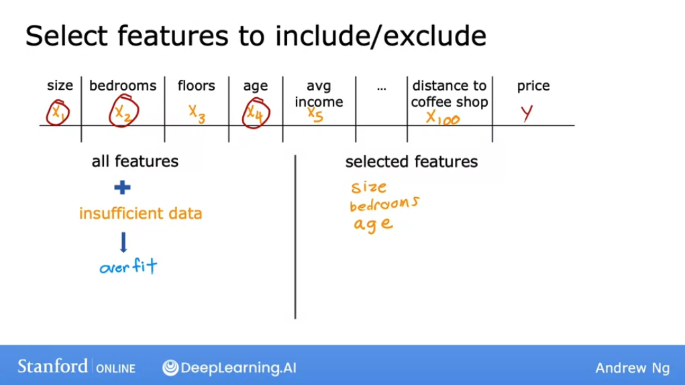

Now, if instead of using all `100` features, we were to pick just a subset of the most useful or relevant ones, for example **size**, **bedrooms**, and the **age** of the house, then using just that smallest subset of features, we may find that our model no longer overfits as badly. 

Choosing the most appropriate set of features to use is called **feature selection.** 

One way we can do so is to use our intuition to choose what we think is the best set of features, i.e what's most relevant for predicting the price. 

Now, **one disadvantage of feature selection is that by using only a subset of the features, the algorithm is throwing away some of the information that we have about the houses**. For example: maybe all of these features, all 100 of them are actually useful for predicting the price of a house. 

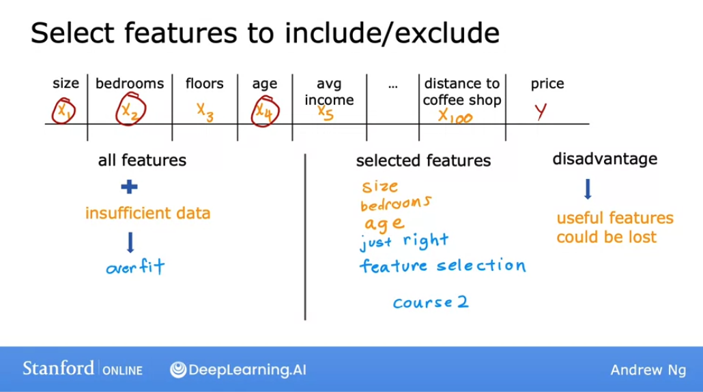

### 3. Regularization

The third option for reducing overfitting is called **regularization**. 

If we look at an overfit model, like the following, where we have a model using polynomial features: $x$, $x$ squared, $x$ cubed, and so on. And we find that the parameters are often relatively large: 

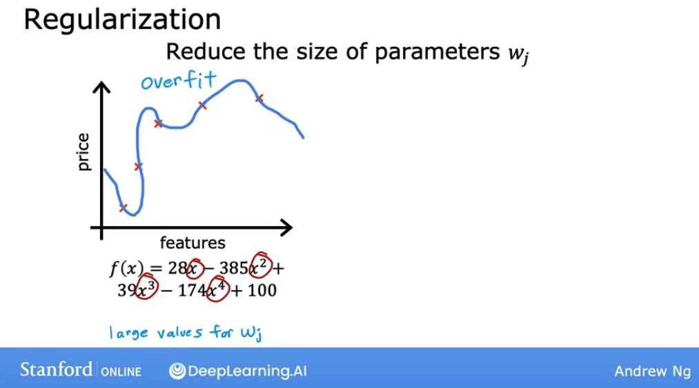

Now, if we were to eliminate some of these features, for example, eliminating the feature $x_4$, that would correspond to setting this parameter to `0`. Setting a parameter to 0 is equivalent to eliminating a feature.

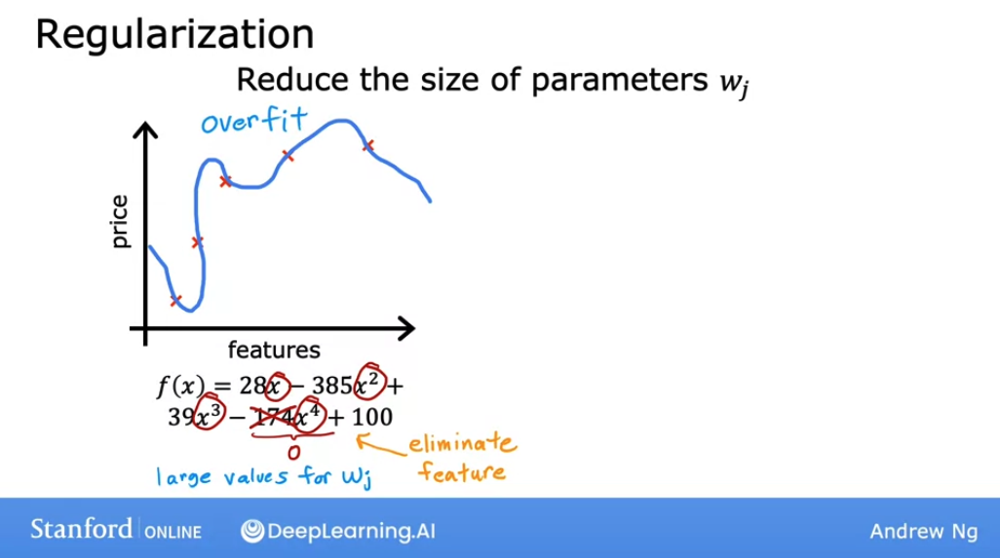

**Regularization** is a way to **more gently reduce the impacts of some of the features without doing something as harsh as eliminating it outright.** 

What regularization does is to **encourage the learning algorithm to shrink the values of the parameters without necessarily demanding that the parameter is set to exactly 0**.

So, even if we fit a higher order polynomial, as long as we can get the algorithm to use smaller parameter values ($w_1$, $w_2$, $w_3$, $w_4$), we end up with a curve that ends up fitting the training data much better: 

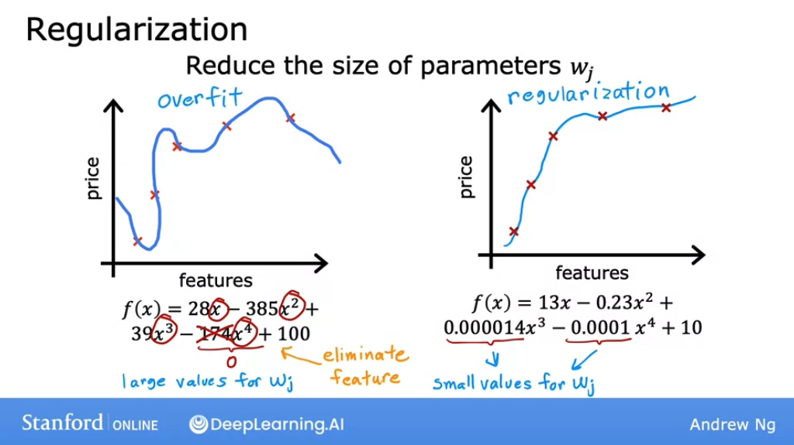

So regularization lets us keep all of our features, but it just prevents the features from having an overly large effect, which is what sometimes can cause overfitting. 

Also, by convention, we normally just reduce the size of the $w_j$ parameters, that is, $w1$ through $w_n$. It doesn't make a huge difference whether we regularize the parameter $b$ as well: we could do so if we want or not if we don't.

To recap:

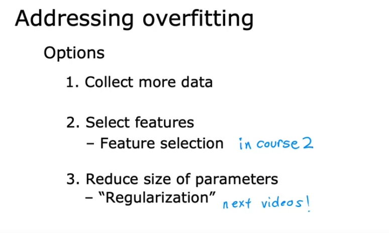

## Optional Lab: Overfitting