# The problem of overfitting

## The problem of overfitting

Sometimes in an application of algorithms like linear regression or logistic regression, the algorithm can run into a problem called **overfitting**, which can cause it to perform poorly. 

To help us understand what is overfitting, let's take a look at a few examples. Let's first go back to our original example of predicting housing prices with linear regression, predicting price from house size.

Suppose our data looks like this:

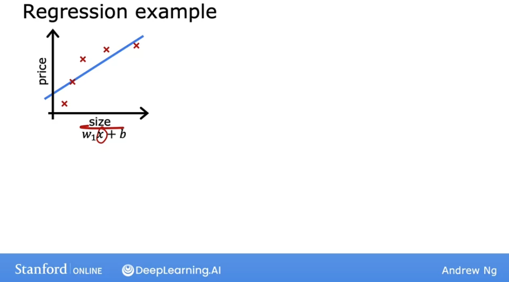

In the examplea above, see how we used linear regression to fit a linear function to the data. But this is not a very good fit: in reality house prices flatten out after a certain point, but our curve continues linearly up.

So the algorithm does not fit the training set well: **there is an underlying pattern in the data that our model does not represent well.**
- The technical term for this is **underfitting** the training data. 
- It is also said that the algorithm has **high bias**.

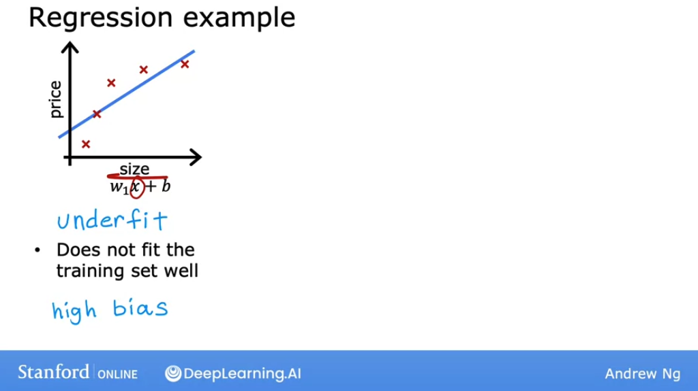

Now let's see a second variation of the model, using a quadratic function, with two features, $x_1$ and $x_2$, which is squared, and two corresponding parameters.

And we get a curve like this, that fits the data pretty well.

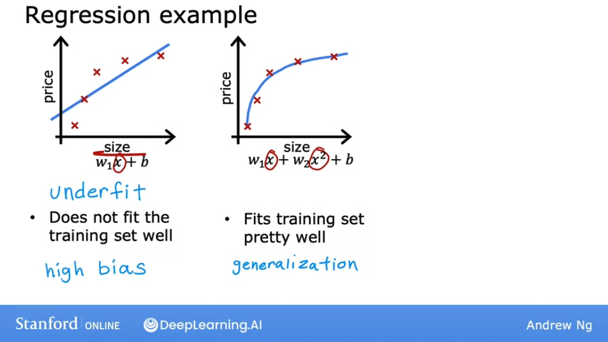

And if we were to get the data for a house that wasn't in the training examples, this model would probably do quite well predicting its price based on its features.

The idea that we want our learning algorithm to predict well, even on examples that are not on the training set, is called **generalization**. 

Now let's look at the other extreme: what if we fit a fourth-order polynomial to the data? 

With this function we can get a function that passes through all training data points exactly, and we might get a curve that looks like this:

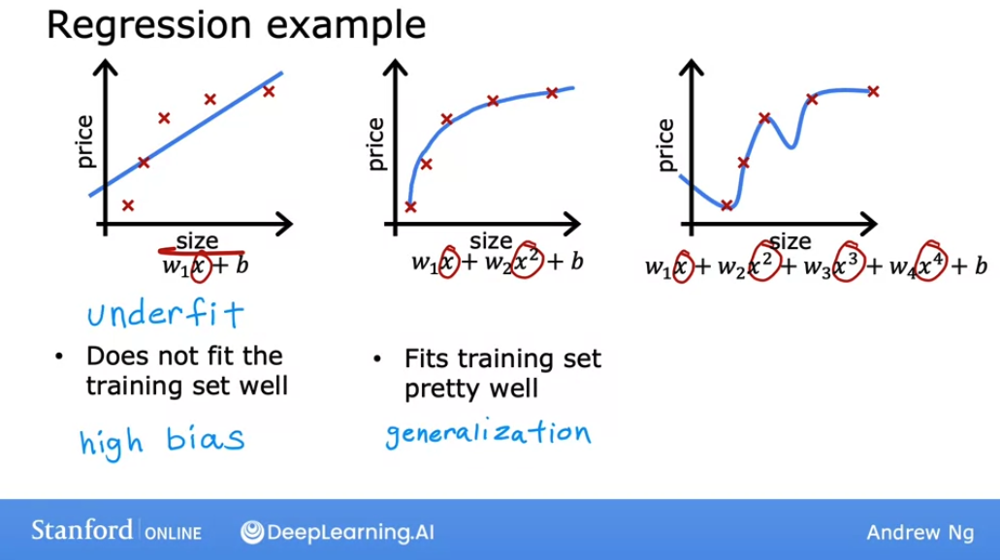

This seems to be fitting the training set **extremely** well, even probably having the cost being reduced to 0. 

But let's take a look at what happens in some cases:

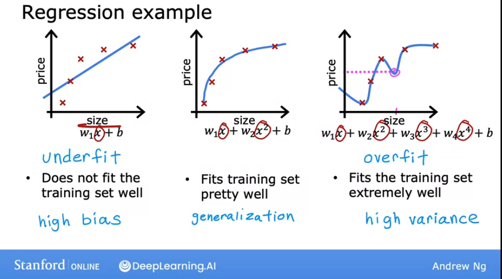

We can see that a house marked by the violet point has a lower price than a house which is smaller, which doesn't make sense. So this is not a particularly good model for predicting.

The technical term is: **overfit**. We say that this model has **overfit** the data, or it has an overfitting the problem. It doesn't look like this model would generalize to new problems it hasn't seen before.

Another term for this is that the algorithm has **high variance**. 

> Both **high variance** and **overfit** are used interchangably, same as **high bias** and **underfit**.

The intuition behind **overfitting** or **high-variance** is that the algorithm is trying very hard to fit every single training example. But if our training set were just even a little bit different, say one house was priced just a little bit more or a little bit less, then the function that the algorithm fits could end up being totally different. If two different machine learning engineers were to fit this fourth-order polynomial model, to just slightly different datasets, they could end up with totally different predictions or highly variable predictions. That's why we say the algorithm has **high variance**.

So, in summary, we want to find a model that fits the model **"just right"**, without underfitting or overfitting the data:

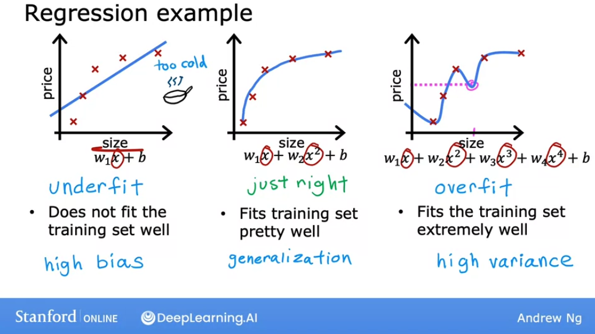

### Overfitting in classification

Overfitting applies a classification as well. H

ere's a classification example with two features, $x_1$ and $x_2$, where $x_1$ is maybe the tumor size and $x_2$ is the age of patient. 

We're trying to classify if a tumor is malignant or benign, as denoted by these crosses and circles. One thing we could do is fit a simple logistic regression model, where as usual, $g$ is the sigmoid function. If we do that, we end up with a straight line as the decision boundary. 

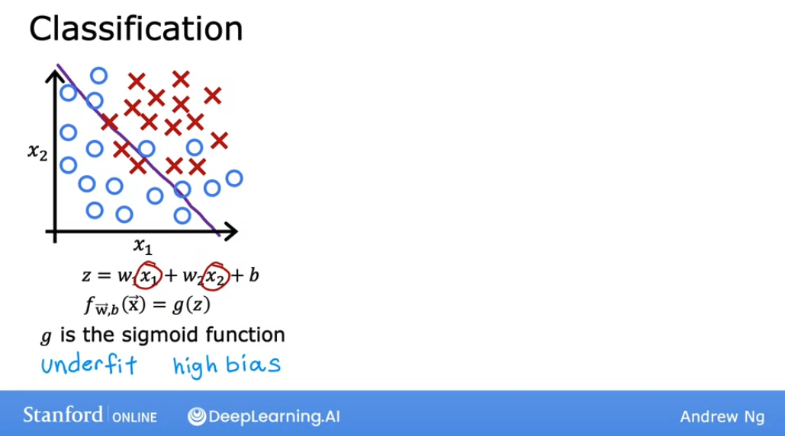

This purple line is the line where $z$ is equal to zero and separates the positive and negative examples. This straight line looks okay, but it doesn't look like a very good fit to the data either. This is an example of **underfitting** or of **high bias.**

Let's look at another example. If we were to add to our features some quadratic terms, then $z$ becomes the new term in the sigmoid function. And the decision boundary -that is, where $z$ equals zero can look more like an ellipse or part of an ellipse, which is a pretty good fit to the data, even though it does not perfectly classify every single training example in the training set.

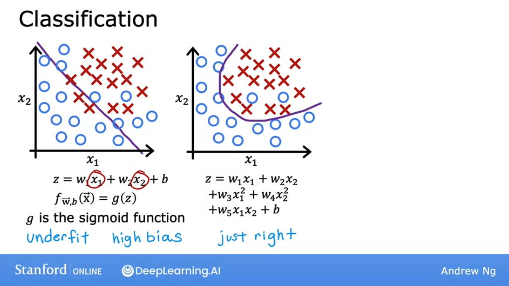

Notice how some of these crosses get classified among the circles. But this model looks pretty good. I'm going to call it just right. It looks like this generalized pretty well to new patients.

Finally, at the other extreme, if we were to fit a very high-order polynomial with many features like these, then the model may try really hard and contourt or twist itself to find a decision boundary that fits our training data perfectly.

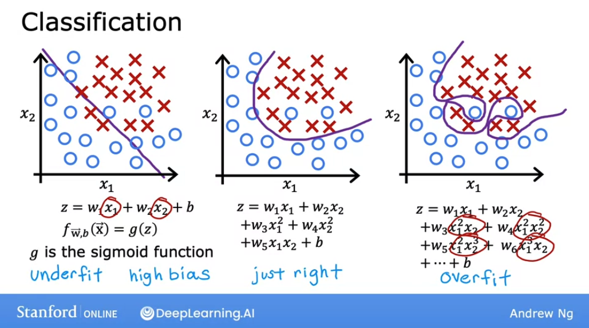

Having all these higher-order polynomial features allows the algorithm to choose this really overly complex decision boundary. If the features are tumor size and age, and we're trying to classify tumors as malignant or benign, then this doesn't really look like a very good model for making predictions. Once again, this is an instance of overfitting and high variance because its model, despite doing very well on the training set, doesn't look like it'll generalize well to new examples

## Adressing overfitting

Let's talk about what we can do to address overfitting. 

Let's say we fit a model and it has high variance, i.e is overfitted. Here's our overfit house price prediction model:

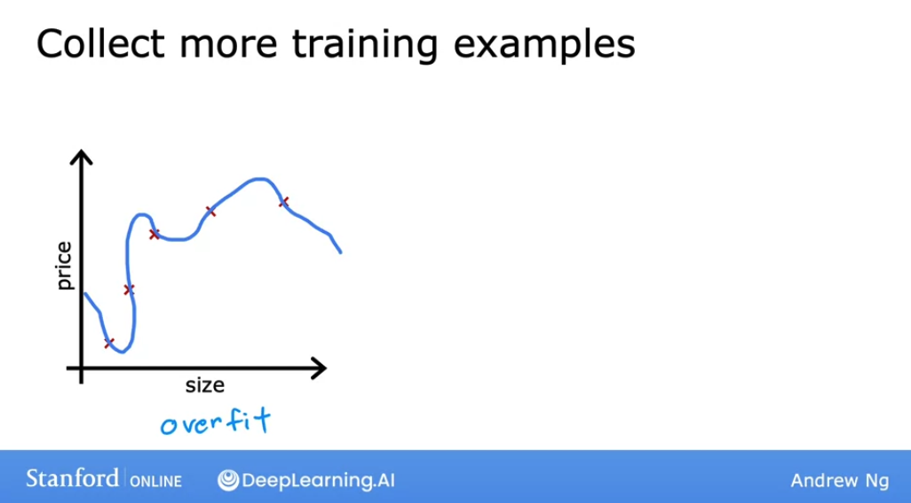

### 1. Collecting more training data

One way to address this problem is to **collect more training data.**

If we aree able to get more data, that is, more training examples on sizes and prices of houses, then with the larger training set, the learning algorithm will learn to fit a function that is less wiggly:

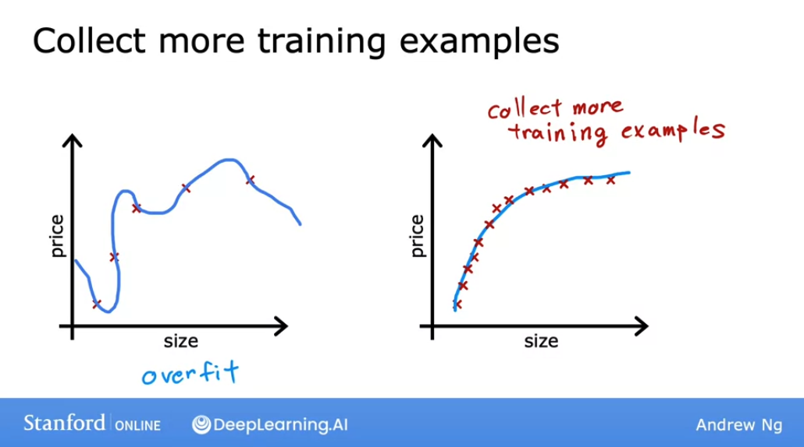

We can continue to fit a high order polynomial or some other function with a lot of features, and if we have enough training examples, it will still do okay. 

To summarize, **the number one tool we can use against overfitting is to get more training data.** However, getting more data isn't always an option: maybe only so many houses have been sold in this location, so maybe there just isn't more data to be add.

### 2. Select features to include/exclude

A second option for addressing overfitting **is to try to use fewer features.**

In the models we saw before, features included the size x, as well as the size squared, and this x squared, and x cubed and $x^4$ and so on. These were a lot of polynomial features. 

In cases like this, **one way to reduce overfitting is to just not use so many of these polynomial features**. 

Let's look at a different example. Maybe we have a lot of different features of a house of which we are trying to predict its price, ranging from the size, number of bedrooms, number of floors, the age, average income of the neighborhood, etc. 

**If we have a lot of features like these, but don't have enough training data, then our learning algorithm may also overfit to our training set**. 

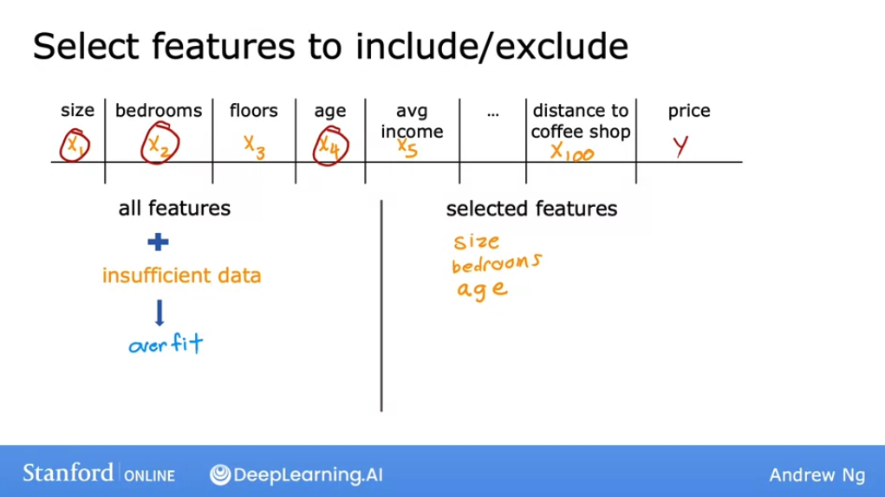

Now, if instead of using all `100` features, we were to pick just a subset of the most useful or relevant ones, for example **size**, **bedrooms**, and the **age** of the house, then using just that smallest subset of features, we may find that our model no longer overfits as badly. 

Choosing the most appropriate set of features to use is called **feature selection.** 

One way we can do so is to use our intuition to choose what we think is the best set of features, i.e what's most relevant for predicting the price. 

Now, **one disadvantage of feature selection is that by using only a subset of the features, the algorithm is throwing away some of the information that we have about the houses**. For example: maybe all of these features, all 100 of them are actually useful for predicting the price of a house. 

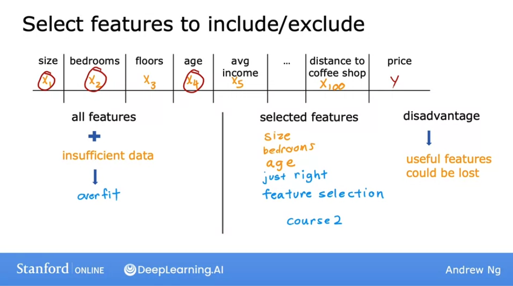

### 3. Regularization

The third option for reducing overfitting is called **regularization**. 

If we look at an overfit model, like the following, where we have a model using polynomial features: $x$, $x$ squared, $x$ cubed, and so on. And we find that the parameters are often relatively large: 

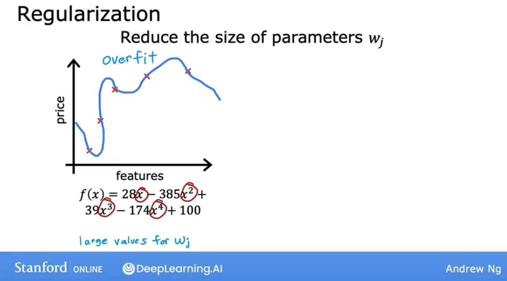

Now, if we were to eliminate some of these features, for example, eliminating the feature $x_4$, that would correspond to setting this parameter to `0`. Setting a parameter to 0 is equivalent to eliminating a feature.

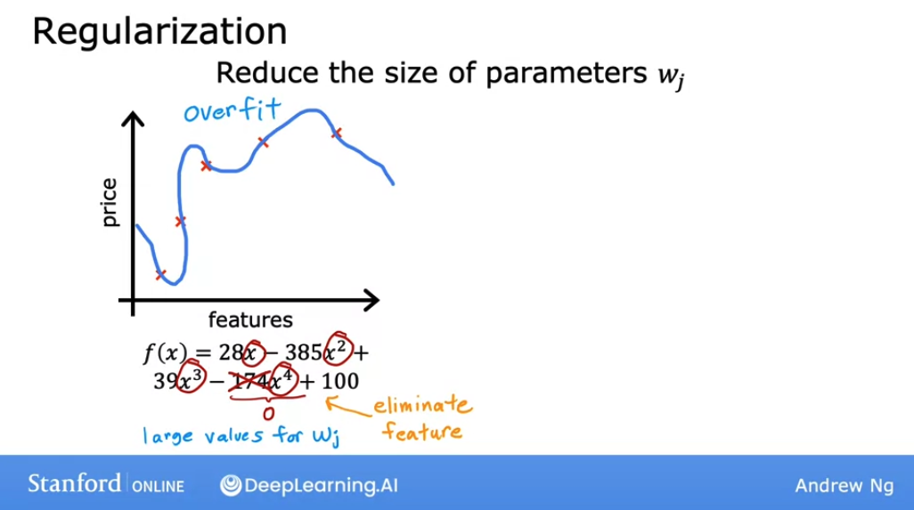

**Regularization** is a way to **more gently reduce the impacts of some of the features without doing something as harsh as eliminating it outright.** 

What regularization does is to **encourage the learning algorithm to shrink the values of the parameters without necessarily demanding that the parameter is set to exactly 0**.

So, even if we fit a higher order polynomial, as long as we can get the algorithm to use smaller parameter values ($w_1$, $w_2$, $w_3$, $w_4$), we end up with a curve that ends up fitting the training data much better: 

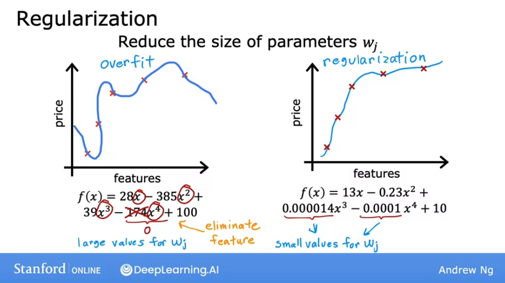

So regularization lets us keep all of our features, but it just prevents the features from having an overly large effect, which is what sometimes can cause overfitting. 

Also, by convention, we normally just reduce the size of the $w_j$ parameters, that is, $w1$ through $w_n$. It doesn't make a huge difference whether we regularize the parameter $b$ as well: we could do so if we want or not if we don't.

To recap:


## Optional Lab: Overfitting

[LINK](https://www.coursera.org/learn/machine-learning/ungradedLab/3nraU/optional-lab-overfitting/lab?path=%2Fnotebooks%2FC1_W3_Lab08_Overfitting_Soln.ipynb)

[Internal Link](./labs/Week%203/C1_W3_Lab08_Overfitting_Soln.ipynb)

In this lab, we will explore:
- the situations where overfitting can occur
- some of the solutions

```py
%matplotlib widget
import matplotlib.pyplot as plt
from ipywidgets import Output
from plt_overfit import overfit_example, output
plt.style.use('./deeplearning.mplstyle')
```

The week's lecture described situations where overfitting can arise. Run the cell below to generate a plot that will allow you to explore overfitting. There are further instructions below the cell.

```py
plt.close("all")
display(output)
ofit = overfit_example(False)
```

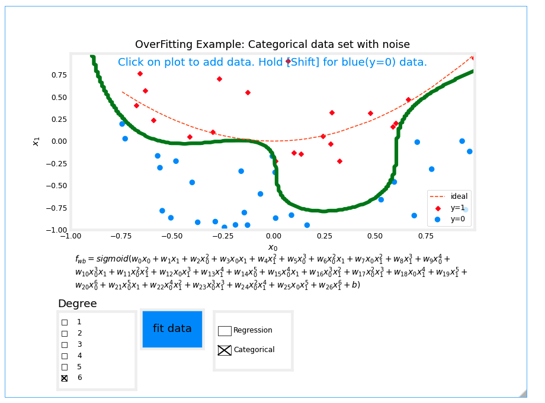

In the plot above you can:
- switch between Regression and Categorization examples
- add data
- select the degree of the model
- fit the model to the data  

Here are some things you should try:
- Fit the data with degree = 1; Note 'underfitting'.
- Fit the data with degree = 6; Note 'overfitting'
- tune degree to get the 'best fit'
- add data:
    - extreme examples can increase overfitting (assuming they are outliers).
    - nominal examples can reduce overfitting
- switch between `Regression` and `Categorical` to try both examples.

To reset the plot, re-run the cell. Click slowly to allow the plot to update before receiving the next click.

Notes on implementations:
- the 'ideal' curves represent the generator model to which noise was added to achieve the data set
- 'fit' does not use pure gradient descent to improve speed. These methods can be used on smaller data sets. 

## Cost function with regularization

We have seen already how regularization tries to make the parameter values $w_1$ to $w_n$ small to reduce overfitting.

Now we'll build on that intuition and develop a modified cost function for our learning algorithm that wecan use to actually apply regularization.

Recall our previous example where we had the same data, once fitted with a second order polynomial and another one with a fourth order polynomial. The quadratic fit is really good, but the fourth order ends up overfitting the data:

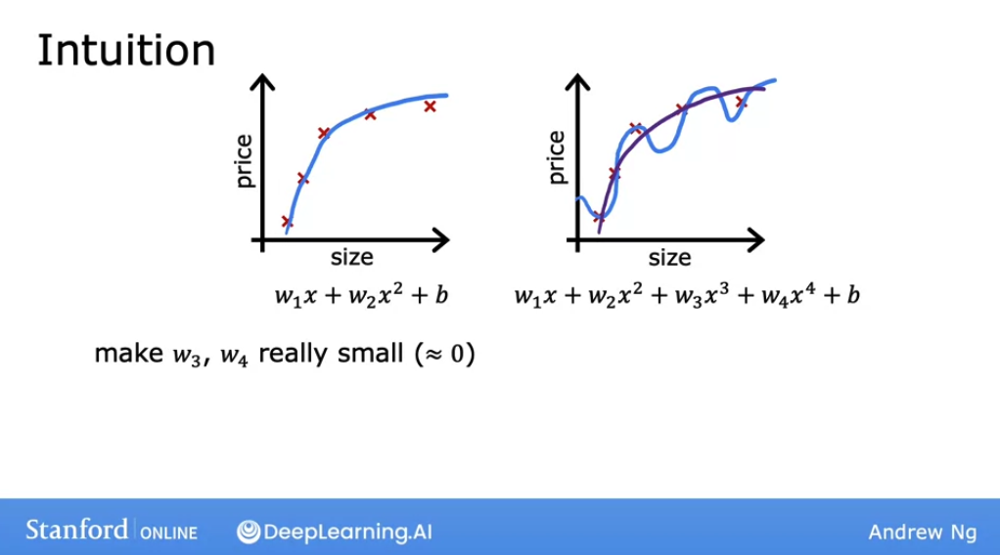

But now uppose that we had a way to make the parameters $w_3$ and $w_4$ really, really small, close to 0. So, instead of minimizing the normal cost objective function, i.e. a cost function for linear regression as seen below, we could modify the cost function and add to it 1000 times $w_3^2$ and 1000 times $w_4^2. 

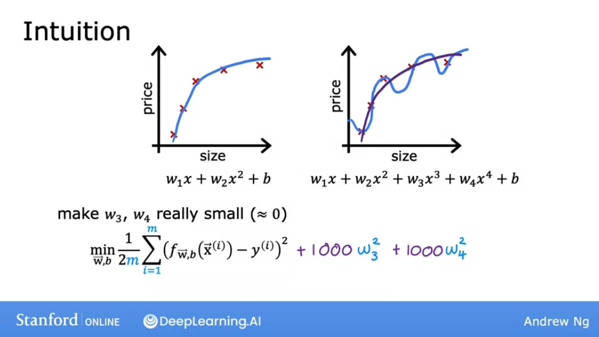

From:

$$\min_{\mathbf{\vec{w}},b} \frac{1}{2m} \sum\limits_{i = 0}^{m-1} (f_{\mathbf{w},b}(\mathbf{x}^{(i)}) - y^{(i)})^2 $$ 

We can penalize that cost function by adding the terms:

$$\min_{\mathbf{\vec{w}},b} \frac{1}{2m} \sum\limits_{i = 0}^{m-1} (f_{\mathbf{w},b}(\mathbf{x}^{(i)}) - y^{(i)})^2 + 1000 w_3^2 + 1000 w_4^2$$ 

because in this way, the only way to minimize this new modified this cost function is **if $w_3$ and $w_4$** are both small. So when we minimize this function we'll end up with $w_3$ and $w_4$ very close to 0.

So we're effectively nearly canceling out the effects of the features $x_3$ and $x_4$ and getting rid of tthose terms. 

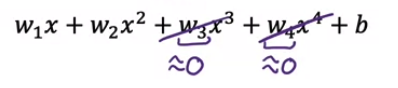


If we do that,  we end up with a fit to the data that's much closer to the quadratic function, including  just tiny contributions from the features $x_3$ and $x_4$.

More generally, here's the idea behind regularization: **if we have smaller values for the parameters $w_j$, then is like having a simpler model.**  A model with smaller values for the its paremeters is more similar to a model with fewer features, which is therefore less prone to overfitting. 

Generally, if we have a lot of features, for example, a 100 features, we may not know which are the most important features and which ones to penalize. 

**So regularization is typically implemented by penalizing all of the features or, more precisely, we penalize all the $w_j$ parameters.** This will usually result in fitting a smoother, simpler, less "wiggly" function that is less prone to overfitting. 

So for the example of houses prices, if we have data with 100 features for each house, it may be hard to pick an advance which features to include and which ones to exclude. So let's build a model that uses all 100 features.

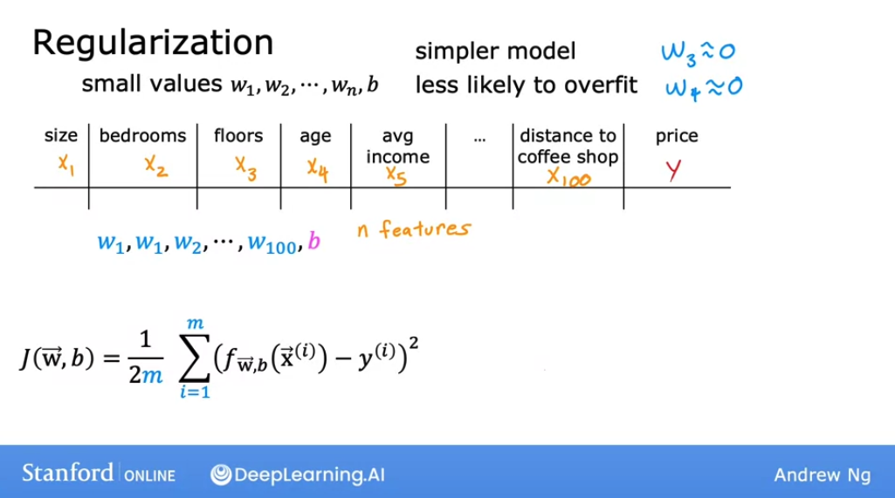

Because we don't know which of these parameters are going to be the important ones, we penalize all of them and shrink all of them by adding this new second term to the cost function:

$$J(\mathbf{w},b) = \frac{1}{2m} \sum\limits_{i = 0}^{m-1} (f_{\mathbf{w},b}(\mathbf{x}^{(i)}) - y^{(i)})^2 \color{red} + \frac{\lambda}{2m} \sum\limits_{j = 0}^{n-1} w_j^2$$ 

The $\lambda$ parameter is called the **regularization parameter**, which has to be chosen in a similar way as the learning rate $\alpha$.

Notice that:
- $\lambda$ is scaled over $2m$ in a similar way as the squared error cost is. This makes it easier to choose a good value for lambda.
- we don't penalize $b$. Some ML engineers do it, but it doesn't make much of a difference for the cost function

In this new function we want to minimize the original term, the mean squared error, and the second term, called the regularization term. This new cost function makes a trade-off of two goals that we have:

1. minimizing the first term encourages the algoruthm to fit the training data well by minimizing the squared differences of the predictions and the acutal values
2. minimizing the second term, the algorithm tries to keep the parameters $w_j$ small, which will tend to reduce overfitting.

The value of lambda $\lambda$ that we choose **specifies the relative importance or the relative trade off or how we balance between these two goals.** 

Let's take a look at what different values of lambda will cause we're learning algorithm to do, using the housing price prediction example using linear regression, where $f(x)$ is the linear regression model. 

**If lambda was set to be 0,** then we're not using the regularization term at all because it is multiplied by 0. And so if lambda was 0, we end up fitting this overly wiggly, overly complex curve causing the model to overfit:

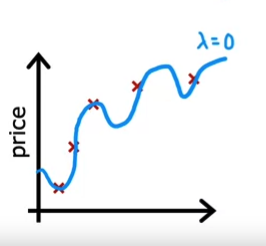

Let's now look at the other extreme: **if we set lambda to be a really large number, like $10^10$.** So now we're placing a very heavy weight on the regularization term on cost function. 

And the only way to minimize this is to be sure that all the values of $w$ are pretty much very close to 0. So if lambda is very, very large, the learning algorithm will choose $w_1$, $w_2$, $w_3$ and $w_4$ to be extremely close to `0`` and thus $f(x)$ weill be basically equal to $b$.

This means that the learning algorithm fits a horizontal straight line and underfits:

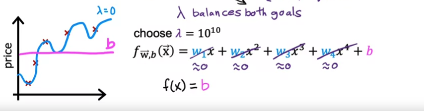

So what we want is some value of lambda that is somewhere in between that more appropriately balances these first and second terms of trading off, minimizing the mean squared error and keeping the parameters small. 

When the value of lambda is not too small and not too large, but just right, then hopefully we end up able to fit a 4th order polynomial, keeping all of these features, but with a function that looks like this (in purple): 

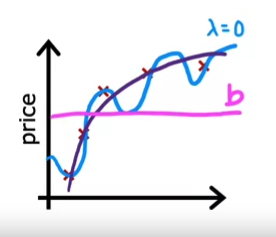

## Regularized linear regression

Let's now see how to get gradient descent to work with regularized linear regression. Let's see again our new const function with the regularization parameter:

$$J(\mathbf{w},b) = \frac{1}{2m} \sum\limits_{i = 0}^{m-1} (f_{\mathbf{\vec{w}},b}(\mathbf{\vec{x}}^{(i)}) - y^{(i)})^2 + \frac{\lambda}{2m} \sum\limits_{j = 0}^{n-1} w_j^2$$

Since we have this new term, the gradient descent algorithm will have a small change: while the algorithm and its formula stay the same:

$$\begin{align*}
&\text{repeat until convergence:} \; \lbrace \\
&  \; \; \;w_j = w_j -  \alpha \frac{\partial J(\mathbf{\vec{w}},b)}{\partial w_j}\; & \text{for j := 0..n-1} \\ 
&  \; \; \;  \; \;b = b -  \alpha \frac{\partial J(\mathbf{\vec{w}},b)}{\partial b} \\
&\rbrace
\end{align*}$$

But notice now that the partial derivatives of the cost function, with respect to $w$ and $b$ will now be applying over this new term, so they will change:

$$\frac{\partial J(\mathbf{\vec{w}},b)}{\partial w_j} =  \frac{1}{m} \sum\limits_{i = 0}^{m-1} (f_{\mathbf{\vec{w}},b}(\mathbf{\vec{x}}^{(i)}) - y^{(i)}) x_j^{(i)} \color{red} + \frac{\lambda}{m} w_j $$

$$\frac{\partial J(\mathbf{\vec{w}},b)}{\partial b_j} =  \frac{1}{m} \sum\limits_{i = 0}^{m-1} (f_{\mathbf{\vec{w}},b}(\mathbf{\vec{x}}^{(i)}) - y^{(i)})$$

Notice that since we are not trying to regularize the parameter $b$, and is thus not included in the cost function, its partial derivate with respect to $b$ stays the same.

So putting these new values in the gradient descent algorithm we get:

$$\begin{align*}
&\text{repeat until convergence:} \; \lbrace \\
&  \; \; \;w_j = w_j -  \alpha [\frac{1}{m} \sum\limits_{i = 0}^{m-1} (f_{\mathbf{\vec{w}},b}(\mathbf{\vec{x}}^{(i)}) - y^{(i)}) x_j^{(i)}  + \frac{\lambda}{m} w_j] \\ 
&  \; \; \;  \; \;b = b -  \alpha \frac{1}{m} \sum\limits_{i = 0}^{m-1} (f_{\mathbf{\vec{w}},b}(\mathbf{\vec{x}}^{(i)}) - y^{(i)}) \\
&\rbrace
\end{align*}$$


Let's now try to see some material to convey a slightly deeper intuition about what this formula is actually doing:


Let's rewrite the formula for $w_j$ in gradient descent the following way:

$$ w_j = 1 w_j -  \alpha \frac{\lambda}{m} w_j - \alpha \frac{1}{m} \sum\limits_{i = 0}^{m-1} (f_{\mathbf{\vec{w}},b}(\mathbf{\vec{x}}^{(i)}) - y^{(i)}) x_j^{(i)}  $$

$$ w_j = w_j (1 -  \alpha \frac{\lambda}{m} w_j ) - \color{red} \alpha \frac{1}{m} \sum\limits_{i = 0}^{m-1} (f_{\mathbf{\vec{w}},b}(\mathbf{\vec{x}}^{(i)}) - y^{(i)}) x_j^{(i)}  $$

Notice that now, the second term, marked in red, is the normal update $w_j$ in the gradient algorithm when we don't have regularization, i.e. what we substracted from $w_j$ in each term.

And so now we can see that the only difference with the original formula for updating $w_j$ is that the first term $w_j$ is multiplied by $(1 - \alpha \frac{\lambda}{m})$.

So what is **$(1 - \alpha \frac{\lambda}{m})$**?

Let's see with an example:

- we know that **$\alpha$** is a small number, let's say, `0.01`
- **$\lambda$** is usually a small number, around the magnitude of `1` or `10`. Let's pick 1.

If we replace the numbers we get:

$$ \alpha  \frac{\lambda}{m} = 0.01 * \frac{1}{50} = 0.0002 $$

where $m$, the training set size is `50`. And:

$$(1 - \alpha \frac{\lambda}{m}) = (1 - 0.0002) = 0.9998$$

So, on every single iteration of gradient descent, we're taking $w_j$ and multypling it by `0.9998`, which makes it smaller on every step, before carrying out the usual update.

## Regularized logistic regression

Just as the gradient update for logistic regression was very similar to the gradient update for linear regression, **the gradient descent update for regularized logistic regression will also look similar to the update for regularized linear regression.** 

We saw earlier that logistic regression can be prone to overfitting if you fit it with very high order polynomial features, resulting in a fit like the one seen below: 

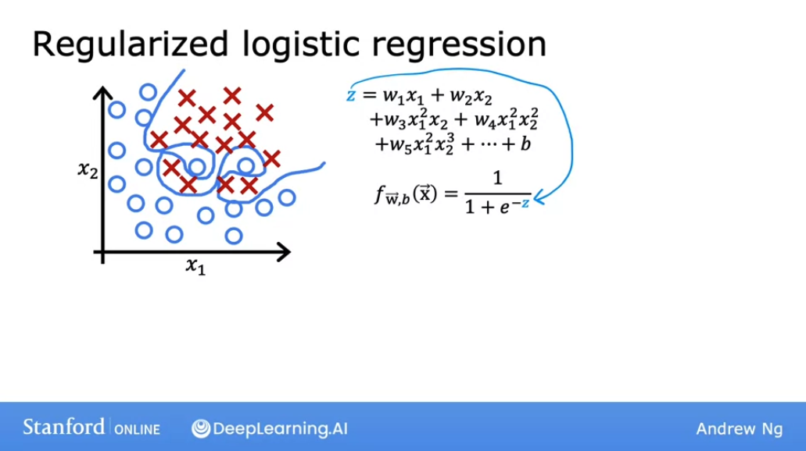

Here, $z$ is a high order polynomial that gets passed into the sigmoid function to compute $f(x)$. We can end up with a decision boundary that is overly complex and overfits as training set. In general, when we train logistic regression with a lot of features, whether polynomial features or some other features, there is a high risk of overfitting.

So now, if we want to modify our **cost function to apply regularization to it**, all we have to do is **add the same regularization term** that we did for linear regression:

$$J(\mathbf{w},b) = -\frac{1}{m} \sum\limits_{i = 1}^{m} [
  y^{(i)} \log\left(f_{\mathbf{w},b}( \mathbf{x}^{(i)} ) \right) + \left( 1 - y^{(i)}\right) \log \left( 1 + f_{\mathbf{w},b}( \mathbf{x}^{(i)} ) \right) + \frac{\lambda}{2m} \sum\limits_{j = 0}^{n-1} w_j^2$$

And when we apply this regularization term to the cost function, we end up with a much better fit for our function, far less prone to overfitting, like the purple curve below:

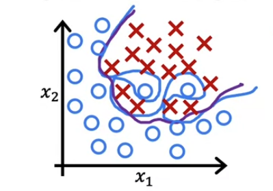

So to use this, we need to implement gradient descent as before:

$$\begin{align*}
&\text{repeat until convergence:} \; \lbrace \\
&  \; \; \;w_j = w_j -  \alpha \frac{\partial J(\mathbf{\vec{w}},b)}{\partial w_j}\; & \text{for j := 0..n-1} \\ 
&  \; \; \;  \; \;b = b -  \alpha \frac{\partial J(\mathbf{\vec{w}},b)}{\partial b} \\
&\rbrace
\end{align*}$$

Where the derivative terms are now:

$$\frac{\partial J(\mathbf{\vec{w}},b)}{\partial w_j} =  \frac{1}{m} \sum\limits_{i = 0}^{m-1} (f_{\mathbf{\vec{w}},b}(\mathbf{\vec{x}}^{(i)}) - y^{(i)}) x_j^{(i)} \color{red} + \frac{\lambda}{m} w_j $$

$$\frac{\partial J(\mathbf{\vec{w}},b)}{\partial b_j} =  \frac{1}{m} \sum\limits_{i = 0}^{m-1} (f_{\mathbf{\vec{w}},b}(\mathbf{\vec{x}}^{(i)}) - y^{(i)})$$

Notice that these are the **exact same equations that for linear regression**, with the only actual difference being that the definition of $f(x)$ is different: it is not the linear function, but the logistic function applied to $z$.

## Optional Lab: Regularization

[LINK](https://www.coursera.org/learn/machine-learning/ungradedLab/36A9A/optional-lab-regularization)

[Internal Link](./labs/Week%203/C1_W3_Lab09_Regularization_Soln.ipynb)

In this lab, you will:
- extend the previous linear and logistic cost functions with a regularization term.
- rerun the previous example of over-fitting with a regularization term added.

```py
import numpy as np
%matplotlib widget
import matplotlib.pyplot as plt
from plt_overfit import overfit_example, output
from lab_utils_common import sigmoid
np.set_printoptions(precision=8)
```

**Notes**:

- **Cost**
    - The cost functions differ significantly between linear and logistic regression, but adding regularization to the equations is the same.
- **Gradient**
    - The gradient functions for linear and logistic regression are very similar. They differ only in the implementation of $f_{wb}$.


**Cost function for regularized linear regression**

The equation for the cost function regularized linear regression is:
$$J(\mathbf{w},b) = \frac{1}{2m} \sum\limits_{i = 0}^{m-1} (f_{\mathbf{w},b}(\mathbf{x}^{(i)}) - y^{(i)})^2  + \frac{\lambda}{2m}  \sum_{j=0}^{n-1} w_j^2 \tag{1}$$ 
where:
$$ f_{\mathbf{w},b}(\mathbf{x}^{(i)}) = \mathbf{w} \cdot \mathbf{x}^{(i)} + b  \tag{2} $$ 


Compare this to the cost function without regularization (which you implemented in  a previous lab), which is of the form:

$$J(\mathbf{w},b) = \frac{1}{2m} \sum\limits_{i = 0}^{m-1} (f_{\mathbf{w},b}(\mathbf{x}^{(i)}) - y^{(i)})^2 $$ 

The difference is the regularization term,  <span style="color:blue">
    $$\frac{\lambda}{2m}  \sum_{j=0}^{n-1} w_j^2$$ </span> 
    
Including this term encourages gradient descent to minimize the size of the parameters. Note, in this example, the parameter $b$ is not regularized. This is standard practice.

Below is an implementation of equations (1) and (2). Note that this uses a *standard pattern for this course*, a `for loop` over all `m` examples:

```py
def compute_cost_linear_reg(X, y, w, b, lambda_ = 1):
    """
    Computes the cost over all examples
    Args:
      X (ndarray (m,n): Data, m examples with n features
      y (ndarray (m,)): target values
      w (ndarray (n,)): model parameters  
      b (scalar)      : model parameter
      lambda_ (scalar): Controls amount of regularization
    Returns:
      total_cost (scalar):  cost 
    """

    m  = X.shape[0]
    n  = len(w)
    cost = 0.
    for i in range(m):
        f_wb_i = np.dot(X[i], w) + b                                   #(n,)(n,)=scalar, see np.dot
        cost = cost + (f_wb_i - y[i])**2                               #scalar             
    cost = cost / (2 * m)                                              #scalar  
 
    reg_cost = 0
    for j in range(n):
        reg_cost += (w[j]**2)                                          #scalar
    reg_cost = (lambda_/(2*m)) * reg_cost                              #scalar
    
    total_cost = cost + reg_cost                                       #scalar
    return total_cost                                                  #scalar
```

Run the code below to see it in action:
```py
np.random.seed(1)
X_tmp = np.random.rand(5,6)
y_tmp = np.array([0,1,0,1,0])
w_tmp = np.random.rand(X_tmp.shape[1]).reshape(-1,)-0.5
b_tmp = 0.5
lambda_tmp = 0.7
cost_tmp = compute_cost_linear_reg(X_tmp, y_tmp, w_tmp, b_tmp, lambda_tmp)

print("Regularized cost:", cost_tmp)
# Regularized cost: 0.07917239320214275
```

**Cost function for regularized logistic regression**

For regularized **logistic** regression, the cost function is of the form
$$J(\mathbf{w},b) = \frac{1}{m}  \sum_{i=0}^{m-1} \left[ -y^{(i)} \log\left(f_{\mathbf{w},b}\left( \mathbf{x}^{(i)} \right) \right) - \left( 1 - y^{(i)}\right) \log \left( 1 - f_{\mathbf{w},b}\left( \mathbf{x}^{(i)} \right) \right) \right] + \frac{\lambda}{2m}  \sum_{j=0}^{n-1} w_j^2 \tag{3}$$
where:
$$ f_{\mathbf{w},b}(\mathbf{x}^{(i)}) = sigmoid(\mathbf{w} \cdot \mathbf{x}^{(i)} + b)  \tag{4} $$ 

Compare this to the cost function without regularization (which you implemented in  a previous lab):

$$ J(\mathbf{w},b) = \frac{1}{m}\sum_{i=0}^{m-1} \left[ (-y^{(i)} \log\left(f_{\mathbf{w},b}\left( \mathbf{x}^{(i)} \right) \right) - \left( 1 - y^{(i)}\right) \log \left( 1 - f_{\mathbf{w},b}\left( \mathbf{x}^{(i)} \right) \right)\right] $$

As was the case in linear regression above, the difference is the regularization term, which is    <span style="color:blue">
    $$\frac{\lambda}{2m}  \sum_{j=0}^{n-1} w_j^2$$ </span> 

Including this term encourages gradient descent to minimize the size of the parameters. Note, in this example, the parameter $b$ is not regularized. This is standard practice.

```py
def compute_cost_logistic_reg(X, y, w, b, lambda_ = 1):
    """
    Computes the cost over all examples
    Args:
    Args:
      X (ndarray (m,n): Data, m examples with n features
      y (ndarray (m,)): target values
      w (ndarray (n,)): model parameters  
      b (scalar)      : model parameter
      lambda_ (scalar): Controls amount of regularization
    Returns:
      total_cost (scalar):  cost 
    """

    m,n  = X.shape
    cost = 0.
    for i in range(m):
        z_i = np.dot(X[i], w) + b                                      #(n,)(n,)=scalar, see np.dot
        f_wb_i = sigmoid(z_i)                                          #scalar
        cost +=  -y[i]*np.log(f_wb_i) - (1-y[i])*np.log(1-f_wb_i)      #scalar
             
    cost = cost/m                                                      #scalar

    reg_cost = 0
    for j in range(n):
        reg_cost += (w[j]**2)                                          #scalar
    reg_cost = (lambda_/(2*m)) * reg_cost                              #scalar
    
    total_cost = cost + reg_cost                                       #scalar
    return total_cost                                                  #scalar
```

Run the code below to see it in action:
```py
np.random.seed(1)
X_tmp = np.random.rand(5,6)
y_tmp = np.array([0,1,0,1,0])
w_tmp = np.random.rand(X_tmp.shape[1]).reshape(-1,)-0.5
b_tmp = 0.5
lambda_tmp = 0.7
cost_tmp = compute_cost_logistic_reg(X_tmp, y_tmp, w_tmp, b_tmp, lambda_tmp)

print("Regularized cost:", cost_tmp)
# Regularized cost: 0.6850849138741673
```

**Gradient descent with regularization**

The basic algorithm for running gradient descent does not change with regularization, it is:
$$\begin{align*}
&\text{repeat until convergence:} \; \lbrace \\
&  \; \; \;w_j = w_j -  \alpha \frac{\partial J(\mathbf{w},b)}{\partial w_j} \tag{1}  \; & \text{for j := 0..n-1} \\ 
&  \; \; \;  \; \;b = b -  \alpha \frac{\partial J(\mathbf{w},b)}{\partial b} \\
&\rbrace
\end{align*}$$
Where each iteration performs simultaneous updates on $w_j$ for all $j$.

What changes with regularization is computing the gradients.

**Computing the Gradient with regularization (both linear/logistic)**

The gradient calculation for both linear and logistic regression are nearly identical, differing only in computation of $f_{\mathbf{w}b}$.
$$\begin{align*}
\frac{\partial J(\mathbf{w},b)}{\partial w_j}  &= \frac{1}{m} \sum\limits_{i = 0}^{m-1} (f_{\mathbf{w},b}(\mathbf{x}^{(i)}) - y^{(i)})x_{j}^{(i)}  +  \frac{\lambda}{m} w_j \tag{2} \\
\frac{\partial J(\mathbf{w},b)}{\partial b}  &= \frac{1}{m} \sum\limits_{i = 0}^{m-1} (f_{\mathbf{w},b}(\mathbf{x}^{(i)}) - y^{(i)}) \tag{3} 
\end{align*}$$

* m is the number of training examples in the data set      
* $f_{\mathbf{w},b}(x^{(i)})$ is the model's prediction, while $y^{(i)}$ is the target

      
* For a  <span style="color:blue"> **linear** </span> regression model:
    $f_{\mathbf{w},b}(x) = \mathbf{w} \cdot \mathbf{x} + b$  
* For a <span style="color:blue"> **logistic** </span> regression model:
    $z = \mathbf{w} \cdot \mathbf{x} + b$  
    $f_{\mathbf{w},b}(x) = g(z)$  
    where $g(z)$ is the sigmoid function:  
    $g(z) = \frac{1}{1+e^{-z}}$   
    
The term which adds regularization is <span style="color:blue">$\frac{\lambda}{m} w_j $</span>.

**Gradient function for regularized linear regression**

```py
def compute_gradient_linear_reg(X, y, w, b, lambda_): 
    """
    Computes the gradient for linear regression 
    Args:
      X (ndarray (m,n): Data, m examples with n features
      y (ndarray (m,)): target values
      w (ndarray (n,)): model parameters  
      b (scalar)      : model parameter
      lambda_ (scalar): Controls amount of regularization
      
    Returns:
      dj_dw (ndarray (n,)): The gradient of the cost w.r.t. the parameters w. 
      dj_db (scalar):       The gradient of the cost w.r.t. the parameter b. 
    """
    m,n = X.shape           #(number of examples, number of features)
    dj_dw = np.zeros((n,))
    dj_db = 0.

    for i in range(m):                             
        err = (np.dot(X[i], w) + b) - y[i]                 
        for j in range(n):                         
            dj_dw[j] = dj_dw[j] + err * X[i, j]               
        dj_db = dj_db + err                        
    dj_dw = dj_dw / m                                
    dj_db = dj_db / m   
    
    for j in range(n):
        dj_dw[j] = dj_dw[j] + (lambda_/m) * w[j]

    return dj_db, dj_dw
```

Run the cell below to see it in action:
```py
np.random.seed(1)
X_tmp = np.random.rand(5,3)
y_tmp = np.array([0,1,0,1,0])
w_tmp = np.random.rand(X_tmp.shape[1])
b_tmp = 0.5
lambda_tmp = 0.7
dj_db_tmp, dj_dw_tmp =  compute_gradient_linear_reg(X_tmp, y_tmp, w_tmp, b_tmp, lambda_tmp)

print(f"dj_db: {dj_db_tmp}", )
print(f"Regularized dj_dw:\n {dj_dw_tmp.tolist()}", )

# dj_db: 0.6648774569425726
# Regularized dj_dw:
#  [0.29653214748822276, 0.4911679625918033, 0.21645877535865857]
```

**Gradient function for regularized logistic regression**
```py
def compute_gradient_logistic_reg(X, y, w, b, lambda_): 
    """
    Computes the gradient for linear regression 
 
    Args:
      X (ndarray (m,n): Data, m examples with n features
      y (ndarray (m,)): target values
      w (ndarray (n,)): model parameters  
      b (scalar)      : model parameter
      lambda_ (scalar): Controls amount of regularization
    Returns
      dj_dw (ndarray Shape (n,)): The gradient of the cost w.r.t. the parameters w. 
      dj_db (scalar)            : The gradient of the cost w.r.t. the parameter b. 
    """
    m,n = X.shape
    dj_dw = np.zeros((n,))                            #(n,)
    dj_db = 0.0                                       #scalar

    for i in range(m):
        f_wb_i = sigmoid(np.dot(X[i],w) + b)          #(n,)(n,)=scalar
        err_i  = f_wb_i  - y[i]                       #scalar
        for j in range(n):
            dj_dw[j] = dj_dw[j] + err_i * X[i,j]      #scalar
        dj_db = dj_db + err_i
    dj_dw = dj_dw/m                                   #(n,)
    dj_db = dj_db/m                                   #scalar

    for j in range(n):
        dj_dw[j] = dj_dw[j] + (lambda_/m) * w[j]

    return dj_db, dj_dw  

```
Run the cell below to see it in action:
```py
np.random.seed(1)
X_tmp = np.random.rand(5,3)
y_tmp = np.array([0,1,0,1,0])
w_tmp = np.random.rand(X_tmp.shape[1])
b_tmp = 0.5
lambda_tmp = 0.7
dj_db_tmp, dj_dw_tmp =  compute_gradient_logistic_reg(X_tmp, y_tmp, w_tmp, b_tmp, lambda_tmp)

print(f"dj_db: {dj_db_tmp}", )
print(f"Regularized dj_dw:\n {dj_dw_tmp.tolist()}", )
# dj_db: 0.341798994972791
# Regularized dj_dw:
#  [0.17380012933994293, 0.32007507881566943, 0.10776313396851499]
```

**Overfitting example**

```py
plt.close("all")
display(output)
ofit = overfit_example(True)
```

_Linear regression to 6th degree without regularization: **lambda = 0**_

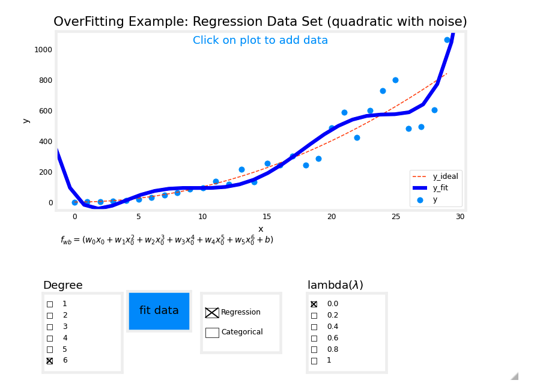

Linear regression to 6th degree with regularization: **lambda = 1**

_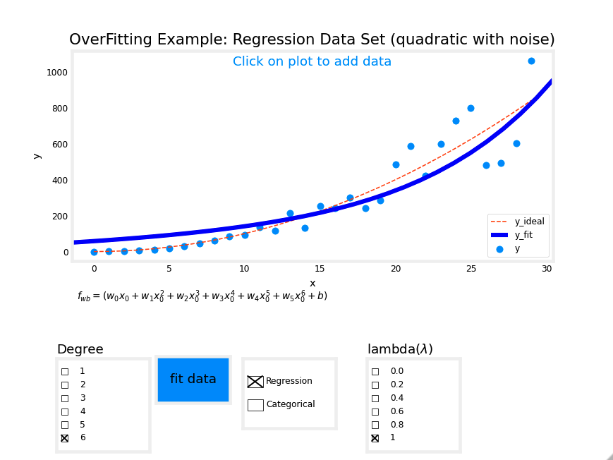

_Logistic regression to 6th degree without regularization: **lambda = 0**_

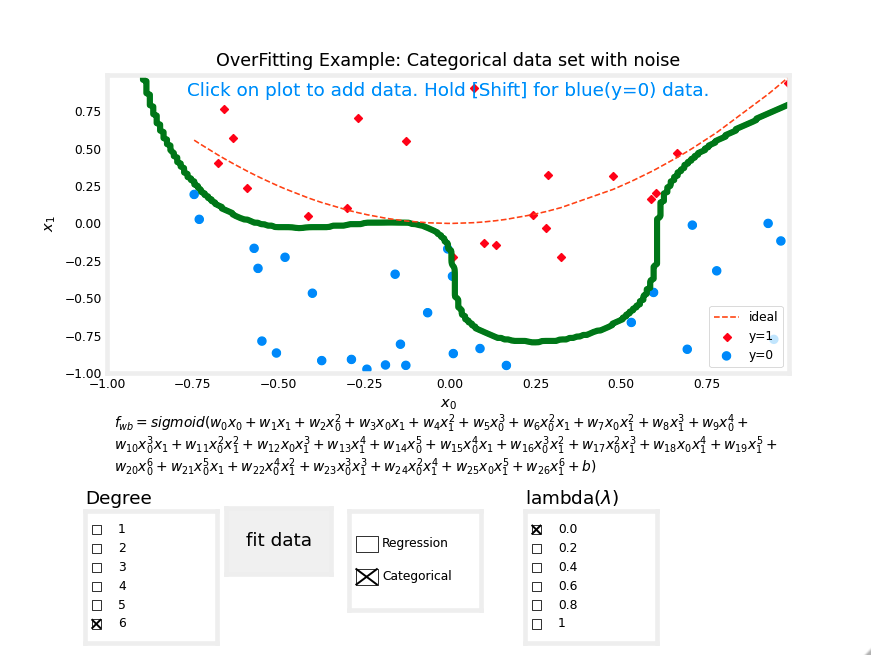

_Logistic regression to 6th degree with regularization: **lambda = 1**_

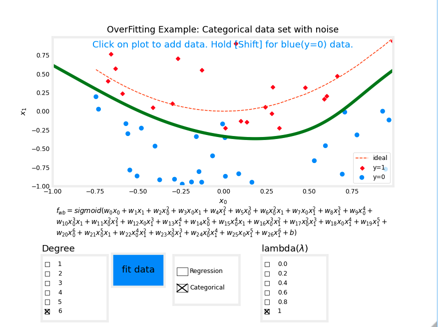