# Neural network model

## Neural network layer

The fundamental building block of most modern neural networks is **a layer of neurons**. Now, we'll learn how to construct a layer of neurons and once we have that down, we'd be able to take those building blocks and put them together to form a large neural network.

Let's take a look at how a layer of neurons works. Here's the example we had from the demand prediction example where we had **four input features** that were set to **a layer of three neurons in the hidden layer**, that then sends its output to **the output layer with just one neuron**. 

Let's zoom in to the hidden layer to look at its computations:


This hidden layer inputs four numbers and these four numbers are inputs to each of three neurons. **Each of these three neurons is just implementing a little logistic regression unit or a little logistic regression function.**

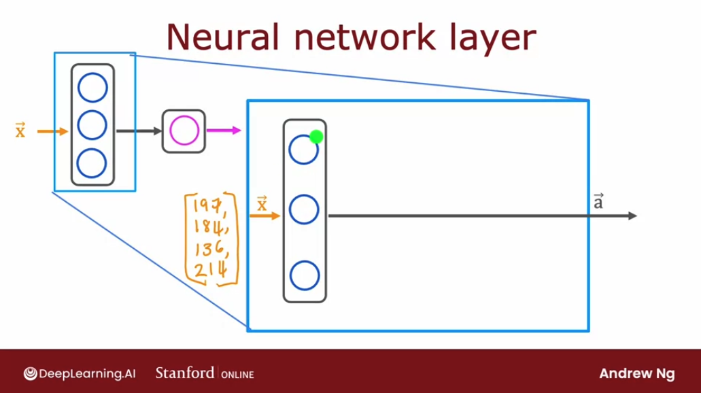

Let's take the first neuron: it has two parameters, $w$ and $b$. In fact, to denote that, this is the first hidden unit, we're going to subscript this as $w_1$ and $b_1$. 


What this neuron does is output some activation value $a_1$, which is $g (\vec{\mathbf{w_1}} \vec{\mathbf{x_1}} + b_1)$, where this is the familiar z value that we have learned about in logistic regression and $g(z)$ is the familiar logistic function: $g(z) = \frac{1}{1 + e^(-z)}$.

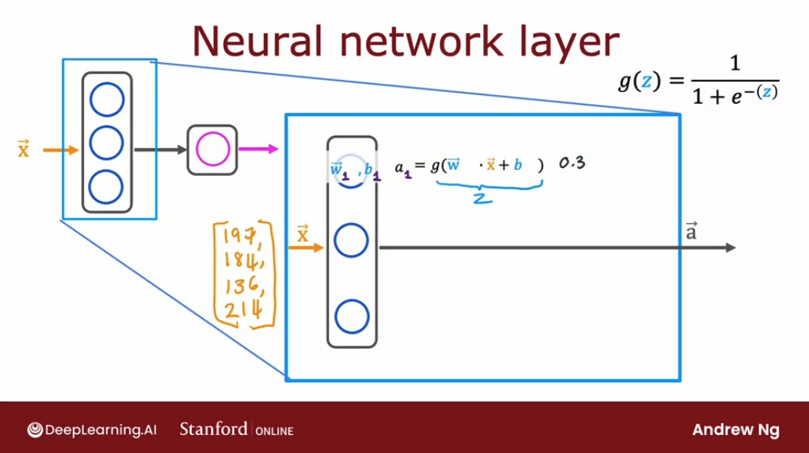


Let's suppose this ends up being a number $0.3$ and that's **the activation value a of the first neuron**. This means there's a 0.3 chance of this being highly affordable based on the input features. 

Now let's look at the second neuron. The second neuron has parameters $w_2$ and $b_2$, and these are the parameters of the second logistic unit. It computes $a_2$ equals the logistic function $g$, and this may be some other number, say $0.7$, because in this example, there's a 0.7 chance that the potential buyers will be aware of this t-shirt. 

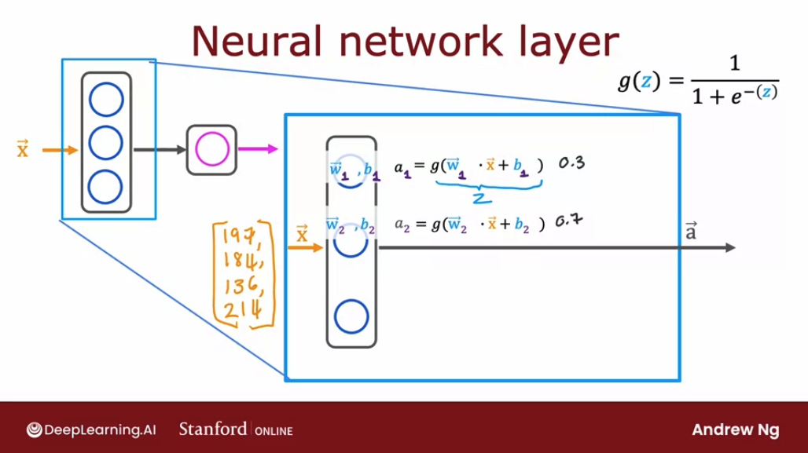


Similarly, the third neuron has a third set of parameters $w_3$, $b_3$. Similarly, it computes an activation value $a_3$ which equals $0.2$:

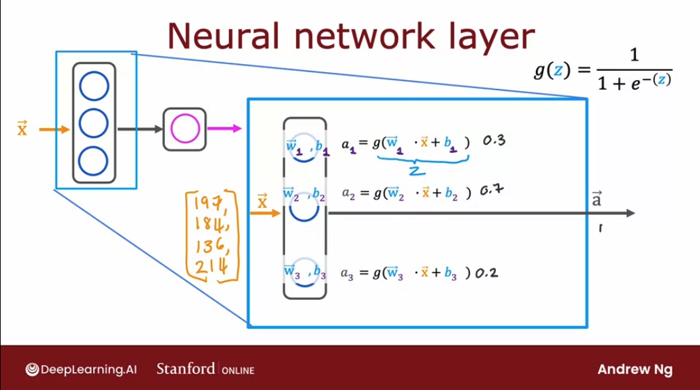

And this, in this example, these three neurons output $0.3$, $0.7$, and $0.2$, and this vector of three numbers **becomes the vector of activation values $a$**, that is then passed to the final output layer of this neural network. 

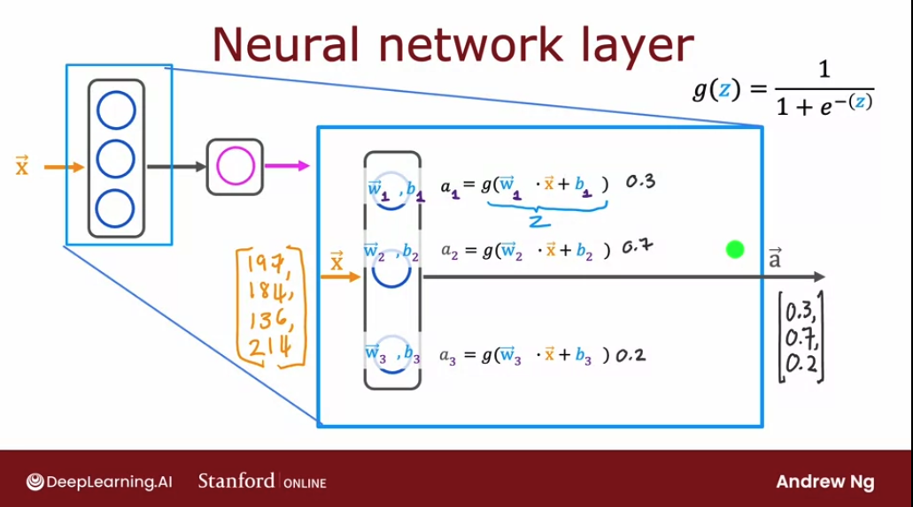

Now, when we build neural networks with multiple layers, **it'll be useful to give the layers different numbers**. By convention, the first layer is called layer 1 of the neural network and the second layer is called layer 2 of the neural network. **The input layer is also called layer 0**.

Today, there are neural networks that can have dozens or even hundreds of layers. So in order to introduce notation to help us distinguish between the different layers, we're going to use superscript square bracket $[number]$ to index into different layers. 

In particular, a superscript in square brackets $[1]$ is going to denote the output of layer 1 of this neural network, and similarly, $w_1$, $b_1$ here are the parameters of the first unit in layer 1 of the neural network, so we're also going to add a superscript in square brackets $[1]$ here, and $w_2$, $b_2$ are the parameters of the second hidden unit or the second hidden neuron in layer 1. 
Its parameters are also denoted here $w_1^{[1]}$ like so. Similarly, I can add superscripts square brackets to denote that these are the activation values of the hidden units of layer 1 of this neural network: $a^{[1]}$.

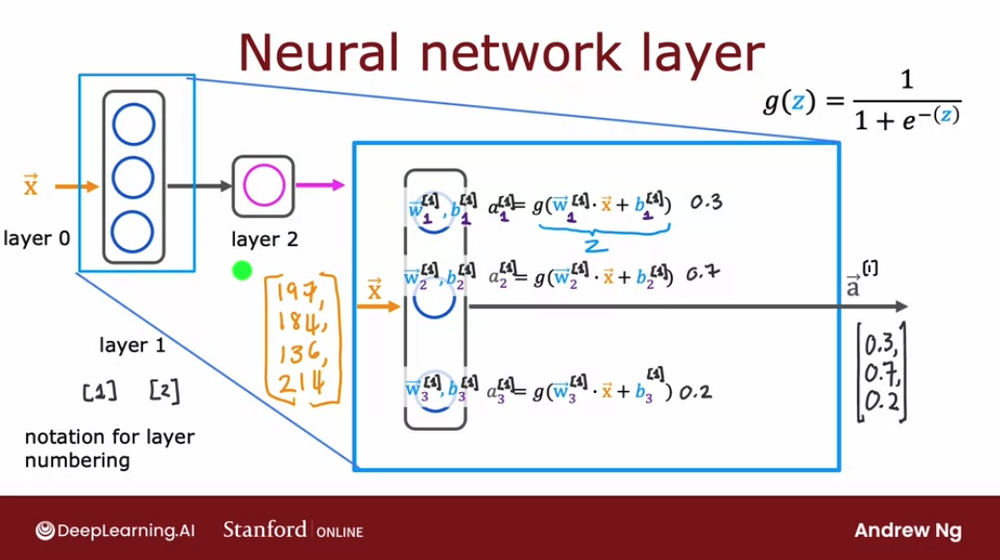


So, the output of our layer 1 is the activation vector that we calculated, $a^{[1]}$. This output $a_1$ becomes the input to layer 2. So let's zoom into the computation of layer 2 of this neural network, which is also the output layer.

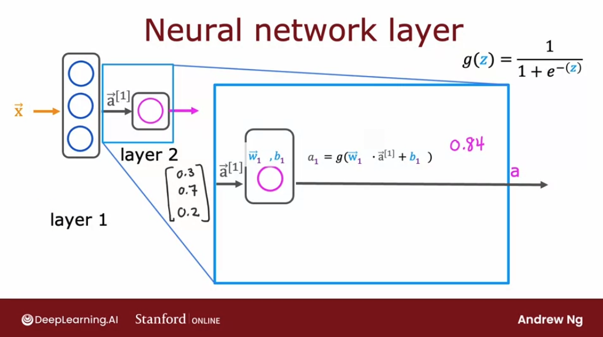

The input to layer 2 is the output of layer 1, so $a_1$ is this vector $[0.3, 0.7, 0.2]$ that we just computed.

Because the output layer has just a single neuron, all it does is compute $a_1$ (that is, the output of this first and only neuron) as g, the sigmoid function applied to w $_1$ in a product with a^[1]:

$$ a_1^{[2]} = g(\mathbf{\vec{w_1}^{[2]}}  \mathbf{\vec{a_1}^{[2]}} + b_1) $$

Remember in this notation that:
- the **subscript denotes the number of the neuron in the layer** (in this case, we only have one neuron, so 1)
- the **superscript denotes the number of the layer** (here we are on our second and last layer, hence 2)


This results in a number, say $0.84$, then that becomes the output layer of the neural network.  (In this example, because the output layer has just a single neuron, this output is just a scalar, is a single number rather than a vector of numbers.)

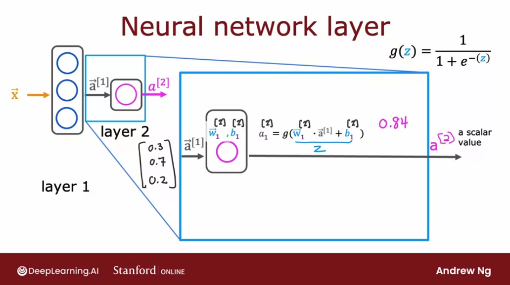

Once the neural network has computed our output there's one final optional step that we can choose to implement or not, which is if we want a binary prediction, 1 or 0, i.e. is this a top seller? Yes or no?

So we can take a_1^{[2]}, the number 0.84 that we computed, and threshold this at 0.5. 

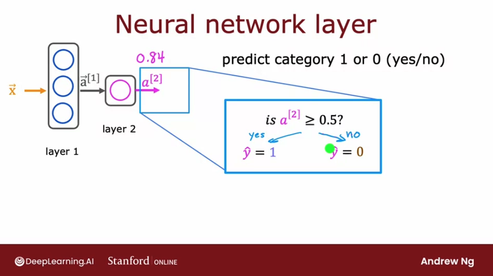

- If it's greater than 0.5, we can predict $\hat{y}$ equals 1  
- if it is less than 0.5, then predict our $\hat{y}$ equals 0.

## More complex neural networks

Let's use the layer from the previous section to build a more complex neural network so that the notation that we're using will become clearer and more concrete.


We'll use the following running example that we're going to use as an example of a more complex neural network. 

This network has four layers, not counting the input layer, which is also called Layer 0, where layers 1, 2, and 3 are hidden layers, and Layer 4 is the output layer, and Layer 0, as usual, is the input layer.

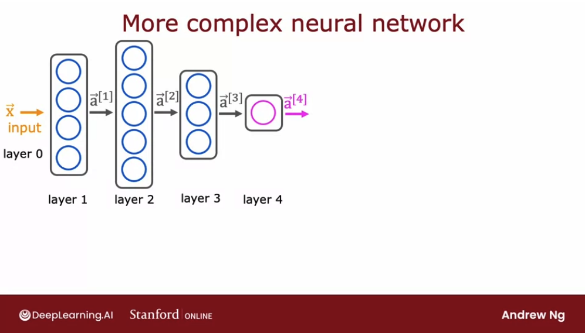

**By convention, when we say that a neural network has four layers, that includes all the hidden layers and  the output layer, but we don't count the input layer.**.

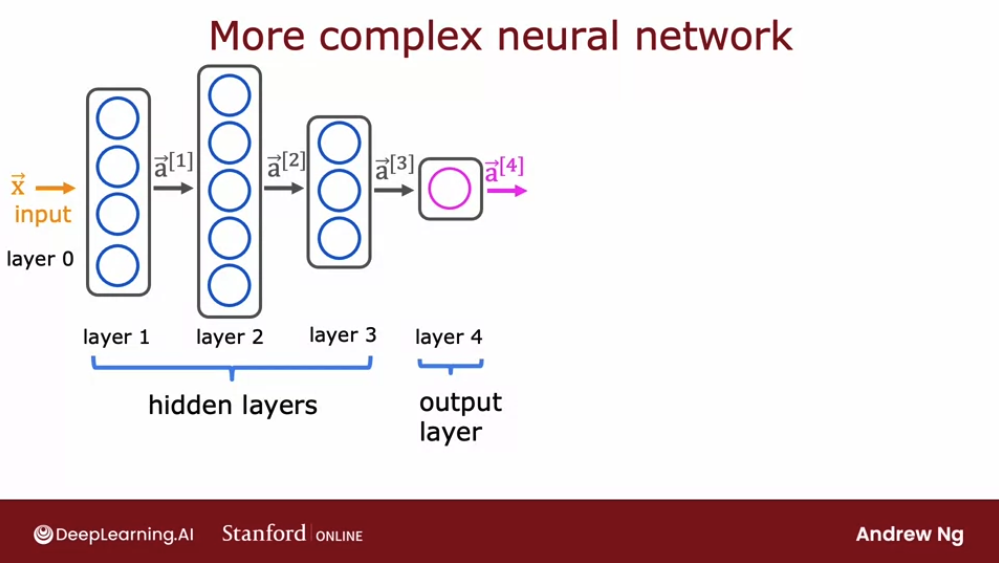

Let's zoom in to Layer 3, which is the third and final hidden layer to look at its computations.

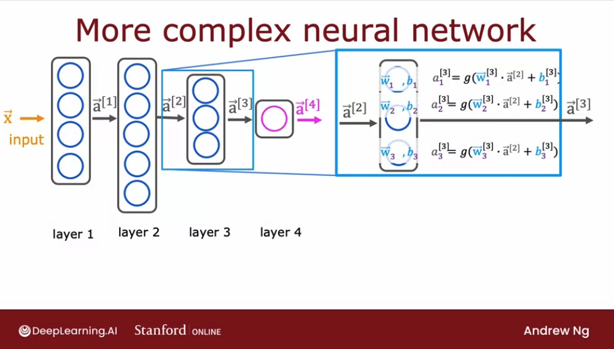

**Layer 3** inputs a vector, $\vec{\mathbf{a}}^{[2]}$ that was computed by the previous layer, and it outputs $\vec{\mathbf{a}}^{[3]}$, which is another vector. 

So, what is the computation that Layer 3 does in order to go from $\vec{\mathbf{a}}^{[2]}$ to $\vec{\mathbf{a}}^{[3]}$? 

If it has three neurons or we call it three hidden units, then it has parameters $w_1$, $b_1$, $w_2$, $b_2$, and $w_3$, $b_3$. And thus we can see that it computes the sigmoid function with those parameters, $g(z)$. And therefore the output of this layer is a vector, $\vec{\mathbf{a}}^{[3]}$,  comprising $\vec{\mathbf{a_1}}^{[3]}$, $\vec{\mathbf{a_2}}^{[3]}$, and $\vec{\mathbf{a_3}}^{[3]}$:


\[
\vec{\mathbf{a}}^{[3]} = \begin{bmatrix} \mathbf{a_1}^{[3]} \\ \mathbf{a_2}^{[3]} \\ \mathbf{a_3}^{[3]} \end{bmatrix} = \begin{bmatrix} g(\vec{\mathbf{w_1}}^{[3]} \cdot \mathbf{\vec{a}}^{[2]} + b_1^{[3]}) \\ g(\vec{\mathbf{w_2}}^{[3]} \cdot \mathbf{\vec{a}}^{[2]} + b_2^{[3]}) \\ g(\vec{\mathbf{w_3}}^{[3]} \cdot \mathbf{\vec{a}}^{[2]} + b_3^{[3]}) \end{bmatrix}
\]

Notice that in each calculation inside the sigmoid function, we **dot-multiply the whole activation vector from the previous layer**.


Now let's see the general form of this equation for **an arbitrary layer $l$** and for **an arbitrary unit (neuron) $j$**:


$$ \vec{\mathbf{a_j}}^{[l]} = g(\vec{\mathbf{w_j}}^{[l]} \cdot \vec{\mathbf{a_j}}^{[l-1]} + b_j^{[l]}) $$

In the context of a neural network, $g$ is called the **activation function**, because it outputs this activation value. So far, the only activation function we've seen is the sigmoid function other functions are possible.


## Inference: making predictions (forward propagation)

Let's take what we've learned and put it together into an algorithm to let our neural network make inferences or make predictions. This will be an algorithm called **forward propagation.**

We're going to use as a motivating example the task of handwritten digit recognition. For simplicity, we are just going to distinguish between the handwritten digits zero and one. So it's just **a binary classification problem** where we're going to input an image and classify: is this the digit zero or the digit one?

For the example of the slide, we're going to use an eight by eight image.


And so this image of a one is this grid or matrix of eight by eight or 64 pixel intensity values where 255 denotes a bright white pixel and zero would denote a black pixel. And different numbers are different shades of gray in between the shades of black and white. 

**Given these 64 input features, we're going to use the neural network with two hidden layers:**

- the first hidden layer has **25 neurons** or 25 units
- the second hidden layer has **15 neurons** or 15 units. 
- the output layer gives the chance of this being 1 versus 0

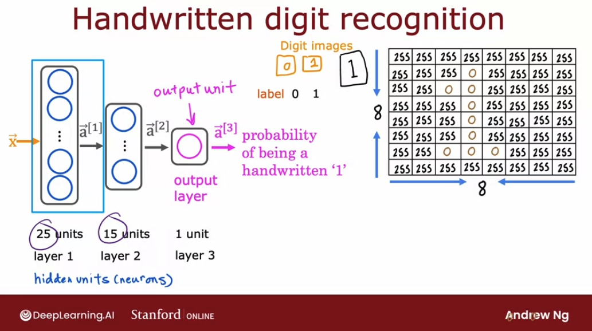

So let's step through the sequence of computations that in our neural network:  we need to go from the input $\mathbf{\vec{x}}$, (the 8x8 or 64 numbers vector) to the predicted probability  $\mathbf{\vec{a}^{[3]}}$. 

The first computation is to go from $\mathbf{\vec{x}}$ to $\mathbf{\vec{a}^{[1]}}$, and that's what the first layer of the first hidden layer does:

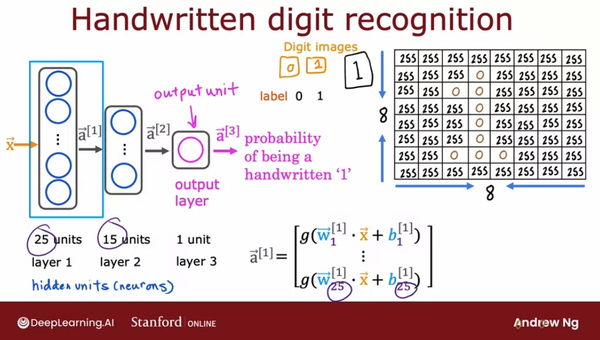

$$ \mathbf{\vec{a}^{[1]}} = \begin{bmatrix} g(\vec{\mathbf{w_1}}^{[1]} \cdot \mathbf{\vec{a}}^{[0]} + b_1^{[1]}) \\ \vdots \\ g(\vec{\mathbf{w_{25}}}^{[1]} \cdot \mathbf{\vec{a}}^{[0]} + b_{25}^{[1]}) \end{bmatrix}$$


Notice that $\mathbf{\vec{a}^{[1]}}$ has 25 numbers because this hidden layer has 25 units.

Also, notice that in the slide, we used $\mathbf{\vec{X}}$, but in our formula, we used $\mathbf{\vec{a}^{[0]}}$. It's the same.


The next step is to compute $\mathbf{\vec{a}^{[2]}}$:

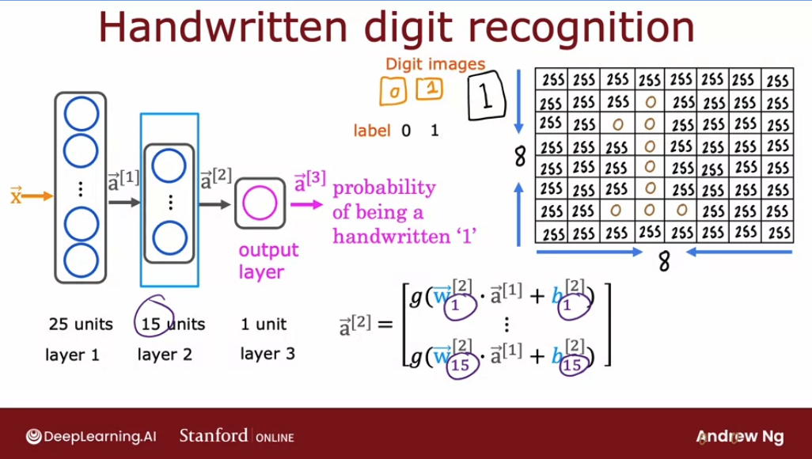

$$ \mathbf{\vec{a}^{[2]}} = \begin{bmatrix} g(\vec{\mathbf{w_1}}^{[2]} \cdot \mathbf{\vec{a}}^{[1]} + b_1^{[2]}) \\ \vdots \\ g(\vec{\mathbf{w_{15}}}^{[2]} \cdot \mathbf{\vec{a}}^{[1]} + b_{15}^{[2]}) \end{bmatrix}$$

Notice that layer two has 15 neurons or 15 units, which is why the parameters here run from 1 to 15.

The final step is then to compute $\mathbf{\vec{a}^{[3]}}$ and we do so using a very similar computation, only now, this third layer (the output layer) has just one unit, which is why there's just one output here. So $\mathbf{\vec{a}^{[3]}}$ is just a scalar:

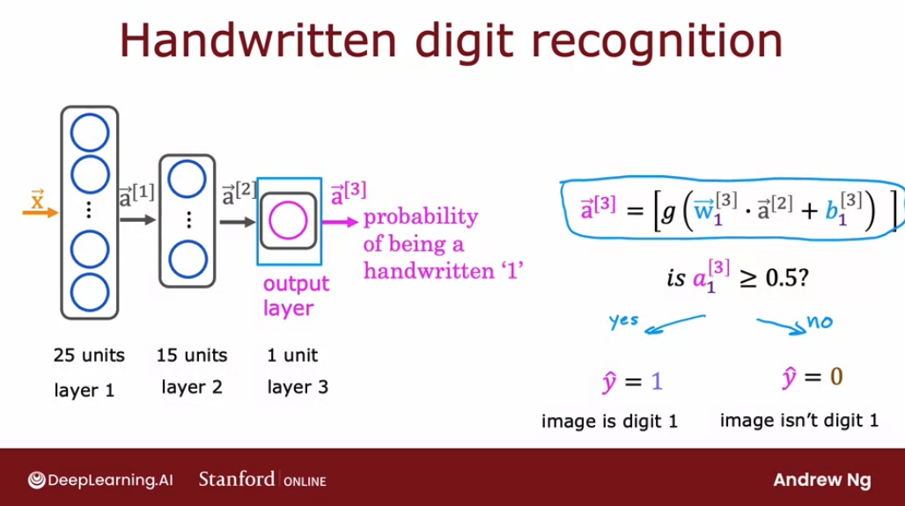

$$ \mathbf{\vec{a}^{[2]}} = \begin{bmatrix} g(\vec{\mathbf{w_1}}^{[3]} \cdot \mathbf{\vec{a}}^{[2]} + b_1^{[3]}) \end{bmatrix} $$

And finally we can optionally take $\mathbf{\vec{a}^{[3]}}$ subscript one and threshold it at $0.5$ to come up with a binary classification label.

Since $\mathbf{\vec{a}^{[3]}}$ is the output of the neural network, we can also write it as $f(x)$:

$$ \mathbf{\vec{a}^{[3]}} = f(x) $$

**Because this computation goes from left to right, this algorithm is also called forward propagation because we're propagating the activations of the neurons.**

And this is in contrast to a different algorithm called **backward propagation or back propagation, which is used for learning.** 

Also, this type of neural network architecture where we have** more hidden units initially and then the number of hidden units decreases** as we get closer to the output layer is **a pretty typical choice when choosing neural network architectures**.

## Lab: Neurons and Layers

[LINK](https://www.coursera.org/learn/advanced-learning-algorithms/ungradedLab/hH4VM/neurons-and-layers/lab?path=%2Fnotebooks%2FC2_W1_Lab01_Neurons_and_Layers.ipynb)

[Internal Link](./labs/Week%201/C2_W1_Lab01_Neurons_and_Layers.ipynb)

In this lab we will explore the inner workings of neurons/units and layers. In particular, the lab will draw parallels to the models you have mastered in Course 1, the regression/linear model and the logistic model. The lab will introduce Tensorflow and demonstrate how these models are implemented in that framework.

### Packages
**Tensorflow and Keras**  
Tensorflow is a machine learning package developed by Google. In 2019, Google integrated Keras into Tensorflow and released Tensorflow 2.0. Keras is a framework developed independently by François Chollet that creates a simple, layer-centric interface to Tensorflow. This course will be using the Keras interface. 

```py
import numpy as np
import matplotlib.pyploy as plt
import tensorflow as tf
from tensorflow.keras.layers import Dense, Input
from tensorflow.keras import Sequential
from tensorflow.keras.losses import MeanSquaredError, BinaryCrossentropy
from tensorflow.keras.activation import sigmoid
from lab_utils_common import dlc
from lab_neurons_utils import plt_prob_1d, sigmoidnp, plt_linear, plt_logistic
plt.style.use('./deeplearning.mplstyle')
import logging
logging.getLogger("tensorflow").setLevel(logging.ERROR)
tf.autograph.set_verbosity(0)
```

### Neuron without activation - Regression/Linear Model

**DataSet**
We'll use an example from Course 1, linear regression on house prices.

```py
X_train = np.array([[1.0], [2.0]], dtype=np.float32)           #(size in 1000 square feet)
Y_train = np.array([[300.0], [500.0]], dtype=np.float32)       #(price in 1000s of dollars)

fig, ax = plt.subplots(1,1)
ax.scatter(X_train, Y_train, marker='x', c='r', label="Data Points")
ax.legend( fontsize='xx-large')
ax.set_ylabel('Price (in 1000s of dollars)', fontsize='xx-large')
ax.set_xlabel('Size (1000 sqft)', fontsize='xx-large')
plt.show()
```

### Regression/Linear Model 

The function implemented by a neuron with no activation is the same as in Course 1, linear regression:
$$ f_{\mathbf{w},b}(x^{(i)}) = \mathbf{w}\cdot x^{(i)} + b \tag{1}$$

We can define a layer with one neuron or unit and compare it to the familiar linear regression function:

```py
linear_layer = tf.keras.layers.Dense(units=1, activation = 'linear', )
```

Let's examine the weights:

```py
linear_layer.get_weights()
# []
```

There are no weights as the weights are not yet instantiated. Let's try the model on one example in `X_train`. This will trigger the instantiation of the weights. Note, the input to the layer must be 2-D, so we'll reshape it.

```py
X_train_2d = X_train[0].reshape(1,1)
print(X_train_2d)
# [[1.]]

a1 = linear_layer(X_train_2d)
print(a1)
# tf.Tensor([[0.54]], shape=(1, 1), dtype=float32)
```

The result is a tensor (another name for an array) with a shape of (1,1) or one entry.   

Now let's look at the weights and bias. These weights are randomly initialized to small numbers and the bias defaults to being initialized to zero:

```py
w, b= linear_layer.get_weights()
print(f"w = {w}, b={b}")
# w = [[0.54]], b=[0.]
```

A linear regression model (1) with a single input feature will have a single weight and bias. This matches the dimensions of our `linear_layer` above.   

The weights are initialized to random values so let's set them to some known values:

```py
set_w = np.array([[200]])
set_b = np.array([100])

# set_weights takes a list of numpy arrays
linear_layer.set_weights([set_w, set_b])
print(linear_layer.get_weights())
# [array([[200.]], dtype=float32), array([100.], dtype=float32)]
```

Let's compare equation (1) to the layer output:
```py
a1 = linear_layer(X_train[0].reshape(1,1))
print(a1)
# tf.Tensor([[300.]], shape=(1, 1), dtype=float32)

alin = np.dot(set_w,X_train[0].reshape(1,1)) + set_b
print(alin)
# [[300.]]
```

They produce the same values!
Now, we can use our linear layer to make predictions on our training data:

```py
prediction_tf = linear_layer(X_train)
prediction_np = np.dot( X_train, set_w) + set_b
```

```py
# Custom function to plot the data with two models, TF and numpy
plt_linear(X_train, Y_train, prediction_tf, prediction_np)
```

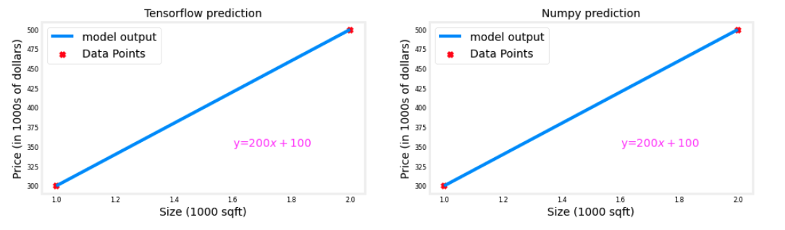

### Neuron with Sigmoid activation
The function implemented by a neuron/unit with a sigmoid activation is the same as in Course 1, logistic  regression:

$$ f_{\mathbf{w},b}(x^{(i)}) = g(\mathbf{w}x^{(i)} + b) \tag{2}$$

where:

$$g(x) = sigmoid(x)$$ 

Let's set $w$ and $b$ to some known values and check the model.

**DataSet**
We'll use an example from Course 1, logistic regression.
```py
X_train = np.array([0., 1, 2, 3, 4, 5], dtype=np.float32).reshape(-1,1)  # 2-D Matrix
Y_train = np.array([0,  0, 0, 1, 1, 1], dtype=np.float32).reshape(-1,1)  # 2-D Matrix
```

```py
pos = Y_train == 1
neg = Y_train == 0
X_train[pos]
# array([3., 4., 5.], dtype=float32)
```

```py
fig,ax = plt.subplots(1,1,figsize=(4,3))
ax.scatter(X_train[pos], Y_train[pos], marker='x', s=80, c = 'red', label="y=1")
ax.scatter(X_train[neg], Y_train[neg], marker='o', s=100, label="y=0", facecolors='none', 
              edgecolors=dlc["dlblue"],lw=3)

ax.set_ylim(-0.08,1.1)
ax.set_ylabel('y', fontsize=12)
ax.set_xlabel('x', fontsize=12)
ax.set_title('one variable plot')
ax.legend(fontsize=12)
plt.show()
```
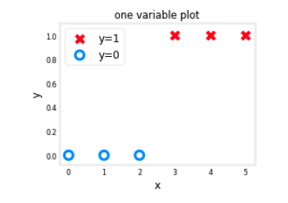

#### Logistic Neuron
We can implement a 'logistic neuron' by adding a sigmoid activation. The function of the neuron is then described by (2) above.   

This section will create a Tensorflow Model that contains our logistic layer to demonstrate an alternate method of creating models. Tensorflow is most often used to create multi-layer models. The [Sequential](https://keras.io/guides/sequential_model/) model is a convenient means of constructing these models.

```py
model = Sequential(
    [
        # each item in the array is a neural network layer
        tf.keras.layers.Dense(1, input_dim=1,  activation = 'sigmoid', name='L1')
    ]
)
```

`model.summary()` shows the layers and number of parameters in the model. There is only one layer in this model and that layer has only one unit. The unit has two parameters, $w$ and $b$.

```py
model.summary()

# Model: "sequential"
# _________________________________________________________________
#  Layer (type)                Output Shape              Param #   
# =================================================================
#  L1 (Dense)                  (None, 1)                 2         
                                                                 
# =================================================================
# Total params: 2
# Trainable params: 2
# Non-trainable params: 0
# _________________________________________________________________
```

```py
logistic_layer = model.get_layer('L1')
w,b = logistic_layer.get_weights()
print(w,b)
print(w.shape,b.shape)

## Random values assigned by default by model
# [[0.28]] [0.]
# (1, 1) (1,)
```

Let's set the weight and bias to some known values:

```py
set_w = np.array([[2]])
set_b = np.array([-4.5])
# set_weights takes a list of numpy arrays
logistic_layer.set_weights([set_w, set_b])
print(logistic_layer.get_weights())
# [array([[2.]], dtype=float32), array([-4.5], dtype=float32)]
```

Let's compare equation (2) to the layer output:
```py
a1 = model.predict(X_train[0].reshape(1,1))
print(a1)
# [[0.01]]

alog = sigmoidnp(np.dot(set_w,X_train[0].reshape(1,1)) + set_b)
print(alog)
# [[0.01]]
```

They produce the same values!
Now, we can use our logistic layer and NumPy model to make predictions on our training data:

```py
plt_logistic(X_train, Y_train, model, set_w, set_b, pos, neg)
```

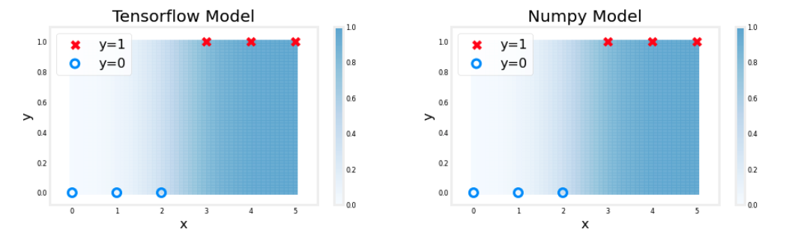

The shading above reflects the output of the sigmoid which varies from 0 to 1.