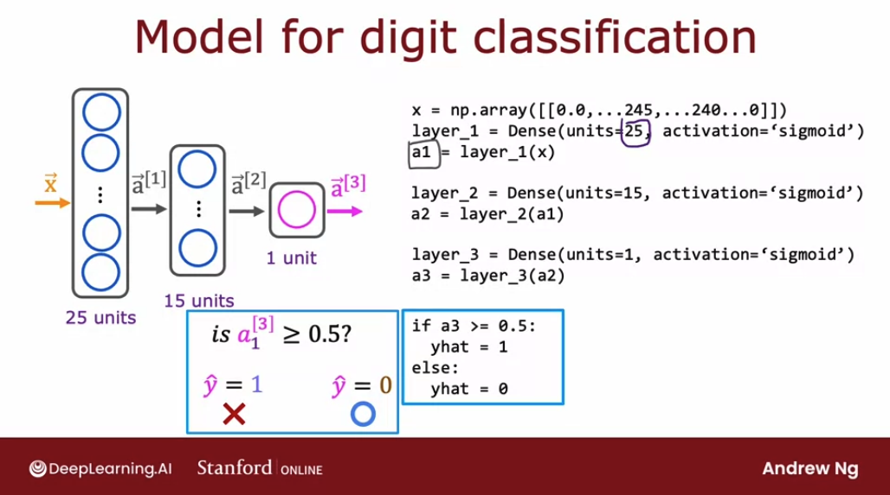
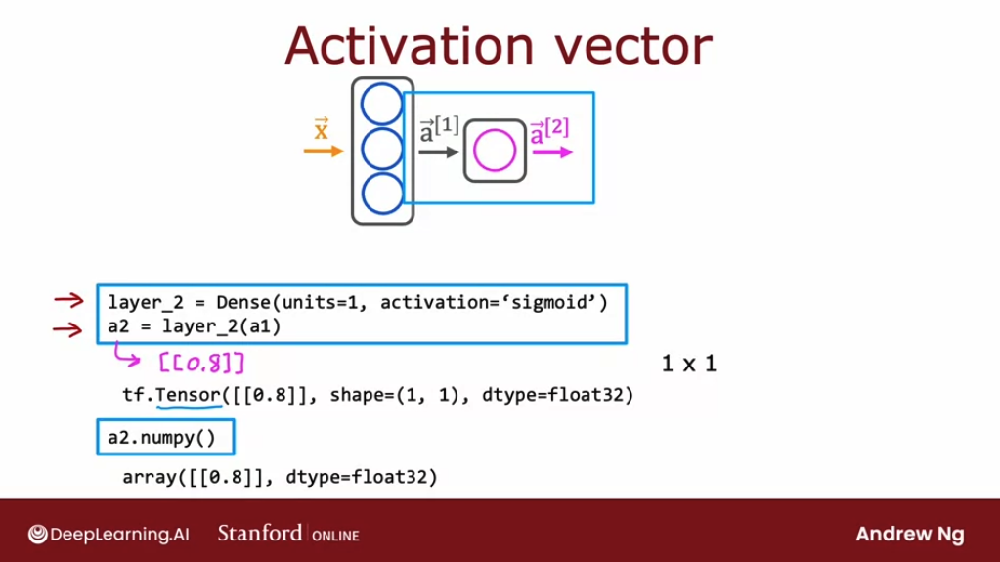
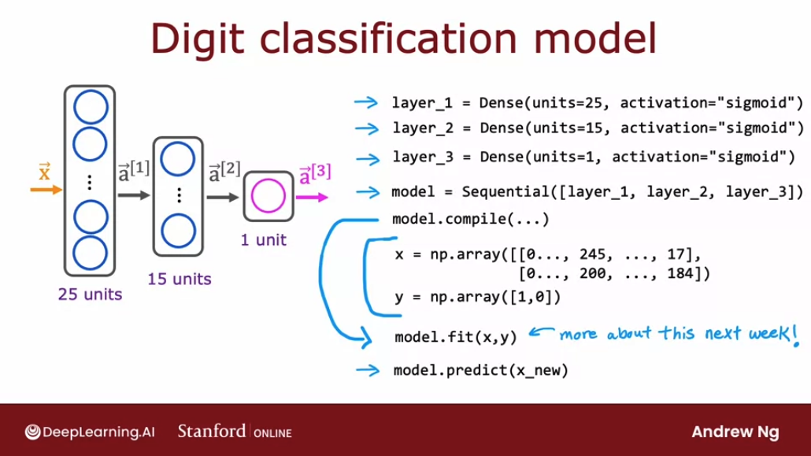
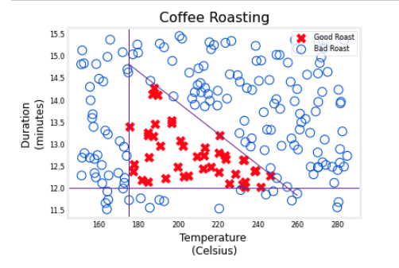
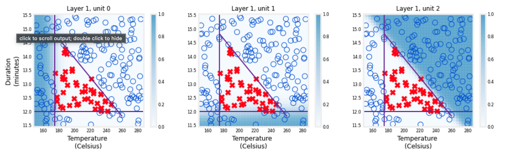
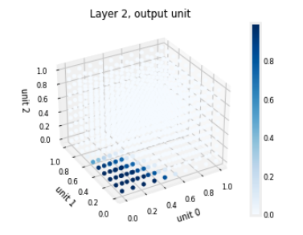
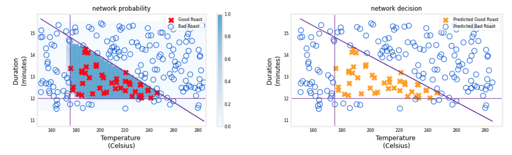

# TensorFlow implementation

## Inference in Code

TensorFlow is one of the leading frameworks to implementing deep learning algorithms. The other popular tool is PyTorch. But we're going to focus in this specialization on TensorFlow. 

Let's take a look at how we can implement inferencing code using TensorFlow: we're going to use a coffe roasting example.

When we're roasting coffee, two parameters we get to control are the temperature at which we're heating up the raw coffee beans to turn them into roasted coffee beans, as well as the duration or how long are we going to roast the beans. 

In the following slightly simplified example, we've created the datasets of different temperatures and different durations, as well as labels showing whether the coffee we roasted is good-tasting coffee. The cross icons means a positive result, where y equals 1 and corresponds to good coffee, and all the circles are negative results, and correspond to bad coffee.


A way to think of this dataset is:
- if we cook it at too low temperature, it doesn't get roasted and it ends up undercooked.
- if we cook it not for long enough, the duration is too short, it's also not a nicely roasted set of beans
- if we were to cook it either for too long or for too higher temperature, then we end up with overcooked beans. 


It's only points within this little triangle here that corresponds to good coffee. 

The task is given a feature vector $\mathbf{\vec{x}}$ with both temperature and duration, say 200 degrees Celsius for 17 minutes, how can we do inference in a neural network to get it to tell us whether or not this temperature and duration setting will result in good coffee or not?


For that, we write the following code:

```py
# Set X to be an numpy array of two numbers, 
# one for temperature and one for time
x = np.array([[200.0, 17.0]])

# Create the first "hidden" layer of the network using Dense
layer_1 = Dense(units=3, activation='sigmoid')

# Next, we compute the output of the first layer, 
# the activation a1, by applying the values of x 
# to the layer that we just created
a1 = layer_1(x)

# The activation vector will have 3 numbers, 
# coming each out of the 3 neurons
a1
# [0.2 0.7 0.3] --> just an example
```
 
Next, for the second hidden layer, Layer 2, we have one unit and again to sigmoid activation function, and we can then compute $\mathbf{\vec{a_2}}$ by applying this Layer 2 function to the activation values from Layer 1 to $\mathbf{\vec{a_1}}$.

```py
layer_2 = Dense(units=1, activation='sigmoid')
a2 = layer_2(a1)
```

That will give we the value of $\mathbf{\vec{a_2}}$, which for the sake of illustration is maybe 0.8. Finally, if we wish to threshold it at `0.5`, then we can just test if $\mathbf{\vec{a_2}}$ is greater and equal to `0.5` and set $\hat{y}$ equals to one or zero positive or negative cross accordingly. That's how we do inference in the neural network using TensorFlow.


Notice that in the example above, we are missing the import of the library and loading the weight and biases, but we will see that later.

Let's look at one more example and we're going to go back to the handwritten digit classification problem. In this example, $\mathbf{\vec{x}}$ is a list of the pixel intensity values. 



```py
x = np.array([[0.0, ...245, ...240, ...0]]) # array with 64 values (8x8 pixels)
layer_1 = Dense(units=25, activation='sigmoid')
a1 = layer_1(x)

layer_2 = Dense(units=15, activation='sigmoid')
a2 = layer_2(a1)

layer_3 = Dense(units=1, activation='sigmoid')
a3 = layer_3(a2)

if a3 >= 0.5:
  yhat = 1
else:
  yhat = 0 
```

In the next section, let's take a look at how TensorFlow handles data. 

## Data in Tensorflow

Let understand now how data is represented in NumPy and in TensorFlow, so that as we're implementing new neural networks, we can have a consistent framework to think about how to represent our data. 

Unfortunately there are some inconsistencies between how data is represented in NumPy and in TensorFlow.  It's good to be aware of these conventions so that we can implement correct code.

Let's start by taking a look at how TensorFlow represents data. Let's see we have a data set like this from the coffee example:


I mentioned that we would write $\mathbf{\vec{x}}$ as follows: 

```py
x = np.array([[200.0, 17]])
```

So why do we have this double square bracket here? 

Let's first take a look at how NumPy stores vectors and matrices:

Here is a matrix with 2 rows and 3 columns. Notice that there are 2 rows and 1, 2, 3 columns. So we call this a **2 x 3 matrix**.

$$\begin{bmatrix} 1 \ 2 \ 3 \\ 4 \ 5 \ 6 \end{bmatrix} \text{2x3 matrix}$$

The convention is **the dimension of the matrix is written as the number of rows by the number of columns**. 

In Numpy code to store this matrix, this 2 x 3 matrix, we just write:

```py
x = np.array([[1, 2, 3],
              [4, 5, 6]])
```

Notice that the square bracket tells we that 1, 2, 3 is the first row of this matrix and 4, 5, 6 is the second row of this matrix. And then the outer open square bracket groups the first and the second row together.

Let's look at one more example:

$$\begin{bmatrix} 0.1 \ 0.2 \\ -3 \ -4 \\ {-0.5} \ -0.6 \\ 7.0 \ 8.0 \end{bmatrix} \text{4x2 matrix}$$

It's a 4 x 2 matrix. And so to store this in code, we will write:

```py
x = np.array([[0.1, 0.2],
              [-3.0 -4.0],
              [-0.5 -0.6],
              [7.0 8.0]])
```

Matrices can have different dimensions. We saw an example of an 2 x 3 matrix and the 4 x 2 matrix. 

But matrices can also be of other dimensions like 1 x 2 or 2 x 1. Let's see:

```py
x = np.array([[200, 17]])   --->  [200  17] ---> 1x2 matrix --> "Row vector"

x = np.array([[200],        --->  [200      ---> 2x1 matrix --> "Column vector"
              [17]])                17]

# a 1D vector (with no rows or columns)
x = np.array([200, 17])
```

The difference between using double square brackets like the two examples above versus a single square bracket like in the third example, is that:
- the two examples on top are 2D arrays where one of the dimensions happens to be 1. 
- the third example results in a 1D vector. It is just a 1D array that has no rows or columns.

So on a contrast this with what we had previously done in the first course, which was to write x like this with a single square bracket. 

So whereas in the first Course, when we're working with linear regression and logistic regression, we used these 1D vectors to represent the input features $\mathbf{\vec{x}}$, **with TensorFlow the convention is to use matrices to represent the data.** 

(TensorFlow was designed to handle very large datasets and by representing the data in matrices instead of 1D arrays, it lets TensorFlow be a bit more computationally efficient internally.)

So going back to our original example, for the first training example in this dataset, with features 200°C and 17 minutes, we were represented like so:

```py
np.array([[200.0, 17.0]])
```

So this is actually a **1 x 2 matrix** that happens to have one row and two columns to store the numbers 200, 17.

Going back to the code for carrying out for propagation or influence in the neural network. When we compute $\mathbf{\vec{a_1}}$ by applying `layer_1` to $\mathbf{\vec{x}}$, what shape and format has the result?

```py
x = np.array([[200.0, 17.0]])

layer_1 = Dense(units=3, activation='sigmoid')

a1 = layer_1(x)
# tf.Tensor([[0.2 0.7 0.3]], shape=(1, 4), dtype=float32)
```

Well, $\mathbf{\vec{a_1}}$ is actually going to be, because it has three numbers, a **1 x 3 matrix**.

And we see that Tensorflow uses the word **tensor**. So what is the tensor? 

**A tensor here is a data type that the TensorFlow team had created in order to store and carry out computations on matrices efficiently.** So for now, we can think of it as a matrix, although technically a tensor is a little bit more general than the matrix.

If we want to take $\mathbf{\vec{a_1}}$ which is a **tensor** and want to convert it back to **NumPy array**, we can do so with the function:

```py
# Tensorflow's conversion utility to numpy type
a1.numpy()
```
This will take the same data and return it in the form of a NumPy array rather than in the form of a TensorFlow array or TensorFlow matrix. 

Now let's take a look at what the activations output the second layer would look like:



We see that the result it's a 1x1 matrix.

We're used to loading data and manipulating data in NumPy, but when we pass a NumPy array into TensorFlow, **TensorFlow likes to convert it to its own internal format.** The tensor and then operate efficiently using tensors. And when we read the data back out we can keep it as a tensor or convert it back to a NumPy array. 

## Building a neural network

Let's talk about how to build a neural network in TensorFlow.

If we want to do forward prop, we initialize the data $\mathbf{\vec{x}}$, create layer one, and then compute $\mathbf{\vec{a_1}}$, then create layer two and compute $\mathbf{\vec{a_2}}$. So this was an explicit way of carrying out forward prop one layer of computation at the time:

```py
x = np.array([[200.0, 17.0]])

layer_1 = Dense(units=3, activation='sigmoid')
a1 = layer_1(x)

layer_2 = Dense(units=1, activation='sigmoid')
a2 = layer_1(a1)
```


It turns out that tensor flow has a different way of implementing forward prop as well as learning. Let's see different way of building a neural network in TensorFlow: same as before we're going to create layer one and create layer two. But now instead of we manually taking the data and passing it to layer one and then taking the activations from layer one and pass it to layer two, we can instead tell tensor flow that we would like it to take layer one and layer two and string them together to form a neural network. 

```py
x = np.array([[200.0, 17.0]])

layer_1 = Dense(units=3, activation='sigmoid')
layer_2 = Dense(units=1, activation='sigmoid')

model = Sequential([layer_1, layer_2])
```

With this `Sequential`` framework Tensorflow can do a lot of work for us:

Let's say we have a training set, for the coffee example, as $\mathbf{\vec{x}}$ in our Numpy array, a four by two matrix. We also have the target labels $\mathbf{\vec{y}}$.

```py
x = np.array([[200.0, 17.0],
             [120.0, 5.0],
             [425.0, 20.0],
             [212.0, 18.0]])
y = np.array([1, 0, 0, 1])
```     

If we want to train this neural network, all we need to do is call two functions: 

1. `model.compile(...)` - which takes some parameters that we'll see later
2. `model.fit(x, y)` -  which tells Tensorflow to take this neural network that we created by sequentially stringing together layers one and two, and to train it on the data, X and Y. 

And then we can do forward prop if we have a new example, say `X_new`, which is a Numpy array with the two features, temperature and time: `model.predict(X_new)`.

Also, by convention we don't explicitly assign the two layers to two variables, but create them directly in the array that Sequential takes. Let's see all together:

```py
x = np.array([[200.0, 17.0],
             [120.0, 5.0],
             [425.0, 20.0],
             [212.0, 18.0]])

y = np.array([1, 0, 0, 1])

model = Sequential([
  Dense(units=3, activation='sigmoid'),
  Dense(units=1, activation='sigmoid')
])

model.compile(...)
model.fit(x, y)

model.predict(X_new)
```

Let's redo this for the digit classification example as well:



```py
x = np.array([[0.0, ...245, ...240, ...0],
             [[0.0, ...200, ...184, ...0]]) 

y = np.array([1, 0])

model = Sequential([
  Dense(units=25, activation='sigmoid'),
  Dense(units=15, activation='sigmoid'),
  Dense(units=1, activation='sigmoid')
])

model.compile(...)
model.fit(x, y)

model.predict(X_new)
```

## Lab: Coffee Roasting in Tensorflow - Simple neural network

[LINK](https://www.coursera.org/learn/advanced-learning-algorithms/ungradedLab/reSfw/coffee-roasting-in-tensorflow)
[Internal Link](./labs/Week%201/C2_W1_Lab02_CoffeeRoasting_TF.ipynb)

In this lab we will build a small neural network using Tensorflow.

```py
import numpy as np
import matplotlib.pyplot as plt
plt.style.use('./deeplearning.mplstyle')
import tensorflow as tf
from tensorflow.keras.models import Sequential
from tensorflow.keras.layers import Dense
from lab_utils_common import dlc
from lab_coffee_utils import load_coffee_data, plt_roast, plt_prob, plt_layer, plt_network, plt_output_unit
import logging
logging.getLogger("tensorflow").setLevel(logging.ERROR)
tf.autograph.set_verbosity(0)
```

**Dataset**

```py
X,Y = load_coffee_data();
print(X.shape, Y.shape)
# (200, 2) (200, 1)
```

Let's plot the coffee roasting data below. The two features are Temperature in Celsius and Duration in minutes. [Coffee Roasting at Home](https://www.merchantsofgreencoffee.com/how-to-roast-green-coffee-in-your-oven/) suggests that the duration is best kept between 12 and 15 minutes while the temp should be between 175 and 260 degrees Celsius. Of course, as temperature rises, the duration should shrink. 



### Normalize Data
Fitting the weights to the data (back-propagation, covered in next week's lectures) will proceed more quickly if the data is normalized. This is the same procedure you used in Course 1 where features in the data are each normalized to have a similar range. 
The procedure below uses a Keras [normalization layer](https://keras.io/api/layers/preprocessing_layers/numerical/normalization/). It has the following steps:
- create a "Normalization Layer". Note, as applied here, this is not a layer in your model.
- 'adapt' the data. This learns the mean and variance of the data set and saves the values internally.
- normalize the data.  

It is important to apply normalization to any future data that utilizes the learned model.

```py
print(f"Temperature Max, Min pre normalization: {np.max(X[:,0]):0.2f}, {np.min(X[:,0]):0.2f}")
print(f"Duration    Max, Min pre normalization: {np.max(X[:,1]):0.2f}, {np.min(X[:,1]):0.2f}")
# Temperature Max, Min pre normalization: 284.99, 151.32
# Duration    Max, Min pre normalization: 15.45, 11.51

norm_l = tf.keras.layers.Normalization(axis=-1) # create normalization layer
norm_l.adapt(X)  # learns mean, variance
Xn = norm_l(X) # actually normalize the data

print(f"Temperature Max, Min post normalization: {np.max(Xn[:,0]):0.2f}, {np.min(Xn[:,0]):0.2f}")
print(f"Duration    Max, Min post normalization: {np.max(Xn[:,1]):0.2f}, {np.min(Xn[:,1]):0.2f}")
# Temperature Max, Min post normalization: 1.66, -1.69
# Duration    Max, Min post normalization: 1.79, -1.70
```

[Tile](https://numpy.org/doc/stable/reference/generated/numpy.tile.html)/copy our data to increase the training set size and reduce the number of training epochs.

```py
Xt = np.tile(Xn,(1000,1))
Yt= np.tile(Y,(1000,1))
print(Xt.shape, Yt.shape)
# (200000, 2) (200000, 1)
```

### Tensorflow model

#### Model

Let's build the "Coffee Roasting Network" described in lecture. There are two layers with sigmoid activations as shown below:

```py
tf.random.set_seed(1234)  # applied to achieve consistent results
model = Sequential(
    [
        tf.keras.Input(shape=(2,)),
        Dense(3, activation='sigmoid', name = 'layer1'),
        Dense(1, activation='sigmoid', name = 'layer2')
     ]
)
```

>**Note 1:** The `tf.keras.Input(shape=(2,)),` specifies the expected shape of the input. This allows Tensorflow to size the weights and bias parameters at this point.  This is useful when exploring Tensorflow models. This statement can be omitted in practice and Tensorflow will size the network parameters when the input data is specified in the `model.fit` statement.  
>**Note 2:** Including the sigmoid activation in the final layer is not considered best practice. It would instead be accounted for in the loss which improves numerical stability. This will be described in more detail in a later lab.

The `model.summary()` provides a description of the network:

```py
model.summary()

# Model: "sequential"
# _________________________________________________________________
#  Layer (type)                Output Shape              Param #   
# =================================================================
#  layer1 (Dense)              (None, 3)                 9         
                                                                 
#  layer2 (Dense)              (None, 1)                 4         
                                                                 
# =================================================================
# Total params: 13
# Trainable params: 13
# Non-trainable params: 0
# _________________________________________________________________
```

The parameter counts shown in the summary correspond to the number of elements in the weight and bias arrays as shown below:
```py
L1_num_params = 2 * 3 + 3   # W1 parameters  + b1 parameters
L2_num_params = 3 * 1 + 1   # W2 parameters  + b2 parameters
print("L1 params = ", L1_num_params, ", L2 params = ", L2_num_params  )
# L1 params =  9 , L2 params =  4
```

Let's examine the weights and biases Tensorflow has instantiated.  The weights $W$ should be of size (number of features in input, number of units in the layer) while the bias $b$ size should match the number of units in the layer:
- In the first layer with 3 units, we expect W to have a size of (2,3) and $b$ should have 3 elements.
- In the second layer with 1 unit, we expect W to have a size of (3,1) and $b$ should have 1 element.

```py
W1, b1 = model.get_layer("layer1").get_weights()
W2, b2 = model.get_layer("layer2").get_weights()
print(f"W1{W1.shape}:\n", W1, f"\nb1{b1.shape}:", b1, "\n")
print(f"W2{W2.shape}:\n", W2, f"\nb2{b2.shape}:", b2)

# W1(2, 3):
#  [[ 0.08 -0.3   0.18]   [[n1_w1 n1_w2 n1_w3] -> 1st neuron, 3 features
#  [-0.56 -0.15  0.89]]    [n2_w1, n2_w2, n2_w3] -> 2nd neuron, 3 features
# b1(3,): [0. 0. 0.] 

# W2(3, 1):
#  [[-0.43]
#  [-0.88]
#  [ 0.36]] 
# b2(1,): [0.]
```

The following statements will be described in detail in Week 2. For now:
- The `model.compile` statement defines a loss function and specifies a compile optimization.
- The `model.fit` statement runs gradient descent and fits the weights to the data.

```py
model.compile(
    loss = tf.keras.losses.BinaryCrossentropy(),
    optimizer = tf.keras.optimizers.Adam(learning_rate=0.01),
)

model.fit(
    Xt,Yt,            
    epochs=10,
)

"""
Epoch 1/10
6250/6250 [==============================] - 6s 835us/step - loss: 0.1782
Epoch 2/10
6250/6250 [==============================] - 5s 833us/step - loss: 0.1165
Epoch 3/10
6250/6250 [==============================] - 5s 836us/step - loss: 0.0426
Epoch 4/10
6250/6250 [==============================] - 5s 835us/step - loss: 0.0160
Epoch 5/10
6250/6250 [==============================] - 5s 837us/step - loss: 0.0104
Epoch 6/10
6250/6250 [==============================] - 5s 840us/step - loss: 0.0073
Epoch 7/10
6250/6250 [==============================] - 5s 866us/step - loss: 0.0052
Epoch 8/10
6250/6250 [==============================] - 5s 840us/step - loss: 0.0037
Epoch 9/10
6250/6250 [==============================] - 5s 839us/step - loss: 0.0027
Epoch 10/10
6250/6250 [==============================] - 5s 844us/step - loss: 0.0020
"""
```

#### Epochs and batches
In the `fit` statement above, the number of `epochs` was set to 10. This specifies that the entire data set should be applied during training 10 times.  During training, you see output describing the progress of training that looks like this:
```
Epoch 1/10
6250/6250 [==============================] - 6s 910us/step - loss: 0.1782
```
The first line, `Epoch 1/10`, describes which epoch the model is currently running. For efficiency, the training data set is broken into 'batches'. The default size of a batch in Tensorflow is 32. There are 200000 examples in our expanded data set or 6250 batches. The notation on the 2nd line `6250/6250 [====` is describing which batch has been executed.

#### Updated Weights
After fitting, the weights have been updated:

```py
W1, b1 = model.get_layer("layer1").get_weights()
W2, b2 = model.get_layer("layer2").get_weights()
print("W1:\n", W1, "\nb1:", b1, "\n")
print("W2:\n", W2, "\nb2:", b2)

"""
W1:
 [[ -0.13  14.3  -11.1 ]
 [ -8.92  11.85  -0.25]] 
b1: [-11.16   1.76 -12.1 ] 

W2:
 [[-45.71]
 [-42.95]
 [-50.19]] 
b2: [26.14]
"""
```

You can see that the values are different from what you printed before calling `model.fit()`. With these, the model should be able to discern what is a good or bad coffee roast.

For the purpose of the next discussion, instead of using the weights you got right away, you will first set some weights we saved from a previous training run. This is so that this notebook remains robust to changes in Tensorflow over time. Different training runs can produce somewhat different results and the following discussion applies when the model has the weights you will load below. 

Feel free to re-run the notebook later with the cell below commented out to see if there is any difference. If you got a low loss after the training above (e.g. 0.002), then you will most likely get the same results.

```py
# After finishing the lab later, you can re-run all 
# cells except this one to see if your trained model
# gets the same results.

# Set weights from a previous run. 
W1 = np.array([
    [-8.94,  0.29, 12.89],
    [-0.17, -7.34, 10.79]] )
b1 = np.array([-9.87, -9.28,  1.01])
W2 = np.array([
    [-31.38],
    [-27.86],
    [-32.79]])
b2 = np.array([15.54])

# Replace the weights from your trained model with
# the values above.
model.get_layer("layer1").set_weights([W1,b1])
model.get_layer("layer2").set_weights([W2,b2])
```
And:
```py
# Check if the weights are successfully replaced
W1, b1 = model.get_layer("layer1").get_weights()
W2, b2 = model.get_layer("layer2").get_weights()
print("W1:\n", W1, "\nb1:", b1)
print("W2:\n", W2, "\nb2:", b2)

# W1:
#  [[-8.94  0.29 12.89]
#  [-0.17 -7.34 10.79]] 
# b1: [-9.87 -9.28  1.01] 

# W2:
#  [[-31.38]
#  [-27.86]
#  [-32.79]] 
# b2: [15.54]
```

#### Predictions

Once you have a trained model, you can then use it to make predictions. Recall that the output of our model is a probability. In this case, the probability of a good roast. To make a decision, one must apply the probability to a threshold. In this case, we will use 0.5.

Let's start by creating input data. The model is expecting one or more examples where examples are in the rows of a matrix. In this case, we have two features so the matrix will be (m,2) where m is the number of examples.
Recall, we have normalized the input features so we must normalize our test data as well.

To make a prediction, you apply the `predict` method.

```py
X_test = np.array([
    [200,13.9],  # positive example
    [200,17]])   # negative example
X_testn = norm_l(X_test)
predictions = model.predict(X_testn)

print("predictions = \n", predictions)
# predictions = 
#  [[9.63e-01]
#  [3.03e-08]]
```

To convert the probabilities to a decision, we apply a threshold:
```py
yhat = np.zeros_like(predictions)
for i in range(len(predictions)):
    if predictions[i] >= 0.5:
        yhat[i] = 1
    else:
        yhat[i] = 0
print(f"decisions = \n{yhat}")
# decisions = 
# [[1.]
#  [0.]]
```
This can be accomplished more succinctly:

```py
yhat = (predictions >= 0.5).astype(int)
print(f"decisions = \n{yhat}")
# decisions = 
# [[1]
#  [0]]
```

## Layer Functions
Let's examine the functions of the units to determine their role in the coffee roasting decision. We will plot the output of each node for all values of the inputs (duration,temp). Each unit is a logistic function whose output can range from zero to one. The shading in the graph represents the output value.
> Note: In labs we typically number things starting at zero while the lectures may start with 1.



The shading shows that each unit is responsible for a different "bad roast" region. unit 0 has larger values when the temperature is too low. unit 1 has larger values when the duration is too short and unit 2 has larger values for bad combinations of time/temp. 

It is worth noting that the network learned these functions on its own through the process of gradient descent. They are very much the same sort of functions a person might choose to make the same decisions.

The function plot of the final layer is a bit more difficult to visualize. It's inputs are the output of the first layer. We know that the first layer uses sigmoids so their output range is between zero and one. We can create a 3-D plot that calculates the output for all possible combinations of the three inputs. This is shown below. Above, high output values correspond to 'bad roast' area's. Below, the maximum output is in area's where the three inputs are small values corresponding to 'good roast' area's.

```py
plt_output_unit(W2,b2)
```



The final graph shows the whole network in action:
- The left graph is the raw output of the final layer represented by the blue shading. This is overlaid on the training data represented by the X's and O's.   
- The right graph is the output of the network after a decision threshold. - The X's and O's here correspond to decisions made by the network.  

```py
netf= lambda x : model.predict(norm_l(x))
plt_network(X,Y,netf)
```

