# Vectorization

## How neural networks are implemented efficiently

One of the reasons that deep learning researchers have been able to scale up neural networks is because neural networks can be vectorized: they can be **implemented very efficiently using matrix multiplications**. 

It turns out that parallel computing hardware, including GPUs, but also some CPU functions are very good at doing very large matrix multiplications.

Let's see the code we already implemented:

```py
x = np.array([200, 17])
W = np.array([
      [1, -3, 5],
      [2, 4, -6]        # 2 rows x 3 colums matrix
])
b = np.array([-1, 1, 2])

def dense(a_in, W, b):
    """
    Computes dense layer
    Args:
      a_in (ndarray (n, )) : Data, 1 example 
      W    (ndarray (n,j)) : Weight matrix, n features per unit, j units
      b    (ndarray (j, )) : bias vector, j units  
    Returns
      a_out (ndarray (j,))  : j units|
    """
    units = W.shape[1]
    a_out = np.zeros(units)
    for j in range(units):               
        w = W[:,j]                                    
        z = np.dot(w, a_in) + b[j]         
        a_out[j] = g(z)               
    return(a_out)

print(dense(x, W, b))
# [1, 0, 1]
```
It turns out we can develop a **vectorized implementation** of this function as follows:

```py
# X is now a 2D numpy array (Notice now the double squared brackets -> 1x2 matrix)
X = np.array([[200, 17]])
# W remains the same as before (a 2x3 matrix)
W = np.array([
      [1, -3, 5],
      [2, 4, -6]
    ])
# B is now a 1x3 matrix
B = np.array([[-1, 1, 2]])

# And the for-loop in the dense function can be replaced
# with a vectorized implemetation
def dense(A_in, W, B):
  Z = np.matmul(A_in, W) + B
  A_out = g(z)
  return a_out

```

Notice that in this vectorized implementation, all of these quantities, `X`, which is fed into the value of `A` in as well as `W`, `B`, as well as `Z and `a_out`, all of these are matrices.

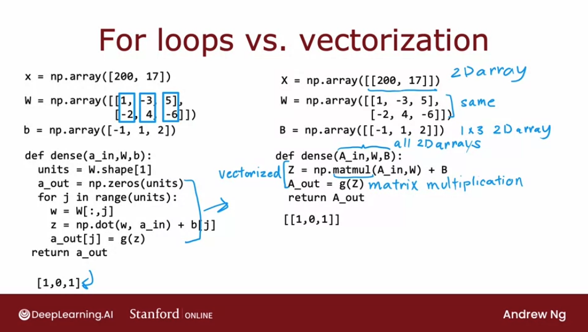

If we're familiar with linear algebra, if we're familiar with vectors, matrices, transposes, and matrix multiplications, we can safely just quickly skim over these two videos and jump to the last video of this week. Then in the last video of this week, also optional, we'll dive into more detail to explain how matmul gives we this vectorized implementation. Let's go onto the next video, where we'll take a look at what matrix multiplication is. 

## Matrix multiplication

We know that a matrix is just a block or 2D array of numbers. What does it mean to multiply two matrices? Let's take a look.

In order to build up to multiplying matrices, let's start by looking at how we **take dot products between vectors**. Let's use the example of taking the dot product between these vectors:

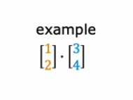

If `z` is the dot product between these two vectors, then we compute z by multiplying the first element by the first element here, plus the second element times the second element:

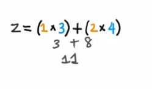

And it equals `11`.

In the more general case, if `z` is the dot product between a vector `a` and vector `w`, then we compute `z` by multiplying the first element together and then the second elements together and the third and so on and then adding up all of these products:

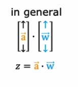

But there's an **equivalent way of writing a dot product**: given a vector `a`, that is `[1, 2]` written as a column, we can turn this into a row. That is, we can turn it from what's called a column vector to a row vector by taking the **transpose of `a`**. **The transpose of the vector a means we take this vector and lay its elements on the side**:

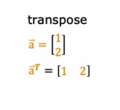

So now our transposed $\mathbf{\vec{a}}^T$ is now a row vector (1x2 matrix).

And $\mathbf{z}$ equals $\mathbf{\vec{a}}^T$ times $\mathbf{\vec{w}}$ - which is the same as taking the dot product between $\mathbf{\vec{a}}$ and $\mathbf{\vec{w}}$:

$$ \mathbf{z} = \mathbf{\vec{a}}^T  \mathbf{\vec{w}} \Leftrightarrow \mathbf{\vec{a}} \cdot  \mathbf{\vec{w}} $$

This will be useful for understanding matrix multiplication. 

Now let's look at **vector-matrix multiplication**, which is when we take a vector and we multiply it by a matrix: 

Now apart from $\mathbf{\vec{a}}$ and  $\mathbf{\vec{a}}^T$, we have $\mathbf{\vec{W}}$:

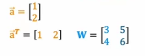

So if we want to calculate $\mathbf{\vec{Z}}^T$ i's going to be $Z = \mathbf{\vec{a}}^T \mathbf{\vec{W}}$:

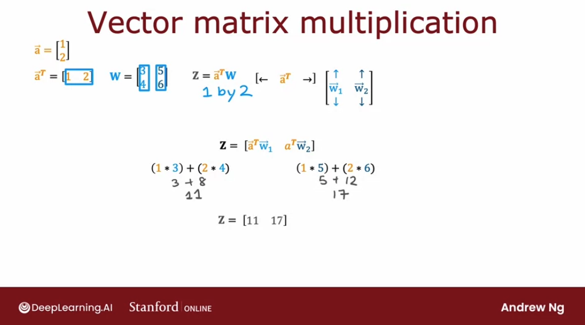

Now we're only missing **matrix-matrix multiplication**. We have a matrix $\mathbf{\vec{A}}$ and  $\mathbf{\vec{A}}^T$:

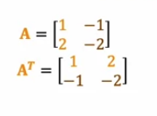

(In order to compute $\mathbf{\vec{A}}^T$ transpose, we're going to take the columns of $\mathbf{\vec{A}}$ and similar to what happened when we transpose a vector, we're going to take the columns and lay them on the side, one column at a time.)

Next we have this matrix $\mathbf{\vec{W}}$:

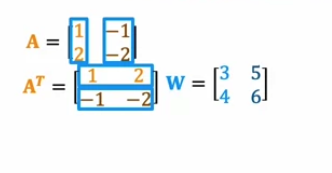

(One way I encourage we to think of matrices that is useful for neural network implementations is: 
- if we see a **matrix**, think of the **columns of the matrix** 
- if we see the **transpose of a matrix**, think of the **rows of that matrix** 
**as being grouped**

And the multiplication will be:

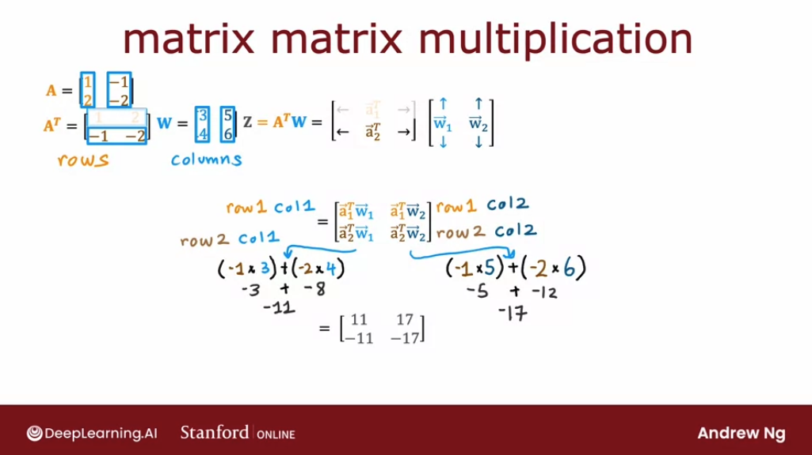

## Matrix multiplication rules

Here's the matrix $\mathbf{\vec{A}}$, which is a 2 by 3 matrix because it has two rows and three columns. As before **I encourage we to think of the columns of this matrix as three vectors**: vectors $\mathbf{\vec{a_1}}$, $\mathbf{\vec{a_2}}$ and $\mathbf{\vec{a_3}}$.

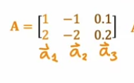

Then we have $\mathbf{\vec{A}}^T$ which we want to multiply with the matrix $\mathbf{\vec{W}}$ . And here I encourage you to think of the rows the vectors: $\mathbf{\vec{a_1}^T}$, $\mathbf{\vec{a_2}^T}$ and $\mathbf{\vec{a_3}^T}$.

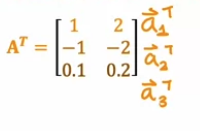

And then, we should think of the matrix $\mathbf{\vec{W}}$ as vectors $\mathbf{\vec{w_1}}$, $\mathbf{\vec{w_2}}$ and $\mathbf{\vec{w_3}}$:

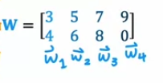

And to multiply $\mathbf{\vec{A}^T}$ with $\mathbf{\vec{W}}$ to get $\mathbf{\vec{Z}}$ we should do:

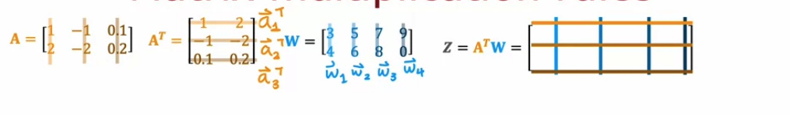

For each value we are calculating within the output matrix $\mathbf{\vec{Z}}$, we need to calculate the dot product of the corresponding row and column:

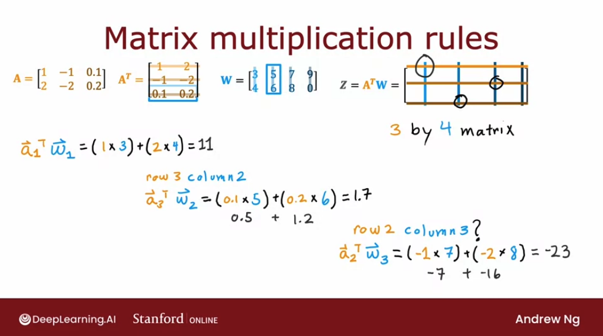

And $\mathbf{\vec{Z}}$ results in:

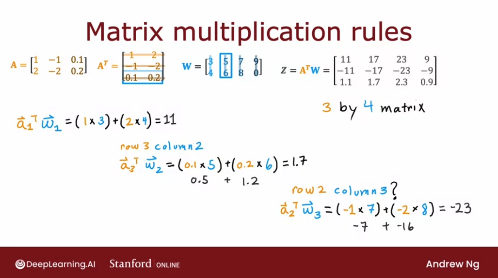

**A requirement in order to multiply two matrices together is that:** 

> **the number of columns of the first matrix must match the number of rows of the second matrix.**

(Recall that matrix multiplication is not commutative - order matters!)

This because **we can only take dot products between vectors that are the same length**. And since each element of the output array is a a dot product between a row of the first matrix and a column of the second matrix, they should have equal length:

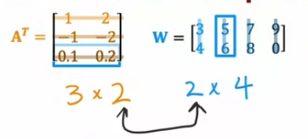

The other observation is that:

> **the output $\mathbf{\vec{Z}}$ will have a shape which equals the number of rows of the first matrix and the number of columns of the second matrix.**

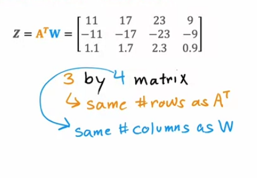

So a multiplication between a 3x2 matrix and a 2x4 matrix will have a shape 3x3.

## Matrix multiplication code

Let's se into the vectorize implementation of a neural network. Let's see the code equivalents of the matrices that we created and multiplied in the last section:

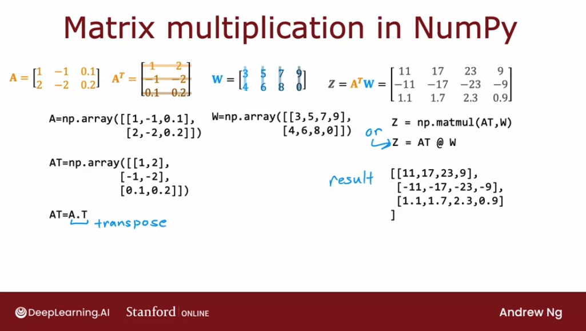

```py
A = np.array([[1, -1, 0,1],
             [2, -2, 0.2]])

# And A transposed will therefore be:
AT = np.array([[1, 2],
              [-1, -2],
              [0.1, 0.2]])

# But we can directly calculate the transpose with numpy
AT = A.T

# W stays the same
W = np.array([[3, 5, 7, 9],
             [4, 6, 8, 0]])

# And we can calculate Z by using the matmul function:
Z = np.matmul(AT, W)

# Or use the equivalent @ symbol
Z = AT @ W

# Which results in:
[
  [11, 17, 23, 9],
  [-11, -17 -23, -9]
  [1.1, 1.7, 2.3, 0.9]
]
```

Let's look at what a vectorized implementation of forward prop looks like. 

We're going to set $\mathbf{\vec{A}^T}$ (`AT`) to be equal to the input feature values 200 and 17. These are just the usual input feature values, 200 degrees roasting coffee for 17 minutes. This is a one by two matrix: `np.array[[200 17]]`:

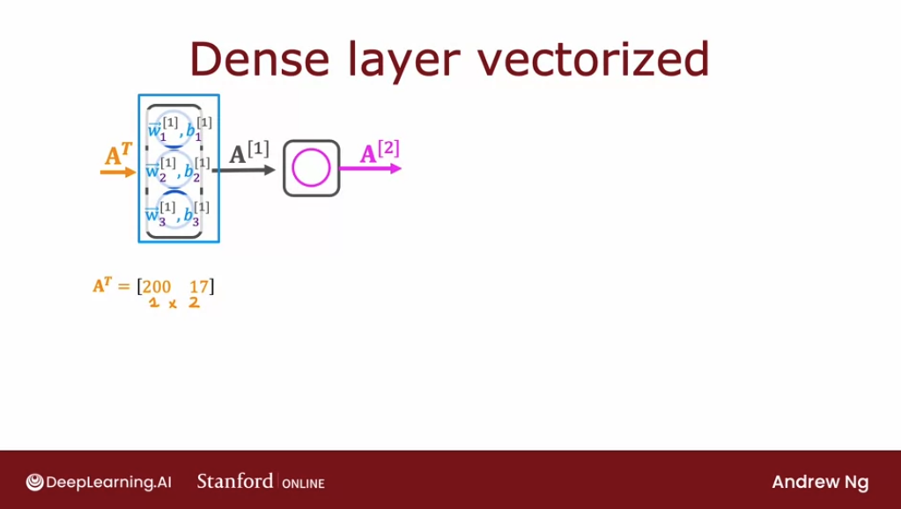

Then we're going to take the parameters $\vec{w_1}^{[1]}$, $\vec{w_2}^{[1]}$, and $\vec{w_3}^{[1]}$, and **stack them in columns to form the matrix W**:

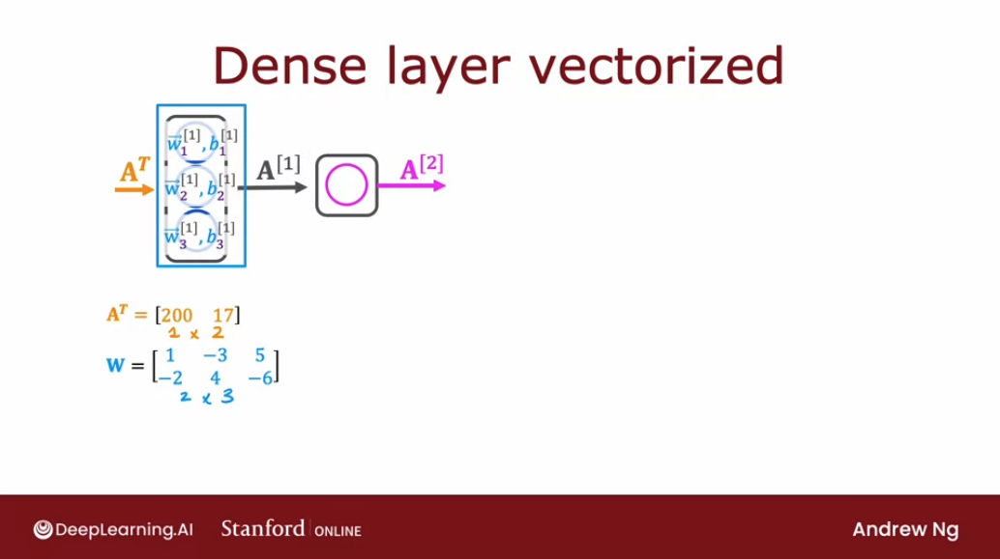

And he values $b_1^{[1]}$, $b_2^{[1]}$, and $b_3^{[1]}$ we're going to put it into a one by three matrix, which is this matrix $\mathbf{\vec{b}}$ as follows: 

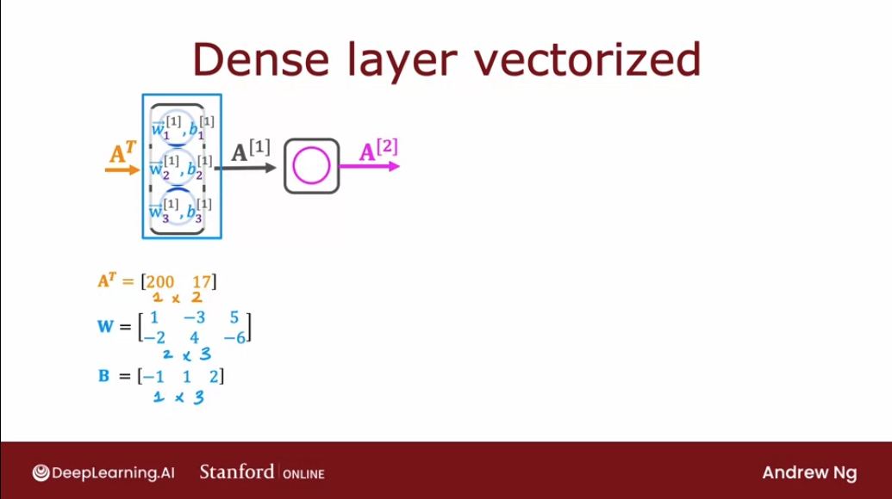

And we can compute $\vec{Z} = \vec{A}^T W + b$:

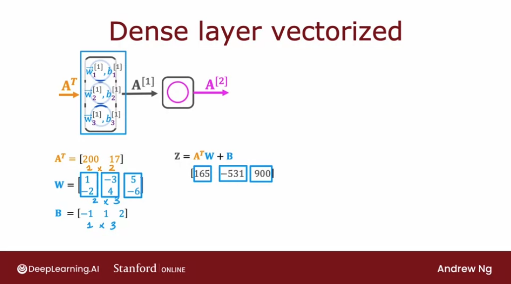

Then finally, if the function g applies the sigmoid function to these three numbers element-wise we end up with `A_out` equalling `[1 0 1]`:

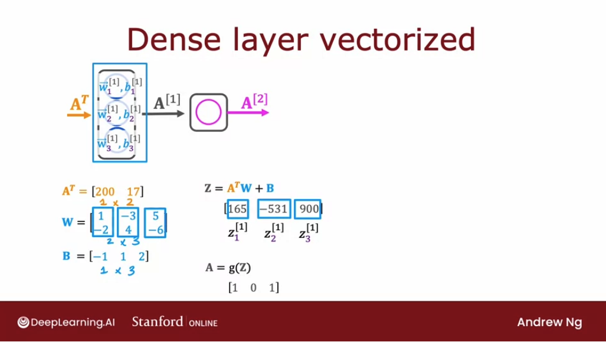

Let's see this in code:

```py
# We define the input as A-transposed [[temprature, time]]
AT = np.array([[200, 17]])

W = np.array([[1, -3, 5],
              [-2, 4, -6]])

b = np.array([[-1, 1, 2]])

# And we can redefine the dense function using matmul
def dense(AT, W, b):
  Z = np.matmul(AT, W) + b
  A_out = g(Z)

  return A_out

# returns [[1, 0, 1]]  ---> 1x3 matrix
```
And remember, the inputs had shapes:
- `AT` ----> 1x2
- `W` -----> 2x3
- `b` ------> 1x3 (matches output)

> So it makes sense that from the multiplication **1x2** times **2x3** we get an output of **1x3**:

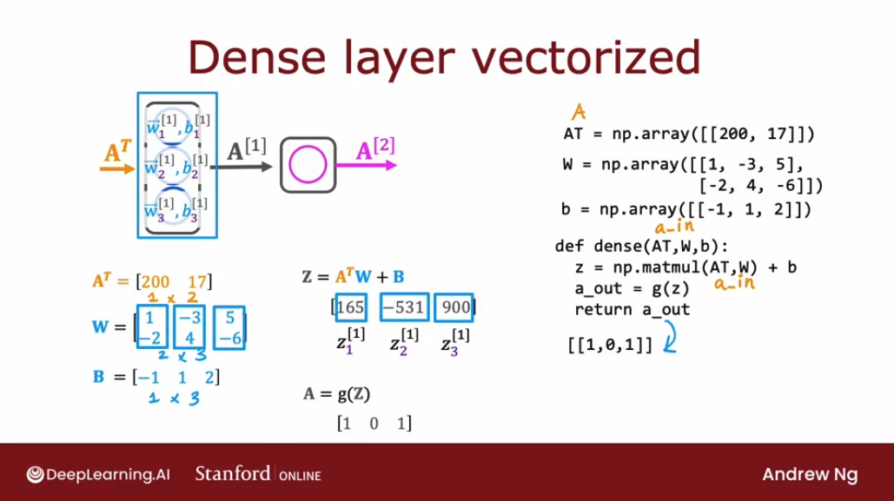

> Important! Why sometimes using X and sometimes AT?

There is a convention in TensorFlow that individual examples are actually laid out in rows in the matrix `X` rather than in the matrix `X-transposed` which is why the code implementation above actually looks like this in TensorFlow. 

But this explains why with just a few lines of code we can implement forward prop in the neural network.

