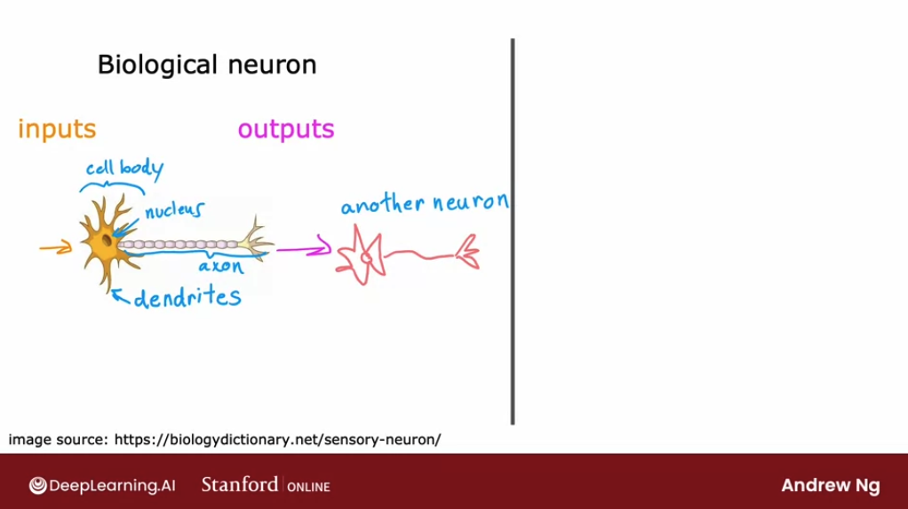

# Neural networks intuition

## Neurons and the brain

When neural networks were first invented many decades ago, **the original motivation was to write software that could mimic how the human brain or how the biological brain learns and thinks.** 

Even though, today, **neural networks**, sometimes also called artificial neural networks, have become very different than how any of us might think about how the brain actually works and learns, some of the biological motivations still remain in the way we think about artificial neural networks or computer neural networks.

Let's start by taking a look at how the brain works and how that relates to neural networks. 

The human brain, or maybe more generally, **the biological brain demonstrates a higher level or more capable level of intelligence and anything else that we were able to build so far**. That's why neural networks has started with the motivation of trying to build software to mimic the brain. 

Work in neural networks started back in the 1950s, and then it fell out of favor for a while. Then in the 1980s and early 1990s, they gained in popularity again and showed tremendous traction in some applications like handwritten digit recognition, which were used even back then to read postal codes, for writing mail and for reading dollar figures in handwritten checks. But then it fell out of favor again in the late 1990s. 

It was from about **2005** that it enjoyed a resurgence and also **became re-branded as deep learning**. One of the things that surprised Andrew Ng then was that deep learning and neural networks meant very similar things. But maybe under-appreciated at the time was the fact that the term "deep learning", just sounds much better because it's deep and it's learning. So that turned out to be the brand that took off in the last decade or decade and a half. 

Since then, neural networks have revolutionized application area after application area. The first application area that modern neural networks or deep learning had a huge impact on was probably **speech recognition**, where we started to see much better results due to modern deep learning. Authors such as Geoff Hinton were instrumental to this.

Then it started to make inroads into **computer vision**. Sometimes people still speak of the ImageNet moments in 2012.

Then the next few years, it made  inroads into texts or into **natural language processing**, and so on and so forth. 

Now, **neural networks are used in everything from climate change to medical imaging to online advertising to prouduct recommendations: lots of application areas of machine learning now use neural networks**. 

So how does the brain work? Here's a diagram illustrating what neurons in a brain look like: 

All of human thought is from neurons like these, sending electrical impulses and sometimes forming new connections to other neurons. Given a neuron like this one, it has a number of inputs where it receives electrical impulses from other neurons, and then that neuron carries out some computations and will then send this outputs to other neurons by this electrical impulses. In turn, this neuron's output becomes the input to another neuron down below, which again aggregates inputs from multiple other neurons to then maybe send its own output, to yet other neurons.

Here's a simplified diagram of a biological neuron: 

A neuron comprises a **cell body** shown here on the left, and, we may recognize this to be the nucleus of the neuron. As we saw on the previous diagram, the neuron has different inputs. In a biological neuron, the input wires are called the **dendrites**, and it then occasionally sends electrical impulses to other neurons via the output wire, which is called the **axon**. This biological neuron may then send electrical impulses that become the input to another neuron. 

Instead the **artificial neural network** uses a very simplified mathematical model of what a biological neuron does. We'll use a little circle here to denote a single neuron. 

What a neuron does is it takes some inputs, one or more inputs, which are just numbers. It does some computation and it outputs some other number, which then could be an input to a second neuron. 

Actually, when we're building an artificial neural network or deep learning algorithm, rather than building one neuron at a time, we often want to simulate many such neurons at the same time. In the diagram above, we're drawing three neurons. What these neurons do collectively is input a few numbers, carry out some computation, and output some other numbers. 

The ideas of neural networks have been around for many decades. But then, why now? **Why is it that only in the last handful of years that neural networks have really taken off?** 

Let's plot on the horizontal axis the amount of data we have for a problem, and on the vertical axis, the performance or the accuracy of a learning algorithm applied to that problem. Over the last couple of decades, with the rise of the Internet, the rise of mobile phones, the digitalization of our society, **the amount of data we have for a lot of applications has steadily marched to the right**. 

In many application areas, the amount of digital data has exploded. What we saw was with traditional machine-learning algorithms, such as logistic regression and linear regression, even as we fed those algorithms more data, it was very difficult to get the performance to keep on going up. So it was as if **the traditional learning algorithms like linear regression and logistic regression, they just weren't able to scale with the amount of data we could now feed it and they weren't able to take effective advantage of all this data we had for different applications:** 

But, what AI researchers started to observe was that if we were to train a small neural network on this dataset, then the performance was higher: 

If we were to train a medium-sized neural network, meaning one with more neurons in it, its performance was even higher. If we were to train a very large neural network, meaning one with a lot of these artificial neurons, then for some applications the performance will just keep on going up:

So this meant two things: 

1. that for a certain class of applications **where we do have a lot of data**, -sometimes we hear the term big data tossed around- **if we're able to train a very large neural network** to take advantage of that huge amount of data we have, then **we could attain performance on anything** ranging from speech recognition, to image recognition, to natural language processing applications. These just were not possible with earlier generations of learning algorithms. This caused deep learning algorithms to take off.
2. **faster computer processors**, including the rise of GPUs or graphics processor units, which is hardware originally designed to generate nice-looking computer graphics, but turned out to be really powerful for deep learning as well. **That was also a major force in allowing deep learning algorithms to become what it is today**. 

That's how neural networks got started, as well as why they took off so quickly in the last several years.

## Demand Prediction

To illustrate how neural networks work, let's start with an example. We'll use an example from **demand prediction** in which we look at a product and try to predict wether it will be a top seller or not.

In this example, we're selling T-shirts and we have collected data of different t-shirts that were sold at different prices, as well as which ones became a top seller. This type of application is used by retailers today in order to plan better inventory levels as well as marketing campaigns. If we know what's likely to be a top seller, we would plan, for example, to just purchase more of that stock in advance. 

In this example, the **input feature $x$ is the price** of the T-shirt, so that's the input to the learning algorithm. 

If we apply **logistic regression** to fit a **sigmoid function** to the data,then the output of our prediction will have the formula:

$$ \frac{1}{1 + e^{-(wx+b)}} $$
 
 
Previously, we had written this as $f(x)$, the output of the learning algorithm. In order to set us up to build a neural network, we're going to switch the terminology and **use the letter $a$, for activation, to denote the output of this logistic regression algorithm.** 

Activation is actually a term from neuroscience, and it refers to how much a neuron is sending a high output to other neurons downstream from it. It turns out that **this little logistic regression algorithm, can be thought of as a very simplified model of a single neuron in the brain.** 

$$a = f(x) =  \frac{1}{1 + e^{-(wx+b)}} $$

What the neuron does is: **it takes us input the price $x$, and then it computes the activation formula above, and it outputs the number $a$, the probability of this T-shirt being a top seller.**

Given this description of a single neuron, **building a neural network now it just requires taking a bunch of these neurons and wiring them together or putting them together.** 

Let's now look at a more complex example of demand prediction. Now, we're going to have **four features** to predict whether or not a T-shirt is a top seller. The features are: 
1. the **price** of the T-shirt
2. the **shipping costs**
3. the amounts of **marketing** of that particular T-shirt
4. the **material quality**

Now, we might suspect that whether or not a T-shirt becomes a top seller actually depends on a few factors:

1. what is the **affordability** of this T-shirt? 
2. what's the degree of **awareness** of this T-shirt that potential buyers have? 3. what's the **perceived quality**? 

So what we're going to do is: create one artificial neuron to try to estimate the probability that this T-shirt is perceived as highly affordable. Affordability is mainly a function of price and shipping costs because the total amount that we pay for is some of the price plus the shipping costs. 

And we're going to use a little neuron here, a logistic regression unit to input price and shipping costs and predict: do people think this is affordable?

Second, we're going to create another artificial neuron here to estimate, is there high awareness of this? Awareness is mainly a function of the marketing of the T-shirt. 

Finally, we're going to create another neuron to estimate: do people perceive this to be of high quality? and that may mainly be a function of the price of the T-shirt and of the material quality. 

Given these estimates of **affordability**, **awareness**, and **perceived quality**, we then wire the outputs of these three neurons to another neuron on the right, that is another logistic regression unit.

That finally inputs those three numbers and outputs the probability of this t-shirt being a top seller. 

In the terminology of neural networks, we're going to group the three neurons (affordability, awareness and percieved quality) together into what's called a layer. **A layer is a grouping of neurons which takes as input the same or similar features, and that in turn outputs a few numbers together.** 

**A layer can have multiple neurons** or it can also **have a single neuron** as in the case of this layer on the right. 

The **layer on the rightmost of the graph is also called the output layer** because the outputs of this final neuron is the output probability predicted by the neural network. 

In the terminology of neural networks we're also going to call affordability, awareness and perceived quality to be **activations**. The term activations comes from biological neurons, and **it refers to the degree that the biological neuron is sending a high output value** to other neurons to the downstream from it.

So this particular neural network therefore carries out computations as follows: 
1. it inputs four numbers 
2. the hidden layer of the neural network uses those to compute the new numbers also called activation values. 
3. the final layer, the output layer of the neural network, uses those three numbers to compute one number. 

In a neural network **this list of four numbers is also called the input layer**, and that's just a list of four numbers.

Now, there's one important clarification we should make: the way we've described it so far, we had to go through the neurons one at a time and decide what inputs it would take from the previous layer. For example, we said affordability is a function of just price and shipping costs and awareness is a function of just marketing and so on. But if we're building a large neural network it'd be a lot of work to go through and manually decide which neurons should take which features as inputs. 

The way in which a neural network is implemented in practice is that **each neuron in a certain layer will have access to every feature, to every value from the previous layer**:

We can imagine that if we're trying to predict affordability and it knows what's the price shipping cost marketing and material, **the algorithm will learn to ignore marketing and material and just figure out through setting the parameters appropriately to only focus on the subset of features that are most relevant to affordability.** 

To further simplify the notation of this neural network we're going to **take these four input features and write them as a vector $\mathbf{\vec{x}}$**. 

So we're going to view the neural network as having four features that comprise this feature vector $\mathbf{\vec{x}}$. This **feature vector** is fed to the layer in the middle, which then computes **three activation values**. 

In turn, these three activation values **become another vector which is fed to this final output layer, that in turn finally outputs the probability of this t-shirt  being a top seller.**

To add a little bit more terminology, **the layer in the middle is called a hidden layer**. It's called like that because in our dataset we get $\mathbf{\vec{x}}$ and $y$, but correct values for the hidden layer are hidden. We don't see them in the training set, which is why it is called a hidden layer. 

---

Let's see another way of thinking about neural networks that can be useful for building intuition about it. 

If we cover up the left half of this diagram, and see what we're left with, we see that we have a logistic regression algorithm or logistic regression unit that takes as input, affordability, awareness, and perceived quality of a t-shirt, and just uses these three features to estimate the probability of the t-shirt being a top seller:

So, this is just logistic regression. But the cool thing about this is rather than using the original features, price, shipping cost, marketing, and so on, it is using maybe better set of features, affordability, awareness, and perceived quality, that are hopefully more predictive of whether or not this t-shirt will be a top seller. 

**So one way to think of this neural network is: just logistic regression, but a version of it that can learn its own features, that makes it easier to make accurate predictions.**

In fact, we might remember from the previous course, in the housing price prediction example **we were doing manual feature engineering** where we had to look at the features $x_1$ and $x_2$ and decide by hand how to combine them together to come up with better features. 

**What the neural network does is, instead of we needing to manually engineer the features, it can learn, as we'll see later, its own features to make the learning problem easier for itself.** This is what makes neural networks one of the most powerful learning algorithms in the world today.

---

Let's take a look at some other examples of neural networks, specifically, **examples with more than one hidden layer**. 

In this first example neural network we an input feature vector $\mathbf{\vec{x}}$ that is fed to one hidden layer. We're going to call this the first hidden layer. If this hidden layer has three neurons, it will then output a vector of three activation values, $\mathbf{\vec{a}}$. These three numbers can then be input to the second hidden layer. If the second hidden layer has two neurons to logistic units, then this second hidden there will output another vector of now two activation values, $\mathbf{\vec{a}}$, that goes to the output layer, that then outputs the neural network's final prediction. 

Here's another example:

Here's a neural network that it's input goes to the first hidden layer, the output of the first hidden layer goes to the second hidden layer, goes to the third hidden layer, and then finally to the output layer.

When we're building our own neural network, one of the decisions we need to make is h**ow many hidden layers do we want and how many neurons do we want each hidden layer to have.** 

This question of how many hidden layers and how many neurons per hidden layer is a question of the **architecture of the neural network**. 

We'll learn later in this course some tips for choosing an appropriate architecture for a neural network. Choosing the right number of hidden layers and number of hidden units per layer **can have an impact on the performance** of a learning algorithm as well. 

In some of the literature, we see **this type of neural network with multiple layers like this called a multilayer perceptron**. 

## Example: Recognizing images

In the last video, you saw how a neural network works in a demand prediction example. Let's take a look at how you can apply a similar type of idea to computer vision application. Let's dive in. If you're building a face recognition application, you might want to train a neural network that takes as input a picture like this and outputs the identity of the person in the picture. This image is 1,000 by 1,000 pixels. Its representation in the computer is actually as 1,000 by 1,000 grid, or also called 1,000 by 1,000 matrix of pixel intensity values. In this example, my pixel intensity values or pixel brightness values, goes from 0-255 and so 197 here would be the brightness of the pixel in the very upper left of the image, 185 is brightness of the pixel, one pixel over, and so on down to 214 would be the lower right corner of this image. If you were to take these pixel intensity values and unroll them into a vector, you end up with a list or a vector of a million pixel intensity values. One million because 1,000 by 1,000 square gives you a million numbers. The face recognition problem is, can you train a neural network that takes as input a feature vector with a million pixel brightness values and outputs the identity of the person in the picture. This is how you might build a neural network to carry out this task. The input image X is fed to this layer of neurons. This is the first hidden layer, which then extract some features. The output of this first hidden layer is fed to a second hidden layer and that output is fed to a third layer and then finally to the output layer, which then estimates, say the probability of this being a particular person. One interesting thing would be if you look at a neural network that's been trained on a lot of images of faces and to try to visualize what are these hidden layers, trying to compute. It turns out that when you train a system like this on a lot of pictures of faces and you peer at the different neurons in the hidden layers to figure out what they may be computing this is what you might find. In the first hidden layer, you might find one neuron that is looking for the low vertical line or a vertical edge like that. A second neuron looking for a oriented line or oriented edge like that. The third neuron looking for a line at that orientation, and so on. In the earliest layers of a neural network, you might find that the neurons are looking for very short lines or very short edges in the image. If you look at the next hidden layer, you find that these neurons might learn to group together lots of little short lines and little short edge segments in order to look for parts of faces. For example, each of these little square boxes is a visualization of what that neuron is trying to detect. This first neuron looks like it's trying to detect the presence or absence of an eye in a certain position of the image. The second neuron, looks like it's trying to detect like a corner of a nose and maybe this neuron over here is trying to detect the bottom of an ear. Then as you look at the next hidden layer in this example, the neural network is aggregating different parts of faces to then try to detect presence or absence of larger, coarser face shapes. Then finally, detecting how much the face corresponds to different face shapes creates a rich set of features that then helps the output layer try to determine the identity of the person picture. A remarkable thing about the neural network is you can learn these feature detectors at the different hidden layers all by itself. In this example, no one ever told it to look for short little edges in the first layer, and eyes and noses and face parts in the second layer and then more complete face shapes at the third layer. The neural network is able to figure out these things all by itself from data. Just one note, in this visualization, the neurons in the first hidden layer are shown looking at relatively small windows to look for these edges. In the second hidden layer is looking at bigger window, and the third hidden layer is looking at even bigger window. These little neurons visualizations actually correspond to differently sized regions in the image. Just for fun, let's see what happens if you were to train this neural network on a different dataset, say on lots of pictures of cars, picture on the side. The same learning algorithm is asked to detect cars, will then learn edges in the first layer. Pretty similar but then they'll learn to detect parts of cars in the second hidden layer and then more complete car shapes in the third hidden layer. Just by feeding it different data, the neural network automatically learns to detect very different features so as to try to make the predictions of car detection or person recognition or whether there's a particular given task that is trained on. That's how a neural network works for computer vision application. In fact, later this week, you'll see how you can build a neural network yourself and apply it to a handwritten digit recognition application. So far we've been going over the description of intuitions of neural networks to give you a feel for how they work. In the next video, let's look more deeply into the concrete mathematics and a concrete implementation of details of how you actually build one or more layers of a neural network, and therefore how you can implement one of these things yourself. Let's go on to the next video.