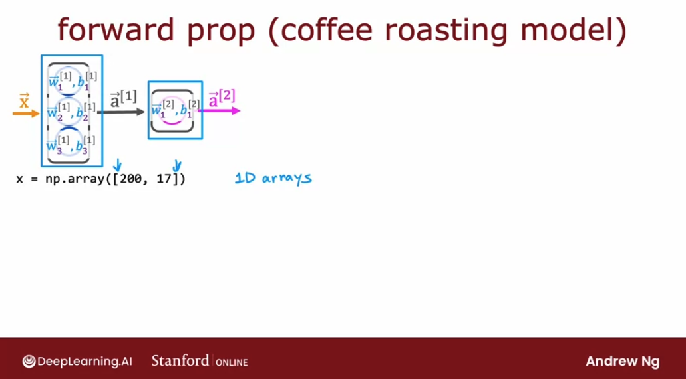
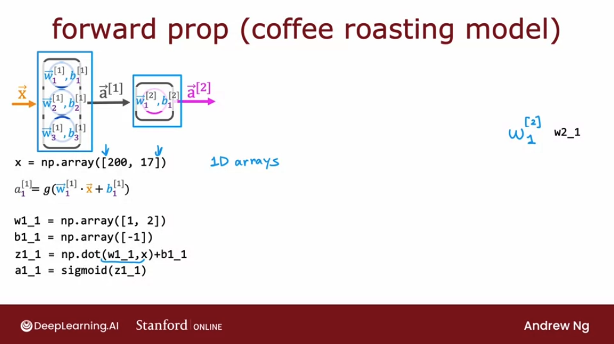
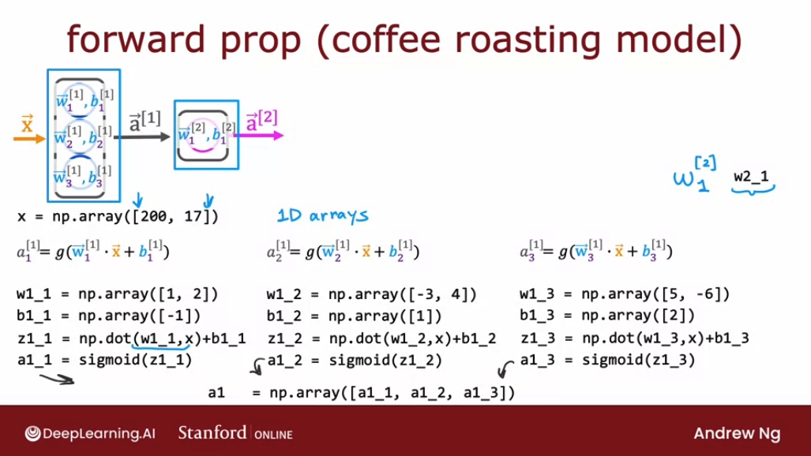
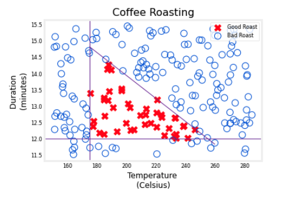
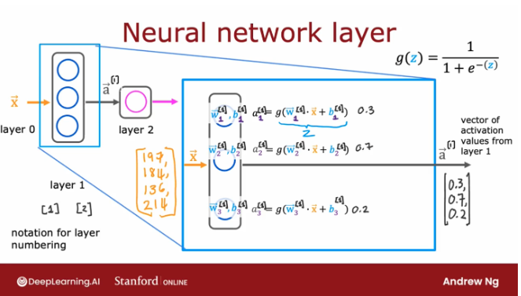
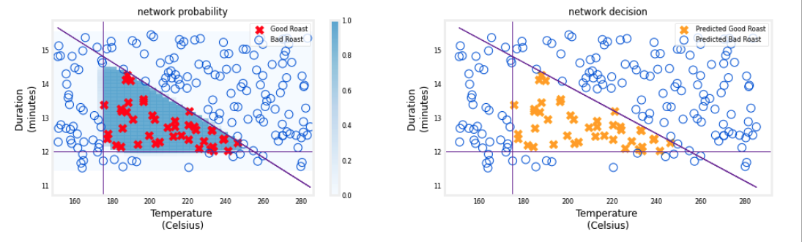

# Neural network implementation in Python

## Forward prop in a single layer

If we had to implement forward propagation ourselves from scratch in python, how would we go about doing so? 

Let's take a look at how we implement forward prop in a single layer, and for that, we're going to continue using the coffee roasting model. 

And let's look at how we would take an input feature vector $\mathbf{\vec{x}}$, and implement forward prop to get the output $\mathbf{\vec{a_2}}$.

 In this python implementation, we're going to use 1D arrays to represent all of these vectors and parameters, which is why we're going to use single square brackets here:

 

`np.array([200, 17])` is a 1D array in python rather than a 2D matrix, which is what we had when we had double square brackets. 

So the first value we need to compute is $\mathbf{a_1^{[1]}}$ which is the first activation value of the vector $\mathbf{\vec{a}^{[1]}}$. And it will have the formula:

$$\mathbf{a_1^{[1]}} = g(\mathbf{w_1^{[1]}} \cdot \mathbf{\vec{x}} + \mathbf{b_1^{[1]}} ) $$

We're going to use the convention on this slide that at a term like $\mathbf{w_1^{[2]}}$ is going to be represented in code as `w2_1`, with the layer number indicated first, and after the underscore, the number of the neuron. In this case, the second layer has only 1 neuron, so after the underscore, we'll only have a 1.

 So, to compute $\mathbf{{a_1}^{[1]}}$, we have parameters `w1_1` and `b1_1`:

 ```py
 w1_1 = np.array([1, 2])
 b1_1 = np.array([-1])
 ```
 We would then compute `z1_1` as the dot product between that parameter `w1_1` and the input `x`, and added to `b1_1`.  And then finally $a1_1$ is equal to g, the sigmoid function applied to `z1_1`. 
 
 ```py
z1_1 = np.dot(w1_1, x) + b1_1
a1_1 = sigmoid(z_1)
 ```
 
 In summary:

 ```py
w1_1 = np.array([1, 2])
b1_1 = np.array([-1])
z1_1 = np.dot(w1_1, x) + b1_1
a1_1 = sigmoid(z_1)
 ```



And we can calculate similarly $\mathbf{{a_2}^{[1]}}$ and $\mathbf{{a_3}^{[1]}}$, the two remaining scalar numbers of the activation vector $\mathbf{\vec{a}^{[1]}}$:

For $\mathbf{{a_2}^{[1]}}$:
 ```py
w1_2_ = np.array([-3, 4])
b1_2_ = np.array([1])
z1_2_ = np.dot(w1_2, x) + b1_2
a1_2_ = sigmoid(z1_2_)
 ```
And for $\mathbf{{a_3}^{[1]}}$:
  ```py
w1_3 = np.array([5, -6])
b1_3 = np.array([2])
z1_3 = np.dot(w1_3, x) + b1_3
a1_3 = sigmoid(z_3)
```

And we create our final activation vector `a1`:

```py
a1 = np.array([a1_1, a1_2, a1_3])
```



So now we've computed $\mathbf{\vec{a}^{[1]}}$, let's implement the second layer as well, to compute the output $\mathbf{\vec{a}^{[2]}}$:

$$\mathbf{a_1^{[2]}} = g(\mathbf{w_1^{[2]}} \cdot \mathbf{\vec{a}^{[1]}} + \mathbf{b_1^{[2]}} ) $$


```py
w2_1 = np.array([-7, 8, 9])
b2_1 = np.array([3])
z2_1 = np.dot(w2_1, a1) + b2_1
a2_1 = sigmoid(z2_1)
```

And that's it, that's how we implement forward prop using just Python and numpy. 

## General implementation of forward propagation

In the last section, we saw how to implement forward prop in Python, but by hard coding lines of code for every single neuron. 

Let's now take a look at the more general implementation of forward prop in Python.

What we'll do is** write a function to implement a dense layer**, that is **a single layer of a neural network**. We're going to define the `dense`` function, which takes as input:
1. the **activation** from the previous layer
2. the parameter w for the neurons in a given layer
2. the parameter b for the neurons in a given layer

```py
def dense(a_in, W, b):
```

Using the example from the previous video, the layer 1 has three neurons, and if $\mathbf{\vec{w_1}^{[1]}}$ and $\mathbf{\vec{w_2}^{[1]}}$ and $\mathbf{\vec{w_2}^{[1]}}$ are the following:

$$ \mathbf{\vec{w_1}^{[1]}} = \begin{bmatrix} 1 \\ 2 \end{bmatrix} \space  \space \space \mathbf{\vec{w_2}^{[1]}} = \begin{bmatrix} -3 \\ 4 \end{bmatrix} \space \space \space\space \mathbf{\vec{w_3}^{[1]}} = \begin{bmatrix} 5 \\ 6 \end{bmatrix}$$

What we have to do here is stack all of these vectors into a matrix: his is going to be a `2row x 3columns` matrix, where:

- the **first column** is the parameter $\mathbf{\vec{w_1}^{[1]}}$ 
- the **second column** is the parameter $\mathbf{\vec{w_2}^{[1]}}$ 
- the **third column** is the parameter $\mathbf{\vec{w_3}^{[1]}}$

```py
W = np.array([
      [1, -3, 5]
      [2, 4, -6]        # 2 rows x 3 colums matrix
])
```

Then in a similar way, if we have parameters $b$:

$$ \mathbf{b_1^{[1]}} = -1 \space  \space \space \mathbf{b_2^{[1]}} = 1\space \space \space\space \mathbf{b_3^{[1]}} = 2$$


we're going to stack these three numbers into a 1D array `b` as follows:

```py
b = np.array([-1, 1, 2])
```

What the dense function will do is take as inputs the activation from the previous layer, (which at the start of the network equal to $\mathbf{\vec{x}}$), or the activation from a later layer, as well as the $w$ parameters stacked in columns, as well as the $b$ parameters also stacked into a 1D array.

And what this function would do is input a to activation from the previous layer and will output the activations from the current layer. Let's step through the code for doing this:

```py
def dense(a_in, W, b):
  units = W.shape[1]
  a_out = np.zeros(units)
  for j in range(units):
    w = W[:, j]
    z = np.dot(w, a_in) + b[j]
    a_out[j] = sigmoid(z)
  return a_out
```

Let's add explanation to what each line is doing:

```py
def dense(a_in, W, b):
  # W is a "2rows X 3columns" matrix. So the number of columns is 3.
  # That is equal to the number of units in this layer. We can extract
  # the number of columns in a  using (matrix).shape[1]
  units = W.shape[1]  # ---> 3
  # We initialize as the output of our layer an array with as many
  # zeroes as there are unit. We will fill these later.
  a_out = np.zeros(units) # ---> [0, 0, 0]
  # We loop over the amount of units/neurons on the layer
  # in this case, we will loop over 0, 1 and 2
  for j in range(units):
    # We use this numpy notation to extract each of the three columns
    # on each iteration. This will result in [1, 2], then [-3, 4 ] 
    # and finally [5, 6]. We assign that to w.
    w = W[:, j]
    # Calculate z using the usual dot product formula + b
    z = np.dot(w, a_in) + b[j]
    # Calculate the output by applying the sigmoid (or any other)
    # activation function to z. Assign it to each element of the output vector
    a_out[j] = g(z) # = sigmoid(z)
  return a_out
```

What the dense function does is it inputs the activations from the previous layer, and given the parameters for the current layer, it returns the activations for the next layer. 

Given the dense function, here's how we can string together a few dense layers sequentially, in order to implement forward prop in the neural network:

```py
def sequential(x):
  a1 = dense(x, W1, b1)
  a2 = dense(a1, W1, b1)
  a3 = dense(a2, W1, b1)
  a4 = dense(a3, W1, b1)
  f_x = a3
  return f_x
```
Notice that the output of a layer is the input to the next layer.

Also notice that we use `W` with capital letters when referring to a matrix and `w` with lowercase when referring to a 1D vector or scalar.

## Lab: CoffeRoastingNumPy - Simple Neural Network

In this lab, we will build a small neural network using Numpy. It will be the same "coffee roasting" network you implemented in Tensorflow.

```py
import numpy as np
import matplotlib.pyplot as plt
plt.style.use('./deeplearning.mplstyle')
import tensorflow as tf
from lab_utils_common import dlc, sigmoid
from lab_coffee_utils import load_coffee_data, plt_roast, plt_prob, plt_layer, plt_network, plt_output_unit
import logging
logging.getLogger("tensorflow").setLevel(logging.ERROR)
tf.autograph.set_verbosity(0)
```

### Dataset
This is the same data set as the previous lab:
```py
X,Y = load_coffee_data();
print(X.shape, Y.shape)
# (200, 2) (200, 1)
```

Let's plot the coffee roasting data below. The two features are Temperature in Celsius and Duration in minutes. [Coffee Roasting at Home](https://www.merchantsofgreencoffee.com/how-to-roast-green-coffee-in-your-oven/) suggests that the duration is best kept between 12 and 15 minutes while the temp should be between 175 and 260 degrees Celsius. Of course, as the temperature rises, the duration should shrink. 

```py
plt_roast(X,Y)
```



### Normalize Data
To match the previous lab, we'll normalize the data. Refer to that lab for more details:

```py
print(f"Temperature Max, Min pre normalization: {np.max(X[:,0]):0.2f}, {np.min(X[:,0]):0.2f}")
print(f"Duration    Max, Min pre normalization: {np.max(X[:,1]):0.2f}, {np.min(X[:,1]):0.2f}")
# Temperature Max, Min pre normalization: 284.99, 151.32
# Duration    Max, Min pre normalization: 15.45, 11.51

norm_l = tf.keras.layers.Normalization(axis=-1)
norm_l.adapt(X)  # learns mean, variance
Xn = norm_l(X)
print(f"Temperature Max, Min post normalization: {np.max(Xn[:,0]):0.2f}, {np.min(Xn[:,0]):0.2f}")
print(f"Duration    Max, Min post normalization: {np.max(Xn[:,1]):0.2f}, {np.min(Xn[:,1]):0.2f}")
# Temperature Max, Min post normalization: 1.66, -1.69
# Duration    Max, Min post normalization: 1.79, -1.70
```

### Numpy Model (Forward Prop in NumPy)
Let's build the "Coffee Roasting Network" described in lecture. There are two layers with sigmoid activations:

As described in the previous lecture, it is possible to build your own dense layer using NumPy. This can then be utilized to build a multi-layer neural network.



In the first optional lab, you constructed a neuron in NumPy and in Tensorflow and noted their similarity. A layer simply contains multiple neurons/units. As described in the lecture, one can utilize a `for`-loop to visit each unit (`j`) in the layer and perform the dot product of the weights for that unit (`W[:,j]`) and sum the bias for the unit (`b[j]`) to form `z`. An activation function `g(z)` can then be applied to that result. Let's try that below to build a "dense layer" subroutine.

```py
# Define the activation function
g = sigmoid
```

Next, you will define the `my_dense()` function which computes the activations of a dense layer:

```py
def my_dense(a_in, W, b):
    """
    Computes dense layer
    Args:
      a_in (ndarray (n, )) : Data, 1 example 
      W    (ndarray (n,j)) : Weight matrix, n features per unit, j units
      b    (ndarray (j, )) : bias vector, j units  
    Returns
      a_out (ndarray (j,))  : j units|
    """
    units = W.shape[1]
    a_out = np.zeros(units)
    for j in range(units):               
        w = W[:,j]                                    
        z = np.dot(w, a_in) + b[j]         
        a_out[j] = g(z)               
    return(a_out)
```

*Note: You can also implement the function above to accept `g` as an additional parameter (e.g. `my_dense(a_in, W, b, g)`). In this notebook though, you will only use one type of activation function (i.e. sigmoid) so it's okay to make it constant and define it outside the function. That's what you did in the code above and it makes the function calls in the next code cells simpler. Just keep in mind that passing it as a parameter is also an acceptable implementation. You will see that in this week's assignment.*

The following cell builds a two-layer neural network utilizing the `my_dense` subroutine above:
```py
def my_sequential(x, W1, b1, W2, b2):
    a1 = my_dense(x,  W1, b1)
    a2 = my_dense(a1, W2, b2)
    return(a2)
```

We can copy trained weights and biases from the previous lab in Tensorflow:
```py
W1_tmp = np.array( [[-8.93,  0.29, 12.9 ], [-0.1,  -7.32, 10.81]] )
b1_tmp = np.array( [-9.82, -9.28,  0.96] )
W2_tmp = np.array( [[-31.18], [-27.59], [-32.56]] )
b2_tmp = np.array( [15.41] )
```

### Predictions

Once you have a trained model, you can then use it to make predictions. Recall that the output of our model is a probability. In this case, the probability of a good roast. To make a decision, one must apply the probability to a threshold. In this case, we will use `0.5`

Let's start by writing a routine similar to Tensorflow's `model.predict()`. This will take a matrix $X$ with all $m$ examples in the rows and make a prediction by running the model:

```py
def my_predict(X, W1, b1, W2, b2):
    # Extract numer of rows in X
    m = X.shape[0]
    # Create a column vector with m rows, in the shape:
    # p = [[0],
    #      [0],
    #      [0],
    #       ... m amount of rows
    #      [0]]
    p = np.zeros((m,1))
    # Loop by the indices of rows, and saved the probability
    # in each row of the probability vector
    for i in range(m):
        p[i,0] = my_sequential(X[i], W1, b1, W2, b2)
    return(p)
```

We can try this routine on two examples:
```py
X_tst = np.array([
    [200,13.9],  # postive example
    [200,17]])   # negative example
X_tstn = norm_l(X_tst)  # remember to normalize
predictions = my_predict(X_tstn, W1_tmp, b1_tmp, W2_tmp, b2_tmp)
```
To convert the probabilities to a decision, we apply a threshold:
```py
yhat = np.zeros_like(predictions)
for i in range(len(predictions)):
    if predictions[i] >= 0.5:
        yhat[i] = 1
    else:
        yhat[i] = 0
print(f"decisions = \n{yhat}")
decisions = 
# [[1.]
#  [0.]]
```

This can be accomplished more succinctly:
```py
yhat = (predictions >= 0.5).astype(int)
print(f"decisions = \n{yhat}")
# decisions = 
# [[1]
#  [0]]
```

### Network function
This graph shows the operation of the whole network and is identical to the Tensorflow result from the previous lab.

The left graph is the raw output of the final layer represented by the blue shading. This is overlaid on the training data represented by the X's and O's.   

The right graph is the output of the network after a decision threshold. The X's and O's here correspond to decisions made by the network.

```py
netf= lambda x : my_predict(norm_l(x),W1_tmp, b1_tmp, W2_tmp, b2_tmp)
plt_network(X,Y,netf)
```

