# Neural Network Training

## Tensorflow Implementation 

Let's continue with our running example of handwritten digit recognition recognizing this image as zero or a one. Here we're using the neural network architecture that we saw last section, where we have an input X, that is an image, and then the first hidden layer had 25 units, second hidden layer had 15 units, and then one output unit. 

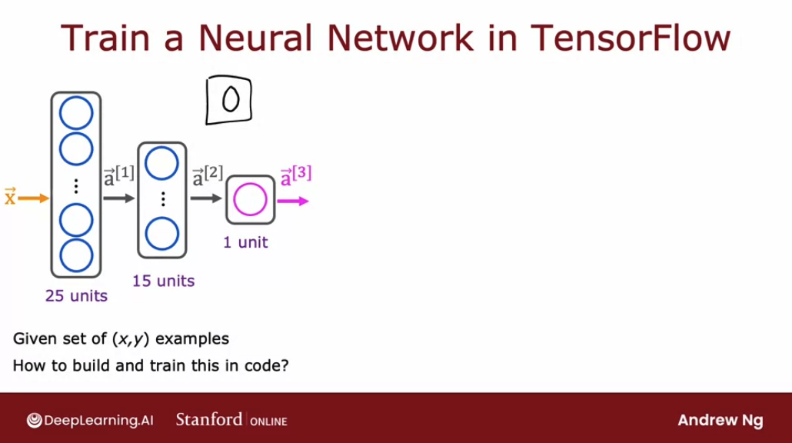

If we're given a training set of examples comprising images X, as was the ground truth label Y, how would we train the parameters of this neural network? Let me go ahead and show we the code that we can use in TensorFlow to train this network. Then in the next few videos after this, we'll dive into details to explain what the code is actually doing. 

This is a code we write:

```py
import tensorflow as tf
from tensorflow.keras import Sequential
from tensorflow.keras.layers import Dense
from tensorflow.keras.losses import BinaryCrossentropy


model = Sequential([
  Dense(units=25, activation='sigmoid')
  Dense(units=15, activation='sigmoid')
  Dense(units=1, activation='sigmoid')
])

# Compile the model telling which loss function we wanna use
model.compile(loss=BinaryCrossentropy())

# Train the model with the training data and 100 iterations
model.fit(X, Y, epochs=100)
```

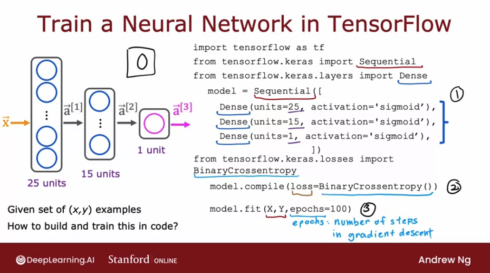

As you can see above:
- Step 1 is to specify the model, which tells TensorFlow how to compute forward inference. - Step 2 compiles the model using a specific loss function
- Step 3 trains the model, with `epochs` being the number of iterarations done on the gradient descent algorithm,

## Training Details

Let's take a look at the details of what the TensorFlow code for training a neural network is actually doing. 

Before looking at the details of training in neural network, let's recall how we had trained a logistic regression model in the previous course. 

The **first step** of building a logistic regression model was to specify **how to compute the output given the input feature `x` and the parameters `w` and `b`.** 

In the first course we said the logistic regression function predicts $f(x)$ is equal to $g(w \cdot x + b)$ where $g$ (for now) is the sigmoid function.

If $z = w \cdot x + b$, then $f(x) = \frac{1}{1 + e^{-z}}$. In code:

```py
z = np.dot(w, x) + b

f_x = 1 / (1+np.exp(-z))
```

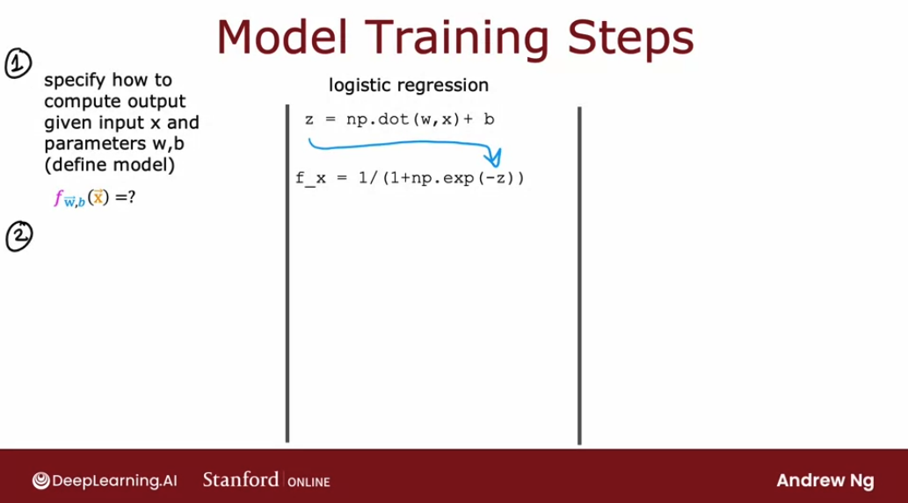

The **second step** we had to do to train the logistic regression model was to **specify the loss function and also the cost function**.

We may recall that the loss function said, if logistic regression outs $f(x)$ and the ground truth label, the actual label of training set was $y$, then the **loss** on that single training example was:

```py
loss = -y * np.log(f_x) - (1 - y) * np.log(1 - f_x)
```

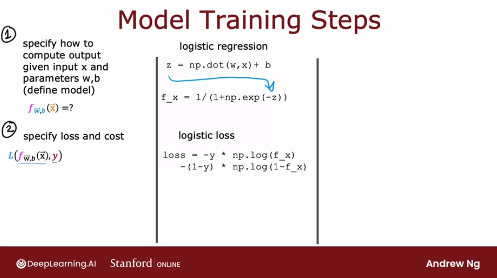

And this loss was a measure of how well is logistic regression doing **on a single training example** `(x, y)`. 

Given this definition of a loss function, we then defined the **cost function**.

This was a function of the parameters $w$ and $b$ and it takes average of the loss function computed on the M training examples. This means the cost function J is an average of the loss function computed over our entire training set. 

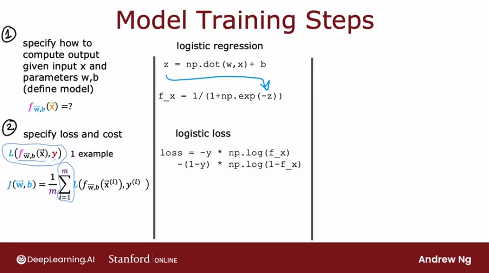

The **third and final step** to train a logistic regression model was to use an algorithm -specifically gradient descent- to minimize that cost function $J(w, b)$.

We minimize the cost $J(w, b)$ using gradient descent where $w$:

$w = w - α \frac{∂}{∂w} J(w, b)$

$b = b - α \frac{∂}{∂b} J(w, b)$

and in code:

```py
w = w - alpha * dj_dw
b = b - alpha * dj_db
```

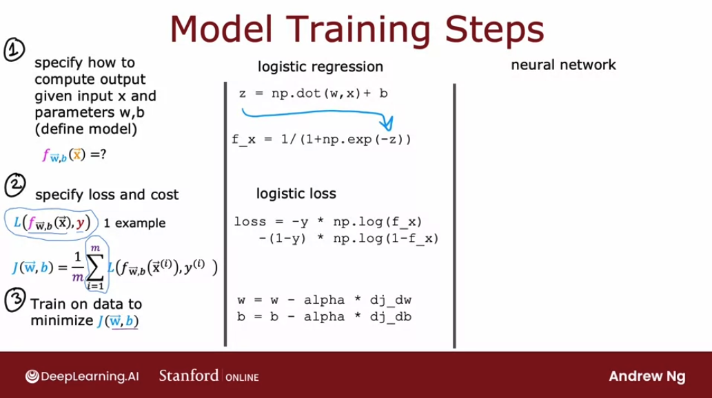

Now let's look at how these three steps map to training a neural network, for each step:

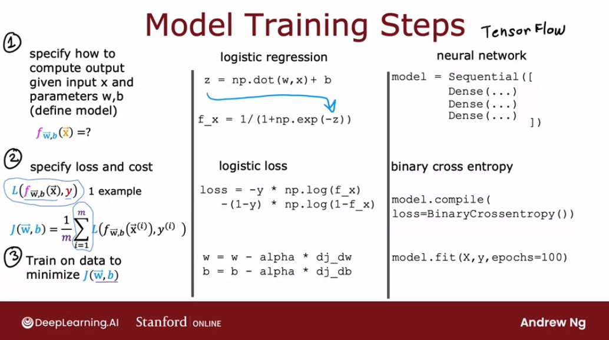

Let's look in greater detail in these three steps in the context of training a neural network. 

In the **first step**, we specify how to compute the output given the input `x` and parameters `w` and `b`. This code snippet specifies the entire architecture of the neural network:

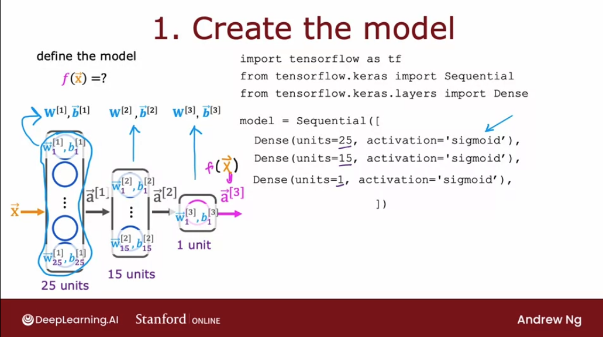

The code above specifies that there are 25 hidden units in the first hidden layer, then the 15 in the next one, and then one output unit and that we're using the sigmoid activation value. 

Based on this code snippet, we know also what are the parameters $$\mathbf{\vec{W}}$ and $\mathbf{\vec{b}}$, for each of the first, second and third layer. So this code snippet specifies the entire architecture of the neural network and therefore tells TensorFlow everything it needs in in order to compute the output $f(x)$ as a function of the input $x$ and the parameters, $\mathbf{\vec{W}^{[l]}}$ and $\mathbf{\vec{b}^{[l]}}$

Let's go on to step 2, where we have to **specify what is the loss function**. That will also **define the cost function** we use to train the neural network. 

For the handwritten digit classification problem where images are either of a zero or a one the most common loss function to use:

  $$L(f_{\mathbf{w},b}(\mathbf{x}^{(i)}), y^{(i)}) = (-y^{(i)} \log\left(f_{\mathbf{w},b}\left( \mathbf{x}^{(i)} \right) \right) - \left( 1 - y^{(i)}\right) \log \left( 1 - f_{\mathbf{w},b}\left( \mathbf{x}^{(i)} \right) \right)$$

where $y$ is the ground truth label, sometimes also called the target label $y$, and $f(x)$ is now the output of the neural network. 

**In TensorFlow, this is called the binary cross-entropy loss function.** 

```py
from tensorflow.keras.losses import BinaryCrossentropy
model.compile(loss=BinaryCrossentropy())
```

Having specified the loss with respect to a single training example, TensorFlow knows that it costs we want to minimize is then the average: taking the average over all $M$ training examples of the loss on all of the training examples. Optimizing this cost function will result in fitting the neural network to our binary classification data.

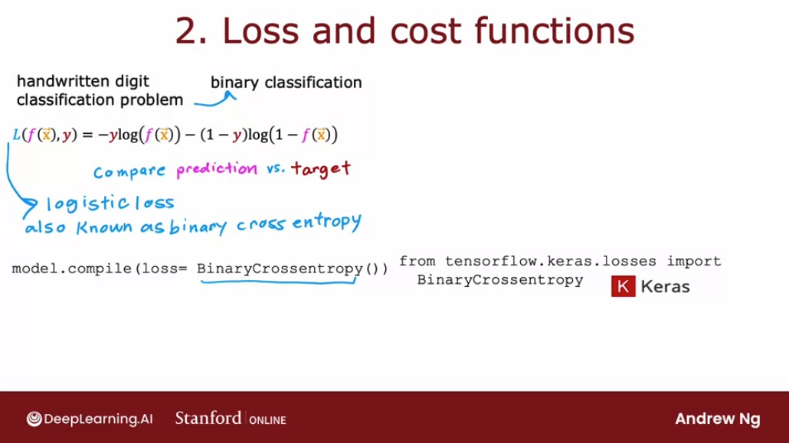

**In case we wanted to solve a regression problem rather than a classification problem, we can also tell TensorFlow to compile our model using a different loss function.**

For example, if we have a regression problem and if we want to minimize the squared error loss then we can use the more intuitively named **mean squared error loss function**. Then TensorFlow will try to m**inimize the mean squared error.** 

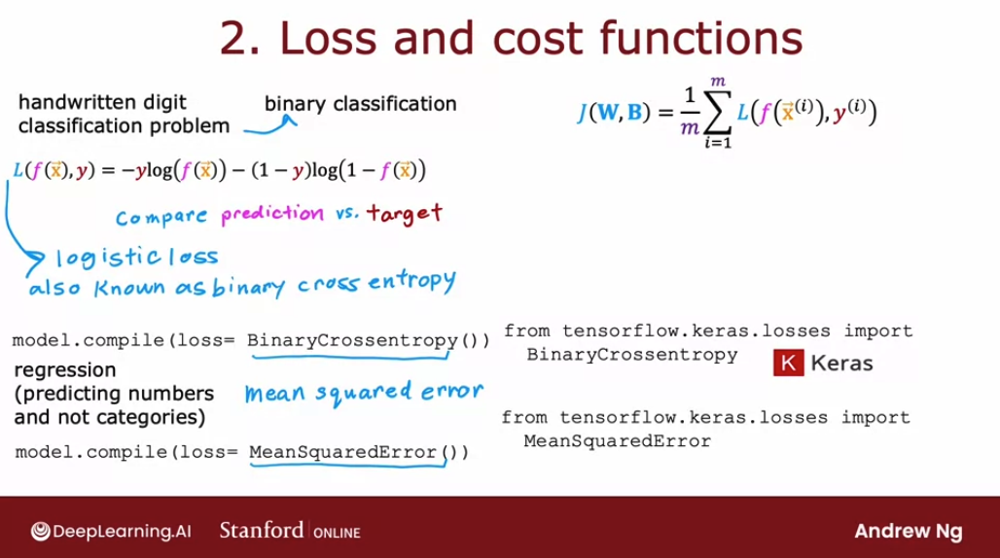

```py
from tensorflow.keras.losses import MeanSquaredError
model.compile(loss=MeanSquaredError())
```
--- 
The cost function $J(\mathbf{\vec{W}}, \mathbf{B})$ is a function of all the parameters in the entire neural network, in all layers. So $\mathbf{\vec{W}}$ includes $\mathbf{\vec{w}^{[1]}}$, $\mathbf{\vec{w}^{[2]}}$ and $\mathbf{\vec{w}^{[3]}}$. And the same for $\mathbf{\vec{B}}$

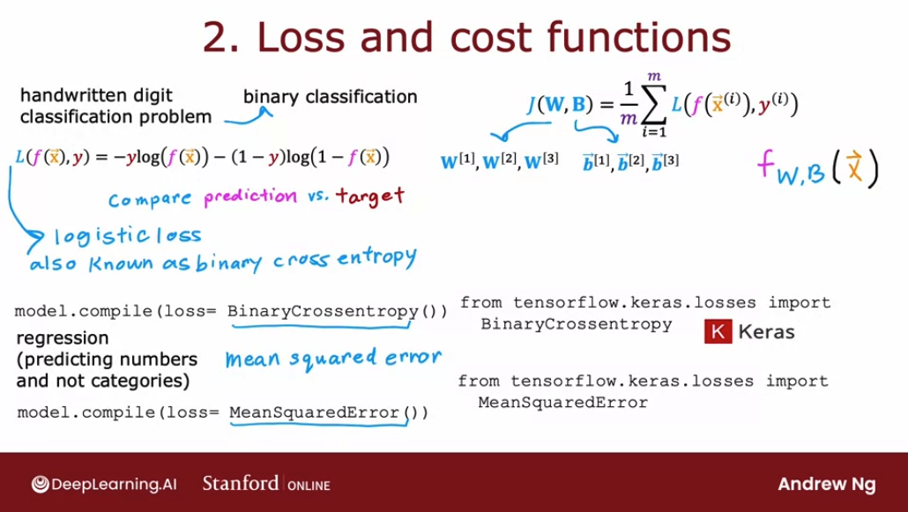

Finally, **the third step, we will ask TensorFlow to minimize the cost function**.

If we're using gradient descent to train the parameters of a neural network, then we are repeatedly, for every layer $l$ and for every unit $j$, updating $w_j^{[l]}$ and $b_j^{[l]}$ according to the formula of gradient descent: 


$w_j^{[l]} = w_j^{[l]} - α \frac{∂}{∂} J(\vec{w}, b)$

$b_j^{[l]} = b_j^{[l]} - α \frac{∂}{∂b} J(\vec{w}, b)$

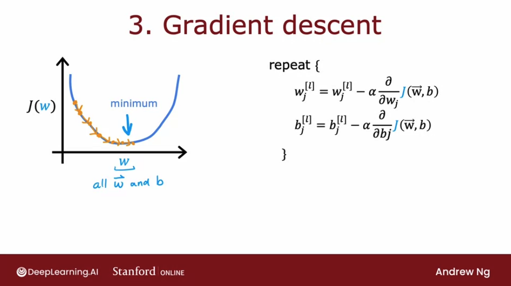

After doing, say, 100 iterations of gradient descent, hopefully, we get to a good value of the parameters. 

**In order to use gradient descent, the key thing we need to compute is the partial derivative terms. What TensorFlow does, and, in fact, what is standard in neural network training, is to use an algorithm called backpropagation in order to compute these partial derivative terms.**

But TensorFlow does all of these things for us. It implements backpropagation all within the function called `fit`. All we have to do is call `model.fit()` with our training set, input `x` and labels `y` and assign a number of epochs:

```py
model.fit(X, y, epochs=100)
```
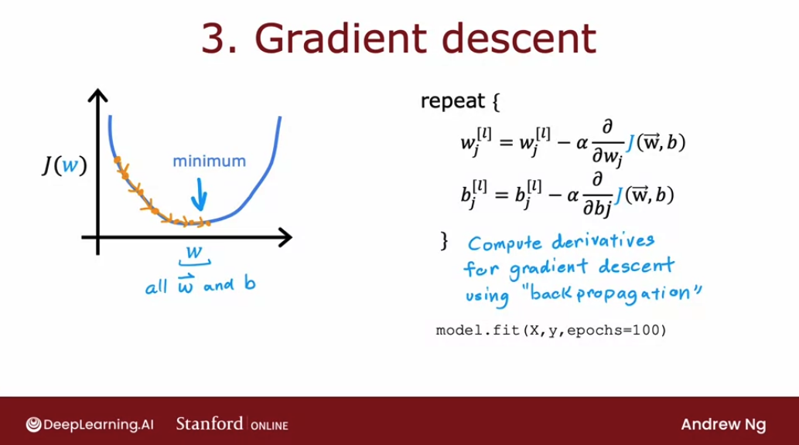

In fact, we'll later is that **TensorFlow can use an algorithm that is even a little bit faster than gradient descent**.