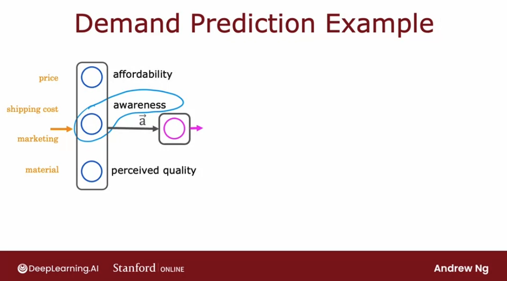
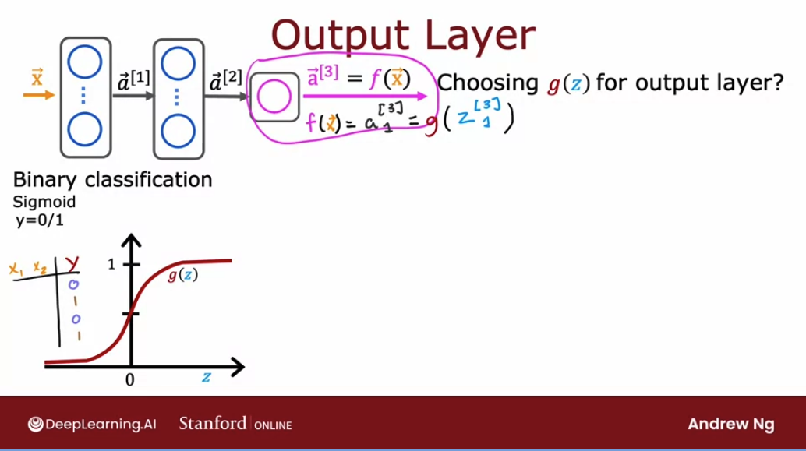
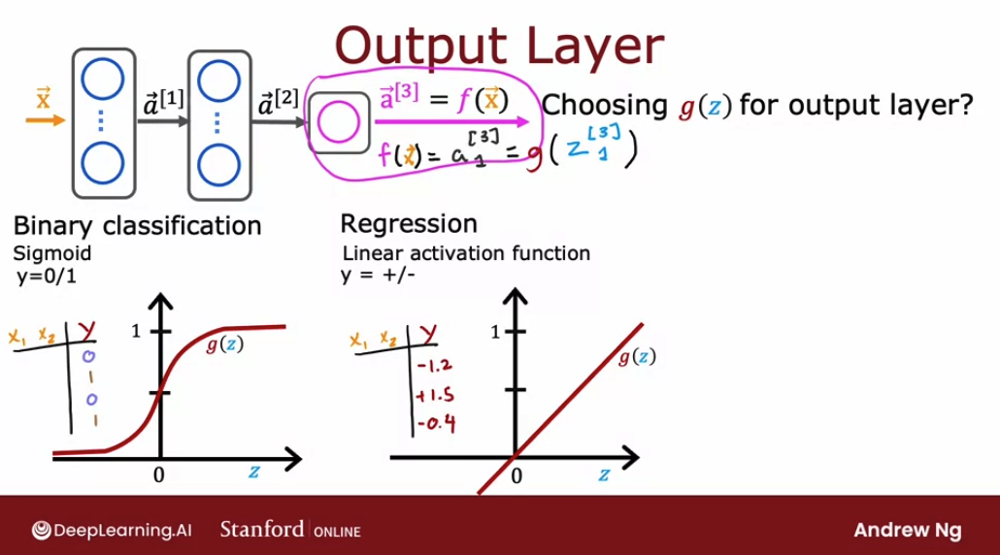
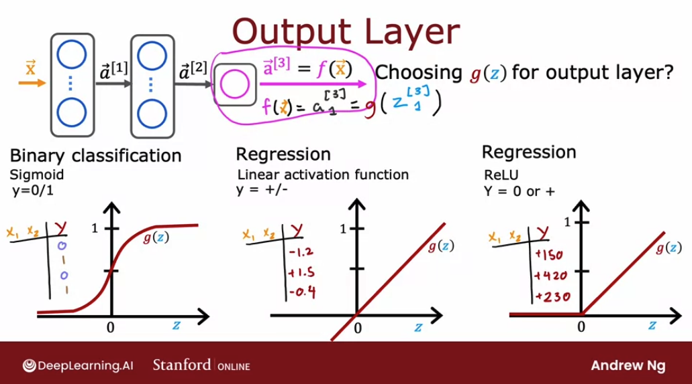
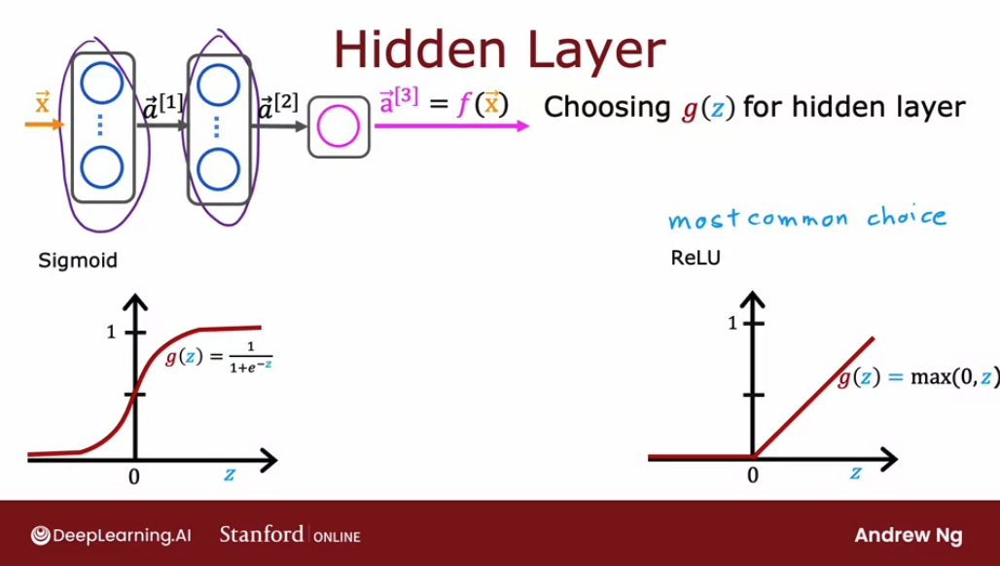
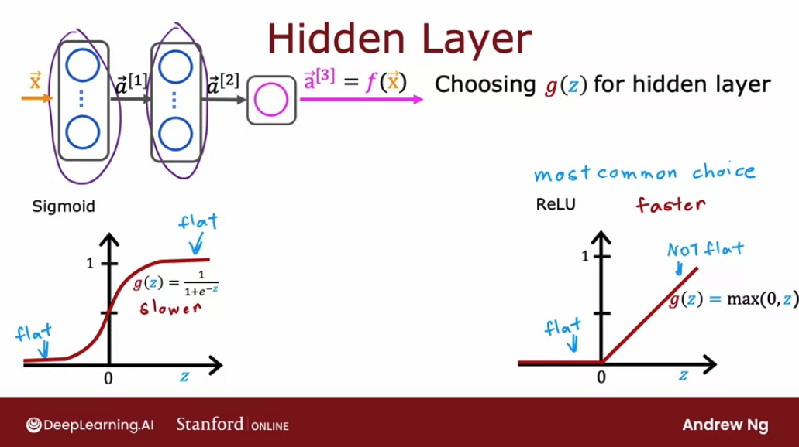
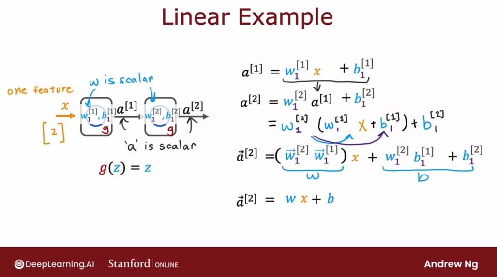
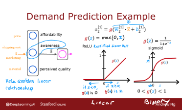
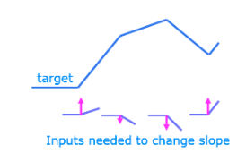

# Activation functions

## Alternatives to the sigmoid activation

So far, we've been using the sigmoid activation function in all the nodes in the hidden layers and in the output layer. And we have started that way because we were building up neural networks by taking logistic regression and creating logistic regression units and stringing them together. 

But **if we use other activation functions, our neural network can become much more powerful.** Let's take a look at how to do that. 

Recall the demand prediction example from last week where, given price, shipping cost, marketing, material, we would try to predict if something would be affordable, if there's good awareness and if there's high perceived quality. And based on those three we would try to predict it was a top seller. 



But this **assumes that awareness is binary:** people are aware or they are not. But the degree to which possible buyers are aware of the T-shirt we're selling may not be binary: they can be a little bit aware, somewhat aware, extremely aware or it could have gone completely viral. 

So rather than modeling awareness as a binary number `0` or `1` or a probability between `0` and `1`, **awareness could be any non negative number because there can be any non negative value of awareness going from 0 up to large numbers**.


So instead of using the sigmoid function that we used for the activation, as seen above, if we want to allow $a_2^{[1]}$ and $a_1^{[2]}$ to potentially take on much larger positive values, **we can instead swap in a different activation function.** 

A very common choice of activation function in neural networks is **ReLU**, rectified linear unit:


It's formula is:

$$ g(z) = max(0, z) $$

and notice that:

- if $z \le 0$, then $g(z) = 0$
- if $z \gt 0$, then $g(z) = z$


More generally we have a choice of what to use for $g(z)$ and sometimes we'll use a different choice than the sigmoid activation function. 

Here are the most commonly used activation functions:


There's one other activation function which is worth mentioning, which is called the **linear activation function**, which is just: 

$$g(z) = z$$ 

Sometimes if we use the linear activation function, people will say we're not using any activation function because if:
$$ a = g(z) = \vec{w} \cdot \vec{x} + b = z$$
it's as if there was no g in there at all. 

Later  we'll touch on the fourth one called the softmax activation function.. 

## Choosing activation functions

Let's take a look at how we can choose the activation function for different neurons in our neural network. 

### For the output layer

Depending on what the target label or the ground truth label $y$ is, there will be one fairly natural choice for the activation function for it:

- if we are working on a **classification problem** where $y$ is either **zero** or **one**, so a **binary classification** problem, then the _**sigmoid activation function will almost always be the most natural choice**_.

This is beecause then the neural network learns to predict the probability that $y$ is equal to one, just like for logistic regression.



- if we're solving a **regression problem**, then have at least two alternatives. 
  - if we are trying to predict numbers that can be positive or negative:

For example, we are trying to predict how tomorrow's stock price will change compared to today's stock price. Stock price can go up or down, and so in this case **$y$ would be a number that can be either positive or negative**. So the best recommendation here is to use the **linear activation function.** So if $y$ can be positive or negative, use a linear activation function. 




  - if y can only take on non-negative values:
  
For example, if we're predicting the price of a house, that price can never be negative. In that case, the most natural choice will be the **ReLU activation function** because this activation function only takes on non-negative values, either zero or positive values.



### For hidden layers

The **ReLU activation function** is by far the most common choice in how neural networks are trained by many practitioners today. Even though we had initially described neural networks using the sigmoid activation function, and in fact, in the early history of the development of neural networks people used sigmoid activation functions, the field has evolved to use ReLU much more often and sigmoids hardly ever. 

(With the exception that we do use a sigmoid activation function in the output layer if we have a binary classification problem.)



### Why has ReLU become so dominant?

First, if we compare the ReLU and the sigmoid activation functions, the **ReLU is a bit faster to compute** because it just requires computing $max(0, z)$, whereas the sigmoid is a little bit more complicated and expensive math.

But the second reason which turns out to be even more important is that the **ReLU function goes flat only in one part of the graph**; below $0$ it becomes completely flat, whereas the sigmoid activation function goes flat in two places, to the left and to the right of the graph.



And the problem with that is that, **if we're using gradient descent to train a neural network, then when we have a function that is flat in a lot of places, gradient descents would be really slow.**

It is true that gradient descent optimizes the cost function $J(W,B)$ rather than the activation function, but the activation function is a piece of what goes into computing, and that results in more places in the cost function $J(W,B)$ that are flat as well and therefore with a small gradient, which slows down learning.


Researchers have found that using the ReLU activation function can cause our neural network to learn faster as well, which is why for most practitioners if we're trying to decide what activation functions to use with hidden layer, the ReLU activation function has become now **by far the most common choice.** 

To summarize:

- **for output layer**: choose depending on problem
- **for hidden layers**: use ReLU


If we look at the research literature, we sometimes hear of authors using even other activation functions, such as the $tanh$ activation function or the **Leaky ReLU** activation function or the **Swish** activation function.

## Why do we need activation functions? 

Let's take a look at why neural networks need activation functions and why they just don't work if we were to use the linear activation function in every neuron in the neural network.

Recall the T-Shirt demand prediction example. What would happen if we were to use a linear activation function for all of the nodes in this neural network? 

In this case big neural network would become no different than just linear regression. So this would defeat the entire purpose of using a neural network because it would then just not be able to fit anything more complex than the linear regression model:


Let's look at a simpler example of a neural network: the the input $x$ is just a number, and two hidden layer, each with their parameters $w$ and $b$. Then an output $a_2$, a scalar which is the output of the neural network $f(x)$. 

Let's see what this neural network would do if we were to use the linear activation function $g(z) = z$:



So we have shown is that $a_2$ is equal to $ \vec{w} \cdot \vec{x} + b$. So basically, $a_2$ is just a linear function of the input $x$. **Rather than using a neural network with one hidden layer and one output layer, we might as well have just used a linear regression model.**

If we're familiar with linear algebra, this result comes from the fact that a linear function of a linear function is itself a linear function. This is why having multiple layers in a neural network doesn't let the neural network compute any more complex features or learn anything more complex than just a linear function. 

In the general case, if we had a neural network with multiple layers we were to use a linear activation function for all of the hidden layers and also use a linear activation function for the output layer, then it turns out this model will compute **an output that is completely equivalent to linear regression.**


Or alternatively, if we were to still use a linear activation function for all the hidden layers, for these three hidden layers here, but **we were to use a logistic activation function for the output layer**, then it turns out we can show that this model **becomes equivalent to logistic regression**:


That's why **a common rule of thumb is not to use the linear activation function in the hidden layers of the neural network, and instead using the ReLU activation function**.

## Lab: ReLU Activation

[LINK](https://www.coursera.org/learn/advanced-learning-algorithms/ungradedLab/9QvUK/relu-activation/lab?path=%2Fnotebooks%2FC2_W2_Relu.ipynb)

[Internal Link](./labs/Week%202/C2_W2_Relu.ipynb)

```py
import numpy as np
import matplotlib.pyplot as plt
from matplotlib.gridspec import GridSpec
plt.style.use('./deeplearning.mplstyle')
import tensorflow as tf
from tensorflow.keras.models import Sequential
from tensorflow.keras.layers import Dense, LeakyReLU
from tensorflow.keras.activations import linear, relu, sigmoid
%matplotlib widget
from matplotlib.widgets import Slider
from lab_utils_common import dlc
from autils import plt_act_trio
from lab_utils_relu import *
import warnings
warnings.simplefilter(action='ignore', category=UserWarning)

```

This week, a new activation was introduced, the Rectified Linear Unit (ReLU). 

$$ a = max(0,z) \quad\quad\text{\# ReLU function} $$

```py
plt_act_trio()
```


The example from the lecture below shows an application of the ReLU. In this example, the derived "awareness" feature is not binary but has a continuous range of values. The sigmoid is best for on/off or binary situations. The ReLU provides a continuous linear relationship. Additionally it has an 'off' range where the output is zero.



The "off" feature makes the ReLU a Non-Linear activation. Why is this needed? Let's examine this below. 

### Why Non-Linear Activations?  



The function shown above is composed of linear pieces (piecewise linear). 

The slope is consistent during the linear portion and then changes abruptly at transition points. At transition points, a new linear function is added which, when added to the existing function, will produce the new slope. 

The new function is added at transition point but does not contribute to the output prior to that point. The non-linear activation function is responsible for disabling the input prior to and sometimes after the transition points. 

The following exercise provides a more tangible example.

The exercise will use the network below in a regression problem where you must model a piecewise linear target:


The network has 3 units in the first layer. Each is required to form the target. Unit 0 is pre-programmed and fixed to map the first segment. You will modify weights and biases in unit 1 and 2 to model the 2nd and 3rd segment. The output unit is also fixed and simply sums the outputs of the first layer.  

Using the sliders below, modify weights and bias to match the target. 
> Hints: Start with `w1` and `b1` and leave `w2` and `b2` zero until you match the 2nd segment. Clicking rather than sliding is quicker.  If you have trouble, don't worry, the text below will describe this in more detail.

My solution:


The goal of this exercise is to appreciate how the ReLU's non-linear behavior provides the needed ability to turn functions off until they are needed. Let's see how this worked in this example, with the correct solution:


The plots on the right contain the output of the units in the first layer.   

Starting at the top, unit 0 is responsible for the first segment marked with a 1. Both the linear function $z$ and the function following the ReLU $a$ are shown. You can see that the ReLU cuts off the function after the interval [0,1]. This is important as it prevents Unit 0 from interfering with the following segment. 

Unit 1 is responsible for the 2nd segment. Here the ReLU kept this unit quiet until after x is 1. Since the first unit is not contributing, the slope for unit 1, $w^{[1]}_1$, is just the slope of the target line. The bias must be adjusted to keep the output negative until x has reached 1. Note how the contribution of Unit 1 extends to the 3rd segment as well.

Unit 2 is responsible for the 3rd segment. The ReLU again zeros the output until x reaches the right value.The slope of the unit, $w^{[1]}_2$, must be set so that the sum of unit 1 and 2 have the desired slope. The bias is again adjusted to keep the output negative until x has reached 2. 

The "off" or disable feature  of the ReLU activation enables models to stitch together linear segments to model complex non-linear functions.
