# Multiclass Classification

## Multiclass

**Multiclass classification** are classification problems **where we can have more than just two possible output labels**, so not just zero or 1. 

**Examples:**

1. For the handwritten digit classification problems we've looked at so far, we were just trying to distinguish between the handwritten digits 0 and 1. But if we're trying to read protocols or zip codes in an envelope, well, there are actually 10 possible digits we might want to recognize. 

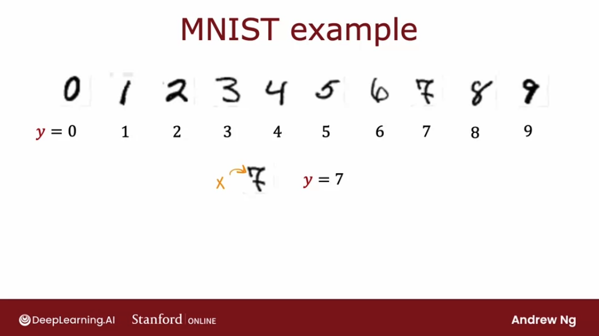

2. Alternatively in the first course we saw the example if we're trying to classify whether patients may have any of three or five different possible diseases. That too would be a multiclass classification problem.

3. Another example is visual defect inspection of parts manufacturer in the factory, where we might look at the picture of a pill that a pharmaceutical company has manufactured and try to figure out does it have a scratch effect or discoloration defects or a chip defect. And this would again be multiple classes of multiple different types of defects that we could classify this pill is having. 

So a **multiclass classification problem is still a classification problem**:
- its target $y$ we be a small number of discrete categories
- it still cannot be **any number** but it can take on more than just two possible values. 

So whereas previously for binary classification, we may have had a data set  with features $x_1$ and $x_2$. In that case,logistic regression would fit model to estimate what the probability of $y$ being $1$, given the features $x$ and $y$ would be $0$ or $1$.

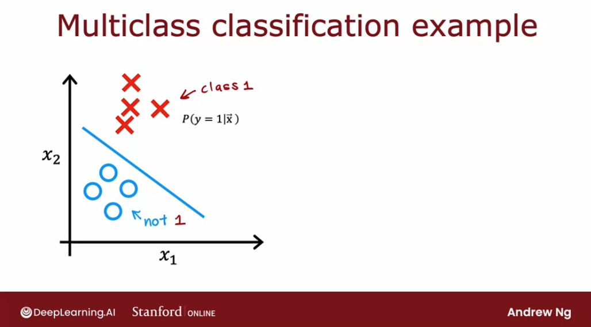

With multiclass classification problems, we would instead have a data set were we have four classes where the zeroes represents one class, the crosses represent another class, the triangles represent the third class and the squares represent the fourth class:

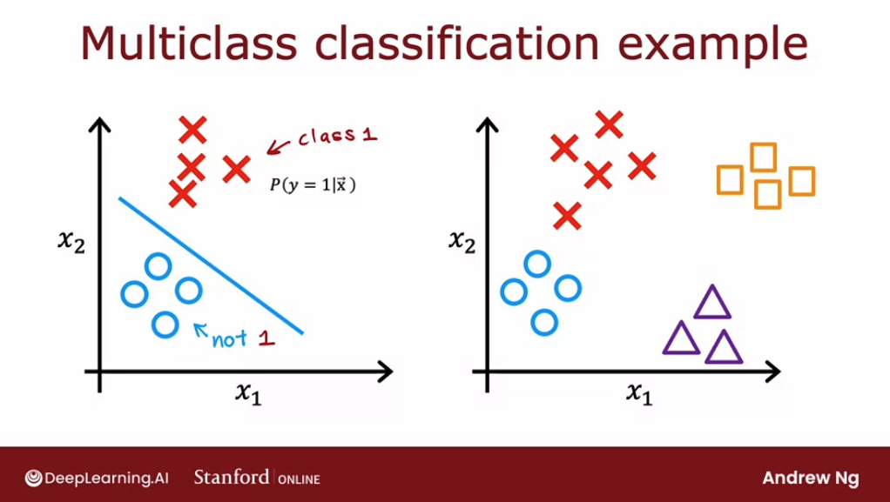

And instead of just estimating the chance of $y$ being equal to $1$, now want to estimate what's the chance that $y$ is equal to `1`, `2`, `3` or `4`.

The algorithm we will see next can learn a decision boundary that divides the space $x1$ vs $x2$ next to into four categories rather than just two categories. 

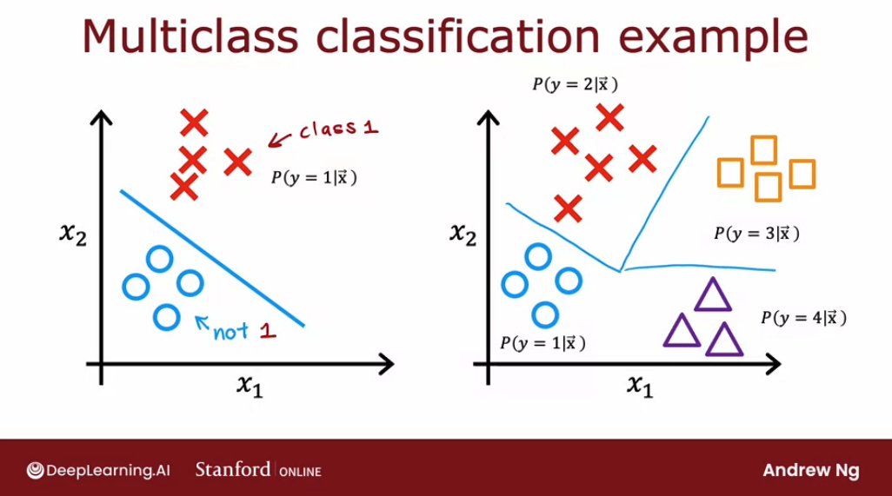

## Softmax

The **softmax regression algorithm is a generalization of logistic regression**, which is a binary classification algorithm to the multiclass classification contexts.

Recall that logistic regression applies when $y$ can take on two possible output values, either zero or one, and the way it computes this output is, we would first calculate $z = \mathbf{\vec{w}} \cdot \mathbf{\vec{x}} + b$, and then we would compute $a$, which equals $g(z)$, which is a sigmoid function applied to $z$. And we would interpret this as the logistic regression estimates of the probability of $y$ being equal to `1`` given those input features $x$.

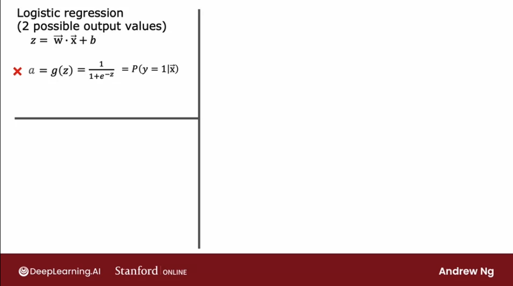

$$ a = g(z) = \frac{1}{1+e^{-z}} = P(y = 1 | \mathbf{\vec{x}}) $$

Now, quick quiz question: if the probability $P(y = 1 | \mathbf{\vec{x}}) = 0.71$, then what is the probability that $y$ is equal to zero? 

The chance of $y $ being the one, and the chances of $y$ being zero have got to add up to one, so there has to be a 29 percent or 0.29 chance of it being equal to zero:

$$P(y = 0 | \mathbf{\vec{x}}) = 0.29$$

To embellish logistic regression a little bit in order to set us up for the generalization to softmax regression, **we're going to think of logistic regression as actually computing two numbers**: 
1. **$a_1$** which is this quantity that we had previously of the chance of $y$ being equal to 1 given $x$, that is $P(y = 1 | \mathbf{\vec{x}})$ 
2. **$a_2$**, which is $a_2 = P(y = 0 | \mathbf{\vec{x}}) = 1 -  P(y = 1 | \mathbf{\vec{x}})$ this which is just the chance of y being equal to zero given the input features $x$.

So $a_1$ and $a_2$, of course, have to add up to 1.

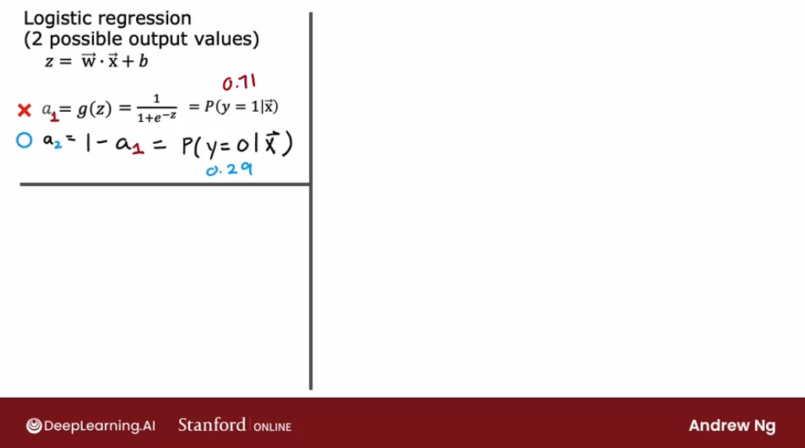

Let's now **generalize this to softmax regression**: we're going to do this with a concrete example of when $y$ can take on four possible outputs, the values 1, 2, 3 or 4. 

Here's what softmax regression does, it will compute $z$ for each class as before, using $z = \mathbf{\vec{w}} \cdot \mathbf{\vec{x}} + b$

$$
\begin{aligned}
  z_1 = \mathbf{\vec{w_1}} \cdot \mathbf{\vec{x_1}} + b_1 \space\space\space\space\space \text{Class 1} \\
  z_2 = \mathbf{\vec{w_2}} \cdot \mathbf{\vec{x_2}} + b_2 \space\space\space\space\space \text{Class 2} \\
  z_3 = \mathbf{\vec{w_3}} \cdot \mathbf{\vec{x_3}} + b_3 \space\space\space\space\space \text{Class 3} \\
  z_4 = \mathbf{\vec{w_4}} \cdot \mathbf{\vec{x_4}} + b_4 \space\space\space\space\space \text{Class 4} \\
\end{aligned}
$$

Here, $w_1$, $w_2$, $w_3$, $w_4$ as well as $b_1$, $b_2$, $b_3$, $b_4$ are the parameters of softmax regression. 

Next, using **the formula for softmax regression,** we'll compute $a$ for each class:

$$ 
\begin{aligned}
a_1 = \frac{e^{z_1}}{e^{z_1} + e^{z_2} + e^{z_3} + e^{z_4}} = P(y =1 | \mathbf{\vec{x}}) \\ \\
a_2 = \frac{e^{z_2}}{e^{z_1} + e^{z_2} + e^{z_3} + e^{z_4}} = P(y =2 | \mathbf{\vec{x}}) \\ \\
a_1 = \frac{e^{z_3}}{e^{z_1} + e^{z_2} + e^{z_3} + e^{z_4}} = P(y =3 | \mathbf{\vec{x}}) \\ \\
a_1 = \frac{e^{z_4}}{e^{z_1} + e^{z_2} + e^{z_3} + e^{z_4}} = P(y =4 | \mathbf{\vec{x}}) 
\end{aligned}
$$

Whereas before we wrote down the specification for the logistic regression model, these equations on the right are our specification for the softmax regression model. It has parameters $w_1$ through $w_4$, and $b_1$ through $b_4$, and if we can learn appropriate choices to all these parameters, then this gives we a way of predicting what's the chance of $y$ being 1, 2, 3 or 4, given a set of input features x. 

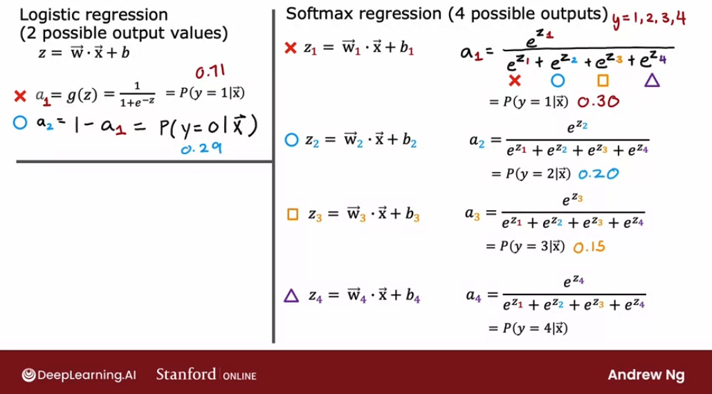

**Notice that all $a$ need to sum up to 1.**

$$ 
\begin{aligned}
a_1 + a_2 + a_3 + a_4 = 1 \\
0.30 + 0.2+ 0.15 + 0.35 = 1
\end{aligned}
$$
 
Let's now write down **the formula for the general case for softmax regression**. But first, let's understand that in the general case, $y$ can take on $n$ possible values, so $y$ can be 1, 2, 3, and so on up to $n$. 

So in that case, **softmax regression will compute to**:

$$z_j = \mathbf{\vec{w}}_j \cdot \mathbf{\vec{x}}_j + b$$

where now the parameters of softmax regression are $w_1$, $w_2$ through to $w_n$, as well as $b_1$, $b_2$ through $b_n$. 

And finally we'll compute $a_j$:

$$a_j = \frac{e^{z_j}}{\sum\limits_{k=1}^{N}{e^{z_k}}} = P(y = j| \mathbf{\vec{x})} $$

Notice here we're using another variable $k$ to index the summation because  $j$ refers to a specific fixed number like $j$ equals $2$. 

**$a_j$ is interpreted as the model's estimate that $y$ is equal to $j$ given the input features $x$.**

Notice that by construction that this formula, if we add up $a_1$, $a_1$ all the way through $a_n$, these numbers always will end up adding up to 1: $a_1 + a_2 + ... + a_n = 1$/

Also, if we apply softmax regression with $n$ equals 2, so there are only two possible output classes then softmax regression ends up computing basically the same thing as logistic regression. The parameters end up being a little bit different, but it ends up reducing to logistic regression model.

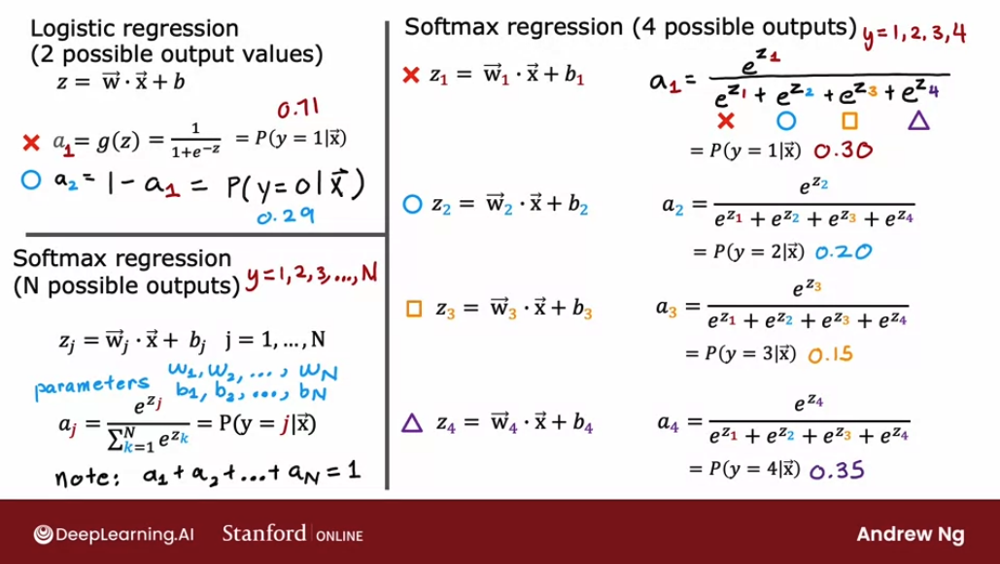

**Let's now take a look at how to specify the cost function for softmax regression**. But first, let's recall how to calculate the loss and the cost function for logistic regression:

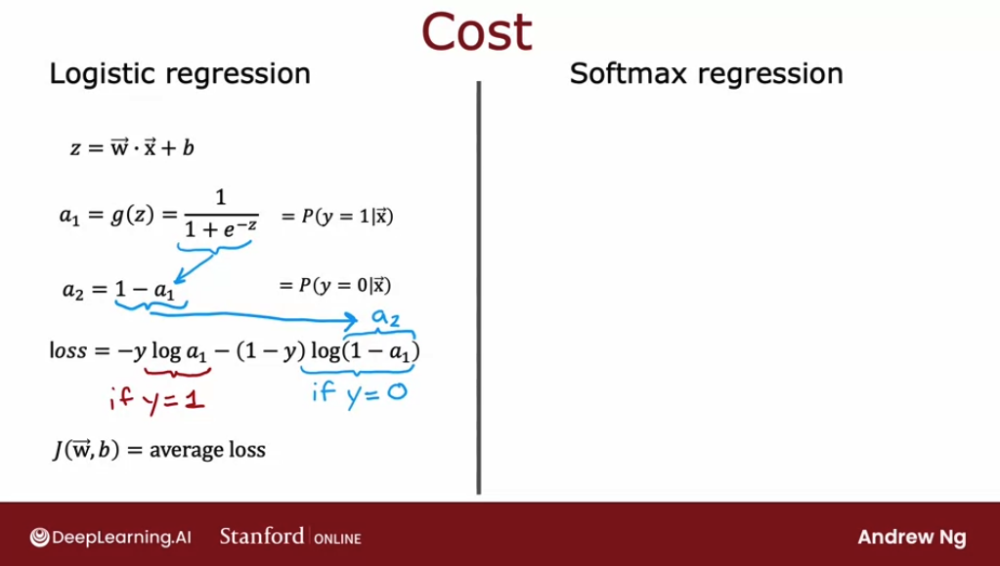

Now, **let's see the cost function that is conventionally use the softmax regression**. First, recall that these are the equations we use for softmax regression:

$$
\begin{align*}
a_1 &= \frac{e^{z_1}}{e^{z_1} + e^{z_2} + e^{z_3} + e^{z_4}} = P(y = 1 | \mathbf{\vec{x}}) \\
\vdots \\
a_N &= \frac{e^{z_N}}{e^{z_1} + e^{z_2} + ... + e^{z_N}} = P(y = N | \mathbf{\vec{x}})
\end{align*}
$$

The loss that we're going to use for softmax regression is

$$
\text{loss}(a_1, ... , a_N , y) =
\begin{cases}
    -\log{a_1} \space \space \space  \text{if} \space\space y = 1\\
    -\log{a_2} \space \space \space  \text{if} \space\space y = 2\\
    \space\space\space\space\space\space\space\space\space\space\space \vdots \\
    -\log{a_N} \space \space \space  \text{if} \space\space y = N\\
\end{cases}
$$

So basically, if $y = 1$, the loss is $-\log{a_1}$. And the same for all other values of $N$.

To illustrate what this is doing, if $y$ is equal to $$, then the loss is $-\log{a_j}$. This what this function looks like:

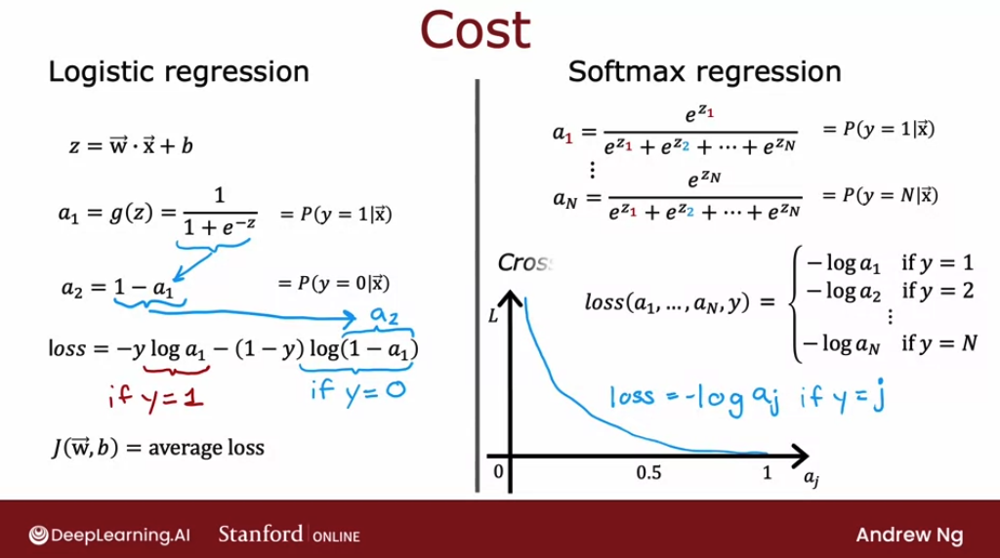

$-\log{a_j}$ is a curve where, if ${a_j}$ was very close to 1, the loss will be very small. But if it thought, say, ${a_j}$ had only a 50% chance then the loss gets a little bit bigger. And **the smaller ${a_j}$ is, the bigger the loss.** 

This incentivizes the algorithm to make ${a_j}$ as large as possible, as close to 1 as possible. Because whatever the actual value $y$ was, we want the algorithm to say hopefully that the chance of $y$ being that value was pretty large.

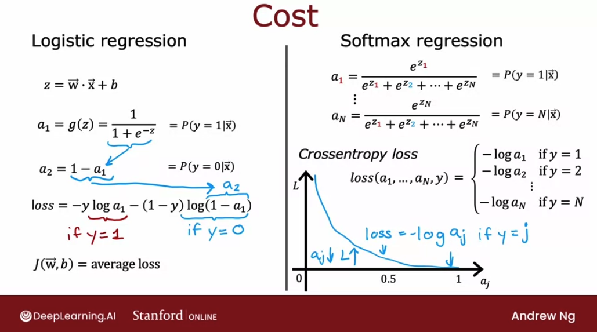

Notice that in this loss function, **$y$ in each training example can take on only one value**. We end up computing this $-\log{a_j}$ only for one value of ${a_j}$, which is whatever was the actual value of $y$ equals $j$ in that particular training example. For example, if $y$ was equal to 2, we end up computing $-\log{a_2}$, but not any of the other terms.

## Neural Network with Softmax output

In order to build a Neural Network that can carry out multi class classification, we're going to take the Softmax regression model and put it into essentially the output layer of a Neural Network. Let's take a look at how to do that. 

Previously, when we were doing handwritten digit recognition with just two classes. We use a new Neural Network with this architecture. If we now want to do handwritten digit classification with 10 classes, all the digits from zero to nine, then we're going to change this Neural Network to have 10 output units like so. 

And this new output layer will be a Softmax output layer. So sometimes we'll say this Neural Network has a Softmax output or that this upper layer is a Softmax layer. And the way forward propagation works in this Neural Network is given an input X A1 gets computed exactly the same as before. 

And then A2, the activations for the second hidden layer also get computed exactly the same as before. And we now have to compute the activations for this output layer, that is a3. This is how it works. 

If we have 10 output classes, we will compute Z1, Z2 through Z10 using these expressions. So this is actually very similar to what we had previously for the formula we're using to compute Z. Z1 is W1.product with a2, the activations from the previous layer plus b1 and so on for Z1 through Z10. 

Then a1 is equal to e to the Z1 divided by e to the Z1 plus up to e to the Z10. And that's our estimate of the chance that y is equal to 1. And similarly for a2 and similarly all the way up to a10. 

And so this gives we our estimates of the chance of y being good to one, two and so on up through the 10th possible label for y. And just for completeness, if we want to indicate that these are the quantities associated with layer three, technically, I should add these super strip three's there. It does make the notation a little bit more cluttered. 

But this makes explicit that this is, for example, the Z(3), 1 value and this is the parameters associated with the first unit of layer three of this Neural Network. And with this, our Softmax open layer now gives we estimates of the chance of y being any of these 10 possible output labels. I do want to mention that the Softmax layer will sometimes also called the Softmax activation function, it is a little bit unusual in one respect compared to the other activation functions we've seen so far, like sigma, radial and linear, which is that when we're looking at sigmoid or value or linear activation functions, a1 was a function of Z1 and a2 was a function of Z2 and only Z2. 

In other words, to obtain the activation values, we could apply the activation function g be it sigmoid or rarely or something else element wise to Z1 and Z2 and so on to get a1 and a2 and a3 and a4. But with the Softmax activation function, notice that a1 is a function of Z1 and Z2 and Z3 all the way up to Z10. So each of these activation values, it depends on all of the values of Z. 

And this is a property that's a bit unique to the Softmax output or the Softmax activation funct tion or stated differently if we want to compute a1 through a10,hat is a function of Z1 all the way up to Z 10 simultaneously. And this is unlike the other activation functions we've seen so far. Finally, let's look at how we would implement this in tensorflow. 

If we want to implement the neural network that I've shown here on this slide, this is the code to do so. Similar as before there are three steps to specifying and training the model. The first step is to tell tensorflow to sequentially string together three layers. 

First layer, is this 25 units with rail we activation function. Second layer, 15 units of rally activation function. And then the third layer, because there are now 10 output units, we want to output a1 through a10, so they're now 10 output units. 

And we'll tell tensorflow to use the Softmax activation function. And the cost function that we saw in the last video, tensorflow calls that the SparseCategoricalCrossentropy function. So I know this name is a bit of a mouthful, whereas for logistic regression we had the BinaryCrossentropy function, here we're using the SparseCategoricalCrossentropy function. 

And what sparse categorical refers to is that we're still classified y into categories. So it's categorical. This takes on values from 1 to 10. 

And sparse refers to that y can only take on one of these 10 values. So each image is either 0 or 1 or 2 or so on up to 9. we're not going to see a picture that is simultaneously the number two and the number seven so sparse refers to that each digit is only one of these categories. 

But so that's why the loss function that we saw in the last video, it's called intensive though the sparse categorical cross entropy loss function. And then the code for training the model is just the same as before. And if we use this code, we can train a neural network on a multi class classification problem. 

Just one important note, if we use this code exactly as I've written here, it will work, but don't actually use this code because it turns out that in tensorflow, there's a better version of the code that makes tensorflow work better. So even though the code shown in this slide works. Don't use this code the way I've written it here, because in a later video this week we see a different version that's actually the recommended version of implementing this, that will work better. 

But we'll take a look at that in a later video. So now, we know how to train a neural network with a softmax output layer with one caveal. There's a different version of the code that will make tensorflow able to compute these probabilities much more accurately. 

Let's take a look at that in the next video, we should also show we the actual code that I recommend we use if we're training a Softmax neural network. Let's go on to the next video. ## Improved implementation of softmax

The implementation that we saw in the last video of a neural network with a softmax layer will work okay. 

But there's an even better way to implement it. Let's take a look at what can go wrong with that implementation and also how to make it better. Let me show we two different ways of computing the same quantity in a computer. 

Option 1, we can set x equals to 2/10,000. Option 2, we can set x equals 1 plus 1/10,000 minus 1 minus 1/10,000, which we first compute this, and then compute this, and we take the difference. If we simplify this expression, this turns out to be equal to 2/10,000. 

Let me illustrate this in this notebook. First, let's set x equals 2/10,000 and print the result to a lot of decimal points of accuracy. That looks pretty good. 

Second, let me set x equals, we're going to insist on computing 1/1 plus 10,000 and then subtract from that 1 minus 1/10,000. Let's print that out. It just looks a little bit off this as if there's some round-off error. 

Because the computer has only a finite amount of memory to store each number, called a floating-point number in this case, depending on how we decide to compute the value 2/10,000, the result can have more or less numerical round-off error. It turns out that while the way we have been computing the cost function for softmax is correct, there's a different way of formulating it that reduces these numerical round-off errors, leading to more accurate computations within TensorFlow. Let me first explain this a little bit more detail using logistic regression. 

Then we will show how these ideas apply to improving our implementation of softmax. First, let me illustrate these ideas using logistic regression. Then we'll move on to show how to improve our implementation of softmax as well. 

Recall that for logistic regression, if we want to compute the loss function for a given example, we would first compute this output activation a, which is g of z or 1/1 plus e to the negative z. Then we will compute the loss using this expression over here. In fact, this is what the codes would look like for a logistic output layer with this binary cross entropy loss. 

For logistic regression, this works okay, and usually the numerical round-off errors aren't that bad. But it turns out that if we allow TensorFlow to not have to compute a as an intermediate term. But instead, if we tell TensorFlow that the loss this expression down here. 

All I've done is I've taken a and expanded it into this expression down here. Then TensorFlow can rearrange terms in this expression and come up with a more numerically accurate way to compute this loss function. Whereas the original procedure was like insisting on computing as an intermediate value, 1 plus 1/10,000 and another intermediate value, 1 minus 1/10,000, then manipulating these two to get 2/10,000. 

This partial implementation was insisting on explicitly computing a as an intermediate quantity. But instead, by specifying this expression at the bottom directly as the loss function, it gives TensorFlow more flexibility in terms of how to compute this and whether or not it wants to compute a explicitly. The code we can use to do this is shown here and what this does is it sets the output layer to just use a linear activation function and it puts both the activation function, 1/1 plus to the negative z, as well as this cross entropy loss into the specification of the loss function over here. 

That's what this from logits equals true argument causes TensorFlow to do. In case we're wondering what the logits are, it's basically this number z. TensorFlow will compute z as an intermediate value, but it can rearrange terms to make this become computed more accurately. 

One downside of this code is it becomes a little bit less legible. But this causes TensorFlow to have a little bit less numerical roundoff error. Now in the case of logistic regression, either of these implementations actually works okay, but the numerical roundoff errors can get worse when it comes to softmax. 

Now let's take this idea and apply to softmax regression. Recall what we saw in the last video was we compute the activations as follows. The activations is g of $z_1$, through $z_10$ where $a_1$, for example, is e to the $z_1$ divided by the sum of the e to the $z_j$'s, and then the loss was this depending on what is the actual value of y is negative log of aj for one of the aj's and so this was the code that we had to do this computation in two separate steps. 

But once again, if we instead specify that the loss is if y is equal to 1 is negative log of this formula, and so on. If y is equal to 10 is this formula, then this gives TensorFlow the ability to rearrange terms and compute this integral numerically accurate way. Just to give we some intuition for why TensorFlow might want to do this, it turns out if one of the z's really small than e to negative small number becomes very, very small or if one of the z's is a very large number, then e to the z can become a very large number and by rearranging terms, TensorFlow can avoid some of these very small or very large numbers and therefore come up with more actress computation for the loss function. 

The code for doing this is shown here in the output layer, we're now just using a linear activation function so the output layer just computes $z_1$ through $z_10$ and this whole computation of the loss is then captured in the loss function over here, where again we have the $from_logists$ equals true parameter. Once again, these two pieces of code do pretty much the same thing, except that the version that is recommended is more numerically accurate, although unfortunately, it is a little bit harder to read as well. If we're reading someone else's code and we see this and we're wondering what's going on is actually equivalent to the original implementation, at least in concept, except that is more numerically accurate. 

The numerical roundoff errors $for_logist$ regression aren't that bad, but it is recommended that we use this implementation down to the bottom instead, and conceptually, this code does the same thing as the first version that we had previously, except that it is a little bit more numerically accurate. Although the downside is maybe just a little bit harder to interpret as well. Now there's just one more detail, which is that we've now changed the neural network to use a linear activation function rather than a softmax activation function. 

The neural network's final layer no longer outputs these probabilities $A_1$ through $A_10$. It is instead of putting $z_1$ through $z_10$. I didn't talk about it in the case of logistic regression, but if we were combining the output's logistic function with the loss function, then for logistic regressions, we also have to change the code this way to take the output value and map it through the logistic function in order to actually get the probability. 

we now know how to do multi-class classification with a softmax output layer and also how to do it in a numerically stable way. Before wrapping up multi-class classification, I want to share with we one other type of classification problem called a multi-label classification problem. Let's talk about that in the next video. 

## Classification with multiple outputs

we've learned about multi-class classification, where the output label Y can be any one of two or potentially many more than two possible categories. There's a different type of classification problem called a multi-label classification problem, which is where associate of each image, they could be multiple labels. Let me show we what I mean by that. 

If we're building a self-driving car or maybe a driver assistance system, then given a picture of what's in front of our car, we may want to ask a question like, is there a car or at least one car? Or is there a bus, or is there a pedestrian or are there any pedestrians? In this case, there is a car, there is no bus, and there is at least one pedestrian or in this second image, no cars, no buses and yes to pedestrians and yes car, yes bus and no pedestrians. 

These are examples of multi-label classification problems because associated with a single input, image X are three different labels corresponding to whether or not there are any cars, buses, or pedestrians in the image. In this case, the target of the Y is actually a vector of three numbers, and this is as distinct from multi-class classification, where for, say handwritten digit classification, Y was just a single number, even if that number could take on 10 different possible values. How do we build a neural network for multi-label classification? 

One way to go about it is to just treat this as three completely separate machine learning problems. we could build one neural network to decide, are there any cars? The second one to detect buses and the third one to detect pedestrians. 

That's actually not an unreasonable approach. Here's the first neural network to detect cars, second one to detect buses, third one to detect pedestrians. But there's another way to do this, which is to train a single neural network to simultaneously detect all three of cars, buses, and pedestrians, which is, if our neural network architecture, looks like this, there's input X. 

First hidden layer offers a^1, second hidden layer offers a^2, and then the final output layer, in this case, we'll have three output neurals and we'll output a^3, which is going to be a vector of three numbers. Because we're solving three binary classification problems, so is there a car? Is there a bus? 

Is there a pedestrian? we can use a sigmoid activation function for each of these three nodes in the output layer, and so a^3 in this case will be $a_1$^3, $a_2$^3, and $a_3$^3, corresponding to whether or not the learning [inaudible] as a car and no bus, and no pedestrians in the image. Multi-class classification and multi-label classification are sometimes confused with each other, and that's why in this video I want to share with we just a definition of multi-label classification problems as well, so that depending on our application, we could choose the right one for the job we want to do. 

So that's it for multi-label classification. I find that sometimes multi-class classification and multi-label classification are confused with other, which is why I wanted to expressively, in this video, share with we what is multi-label classification, so that depending on our application we can choose to write to for the job that we want to do. And that wraps up the section on multi-class and multi-label classification. 

In the next video, we'll start to look at some more advanced neural network concepts, including an optimization algorithm that is even better than gradient descent. Let's take a look at that algorithm in the next video, because it'll help we to get our learning algorithms to learn much faster. Let's go on to the next video. 

