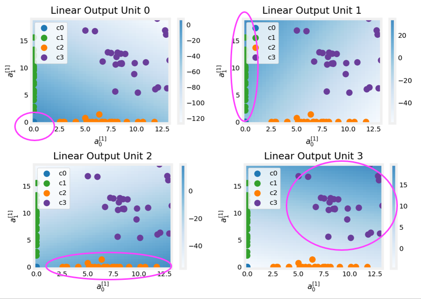

# Multiclass Classification

## Multiclass

**Multiclass classification** are classification problems **where we can have more than just two possible output labels**, so not just zero or 1. 

**Examples:**

1. For the handwritten digit classification problems we've looked at so far, we were just trying to distinguish between the handwritten digits 0 and 1. But if we're trying to read protocols or zip codes in an envelope, well, there are actually 10 possible digits we might want to recognize. 


2. Alternatively in the first course we saw the example if we're trying to classify whether patients may have any of three or five different possible diseases. That too would be a multiclass classification problem.

3. Another example is visual defect inspection of parts manufacturer in the factory, where we might look at the picture of a pill that a pharmaceutical company has manufactured and try to figure out does it have a scratch effect or discoloration defects or a chip defect. And this would again be multiple classes of multiple different types of defects that we could classify this pill is having. 

So a **multiclass classification problem is still a classification problem**:
- its target $y$ we be a small number of discrete categories
- it still cannot be **any number** but it can take on more than just two possible values. 

So whereas previously for binary classification, we may have had a data set  with features $x_1$ and $x_2$. In that case,logistic regression would fit model to estimate what the probability of $y$ being $1$, given the features $x$ and $y$ would be $0$ or $1$.


With multiclass classification problems, we would instead have a data set were we have four classes where the zeroes represents one class, the crosses represent another class, the triangles represent the third class and the squares represent the fourth class:


And instead of just estimating the chance of $y$ being equal to $1$, now want to estimate what's the chance that $y$ is equal to `1`, `2`, `3` or `4`.


The algorithm we will see next can learn a decision boundary that divides the space $x1$ vs $x2$ next to into four categories rather than just two categories. 


## Softmax

The **softmax regression algorithm is a generalization of logistic regression**, which is a binary classification algorithm to the multiclass classification contexts.

Recall that logistic regression applies when $y$ can take on two possible output values, either zero or one, and the way it computes this output is, we would first calculate $z = \mathbf{\vec{w}} \cdot \mathbf{\vec{x}} + b$, and then we would compute $a$, which equals $g(z)$, which is a sigmoid function applied to $z$. And we would interpret this as the logistic regression estimates of the probability of $y$ being equal to `1`` given those input features $x$.


$$ a = g(z) = \frac{1}{1+e^{-z}} = P(y = 1 | \mathbf{\vec{x}}) $$


Now, quick quiz question: if the probability $P(y = 1 | \mathbf{\vec{x}}) = 0.71$, then what is the probability that $y$ is equal to zero? 

The chance of $y $ being the one, and the chances of $y$ being zero have got to add up to one, so there has to be a 29 percent or 0.29 chance of it being equal to zero:

$$P(y = 0 | \mathbf{\vec{x}}) = 0.29$$


To embellish logistic regression a little bit in order to set us up for the generalization to softmax regression, **we're going to think of logistic regression as actually computing two numbers**: 
1. **$a_1$** which is this quantity that we had previously of the chance of $y$ being equal to 1 given $x$, that is $P(y = 1 | \mathbf{\vec{x}})$ 
2. **$a_2$**, which is $a_2 = P(y = 0 | \mathbf{\vec{x}}) = 1 -  P(y = 1 | \mathbf{\vec{x}})$ this which is just the chance of y being equal to zero given the input features $x$.

So $a_1$ and $a_2$, of course, have to add up to 1.


Let's now **generalize this to softmax regression**: we're going to do this with a concrete example of when $y$ can take on four possible outputs, the values 1, 2, 3 or 4. 

Here's what softmax regression does, it will compute $z$ for each class as before, using $z = \mathbf{\vec{w}} \cdot \mathbf{\vec{x}} + b$

$$
\begin{aligned}
  z_1 = \mathbf{\vec{w_1}} \cdot \mathbf{\vec{x_1}} + b_1 \space\space\space\space\space \text{Class 1} \\
  z_2 = \mathbf{\vec{w_2}} \cdot \mathbf{\vec{x_2}} + b_2 \space\space\space\space\space \text{Class 2} \\
  z_3 = \mathbf{\vec{w_3}} \cdot \mathbf{\vec{x_3}} + b_3 \space\space\space\space\space \text{Class 3} \\
  z_4 = \mathbf{\vec{w_4}} \cdot \mathbf{\vec{x_4}} + b_4 \space\space\space\space\space \text{Class 4} \\
\end{aligned}
$$


Here, $w_1$, $w_2$, $w_3$, $w_4$ as well as $b_1$, $b_2$, $b_3$, $b_4$ are the parameters of softmax regression. 

Next, using **the formula for softmax regression,** we'll compute $a$ for each class:

$$ 
\begin{aligned}
a_1 = \frac{e^{z_1}}{e^{z_1} + e^{z_2} + e^{z_3} + e^{z_4}} = P(y =1 | \mathbf{\vec{x}}) \\ \\
a_2 = \frac{e^{z_2}}{e^{z_1} + e^{z_2} + e^{z_3} + e^{z_4}} = P(y =2 | \mathbf{\vec{x}}) \\ \\
a_1 = \frac{e^{z_3}}{e^{z_1} + e^{z_2} + e^{z_3} + e^{z_4}} = P(y =3 | \mathbf{\vec{x}}) \\ \\
a_1 = \frac{e^{z_4}}{e^{z_1} + e^{z_2} + e^{z_3} + e^{z_4}} = P(y =4 | \mathbf{\vec{x}}) 
\end{aligned}
$$

Whereas before we wrote down the specification for the logistic regression model, these equations on the right are our specification for the softmax regression model. It has parameters $w_1$ through $w_4$, and $b_1$ through $b_4$, and if we can learn appropriate choices to all these parameters, then this gives we a way of predicting what's the chance of $y$ being 1, 2, 3 or 4, given a set of input features x. 


**Notice that all $a$ need to sum up to 1.**

$$ 
\begin{aligned}
a_1 + a_2 + a_3 + a_4 = 1 \\
0.30 + 0.2+ 0.15 + 0.35 = 1
\end{aligned}
$$
 
Let's now write down **the formula for the general case for softmax regression**. But first, let's understand that in the general case, $y$ can take on $n$ possible values, so $y$ can be 1, 2, 3, and so on up to $n$. 

So in that case, **softmax regression will compute to**:

$$z_j = \mathbf{\vec{w}}_j \cdot \mathbf{\vec{x}}_j + b$$

where now the parameters of softmax regression are $w_1$, $w_2$ through to $w_n$, as well as $b_1$, $b_2$ through $b_n$. 

And finally we'll compute $a_j$:

$$a_j = \frac{e^{z_j}}{\sum\limits_{k=1}^{N}{e^{z_k}}} = P(y = j| \mathbf{\vec{x})} $$

Notice here we're using another variable $k$ to index the summation because  $j$ refers to a specific fixed number like $j$ equals $2$. 

**$a_j$ is interpreted as the model's estimate that $y$ is equal to $j$ given the input features $x$.**

Notice that by construction that this formula, if we add up $a_1$, $a_1$ all the way through $a_n$, these numbers always will end up adding up to 1: $a_1 + a_2 + ... + a_n = 1$/

Also, if we apply softmax regression with $n$ equals 2, so there are only two possible output classes then softmax regression ends up computing basically the same thing as logistic regression. The parameters end up being a little bit different, but it ends up reducing to logistic regression model.


**Let's now take a look at how to specify the cost function for softmax regression**. But first, let's recall how to calculate the loss and the cost function for logistic regression:


Now, **let's see the cost function that is conventionally use the softmax regression**. First, recall that these are the equations we use for softmax regression:

$$
\begin{align*}
a_1 &= \frac{e^{z_1}}{e^{z_1} + e^{z_2} + e^{z_3} + e^{z_4}} = P(y = 1 | \mathbf{\vec{x}}) \\
\vdots \\
a_N &= \frac{e^{z_N}}{e^{z_1} + e^{z_2} + ... + e^{z_N}} = P(y = N | \mathbf{\vec{x}})
\end{align*}
$$

The loss that we're going to use for softmax regression is

$$
\text{loss}(a_1, ... , a_N , y) =
\begin{cases}
    -\log{a_1} \space \space \space  \text{if} \space\space y = 1\\
    -\log{a_2} \space \space \space  \text{if} \space\space y = 2\\
    \space\space\space\space\space\space\space\space\space\space\space \vdots \\
    -\log{a_N} \space \space \space  \text{if} \space\space y = N\\
\end{cases}
$$

So basically, if $y = 1$, the loss is $-\log{a_1}$. And the same for all other values of $N$.

To illustrate what this is doing, if $y$ is equal to $$, then the loss is $-\log{a_j}$. This what this function looks like:


$-\log{a_j}$ is a curve where, if ${a_j}$ was very close to 1, the loss will be very small. But if it thought, say, ${a_j}$ had only a 50% chance then the loss gets a little bit bigger. And **the smaller ${a_j}$ is, the bigger the loss.** 

This incentivizes the algorithm to make ${a_j}$ as large as possible, as close to 1 as possible. Because whatever the actual value $y$ was, we want the algorithm to say hopefully that the chance of $y$ being that value was pretty large.


Notice that in this loss function, **$y$ in each training example can take on only one value**. We end up computing this $-\log{a_j}$ only for one value of ${a_j}$, which is whatever was the actual value of $y$ equals $j$ in that particular training example. For example, if $y$ was equal to 2, we end up computing $-\log{a_2}$, but not any of the other terms.

## Neural Network with Softmax output

In order **to build a neural network that can carry out multi class classification, we're going to take the Softmax regression model and put it into the output layer of a neural network**.

Previously, when we were doing handwritten digit recognition with just two classes, we used a new neural network with an architecture of three hidden layers, with the output layer being just 1 neuron or unit:


If we now want to do handwritten digit classification with 10 classes, all the digits from zero to nine, then we're going to **change this neural network to have 10 output units nd this new output layer will be a Softmax output layer**. 


And the way forward propagation works in this neural network is:

- $a_1$ and $a_2$, the activation for the first and second layers, gets computed exactly the same as before.
- $a_3$, the output layer is computed by first computing $z_1$ through $z_10$, and then for each calculate $a_1$ through $a_10$:


$$
\begin{align*}
z_1 = \mathbf{\vec{w}}_1 \cdot \mathbf{\vec{a}}^{[2]} + b_1 \space\space\space\space\space\space\space\space\space\space\space\space\space\space\space a_1 &= \frac{e^{z_1}}{e^{z_1} + ... + e^{z_{10}}} = P(y = 1 | \mathbf{\vec{x}}) \\
\vdots \\
z_{10} = \mathbf{\vec{w}}_{10} \cdot \mathbf{\vec{a}}^{[2]} + b_{10} \space\space\space\space\space\space\space\space\space\space\space\space\space\space\space  a_{10} &= \frac{e^{z_{10}}}{e^{z_1} + ... + e^{z_{10}}} = P(y = 10 | \mathbf{\vec{x}})
\end{align*}
$$


This gives us our estimates of the chance of $y$ being 1, 2, 3 and up to 10.

And just for completeness, if we want to indicate that these are the quantities associated with layer three, technically, we should add the superscript for the layer:

$$
\begin{align*}
z_1^{[3]} = \mathbf{\vec{w}}_1^{[3]} \cdot \mathbf{\vec{a}}^{[2]} + b_1^{[3]} \space\space\space\space\space\space\space\space\space\space\space\space\space\space\space a_1^{[3]} &= \frac{e^{z_1}}{e^{z_1^{[3]}} + ... + e^{z_{10}^{[3]}}} = P(y = 1 | \mathbf{\vec{x}}) \\
\vdots \\
z_{10}^{[3]} = \mathbf{\vec{w}}_{10}^{[3]} \cdot \mathbf{\vec{a}}^{[2]} + b_{10}^{[3]} \space\space\space\space\space\space\space\space\space\space\space\space\space\space\space  a_{10}^{[3]} &= \frac{e^{z_{10^{[3]}}}}{e^{z_1^{[3]}} + ... + e^{z_{10^{[3]}}}} = P(y = 10 | \mathbf{\vec{x}})
\end{align*}
$$


The Softmax layer, sometimes also called **the Softmax activation function** is a little bit unusual in one respect compared to the other activation functions we've seen so far, like sigma, radial and linear, because it is a function of function all other parameters in the layer: $a_1$ is not only a function of $z_1$, but of $z_1$, $z_2$, up to 10:


Let's look at how we would implement this in Tensorflow:

```py
import tensorflow as tf
from tensorflow.keras import Sequential
from tensorflow.keras.layers import Dense

# STEP 1 - Specify the model
model = Sequential([
  Dense(units=25, activation='relu'),
  Dense(units=15, activation='relu'),
  Dense(units=10, activation='softmax')
])

# STEP 2 - Specify loss and cost. SparseCategoricalentropy refers to the fact
# that we still classify y into categories, and sparse means that y can only 
# take on one of these 10 values, and not two or more simulatenously
from tensorflow.keras.losses import SparseCategoricalentropy
model.compile(loss=SparseCategoricalentropy())

# STEP 3 - Train on data to minimize cost function
model.fit(X, Y, epochs=100)
```

Just one important note, if we use this code exactly as I've written here, it will work, but **don't actually use this code because it turns out that in tensorflow, there's a better version of the code that makes Tensorflow work better**. 

## Improved implementation of softmax

The implementation that we saw in the last video of a neural network with a softmax layer will work okay, but there's an even better way to implement it. 

Let's take a look at what can go wrong with that implementation and also how to make it better. Let's see two different ways of computing the same quantity in a computer:


The second result looks a little off: **because the computer has only a finite amount of memory to store each number, called a floating-point number in this case, depending on how we decide to compute the value 2/10,000, the result can have more or less numerical round-off error**. 

While the way we have been computing the cost function for softmax is correct, there's a different way of formulating it that reduces these numerical round-off errors, leading to more accurate computations within TensorFlow. 

Let's first explain this in a little bit more detail using logistic regression:


For logistic regression, this works okay, and usually the numerical round-off errors aren't that bad. But, instead, we can enable TensorFlow to not have to compute $a$ as an intermediate term, simply by replacing the value of $a$ in the loss function:


We can tell TensorFlow to do this, and it will be able to rearrange terms in this expression and come up with a more numerically accurate way to compute the loss function. 

The code we can use to do this is shown below: what this does is:
1. **it sets the output layer to just use a linear activation function** 
2. it puts both the **activation function**, $1 + \frac{1}{1+e^{-z}}$, as well as the **cross entropy loss** into the specification of the loss function within `model.compile`, by passing the `from_logits=True` argyment to the loss function method.

```py
model = Sequential([
  Dense(units=25, activation='relu'),
  Dense(units=15, activation='relu'),
  Dense(units=10, activation='linear') # replaced from 'sigmoid' (we're in logistic regression)
])

from tensorflow.keras.losses import BinaryCrossEntropy
model.compile(loss=BinaryCrossEntropy(from_logits=True)) #added from_logits argument
```

`logits` is basically the number $z$. TensorFlow will compute $z$ as an intermediate value, but it can rearrange terms to make this become computed more accurately. 

One downside of this code is it becomes a little bit less legible, but this causes TensorFlow to have a little bit less numerical roundoff error. 


Now in the case of logistic regression, either of these implementations actually works okay, but the numerical roundoff errors can get worse when it comes to softmax. 

Now let's take this idea and see how it applies to softmax regression. 


Recall what we saw in the last video for the calculation of the output $a_1$ to $a_10$ and the loss function, as well as the code implementation:


But once again, if we the loss function in terms of $z$, the `logits`, instead of $a$, this this gives TensorFlow the ability to rearrange terms and compute this integral numerically accurate way. Just to give we some intuition for why TensorFlow might want to do this, it turns out if one of the z's really small than $e$ to the power of a negative small number becomes very, very small, or if one of the $z$'s is a very large number, then $e$ to the power of $z$ can become a very large number. By rearranging terms, TensorFlow can avoid some of these very small or very large numbers and therefore come up with more accuarate computation for the loss function. 

The code for doing this is:

```py
model = Sequential([
  Dense(units=25, activation='relu'),
  Dense(units=15, activation='relu'),
  Dense(units=10, activation='linear') # replaced from 'softmax' (we're in multiclass classification)
])

from tensorflow.keras.losses import SparseCategoricalentropy
model.compile(loss=SparseCategoricalentropy(from_logits=True))
```


One more detail: since we updated our code to use `linear` as the activation function of our output layer, this final layer no longer outputs these probabilities $a_1$ through $a_10$. It is instead of putting $z_1$ through $z_{10}$. So we need to take that output and map it with the softmax function (for multiclass) or the sigmoid function (for binary linear regression):

**Binary linear regression**
```py
model = Sequential([
  Dense(units=25, activation='relu'),
  Dense(units=15, activation='relu'),
  Dense(units=10, activation='linear') # replaced from 'sigmoid' (we're in logistic regression)
])

from tensorflow.keras.losses import BinaryCrossEntropy
model.compile(loss=BinaryCrossEntropy(from_logits=True)) #added from_logits argument
logits = model(X)
f_x = tf.nn.sigmoid(logits)
```

**Multi-class classification with softmax**
```py
model = Sequential([
  Dense(units=25, activation='relu'),
  Dense(units=15, activation='relu'),
  Dense(units=10, activation='linear') # replaced from 'softmax' (we're in multiclass classification)
])

from tensorflow.keras.losses import SparseCategoricalentropy
model.compile(loss=SparseCategoricalentropy(from_logits=True))
logits = model(X)
f_x = tf.nn.softmax(logits)
```

## Classification with multiple outputs (multi-label classification)

We've learned about **multi-class classification**, where the output label $y$ can be any one of two or potentially many more than two possible categories. 

However, there's a different type of classification problem called a **multi-label classification problem**, which is where for each input image, we can have multiple output labels.

If we're building a self-driving car or maybe a driver assistance system, then given a picture of what's in front of our car, we may want to ask a question like, is there a car or at least one car? Or is there a bus, or is there a pedestrian or are there any pedestrians? Let's see three examples:


These are examples of multi-label classification problems because, associated with a single input, image $X$, there are three different labels corresponding to whether or not there are any cars, buses, or pedestrians in the image. 

So this case, the target $Y$ is actually a vector of three numbers, and **this is distinct from multi-class classification**, where for, say handwritten digit classification, **$Y$ was just a single number, even if that number could take on 10 different possible values**. 


**How do we build a neural network for multi-label classification?**

One **first approach** is to just treat this as three completely separate machine learning problems. we could build one neural network to decide, are there any cars? The second one to detect buses and the third one to detect pedestrians. 

That's actually a reasonable approach. Here's the first neural network to detect cars, second one to detect buses, third one to detect pedestrians:


But there's **a second approach**, which is to train a single neural network to simultaneously detect all three of cars, buses, and pedestrians. It will have a similar architecture, than the first approach, but the final output layer, instead, will have three output neurals and will output $a^{[3]}$, which is going to be a vector of three numbers (is there a car? Is there a bus? is there a pedestrian?) 

And since these are the question that we are answering, **we can use a sigmoid activation function for each of these three nodes in the output layer**, and so $a^{[3]}$ in this case will be $a_1^{[3]}$, $a_2^{[3]}$, and $a_3^{[3]}$, corresponding to whether or not the learning algorithm thinks there is a car, a bus, or pedestrians in the image. 

**Multi-class classification and multi-label classification are sometimes confused with each other**, but it's important to know the distinction with them so that we can choose the right one for the job we want to do.

## Optional Lab: Softmax function

[LINK](https://www.coursera.org/learn/advanced-learning-algorithms/ungradedLab/7oaSL/softmax/lab)

[Internal Link](./labs/Week%202/C2_W2_SoftMax.ipynb)


In this lab, we will explore the softmax function. This function is used in both Softmax Regression and in Neural Networks when solving Multiclass Classification problems.

> **Note**: Normally, in this course, the notebooks use the convention of starting counts with 0 and ending with N-1,  $\sum_{i=0}^{N-1}$, while lectures start with 1 and end with N,  $\sum_{i=1}^{N}$. This is because code will typically start iteration with 0 while in lecture, counting 1 to N leads to cleaner, more succinct equations. This notebook has more equations than is typical for a lab and thus  will break with the convention and will count 1 to N.

### Softmax Function
In both softmax regression and neural networks with Softmax outputs, N outputs are generated and one output is selected as the predicted category. In both cases a vector $\mathbf{z}$ is generated by a linear function which is applied to a softmax function. The softmax function converts $\mathbf{z}$  into a probability distribution as described below. After applying softmax, each output will be between 0 and 1 and the outputs will add to 1, so that they can be interpreted as probabilities. The larger inputs  will correspond to larger output probabilities.
 
  

The softmax function can be written:

$$a_j = \frac{e^{z_j}}{ \sum_{k=1}^{N}{e^{z_k} }} \tag{1}$$

The output $\mathbf{a}$ is a vector of length N, so for softmax regression, you could also write:

\[
  \begin{align}
    \mathbf{a}(x) =
    \begin{bmatrix}
        P(y = 1 | \mathbf{x}; \mathbf{w}, b) \\
        \vdots \\
        P(y = N | \mathbf{x}; \mathbf{w}, b)
    \end{bmatrix}
    =
    \frac{1}{\sum_{k=1}^{N} e^{z_k}}
    \begin{bmatrix}
        e^{z_1} \\
        \vdots \\
        e^{z_N}
    \end{bmatrix} \tag{2}
  \end{align}
\]

Which shows the output is a vector of probabilities. The first entry is the probability the input is the first category given the input $\mathbf{x}$ and parameters $\mathbf{w}$ and $\mathbf{b}$.  
Let's create a NumPy implementation:

```py
def my_softmax(z):
    ez = np.exp(z)              #element-wise exponenial
    sm = ez/np.sum(ez)
    return(sm)
```

Below, vary the values of the `z` inputs using the sliders:

```py
plt.close("all")
plt_softmax(my_softmax)
```


As you are varying the values of the z's above, there are a few things to note:
* the exponential in the numerator of the softmax magnifies small differences in the values 
* the output values sum to one
* the softmax spans all of the outputs. A change in `z0` for example will change the values of `a0`-`a3`. Compare this to other activations such as ReLU or Sigmoid which have a single input and single output.

### Cost

<center>     </center>

The loss function associated with Softmax, the cross-entropy loss, is:

\[
\begin{equation}
  L(\mathbf{a},y)=\begin{cases}
    -log(a_1), & \text{if $y=1$}.\\
        &\vdots\\
     -log(a_N), & \text{if $y=N$}
  \end{cases} \tag{3}
\end{equation}
\]

Where $y$ is the target category for this example and $\mathbf{a}$ is the output of a softmax function. In particular, the values in $\mathbf{a}$ are probabilities that sum to one.

>**Recall:** In this course, Loss is for one example while Cost covers all examples. 
 
 
Note in **(3)** above, only the line that corresponds to the target contributes to the loss, other lines are zero. To write the cost equation we need an 'indicator function' that will be 1 when the index matches the target and zero otherwise. 

\[
\mathbf{1}\{y == n\} = =\begin{cases}
1, & \text{if $y==n$}.\\
0, & \text{otherwise}.
  \end{cases}
\]
Now the cost is:

$$
\begin{align}
J(\mathbf{w},b) = -\frac{1}{m} \left[ \sum_{i=1}^{m} \sum_{j=1}^{N}  1\left\{y^{(i)} == j\right\} \log \frac{e^{z^{(i)}_j}}{\sum_{k=1}^N e^{z^{(i)}_k} }\right] \tag{4}
\end{align}
$$

Where $m$ is the number of examples, $N$ is the number of outputs. This is the average of all the losses.

### Tensorflow
This lab will discuss two ways of implementing the softmax, cross-entropy loss in Tensorflow, the 'obvious' method and the 'preferred' method. The former is the most straightforward while the latter is more numerically stable.

Let's start by creating a dataset to train a multiclass classification model.

```py
# make  dataset for example
centers = [[-5, 2], [-2, -2], [1, 2], [5, -2]]
X_train, y_train = make_blobs(n_samples=2000, centers=centers, cluster_std=1.0,random_state=30)
```

#### The *Obvious* organization

The model below is implemented with the softmax as an activation in the final `Dense` layer.

The loss function is separately specified in the `compile` directive. 

The loss function is `SparseCategoricalCrossentropy`. This loss is described in (3) above. In this model, the softmax takes place in the last layer. The loss function takes in the softmax output which is a vector of probabilities.

```py
model = Sequential(
    [ 
        Dense(25, activation = 'relu'),
        Dense(15, activation = 'relu'),
        Dense(4, activation = 'softmax')    # < softmax activation here
    ]
)
model.compile(
    loss=tf.keras.losses.SparseCategoricalCrossentropy(),
    optimizer=tf.keras.optimizers.Adam(0.001),
)

model.fit(
    X_train,y_train,
    epochs=10
)

Epoch 1/10
63/63 [==============================] - 0s 981us/step - loss: 0.7882
Epoch 2/10
63/63 [==============================] - 0s 939us/step - loss: 0.3239
Epoch 3/10
63/63 [==============================] - 0s 1ms/step - loss: 0.1362
Epoch 4/10
63/63 [==============================] - 0s 978us/step - loss: 0.0822
Epoch 5/10
63/63 [==============================] - 0s 1ms/step - loss: 0.0643
Epoch 6/10
63/63 [==============================] - 0s 1ms/step - loss: 0.0536
Epoch 7/10
63/63 [==============================] - 0s 1ms/step - loss: 0.0475
Epoch 8/10
63/63 [==============================] - 0s 1ms/step - loss: 0.0434
Epoch 9/10
63/63 [==============================] - 0s 1ms/step - loss: 0.0407
Epoch 10/10
63/63 [==============================] - 0s 1ms/step - loss: 0.0374       
```

Because the softmax is integrated into the output layer, the output is a vector of probabilities:

```py
p_nonpreferred = model.predict(X_train)
print(p_nonpreferred [:2])

# [[1.01e-03 1.21e-03 9.77e-01 2.08e-02]
#  [9.93e-01 6.51e-03 3.57e-05 1.10e-07]]

print("largest value", np.max(p_nonpreferred), "smallest value", np.min(p_nonpreferred))
# largest value 0.99999857 smallest value 2.2256241e-14

```

#### Preferred 


Recall from lecture, more stable and accurate results can be obtained if the softmax and loss are combined during training.   This is enabled by the 'preferred' organization shown here.

In the preferred organization the final layer has a linear activation. For historical reasons, the outputs in this form are referred to as *logits*. The loss function has an additional argument: `from_logits = True`. This informs the loss function that the softmax operation should be included in the loss calculation. This allows for an optimized implementation.

```py
preferred_model = Sequential(
    [ 
        Dense(25, activation = 'relu'),
        Dense(15, activation = 'relu'),
        Dense(4, activation = 'linear')   #<-- Note that it is linear
    ]
)
preferred_model.compile(
    loss=tf.keras.losses.SparseCategoricalCrossentropy(from_logits=True),  #<-- Note
    optimizer=tf.keras.optimizers.Adam(0.001),
)

preferred_model.fit(
    X_train,y_train,
    epochs=10
)
     
```

#### Output Handling
Notice that in the **preferred** model, the outputs are not probabilities, but can range from large negative numbers to large positive numbers. The output must be sent through a softmax when performing a prediction that expects a probability.

Let's look at the preferred model outputs:

```py
p_preferred = preferred_model.predict(X_train)

print(f"two example output vectors:\n {p_preferred[:2]}")
# two example output vectors:
#  [[-5.38 -2.48  3.07 -1.25]
#  [ 6.16  0.89 -1.58 -2.31]]

print("largest value", np.max(p_preferred), "smallest value", np.min(p_preferred))
# largest value 12.131775 smallest value -12.847427
```

The output predictions are not probabilities!
If the desired output are probabilities, the output should be be processed by a [softmax](https://www.tensorflow.org/api_docs/python/tf/nn/softmax).

```py
sm_preferred = tf.nn.softmax(p_preferred).numpy()

print(f"two example output vectors:\n {sm_preferred[:2]}")
# two example output vectors:
#  [[2.10e-04 3.82e-03 9.83e-01 1.31e-02]
#  [9.94e-01 5.11e-03 4.35e-04 2.09e-04]]

print("largest value", np.max(sm_preferred), "smallest value", np.min(sm_preferred))
# largest value 0.9999993 smallest value 5.488847e-11
```
To select the most likely category, the softmax is not required. One can find the index of the largest output using [np.argmax()](https://numpy.org/doc/stable/reference/generated/numpy.argmax.html):

```py
for i in range(5):
    print( f"{p_preferred[i]}, category: {np.argmax(p_preferred[i])}")

# [-5.38 -2.48  3.07 -1.25], category: 2
# [ 6.16  0.89 -1.58 -2.31], category: 0
# [ 4.43  1.1  -1.16 -1.9 ], category: 0
# [-2.43  4.61 -0.23 -0.5 ], category: 1
# [-1.64 -2.85  4.53 -4.27], category: 2
```

### `SparseCategorialCrossentropy` or `CategoricalCrossEntropy`
Tensorflow has two potential formats for target values and the selection of the loss defines which is expected.
- `SparseCategorialCrossentropy`: expects the target to be an integer corresponding to the index. For example, if there are 10 potential target values, $y$ would be between 0 and 9. 
- `CategoricalCrossEntropy`: Expects the target value of an example to be one-hot encoded where the value at the target index is 1 while the other N-1 entries are zero. An example with 10 potential target values, where the target is 2 would be [0,0,1,0,0,0,0,0,0,0].

## Optional Lab: Multiclass Classification

[LINK](https://www.coursera.org/learn/advanced-learning-algorithms/ungradedLab/DAt44/multiclass/lab?path=%2Fnotebooks%2FC2_W2_Multiclass_TF.ipynb)

[Internal Link](./labs/Week%202/C2_W2_Multiclass_TF.ipynb)

### 1.1 Goals
In this lab, you will explore an example of multi-class classification using neural networks.

### 1.2 Tools
You will use some plotting routines. These are stored in `lab_utils_multiclass_TF.py` in this directory.

```py
import numpy as np
import matplotlib.pyplot as plt
%matplotlib widget
from sklearn.datasets import make_blobs
import tensorflow as tf
from tensorflow.keras.models import Sequential
from tensorflow.keras.layers import Dense
np.set_printoptions(precision=2)
from lab_utils_multiclass_TF import *
import logging
logging.getLogger("tensorflow").setLevel(logging.ERROR)
tf.autograph.set_verbosity(0)
```

### 2.0 Multi-class Classification
Neural Networks are often used to classify data. Examples are neural networks:
- take in photos and classify subjects in the photos as {dog,cat,horse,other}
- take in a sentence and classify the 'parts of speech' of its elements: {noun, verb, adjective etc..}  

A network of this type will have multiple units in its final layer. Each output is associated with a category. When an input example is applied to the network, the output with the highest value is the category predicted. If the output is applied to a softmax function, the output of the softmax will provide probabilities of the input being in each category. 

In this lab you will see an example of building a multiclass network in Tensorflow. We will then take a look at how the neural network makes its predictions.

Let's start by creating a four-class data set.

#### 2.1 Prepare and visualize our data
We will use Scikit-Learn `make_blobs` function to make a training data set with 4 categories as shown in the plot below.

```py
# make 4-class dataset for classification
classes = 4
m = 100
centers = [[-5, 2], [-2, -2], [1, 2], [5, -2]]
std = 1.0
X_train, y_train = make_blobs(n_samples=m, centers=centers, cluster_std=std,random_state=30)
```

```py
plt_mc(X_train,y_train,classes, centers, std=std)
```


Each dot represents a training example. The axis (x0,x1) are the inputs and the color represents the class the example is associated with. Once trained, the model will be presented with a new example, (x0,x1), and will predict the class.  

While generated, this data set is representative of many real-world classification problems. There are several input features (x0,...,xn) and several output categories. The model is trained to use the input features to predict the correct output category.

```py
# show classes in data set
print(f"unique classes {np.unique(y_train)}")
unique classes [0 1 2 3]

# show how classes are represented
print(f"class representation {y_train[:10]}")
# class representation [3 3 3 0 3 3 3 3 2 0]

# show shapes of our dataset
print(f"shape of X_train: {X_train.shape}, shape of y_train: {y_train.shape}")
# shape of X_train: (100, 2), shape of y_train: (100,)
```

## 2.2 Model


This lab will use a 2-layer network as shown above.

Unlike the binary classification networks, this network has four outputs, one for each class. Given an input example, the output with the highest value is the predicted class of the input.   

Below is an example of how to construct this network in Tensorflow. Notice the output layer uses a `linear` rather than a `softmax` activation. While it is possible to include the softmax in the output layer, it is more numerically stable if linear outputs are passed to the loss function during training. If the model is used to predict probabilities, the softmax can be applied at that point.

```py
tf.random.set_seed(1234)  # applied to achieve consistent results
model = Sequential(
    [
        Dense(2, activation = 'relu',   name = "L1"),
        Dense(4, activation = 'linear', name = "L2")
    ]
)
```

The statements below compile and train the network. Setting `from_logits=True` as an argument to the loss function specifies that the output activation was linear rather than a softmax.

```py
model.compile(
    loss=tf.keras.losses.SparseCategoricalCrossentropy(from_logits=True),
    optimizer=tf.keras.optimizers.Adam(0.01),
)

model.fit(
    X_train,y_train,
    epochs=200
)
```

With the model trained, we can see how the model has classified the training data:
```py
plt_cat_mc(X_train, y_train, model, classes)
```


Above, the decision boundaries show how the model has partitioned the input space.  This very simple model has had no trouble classifying the training data. How did it accomplish this? Let's look at the network in more detail. 

Below, we will pull the trained weights from the model and use that to plot the function of each of the network units. Further down, there is a more detailed explanation of the results. You don't need to know these details to successfully use neural networks, but it may be helpful to gain more intuition about how the layers combine to solve a classification problem.

```py
# gather the trained parameters from the first layer
l1 = model.get_layer("L1")
W1,b1 = l1.get_weights()
```

```py
# plot the function of the first layer
plt_layer_relu(X_train, y_train.reshape(-1,), W1, b1, classes)
```


```py
# gather the trained parameters from the output layer
l2 = model.get_layer("L2")
W2, b2 = l2.get_weights()
# create the 'new features', the training examples after L1 transformation
Xl2 = np.maximum(0, np.dot(X_train,W1) + b1)

plt_output_layer_linear(Xl2, y_train.reshape(-1,), W2, b2, classes,
                        x0_rng = (-0.25,np.amax(Xl2[:,0])), x1_rng = (-0.25,np.amax(Xl2[:,1])))
```


### Explanation

#### Layer 1 


These plots show the function of Units 0 and 1 in the first layer of the network. The inputs are ($x_0,x_1$) on the axis. The output of the unit is represented by the color of the background. This is indicated by the color bar on the right of each graph. Notice that since these units are using a ReLu, the outputs do not necessarily fall between 0 and 1 and in this case are greater than 20 at their peaks. 

The contour lines in this graph show the transition point between the output, $a^{[1]}_j$ being zero and non-zero. Recall the graph for a ReLu :

<center> </center>

The contour line in the graph is the inflection point in the ReLu.

- Unit 0 has separated classes 0 and 1 from classes 2 and 3. Points to the left of the line (classes 0 and 1) will output zero, while points to the right will output a value greater than zero.

- Unit 1 has separated classes 0 and 2 from classes 1 and 3. Points above the line (classes 0 and 2 ) will output a zero, while points below will output a value greater than zero. 

Let's see how this works out in the next layer!

#### Layer 2, the output layer  

<center></center>

The dots in these graphs are the training examples translated by the first layer. **One way to think of this is the first layer has created a new set of features for evaluation by the 2nd layer.**

The axes in these plots are the outputs of the previous layer $a^{[1]}_0$ and $a^{[1]}_1$. As predicted above, classes 0 and 1 (blue and green) have  $a^{[1]}_0 = 0$ while classes 0 and 2 (blue and orange) have $a^{[1]}_1 = 0$. 

Once again, the intensity of the background color indicates the highest values.  
- Unit 0 will produce its maximum value for values near (0,0), where class 0 (blue) has been mapped.    
- Unit 1 produces its highest values in the upper left corner selecting class 1 (green).  
- Unit 2 targets the lower right corner where class 2 (orange) resides.  
- Unit 3 produces its highest values in the upper right selecting our final class (purple).  

One other aspect that is not obvious from the graphs is that **the values have been coordinated between the units**. It is not sufficient for a unit to produce a maximum value for the class it is selecting for, it must also be the highest value of all the units for points in that class. This is done by the implied softmax function that is part of the loss function (`SparseCategoricalCrossEntropy`). Unlike other activation functions, the softmax works across all the outputs.

You can successfully use neural networks without knowing the details of what each unit is up to, but hopefully, this example has provided some intuition about what is happening under the hood.