# Advanced Neural Network Concepts

## Advanced Optimization

Gradient descent is an optimization algorithm that is widely used in machine learning, and was the foundation of many algorithms like linear regression and logistic regression and early implementations of neural networks. But it turns out that **there are now some other optimization algorithms for minimizing the cost function, that are even better than gradient descent**. 

In this video, we'll take a look at **the Adam algorithm**, that can help we train our neural network much faster than gradient descent. 

Recall that this is the expression for one step of gradient descent. A parameter $w_j$ is updated as $w_j$ minus the learning rate $\alpha$ times this partial derivative term. 

How can we make this work even better? In this example, we've plotted the cost function $J$ using a contour plot comprising these ellipsis, and the minimum of this cost function is at the center of the ellipsis. 

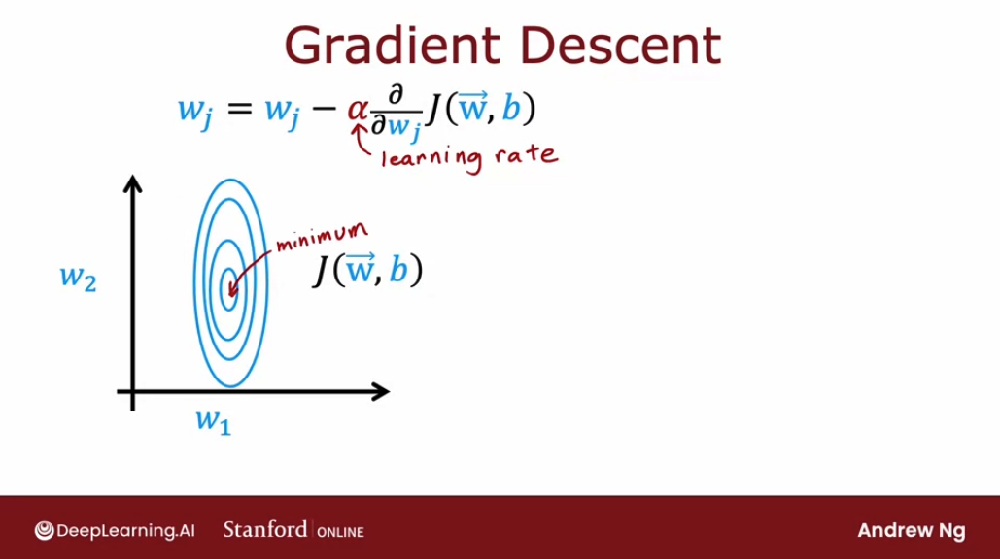

Now, if we were to start gradient descent in this example, one step of gradient descent, if $\alpha$ is small, may take we a little step in one direction, then another step, then another step, then another step, and we notice that every single step of gradient descent is pretty much going in the same direction.


So we might ask ourselves: why don't we make $\alpha$ bigger? Can we have an algorithm to automatically increase $\alpha$?, to make it take bigger steps and get to the minimum faster. **The algorithm called the Adam algorithm that can do that.**

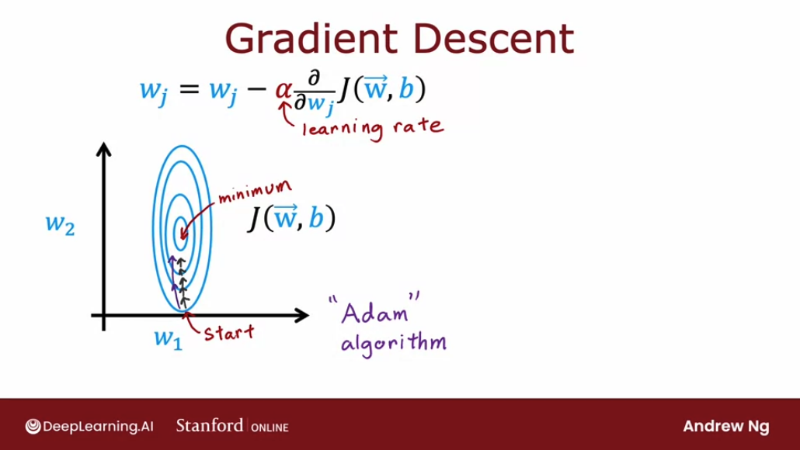

If this Adam algorithm sees that the learning rate is too small, and we are just taking tiny little steps in a similar direction over and over, we should just make the learning rate $\alpha$ bigger. 

And on the contrary, if if we see gradient descent oscillating back and forth, "overshooting" we'd be tempted to say, well, why don't we make the learning rates smaller?  The Adam algorithm can also do that automatically, and with a smaller learning rate, we can then take a more smooth path toward the minimum of the cost function. 

Depending on how gradient descent is proceeding, sometimes we wish we had a bigger learning rate $\alpha$, and sometimes we wish we had a smaller learning rate $\alpha$. The Adam algorithm can adjust the learning rate automatically.

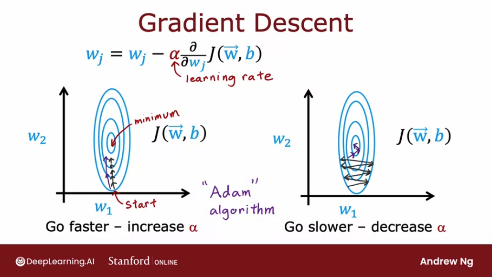


**Adam stands for Adaptive Moment Estimation**.

But interestingly, the **Adam algorithm doesn't use a single global learning rate $\alpha$. It uses a different learning rates for every single parameter of our model.**

If we have parameters $w_1$ through $w_10$, as well as $b$, then it actually has 11 learning rate parameters: $\alpha_1$, $\alpha_2$, all the way through $\alpha_10$ for $w_1$ to $w_10$, as well as $\alpha_11$ for the parameter b. 

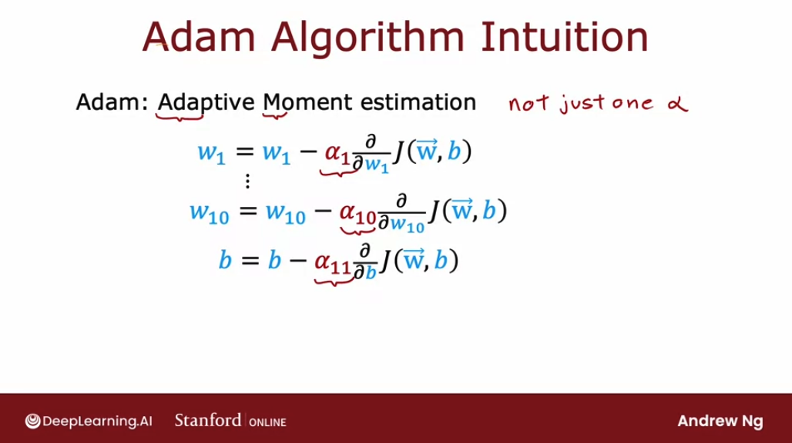

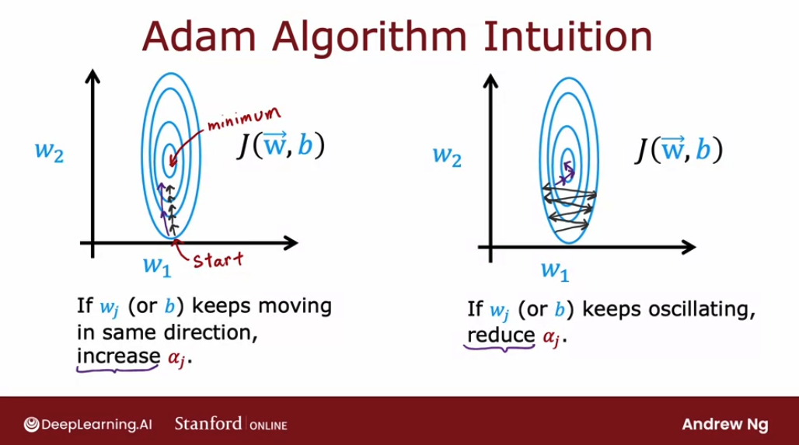

In our **code** we implement it so. The model is exactly the same as before, and the way we compile the model is very similar to what we had before, except that we now add one extra argument to the `compile` function:
```py
from tensorflow.keras.losses import SparseCategoricalentropy

model = Sequential([
  Dense(units=25, activation='relu'),
  Dense(units=15, activation='relu'),
  Dense(units=10, activation='linear')
])


model.compile(
  optimizer=tf.keras.optimizers.Adam(learning_rate=1e-3)
  loss=SparseCategoricalentropy(from_logits=True)
)

model.fit(X, Y, epochs=100)
```

The Adam optimization algorithm does need some default initial learning rate $\alpha$, and in this example, we've set that initial learning rate to be 0.001. But when we're using the Adam algorithm in practice, it's worth trying a few values for this default global learning rate. 

Try some large and some smaller values to see what gives we the fastest learning performance. Compared to the original gradient descent algorithm that we had learned in the previous course though, the Adam algorithm, because it can adapt the learning rate a bit automatically, it is more robust to the exact choice of learning rate that we pick. 

The Adam optimization algorithm typically works much faster than gradient descent, and it's become a de facto standard in how practitioners train their neural networks. If we're trying to decide what learning algorithm to use, what optimization algorithm to use to train our neural network. 

## Additional Layer Types (Convolutional Layer)

All the neural network layers with we so far have been the `Dense` layer type in which **every neuron in the layer gets its inputs all the activations from the previous layer**. 

And it turns out that just using the `Dense` layer type, we can actually build some pretty powerful learning algorithms. But there's some other types of layers as well with other properties. 

Let's recap: in the `Dense` layer that we've been using, **the activation of a neuron** is a function of every single activation value from the previous layer of a one:

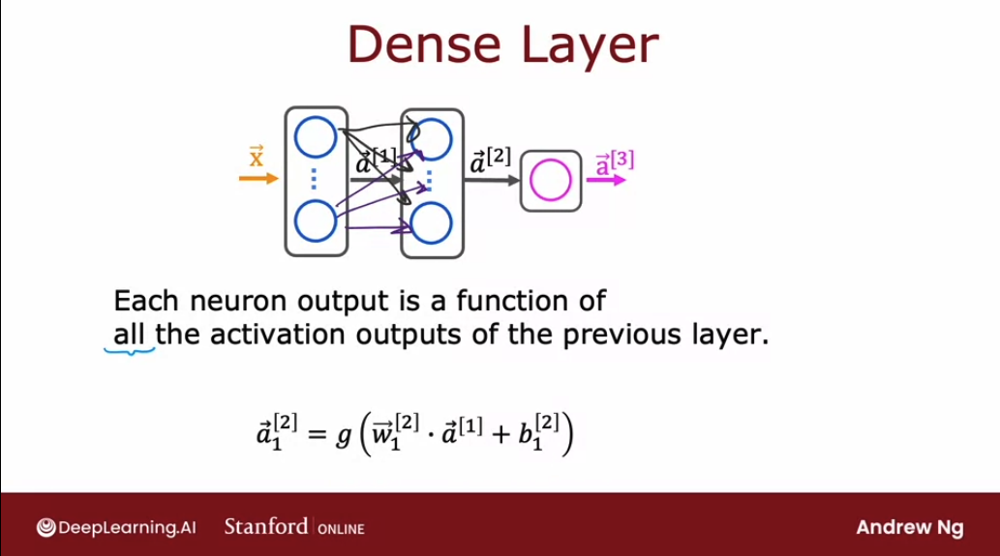

One other layer type that we may see in some work is called a **convolutional layer**. 

Let's see this with an example with the input `X`, which is a handwritten digit nine. And what we're going to do is construct a hidden layer which will compute different activations as functions of this input image `X`. 

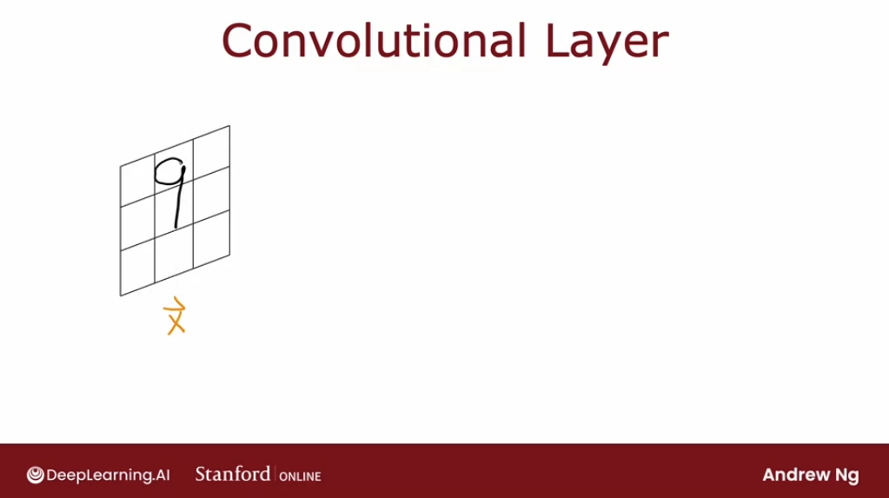

But here's something I can do: for the first hidden unit, which is shown in blue, rather looking at all the pixels in this image, this neuron can only look at the pixels one rectangular region. The econd neuron, which we're going to illustrate in magenta, is also not going to look at the entire input image `X`; instead, it's only going to look at the pixels in a limited region of the image. And so on for the rest of the neurons of this convolutional layer:

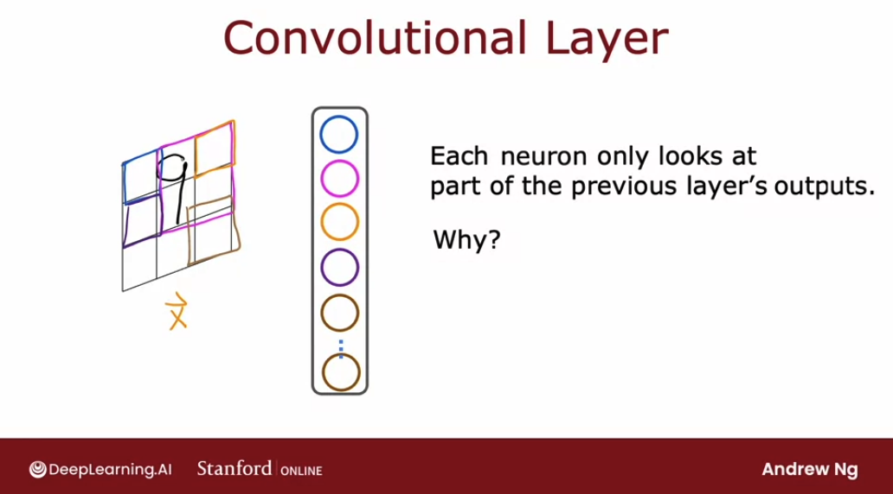

So why might we want to do this? Why won't we let every neuron look at all the pixels but instead look at only some of the pixels? There reasons:

1. **faster computation**
2. **need less training data (less prone to overfitting)**

This type of layer where **each neuron only looks at a region of the input image is called a convolutional layer**. It was the researcher Yan LeCun who figured out a lot of the details of how to get convolutional layers to work and popularized their use.

If we have multiple convolutional layers in a neural network sometimes that's called a convolutional neural network. Let's illustrate in more detail a convolutional neural network:

We're going to use a one dimensional input and the motivating example we're going to use is **the classification of EKG signals or electrocardiograms** to try to diagnose if patients may have a heart issue. 

An EKG can be interprested just a list of numbers corresponding to the height of the surface at different points in time. So we may have say 100 numbers corresponding to the height of this curve at 100 different points of time. But we're going to rotate 90 degrees to lay it on the side in order to have  100 inputs, from $x_1$ to $x_{100}$.

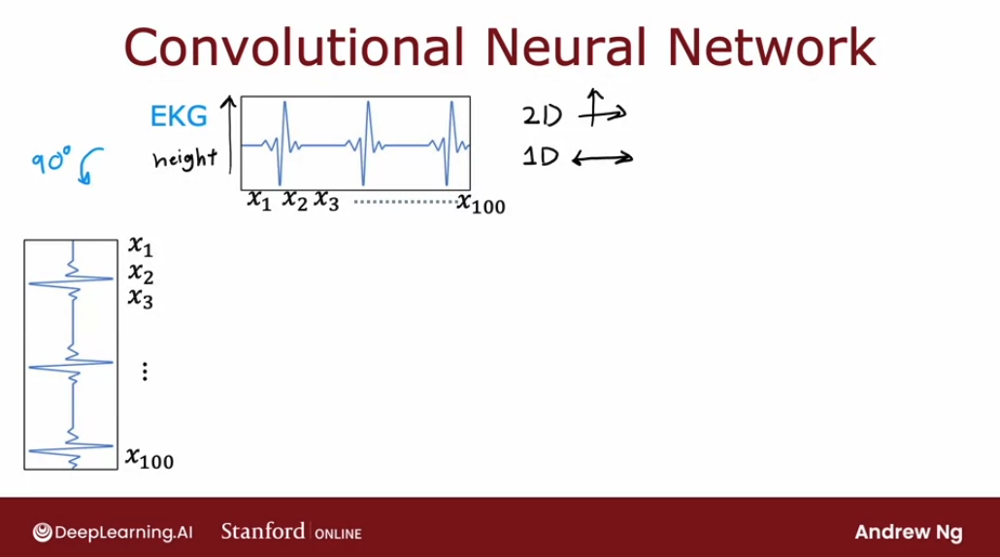

When constructing the first hidden layer, instead of having the first hidden unit take as input all 100 numbers from the previous layer, we'll have it look only at $x_1$ to $x_{20}$, so that corresponds to looking at just a small window of this EKG signal:

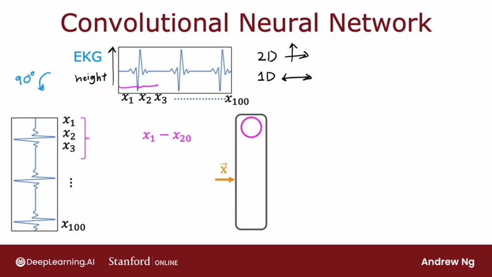

The second neuron, seen in another colour takes $x_11$ to $x_{30}$, so looks at a different window. And the sane applies to all other neurons in this convolutional layer:

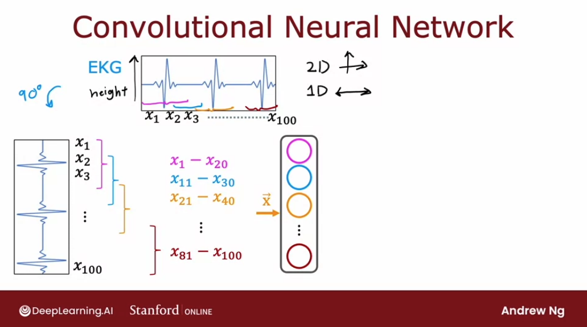

The next layer can also be a convolutional layer: each neuron will not look at all nine activations from the previous layer, but a subset previous layer:

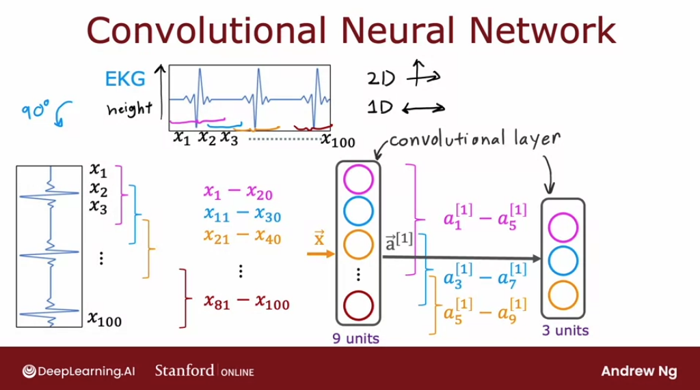

Finally these activations $a_2$ gets input to **a sigmoid unit** that does look at all three of these values of **in order to make a binary classification regarding the presence or absence of heart disease**. 

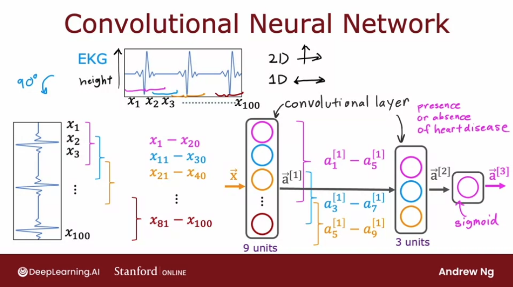

With convolutional layers **we have many architecture choices such as how big is the window of inputs that a single neuron should look at and how many neurons should each layer have**. And by choosing those architectural parameters effectively, **we can build new versions of neural networks that can be even more effective than the dense layer for some application**s. 

And in fact, when we hear about the latest cutting edge architectures like a **transformer model** or an **LSTM** or an **attention model**, a lot of this research in neural networks even today pertains to researchers trying to invent new types of layers for neural networks. And plugging these different types of layers together as building blocks to form even more complex and hopefully more powerful neural networks. 