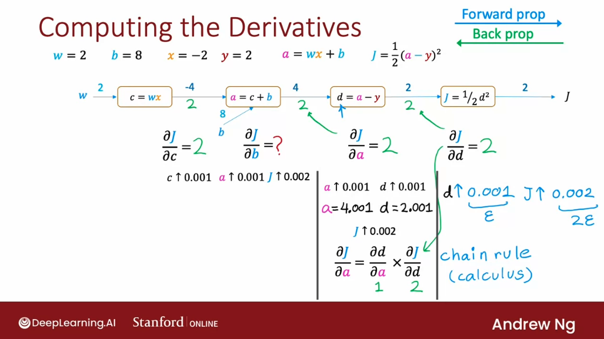
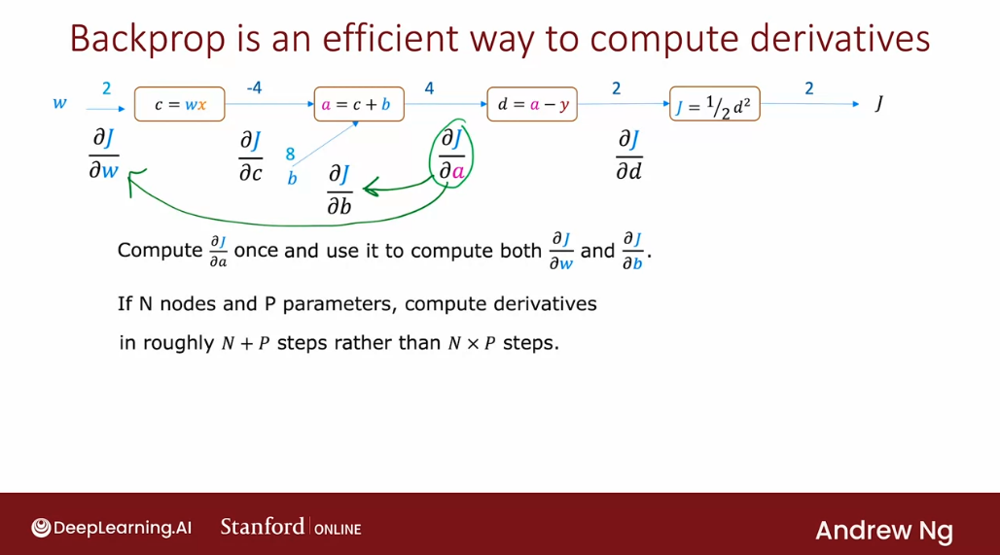

# Back Propagations

## Computation graph

The **computation graph** is a key idea in deep learning, and it is also how programming frameworks like TensorFlow, automatically **compute derivatives of our neural networks**. 

Let's take a look at how it works with a small neural network exampleof just one layer, which is also the output layer, and just one unit in the output layer. It takes us inputs $x$, applies a linear activation function and outputs the activation $a$. It outputs $wx + b$. 

This is basically linear regression, but expressed as a neural network with one output unit. Given the output, the cost function $J$ is:

$$J(w,b) = \frac{1}{2} (a - y)^2$$

For this small example, we're only going to have a single training example, where the training example is the input $x$ equals $-2$. The ground truth output value $y$ equals $2$, and the parameters of this network are; $w$ equals 2 and $b$ equals 8. 

Let's show how the computation of the cost function $J$ can be computed step by step using a computation graph. 

Let's take the computation of $J$ and break it down into individual steps. 

 - First, we have the parameter $w$ that is an input to the cost function $J$, and then we first need to compute $w$ times $x$. Let's call that $c$; $w$ is equal to 2, $x$ is equal to negative 2, and so $c$ would be $-4$.

 
 
- The next step is then to compute $a$, which is $wx + b$. In another node here, this needs to input $b$, the other parameter that is input to the cost function $J$, and $a = wx + b$ is equal to $c + b$. If we add these up, that turns out to be 4.

This is starting to build up a computation graph in which the steps we need to compute the cost function $J$ are broken down into smaller steps. 

- The next step is to then compute $a - y$, which we're going to call $d$. $y$ is equal to 2, so $4 - 2 = 2$. 

- Then finally, $J$ is is 1/2 of $a$ - $y$ squared, or 1/2 of $d$ squared, which is just equal to 2. 

What we've just done is build up a computation graph. It shows the forward prop step of how we compute the output a of the neural network. But then also go further than that so also compute the value of the cost function $J$.

But the question now is, **how do we find the derivative of $J$ with respect to the parameters $w$ and $b$?** 

Let's take a look at that next. Here's the computation graph from the previous slide and we've completed for a prop where we've computed that $J$, the cost function, is equal to 2 through all these steps going from left to right in the computation graph.

What we'd like to do now is compute the derivative of $J$ with respect to $w$ and the derivative of $J$ with respect to $b$. 

It turns out that whereas for a prop was a left to right calculation, **computing the derivatives will be a right to left calculation, which is why it's called backprop**, was going backwards from right to left. 

So, the final computation nodes of this graph is the one to the outmost right, which computes $J = 1/2 d^2$. 

The first step of backprop will ask:

- if the value of $d$, which was the input to this last node, were to change a little bit, how much does the value of $J$ change? Specifically, if $d$ were to go up by a little bit, say 0.001, and that'll be our value of $\epsilon$ in this case, how would the value of $J$ change? 

In this case if $d$ goes from 2 to 2.001, then $J$ goes from 2 to 2.002. So if $d$ goes up by $\epsilon$, $J$ goes up by roughly two times $\epsilon$. **We conclude that the derivative of $J$ with respect to this value $d$ that is inputted this final node is equal to two.**

The first step of backprop is be to fill in this value $2$, the derivative of $J$ with respect to this input value $d$, in the node that connects $d$ as an input to $J$. We know if $d$ changes a little bit, $J$ changes by twice as much because this derivative is equal to two.

- The next step is to look at the node before that and ask what is the derivative of $J$ with respect to $a$? 

To answer that, we have to ask: if $a$ goes up by 0.001, how does that change $J$? We know that if $a$ goes up by 0.001, $d$ is just $a - y$. If $a$ becomes 4.001, $d$ which is $a - y$, becomes 4.001 - 2, so it becomes 2.001. 

So, $a$ goes up by 0.001, $d$ also goes up by 0.001. 

But we'd already concluded previously that if $d$ goes up by 0.001, $J$ goes up by twice as much. Now we know if $a$ goes up by 0.001, $d$ goes up by 0.001, then $J$ goes up roughly by two times 0.001. This tells us that the derivative of $J$ with respect to $a$ is also equal to two. 

This is the derivative of $J$ with respect to $a$, just as this was the derivative of $J$ respect to $d$. This step of computation that we just did is actually relying on the chain rule for calculus.The derivative of $J$ with respect to $a$ is asking: how much does $d$ change respect to $a$, which is derivative of $d$ respect to $a$, multiplied by the derivative of $J$ with respect to $d$:

The calculation on top of the image showed that the partial of $d$ with respect to $a$ is 1, and we showed previously that the derivative of $J$ with respect to $d$ is equal to 2, which is why the derivative of $J$ with respect to $a$ is $1$ times $2$, which is equal to $2$.

We keep on going right to left as we do in backprop. 

- The next step then is: how much does a little change in $c$ cause $J$ to change, and how much does a change in $b$ cause $J$ to change? 

The way we figure that out is to ask, what if $c$ goes up by $\epsilon$ = 0.001, how much does $a$ change? Sincee $a = c + b$, it turns out that if $c$ ends up being negative 3.999, then $a$, which is -3.999, plus 8, becomes 4.001. 

So, if $c$ goes up by $\epsilon$, $a$ goes up by $\epsilon$. We know if $a$ goes up by $\epsilon$, then because the derivative of $J$ with respect to$ $a$ is two, we know that this in turn causes $J$ to go up by two times $\epsilon$.

We can conclude that if $c$ goes up by a little bit, $J$ goes up by twice as much. We know this because we know the derivative of $J$ with respect to $a$ is 2. This allows us to conclude that the derivative of $J$ with respect to $c$ is also equal to 2:

With chain rule, another way to write this, is: the derivative of $J$ respect to $c$, is the derivative of $a$ with respect to $c$ (which is 1) times the derivative of $J$ respect to $a$ (which we have previously figured out was equal to 2), so it ends up being equal to 2. 

By a similar calculation, if $b$ goes up by 0.001, then $a$ also goes up by 0.001 and $J$ goes up by 2 times 0.001, which is why this derivative is also equal to 2. 

- Now one final step: what is the derivative of $J$ with respect to $w$? 

If $w$ goes up by 0.001, what happens? $c$ is $w$ times $x$. If $w$ were 2.001, $c$ which is $w$ times $x$, becomes -2 times 2.001, so $c$ becomes negative 4.002.

If $w$ goes up by $\epsilon$, $c$ goes down by 2 times 0.001, or equivalently $c$ goes up by negative 2 times 0.001.

We know that if $c$ goes up by  -2 times 0.001, since the derivative of $J$ with respect to $c$ is 2, this means that $J$ will go up by  -4 times 0.001: because if $c$ goes up by a certain amount, $J$ changes by 2 times as much. **This allows us to conclude that if $w$ goes up by 0.001, $J$ goes up by  -4 times 0.001.**

**So, the derivative of $J$ with respect to $w$ is $-4$**.

Once again, the chain rule calculation is:

To wrap up what we've just done this manually carry out backprop in this computation graph. 

In fact, let's double-check the computation that we just did. $J$ with these values of w, b, $x$ and $y$ is equal to one-half times wx plus $b$ minus $y$ squared, which is one-half times 2 times negative 2 plus 8 minus 2 squared, which is equal to 2:

Now if $w$ were to go up by 0.001, then $J$ becomes 1/2 times (() 2.001 times -2, plus $b$ which is 8) minus $y$ squared. If we calculate this out, this turns out to be 1.996002.

**Roughly $J$ has gone from 2 down to 1.996, and $J$ has therefore gone down by 4 times $\epsilon$. This shows that if $w$ goes up by $\epsilon$, $J$ goes down by four times $\epsilon$ , or equivalently, $J$ goes up by -4 times $\epsilon$. This is why the derivative of $J$ with respect to $w$ is -4.**

--- 
**Why do we use the backprop algorithm to compute derivatives?** 

Backdrop is an efficient way to compute derivatives. The reason we sequence this as a right-to-left calculation is: if we were to start off and ask what is the derivative of $J$ with respect to $w$?

Then, to know how much change in $w$ affects change in $J$, if $w$ were to go up by $\epsilon$, how much does $J$ go by $\epsilon$? Well, the first thing we want to know is, what is the derivative of $J$ with respect to $c$? Because change in $w$ will change $c$, the first quantity after the first node:

So, to know how much change in $w$ affects $J$, we want to know how much does change in $c$ affects $J$. But to know how much change in $c$ affects $J$, the most useful thing to know would be how does a change in $c$ change $a$:

And, we want to know how much this change in $a$ effect $J$, and so on. 

That's why backprop a sequence as a right-to-left calculation. Because if we do the calculation from right to left, we can find out how does change in $d$ affect change in $J$. Then we can find out how much this change in a effect $J$, and so on, until we find the derivatives of each of these intermediate quantities, $c$, $a$, and $d$, as well as the parameters $w$ and b.

One thing that makes backprop efficient is that, when we do the right-to-left calculation, we had to compute some terms, for example, the derivative of $J$ with respect to $a$ just once, although this quantity is then used to compute both the derivative of $J$ with respect to $w$ and the derivative of $J$ with respect to $b$. 

It turns out that if a computation graph has $n$ nodes and $p$ parameters (two parameters in this case $w$ and $b$), this procedure allows us to compute all the derivatives of $J$ with respect to all the parameters in roughly: n plus p steps, rather than n times p steps.

If we have a neural network with 10,000 nodes and maybe 100,000 parameters, being able to compute the derivatives in 10,000 plus 100,000 steps is much better than calcualting 10,000 times 100,000 steps, which would be a billion steps. 

The backpropagation algorithm done using the computation graph gives we a very efficient way to compute all the derivatives. That's why it is such a key idea in how deep learning algorithms are implemented today. 

## Large neural network example

In this final section on intuition for backprop, let's take a look at how the computation draft works on a larger neural network example. Here's the network we will use with a single hidden layer, with a single hidden unit that outputs $a^{[1]}$, that feeds into the output layer that outputs the final prediction $a^{[2]}$. 

To make the math more tractable, we're going to continue to use just a single training example with inputs $x$ = 1, $y$ = 5. The parameters are in the screenshot below. And throughout we're going to use the ReLU activation functions of $g(z) = max(0, z)$. 

So for prop in our network looks like this: as usual, $a^{[1]}$ equals $g(w_1 x + b_1)$. And so it turns out $w_1 x + b$ will be positive, so we're in the $max(0, z) = z$ part of this activation function. 

So that's just equal to: 2 times 1 + 0, which is equal to 2. 

And then similarly, $a^{[2]}$ equals: 

Finally, we'll use the squared error cost function:

So: 

$$J(w, b) = \frac{1}{2}(a^{[2]}- y)^2 = 1/2 (7-5)^2 = 2$$

So, let's take this calculation that we just did and write it down in the form of a computation graph. 

To carry out the computation step by step, first thing we need to do is take $w_1$ and multiply that by $x$. So we have $w_1$ that feeds into computation node that computes $w_1$ times $x$. And we're going to call this a temporary variable $t^{[1]}$:

Next, we compute $z^{[1]}$, which is $t^{[1]}$ + $b_1$. So we also have the input $b_1$:

And finally $a^{[1]}$ equals $g(z^{[1]})$. We apply the activation function, and so we end up with again the value 2:

And then next we have to compute $t^{[2]}$, which is $w^{[2]}$ times $a^{[1]}$:

And so, with $w_2$, that gives us this value which is 6:

Then $z^{[2]}$, which is $w^{[2]} a^{[1]} + b^{[2]}, gives us 7. 

And finally apply the activation function, g, we still end up with 7:

And lastly, $J = \frac{1}{2}(a^{[2]}-y)^2$. And that gives us 2, which was this cost function here. 

So this is how we take the step by step computations for larger neural network and write it in the computation graph. 

If we were to carry out backprop, the first thing we do is ask, what is the derivative of the cost function $J$ respect to a2? And it turns out if we calculate that, it turns out to be 2. 

So we'll fill that in here. And the next step will be asked, what's the derivative of the cost $J$ respect to z2. And using this derivative that we computed previously, we can figure out that this turns out to be 2. 

Because if z goes up by $\epsilon$, we can show that for the current setting of all the parameters a2 will go up by $\epsilon$. And therefore, $J$ will go up by 2 times $\epsilon$. So this derivative is equal to 2, and so on. 

Step by step. We can then find out that the derivative of $J$ respective $b_2$ is also equal to 2. The derivative respect to t2 is equal to 2, and so on, and so forth. 

Until eventually we've computed the derivative of $J$ with respect to all the parameters $w_1$, $b_1$, $w_2$, and $b_2$. And so that's backprop.

Let me just double check one of these examples. So we saw here that the derivative of $J$ respect $w_1$ is equal to 6. So what this is predicting is that, if $w^1$ goes up by epsilon, $J$ should go up by roughly 6 times epsilon. Let's step through the map and see if that really is true.

And so if $w$ which was 2 were to be 2.001 goes up by epsilon, then a1 becomes, let's see, instead of 2, this is 2.001 as well. So a1 instead of 2 is now 2.001. So 3 $x$ 2.001 + 1, this gives us 7.003.

And if a2 is 7.003, then just becomes 7.003-5 squared. And so this becomes 2.003 squared over 2, which turns out to be equal to 2.006005.

√

So ignoring some of the extra digits, we see from this calculation that, if $w^1$ goes up by 0.001, $J$ of $w$ has gone up from 2 to 2.006 roughly. 

So 6 times as much. And so the derivative of $J$ with respect to $w_1$ is indeed equal to 6. 

---

So, the backprop procedure gives we a very efficient way to compute all of these derivatives, which we can then feed into the gradient descent algorithm or the Adam optimization algorithm, to then train the parameters of our neural network. 

And again, the reason we use background for this is, is a very efficient way to compute all the derivatives of $J$ respect to $w_1$, $J$ respect to $b_1$, $J$ respect to $w_2$, and $J$ respect to $b_2$.

I did just illustrate how we could bump up $w_1$ by a little bit and see how much $J$ changes. But that was a left to right calculation. And then we had to do this procedure for each parameter, one parameter at a time. We had to increase $w$ by 0.001 to see how that changes $J$, increase $b_1$ by a little bit to see how that changes $J$, and increase every parameter, one at a time by a little bit to see how that changes $J$. Then this becomes a very inefficient calculation. And if we had N nodes in our computation graph and P parameters, this procedure would end up taking N times P steps, which is very inefficient. 

Whereas we got all four of these derivatives N + P, rather than N times P steps. And this makes a huge difference in practical neural networks, where the number of nodes and the number of parameters can be really large.

