# Advice for applying machine learning

## Debugging ML: Deciding what to try next

The efficiency of how quickly we can get a machine learning system to work well will depend to a large part on how well we can repeatedly make good decisions about what to do next in the course of a machine learning project. 

So let's see a number of tips on h**ow to make decisions** about what to do next in machine learning project, that I hope will end up saving we a lot of time, and some **advice on how to build machine learning systems**. 

Let's start with an example: we've implemented regularized linear regression to predict housing prices, so we have the usual cost function for our learning algorithm: squared error plus this regularization term.

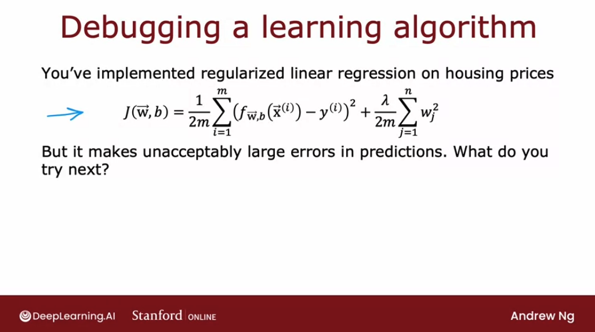

But if we train the model, and **find that it makes unacceptably large errors in it's predictions, what do we try next?:** 

- Get more training examples
- Try smaller sets of features, if we have too many
- Try getting additional features
- Try adding polynomial features ($x_1^2$, $x^2_2$, $x_1x_2$, etc)
- Try decreasing $\lambda$
- Try increasing $\lambda$

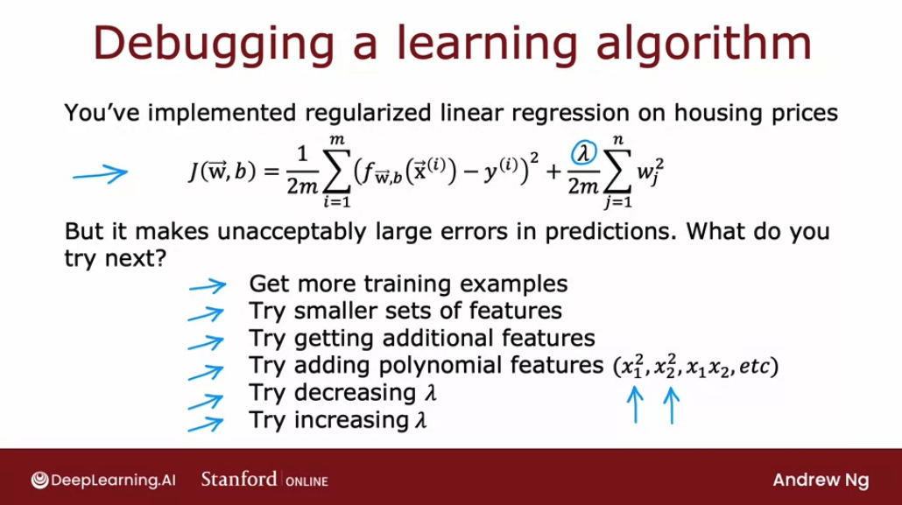


On any given machine learning application, it will often turn out that some of these things could be fruitful, and some of these things not fruitful. **The key to being effective at how we build a machine learning algorithm will be if we can find a way to make good choices about where to invest our time.** 

So we'll learn about how to carry out a set of diagnostics: 

**Diagnostic**: **a test that we can run to gain insight into what is or isn't working with learning algorithm to gain guidance into improving its performance**. 

Some of these diagnostics will tell us things like, if is it worth weeks, or even months collecting more training data, because if it is, then we can then go ahead and make the investment to get more data, which will hopefully lead to improved performance, or if it isn't then running that diagnostic could have saved we months of time. 

**Diagnostics can take time to implement, but running them can be a very good use of our time.**

## Evaluating a model

**How do we evaluate that model's performance? Having a systematic way to evaluate performance will also hope paint a clearer path for how to improve its performance.**

Let's take the example of learning to predict housing prices as a function of the size. Let's say we've trained the model to predict housing prices as a function of the size $x$ and the model is a fourth order polynomial.

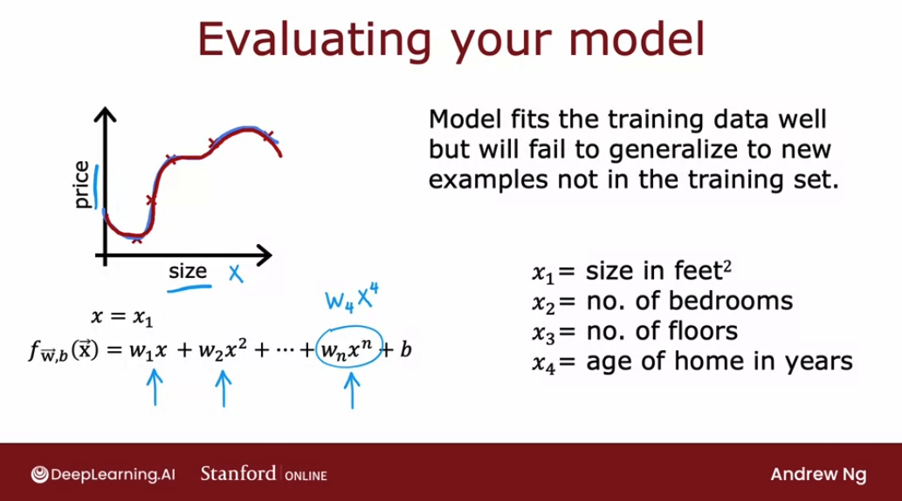

Because we fit a fourth order polynomial to a training set with five data points,the training data really well. But it will fail to generalize to new examples that aren't in the training set (overfitted data).

When we have a model with a single feature, such as the size of the house, we could plot the model to see that the curve is very wiggly, so we know this is probably isn't a good model. But if we traing model with more features then it becomes much harder to plot the model?

So in order to tell if our model is doing well, we will need some **more systematic way to evaluate how well our model is doing**. 

We can use the techinque of splitting into a **training set and a test set**.

If we have a training set (in the following example, a small training set with just 10 examples), **rather than taking all our data to train the parameters $w$ and $b$** of the model, we can **instead split the training set into two subsets**. We can put 70% of the data into the first part and call that the **training set**. And the second part of the data, the 30% of the data, will be called **test set**.

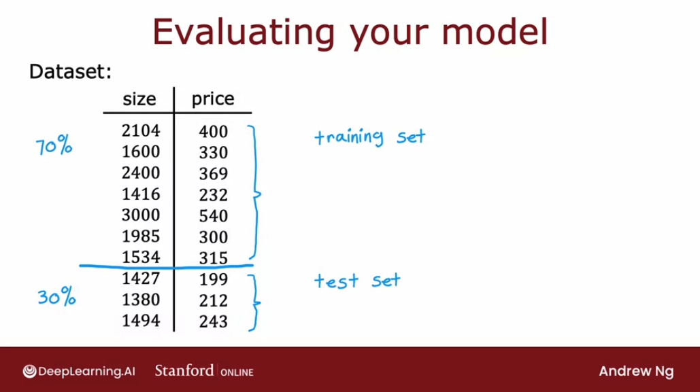

And notice that we will have new notation for out training data according to this split:

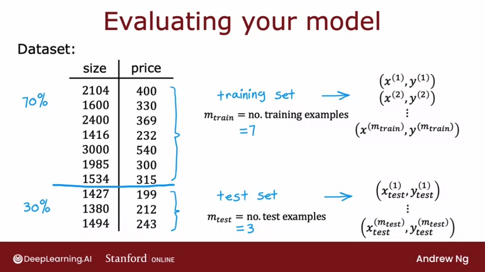

$$m_{train} = \text{no. training examples}$$
$$m_{test} = \text{no. test examples}$$

So, in order to train a model and evaluated it, the following is the formula if we're using linear regression with a squared error cost. We **start off by fitting the parameters by minimizing the cost function $J(w,b)$**. This is the usual cost function minimize over the $w$ and $b$ parameters of the square error cost, plus the regularization term.

$$J(\vec{\mathbf{w}},b) = \frac{1}{2m_{train}} \sum\limits_{i = 1}^{m_{train}} (f_{\vec{\mathbf{w}},b}(\mathbf{\vec{x}}^{(i)}) - y^{(i)})^2  + \frac{\lambda}{2m_{train}} \sum\limits_{j = i}^{n} w_j^2$$

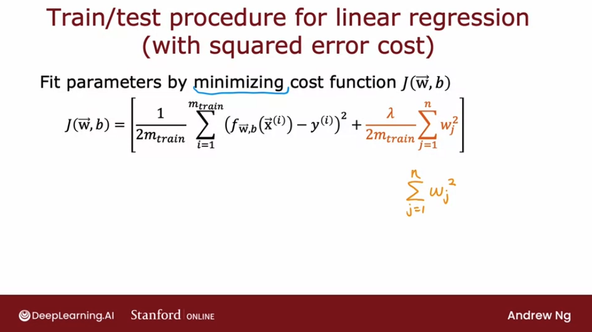

And then to tell how well this model is doing we would compute $J_{test}(\vec{\mathbf{w}},b)$ **which is equal to the average error on the test set**, a prediction on the $i^{th}$ test example input minus the actual price of the house on the test example, squared. And notice that the test error formula $J_{test}$, it does not include that regularization term:

$$J_{test}(\vec{\mathbf{w}},b) = \frac{1}{2m_{test}} \sum\limits_{i = 1}^{m_{test}} (f_{\vec{\mathbf{w}},b}(\mathbf{\vec{x}}_{test}^{(i)}) - y^{(i)}_{test})^2  $$

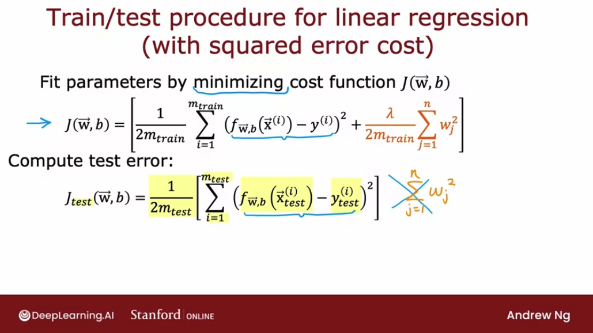

One other quantity that's often useful to computer as well as is **the training error, a measure of how well the learning algorithm is doing on the training set**. 

$$J_{train}(\vec{\mathbf{w}},b) = \frac{1}{2m_{train}} \sum\limits_{i = 1}^{m_{train}} (f_{\vec{\mathbf{w}},b}(\mathbf{\vec{x}}_{train}^{(i)}) - y^{(i)}_{train})^2  $$

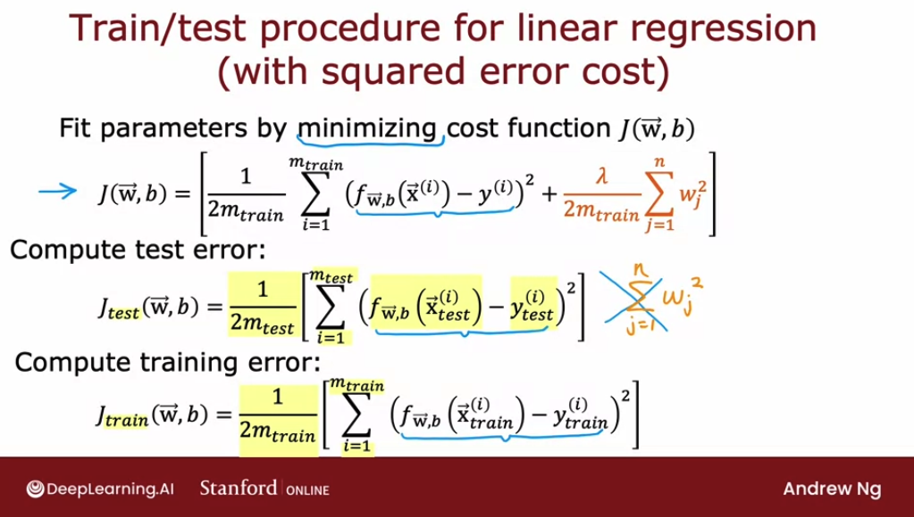

So, in the model like what we saw earlier in this section, $J_{train}$ will be low because the average error on our training examples will be zero or very close to zero, $thus J_{train}$ will be very close to zero.

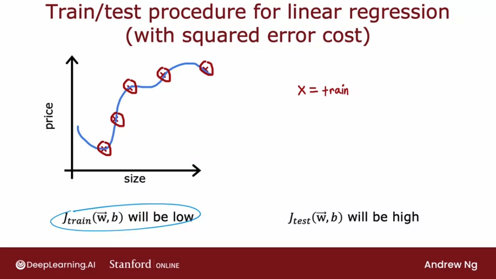

But if we have a few additional examples in our test set that the algorithm had not trained on, then those test examples will have a large gap between what the algorithm is predicting as the estimated housing price, and the actual value of those housing prices. And so, $J_{test}$.


Knowing that $J_{test}$ is high on this model gives us a way to realize that the model is actually not so good at generalizing to new examples or new data points that were not in the training set. 

Now, let's take a look at how we apply this procedure to a classification problem, for example, if we are classifying between handwritten digits that are either 0 or 1.

Same as before, we fit the parameters by minimizing the cost function to find the parameters $w$ and $b$. For example, if we were training logistic regression, then the cost function $J(w,b)$ would be:

$$J(\mathbf{w},b) = -\frac{1}{m_{train}}  \sum_{i=0}^{m_{train}-1} \left[ y^{(i)} \log\left(f_{\mathbf{w},b}\left( \mathbf{x}^{(i)} \right) \right) + \left( 1 - y^{(i)}\right) \log \left( 1 - f_{\mathbf{w},b}\left( \mathbf{x}^{(i)} \right) \right) \right] + \frac{\lambda}{2m_{train}}  \sum_{j=0}^{n-1} w_j^2$$


And to **compute the test error**:

$$J_{test}(\mathbf{w},b) = -\frac{1}{m_{test}}  \sum_{i=0}^{m_{test}-1} \left[ y^{(i)} \log\left(f_{\mathbf{w},b}\left( \mathbf{x}^{(i)} \right) \right) + \left( 1 - y^{(i)}\right) \log \left( 1 - f_{\mathbf{w},b}\left( \mathbf{x}^{(i)} \right) \right) \right]$$

And to **compute the train error**:

$$J_{train}(\mathbf{w},b) = -\frac{1}{m_{train}}  \sum_{i=0}^{m_{train}-1} \left[ y^{(i)} \log\left(f_{\mathbf{w},b}\left( \mathbf{x}^{(i)} \right) \right) + \left( 1 - y^{(i)}\right) \log \left( 1 - f_{\mathbf{w},b}\left( \mathbf{x}^{(i)} \right) \right) \right]$$

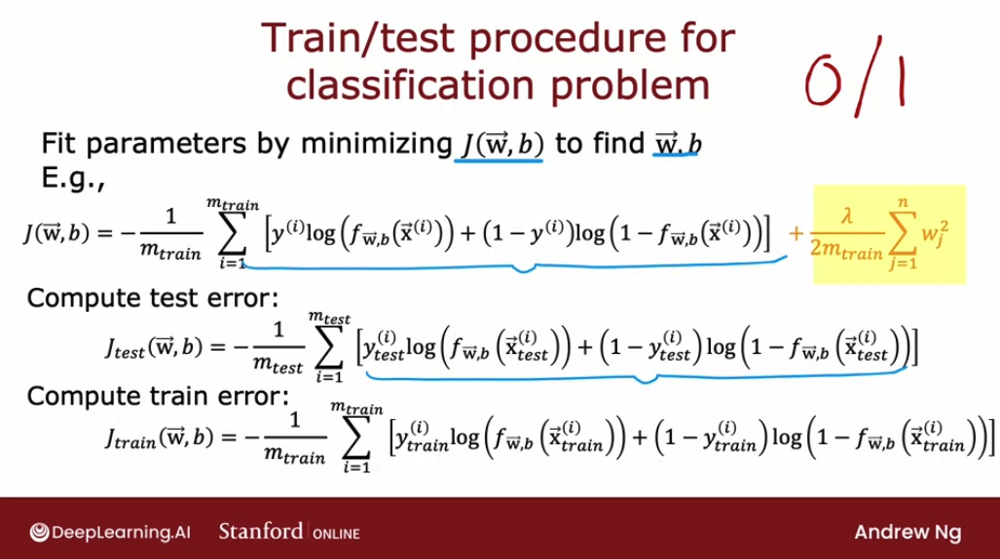


This will work OK for figuring out if our learning algorithm is doing well, by seeing how our algorithm is doing in terms of test error. 

But when applying machine learning to classification problems, there's actually **another definition of $J_{test}$ and $J_{train}$ that is even more commonly used.**

And that is: **measure what the fraction of the test set and the fraction of the training set that the algorithm has misclassified**.

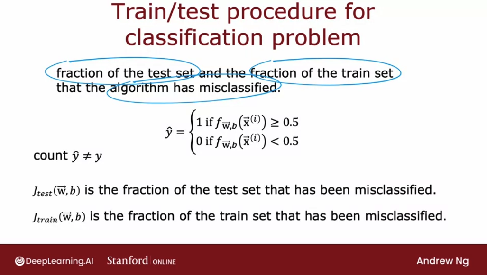

Since we can have the algorithm make a prediction 1 or 0 on every test example, w**e can then count up in the test set the fraction of examples where $y_hat$ is not equal to the actual ground truth label $y$.**.

## Model selection and training/cross validation/test sets

In the last section, we saw how to use the **test set** to evaluate the performance of a model. Let's make one further refinement to that idea in this section, which allow us to use the technique **to automatically choose a good model for our machine learning algorithm**. 

We saw first that once the model's parameters $w$ and $b$ have been fit to the training set, the **training error may not be a good indicator** of how well the algorithm will do or how well it will generalize to new examples that were not in the training set. For the example in the image below, the training error will be pretty much zero.

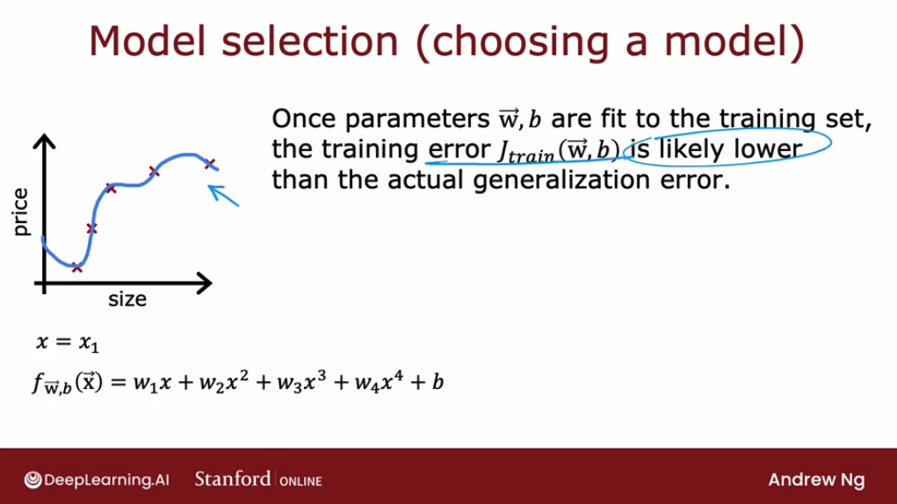

That's likely **much lower than the actual generalization error**, that is, the average error on new examples that were not in the training set. 

We saw on the last section is that **$J_{test}$, the performance of the algorithm on examples the algorithm is not trained on,  will be a better indicator of how well the model will likely do on new data**. 

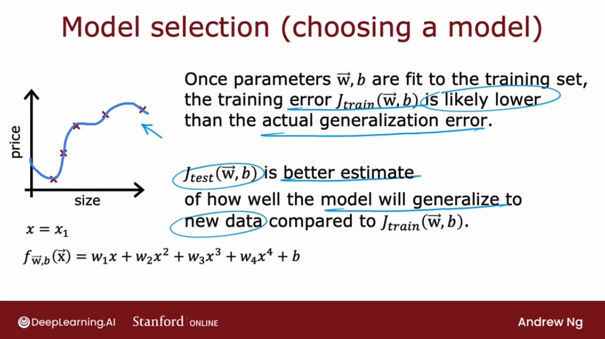

Let's take a look at **how we might use a test set to choose a model for a given machine learning application**:

When developing a model to fit to some data, we might develop a whole range of model function, which go from something linear, to a function of, for example, a 10th order polynomial:

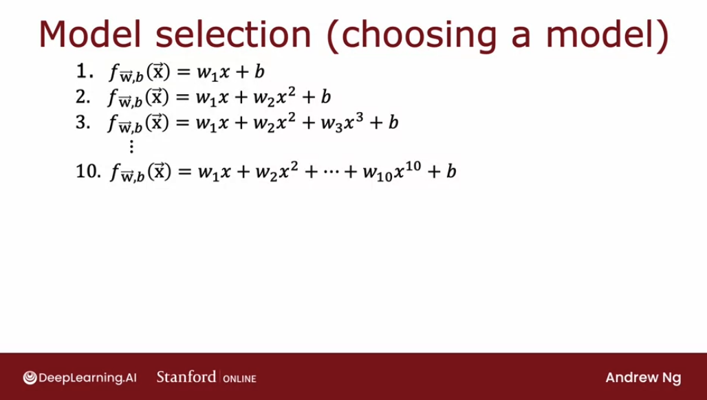

So, just a hand-up, the following is not the best procedure, but it looks that we could try is to look at all of $J_{test}$ values for each of the models and see which one gives we the lowest value:

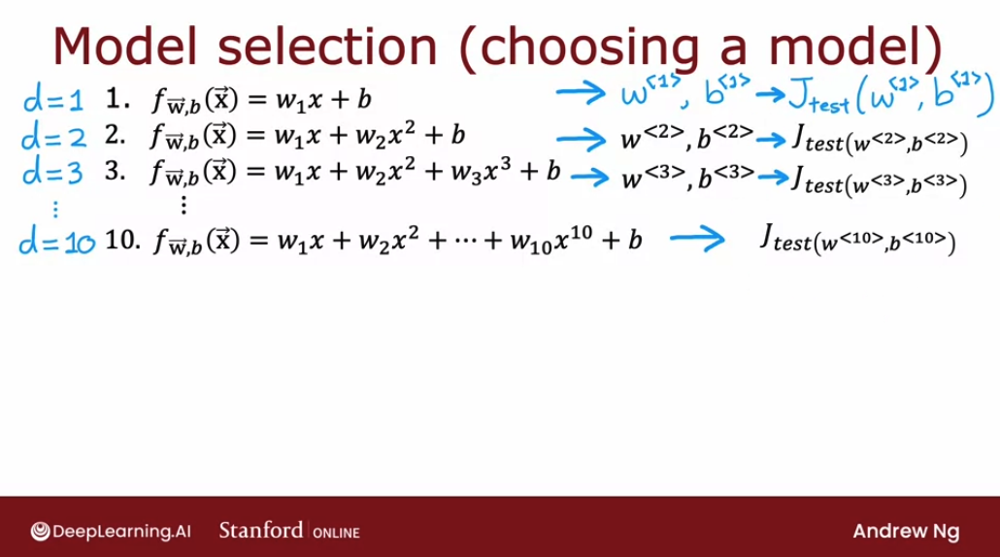

If for example, we found that the model with the 5th order polynomial reports the lowest $J_{test}$, the we would choose that model and report that test set error $J_{test}$ as a measure of how well the model performs.

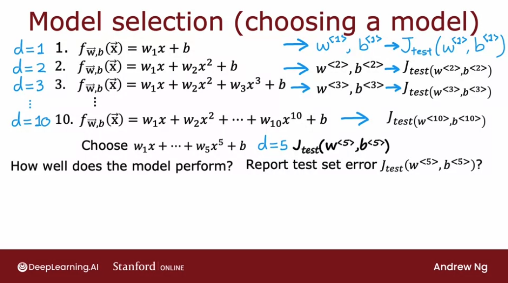

But this is a flawed procedure: and the reason for thatis that $J_{test}(w^{<5>},b^{<5>})$ is likely to be an optimistic estimate of the generalization error. In other words, it is likely to be lower than the actual generalization error.

**And the reason is, in the procedure we just mentioned we are choosing one extra parameter, which is $d$, the degree of polynomial, using the test set.** 

We know that if we were to fit $w$, $b$ to the training data, then the training data would be an overly optimistic estimate of generalization error. **So analogously, if we want to choose the parameter $d$ using the test set, then the test set error $J_{test} is now overly optimistic - is lower than actual estimate of the generalization error.**

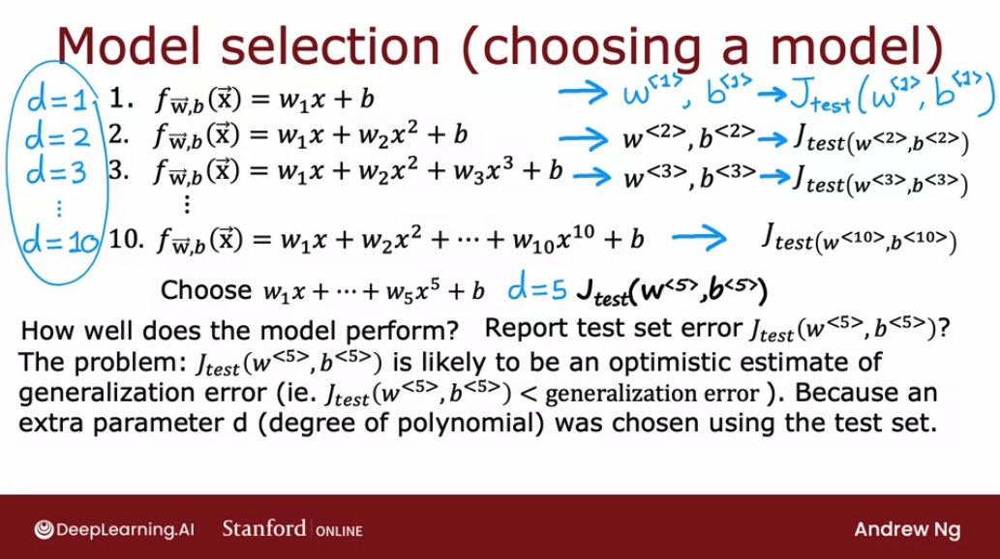

So, instead, if we want to automatically choose a model, and decide what degree polynomial to use, we need to modify the training and testing procedure in order to carry out model selection. Here's how to do it.

Instead of splitting our data into just two subsets, the **training set** and the **test set**, we're going to split our data into three different subsets, which we're going to call:
- **the training set**
- **the cross-validation set**
- **the test set**

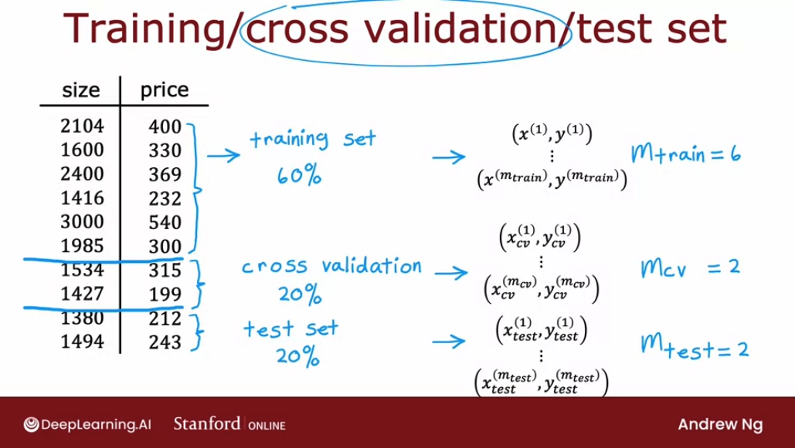

**The name cross-validation refers to that this is an extra dataset that we're going to use to check or cross check the validity or really the accuracy of different models.**

The cross validation set is also called:
- the validation set 
- the development set
- the dev set

So, having these three subsets of the data training set, cross-validation set, and test set, we can then compute the training error,he cross-validation error, and the test error using these three formulas:

$$J_{train}(\vec{\mathbf{w}},b) = \frac{1}{2m_{train}} \sum\limits_{i = 1}^{m_{train}} (f_{\vec{\mathbf{w}},b}(\mathbf{\vec{x}}_{train}^{(i)}) - y^{(i)}_{train})^2  $$

$$J_{cv}(\vec{\mathbf{w}},b) = \frac{1}{2m_{cv}} \sum\limits_{i = 1}^{m_{cv}} (f_{\vec{\mathbf{w}},b}(\mathbf{\vec{x}}_{cv}^{(i)}) - y^{(i)}_{cv})^2  $$

$$J_{test}(\vec{\mathbf{w}},b) = \frac{1}{2m_{test}} \sum\limits_{i = 1}^{m_{test}} (f_{\vec{\mathbf{w}},b}(\mathbf{\vec{x}}_{test}^{(i)}) - y^{(i)}_{test})^2  $$

As usual, none of these terms include the regularization term that is included in the training objective.

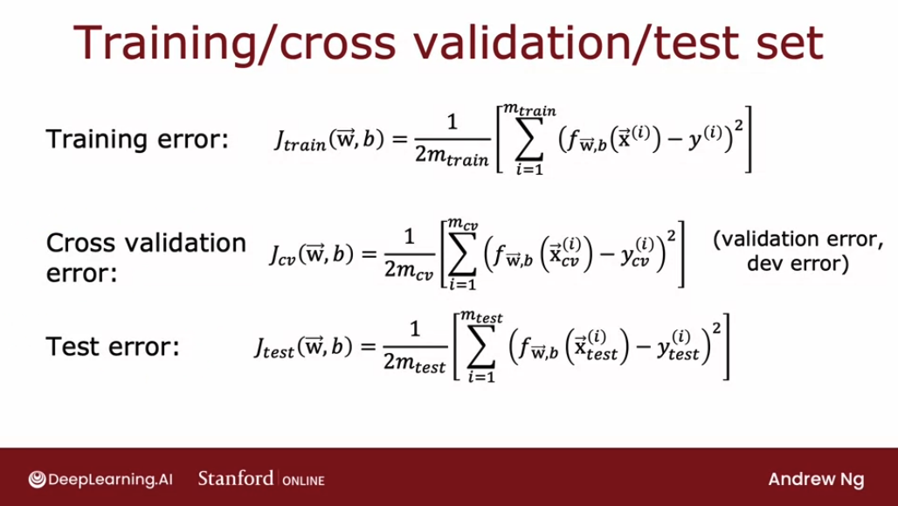

Armed with these three measures of learning algorithm performance, this is how we can then go about carrying out model selection. We can, with the 10 models we saw earlier, each with a different parameter $d$ and for each we calculate $w_1$, $b_1$ using the training set $J_{train}$.

**But instead of evaluating the models and their parameters using our test set, we will instead evaluate these parameters on our cross-validation sets.** 

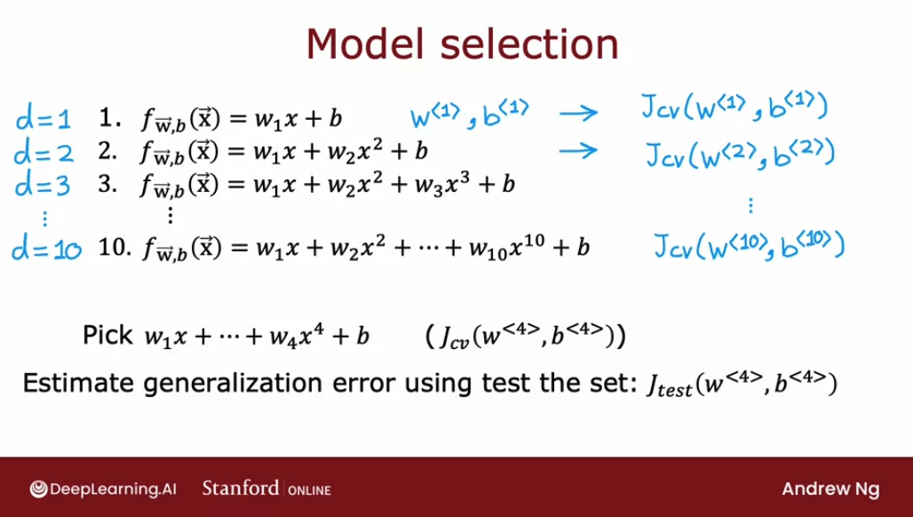

Then, in order to choose a model, we will look at which model has the lowest cross-validation error, $J_{cv}$, and choose that. For example, if $J_cv$ of $w_4$, $b_4$ is the lowest, then we pick this fourth-order polynomial as the model we will use for this application. 

Finally: i**f we want to report out an estimate of the generalization error** of how well this model will do on new data, we will do so **using that third subset of our data, the test set $J_{test}$** and we report out $J_{test}(w^{<4>}, b^{<4>})$. 

**Notice that throughout this entire procedure $J_{test}$ wasn't used to train to get the parameters $w$ or $b$ of each model, and neither to decide which model was better (what the $d$ parameter should be). That's why $J_{test}$ will be a fair estimate of the generalization error of this model.**

This gives a better procedure for model selection and it lets we automatically make a decision like what order polynomial to choose for our linear regression model. 

This model selection procedure also works for choosing among other types of models. For example, choosing a neural network architecture. 

If we are fitting a model for handwritten digit recognition, we might consider three models, three different neural networks, with different number of layers and neurons. 

To help we decide how many layers do the neural network have and how many hidden units per layer should we have, we can then:

1. train all three of these models and end up with parameters $w$ and $b$ for each model.
2. valuate the neural networks performance using $J_{cv}$, using our cross-validation set (since this is a classification problem, $J_{cv}$ the most common choice would be to compute this as the fraction of cross-validation examples that the algorithm has misclassified). Then pick the model with the lowest $J_{cv}$.
3. report out an estimate of the generalization error using the test set $J_{test}$.

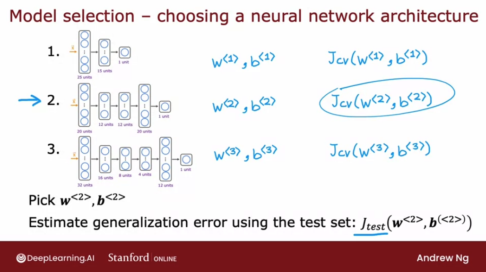

It's considered best practice in machine learning that, if we have to make decisions about our model, such as fitting parameters or choosing the model architecture, such as neural network architecture or degree of polynomial if we're fitting a linear regression, to make all those decisions only using our training set and our cross-validation set, and to not look at the test set at all.

Using only the test set at the end to evaluate the performance of our model, we ensure that our test set is a fair and not overly optimistic estimate of how well our model will generalize to new data.

## Lab: Model Evaluation and Selection

[LINK](https://www.coursera.org/learn/advanced-learning-algorithms/ungradedLab/7aoYQ/optional-lab-model-evaluation-and-selection/lab?path=%2Fnotebooks%2FC2W3_Lab_01_Model_Evaluation_and_Selection.ipynb)

[Internal Link]()

Quantifying a learning algorithm's performance and comparing different models are some of the common tasks when applying machine learning to real world applications. In this lab, you will practice doing these using the tips shared in class. Specifically, you will:

* split datasets into training, cross validation, and test sets
* evaluate regression and classification models
* add polynomial features to improve the performance of a linear regression model
* compare several neural network architectures

This lab will also help you become familiar with the code you'll see in this week's programming assignment. Let's begin!

### Imports and Lab Setup

First, you will import the packages needed for the tasks in this lab. We also included some commands to make the outputs later more readable by reducing verbosity and suppressing non-critical warnings.

```py
# for array computations and loading data
import numpy as np

# for building linear regression models and preparing data
from sklearn.linear_model import LinearRegression
from sklearn.preprocessing import StandardScaler, PolynomialFeatures
from sklearn.model_selection import train_test_split
from sklearn.metrics import mean_squared_error

# for building and training neural networks
import tensorflow as tf

# custom functions
import utils

# reduce display precision on numpy arrays
np.set_printoptions(precision=2)

# suppress warnings
tf.get_logger().setLevel('ERROR')
tf.autograph.set_verbosity(0)
```

### Regression

First, you will be tasked to develop a model for a regression problem. You are given the dataset below consisting of 50 examples of an input feature `x` and its corresponding target `y`.

```py
# Load the dataset from the text file
data = np.loadtxt('./data/data_w3_ex1.csv', delimiter=',')

# Split the inputs and outputs into separate arrays
x = data[:,0]
y = data[:,1]

# Convert 1-D arrays into 2-D because the commands later will require it
x = np.expand_dims(x, axis=1)
y = np.expand_dims(y, axis=1)

print(f"the shape of the inputs x is: {x.shape}")
print(f"the shape of the targets y is: {y.shape}")

# the shape of the inputs x is: (50, 1)
# the shape of the targets y is: (50, 1)
```

You can plot the dataset to get an idea of how the target behaves with respect to the input. In case you want to inspect the code, you can find the `plot_dataset()` function in the `utils.py` file outside this notebook.

```py
# Plot the entire dataset
utils.plot_dataset(x=x, y=y, title="input vs. target")
```

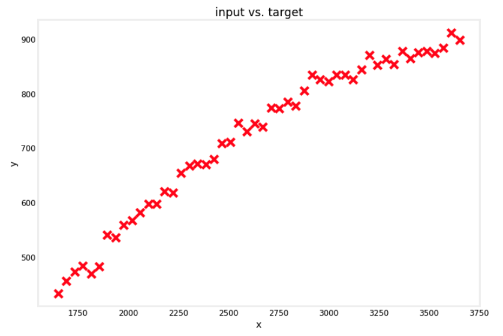

### Split the dataset into training, cross validation, and test sets

In previous labs, you might have used the entire dataset to train your models. In practice however, it is best to hold out a portion of your data to measure how well your model generalizes to new examples. This will let you know if the model has overfit to your training set.

As mentioned in the lecture, it is common to split your data into three parts:

* ***training set*** - used to train the model
* ***cross validation set (also called validation, development, or dev set)*** - used to evaluate the different model configurations you are choosing from. For example, you can use this to make a decision on what polynomial features to add to your dataset.
* ***test set*** - used to give a fair estimate of your chosen model's performance against new examples. This should not be used to make decisions while you are still developing the models.

Scikit-learn provides a [`train_test_split`](https://scikit-learn.org/stable/modules/generated/sklearn.model_selection.train_test_split.html) function to split your data into the parts mentioned above. In the code cell below, you will split the entire dataset into 60% training, 20% cross validation, and 20% test.

```py
# Get 60% of the dataset as the training set. Put the remaining 40% in temporary variables: x_ and y_.
x_train, x_, y_train, y_ = train_test_split(x, y, test_size=0.40, random_state=1)

# Split the 40% subset above into two: one half for cross validation and the other for the test set
x_cv, x_test, y_cv, y_test = train_test_split(x_, y_, test_size=0.50, random_state=1)

# Delete temporary variables
del x_, y_

print(f"the shape of the training set (input) is: {x_train.shape}")
print(f"the shape of the training set (target) is: {y_train.shape}\n")
print(f"the shape of the cross validation set (input) is: {x_cv.shape}")
print(f"the shape of the cross validation set (target) is: {y_cv.shape}\n")
print(f"the shape of the test set (input) is: {x_test.shape}")
print(f"the shape of the test set (target) is: {y_test.shape}")

# the shape of the training set (input) is: (30, 1)
# the shape of the training set (target) is: (30, 1)

# the shape of the cross validation set (input) is: (10, 1)
# the shape of the cross validation set (target) is: (10, 1)

# the shape of the test set (input) is: (10, 1)
# the shape of the test set (target) is: (10, 1)
```

You can plot the dataset again below to see which points were used as training, cross validation, or test data.

```py
utils.plot_train_cv_test(x_train, y_train, x_cv, y_cv, x_test, y_test, title="input vs. target")
```

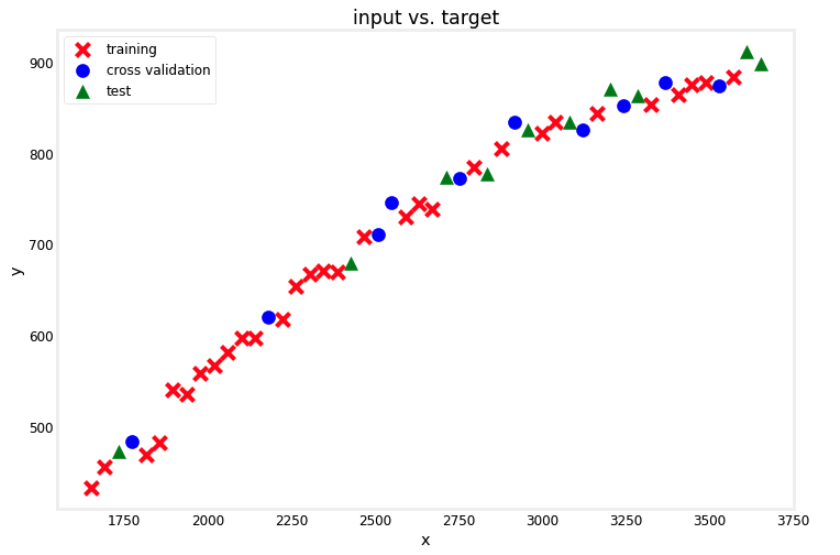

### Fit a linear model

Now that you have split the data, one of the first things you can try is to fit a linear model. You will do that in the next sections below.

#### Feature scaling

In the previous course of this specialization, you saw that it is usually a good idea to perform feature scaling to help your model converge faster. This is especially true if your input features have widely different ranges of values. Later in this lab, you will be adding polynomial terms so your input features will indeed have different ranges. For example, $x$ runs from around 1600 to 3600, while $x^2$ will run from 2.56 million to 12.96 million. 

You will only use $x$ for this first model but it's good to practice feature scaling now so you can apply it later. For that, you will use the [`StandardScaler`](https://scikit-learn.org/stable/modules/generated/sklearn.preprocessing.StandardScaler.html) class from scikit-learn. This computes the z-score of your inputs. As a refresher, the z-score is given by the equation:

$$ z = \frac{x - \mu}{\sigma} $$

where $\mu$ is the mean of the feature values and $\sigma$ is the standard deviation. The code below shows how to prepare the training set using the said class. You can plot the results again to inspect if it still follows the same pattern as before. The new graph should have a reduced range of values for `x`.

```py
# Initialize the class
scaler_linear = StandardScaler()

# Compute the mean and standard deviation of the training set then transform it
X_train_scaled = scaler_linear.fit_transform(x_train)

print(f"Computed mean of the training set: {scaler_linear.mean_.squeeze():.2f}")
print(f"Computed standard deviation of the training set: {scaler_linear.scale_.squeeze():.2f}")

# Computed mean of the training set: 2504.06
# Computed standard deviation of the training set: 574.85

# Plot the results
utils.plot_dataset(x=X_train_scaled, y=y_train, title="scaled input vs. target")
```
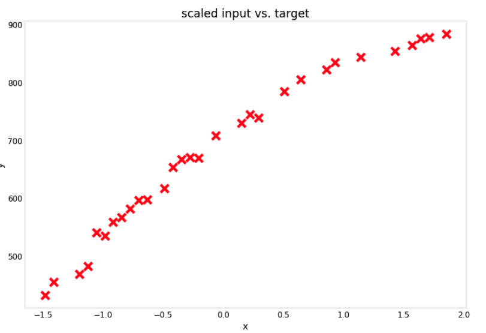

#### Train the model

Next, you will create and train a regression model. For this lab, you will use the [LinearRegression](https://scikit-learn.org/stable/modules/generated/sklearn.linear_model.LinearRegression.html) class but take note that there are other [linear regressors](https://scikit-learn.org/stable/modules/classes.html#classical-linear-regressors) which you can also use.

```py
# Initialize the class
linear_model = LinearRegression()

# Train the model
linear_model.fit(X_train_scaled, y_train )
```

#### Evaluate the Model

To evaluate the performance of your model, you will measure the error for the training and cross validation sets. For the training error, recall the equation for calculating the mean squared error (MSE):

$$J_{train}(\vec{w}, b) = \frac{1}{2m_{train}}\left[\sum_{i=1}^{m_{train}}(f_{\vec{w},b}(\vec{x}_{train}^{(i)}) - y_{train}^{(i)})^2\right]$$

Scikit-learn also has a built-in [`mean_squared_error()`](https://scikit-learn.org/stable/modules/generated/sklearn.metrics.mean_squared_error.html) function that you can use. Take note though that [as per the documentation](https://scikit-learn.org/stable/modules/model_evaluation.html#mean-squared-error), scikit-learn's implementation only divides by `m` and not `2*m`, where `m` is the number of examples. As mentioned in Course 1 of this Specialization (cost function lectures), dividing by `2m` is a convention we will follow but the calculations should still work whether or not you include it. Thus, to match the equation above, you can use the scikit-learn function then divide by 2 as shown below. We also included a for-loop implementation so you can check that it's equal. 

Another thing to take note: Since you trained the model on scaled values (i.e. using the z-score), you should also feed in the scaled training set instead of its raw values.

```py
# Feed the scaled training set and get the predictions
yhat = linear_model.predict(X_train_scaled)

# Use scikit-learn's utility function and divide by 2
print(f"training MSE (using sklearn function): {mean_squared_error(y_train, yhat) / 2}")
# training MSE (using sklearn function): 406.19374192533155

# for-loop implementation
total_squared_error = 0

for i in range(len(yhat)):
    squared_error_i  = (yhat[i] - y_train[i])**2
    total_squared_error += squared_error_i                                              

mse = total_squared_error / (2*len(yhat))

print(f"training MSE (for-loop implementation): {mse.squeeze()}")
# training MSE (for-loop implementation): 406.19374192533155
```

You can then compute the MSE for the cross validation set with basically the same equation:

$$J_{cv}(\vec{w}, b) = \frac{1}{2m_{cv}}\left[\sum_{i=1}^{m_{cv}}(f_{\vec{w},b}(\vec{x}_{cv}^{(i)}) - y_{cv}^{(i)})^2\right]$$

As with the training set, you will also want to scale the cross validation set. An *important* thing to note when using the z-score is you have to use the mean and standard deviation of the **training set** when scaling the cross validation set. This is to ensure that your input features are transformed as expected by the model. One way to gain intuition is with this scenario:

* Say that your training set has an input feature equal to `500` which is scaled down to `0.5` using the z-score.
* After training, your model is able to accurately map this scaled input `x=0.5` to the target output `y=300`. 
* Now let's say that you deployed this model and one of your users fed it a sample equal to `500`. 
* If you get this input sample's z-score using any other values of the mean and standard deviation, then it might not be scaled to `0.5` and your model will most likely make a wrong prediction (i.e. not equal to `y=300`). 

You will scale the cross validation set below by using the same `StandardScaler` you used earlier but only calling its [`transform()`](https://scikit-learn.org/stable/modules/generated/sklearn.preprocessing.StandardScaler.html#sklearn.preprocessing.StandardScaler.transform) method instead of [`fit_transform()`](https://scikit-learn.org/stable/modules/generated/sklearn.preprocessing.StandardScaler.html#sklearn.preprocessing.StandardScaler.fit_transform).

```py
# Scale the cross validation set using the mean and standard deviation of the training set
X_cv_scaled = scaler_linear.transform(x_cv)

print(f"Mean used to scale the CV set: {scaler_linear.mean_.squeeze():.2f}")
print(f"Standard deviation used to scale the CV set: {scaler_linear.scale_.squeeze():.2f}")
# Mean used to scale the CV set: 2504.06  
# Standard deviation used to scale the CV set: 574.85
# NOTICE: Both mean and stdv are the same as for the training set (because we used .transform() instead of .fit_transform())

# Feed the scaled cross validation set
yhat = linear_model.predict(X_cv_scaled)

# Use scikit-learn's utility function and divide by 2
print(f"Cross validation MSE: {mean_squared_error(y_cv, yhat) / 2}")
# Cross validation MSE: 551.7789026952216
```

### Adding Polynomial Features

From the graphs earlier, you may have noticed that the target `y` rises more sharply at smaller values of `x` compared to higher ones. A straight line might not be the best choice because the target `y` seems to flatten out as `x` increases. Now that you have these values of the training and cross validation MSE from the linear model, you can try adding polynomial features to see if you can get a better performance. The code will mostly be the same but with a few extra preprocessing steps. Let's see that below.

#### Create the additional features

First, you will generate the polynomial features from your training set. The code below demonstrates how to do this using the [`PolynomialFeatures`](https://scikit-learn.org/stable/modules/generated/sklearn.preprocessing.PolynomialFeatures.html) class. It will create a new input feature which has the squared values of the input `x` (i.e. degree=2).

```py
# Instantiate the class to make polynomial features
poly = PolynomialFeatures(degree=2, include_bias=False)

# Compute the number of features and transform the training set
X_train_mapped = poly.fit_transform(x_train)

# Preview the first 5 elements of the new training set. Left column is `x` and right column is `x^2`
# Note: The `e+<number>` in the output denotes how many places the decimal point should 
# be moved. For example, `3.24e+03` is equal to `3240`
print(X_train_mapped[:5])
# [[3.32e+03 1.11e+07]
#  [2.34e+03 5.50e+06]
#  [3.49e+03 1.22e+07]
#  [2.63e+03 6.92e+06]
#  [2.59e+03 6.71e+06]]
```
You will then scale the inputs as before to narrow down the range of values.

```py
# Instantiate the class
scaler_poly = StandardScaler()

# Compute the mean and standard deviation of the training set then transform it
X_train_mapped_scaled = scaler_poly.fit_transform(X_train_mapped)

# Preview the first 5 elements of the scaled training set.
print(X_train_mapped_scaled[:5])
# [[ 1.43  1.47]
#  [-0.28 -0.36]
#  [ 1.71  1.84]
#  [ 0.22  0.11]
#  [ 0.15  0.04]]
```

You can then proceed to train the model. After that, you will measure the model's performance against the cross validation set. Like before, you should make sure to perform the same transformations as you did in the training set. You will add the same number of polynomial features then scale the range of values.

```py
# Initialize the class
model = LinearRegression()

# Train the model
model.fit(X_train_mapped_scaled, y_train )

# Compute the training MSE
yhat = model.predict(X_train_mapped_scaled)
print(f"Training MSE: {mean_squared_error(y_train, yhat) / 2}")

# Add the polynomial features to the cross validation set
X_cv_mapped = poly.transform(x_cv)

# Scale the cross validation set using the mean and standard deviation of the training set
X_cv_mapped_scaled = scaler_poly.transform(X_cv_mapped)

# Compute the cross validation MSE
yhat = model.predict(X_cv_mapped_scaled)
print(f"Cross validation MSE: {mean_squared_error(y_cv, yhat) / 2}")
```

You'll notice that the MSEs are significantly better for both the training and cross validation set when you added the 2nd order polynomial. You may want to introduce more polynomial terms and see which one gives the best performance. As shown in class, you can have 10 different models like this:

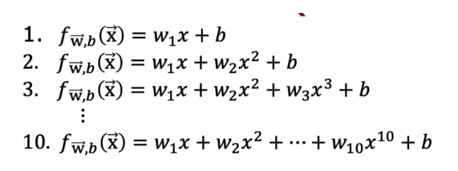

You can create a loop that contains all the steps in the previous code cells. Here is one implementation that adds polynomial features up to degree=10. We'll plot it at the end to make it easier to compare the results for each model.

```py
# Initialize lists to save the errors, models, and feature transforms
train_mses = []
cv_mses = []
models = []
polys = []
scalers = []

# Loop over 10 times. Each adding one more degree of polynomial higher than the last.
for degree in range(1,11):
    
    # Add polynomial features to the training set
    poly = PolynomialFeatures(degree, include_bias=False)
    X_train_mapped = poly.fit_transform(x_train)
    polys.append(poly)
    
    # Scale the training set
    scaler_poly = StandardScaler()
    X_train_mapped_scaled = scaler_poly.fit_transform(X_train_mapped)
    scalers.append(scaler_poly)
    
    # Create and train the model
    model = LinearRegression()
    model.fit(X_train_mapped_scaled, y_train )
    models.append(model)
    
    # Compute the training MSE
    yhat = model.predict(X_train_mapped_scaled)
    train_mse = mean_squared_error(y_train, yhat) / 2
    train_mses.append(train_mse)
    
    # Add polynomial features and scale the cross validation set
    X_cv_mapped = poly.transform(x_cv)
    X_cv_mapped_scaled = scaler_poly.transform(X_cv_mapped)
    
    # Compute the cross validation MSE
    yhat = model.predict(X_cv_mapped_scaled)
    cv_mse = mean_squared_error(y_cv, yhat) / 2
    cv_mses.append(cv_mse)
    
# Plot the results
degrees=range(1,11)
utils.plot_train_cv_mses(degrees, train_mses, cv_mses, title="degree of polynomial vs. train and CV MSEs")
```

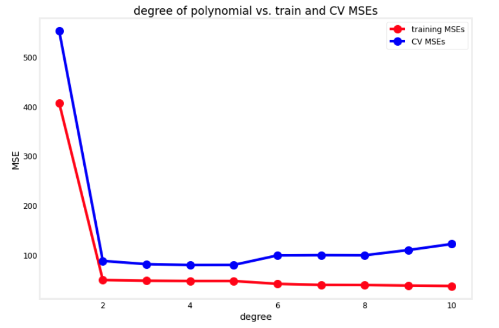

### Choosing the best model

When selecting a model, you want to choose one that performs well both on the training and cross validation set. It implies that it is able to learn the patterns from your training set without overfitting. 

If you used the defaults in this lab, you will notice a sharp drop in cross validation error from the models with degree=1 to degree=2. This is followed by a relatively flat line up to degree=5. After that, however, the cross validation error is generally getting worse as you add more polynomial features. Given these, you can decide to use the model with the lowest `cv_mse` as the one best suited for your application.

```py
# Get the model with the lowest CV MSE (add 1 because list indices start at 0)
# This also corresponds to the degree of the polynomial added
degree = np.argmin(cv_mses) + 1
print(f"Lowest CV MSE is found in the model with degree={degree}")
# Lowest CV MSE is found in the model with degree=4
```

You can then publish the generalization error by computing the test set's MSE. As usual, you should transform this data the same way you did with the training and cross validation sets.

```py
# Add polynomial features to the test set
X_test_mapped = polys[degree-1].transform(x_test)

# Scale the test set
X_test_mapped_scaled = scalers[degree-1].transform(X_test_mapped)

# Compute the test MSE
yhat = models[degree-1].predict(X_test_mapped_scaled)
test_mse = mean_squared_error(y_test, yhat) / 2

print(f"Training MSE: {train_mses[degree-1]:.2f}")
print(f"Cross Validation MSE: {cv_mses[degree-1]:.2f}")
print(f"Test MSE: {test_mse:.2f}")
# Training MSE: 47.15
# Cross Validation MSE: 79.43
# Test MSE: 104.63
```

### Neural Networks

The same model selection process can also be used when choosing between different neural network architectures. In this section, you will create the models shown below and apply it to the same regression task above.

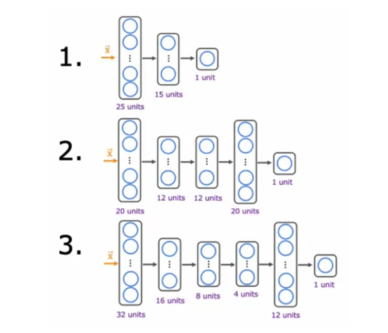

#### Prepare the Data

You will use the same training, cross validation, and test sets you generated in the previous section. From earlier lectures in this course, you may have known that neural networks can learn non-linear relationships so you can opt to skip adding polynomial features. The code is still included below in case you want to try later and see what effect it will have on your results. The default `degree` is set to `1` to indicate that it will just use `x_train`, `x_cv`, and `x_test` as is (i.e. without any additional polynomial features).

```py
# Add polynomial features
degree = 1
poly = PolynomialFeatures(degree, include_bias=False)
X_train_mapped = poly.fit_transform(x_train)
X_cv_mapped = poly.transform(x_cv)
X_test_mapped = poly.transform(x_test)
```

Next, you will scale the input features to help gradient descent converge faster. Again, notice that you are using the mean and standard deviation computed from the training set by just using `transform()` in the cross validation and test sets instead of `fit_transform()`.

```py
# Scale the features using the z-score
scaler = StandardScaler()
X_train_mapped_scaled = scaler.fit_transform(X_train_mapped)
X_cv_mapped_scaled = scaler.transform(X_cv_mapped)
X_test_mapped_scaled = scaler.transform(X_test_mapped)
```

#### Build and train the models

You will then create the neural network architectures shown earlier. The code is provided in the `build_models()` function in the `utils.py` file in case you want to inspect or modify it. You will use that in the loop below then proceed to train the models. For each model, you will also record the training and cross validation errors.

```py
# Initialize lists that will contain the errors for each model
nn_train_mses = []
nn_cv_mses = []

# Build the models
nn_models = utils.build_models()

# Loop over the the models
for model in nn_models:
    
    # Setup the loss and optimizer
    model.compile(
        loss='mse',
        optimizer=tf.keras.optimizers.Adam(learning_rate=0.1),
    )

    print(f"Training {model.name}...")
    
    # Train the model
    model.fit(
        X_train_mapped_scaled, y_train,
        epochs=300,
        verbose=0
    )
    
    print("Done!\n")

    
    # Record the training MSEs
    yhat = model.predict(X_train_mapped_scaled)
    train_mse = mean_squared_error(y_train, yhat) / 2
    nn_train_mses.append(train_mse)
    
    # Record the cross validation MSEs 
    yhat = model.predict(X_cv_mapped_scaled)
    cv_mse = mean_squared_error(y_cv, yhat) / 2
    nn_cv_mses.append(cv_mse)

    
# print results
print("RESULTS:")
for model_num in range(len(nn_train_mses)):
    print(
        f"Model {model_num+1}: Training MSE: {nn_train_mses[model_num]:.2f}, " +
        f"CV MSE: {nn_cv_mses[model_num]:.2f}"
        )
```

```py
Training model_1...
Done!

Training model_2...
Done!

Training model_3...
Done!

RESULTS:
Model 1: Training MSE: 60.70, CV MSE: 126.37
Model 2: Training MSE: 48.01, CV MSE: 110.09
Model 3: Training MSE: 40.40, CV MSE: 62.73
```
From the recorded errors, you can decide which is the best model for your application. Look at the results above and see if you agree with the selected `model_num` below. Finally, you will compute the test error to estimate how well it generalizes to new examples.

```py
# Select the model with the lowest CV MSE
model_num = 3

# Compute the test MSE
yhat = nn_models[model_num-1].predict(X_test_mapped_scaled)
test_mse = mean_squared_error(y_test, yhat) / 2

print(f"Selected Model: {model_num}")
print(f"Training MSE: {nn_train_mses[model_num-1]:.2f}")
print(f"Cross Validation MSE: {nn_cv_mses[model_num-1]:.2f}")
print(f"Test MSE: {test_mse:.2f}")
```
```py
Selected Model: 3
Training MSE: 44.56
Cross Validation MSE: 88.51
Test MSE: 87.77
```

### Classification

In this last part of the lab, you will practice model evaluation and selection on a classification task. The process will be similar, with the main difference being the computation of the errors. You will see that in the following sections.

#### Load the Dataset

First, you will load a dataset for a binary classification task. It has 200 examples of two input features (`x1` and `x2`), and a target `y` of either `0` or `1`.

```py
# Load the dataset from a text file
data = np.loadtxt('./data/data_w3_ex2.csv', delimiter=',')

# Split the inputs and outputs into separate arrays
x_bc = data[:,:-1]
y_bc = data[:,-1]

# Convert y into 2-D because the commands later will require it (x is already 2-D)
y_bc = np.expand_dims(y_bc, axis=1)

print(f"the shape of the inputs x is: {x_bc.shape}")
print(f"the shape of the targets y is: {y_bc.shape}")

# the shape of the inputs x is: (200, 2)
# the shape of the targets y is: (200, 1)
```

You can plot the dataset to examine how the examples are separated.
```py
utils.plot_bc_dataset(x=x_bc, y=y_bc, title="x1 vs. x2")
```
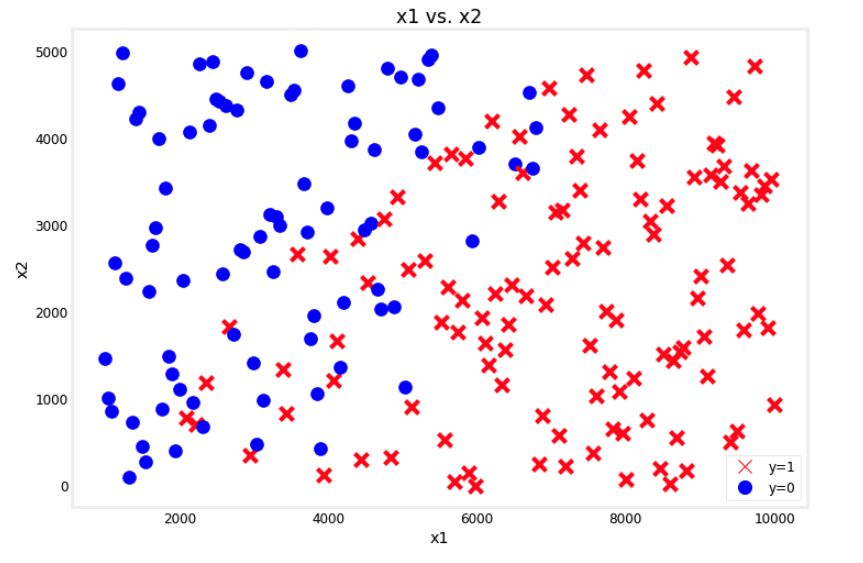

#### Split and prepare the dataset

Next, you will generate the training, cross validation, and test sets. You will use the same 60/20/20 proportions as before. You will also scale the features as you did in the previous section.

```py
from sklearn.model_selection import train_test_split

# Get 60% of the dataset as the training set. Put the remaining 40% in temporary variables.
x_bc_train, x_, y_bc_train, y_ = train_test_split(x_bc, y_bc, test_size=0.40, random_state=1)

# Split the 40% subset above into two: one half for cross validation and the other for the test set
x_bc_cv, x_bc_test, y_bc_cv, y_bc_test = train_test_split(x_, y_, test_size=0.50, random_state=1)

# Delete temporary variables
del x_, y_

print(f"the shape of the training set (input) is: {x_bc_train.shape}")
print(f"the shape of the training set (target) is: {y_bc_train.shape}\n")
print(f"the shape of the cross validation set (input) is: {x_bc_cv.shape}")
print(f"the shape of the cross validation set (target) is: {y_bc_cv.shape}\n")
print(f"the shape of the test set (input) is: {x_bc_test.shape}")
print(f"the shape of the test set (target) is: {y_bc_test.shape}")

# the shape of the training set (input) is: (120, 2)
# the shape of the training set (target) is: (120, 1)

# the shape of the cross validation set (input) is: (40, 2)
# the shape of the cross validation set (target) is: (40, 1)

# the shape of the test set (input) is: (40, 2)
# the shape of the test set (target) is: (40, 1)
```

```py
# Scale the features

# Initialize the class
scaler_linear = StandardScaler()

# Compute the mean and standard deviation of the training set then transform it
x_bc_train_scaled = scaler_linear.fit_transform(x_bc_train)
x_bc_cv_scaled = scaler_linear.transform(x_bc_cv)
x_bc_test_scaled = scaler_linear.transform(x_bc_test)
```

#### Evaluating the error for classification models

In the previous sections on regression models, you used the mean squared error to measure how well your model is doing. For classification, you can get a similar metric by getting the fraction of the data that the model has misclassified. For example, if your model made wrong predictions for 2 samples out of 5, then you will report an error of `40%` or `0.4`. The code below demonstrates this using a for-loop and also with Numpy's [`mean()`](https://numpy.org/doc/stable/reference/generated/numpy.mean.html) function. 

```py
# Sample model output
probabilities = np.array([0.2, 0.6, 0.7, 0.3, 0.8])

# Apply a threshold to the model output. If greater than 0.5, set to 1. Else 0.
predictions = np.where(probabilities >= 0.5, 1, 0)

# Ground truth labels
ground_truth = np.array([1, 1, 1, 1, 1])

# Initialize counter for misclassified data
misclassified = 0

# Get number of predictions
num_predictions = len(predictions)

# Loop over each prediction
for i in range(num_predictions):
    
    # Check if it matches the ground truth
    if predictions[i] != ground_truth[i]:
        
        # Add one to the counter if the prediction is wrong
        misclassified += 1

# Compute the fraction of the data that the model misclassified
fraction_error = misclassified/num_predictions

print(f"probabilities: {probabilities}")
print(f"predictions with threshold=0.5: {predictions}")
print(f"targets: {ground_truth}")
print(f"fraction of misclassified data (for-loop): {fraction_error}")
print(f"fraction of misclassified data (with np.mean()): {np.mean(predictions != ground_truth)}")

# probabilities: [0.2 0.6 0.7 0.3 0.8]
# predictions with threshold=0.5: [0 1 1 0 1]
# targets: [1 1 1 1 1]
# fraction of misclassified data (for-loop): 0.4
# fraction of misclassified data (with np.mean()): 0.4
```

#### Build and train the model

You will use the same neural network architectures in the previous section so you can call the `build_models()` function again to create new instances of these models. 

You will follow the recommended approach mentioned last week where you use a `linear` activation for the output layer (instead of `sigmoid`) then set `from_logits=True` when declaring the loss function of the model. You will use the [binary crossentropy loss](https://www.tensorflow.org/api_docs/python/tf/keras/losses/BinaryCrossentropy) because this is a binary classification problem.

After training, you will use a [sigmoid function](https://www.tensorflow.org/api_docs/python/tf/math/sigmoid) to convert the model outputs into probabilities. From there, you can set a threshold and get the fraction of misclassified examples from the training and cross validation sets.

You can see all these in the code cell below.

```py
# Initialize lists that will contain the errors for each model
nn_train_error = []
nn_cv_error = []

# Build the models
models_bc = utils.build_models()

# Loop over each model
for model in models_bc:
    
    # Setup the loss and optimizer
    model.compile(
    loss=tf.keras.losses.BinaryCrossentropy(from_logits=True),
    optimizer=tf.keras.optimizers.Adam(learning_rate=0.01),
    )

    print(f"Training {model.name}...")

    # Train the model
    model.fit(
        x_bc_train_scaled, y_bc_train,
        epochs=200,
        verbose=0
    )
    
    print("Done!\n")
    
    # Set the threshold for classification
    threshold = 0.5
    
    # Record the fraction of misclassified examples for the training set
    yhat = model.predict(x_bc_train_scaled)
    yhat = tf.math.sigmoid(yhat)
    yhat = np.where(yhat >= threshold, 1, 0)
    train_error = np.mean(yhat != y_bc_train)
    nn_train_error.append(train_error)

    # Record the fraction of misclassified examples for the cross validation set
    yhat = model.predict(x_bc_cv_scaled)
    yhat = tf.math.sigmoid(yhat)
    yhat = np.where(yhat >= threshold, 1, 0)
    cv_error = np.mean(yhat != y_bc_cv)
    nn_cv_error.append(cv_error)

# Print the result
for model_num in range(len(nn_train_error)):
    print(
        f"Model {model_num+1}: Training Set Classification Error: {nn_train_error[model_num]:.5f}, " +
        f"CV Set Classification Error: {nn_cv_error[model_num]:.5f}"
        )
```

```py
Training model_1...
Done!

Training model_2...
Done!

Training model_3...
Done!

Model 1: Training Set Classification Error: 0.05833, CV Set Classification Error: 0.17500
Model 2: Training Set Classification Error: 0.06667, CV Set Classification Error: 0.15000
Model 3: Training Set Classification Error: 0.05000, CV Set Classification Error: 0.15000
```

From the output above, you can choose which one performed best. If there is a tie on the cross validation set error, then you can add another criteria to break it. For example, you can choose the one with a lower training error. A more common approach is to choose the smaller model because it saves computational resources. In our example, Model 1 is the smallest and Model 3 is the largest.

Finally, you can compute the test error to report the model's generalization error.

```py
# Select the model with the lowest error
model_num = 3

# Compute the test error
yhat = models_bc[model_num-1].predict(x_bc_test_scaled)
yhat = tf.math.sigmoid(yhat)
yhat = np.where(yhat >= threshold, 1, 0)
nn_test_error = np.mean(yhat != y_bc_test)

print(f"Selected Model: {model_num}")
print(f"Training Set Classification Error: {nn_train_error[model_num-1]:.4f}")
print(f"CV Set Classification Error: {nn_cv_error[model_num-1]:.4f}")
print(f"Test Set Classification Error: {nn_test_error:.4f}")

# Selected Model: 3
# Training Set Classification Error: 0.0500
# CV Set Classification Error: 0.1500
# Test Set Classification Error: 0.1750
```