# Advice for applying machine learning

## Debugging ML: Deciding what to try next

The efficiency of how quickly we can get a machine learning system to work well will depend to a large part on how well we can repeatedly make good decisions about what to do next in the course of a machine learning project. 

So let's see a number of tips on h**ow to make decisions** about what to do next in machine learning project, that I hope will end up saving we a lot of time, and some **advice on how to build machine learning systems**. 

Let's start with an example: we've implemented regularized linear regression to predict housing prices, so we have the usual cost function for our learning algorithm: squared error plus this regularization term.

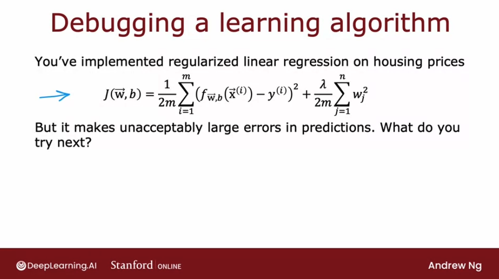

But if we train the model, and **find that it makes unacceptably large errors in it's predictions, what do we try next?:** 

- Get more training examples
- Try smaller sets of features, if we have too many
- Try getting additional features
- Try adding polynomial features ($x_1^2$, $x^2_2$, $x_1x_2$, etc)
- Try decreasing $\lambda$
- Try increasing $\lambda$

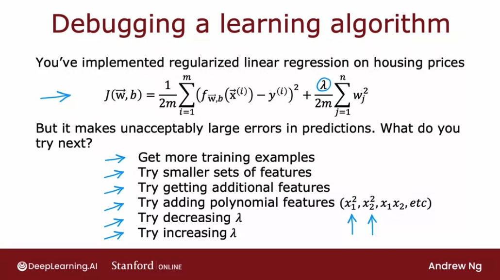

On any given machine learning application, it will often turn out that some of these things could be fruitful, and some of these things not fruitful. **The key to being effective at how we build a machine learning algorithm will be if we can find a way to make good choices about where to invest our time.** 

So we'll learn about how to carry out a set of diagnostics: 

**Diagnostic**: **a test that we can run to gain insight into what is or isn't working with learning algorithm to gain guidance into improving its performance**. 

Some of these diagnostics will tell us things like, if is it worth weeks, or even months collecting more training data, because if it is, then we can then go ahead and make the investment to get more data, which will hopefully lead to improved performance, or if it isn't then running that diagnostic could have saved we months of time. 

**Diagnostics can take time to implement, but running them can be a very good use of our time.**

## Evaluating a model

**How do we evaluate that model's performance? Having a systematic way to evaluate performance will also hope paint a clearer path for how to improve its performance.**

Let's take the example of learning to predict housing prices as a function of the size. Let's say we've trained the model to predict housing prices as a function of the size $x$ and the model is a fourth order polynomial.

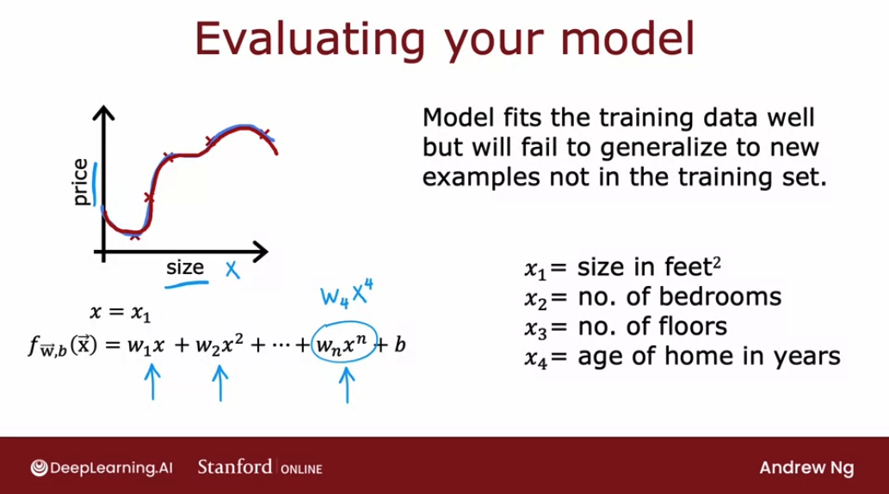

Because we fit a fourth order polynomial to a training set with five data points,the training data really well. But it will fail to generalize to new examples that aren't in the training set (overfitted data).

When we have a model with a single feature, such as the size of the house, we could plot the model to see that the curve is very wiggly, so we know this is probably isn't a good model. But if we traing model with more features then it becomes much harder to plot the model?

So in order to tell if our model is doing well, we will need some **more systematic way to evaluate how well our model is doing**. 

We can use the techinque of splitting into a **training set and a test set**.

If we have a training set (in the following example, a small training set with just 10 examples), **rather than taking all our data to train the parameters $w$ and $b$** of the model, we can **instead split the training set into two subsets**. We can put 70% of the data into the first part and call that the **training set**. And the second part of the data, the 30% of the data, will be called **test set**.

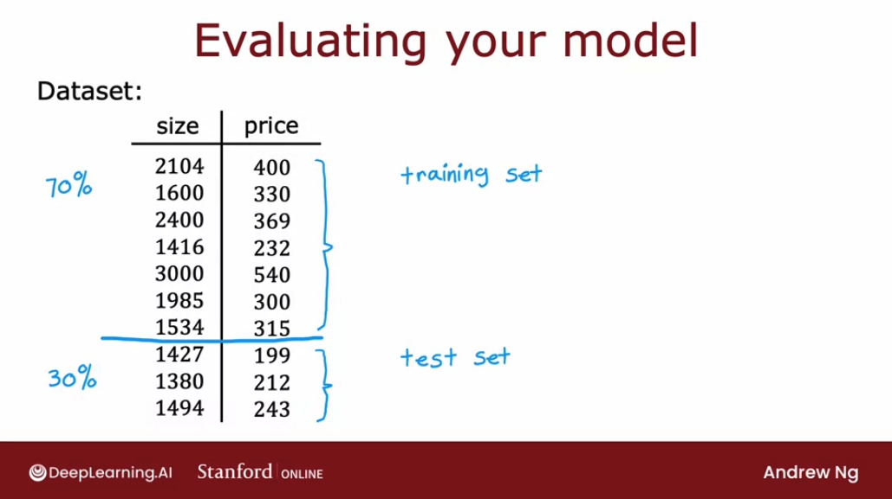

And notice that we will have new notation for out training data according to this split:

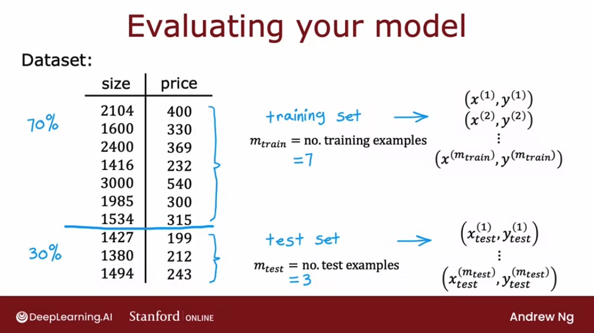

$$m_{train} = \text{no. training examples}$$
$$m_{test} = \text{no. test examples}$$

So, in order to train a model and evaluated it, the following is the formula if we're using linear regression with a squared error cost. We **start off by fitting the parameters by minimizing the cost function $J(w,b)$**. This is the usual cost function minimize over the $w$ and $b$ parameters of the square error cost, plus the regularization term.

$$J(\vec{\mathbf{w}},b) = \frac{1}{2m_{train}} \sum\limits_{i = 1}^{m_{train}} (f_{\vec{\mathbf{w}},b}(\mathbf{\vec{x}}^{(i)}) - y^{(i)})^2  + \frac{\lambda}{2m_{train}} \sum\limits_{j = i}^{n} w_j^2$$

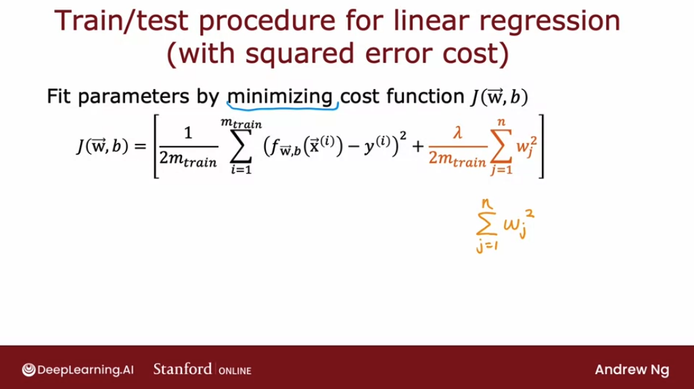

And then to tell how well this model is doing we would compute $J_{test}(\vec{\mathbf{w}},b)$ **which is equal to the average error on the test set**, a prediction on the $i^{th}$ test example input minus the actual price of the house on the test example, squared. And notice that the test error formula $J_{test}$, it does not include that regularization term:

$$J_{test}(\vec{\mathbf{w}},b) = \frac{1}{2m_{test}} \sum\limits_{i = 1}^{m_{test}} (f_{\vec{\mathbf{w}},b}(\mathbf{\vec{x}}_{test}^{(i)}) - y^{(i)}_{test})^2  $$

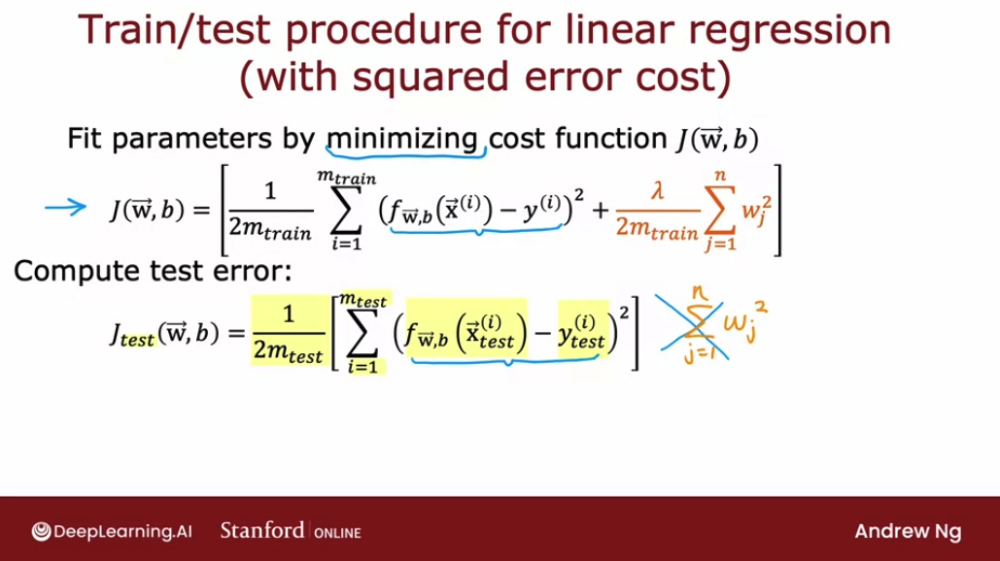

One other quantity that's often useful to computer as well as is **the training error, a measure of how well the learning algorithm is doing on the training set**. 

$$J_{train}(\vec{\mathbf{w}},b) = \frac{1}{2m_{train}} \sum\limits_{i = 1}^{m_{train}} (f_{\vec{\mathbf{w}},b}(\mathbf{\vec{x}}_{train}^{(i)}) - y^{(i)}_{train})^2  $$

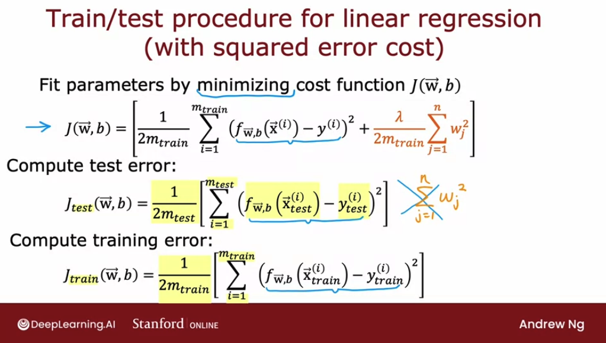

So, in the model like what we saw earlier in this section, $J_{train}$ will be low because the average error on our training examples will be zero or very close to zero, $thus J_{train}$ will be very close to zero.

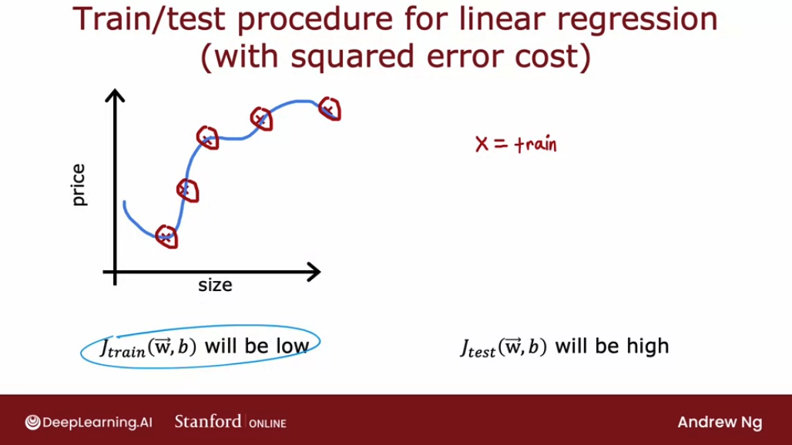

But if we have a few additional examples in our test set that the algorithm had not trained on, then those test examples will have a large gap between what the algorithm is predicting as the estimated housing price, and the actual value of those housing prices. And so, $J_{test}$.

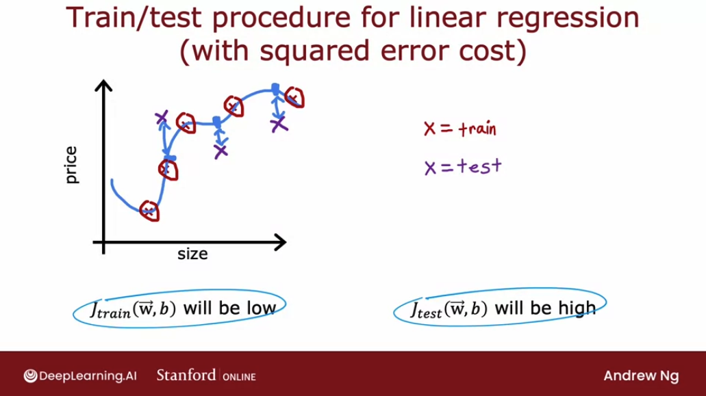

Knowing that $J_{test}$ is high on this model gives us a way to realize that the model is actually not so good at generalizing to new examples or new data points that were not in the training set. 

Now, let's take a look at how we apply this procedure to a classification problem, for example, if we are classifying between handwritten digits that are either 0 or 1.

Same as before, we fit the parameters by minimizing the cost function to find the parameters $w$ and $b$. For example, if we were training logistic regression, then the cost function $J(w,b)$ would be:

$$J(\mathbf{w},b) = -\frac{1}{m_{train}}  \sum_{i=0}^{m_{train}-1} \left[ y^{(i)} \log\left(f_{\mathbf{w},b}\left( \mathbf{x}^{(i)} \right) \right) + \left( 1 - y^{(i)}\right) \log \left( 1 - f_{\mathbf{w},b}\left( \mathbf{x}^{(i)} \right) \right) \right] + \frac{\lambda}{2m_{train}}  \sum_{j=0}^{n-1} w_j^2$$

And to **compute the test error**:

$$J_{test}(\mathbf{w},b) = -\frac{1}{m_{test}}  \sum_{i=0}^{m_{test}-1} \left[ y^{(i)} \log\left(f_{\mathbf{w},b}\left( \mathbf{x}^{(i)} \right) \right) + \left( 1 - y^{(i)}\right) \log \left( 1 - f_{\mathbf{w},b}\left( \mathbf{x}^{(i)} \right) \right) \right]$$

And to **compute the train error**:

$$J_{train}(\mathbf{w},b) = -\frac{1}{m_{train}}  \sum_{i=0}^{m_{train}-1} \left[ y^{(i)} \log\left(f_{\mathbf{w},b}\left( \mathbf{x}^{(i)} \right) \right) + \left( 1 - y^{(i)}\right) \log \left( 1 - f_{\mathbf{w},b}\left( \mathbf{x}^{(i)} \right) \right) \right]$$

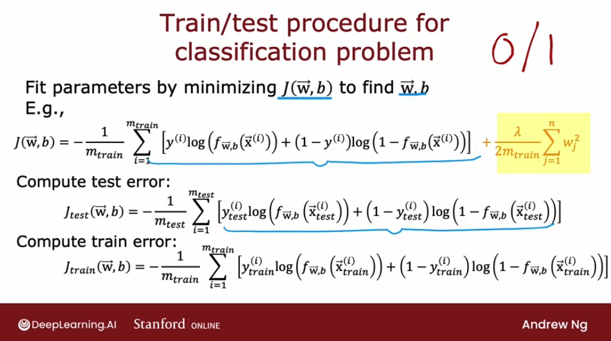

This will work OK for figuring out if our learning algorithm is doing well, by seeing how our algorithm is doing in terms of test error. 

But when applying machine learning to classification problems, there's actually **another definition of $J_{test}$ and $J_{train}$ that is even more commonly used.**

And that is: **measure what the fraction of the test set and the fraction of the training set that the algorithm has misclassified**.

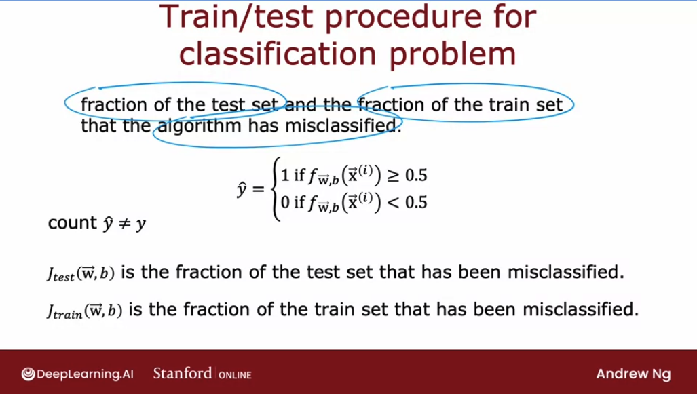

Since we can have the algorithm make a prediction 1 or 0 on every test example, w**e can then count up in the test set the fraction of examples where $y_hat$ is not equal to the actual ground truth label $y$.**.

## Model selection and training/cross validation/test sets

In the last video, we saw how to use the test set to evaluate the performance of a model. Let's make one further refinement to that idea in this video, which allow we to use the technique, to automatically choose a good model for our machine learning algorithm. One thing we've seen is that once the model's parameters w and b have been fit to the training set. 

The training error may not be a good indicator of how well the algorithm will do or how well it will generalize to new examples that were not in the training set, and in particular, for this example, the training error will be pretty much zero. That's likely much lower than the actual generalization error, and by that I mean the average error on new examples that were not in the training set. What we saw on the last video is that J test the performance of the algorithm on examples, is not trained on, that will be a better indicator of how well the model will likely do on new data. 

By that I mean other data that's not in the training set. Let's take a look at how this affects, how we might use a test set to choose a model for a given machine learning application. If a fitting a function to predict housing prices or some other regression problem, one model we might consider is to fit a linear model like this. 

This is a first-order polynomial and we're going to use d equals 1 on this slide to denote fitting a one or first-order polynomial. If we were to fit a model like this to our training set, we get some parameters, w and b, and we can then compute J tests to estimate how well does this generalize to new data? On this slide, we're going to use w^1, b^1 to denote that these are the parameters we get if we were to fit a first order polynomial, a degree one, d equals 1 polynomial. 

Now, we might also consider fitting a second-order polynomial or quadratic model, so this is the model. If we were to fit this to our training set, we would get some parameters, w^2, b^2, and we can then similarly evaluate those parameters on our test set and get J test w^2, b^2, and this will give we a sense of how well the second-order polynomial does. we can go on to try d equals 3, that's a third order or a degree three polynomial that looks like this, and fit parameters and similarly get J test. 

we might keep doing this until, say we try up to a 10th order polynomial and we end up with J test of w^10, b^10. That gives we a sense of how well the 10th order polynomial is doing. One procedure we could try, this turns out not to be the best procedure, but one thing we could try is, look at all of these J tests, and see which one gives we the lowest value. 

Say, we find that, J test for the fifth order polynomial for w^5, b^5 turns out to be the lowest. If that's the case, then we might decide that the fifth order polynomial d equals 5 does best, and choose that model for our application. If we want to estimate how well this model performs, one thing we could do, but this turns out to be a slightly flawed procedure, is to report the test set error, J test w^5, b^5. 

The reason this procedure is flawed is J test of w^5, b^5 is likely to be an optimistic estimate of the generalization error. In other words, it is likely to be lower than the actual generalization error, and the reason is, in the procedure we talked about on this slide with basic fits, one extra parameter, which is d, the degree of polynomial, and we chose this parameter using the test set. On the previous slide, we saw that if we were to fit w, b to the training data, then the training data would be an overly optimistic estimate of generalization error. 

It turns out too, that if we want to choose the parameter d using the test set, then the test set J test is now an overly optimistic, that is lower than actual estimate of the generalization error. The procedure on this particular slide is flawed and I don't recommend using this. Instead, if we want to automatically choose a model, such as decide what degree polynomial to use. 

Here's how we modify the training and testing procedure in order to carry out model selection. Whereby model selection, I mean choosing amongst different models, such as these 10 different models that we might contemplate using for our machine learning application. The way we'll modify the procedure is instead of splitting our data into just two subsets, the training set and the test set, we're going to split our data into three different subsets, which we're going to call the training set, the cross-validation set, and then also the test set. 

Using our example from before of these 10 training examples, we might split it into putting 60 percent of the data into the training set and so the notation we'll use for the training set portion will be the same as before, except that now M train, the number of training examples will be six and we might put 20 percent of the data into the cross-validation set and a notation we're going to use is $x_cv$ of one, $y_cv$ of one for the first cross-validation example. So cv stands for cross-validation, all the way down to $x_cv$ of $m_cv$ and $y_cv$ of $m_cv$. Where here, $m_cv$ equals 2 in this example, is the number of cross-validation examples. 

Then finally we have the test set same as before, so x1 through x m tests and y1 through y m, where m tests equal to 2. This is the number of test examples. We'll see we on the next slide how to use the cross-validation set. 

The way we'll modify the procedure is we've already seen the training set and the test set and we're going to introduce a new subset of the data called the cross-validation set. The name cross-validation refers to that this is an extra dataset that we're going to use to check or cross check the validity or really the accuracy of different models. I don t think it's a great name, but that is what people in machine learning have gotten to call this extra dataset. 

we may also hear people call this the validation set for short, it's just fewer syllables than cross-validation or in some applications, people also call this the development set. Means basically the same thing or for short. Sometimes we hear people call this the dev set, but all of these terms mean the same thing as cross-validation set. 

I personally use the term dev set the most often because it's the shortest, fastest way to say it but cross-validation is pretty used a little bit more often by machine learning practitioners. Onto these three subsets of the data training set, cross-validation set, and test set, we can then compute the training error, the cross-validation error, and the test error using these three formulas. Whereas usual, none of these terms include the regularization term that is included in the training objective, and this new term in the middle, the cross-validation error is just the average over our $m_cv$ cross-validation examples of the average say, squared error. 

This term, in addition to being called cross-validation error, is also commonly called the validation error for short, or even the development set error, or the dev error. Armed with these three measures of learning algorithm performance, this is how we can then go about carrying out model selection. we can, with the 10 models, same as earlier on this slide, with d equals 1, d equals 2, all the way up to a 10th degree or the 10th order polynomial, we can then fit the parameters $w_1$, $b_1$. 

But instead of evaluating this on our test set, we will instead evaluate these parameters on our cross-validation sets and compute $J_cv$ of w1, b1, and similarly, for the second model, we get $J_cv$ of w2, v2, and all the way down to $J_cv$ of w10, b10. Then, in order to choose a model, we will look at which model has the lowest cross-validation error, and concretely, let's say that $J_cv$ of w4, b4 as low as, then what that means is we pick this fourth-order polynomial as the model we will use for this application. Finally, if we want to report out an estimate of the generalization error of how well this model will do on new data. 

we will do so using that third subset of our data, the test set and we report out Jtest of w4,b4. we notice that throughout this entire procedure, we had fit these parameters using the training set. we then chose the parameter d or chose the degree of polynomial using the cross-validation set and so up until this point, we've not fit any parameters, either w or b or d to the test set and that's why Jtest in this example will be fair estimate of the generalization error of this model thus parameters w4,b4. 

This gives a better procedure for model selection and it lets we automatically make a decision like what order polynomial to choose for our linear regression model. This model selection procedure also works for choosing among other types of models. For example, choosing a neural network architecture. 

If we are fitting a model for handwritten digit recognition, we might consider three models like this, maybe even a larger set of models than just me but here are a few different neural networks of small, somewhat larger, and then even larger. To help we decide how many layers do the neural network have and how many hidden units per layer should we have, we can then train all three of these models and end up with parameters w1, b1 for the first model, w2, b2 for the second model, and w3,b3 for the third model. we can then evaluate the neural networks performance using Jcv, using our cross-validation set Since this is a classification problem, Jcv the most common choice would be to compute this as the fraction of cross-validation examples that the algorithm has misclassified. 

we would compute this using all three models and then pick the model with the lowest cross validation error. If in this example, this has the lowest cross validation error, we will then pick the second neural network and use parameters trained on this model and finally, if we want to report out an estimate of the generalization error, we then use the test set to estimate how well the neural network that we just chose will do. It's considered best practice in machine learning that if we have to make decisions about our model, such as fitting parameters or choosing the model architecture, such as neural network architecture or degree of polynomial if we're fitting a linear regression, to make all those decisions only using our training set and our cross-validation set, and to not look at the test set at all while we're still making decisions regarding our learning algorithm. 

It's only after we've come up with one model as our final model to only then evaluate it on the test set and because we haven't made any decisions using the test set, that ensures that our test set is a fair and not overly optimistic estimate of how well our model will generalize to new data. That's model selection and this is actually a very widely used procedure. I use this all the time to automatically choose what model to use for a given machine learning application. 

Earlier this week, I mentioned running diagnostics to decide how to improve the performance of a learning algorithm. Now that we have a way to evaluate learning algorithms and even automatically choose a model, let's dive more deeply into examples of some diagnostics. The most powerful diagnostic that I know of and that I used for a lot of machine learning applications is one called bias and variance. 

Let's take a look at what that means in the next video.