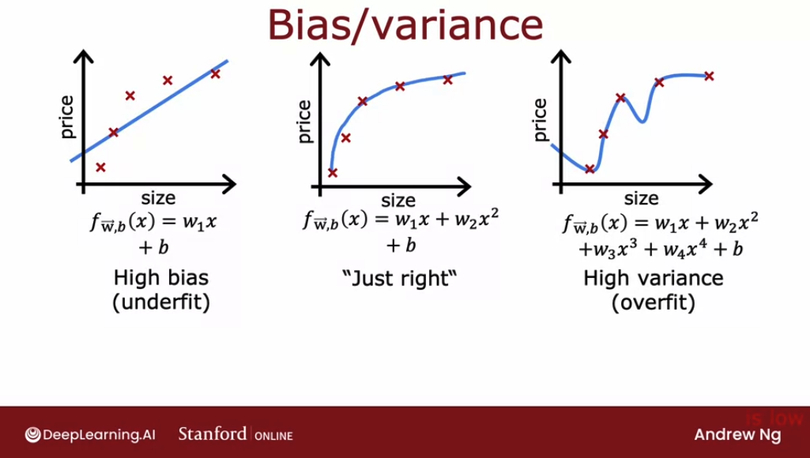

# Bias and variance

## Diagnosing bias and variance

When we're training a machine learning model, it pretty much never works  well the first time.The key to the process of building machine learning systems is how to decide what to do next in order to improve his performance. 

**Looking at the bias and variance of a learning algorithm gives we very good guidance on what to try next.** Let's take a look at what this means. 

Let's remember remember the following example from the first course on linear regression, where we have:
- a linear model with **high bias (underfits)**
- a fourth order model with **high variance (overfits)**
- a quadratic model that is "just right"

Because this is a problem with just a single feature $x$, we can plot them an analyze the shape of the graph. But if we had more features, we can't plot $f(x)$ and visualize them.

So instead of trying to look at plots, **a more systematic way to diagnose or to find out if our algorithm has high bias or high variance will be to look at the performance of our algorithm on the training set and on the cross validation set**. 

In particular, let's look at the example on the left. If we were to compute $J_{train}$, how well does the algorithm do on the training set? Not that well. 

**$J_{train}$** here would be **high** because **there are actually large errors between the examples and the actual predictions of the model.**

In the case of $J_{cv}$ would be if we had a few new examples, maybe examples like that, that the algorithm had not previously seen. 

Here the algorithm also doesn't do that well on examples that it had not previously seen, so $J_cv$ will also be high. One characteristic of an algorithm with high bias, something that is under fitting, is that it's not even doing that well on the training set. When $J_train$ is high, that is our strong indicator that this algorithm has high bias. 

Let's now look at the example on the right. If we were to compute $J_train$, how well is this doing on the training set? Well, it's actually doing great on the training set. 

Fits the training data really well. $J_train$ here will be low. But if we were to evaluate this model on other houses not in the training set, then we find that $J_cv$, the cross-validation error, will be quite high. 

A characteristic signature or a characteristic Q that our algorithm has high variance will be of $J_cv$ is much higher than $J_train$. In other words, it does much better on data it has seen than on data it has not seen. This turns out to be a strong indicator that our algorithm has high variance. 

Again, the point of what we're doing is that we're computing $J_train$ and $J_cv$ and seeing if J $_train$ is high or if $J_cv$ is much higher than $J_train$. This gives we a sense, even if we can't plot to function f, of whether our algorithm has high bias or high variance. Finally, the case in the middle. 

If we look at $J_train$, it's pretty low, so this is doing quite well on the training set. If we were to look at a few new examples, like those from, say, our cross-validation set, we find that $J_cv$ is also a pretty low. $J_train$ not being too high indicates this doesn't have a high bias problem and $J_cv$ not being much worse than $J_train$ this indicates that it doesn't have a high variance problem either. 

Which is why the quadratic model seems to be a pretty good one for this application. To summarize, when d equals 1 for a linear polynomial, $J_train$ was high and $J_cv$ was high. When d equals 4, J train was low, but $J_cv$ is high. 

When d equals 2, both were pretty low. Let's now take a different view on bias and variance. In particular, on the next slide I'd like to show we how $J_train$ and $J_cv$ variance as a function of the degree of the polynomial we're fitting. 

Let me draw a figure where the horizontal axis, this d here, will be the degree of polynomial that we're fitting to the data. Over on the left we'll correspond to a small value of d, like d equals 1, which corresponds to fitting straight line. Over to the right we'll correspond to, say, d equals 4 or even higher values of d. 

We're fitting this high order polynomial. So if we were to plot J train or W, B as a function of the degree of polynomial, what we find is that as we fit a higher and higher degree polynomial, here we're assuming we're not using regularization, but as we fit a higher and higher order polynomial, the training error will tend to go down because when we have a very simple linear function, it doesn't fit the training data that well, when we fit a quadratic function or third order polynomial or fourth-order polynomial, it fits the training data better and better. As the degree of polynomial increases, J train will typically go down. 

Next, let's look at $J_cv$, which is how well does it do on data that it did not get to fit to? What we saw was when d equals one, when the degree of polynomial was very low, $J_cv$ was pretty high because it underfits, so it didn't do well on the cross validation set. Here on the right as well, when the degree of polynomial is very large, say four, it doesn't do well on the cross-validation set either, and so it's also high. 

But if d was in-between say, a second-order polynomial, then it actually did much better. If we were to vary the degree of polynomial, we'd actually get a curve that looks like this, which comes down and then goes back up. Where if the degree of polynomial is too low, it underfits and so doesn't do the cross validation set, if it is too high, it overfits and also doesn't do well on the cross validation set. 

Is only if it's somewhere in the middle, that is just right, which is why the second-order polynomial in our example ends up with a lower cross-validation error and neither high bias nor high-variance. To summarize, how do we diagnose bias and variance in our learning algorithm? If our learning algorithm has high bias or it has undefeated data, the key indicator will be if J train is high. 

That corresponds to this leftmost portion of the curve, which is where J train as high. Usually we have J train and $J_cv$ will be close to each other. How do we diagnose if we have high variance? 

While the key indicator for high-variance will be if $J_cv$ is much greater than J train does double greater than sign in math refers to a much greater than, so this is greater, and this means much greater. This rightmost portion of the plot is where $J_cv$ is much greater than J train. Usually J train will be pretty low, but the key indicator is whether $J_cv$ is much greater than J train. 

That's what happens when we had fit a very high order polynomial to this small dataset. Even though we've just seen bias in the areas, it turns out, in some cases, is possible to simultaneously have high bias and have high-variance. we won't see this happen that much for linear regression, but it turns out that if we're training a neural network, there are some applications where unfortunately we have high bias and high variance. 

One way to recognize that situation will be if J train is high, so we're not doing that well on the training set, but even worse, the cross-validation error is again, even much larger than the training set. The notion of high bias and high variance, it doesn't really happen for linear models applied to 1D. But to give intuition about what it looks like, it would be as if for part of the input, we had a very complicated model that overfit, so it overfits to part of the inputs. 

But then for some reason, for other parts of the input, it doesn't even fit the training data well, and so it underfits for part of the input. In this example, which looks artificial because it's a single feature input, we fit the training set really well and we overfit in part of the input, and we don't even fit the training data well, and we underfit the part of the input. That's how in some applications we can unfortunate end up with both high bias and high variance. 

The indicator for that will be if the algorithm does poorly on the training set, and it even does much worse than on the training set. For most learning applications, we probably have primarily a high bias or high variance problem rather than both at the same time. But it is possible sometimes they're both at the same time. 

I know that there's a lot of process, there are a lot of concepts on the slides, but the key takeaways are, high bias means is not even doing well on the training set, and high variance means, it does much worse on the cross validation set than the training set. Whenever we're training a machine learning algorithm, I will almost always try to figure out to what extent the algorithm has a high bias or underfitting versus a high-variance when overfitting problem. This will give good guidance, as we'll see later this week, on how we can improve the performance of the algorithm. 

But first, let's take a look at how regularization effects the bias and variance of a learning algorithm because that will help we better understand when we should use regularization. Let's take a look at that in the next section. 

## Regularization and bias/variance

we saw in the last section how different choices of the degree of polynomial D affects the bias in variance of our learning algorithm and therefore its overall performance. 

In this section, let's take a look at how regularization, specifically the choice of the regularization parameter Lambda affects the bias and variance and therefore the overall performance of the algorithm. This, it turns out, will be helpful for when we want to choose a good value of Lambda of the regularization parameter for our algorithm. Let's take a look. 

In this example, we're going to use a fourth-order polynomial, but we're going to fit this model using regularization. Where here the value of Lambda is the regularization parameter that controls how much we trade-off keeping the parameters $w$ small versus fitting the training data well. Let's start with the example of setting Lambda to be a very large value. 

Say Lambda is equal to 10,000. If we were to do so, we would end up fitting a model that looks roughly like this. Because if Lambda were very large, then the algorithm is highly motivated to keep these parameters $w$ very small and so we end up with $w_1$, $w_2$, really all of these parameters will be very close to zero. 

The model ends up being f of x is just approximately $b$ a constant value, which is why we end up with a model like this. This model clearly has high bias and it underfits the training data because it doesn't even do well on the training set and $J_train$ is large. Let's take a look at the other extreme. 

Let's say we set Lambda to be a very small value. With a small value of Lambda, in fact, let's go to extreme of setting Lambda equals zero. With that choice of Lambda, there is no regularization, so we're just fitting a fourth-order polynomial with no regularization and we end up with that curve that we saw previously that overfits the data. 

What we saw previously was when we have a model like this, $J_train$ is small, but $J_cv$ is much larger than $J_train$ or $J_cv$ is large. This indicates we have high variance and it overfits this data. It would be if we have some intermediate value of Lambda, not really largely 10,000, but not so small as zero that hopefully we get a model that looks like this, that is just right and fits the data well with small $J_train$ and small $J_cv$. 

If we are trying to decide what is a good value of Lambda to use for the regularization parameter, cross-validation gives we a way to do so as well. Let's take a look at how we could do so. Just as a reminder, the problem we're addressing is if we're fitting a fourth-order polynomial, so that's the model and we're using regularization, how can we choose a good value of Lambda? 

This would be procedures similar to what we had seen for choosing the degree of polynomial D using cross-validation. Specifically, let's say we try to fit a model using Lambda equals 0. We would minimize the cost function using Lambda equals 0 and end up with some parameters w1, b1 and we can then compute the cross-validation error, $J_cv$ of w1, b1. 

Now let's try a different value of Lambda. Let's say we try Lambda equals 0.01. Then again, minimizing the cost function gives we a second set of parameters, w2, b2 and we can also see how well that does on the cross-validation set, and so on. 

Let's keep trying other values of Lambda and in this example, we're going to try doubling it to Lambda equals 0.02 and so that will give we $J_cv$ of w3, b3, and so on. Then let's double again and double again. After doubling a number of times, we end up with Lambda approximately equal to 10, and that will give we parameters w12, b12, and $J_cv$ w12 of b12. 

By trying out a large range of possible values for Lambda, fitting parameters using those different regularization parameters, and then evaluating the performance on the cross-validation set, we can then try to pick what is the best value for the regularization parameter. Quickly. If in this example, we find that $J_cv$ of W5, B5 has the lowest value of all of these different cross-validation errors, we might then decide to pick this value for Lambda, and so use W5, B5 as to chosen parameters. 

Finally, if we want to report out an estimate of the generalization error, we would then report out the test set error, J tests of W5, B5. To further hone intuition about what this algorithm is doing, let's take a look at how training error and cross validation error vary as a function of the parameter Lambda. In this figure, I've changed the x-axis again. 

Notice that the x-axis here is annotated with the value of the regularization parameter Lambda, and if we look at the extreme of Lambda equals zero here on the left, that corresponds to not using any regularization, and so that's where we wound up with this very wiggly curve. If Lambda was small or it was even zero, and in that case, we have a high variance model, and so J train is going to be small and $J_cv$ is going to be large because it does great on the training data but does much worse on the cross validation data. This extreme on the right were very large values of Lambda. 

Say Lambda equals 10,000 ends up with fitting a model that looks like that. This has high bias, it underfits the data, and it turns out J train will be high and $J_cv$ will be high as well. In fact, if we were to look at how J train varies as a function of Lambda, we find that J train will go up like this because in the optimization cost function, the larger Lambda is, the more the algorithm is trying to keep W squared small. 

That is, the more weight is given to this regularization term, and thus the less attention is paid to actually do well on the training set. This term on the left is J train, so the most trying to keep the parameters small, the less good a job it does on minimizing the training error. That's why as Lambda increases, the training error J train will tend to increase like so. 

Now, how about the cross-validation error? Turns out the cross-validation error will look like this. Because we've seen that if Lambda is too small or too large, then it doesn't do well on the cross-validation set. 

It either overfits here on the left or underfits here on the right. There'll be some intermediate value of Lambda that causes the algorithm to perform best. What cross-validation is doing is, it's trying out a lot of different values of Lambda. 

This is what we saw on the last slide; trial Lambda equals zero, Lambda equals 0.01, logic is 0,02. Try a lot of different values of Lambda and evaluate the cross-validation error in a lot of these different points, and then hopefully pick a value that has low cross validation error, and this will hopefully correspond to a good model for our application. If we compare this diagram to the one that we had in the previous section, where the horizontal axis was the degree of polynomial, these two diagrams look a little bit not mathematically and not in any formal way, but they look a little bit like mirror images of each other, and that's because when we're fitting a degree of polynomial, the left part of this curve corresponded to underfitting and high bias, the right part corresponded to overfitting and high variance. 

Whereas in this one, high-variance was on the left and high bias was on the right. But that's why these two images are a little bit like mirror images of each other. But in both cases, cross-validation, evaluating different values can help we choose a good value of t or a good value of Lambda. 

That's how the choice of regularization parameter Lambda affects the bias and variance and overall performance of our algorithm, and we've also seen how we can use cross-validation to make a good choice for the regularization parameter Lambda. Now, so far, we've talked about how having a high training set error, high J train is indicative of high bias and how having a high cross-validation error of $J_cv$, specifically if it's much higher than J train, how that's indicative of variance problem. But what does these words "high" or "much higher" actually mean? 

Let's take a look at that in the next section where we'll look at how we can look at the numbers J train and $J_cv$ and judge if it's high or low, and it turns out that one further refinement of these ideas, that is, establishing a baseline level of performance we're learning algorithm will make it much easier for we to look at these numbers, J train, $J_cv$, and judge if they are high or low. Let's take a look at what all this means in the next section. 

## Establishing a baseline level of performance

Let's look at some concrete numbers for what J-train and JCV might be, and see how we can judge if a learning algorithm has high bias or high variance. 

For the examples in this section, we're going to use as a running example the application of speech recognition which is something I've worked on multiple times over the years. Let's take a look. A lot of users doing web search on a mobile phone will use speech recognition rather than type on the tiny keyboards on our phones because speaking to a phone is often faster than typing. 

Typical audio that's a web search engine we get would be like this, "What is today's weather?" Or like this, "Coffee shops near me." It's the job of the speech recognition algorithms to output the transcripts whether it's today's weather or coffee shops near me. Now, if we were to train a speech recognition system and measure the training error, and the training error means what's the percentage of audio clips in our training set that the algorithm does not transcribe correctly in its entirety. Let's say the training error for this data-set is 10.8 percent meaning that it transcribes it perfectly for 89.2 percent of our training set, but makes some mistake in 10.8 percent of our training set. 

If we were to also measure our speech recognition algorithm's performance on a separate cross-validation set, let's say it gets 14.8 percent error. If we were to look at these numbers it looks like the training error is really high, it got 10 percent wrong, and then the cross-validation error is higher but getting 10 percent of even our training set wrong that seems pretty high. It seems like that 10 percent error would lead we to conclude it has high bias because it's not doing well on our training set, but it turns out that when analyzing speech recognition it's useful to also measure one other thing which is what is the human level of performance? 

In other words, how well can even humans transcribe speech accurately from these audio clips? Concretely, let's say that we measure how well fluent speakers can transcribe audio clips and we find that human level performance achieves 10.6 percent error. Why is human level error so high? 

It turns out that for web search, there are a lot of audio clips that sound like this, "we're going to navigate to [inaudible]." There's a lot of noisy audio where really no one can accurately transcribe what was said because of the noise in the audio. If even a human makes 10.6 percent error, then it seems difficult to expect a learning algorithm to do much better. In order to judge if the training error is high, it turns out to be more useful to see if the training error is much higher than a human level of performance, and in this example it does just 0.2 percent worse than humans. 

Given that humans are actually really good at recognizing speech I think if I can build a speech recognition system that achieves 10.6 percent error matching human performance I'd be pretty happy, so it's just doing a little bit worse than humans. But in contrast, the gap or the difference between JCV and J-train is much larger. There's actually a four percent gap there, whereas previously we had said maybe 10.8 percent error means this is high bias. 

When we benchmark it to human level performance, we see that the algorithm is actually doing quite well on the training set, but the bigger problem is the cross-validation error is much higher than the training error which is why I would conclude that this algorithm actually has more of a variance problem than a bias problem. It turns out when judging if the training error is high is often useful to establish a baseline level of performance, and by baseline level of performance I mean what is the level of error we can reasonably hope our learning algorithm to eventually get to. One common way to establish a baseline level of performance is to measure how well humans can do on this task because humans are really good at understanding speech data, or processing images or understanding texts. 

Human level performance is often a good benchmark when we are using unstructured data, such as: audio, images, or texts. Another way to estimate a baseline level of performance is if there's some competing algorithm, maybe a previous implementation that someone else has implemented or even a competitor's algorithm to establish a baseline level of performance if we can measure that, or sometimes we might guess based on prior experience. If we have access to this baseline level of performance that is, what is the level of error we can reasonably hope to get to or what is the desired level of performance that we want our algorithm to get to? 

Then when judging if an algorithm has high bias or variance, we would look at the baseline level of performance, and the training error, and the cross-validation error. The two key quantities to measure are then: what is the difference between training error and the baseline level that we hope to get to. This is 0.2, and if this is large then we would say we have a high bias problem. 

we will then also look at this gap between our training error and our cross-validation error, and if this is high then we will conclude we have a high variance problem. That's why in this example we concluded we have a high variance problem, whereas let's look at the second example. If the baseline level of performance; that is human level performance, and training error, and cross validation error look like this, then this first gap is 4.4 percent and so there's actually a big gap. 

The training error is much higher than what humans can do and what we hope to get to whereas the cross-validation error is just a little bit bigger than the training error. If our training error and cross validation error look like this, I will say this algorithm has high bias. By looking at these numbers, training error and cross validation error, we can get a sense intuitively or informally of the degree to which our algorithm has a high bias or high variance problem. 

Just to summarize, this gap between these first two numbers gives we a sense of whether we have a high bias problem, and the gap between these two numbers gives we a sense of whether we have a high variance problem. Sometimes the baseline level of performance could be zero percent. If our goal is to achieve perfect performance than the baseline level of performance it could be zero percent, but for some applications like the speech recognition application where some audio is just noisy then the baseline level of a performance could be much higher than zero. 

The method described on this slide will give we a better read in terms of whether our algorithm suffers from bias or variance. By the way, it is possible for our algorithms to have high bias and high variance. Concretely, if we get numbers like these, then the gap between the baseline and the training error is large. 

That would be a 4.4 percent, and the gap between training error and cross validation error is also large. This is 4.7 percent. If it looks like this we will conclude that our algorithm has high bias and high variance, although hopefully this won't happen that often for our learning applications. 

To summarize, we've seen that looking at whether our training error is large is a way to tell if our algorithm has high bias, but on applications where the data is sometimes just noisy and is infeasible or unrealistic to ever expect to get a zero error then it's useful to establish this baseline level of performance. Rather than just asking is my training error a lot, we can ask is my training error large relative to what I hope I can get to eventually, such as, is my training large relative to what humans can do on the task? That gives we a more accurate read on how far away we are in terms of our training error from where we hope to get to. 

Then similarly, looking at whether our cross-validation error is much larger than our training error, gives we a sense of whether or not our algorithm may have a high variance problem as well. In practice, this is how I often will look at these numbers to judge if my learning algorithm has a high bias or high variance problem. Now, to further hone our intuition about how a learning algorithm is doing, there's one other thing that I found useful to think about which is the learning curve. 

Let's take a look at what that means in the next section.

## Learning curves

Learning curves are a way to help understand how our learning algorithm is doing as a function of the amount of experience it has, whereby experience, I mean, for example, the number of training examples it has. Let's take a look. 

Let me plot the learning curves for a model that fits a second-order polynomial quadratic function like so. we're going to plot both $J_cv$, the cross-validation error, as well as $J_train$ the training error. On this figure, the horizontal axis is going to be $m_train$. 

That is the training set size or the number of examples so the algorithm can learn from. On the vertical axis, we're going to plot the error. By error, I mean either $J_cv$ or $J_train$. 

Let's start by plotting the cross-validation error. It will look something like this. That's what $J_cv$ of ($w$, $b$) will look like. 

Is maybe no surprise that as $m_train$, the training set size gets bigger, then we learn a better model and so the cross-validation error goes down. Now, let's plot $J_train$ of ($w$, $b$) of what the training error looks like as the training set size gets bigger. It turns out that the training error will actually look like this. 

That as the training set size gets bigger, the training set error actually increases. Let's take a look at why this is the case. We'll start with an example of when we have just a single training example. 

Well, if we were to fit a quadratic model to this, we can fit easiest straight line or a curve and our training error will be zero. How about if we have two training examples like this? Well, we can again fit a straight line and achieve zero training error. 

In fact, if we have three training examples, the quadratic function can still fit this very well and get pretty much zero training error, but now, if our training set gets a little bit bigger, say we have four training examples, then it gets a little bit harder to fit all four examples perfectly. we may get a curve that looks like this, is a pretty well, but we're a little bit off in a few places here and there. When we have increased, the training set size to four the training error has actually gone up a little bit. 

How about we have five training examples. Well again, we can fit it pretty well, but it gets even a little bit harder to fit all of them perfectly. We haven't even larger training sets it just gets harder and harder to fit every single one of our training examples perfectly. 

To recap, when we have a very small number of training examples like one or two or even three, is relatively easy to get zero or very small training error, but when we have a larger training set is harder for quadratic function to fit all the training examples perfectly. Which is why as the training set gets bigger, the training error increases because it's harder to fit all of the training examples perfectly. Notice one other thing about these curves, which is the cross-validation error, will be typically higher than the training error because we fit the parameters to the training set. 

we expect to do at least a little bit better or when m is small, maybe even a lot better on the training set than on the trans validation set. Let's now take a look at what the learning curves will look like for an algorithm with high bias versus one with high variance. Let's start at the high bias or the underfitting case. 

Recall that an example of high bias would be if we're fitting a linear function, so curve that looks like this. If we were to plot the training error, then the training error will go up like so as we'd expect. In fact, this curve of training error may start to flatten out. 

We call it plateau, meaning flatten out after a while. That's because as we get more and more training examples when we're fitting the simple linear function, our model doesn't actually change that much more. It's fitting a straight line and even as we get more and more and more examples, there's just not that much more to change, which is why the average training error flattens out after a while. 

Similarly, our cross-validation error will come down and also fattened out after a while, which is why $J_cv$ again is higher than $J_train$, but $J_cv$ will tend to look like that. It's because beyond a certain point, even as we get more and more and more examples, not much is going to change about the straight line we're fitting. It's just too simple a model to be fitting into this much data. 

Which is why both of these curves, $J_cv$, and $J_train$ tend to flatten after a while. If we had a measure of that baseline level of performance, such as human-level performance, then they'll tend to be a value that is lower than our $J_train$ and our $J_cv$. Human-level performance may look like this. 

There's a big gap between the baseline level of performance and $J_train$, which was our indicator for this algorithm having high bias. That is, one could hope to be doing much better if only we could fit a more complex function than just a straight line. Now, one interesting thing about this plot is we can ask, what do we think will happen if we could have a much bigger training set? 

What would it look like if we could increase even further than the right of this plot, we can go further to the right as follows? Well, we can imagine if we were to extend both of these curves to the right, they'll both flatten out and both of them will probably just continue to be flat like that. No matter how far we extend to the right of this plot, these two curves, they will never somehow find a way to dip down to this human level performance or just keep on being flat like this, pretty much forever no matter how large the training set gets. 

That gives this conclusion, maybe a little bit surprising, that if a learning algorithm has high bias, getting more training data will not by itself hope that much. I know that we're used to thinking that having more data is good, but if our algorithm has high bias, then if the only thing we do is throw more training data at it, that by itself will not ever let we bring down the error rate that much. It's because of this really, no matter how many more examples we add to this figure, the straight linear fitting just isn't going to get that much better. 

That's why before investing a lot of effort into collecting more training data, it's worth checking if our learning algorithm has high bias, because if it does, then we probably need to do some other things other than just throw more training data at it. Let's now take a look at what the learning curve looks like for learning algorithm with high variance. we might remember that if we were to fit the fourth-order polynomial with small lambda, say, or even lambda equals zero, then we get a curve that looks like this, and even though it fits the training data very well, it doesn't generalize. 

Let's now look at what a learning curve might look like in this high variance scenario. J train will be going up as the training set size increases, so we get a curve that looks like this, and J cv will be much higher, so our cross-validation error is much higher than our training error. The fact there's a huge gap here is what I can tell we that this high-variance is doing much better on the training set than it's doing on our cross-validation set. 

If we were to plot a baseline level of performance, such as human level performance, we may find that it turns out to be here, that J train can sometimes be even lower than the human level performance or maybe human level performance is a little bit lower than this. But when we're over fitting the training set, we may be able to fit the training set so well to have an unrealistically low error, such as zero error in this example over here, which is actually better than how well humans will actually be able to predict housing prices or whatever the application we're working on. But again, to signal for high variance is whether J cv is much higher than J train. 

When we have high variance, then increasing the training set size could help a lot, and in particular, if we could extrapolate these curves to the right, increase M train, then the training error will continue to go up, but then the cross-validation error hopefully will come down and approach J train. So in this scenario, it might be possible just by increasing the training set size to lower the cross-validation error and to get our algorithm to perform better and better, and this is unlike the high bias case, where if the only thing we do is get more training data, that won't actually help we learn our algorithm performance much. To summarize, if a learning algorithm suffers from high variance, then getting more training data is indeed likely to help. 

Because extrapolating to the right of this curve, we see that we can expect J cv to keep on coming down. In this example, just by getting more training data, allows the algorithm to go from relatively high cross-validation error to get much closer to human level performance. we can see that if we were to add a lot more training examples and continue to fill the fourth-order polynomial, then we can just get a better fourth order polynomial fit to this data than this very wiggly curve up on top. 

If we're building a machine learning application, we could plot the learning curves if we want, that is, we can take different subsets of our training sets, and even if we have, say, 1,000 training examples, we could train a model on just 100 training examples and look at the training error and cross-validation error, then train a model on 200 examples, holding out 800 examples and just not using them for now, and plot J train and J cv and so on the repeats and plot out what the learning curve looks like. If we were to visualize it that way, then that could be another way for we to see if our learning curve looks more like a high bias or high variance one. One downside of the plotting learning curves like this is something I've done, but one downside is, it is computationally quite expensive to train so many different models using different size subsets of our training set, so in practice, it isn't done that often, but nonetheless, I find that having this mental visual picture in my head of what the training set looks like, sometimes that helps me to think through what I think my learning algorithm is doing and whether it has high bias or high variance. 

I know we've gone through a lot about bias and variance, let's go back to our earlier example of if we've trained a model for housing price prediction, how does bias and variance help we decide what to do next? Let's go back to that earlier example, which I hope will now make a lot more sense to we. Let's do that in the next section. 

## Deciding what to try next revisited

we've seen how by looking at J train and Jcv, that is the training error and cross-validation error, or maybe even plotting a learning curve. we can try to get a sense of whether our learning algorithm has high bias or high variance. This is the procedure I routinely do when we're training a learning algorithm more often look at the training error and cross-validation error to try to decide if my algorithm has high bias or high variance. 

It turns out this will help we make better decisions about what to try next in order to improve the performance of our learning algorithm. Let's look at an example. This is actually the example that we have seen earlier. 

If we've implemented regularized linear regression on predicting housing prices, but our algorithm makes unacceptably large errors in its predictions, what do we try next? These were the six ideas that we had when we had looked over this slide earlier. Getting more training examples, try small set of features, additional features, and so on. 

It turns out that each of these six items either helps fix a high variance or a high bias problem. In particular, if our learning algorithm has high bias, three of these techniques will be useful. If our learning algorithm has high variance than a different three of these techniques will be useful. 

Let's see if we can figure out which is which. First one is get more training examples. We saw in the last section that if our algorithm has high bias, then if the only thing we do is get more training data, that by itself probably won't help that much. 

But in contrast, if our algorithm has high variance, say it was overfitting to a very small training set, then getting more training examples will help a lot. This first option or getting more training examples helps to fix a high variance problem. How about the other five? 

Do we think we can figure out which of the remaining five fix high bias or high variance problems? we're going to go through the rest of them in this section in a minute but if we want it, we're free to pause the section and see if we can think through these five other things by yourself. Feel free to pause the section. 

Just kidding, that was me pausing and not our section pausing. But seriously, if we want it, go ahead and pause the section and think through that we want or not and we'll go over these review in a minute. How about trying a smaller set of features? 

Sometimes if our learning algorithm has too many features, then it gives our algorithm too much flexibility to fit very complicated models. This is a little bit like if we had x, x squared, x cubed, x^4, x^5, and so on. If only we were to eliminate a few of these, then our model won't be so complex and won't have such high variance. 

If we suspect that our algorithm has a lot of features that are not actually relevant or helpful to predicting housing price, or if we suspect that we had even somewhat redundant features, then eliminating or reducing the number of features will help reduce the flexibility of our algorithm to overfit the data. This is a tactic that will help we to fix high variance. Conversing, getting additional features, that's just adding additional features is the opposite of going to a smaller set of features. 

This will help we to fix a high bias problem. As a concrete example, if we're trying to predict the price of the house just based on the size, but it turns out that the price of house also really depends on the number of bedrooms and on the number of floors and on the age of the house, then the algorithm will never do that well unless we add in those additional features. That's a high bias problem because we just can't do that well on the training set when only the size, is only when we tell the algorithm how many bedrooms are there, how many floors are there? 

What's the age of the house that it finally has enough information to even do better on the training set. Adding additional features is a way to fix a high bias problem. Adding polynomial features is a little bit like adding additional features. 

If we're linear functions, three-line can fit the training set that well, then adding additional polynomial features can help we do better on the training set, and helping we do better on the training set is a way to fix a high bias problem. Then decreasing Lambda means to use a lower value for the regularization parameter. That means we're going to pay less attention to this term and pay more attention to this term to try to do better on the training set. 

Again, that helps we to fix a high bias problem. Finally, increasing Lambda, well that's the opposite of this, but that says we're overfitting the data. Increasing Lambda will make sense if is overfitting the training set, just putting too much attention to fit the training set, but at the expense of generalizing to new examples, and so increasing Lambda would force the algorithm to fit a smoother function, may be less wiggly function and use this to fix a high variance problem. 

I realized that this was a lot of stuff on this slide. But the takeaways I hope we have are, if we find that our algorithm has high variance, then the two main ways to fix that are; neither get more training data or simplify our model. By simplifying model I mean, either get a smaller set of features or increase the regularization parameter Lambda. 

our algorithm has less flexibility to fit very complex, very wiggly curves. Conversely, if our algorithm has high bias, then that means is not doing well even on the training set. If that's the case, the main fixes are to make our model more powerful or to give them more flexibility to fit more complex or more wiggly functions. 

Some ways to do that are to give it additional features or add these polynomial features, or to decrease the regularization parameter Lambda. Anyway, in case we're wondering if we should fix high bias by reducing the training set size, that doesn't actually help. If we reduce the training set size, we will fit the training set better, but that tends to worsen our cross-validation error and the performance of our learning algorithm, so don't randomly throw away training examples just to try to fix a high bias problem. 

One of my PhD students from Stanford, many years after he'd already graduated from Stanford, once said to me that while he was studying at Stanford, he learned about bias and variance and felt like he got it, he understood it. But that subsequently, after many years of work experience in a few different companies, he realized that bias and variance is one of those concepts that takes a short time to learn, but takes a lifetime to master. Those were his exact words. 

Bias and variance is one of those very powerful ideas. When we're training learning algorithms, I almost always try to figure out if it is high bias or high variance. But the way we go about addressing that systematically is something that we will keep on getting better at through repeated practice. 

But we'll find that understanding these ideas will help we be much more effective at how we decide what to try next when developing a learning algorithm. Now, I know that we did go through a lot in this section and if we feel like, boy, this is a lot of stuff here, it's okay, don't worry about it. Later this week in the practice labs and practice quizzes will have also additional opportunities to go over these ideas so that we can get additional practice. 

We're thinking about bias and variance of different learning algorithms. If it seems like a lot right now is okay, we get to practice these ideas later this week and hopefully deepen our understanding of them at that time. Before moving on, bias and variance also are very useful when thinking about how to train a neural network. 

In the next section, let's take a look at these concepts applied to neural network training. Let's go on to the next section. 

## Bias/Variance in neural networks

Was seen that high bias or high variance are both bad in the sense that they hurt the performance of our algorithm. 

One of the reasons that neural networks have been so successful is because our networks, together with the idea of big data or hopefully having large data sets. It's given us a new way of new ways to address both high bias and high variance. Let's take a look. 

we saw that if we're fitting different order polynomial is to a data set, then if we were to fit a linear model like this on the left. we have a pretty simple model that can have high bias whereas we were to fit a complex model, then we might suffer from high variance. And there's this tradeoff between bias and variance, and in our example it was choosing a second order polynomial that helps we make a tradeoff and pick a model with lowest possible cross validation error. 

And so before the days of neural networks, machine learning engineers talked a lot about this bias variance tradeoff in which we have to balance the complexity that is the degree of polynomial. Or the regularization parameter longer to make bias and variance both not be too high. And if we hear machine learning engineers talk about the bias variance tradeoff. 

This is what they're referring to where if we have too simple a model, we have high bias, too complex a model high variance. And we have to find a tradeoff between these two bad things to find probably the best possible outcome. But it turns out that neural networks offer us a way out of this dilemma of having to tradeoff bias and variance with some caveats. 

And it turns out that large neural networks when trained on small term moderate sized datasets are low bias machines. And what I mean by that is, if we make our neural network large enough, we can almost always fit our training set well. So long as our training set is not enormous. 

And what this means is this gives us a new recipe to try to reduce bias or reduce variance as needed without needing to really trade off between the two of them. So let me share with we a simple recipe that isn't always applicable. But if it applies can be very powerful for getting an accurate model using a neural network which is first train our algorithm on our training set and then asked does it do well on the training set. 

So measure Jtrain and see if it is high and by high, I mean for example, relative to human level performance or some baseline level of performance and if it is not doing well then we have a high bias problem, high trains error. And one way to reduce bias is to just use a bigger neural network and by bigger neural network, I mean either more hidden layers or more hidden units per layer. And we can then keep on going through this loop and make our neural network bigger and bigger until it does well on the training set. 

Meaning that achieves the level of error in our training set that is roughly comparable to the target level of error we hope to get to, which could be human level performance. After it does well on the training set, so the answer to that question is yes. we then ask does it do well on the cross validation set? 

In other words, does it have high variance and if the answer is no, then we can conclude that the algorithm has high variance because it doesn't want to train set does not do on the cross validation set. So that big gap in Jcv and Jtrain indicates we probably have a high variance problem, and if we have a high variance problem, then one way to try to fix it is to get more data. To get more data and go back and retrain the model and just double-check, do we just want the training set? 

If not, have a bigger network, or it does see if it does when the cross validation set and if not get more data. And if we can keep on going around and around and around this loop until eventually it does well in the cross validation set. Then we're probably done because now we have a model that does well on the cross validation set and hopefully will also generalize to new examples as well. 

Now, of course there are limitations of the application of this recipe training bigger neural network doesn't reduce bias but at some point it does get computationally expensive. That's why the rise of neural networks has been really assisted by the rise of very fast computers, including especially GPUs or graphics processing units. Hardware traditionally used to speed up computer graphics, but it turns out has been very useful for speeding on neural networks as well. 

But even with hardware accelerators beyond a certain point, the neural networks are so large, it takes so long to train, it becomes infeasible. And then of course the other limitation is more data. Sometimes we can only get so much data, and beyond a certain point it's hard to get much more data. 

But I think this recipe explains a lot of the rise of deep learning in the last several years, which is for applications where we do have access to a lot of data. Then being able to train large neural networks allows we to eventually get pretty good performance on a lot of applications. One thing that was implicit in this slide that may not have been obvious is that as we're developing a learning algorithm, sometimes we find that we have high bias, in which case we do things like increase our neural network. 

But then after we increase our neural network we may find that we have high variance, in which case we might do other things like collect more data. And during the hours or days or weeks, we're developing a machine learning algorithm at different points, we may have high bias or high variance. And it can change but it's depending on whether our algorithm has high bias or high variance at that time. 

Then that can help give guidance for what we should be trying next. When we train our neural network, one thing that people have asked me before is, hey Andrew, what if my neural network is too big? Will that create a high variance problem? 

It turns out that a large neural network with well-chosen regularization, well usually do as well or better than a smaller one. And so for example, if we have a small neural network like this, and we were to switch to a much larger neural network like this, we would think that the risk of overfitting goes up significantly. But it turns out that if we were to regularize this larger neural network appropriately, then this larger neural network usually will do at least as well or better than the smaller one. 

So long as the regularization has chosen appropriately. So another way of saying this is that it almost never hurts to go to a larger neural network so long as we regularized appropriately with one caveat, which is that when we train the larger neural network, it does become more computational e expensive. So the main way it hurts, it will slow down our training and our inference process and very briefly to regularize a neural network. 

This is what we do if the cost function for our neural network is the average loss and so the loss here could be squared error or logistic loss. Then the regularization term for a neural network looks like pretty much what we'd expect is lambda over two m times the sum of $w$ squared where this is a sum over all weights W in the neural network and similar to regularization for linear regression and logistic regression, we usually don't regularize the parameters be in the neural network although in practice it makes very little difference whether we do so or not. And the way we would implement regularization in tensorflow is recall that this was the code for implementing an unregulated Rised handwritten digit classification model. 

We create three layers like so with a number of fitting units activation And then create a sequential model with the three layers. If we want to add regularization then we would just add this extra term colonel regularize A equals l. two and then 0.01 where that's the value of longer in terms of though actually lets we choose different values of lambda for different layers although for simplicity we can choose the same value of lambda for all the weights and all of the different layers as follows. 

And then this will allow we to implement regularization in our neural network. So to summarize two Takeaways, I hope we have from this section are one. It hardly ever hurts to have a larger neural network so long as we regularize appropriately. 

one caveat being that having a larger neural network can slow down our algorithm. So maybe that's the one way it hurts, but it shouldn't hurt our algorithm's performance for the most part and in fact it could even help it significantly. And second so long as our training set isn't too large. 

Then a neural network, especially large neural network is often a low bias machine. It just fits very complicated functions very well, which is why when we're training neural networks, I find that we're often fighting variance problems rather than bias problems, at least if the neural network is large enough. So the rise of deep learning has really changed the way that machine learning practitioners think about bias and variance. 

Having said that even when we're training a neural network measuring bias and variance and using that to guide what we do next is often a very helpful thing to do. So that's it for bias and variance. Let's go on to the next section. 

We will take all the ideas we've learned and see how they fit in to the development process of machine learning systems. And I hope that we'll tie a lot of these pieces together to give we practical advice for how to quickly move forward in the development of our machine learning systems