# Bias and variance

## Diagnosing bias and variance

When we're training a machine learning model, it pretty much never works  well the first time.The key to the process of building machine learning systems is how to decide what to do next in order to improve his performance. 

**Looking at the bias and variance of a learning algorithm gives we very good guidance on what to try next.** Let's take a look at what this means. 

Let's remember remember the following example from the first course on linear regression, where we have:
- a linear model with **high bias (underfits)**
- a fourth order model with **high variance (overfits)**
- a quadratic model that is "just right"

Because this is a problem with just a single feature $x$, we can plot them an analyze the shape of the graph. But if we had more features, we can't plot $f(x)$ and visualize them.

So instead of trying to look at plots, **a more systematic way to diagnose or to find out if our algorithm has high bias or high variance will be to look at the performance of our algorithm on the training set and on the cross validation set**. 

In particular, let's look at the example on the left. If we were to compute $J_{train}$, how well does the algorithm do on the training set? Not that well. 

**$J_{train}$** here would be **high** because **there are actually large errors between the examples and the actual predictions of the model.**

In the case of $J_{cv}$, the algorithm also doesn't do that well on examples that it had not previously seen, so $J_{cv}$ will also be high:

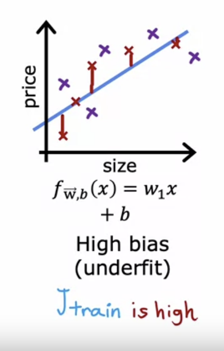

One characteristic of an algorithm with high bias, i.e. that is under fitting, is that it's not even doing well on the training set. **When $J_{train}$ is high, that is our strong indicator that this algorithm has high bias.**

Let's now look at the example on the right. 

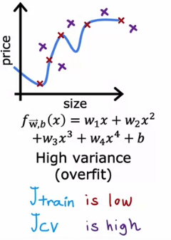

If we were to compute $J_{train}$, how well is this doing on the training set? It's actually doing great on the training set: its the training data really well. $J_{train}$ here will be low. 

But if we were to evaluate this model on other houses not in the training set, then we find that $J_{cv}$, the cross-validation error is quite high. 

A characteristic signature or indication that **our algorithm has high variance will be of $J_{cv}$ is much higher than $J_{train}$**. In other words, **it does much better on data it has seen than on data it has not seen**. 

Finally, the case in the middle:

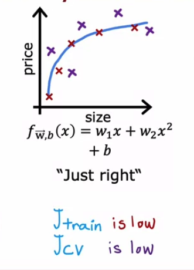

If we look at $J_{train}$, we see it's low, so this is doing quite well on the training set. If we look at a few new examples, like those from our cross-validation set, we find that $J_{cv}$ is also a pretty low. **$J_{train}$ not being too high indicates this doesn't have a high bias problem and $J_{cv}$ not being much worse than $J_{train}$ this indicates that it doesn't have a high variance problem either.**

The quadratic model seems to be a pretty good one for this application. 

To summarize: 
- when $d$ equals 1 for a linear polynomial, $J_{train}$ was high and $J_{cv}$ was high. 
- when $d$ equals 4, $J_{train}$ was low, but $J_{cv}$ is high. 
- when $d$ equals 2, are low. 

Let's now take a different view on bias and variance.Let's see how $J_{train}$ and $J_{cv}$ variance as a function of the degree of the polynomial we're fitting:

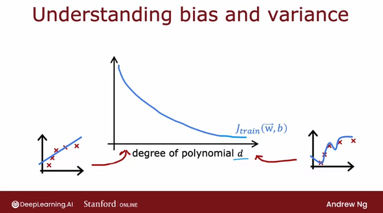

If we were to plot $J_{train}$ as a function of the degree of polynomial, what we find is that as we fit a higher and higher degree polynomial, -if not using regularization-, but as we fit a higher and higher order polynomial, the training error will tend to go down.

This happens because when we have a very simple linear function (very low $d$), it doesn't fit the training data well, but ass the degree of polynomial increases, $J_{train}$ will typically go down. 

Next, let's look at $J_{cv}$, which shows how well does it do on data that it did not get to fit train with. 

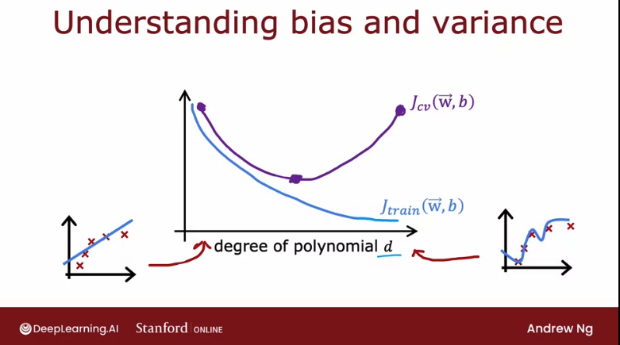

What we saw was when $d$ equals one, when the degree of polynomial was very low, $J_{cv}$ was pretty high because it underfits, so it didn't do well on the cross validation set. But when the degree of the polynomial is very large, for example four, it doesn't do well on the cross-validation set either, and so it's also high. 

But if $d$ is in-between, like a second-order polynomial, then it actually did much better. So the curve for $J_{cv}$ looks like what we see above, which comes down and then goes back up: if the degree of polynomial is too low, it underfits and so doesn't do well when evaluating the cross validation set; but if itis too high, it overfits the dataset and also doesn't do well on the cross validation set. 

Is only if it's somewhere in the middle, that is just right, which is why the second-order polynomial in our example ends up with a lower cross-validation error and neither high bias nor high-variance. 

To summarize: **how do we diagnose bias and variance in our learning algorithm?**

- If our learning algorithm has **high bias or it has underfitted data**, the key indicator will that $J_{train}$ is high. 

This corresponds to the leftmost portion of the curves above, which is where $J_{train}$ is high. Usually we have $J_{train}$ and $J_{cv}$ values that will be close to each other. 

- If our learning algorithm **has high variance or overfitted data**, the key indicator will be thaat $J_{cv}$ is much greater than $J_{train}$ 

This corresponds to the rightmost portion of the plot, where $J_{cv}$ is much greater than $J_{train}$. Usually $J_{train}$ will be pretty low, but the key indicator is whether $J_{cv}$ is much greater than $J_{train}$. That's what happens when we fit a very high order polynomial to a small dataset. 

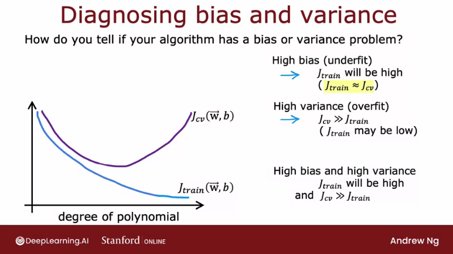

In some cases, **it is possible to simultaneously have high bias and have high-variance**. This won't happen that much for linear regression, but if we're training a neural network, there are some applications where unfortunately we have high bias and high variance. 

One way to recognize that situation will be if $J_{train}$ is high, so we're not doing that well on the training set, but even worse, the cross-validation error is also much larger than the training error. 

The notion of high bias and high variance doesn't really happen for linear models applied which we can visualize in a 1D graph; but to give intuition about what it looks like, it would be as if for part of the input, we had a very complicated model that overfits the data, but then for some reason, for other parts of the input, it doesn't even fit the training data well, and so it underfits for part of the input.

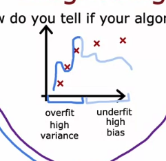

The indicator for that will be if the algorithm does poorly on the training set, and it even does much worse than on the training set. However, for most learning applications, we probably have primarily a high bias or high variance problem rather than both at the same time. But it is possible sometimes they're both at the same time. 

## Regularization and bias/variance

Now let's take a look at **how regularization, specifically the choice of the regularization parameter lamda $\lambda$, affects the bias and variance and therefore the overall performance of the algorithm.** This will be helpful for when we want to choose a good value of $\lambda$ of the regularization parameter for our algorithm. Let's take a look. 

Let's use an example where we're going to use a fourth-order polynomial, but we're going to fit this model using regularization. Remember that the value of $\lambda$ is the regularization parameter that controls how much we trade-off keeping the parameters $w$ small versus fitting the training data well. 

Let's start with the example of setting $\lambda$ to be **a very large value**, i.e. equal to 10,000. If we do that, we would end up fitting a model that is a straight line, because the regulaization parameter makes all $w$ parameters nearly 0, and the model ends up being just $f(x) = b$:
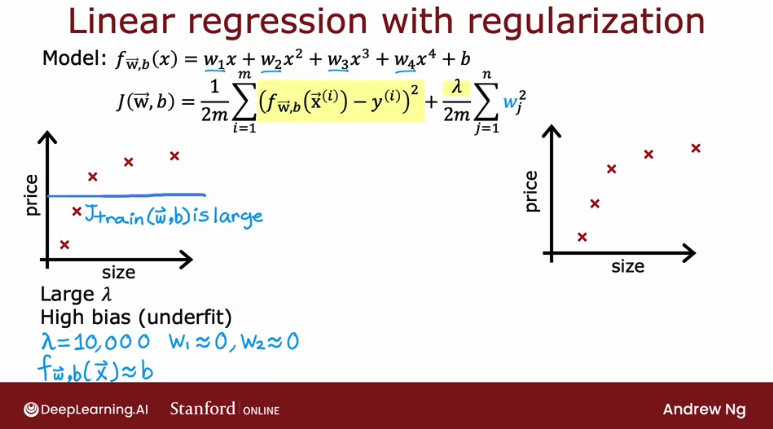

This model clearly has high bias and it underfits the training data because it doesn't even do well on the training set and $J_{train}$ is large. 

Now, let's take a look at the other extreme, where we set $\lambda$ to be **a very small value** even going to extreme of setting it to zero. With that choice of Lambda, there is no regularization, so we're just fitting a fourth-order polynomial with no regularization and we end up with a curve that overfits the data:

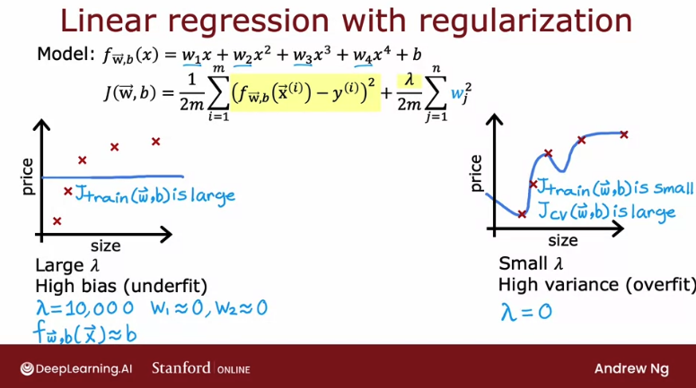

What we saw previously was when we have a model like this, $J_{train}$ is small, but $J_{cv}$ is much larger than $J_{train}$ or $J_{cv}$ is large. This indicates we have high variance and it overfits this data.

**If we have some intermediate value of $\lambda$**, then we would hopefully get a model that is just right and fits the data well with small $J_{train}$ and small $J_{cv}$.

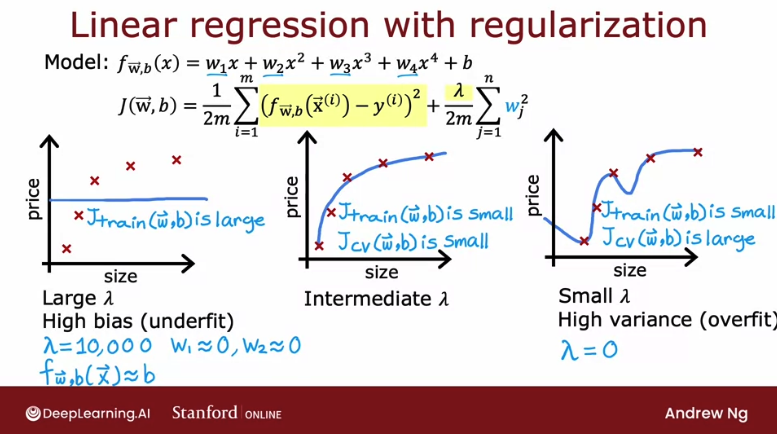

**If we are trying to decide what is a good value of $\lambda$ to use for the regularization parameter, cross-validation gives we a way to do so** . So, **how can we choose a good value of $\lambda$?**

This is a procedure similar to what we had seen for choosing the degree of polynomial $d$ using cross-validation: specifically, we fit model trying a large range of possibe values for lambda, all the way from 0 from maybe up to 10.

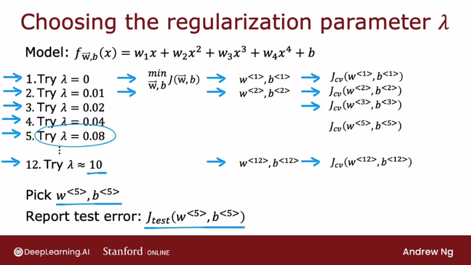

For each one, we minimize the cost function and get the parameters $w$ and $b$, and for each we compute the cross validation error, $J_{cv}$. 

By trying out a large range of possible values for $\lambda$, fitting parameters using those different regularization parameters, and then evaluating the performance on the cross-validation set, we can then **pick what is the best value for the regularization parameter**, which will be the one that provides the lowest cross-validation error, $J_{cv}$.

Finally, if we want to report out an estimate of the generalization error, we would then report out the test set error, $J_{test}$ for that model with parameters $w$ and $b$.

---
To further understand what this algorithm is doing, let's take a look at how training error and cross validation error vary as a function of the parameter $\lambda$.

Using a graph where we set the x-axis with the value of the regularization parameter $\lambda$ versus the test and cross validation errors we can see:

- if we look at the extreme where $\lambda$ equals zero on the left, that corresponds to not using any regularization, so we end up with a very wiggly curve characteristic of a high variance model. **So $J_{train}$ is going to be small and $J_{cv}$ is going to be large because it does great on the training data but does much worse on the cross validation data**. 

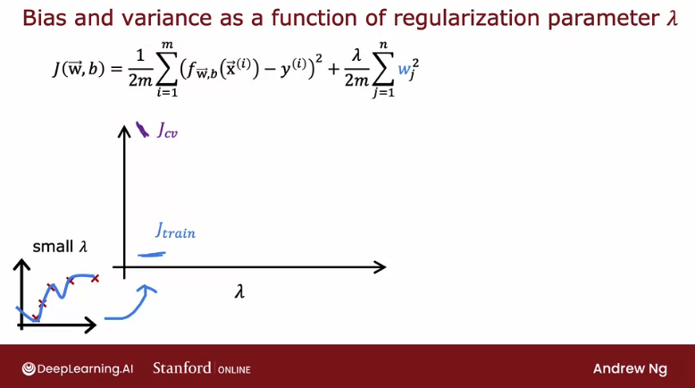

- In the extreme on the right for very large values of $\lambda$, we end up fitting a model that is basically a constant value. **This has high bias, it underfits the data, and $J_{train}$ will be high and $J_{cv}$ will be high as well**. 

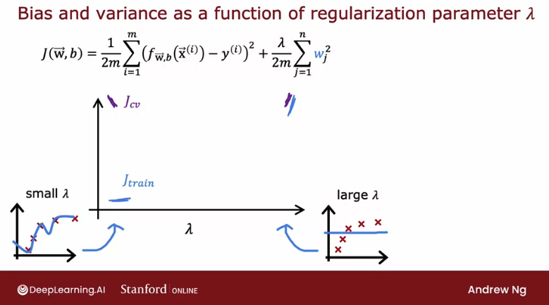

In fact, if we were to look at how $J_{train}$ varies as a function of $\lambda$, **we find that $J_{train}$ will go up as $\lambda$ get larger**, because in the optimization cost function, the larger $\lambda$ is, the more the algorithm is trying to keep $w^2$ (from the regularization parameter) small. That is, the more weight is given to this regularization term, and thus the less attention is paid to actually do well on the training set. 

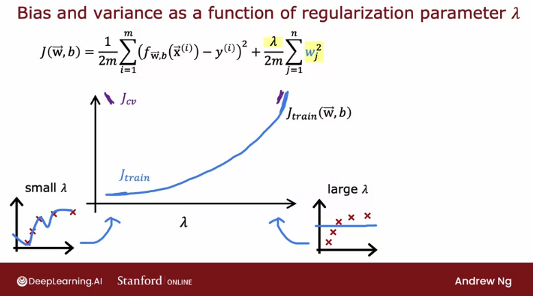

This term on the lef, before the regularization term, is actually $J_{train}$, so the more effort we do trying to keep the parameters $w$ small, the less good a job it does on minimizing the training error. That's why as $\lambda$ increases, the training error $J_{train}$ will tend to increase.

Now, **how about the cross-validation error?** We can see that the cross-validation error will start high for small values of $\lambda$, then decrease to an optimal point, and then start to increase again: we've seen that if $\lambda$ is too small or too large, then it doesn't do well on the cross-validation set. 

It either overfits on the left or underfits on the right. But there'll be some intermediate value of $\lambda$ that causes the algorithm to perform best:

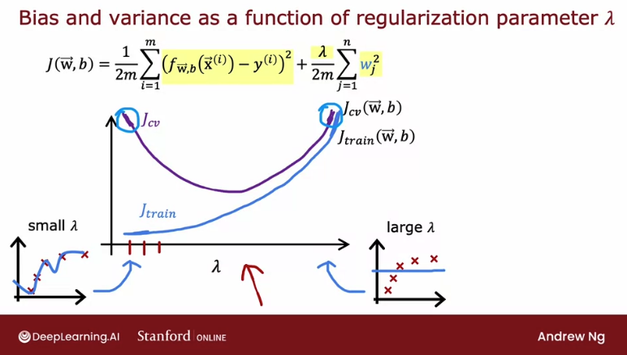

If we compare this diagram to the one that we had in the previous section, where the horizontal axis was the degree of polynomial, **these two diagrams look a little bit not mathematically and not in any formal way, but they look a little bit like mirror images of each other, and that's because**: 
- when we're **plotting against the degree of polynomial,** the left part of the curve corresponded to underfitting and high bias, the right part corresponded to overfitting and high variance. 
- when we're **plotting against labmda**, high-variance was on the left and high bias was on the right. 

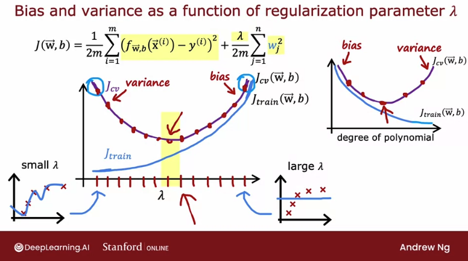

But in both cases, cross-validation, evaluating different values can help we choose a good value of $d$ or a good value of $\lambda$. 

## Establishing a baseline level of performance

Let's look at some concrete numbers for what  $J_{train}$ and  $J_{cv}$ might be, and see how we can judge if a learning algorithm has high bias or high variance. 

Let's use as a running example the application of speech recognition: It's the job of the speech recognition algorithms to output the transcripts of whatever users dictate to their phones. 

**If we train a speech recognition system and measure the training error, the training error would mean\: what's the%age of audio clips in our training set that the algorithm does not transcribe correctly in its entirety.** 

Let's say the training error for this data-set is 10.8% meaning that it transcribes it perfectly for 89.2% of our training set, but makes some mistake in 10.8% of our training set. And if we were to also measure our speech recognition algorithm's performance on a separate cross-validation set, let's say it gets 14.8% error:

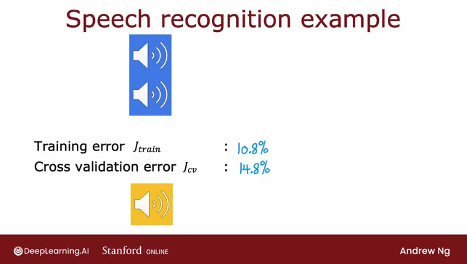

If we look at these numbers like this, it looks like the training error is really high, since it got 10% wrong - and then the cross-validation error is even higher. But getting 10% of even our training set wrong that seems already pretty high. **This 10% error could lead us to conclude it has high bias** because it's not doing well on our training set. 

But **when analyzing speech recognition it's useful to also measure one other thing: what is the human level of performance? In other words, how well can even humans transcribe speech accurately from these audio clips?** 

Concretely, let's say that we measure how well fluent speakers can transcribe audio clips and we find that human level performance achieves 10.6% error. Why is human level error so high? That's because many audio data points used to train are noisy or inaudible and not even humans can understand it.

So if even a human makes 10.6% error, then it seems difficult to expect a learning algorithm to do much better. **So, in order to judge if the training error is high, it is more useful to see if the training error is much higher than a human level of performance**. In this example it does just 0.2% worse than humans.

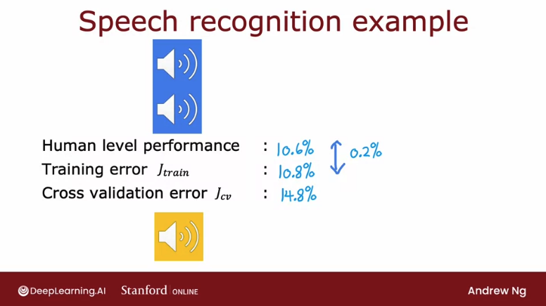

But in contrast, **the gap or the difference between  $J_{cv}$ and  $J_{train}$ is much larger.** There's actually a 4% gap there.

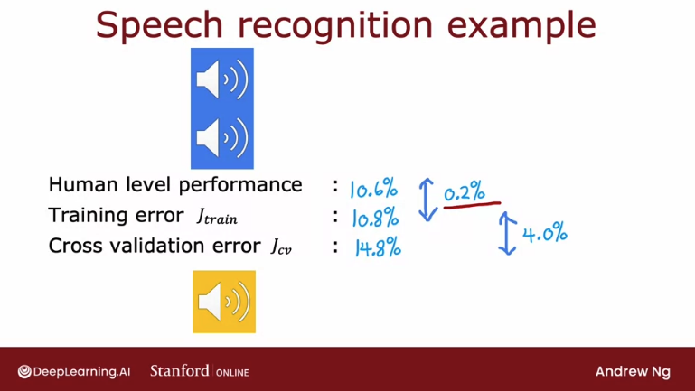

So we benchmark it to human level performance, we see that the algorithm is actually doing quite well on the training set, but the bigger problem is the cross-validation error is much higher than the training error. So we would conclude that **this algorithm actually has more of a variance problem than a bias problem**.  

**When judging if the training error is high is often useful to establish a baseline level of performance**

> **Baseline level of performance: what is the level of error we can reasonably hope our learning algorithm to eventually get to?**

We can determine one in three different ways:

- **Human level performance:** Measure how well humans can do on this task, since humans are really good at understanding speech data, or processing images or understanding texts. Human level performance is often a good benchmark when we are using unstructured data, such as: audio, images, or texts. 
- **Competing algorithms performance:** if there's some competing algorithm, such a previous implementation that someone else has implemented or even a competitor's algorithm. 
- **Guess based on prior experience**

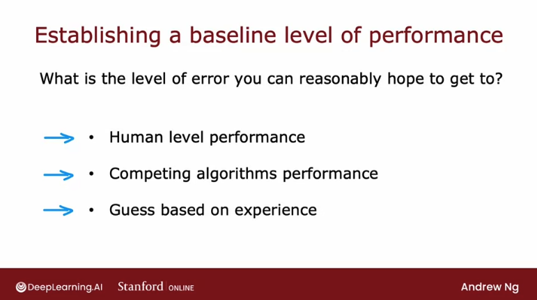

So, **if we have access to this baseline level of performance**, then when judging if an algorithm has high bias or variance, we would look at the baseline level of performance, and the training error, and the cross-validation error:

The two key quantities to measure are then:
1. what is **the difference between training error and the baseline level that we hope to get to**. In our example, this is 0.2, so very low, but if this is large then we would say we have a high bias problem.
2. what is **the gap between our training error and our cross-validation error**: if this is **high** then we will conclude we **have a high variance problem**. 

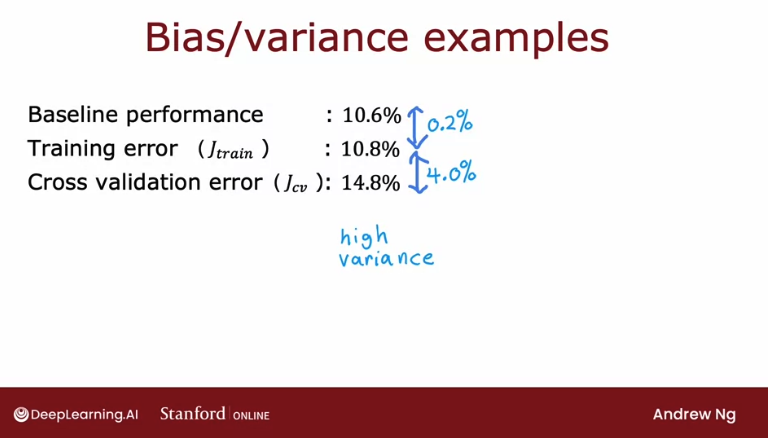

But let's look at a second example:

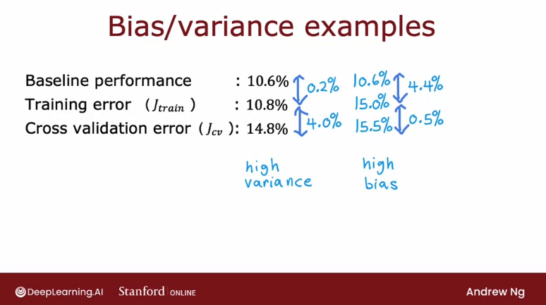

In this second example, the training error is much higher than what humans can do and what we hope to get to; whereas the cross-validation error is just a little bit bigger than the training error. If our training error and cross validation error look like this, **we can conclude that this algorithm has high bias**. 

To summarize:
- **the gap between the _baseline level performance and the training error_ gives us a sense of whether we have a high _bias_ problem**.
- **the gap between the _training error and the cross validation error_ gives us a sense of whether we have a high _variance_ problem**.

It is possible for our algorithms to have high bias and high variance:

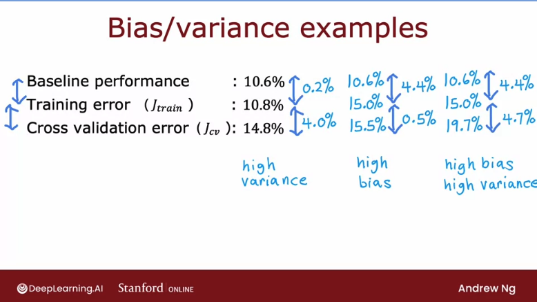

## Learning curves

**Learning curves are a way to help understand how our learning algorithm is doing as a function of the amount of experience it has, i.e. the number of training examples it has been trained on.** 

Let's plot the learning curves for a model that fits a second-order polynomial (quadratic) function, $f_{\mathbf{\vec{w}},b}(x) = w_1x + w_2x^2+b$. 

And for the learning curve, we're going to plot both $J_{cv}$, the cross-validation error, as well as $J_{train}$ the training error against a horizontal axis that is going to be $m_{train}$, the training set size or the number of examples so the algorithm can learn from. 

Let's start by plotting the cross-validation error:

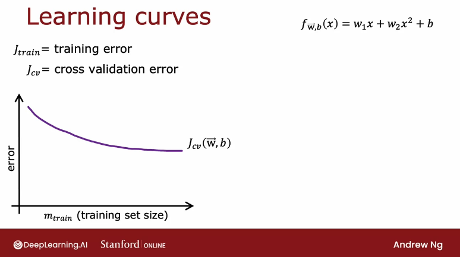

This shape is no surprise: **as $m_{train}$, the training set size, gets bigger, then we learn a better model and so the cross-validation error goes down.** 

Now, let's plot $J_{train}$:

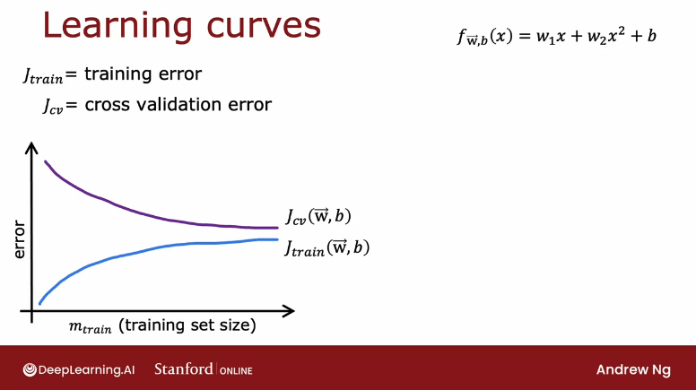

**As the training set size gets bigger, the training set error actually increases.** 

Why is this? If we take a look at the small graphs to the right of the next image, we can see that as we increase the number of data points to make our model fit to it just gets harder and harder to fit every single one of our training examples perfectly:

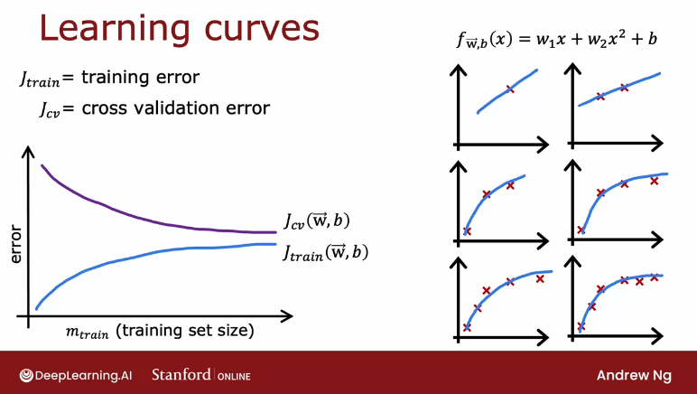

Notice one other thing about these curves: **the cross-validation error will be typically higher than the training error since we fit the parameters to the training set**, but not to the cross-validations set. 

Let's now take a look at what the learning curves will look like for an algorithm with high bias versus one with high variance. 

### Learning curve for algorithm with high bias (underfitting)

If we were to plot the training error, for a high bias model, such as a linear curve, then **the training error will go up like so as we'd expect, and then start to flatten out, or plateau**

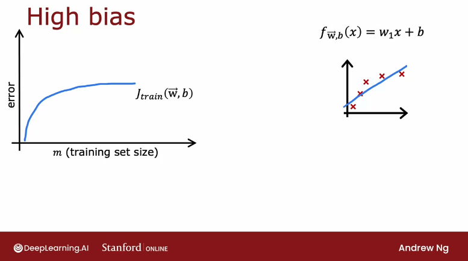

And that's because as we get more and more training examples when we're fitting the simple linear function, our model doesn't learn any more from the additional training data, since its just a linear curve.

Similarly, **our cross-validation error will come down and also fattened out after a while**, (but again, with $J_{cv}$ higher than $J_{train}$), for the same reason: the model is too simple to learn from additional data:

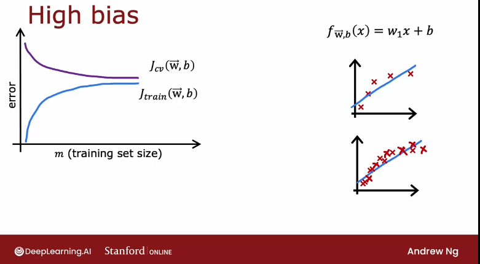

If we had a measure of that baseline level of performance, such as human-level performance, then it will tend to be a value that is far lower than our $J_{train}$ and our $J_{cv}$. **The big gap between the baseline level of performance and $J_{train}$ is our indicator that this algorithm has high bias**

Also notice: if we could increase even further the x-axis to the right, adding more training examples, **both error curves would still flatten out and would never  find a way to dip down to the human level performance**.

**That gives the conclusion that if a learning algorithm has high bias, getting more training data will not help bring down the error rate.**

That's why b**efore investing a lot of effort into collecting more training data, it's worth checking if our learning algorithm has high bias**, because if it does, then we probably need to do some other things other than just throw more training data at it. 

### Learning curve for algorithm with high variance (overfitting)

If we were to fit the fourth-order polynomial with a small lambda (or lambda equal to 0) then we get a curve that, though it fits the training data very well, it doesn't generalize.

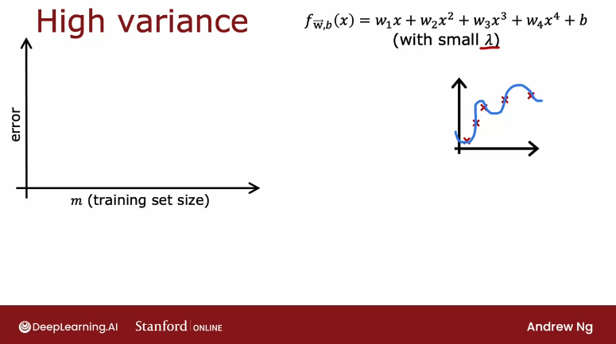

In this scenario, $J_{train}$ will be going up as the training set size increases, while $J_{cv}$ will be much higher: our cross-validation error is much higher than our training error. Remember: the signal for high variance is whether $J_{cv}$ is much higher than $J_{train}$. 

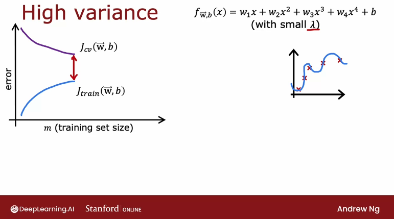

That huge gap indicates us that we have a high-variance problem in our model.

If we were to plot a **baseline level of performance**, we may find that  to be here, that $J_{train}$ can sometimes be even lower than the human level performance. But happens because, when we're overfitting our training set, we are actually fitting the training set so well tjat we end up with an unrealistically low error, even as low as 0.

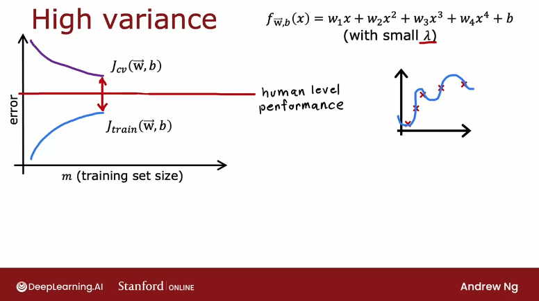

In contrast to the situation of dealing with a high-bias model, **when we have high variance, then increasing the training set size can help a lot**. 

If we could extrapolate the curves in the graph above to the right, by increasing $m_{train}$, then the training error will continue to go up, but the cross-validation error will come down as well, and end up approach $J_{train}$. **So in this scenario, it might be possible just by increasing the training set size to lower the cross-validation error and to get our algorithm to perform better and better**.

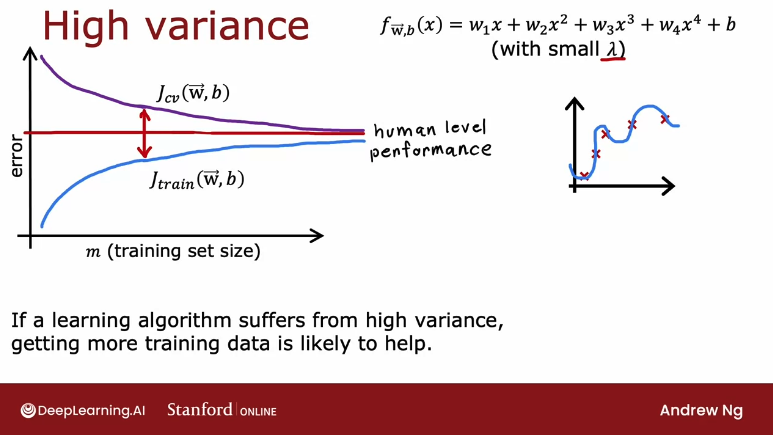

To summarize, **if a learning algorithm suffers from high variance, then getting more training data is indeed likely to help.**

So, if model that results in acomplex wiggly curve that is overfitting our data is given more training examples can become smoother and have less cross-validation error (but more train error) as we feed it more and more data.

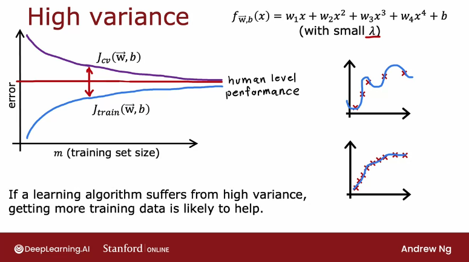

If we're building a machine learning application, we could plot the learning curves: we can take different subsets of our training sets, and even if we have, say, 1,000 training examples, we could train a model on just 100 training examples and look at the training error and cross-validation error, then train a model on 200 examples, holding out 800 examples and just not using them for now, and plot $J_{train}$ and $J_{cv}$ and so on the repeats and plot out what the learning curve looks like. If we were to visualize it that way, then that could be another way for we to see if our learning curve looks more like a high bias or high variance one. 

One downside of the plotting learning curves like this is something I've done, but one downside is, it is computationally quite expensive to train so many different models using different size subsets of our training set, so in practice, it isn't done that often.

## Deciding what to try next revisited

we've seen how by looking at $J_{train}$ and  $J_{cv}$, that is the training error and cross-validation error, or maybe even plotting a learning curve. we can try to get a sense of whether our learning algorithm has high bias or high variance. This is the procedure I routinely do when we're training a learning algorithm more often look at the training error and cross-validation error to try to decide if my algorithm has high bias or high variance. 

 this will help we make better decisions about what to try next in order to improve the performance of our learning algorithm. Let's look at an example. This is actually the example that we have seen earlier. 

If we've implemented regularized linear regression on predicting housing prices, but our algorithm makes unacceptably large errors in its predictions, what do we try next? These were the six ideas that we had when we had looked over this slide earlier. Getting more training examples, try small set of features, additional features, and so on. 

 that each of these six items either helps fix a high variance or a high bias problem. In particular, if our learning algorithm has high bias, three of these techniques will be useful. If our learning algorithm has high variance than a different three of these techniques will be useful. 

Let's see if we can figure out which is which. First one is get more training examples. We saw in the last section that if our algorithm has high bias, then if the only thing we do is get more training data, that by itself probably won't help that much. 

But in contrast, if our algorithm has high variance, say it was overfitting to a very small training set, then getting more training examples will help a lot. This first option or getting more training examples helps to fix a high variance problem. How about the other five? 

Do we think we can figure out which of the remaining five fix high bias or high variance problems? we're going to go through the rest of them in this section in a minute but if we want it, we're free to pause the section and see if we can think through these five other things by yourself. Feel free to pause the section. 

Just kidding, that was me pausing and not our section pausing. But seriously, if we want it, go ahead and pause the section and think through that we want or not and we'll go over these review in a minute. How about trying a smaller set of features? 

Sometimes if our learning algorithm has too many features, then it gives our algorithm too much flexibility to fit very complicated models. This is a little bit like if we had x, x squared, x cubed, x^4, x^5, and so on. If only we were to eliminate a few of these, then our model won't be so complex and won't have such high variance. 

If we suspect that our algorithm has a lot of features that are not actually relevant or helpful to predicting housing price, or if we suspect that we had even somewhat redundant features, then eliminating or reducing the number of features will help reduce the flexibility of our algorithm to overfit the data. This is a tactic that will help we to fix high variance. Conversing, getting additional features, that's just adding additional features is the opposite of going to a smaller set of features. 

This will help we to fix a high bias problem. As a concrete example, if we're trying to predict the price of the house just based on the size, but  that the price of house also really depends on the number of bedrooms and on the number of floors and on the age of the house, then the algorithm will never do that well unless we add in those additional features. That's a high bias problem because we just can't do that well on the training set when only the size, is only when we tell the algorithm how many bedrooms are there, how many floors are there? 

What's the age of the house that it finally has enough information to even do better on the training set. Adding additional features is a way to fix a high bias problem. Adding polynomial features is a little bit like adding additional features. 

If we're linear functions, three-line can fit the training set that well, then adding additional polynomial features can help we do better on the training set, and helping we do better on the training set is a way to fix a high bias problem. Then decreasing Lambda means to use a lower value for the regularization parameter. That means we're going to pay less attention to this term and pay more attention to this term to try to do better on the training set. 

Again, that helps we to fix a high bias problem. Finally, increasing Lambda, well that's the opposite of this, but that says we're overfitting the data. Increasing Lambda will make sense if is overfitting the training set, just putting too much attention to fit the training set, but at the expense of generalizing to new examples, and so increasing Lambda would force the algorithm to fit a smoother function, may be less wiggly function and use this to fix a high variance problem. 

I realized that this was a lot of stuff on this slide. But the takeaways I hope we have are, if we find that our algorithm has high variance, then the two main ways to fix that are; neither get more training data or simplify our model. By simplifying model I mean, either get a smaller set of features or increase the regularization parameter Lambda. 

our algorithm has less flexibility to fit very complex, very wiggly curves. Conversely, if our algorithm has high bias, then that means is not doing well even on the training set. If that's the case, the main fixes are to make our model more powerful or to give them more flexibility to fit more complex or more wiggly functions. 

Some ways to do that are to give it additional features or add these polynomial features, or to decrease the regularization parameter Lambda. Anyway, in case we're wondering if we should fix high bias by reducing the training set size, that doesn't actually help. If we reduce the training set size, we will fit the training set better, but that tends to worsen our cross-validation error and the performance of our learning algorithm, so don't randomly throw away training examples just to try to fix a high bias problem. 

One of my PhD students from Stanford, many years after he'd already graduated from Stanford, once said to me that while he was studying at Stanford, he learned about bias and variance and felt like he got it, he understood it. But that subsequently, after many years of work experience in a few different companies, he realized that bias and variance is one of those concepts that takes a short time to learn, but takes a lifetime to master. Those were his exact words. 

Bias and variance is one of those very powerful ideas. When we're training learning algorithms, I almost always try to figure out if it is high bias or high variance. But the way we go about addressing that systematically is something that we will keep on getting better at through repeated practice. 

But we'll find that understanding these ideas will help we be much more effective at how we decide what to try next when developing a learning algorithm. Now, I know that we did go through a lot in this section and if we feel like, boy, this is a lot of stuff here, it's okay, don't worry about it. Later this week in the practice labs and practice quizzes will have also additional opportunities to go over these ideas so that we can get additional practice. 

We're thinking about bias and variance of different learning algorithms. If it seems like a lot right now is okay, we get to practice these ideas later this week and hopefully deepen our understanding of them at that time. Before moving on, bias and variance also are very useful when thinking about how to train a neural network. 

In the next section, let's take a look at these concepts applied to neural network training. Let's go on to the next section. 

## Bias/Variance in neural networks

Was seen that high bias or high variance are both bad in the sense that they hurt the performance of our algorithm. 

One of the reasons that neural networks have been so successful is because our networks, together with the idea of big data or hopefully having large data sets. It's given us a new way of new ways to address both high bias and high variance. Let's take a look. 

we saw that if we're fitting different order polynomial is to a data set, then if we were to fit a linear model like this on the left. we have a pretty simple model that can have high bias whereas we were to fit a complex model, then we might suffer from high variance. And there's this tradeoff between bias and variance, and in our example it was choosing a second order polynomial that helps we make a tradeoff and pick a model with lowest possible cross validation error. 

And so before the days of neural networks, machine learning engineers talked a lot about this bias variance tradeoff in which we have to balance the complexity that is the degree of polynomial. Or the regularization parameter longer to make bias and variance both not be too high. And if we hear machine learning engineers talk about the bias variance tradeoff. 

This is what they're referring to where if we have too simple a model, we have high bias, too complex a model high variance. And we have to find a tradeoff between these two bad things to find probably the best possible outcome. But  that neural networks offer us a way out of this dilemma of having to tradeoff bias and variance with some caveats. 

And  that large neural networks when trained on small term moderate sized datasets are low bias machines. And what I mean by that is, if we make our neural network large enough, we can almost always fit our training set well. So long as our training set is not enormous. 

And what this means is this gives us a new recipe to try to reduce bias or reduce variance as needed without needing to really trade off between the two of them. So let me share with we a simple recipe that isn't always applicable. But if it applies can be very powerful for getting an accurate model using a neural network which is first train our algorithm on our training set and then asked does it do well on the training set. 

So measure Jtrain and see if it is high and by high, I mean for example, relative to human level performance or some baseline level of performance and if it is not doing well then we have a high bias problem, high trains error. And one way to reduce bias is to just use a bigger neural network and by bigger neural network, I mean either more hidden layers or more hidden units per layer. And we can then keep on going through this loop and make our neural network bigger and bigger until it does well on the training set. 

Meaning that achieves the level of error in our training set that is roughly comparable to the target level of error we hope to get to, which could be human level performance. After it does well on the training set, so the answer to that question is yes. we then ask does it do well on the cross validation set? 

In other words, does it have high variance and if the answer is no, then we can conclude that the algorithm has high variance because it doesn't want to train set does not do on the cross validation set. So that big gap in  $J_{cv}$ and Jtrain indicates we probably have a high variance problem, and if we have a high variance problem, then one way to try to fix it is to get more data. To get more data and go back and retrain the model and just double-check, do we just want the training set? 

If not, have a bigger network, or it does see if it does when the cross validation set and if not get more data. And if we can keep on going around and around and around this loop until eventually it does well in the cross validation set. Then we're probably done because now we have a model that does well on the cross validation set and hopefully will also generalize to new examples as well. 

Now, of course there are limitations of the application of this recipe training bigger neural network doesn't reduce bias but at some point it does get computationally expensive. That's why the rise of neural networks has been really assisted by the rise of very fast computers, including especially GPUs or graphics processing units. Hardware traditionally used to speed up computer graphics, but  has been very useful for speeding on neural networks as well. 

But even with hardware accelerators beyond a certain point, the neural networks are so large, it takes so long to train, it becomes infeasible. And then of course the other limitation is more data. Sometimes we can only get so much data, and beyond a certain point it's hard to get much more data. 

But I think this recipe explains a lot of the rise of deep learning in the last several years, which is for applications where we do have access to a lot of data. Then being able to train large neural networks allows we to eventually get pretty good performance on a lot of applications. One thing that was implicit in this slide that may not have been obvious is that as we're developing a learning algorithm, sometimes we find that we have high bias, in which case we do things like increase our neural network. 

But then after we increase our neural network we may find that we have high variance, in which case we might do other things like collect more data. And during the hours or days or weeks, we're developing a machine learning algorithm at different points, we may have high bias or high variance. And it can change but it's depending on whether our algorithm has high bias or high variance at that time. 

Then that can help give guidance for what we should be trying next. When we train our neural network, one thing that people have asked me before is, hey Andrew, what if my neural network is too big? Will that create a high variance problem? 

 that a large neural network with well-chosen regularization, well usually do as well or better than a smaller one. And so for example, if we have a small neural network like this, and we were to switch to a much larger neural network like this, we would think that the risk of overfitting goes up significantly. But  that if we were to regularize this larger neural network appropriately, then this larger neural network usually will do at least as well or better than the smaller one. 

So long as the regularization has chosen appropriately. So another way of saying this is that it almost never hurts to go to a larger neural network so long as we regularized appropriately with one caveat, which is that when we train the larger neural network, it does become more computational e expensive. So the main way it hurts, it will slow down our training and our inference process and very briefly to regularize a neural network. 

This is what we do if the cost function for our neural network is the average loss and so the loss here could be squared error or logistic loss. Then the regularization term for a neural network looks like pretty much what we'd expect is lambda over two m times the sum of $w$ squared where this is a sum over all weights W in the neural network and similar to regularization for linear regression and logistic regression, we usually don't regularize the parameters be in the neural network although in practice it makes very little difference whether we do so or not. And the way we would implement regularization in tensorflow is recall that this was the code for implementing an unregulated Rised handwritten digit classification model. 

We create three layers like so with a number of fitting units activation And then create a sequential model with the three layers. If we want to add regularization then we would just add this extra term colonel regularize A equals l. two and then 0.01 where that's the value of longer in terms of though actually lets we choose different values of lambda for different layers although for simplicity we can choose the same value of lambda for all the weights and all of the different layers as follows. 

And then this will allow we to implement regularization in our neural network. So to summarize two Takeaways, I hope we have from this section are one. It hardly ever hurts to have a larger neural network so long as we regularize appropriately. 

one caveat being that having a larger neural network can slow down our algorithm. So maybe that's the one way it hurts, but it shouldn't hurt our algorithm's performance for the most part and in fact it could even help it significantly. And second so long as our training set isn't too large. 

Then a neural network, especially large neural network is often a low bias machine. It just fits very complicated functions very well, which is why when we're training neural networks, I find that we're often fighting variance problems rather than bias problems, at least if the neural network is large enough. So the rise of deep learning has really changed the way that machine learning practitioners think about bias and variance. 

Having said that even when we're training a neural network measuring bias and variance and using that to guide what we do next is often a very helpful thing to do. So that's it for bias and variance. Let's go on to the next section. 

We will take all the ideas we've learned and see how they fit in to the development process of machine learning systems. And I hope that we'll tie a lot of these pieces together to give we practical advice for how to quickly move forward in the development of our machine learning systems