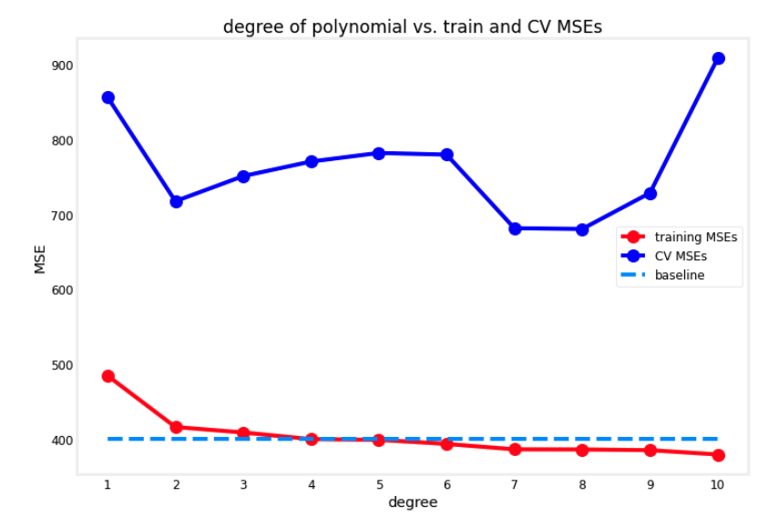

# Bias and variance

## Diagnosing bias and variance

When we're training a machine learning model, it pretty much never works  well the first time.The key to the process of building machine learning systems is how to decide what to do next in order to improve his performance. 

**Looking at the bias and variance of a learning algorithm gives we very good guidance on what to try next.** Let's take a look at what this means. 

Let's remember remember the following example from the first course on linear regression, where we have:
- a linear model with **high bias (underfits)**
- a fourth order model with **high variance (overfits)**
- a quadratic model that is "just right"


Because this is a problem with just a single feature $x$, we can plot them an analyze the shape of the graph. But if we had more features, we can't plot $f(x)$ and visualize them.

So instead of trying to look at plots, **a more systematic way to diagnose or to find out if our algorithm has high bias or high variance will be to look at the performance of our algorithm on the training set and on the cross validation set**. 

In particular, let's look at the example on the left. If we were to compute $J_{train}$, how well does the algorithm do on the training set? Not that well. 

**$J_{train}$** here would be **high** because **there are actually large errors between the examples and the actual predictions of the model.**

In the case of $J_{cv}$, the algorithm also doesn't do that well on examples that it had not previously seen, so $J_{cv}$ will also be high:


One characteristic of an algorithm with high bias, i.e. that is under fitting, is that it's not even doing well on the training set. **When $J_{train}$ is high, that is our strong indicator that this algorithm has high bias.**

Let's now look at the example on the right. 


If we were to compute $J_{train}$, how well is this doing on the training set? It's actually doing great on the training set: its the training data really well. $J_{train}$ here will be low. 

But if we were to evaluate this model on other houses not in the training set, then we find that $J_{cv}$, the cross-validation error is quite high. 

A characteristic signature or indication that **our algorithm has high variance will be of $J_{cv}$ is much higher than $J_{train}$**. In other words, **it does much better on data it has seen than on data it has not seen**. 


Finally, the case in the middle:


If we look at $J_{train}$, we see it's low, so this is doing quite well on the training set. If we look at a few new examples, like those from our cross-validation set, we find that $J_{cv}$ is also a pretty low. **$J_{train}$ not being too high indicates this doesn't have a high bias problem and $J_{cv}$ not being much worse than $J_{train}$ this indicates that it doesn't have a high variance problem either.**

The quadratic model seems to be a pretty good one for this application. 

To summarize: 
- when $d$ equals 1 for a linear polynomial, $J_{train}$ was high and $J_{cv}$ was high. 
- when $d$ equals 4, $J_{train}$ was low, but $J_{cv}$ is high. 
- when $d$ equals 2, are low. 


Let's now take a different view on bias and variance.Let's see how $J_{train}$ and $J_{cv}$ variance as a function of the degree of the polynomial we're fitting:


If we were to plot $J_{train}$ as a function of the degree of polynomial, what we find is that as we fit a higher and higher degree polynomial, -if not using regularization-, but as we fit a higher and higher order polynomial, the training error will tend to go down.

This happens because when we have a very simple linear function (very low $d$), it doesn't fit the training data well, but ass the degree of polynomial increases, $J_{train}$ will typically go down. 

Next, let's look at $J_{cv}$, which shows how well does it do on data that it did not get to fit train with. 


What we saw was when $d$ equals one, when the degree of polynomial was very low, $J_{cv}$ was pretty high because it underfits, so it didn't do well on the cross validation set. But when the degree of the polynomial is very large, for example four, it doesn't do well on the cross-validation set either, and so it's also high. 

But if $d$ is in-between, like a second-order polynomial, then it actually did much better. So the curve for $J_{cv}$ looks like what we see above, which comes down and then goes back up: if the degree of polynomial is too low, it underfits and so doesn't do well when evaluating the cross validation set; but if itis too high, it overfits the dataset and also doesn't do well on the cross validation set. 

Is only if it's somewhere in the middle, that is just right, which is why the second-order polynomial in our example ends up with a lower cross-validation error and neither high bias nor high-variance. 

To summarize: **how do we diagnose bias and variance in our learning algorithm?**

- If our learning algorithm has **high bias or it has underfitted data**, the key indicator will that $J_{train}$ is high. 

This corresponds to the leftmost portion of the curves above, which is where $J_{train}$ is high. Usually we have $J_{train}$ and $J_{cv}$ values that will be close to each other. 

- If our learning algorithm **has high variance or overfitted data**, the key indicator will be thaat $J_{cv}$ is much greater than $J_{train}$ 

This corresponds to the rightmost portion of the plot, where $J_{cv}$ is much greater than $J_{train}$. Usually $J_{train}$ will be pretty low, but the key indicator is whether $J_{cv}$ is much greater than $J_{train}$. That's what happens when we fit a very high order polynomial to a small dataset. 


In some cases, **it is possible to simultaneously have high bias and have high-variance**. This won't happen that much for linear regression, but if we're training a neural network, there are some applications where unfortunately we have high bias and high variance. 

One way to recognize that situation will be if $J_{train}$ is high, so we're not doing that well on the training set, but even worse, the cross-validation error is also much larger than the training error. 

The notion of high bias and high variance doesn't really happen for linear models applied which we can visualize in a 1D graph; but to give intuition about what it looks like, it would be as if for part of the input, we had a very complicated model that overfits the data, but then for some reason, for other parts of the input, it doesn't even fit the training data well, and so it underfits for part of the input.


The indicator for that will be if the algorithm does poorly on the training set, and it even does much worse than on the training set. However, for most learning applications, we probably have primarily a high bias or high variance problem rather than both at the same time. But it is possible sometimes they're both at the same time. 

## Regularization and bias/variance

Now let's take a look at **how regularization, specifically the choice of the regularization parameter lamda $\lambda$, affects the bias and variance and therefore the overall performance of the algorithm.** This will be helpful for when we want to choose a good value of $\lambda$ of the regularization parameter for our algorithm. Let's take a look. 

Let's use an example where we're going to use a fourth-order polynomial, but we're going to fit this model using regularization. Remember that the value of $\lambda$ is the regularization parameter that controls how much we trade-off keeping the parameters $w$ small versus fitting the training data well. 

Let's start with the example of setting $\lambda$ to be **a very large value**, i.e. equal to 10,000. If we do that, we would end up fitting a model that is a straight line, because the regulaization parameter makes all $w$ parameters nearly 0, and the model ends up being just $f(x) = b$:


This model clearly has high bias and it underfits the training data because it doesn't even do well on the training set and $J_{train}$ is large. 

Now, let's take a look at the other extreme, where we set $\lambda$ to be **a very small value** even going to extreme of setting it to zero. With that choice of Lambda, there is no regularization, so we're just fitting a fourth-order polynomial with no regularization and we end up with a curve that overfits the data:


What we saw previously was when we have a model like this, $J_{train}$ is small, but $J_{cv}$ is much larger than $J_{train}$ or $J_{cv}$ is large. This indicates we have high variance and it overfits this data.

**If we have some intermediate value of $\lambda$**, then we would hopefully get a model that is just right and fits the data well with small $J_{train}$ and small $J_{cv}$.


**If we are trying to decide what is a good value of $\lambda$ to use for the regularization parameter, cross-validation gives we a way to do so** . So, **how can we choose a good value of $\lambda$?**

This is a procedure similar to what we had seen for choosing the degree of polynomial $d$ using cross-validation: specifically, we fit model trying a large range of possibe values for lambda, all the way from 0 from maybe up to 10.


For each one, we minimize the cost function and get the parameters $w$ and $b$, and for each we compute the cross validation error, $J_{cv}$. 

By trying out a large range of possible values for $\lambda$, fitting parameters using those different regularization parameters, and then evaluating the performance on the cross-validation set, we can then **pick what is the best value for the regularization parameter**, which will be the one that provides the lowest cross-validation error, $J_{cv}$.

Finally, if we want to report out an estimate of the generalization error, we would then report out the test set error, $J_{test}$ for that model with parameters $w$ and $b$.

---
To further understand what this algorithm is doing, let's take a look at how training error and cross validation error vary as a function of the parameter $\lambda$.

Using a graph where we set the x-axis with the value of the regularization parameter $\lambda$ versus the test and cross validation errors we can see:

- if we look at the extreme where $\lambda$ equals zero on the left, that corresponds to not using any regularization, so we end up with a very wiggly curve characteristic of a high variance model. **So $J_{train}$ is going to be small and $J_{cv}$ is going to be large because it does great on the training data but does much worse on the cross validation data**. 


- In the extreme on the right for very large values of $\lambda$, we end up fitting a model that is basically a constant value. **This has high bias, it underfits the data, and $J_{train}$ will be high and $J_{cv}$ will be high as well**. 


In fact, if we were to look at how $J_{train}$ varies as a function of $\lambda$, **we find that $J_{train}$ will go up as $\lambda$ get larger**, because in the optimization cost function, the larger $\lambda$ is, the more the algorithm is trying to keep $w^2$ (from the regularization parameter) small. That is, the more weight is given to this regularization term, and thus the less attention is paid to actually do well on the training set. 


This term on the lef, before the regularization term, is actually $J_{train}$, so the more effort we do trying to keep the parameters $w$ small, the less good a job it does on minimizing the training error. That's why as $\lambda$ increases, the training error $J_{train}$ will tend to increase.

Now, **how about the cross-validation error?** We can see that the cross-validation error will start high for small values of $\lambda$, then decrease to an optimal point, and then start to increase again: we've seen that if $\lambda$ is too small or too large, then it doesn't do well on the cross-validation set. 

It either overfits on the left or underfits on the right. But there'll be some intermediate value of $\lambda$ that causes the algorithm to perform best:


If we compare this diagram to the one that we had in the previous section, where the horizontal axis was the degree of polynomial, **these two diagrams look a little bit not mathematically and not in any formal way, but they look a little bit like mirror images of each other, and that's because**: 
- when we're **plotting against the degree of polynomial,** the left part of the curve corresponded to underfitting and high bias, the right part corresponded to overfitting and high variance. 
- when we're **plotting against labmda**, high-variance was on the left and high bias was on the right. 


But in both cases, cross-validation, evaluating different values can help we choose a good value of $d$ or a good value of $\lambda$. 

## Establishing a baseline level of performance

Let's look at some concrete numbers for what  $J_{train}$ and  $J_{cv}$ might be, and see how we can judge if a learning algorithm has high bias or high variance. 

Let's use as a running example the application of speech recognition: It's the job of the speech recognition algorithms to output the transcripts of whatever users dictate to their phones. 

**If we train a speech recognition system and measure the training error, the training error would mean\: what's the%age of audio clips in our training set that the algorithm does not transcribe correctly in its entirety.** 

Let's say the training error for this data-set is 10.8% meaning that it transcribes it perfectly for 89.2% of our training set, but makes some mistake in 10.8% of our training set. And if we were to also measure our speech recognition algorithm's performance on a separate cross-validation set, let's say it gets 14.8% error:


If we look at these numbers like this, it looks like the training error is really high, since it got 10% wrong - and then the cross-validation error is even higher. But getting 10% of even our training set wrong that seems already pretty high. **This 10% error could lead us to conclude it has high bias** because it's not doing well on our training set. 

But **when analyzing speech recognition it's useful to also measure one other thing: what is the human level of performance? In other words, how well can even humans transcribe speech accurately from these audio clips?** 

Concretely, let's say that we measure how well fluent speakers can transcribe audio clips and we find that human level performance achieves 10.6% error. Why is human level error so high? That's because many audio data points used to train are noisy or inaudible and not even humans can understand it.

So if even a human makes 10.6% error, then it seems difficult to expect a learning algorithm to do much better. **So, in order to judge if the training error is high, it is more useful to see if the training error is much higher than a human level of performance**. In this example it does just 0.2% worse than humans.


But in contrast, **the gap or the difference between  $J_{cv}$ and  $J_{train}$ is much larger.** There's actually a 4% gap there.


So we benchmark it to human level performance, we see that the algorithm is actually doing quite well on the training set, but the bigger problem is the cross-validation error is much higher than the training error. So we would conclude that **this algorithm actually has more of a variance problem than a bias problem**.  

**When judging if the training error is high is often useful to establish a baseline level of performance**

> **Baseline level of performance: what is the level of error we can reasonably hope our learning algorithm to eventually get to?**

We can determine one in three different ways:

- **Human level performance:** Measure how well humans can do on this task, since humans are really good at understanding speech data, or processing images or understanding texts. Human level performance is often a good benchmark when we are using unstructured data, such as: audio, images, or texts. 
- **Competing algorithms performance:** if there's some competing algorithm, such a previous implementation that someone else has implemented or even a competitor's algorithm. 
- **Guess based on prior experience**


So, **if we have access to this baseline level of performance**, then when judging if an algorithm has high bias or variance, we would look at the baseline level of performance, and the training error, and the cross-validation error:

The two key quantities to measure are then:
1. what is **the difference between training error and the baseline level that we hope to get to**. In our example, this is 0.2, so very low, but if this is large then we would say we have a high bias problem.
2. what is **the gap between our training error and our cross-validation error**: if this is **high** then we will conclude we **have a high variance problem**. 


But let's look at a second example:


In this second example, the training error is much higher than what humans can do and what we hope to get to; whereas the cross-validation error is just a little bit bigger than the training error. If our training error and cross validation error look like this, **we can conclude that this algorithm has high bias**. 


To summarize:
- **the gap between the _baseline level performance and the training error_ gives us a sense of whether we have a high _bias_ problem**.
- **the gap between the _training error and the cross validation error_ gives us a sense of whether we have a high _variance_ problem**.


It is possible for our algorithms to have high bias and high variance:


## Learning curves

**Learning curves are a way to help understand how our learning algorithm is doing as a function of the amount of experience it has, i.e. the number of training examples it has been trained on.** 

Let's plot the learning curves for a model that fits a second-order polynomial (quadratic) function, $f_{\mathbf{\vec{w}},b}(x) = w_1x + w_2x^2+b$. 

And for the learning curve, we're going to plot both $J_{cv}$, the cross-validation error, as well as $J_{train}$ the training error against a horizontal axis that is going to be $m_{train}$, the training set size or the number of examples so the algorithm can learn from. 

Let's start by plotting the cross-validation error:


This shape is no surprise: **as $m_{train}$, the training set size, gets bigger, then we learn a better model and so the cross-validation error goes down.** 

Now, let's plot $J_{train}$:


**As the training set size gets bigger, the training set error actually increases.** 

Why is this? If we take a look at the small graphs to the right of the next image, we can see that as we increase the number of data points to make our model fit to it just gets harder and harder to fit every single one of our training examples perfectly:


Notice one other thing about these curves: **the cross-validation error will be typically higher than the training error since we fit the parameters to the training set**, but not to the cross-validations set. 

Let's now take a look at what the learning curves will look like for an algorithm with high bias versus one with high variance. 

### Learning curve for algorithm with high bias (underfitting)

If we were to plot the training error, for a high bias model, such as a linear curve, then **the training error will go up like so as we'd expect, and then start to flatten out, or plateau**


And that's because as we get more and more training examples when we're fitting the simple linear function, our model doesn't learn any more from the additional training data, since its just a linear curve.

Similarly, **our cross-validation error will come down and also fattened out after a while**, (but again, with $J_{cv}$ higher than $J_{train}$), for the same reason: the model is too simple to learn from additional data:


If we had a measure of that baseline level of performance, such as human-level performance, then it will tend to be a value that is far lower than our $J_{train}$ and our $J_{cv}$. **The big gap between the baseline level of performance and $J_{train}$ is our indicator that this algorithm has high bias**


Also notice: if we could increase even further the x-axis to the right, adding more training examples, **both error curves would still flatten out and would never  find a way to dip down to the human level performance**.

**That gives the conclusion that if a learning algorithm has high bias, getting more training data will not help bring down the error rate.**

That's why b**efore investing a lot of effort into collecting more training data, it's worth checking if our learning algorithm has high bias**, because if it does, then we probably need to do some other things other than just throw more training data at it. 

### Learning curve for algorithm with high variance (overfitting)

If we were to fit the fourth-order polynomial with a small lambda (or lambda equal to 0) then we get a curve that, though it fits the training data very well, it doesn't generalize.


In this scenario, $J_{train}$ will be going up as the training set size increases, while $J_{cv}$ will be much higher: our cross-validation error is much higher than our training error. Remember: the signal for high variance is whether $J_{cv}$ is much higher than $J_{train}$. 


That huge gap indicates us that we have a high-variance problem in our model.

If we were to plot a **baseline level of performance**, we may find that  to be here, that $J_{train}$ can sometimes be even lower than the human level performance. But happens because, when we're overfitting our training set, we are actually fitting the training set so well tjat we end up with an unrealistically low error, even as low as 0.


In contrast to the situation of dealing with a high-bias model, **when we have high variance, then increasing the training set size can help a lot**. 

If we could extrapolate the curves in the graph above to the right, by increasing $m_{train}$, then the training error will continue to go up, but the cross-validation error will come down as well, and end up approach $J_{train}$. **So in this scenario, it might be possible just by increasing the training set size to lower the cross-validation error and to get our algorithm to perform better and better**.


To summarize, **if a learning algorithm suffers from high variance, then getting more training data is indeed likely to help.**

So, if model that results in acomplex wiggly curve that is overfitting our data is given more training examples can become smoother and have less cross-validation error (but more train error) as we feed it more and more data.


If we're building a machine learning application, we could plot the learning curves: we can take different subsets of our training sets, and even if we have, say, 1,000 training examples, we could train a model on just 100 training examples and look at the training error and cross-validation error, then train a model on 200 examples, holding out 800 examples and just not using them for now, and plot $J_{train}$ and $J_{cv}$ and so on the repeats and plot out what the learning curve looks like. If we were to visualize it that way, then that could be another way for we to see if our learning curve looks more like a high bias or high variance one. 

One downside of the plotting learning curves like this is something I've done, but one downside is, it is computationally quite expensive to train so many different models using different size subsets of our training set, so in practice, it isn't done that often.

## Deciding what to try next revisited

W've seen how by looking at $J_{train}$ and  $J_{cv}$, that is the training error and cross-validation error, or maybe even plotting a learning curve, we can try to get a sense of whether our learning algorithm has high bias or high variance.

This will help we make better decisions about what to try next in order to improve the performance of our learning algorithm. Let's look at an example:


If we've implemented regularized linear regression on predicting housing prices, but our algorithm makes unacceptably large errors in its predictions, what do we try next? 

We already came up with six ideas that we had when we had looked over this slide earlier. Each of these six items either helps fix a high variance or a high bias problem.

### Get more training examples

**Helps when we have high variance**

We saw in the last section that if our algorithm has high bias, then if the only thing we do is get more training data, that by itself probably won't help. But if our model was overfitting to a very small training set, then getting more training examples will help a lot. 

### Try smaller sets of features

**Helps when we have high variance**

Sometimes if our learning algorithm has too many features, then it gives our algorithm too much flexibility to fit very complicated models, and thus **easily overfit our data**. If only we were to eliminate a few of these, then our model won't be so complex and won't have such high variance. 

If we suspect that our algorithm has a lot of features that are not actually relevant or helpful to predicting housing price, or if we suspect that we had even somewhat redundant features, then eliminating or reducing the number of features will help reduce the flexibility of our algorithm to overfit the data. 

### Try getting additional features

**Helps when we have high bias**

The oppostice case as before: this will help we to fix a high bias problem. As a concrete example, if we're trying to predict the price of the house just based on the size, but the price of house also really depends on the number of bedrooms and on the number of floors and on the age of the house, then the algorithm will never do that well unless we add in those additional features.

Adding additional features is a way to fix a high bias problem. 

### Try adding polynomial features ($x_1^2$, $x_2^2$, $x_1x_2$, etc)

**Helps when we have high bias**

Adding polynomial features is similar to adding additional features. If you currently have a linear function, and it can't fit the data well, **adding polynomial features to increase the degree of you model** and it can help to fit better the training set, and thus help fix a high bias problem. 


### Try decreasing lambda ($\lambda$)

**Helps when we have high bias**

Decreasing $\lambda$ means to use a lower value for the regularization parameter. That means we're going to pay less attention to that term and pay more attention to $J_{train}$ term, and thus try to do better on the training set. That helps we to fix a high bias problem. 

### Try increase lambda ($\lambda$)

**Helps when we have high variance**

Increasing $\lambda$ is the opposite as the last case: increasing $\lambda$ will make sense if is overfitting the training set, that is, putting too much attention to fit the training set, but at the expense of generalizing to new examples.

So increasing $\lambda$ would force the algorithm to fit a smoother function, fix a high variance problem. 

---

**Can we fix high bias by reducing the training set size?** That doesn't actually help. If we reduce the training set size, we will fit the training set better, but that tends to worsen our cross-validation error and the performance of our learning algorithm, so don't randomly throw away training examples just to try to fix a high bias problem.

## Bias/Variance in neural networks

Was seen that high bias or high variance are both bad in the sense that they hurt the performance of our algorithm. 

**One of the reasons that neural networks have been so successful is because our networks** -together with the idea of big data or hopefully having large data sets- **have given us a new way of new ways to address both high bias and high variance.** 

### The bias-variance tradeoff

We saw there's a tradeoff between bias and variance: in our example, we overcame it by choosing a second order polynomial that helps by making a tradeoff and picking a model with lowest possible cross validation error - not too much bias, not too much variance:


And so before the days of neural networks, **machine learning engineers talked a lot about the bias-variance tradeoff** in which we had **to balance the complexity or the degree of polynomial of our model**, or the size of our regularization parameter to make bias and variance both not be too high. 

But **neural networks offer us a way out of this dilemma of having to tradeoff bias and variance - with some caveats.** 

> **Large neural networks**, when trained on small term moderate sized datasets, **are low bias machines**: if we make our neural network large enough, we can almost always fit our training set well, as long as our training set is not enormous. 

**This gives us a new recipe to try to reduce bias or reduce variance as needed without needing to really trade off between the two of them**.

So, let's see a simple recipe, that isn't always applicable, but if it applies can be very powerful for getting an accurate model using a neural network:

**1. Train our algorithm on dataset and ask if it dow well on it (high or low $J_{train}$)**


**2. If $J_{train}$ is high (high bias), use a bigger neural network with more hidden layers or more hidden units per layer**


And we can then keep on going through this loop and make our neural network bigger and bigger until it does well on the training set (achieves the level of error in our training set that is roughly comparable to the target level of error we hope to get to).

After it does well on the training set, the answer to our question is yes. So then we ask: 

**3. Ask: does it do well on the cross validation set (high-variance)?**


If the answer is no, then we can conclude that the algorithm has high variance. The big gap in $J_{cv}$ and $J_{train}$ indicates we probably have a high variance problem and **we can try to fix it is to get more data**. 

**4. After getting more data: loop and ask if we have low $J_{train}$**

**5. If answer is yes: ask again, is $J_{cv} low?$ If answer is yes, we are done!**

We can keep on going around and around in this loop until eventually it does well on both the train set and the cross validation set.

Now, of course there are limitations of the application of this recipe: training bigger neural network does reduce bias but **at some point it does get computationally expensive**. That's why the rise of neural networks has been really assisted by the rise of very fast computers, especially GPUs or graphics processing units -hardware traditionally used to speed up computer graphics, but  has been very useful for speeding on neural networks as well. 

But even with hardware accelerators beyond a certain point, the neural networks are so large, it takes so long to train, it becomes infeasible. 

And then of course **the other limitation is: getting more data**. Sometimes we can only get so much data, and beyond a certain point it's hard to get more.

This recipe explains a lot of** the rise of deep learning in the last several years, which is for applications where we do have access to a lot of data**: being able to train large neural networks allows us to eventually get pretty good performance on a lot of applications. 

--- 
 When we train our neural network, **can my neural network get too big?** Will that creat**e a high variance problem?** 

The answer is that **a large neural network with well-chosen regularization will usually do as well or better than a smaller one**. 


If we have a small neural network like the one on the left, and we were to switch to a much larger neural network like the one on the right, we could think that the risk of overfitting goes up significantly. 

But: **if we properly regularize the larger neural network, then this network usually will do at least as well or better than the smaller one** as long as the regularization has chosen appropriately. 

In other words: **it almost never hurts to go to a larger neural network as long as we regularize appropriately**. With the same caveat as before: when we train the larger neural network, it does become more computationally expensive.

To regularize a neural network in Tensorflow, we need to add the `kernel_regularization` parameter to the `Dense` function:


```py
layer_1 = Dense(units=25, activation="relu", kernel_regularizer=L2(0.01))
layer_2 = Dense(units=15, activation="relu", kernel_regularizer=L2(0.01))
layer_3 = Dense(units=1, activation="sigmoid", kernel_regularizer=L2(0.01))

model = Sequential([layer_1, layer_2, layer_3])
```

Two takesaways from this section:
**1. It hardly ever hurts to have a larger neural network so long as we regularize appropriately.**

(One caveat being that having a larger neural network can slow down our algorithm, but it shouldn't hurt our algorithm's performance)

**2. a neural network, especially large neural network is often a low bias machine.** 

It just fits very complicated functions very well. This is why **when we're training neural networks,we're often fighting variance problems rather than bias problems**, at least if the neural network is large enough. 

So the rise of deep learning has really changed the way that machine learning practitioners think about bias and variance.

## Optional Lab: Diagnosing Bias and Variance

In the previous optional lab, you saw how to evaluate a learning algorithm's performance by measuring its training and cross validation error. Given these values, you are able to quantify how well a model is doing and this helps you make a decision on which one to use for a given application. In this lab, you will build upon this process and explore some tips to improve the performance of your models. As it turns out, the training and cross validation errors can tell you what to try next to improve your models. Specifically, it will show if you have a high bias (underfitting) or high variance (overfitting) problem. This lecture slide shown below gives an example:


The leftmost figure shows a high bias problem where the model is not capturing the patterns in the training data. As a result, you will have a high training and cross validation error. The rightmost figure, on the other hand, shows a high variance problem where the model has overfit the training set. Thus, even though it has a low training error, it will perform poorly on new examples. That is indicated by a high cross validation error. The ideal model would be the figure in the middle, where it successfully learns from the training set and also generalizes well to unseen data. The lectures gave some tips on what to do next to achieve this "just right" model. 

To fix a high bias problem, you can:
* try adding polynomial features
* try getting additional features
* try decreasing the regularization parameter

To fix a high variance problem, you can:
* try increasing the regularization parameter
* try smaller sets of features
* get more training examples

You will try all these tips in this lab. Let's begin!

### Establishing Baseline Level of Performance

Before you can diagnose a model for high bias or high variance, it is usually helpful to first have an idea of what level of error you can reasonably get to. As mentioned in class, you can use any of the following to set a baseline level of performance.

* human level performance
* competing algorithm's performance
* guess based on experience

Real-world data can be very noisy and it's often infeasible to get to 0% error. For example, you might think that you have a high bias problem because you're getting 10% training and 15% cross validation error on a computer vision application. However, you later found out that even humans can't perform better than 10% error. If you consider this the baseline level, then you now instead have a high variance problem because you've prioritized minimizing the gap between cross validation and training error.

With this in mind, let's begin exploring the techniques to address these issues.

### Imports and Lab Setup

Aside from a couple of [linear regressors](https://scikit-learn.org/stable/modules/classes.html#classical-linear-regressors) from scikit-learn, all other functions used in this lab are found in the `utils.py` file outside this notebook. You will mostly use the same code as the last lab so you don't need to see each line here again. It mostly contains functions to split your data, as well as functions that loop over a list of parameters (e.g. degree of polynomial, regularization parameter) and plots the training and cross validation error for each one. Feel free to explore the code in the said file to see the implementation.

```py
# for building linear regression models
from sklearn.linear_model import LinearRegression, Ridge

# import lab utility functions in utils.py
import utils 
```

### Fixing High Bias

You will first look at things to try when your model is underfitting. In other words, when the training error is far worse than the baseline level of performance.

#### Try adding polynomial features

You've already seen this in the previous lab. Adding polynomial features can help your model learn more complex patterns in your data. Here again is an example of a plot showing how the training and cross validation errors change as you add more polynomial features. You will be using a synthetic dataset for a regression problem with one feature and one target. In addition, you will also define an arbitrary baseline performance and include it in the plot.

```py
# Split the dataset into train, cv, and test
x_train, y_train, x_cv, y_cv, x_test, y_test = utils.prepare_dataset('data/c2w3_lab2_data1.csv')

print(f"the shape of the training set (input) is: {x_train.shape}")
print(f"the shape of the training set (target) is: {y_train.shape}\n")
print(f"the shape of the cross validation set (input) is: {x_cv.shape}")
print(f"the shape of the cross validation set (target) is: {y_cv.shape}\n")

# the shape of the training set (input) is: (60, 1)
# the shape of the training set (target) is: (60,)

# the shape of the cross validation set (input) is: (20, 1)
# the shape of the cross validation set (target) is: (20,)

# Preview the first 5 rows
print(f"first 5 rows of the training inputs (1 feature):\n {x_train[:5]}\n")
# first 5 rows of the training inputs (1 feature):
#  [[3757.57575758]
#  [2878.78787879]
#  [3545.45454545]
#  [1575.75757576]
#  [1666.66666667]]

# Instantiate the regression model class
model = LinearRegression()

# Train and plot polynomial regression models
utils.train_plot_poly(model, x_train, y_train, x_cv, y_cv, max_degree=10, baseline=400)
```



As you can see, the more polynomial features you add, the better the model fits to the training data. In this example, it even performed better than the baseline. At this point, you can say that the models with degree greater than 4 are low-bias because they perform close to or better than the baseline.

However, if the baseline is defined lower (e.g. you consulted an expert regarding the acceptable error), then the models are still considered high bias. You can then try other methods to improve this.

```py
# Train and plot polynomial regression models. Bias is defined lower.
utils.train_plot_poly(model, x_train, y_train, x_cv, y_cv, max_degree=10, baseline=250)
```


#### Try getting additional features

Another thing you can try is to acquire other features. Let's say that after you got the results above, you decided to launch another data collection campaign that captures another feature. Your dataset will now have 2 columns for the input features as shown below.

```py
x_train, y_train, x_cv, y_cv, x_test, y_test = utils.prepare_dataset('data/c2w3_lab2_data2.csv')

print(f"the shape of the training set (input) is: {x_train.shape}")
print(f"the shape of the training set (target) is: {y_train.shape}\n")
print(f"the shape of the cross validation set (input) is: {x_cv.shape}")
print(f"the shape of the cross validation set (target) is: {y_cv.shape}\n")

# the shape of the training set (input) is: (60, 2)
# the shape of the training set (target) is: (60,)

# the shape of the cross validation set (input) is: (20, 2)
# the shape of the cross validation set (target) is: (20,)


# Preview the first 5 rows
print(f"first 5 rows of the training inputs (2 features):\n {x_train[:5]}\n")
# first 5 rows of the training inputs (2 features):
#  [[3.75757576e+03 5.49494949e+00]
#  [2.87878788e+03 6.70707071e+00]
#  [3.54545455e+03 3.71717172e+00]
#  [1.57575758e+03 5.97979798e+00]
#  [1.66666667e+03 1.61616162e+00]]
```

Now see what this does to the same training process as before. You'll notice that the training error is now closer to (or even better than) the baseline.

```py
# Instantiate the model class
model = LinearRegression()

# Train and plot polynomial regression models. Dataset used has two features.
utils.train_plot_poly(model, x_train, y_train, x_cv, y_cv, max_degree=6, baseline=250)
```


#### Try decreasing the regularization parameter

At this point, you might want to introduce regularization to avoid overfitting. One thing to watch out for is you might make your models underfit if you set the regularization parameter too high. The cell below trains a 4th degree polynomial model using the [Ridge](https://scikit-learn.org/stable/modules/generated/sklearn.linear_model.Ridge.html#sklearn.linear_model.Ridge) class which allows you to set a regularization parameter (i.e. lambda or $\lambda$). You will try several values and compare the results.

```py
# Define lambdas to plot
reg_params = [10, 5, 2, 1, 0.5, 0.2, 0.1]

# Define degree of polynomial and train for each value of lambda
utils.train_plot_reg_params(reg_params, x_train, y_train, x_cv, y_cv, degree= 4, baseline=250)
```


The resulting plot shows an initial $\lambda$ of `10` and as you can see, the training error is worse than the baseline at that point. This implies that it is placing a huge penalty on the `w` parameters and this prevents the model from learning more complex patterns in your data. As you decrease $\lambda$, the model loosens this restriction and the training error is able to approach the baseline performance.

### Fixing High Variance

You will now look at some things to try when your model has overfit the training set. The main objective is to have a model that generalizes well to new examples so you want to minimize the cross validation error.

#### Try increasing the regularization parameter

In contrast to the last exercise above, setting a very small value of the regularization parameter will keep the model low bias but might not do much to improve the variance. As shown below, you can improve your cross validation error by increasing the value of $\lambda$.

```py
# Define lambdas to plot
reg_params = [0.01, 0.02, 0.05, 0.1, 0.2, 0.5, 1]

# Define degree of polynomial and train for each value of lambda
utils.train_plot_reg_params(reg_params, x_train, y_train, x_cv, y_cv, degree= 4, baseline=250)
```


#### Try smaller sets of features

You've already seen in the last lab that having too many polynomial terms can result in overfitting. You can reduce the number of such terms and see where you get the best balance of training and cross validation error. Another scenario where reducing the number of features would be helpful is when you have irrelevant features in your data. For example, patient IDs that hospitals give will not help in diagnosing a tumor so you should make sure to remove it from your training data. 

To illustrate how removing features can improve performance, you will do polynomial regression for 2 datasets: the same data you used above (2 features) and another with a random ID column (3 features). You can preview these using the cell below. Notice that 2 columns are identical and a 3rd one is added to include random numbers.

```py
# Prepare dataset with randomID feature
x_train, y_train, x_cv, y_cv, x_test, y_test = utils.prepare_dataset('data/c2w3_lab2_data2.csv')

# Preview the first 5 rows
print(f"first 5 rows of the training set with 2 features:\n {x_train[:5]}\n")
# first 5 rows of the training set with 2 features:
#  [[3.75757576e+03 5.49494949e+00]
#  [2.87878788e+03 6.70707071e+00]
#  [3.54545455e+03 3.71717172e+00]
#  [1.57575758e+03 5.97979798e+00]
#  [1.66666667e+03 1.61616162e+00]]

# Prepare dataset with randomID feature
x_train, y_train, x_cv, y_cv, x_test, y_test = utils.prepare_dataset('data/c2w3_lab2_data3.csv')

# Preview the first 5 rows
print(f"first 5 rows of the training set with 3 features (1st column is a random ID):\n {x_train[:5]}\n")
# first 5 rows of the training set with 3 features (1st column is a random ID):
#  [[1.41929130e+07 3.75757576e+03 5.49494949e+00]
#  [1.51868310e+07 2.87878788e+03 6.70707071e+00]
#  [1.92662630e+07 3.54545455e+03 3.71717172e+00]
#  [1.25222490e+07 1.57575758e+03 5.97979798e+00]
#  [1.76537960e+07 1.66666667e+03 1.61616162e+00]]

```

Now you will train the models and plot the results. The solid lines in the plot show the errors for the data with 2 features while the dotted lines show the errors for the dataset with 3 features. As you can see, the one with 3 features has higher cross validation error especially as you introduce more polynomial terms. This is because the model is also trying to learn from the random IDs even though it has nothing to do with the target. 

Another way to look at it is to observe the points at degree=4. You'll notice that even though the *training error* is lower with 3 features, the *gap between the training error and cross validation error* is a lot wider than when you only use 2 features. This should also warn you that the model is overfitting.

```py
# Define the model
model = LinearRegression()

# Define properties of the 2 datasets
file1 = {'filename':'data/c2w3_lab2_data3.csv', 'label': '3 features', 'linestyle': 'dotted'}
file2 = {'filename':'data/c2w3_lab2_data2.csv', 'label': '2 features', 'linestyle': 'solid'}
files = [file1, file2]

# Train and plot for each dataset
utils.train_plot_diff_datasets(model, files, max_degree=4, baseline=250)
```


#### Get more training examples

Lastly, you can try to minimize the cross validation error by getting more examples. In the cell below, you will train a 4th degree polynomial model then plot the *learning curve* of your model to see how the errors behave when you get more examples.

```py
# Prepare the dataset
x_train, y_train, x_cv, y_cv, x_test, y_test = utils.prepare_dataset('data/c2w3_lab2_data4.csv')
print(f"the shape of the entire training set (input) is: {x_train.shape}")
print(f"the shape of the entire training set (target) is: {y_train.shape}\n")
print(f"the shape of the entire cross validation set (input) is: {x_cv.shape}")
print(f"the shape of the entire cross validation set (target) is: {y_cv.shape}\n")

# the shape of the entire training set (input) is: (600, 2)
# the shape of the entire training set (target) is: (600,)

# the shape of the entire cross validation set (input) is: (200, 2)
# the shape of the entire cross validation set (target) is: (200,)

# Instantiate the model class
model = LinearRegression()

# Define the degree of polynomial and train the model using subsets of the dataset.
utils.train_plot_learning_curve(model, x_train, y_train, x_cv, y_cv, degree= 4, baseline=250)
```


From the results, it shows that the cross validation error starts to approach the training error as you increase the dataset size. Another insight you can get from this is that adding more examples will not likely solve a high bias problem. That's because the training error remains relatively flat even as the dataset increases.

### Wrap Up

In this lab, you were able to practice how to address high bias and high variance in your learning algorithm. By learning how to spot these issues, you have honed your intuition on what to try next when developing your machine learning models. In the next lectures, you will look deeper into the machine learning development process and explore more aspects that you need to take into account when working on your projects. See you there!