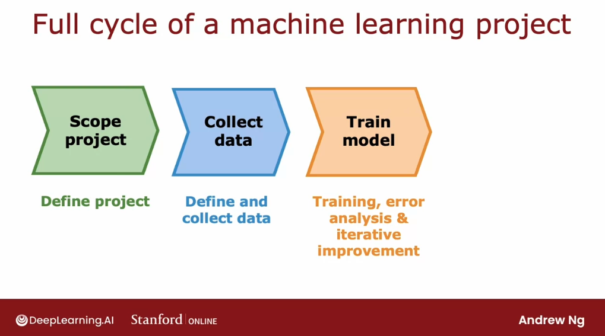

# Machine Lerning development process

## Iterative loop of ML development

Let's go through the process of developing a machine learning system, so that when we are doing so yourself, we can make great decisions at many stages of the machine learning development process. 

Let's first take a look first at the iterative loop of machine learning development:

First, we decide on what is **the overall architecture of our system**. That means **choosing our machine learning model as well as deciding what data to use**, maybe picking the **hyperparameters**, etc:

Then, given those decisions, we would **implement and train a model**.

When we train a model for the first time, it will almost never work as well as we want it to. 

The next step that I recommend then is to **implement or to look at a few diagnostics**, such as looking at the **bias and variance of our algorithm as well as error analysis**.

Based on the insights from the diagnostics, we can then make decisions like:
- do want to make our neural network bigger?
- do we want to change the $\lambda$ regularization parameter?
- do we want to aadd more data or add more features or subtract features?

So we go around this loop again with our new choice of architecture, and it will often take multiple iterations through this loop until we get to the performance that we want. 

Let's look at an example of **building an email spam classifier.**

The example on the left is what a highly spammy email might look like. Notice that spammers will sometimes deliberately misspell words in order to try to trip up a spam recognizer.

In contrast, the email on the right is an actual email.

**How do we build a classifier to recognize spam versus non-spam emails?**

**One way to do so would be to train a supervised learning algorithm where the input features $x$ will be the features of an email and the output label $y$ will be one or zero depending on whether it's spam or non-spam.** 

This application is an example of text classification because we're taking a text document that is an email and trying to classify it as either spam or non-spam. 

One way to construct the features of the email would be to say, take the top 10,000 words in the English language or in some other dictionary and use them to define features $x_1$, $x_2$ through $x_{10000}$.

Given the words in the email, we set the features to be `0` or `1` depending on if they appear in the training example email.

Another way would be to let these numbers not just be 1 or 0, but actually, count the number of times a given word appears in the email. If `buy` appears twice, maybe we want to set this to 2.

Given these features, we can then train a classification algorithm such as a logistic regression model or a neural network to predict $y$ given these features $x$. 

After we've trained our initial model, if it doesn't work as well as we wish, we will quite likely have multiple ideas for improving the learning algorithm's performance:

For example, is always tempting to 

- **collect more data**:

Honeypot project are projects that create a large number of fake email addresses and tries to deliberately to get these fake email addresses into the hands of spammers in order to collect vast amount of actual spam data points.

- **developing more sophisticated features based on the email routing**: 

Email routing refers to the sequence of compute services around the world that the email has gone through to reach the user and emails actually have email header information. That is information that keeps track of how the email has traveled across different servers, across different networks to find its way to users. 

Sometimes the path that an email has traveled can help tell we if it was sent by a spammer or not. 

- **defining more sophisticated features from the email body**: 

For example, when processing the text of the email, we can decide if discounting and discount should be treated as different words, or should be treated as the same words. 

- **design algorithms to detect misspellings or deliberate misspellings**:

This too could help we decide if an email is spammy. 

---

Given all of these and possibly even more ideas, **how can we decide which of these ideas are more promising to work on?** Choosing the more promising path forward can speed up our project easily 10 times compared to if we were to choose a less promising direction.

For example, we've already seen that if our algorithm has high bias rather than high variance, then spending months and months on a honeypot project to collect more data may not be the most fruitful direction. But if our algorithm has high variance, then collecting more data could help a lot. 

Doing the iterative loop of machinery and development, we may have many ideas for how to modify the model or the data, and we will be coming up with different diagnostics that could give we a lot of guidance on what choices for the model or data, or other parts of the architecture could be most promising to try. 

## Error analysis

In terms of **the most important ways to help we run diagnostics** to choose what to try next to improve our learning algorithm performance, **bias and variance** are the most imporant measure, but **error analysis** comes second.

So, what is **error analysis**?

Concretely, let's imagine we have $m_{cv}$, that is, 500 cross validation examples; and our algorithm misclassifies 100 of these 500 cross validation examples. 

**The error analysis process refers to manually looking through these 100 examples and trying to gain insights into where the algorithm is going wrong.**

The process involves **finding a set of examples from the cross validation set that the algorithm has misclassified and try to group them into groups with common properties or common traits.**

For example, if we notice that quite a lot of the misclassified spam emails are pharmaceutical sales, trying to sell medicines or drugs, then we would go through these examples and count up by hand how many emails that are misclassified are pharmaceutical spam (21 emails). Or if we suspect that deliberate misspellings are tripping over our spam classifier then we would count up how many of these examples that it misclassified had a deliberate misspelling (3 out of 100)

And we end up with the numbers seen in the figure:

If we end up with these counts then that tells we that pharmaceutical spam and emails trying to steal passwords or phishing emails seem to be the biggest problems whereas deliberate misspellings is comparatively smaller.

So what this analysis tells we is that even if we were to build really sophisticated algorithms to find deliberate misspellings it will only solve three out of 100 of our misclassified examples. The net impact would not be that large. When we're prioritizing what to do, we might therefore decide not to prioritizes this as highly.

Just a couple of notes on this process:

1. **these categories can be overlapping (not mutually exclusive)**: 

For example, there can be a pharmaceutical spam email that also has unusual routing.

2. **if the missclassified examples are too many, take a sample of them to do error analysis:**

In this example, we said that the algorithm misclassified as 100 examples and we'dl look at all 100 examples manually. If we have a larger cross validation set, such as 5,000 cross validation examples and if the algorithm misclassified say 1,000 of them then we may not have the time to analyze all of them anually.

In that case, **we can sample randomly a subset of usually around a 100 datapoints**, because that's the amount that we can look through in a reasonable amount of time.

---

**The point of error analysis is that, by manually examining a set of examples that our algorithm is misclassifying or mislabeling, it will create inspiration for what might be useful to try next. It can also tell us that certain types of errors are sufficiently rare that they aren't worth as much of our time to try to fix.**

Based on our error analysis in the example we just went through, it looks like more sophisticated email features could not be able to help much, whereas more sophisticated features to detect pharma spam or phishing emails could help a lot. Also, detecting misspellings would not help nearly as much. 

---

**One limitation of error analysis is that it's much easier to do for problems that humans are good at but  can be a bit harder for tasks that even humans aren't good at.** 

We can look at the email and easily decide if an email is a spam email, and understand why did the algorithm get it wrong? But if we're trying to predict what ads someone will click on on a website, it's much harder for us to understand why the algorithm might have gone wrong. 

## Adding data

Let's see some tips for:
- adding data 
- collecting more data
- creating more data

for our machine learning application.

The following is a list of many different techinques, that apply for different problems. Machine learning is applied to so many different problems and for some humans are great at creating labels. And for some we can get more data and for some we can't. That's why different applications actually sometimes call for slightly different techniques of augmenting the dataset.

### Adding more data

When training machine learning algorithms, it feels like always we wish we had even more data almost all the time. But trying to get more data of all types can be slow and expensive.

Instead, **an alternative way of adding data might be to focus on adding more data of the types where error analysis has indicated it might help the most**.

In the previous section we saw that, if error analysis reviewed that pharma spam was a large problem, then could decide to have a more targeted effort not to get more data of any type but to stay focused on getting more examples of pharma spam.

This would have a more modest cost and could let us add just the emails we need to get smarter on recognizing pharma spam. 

One example: if we have a lot of unlabeled email data, we might quickly skim through the unlabeled data and find more examples specifically a pharma related spam. 

This could boost our learning algorithm performance much more than just trying to add more data of all sorts of emails. 

### Data augmentation

Beyond getting our hands on brand new training examples $(x, y)$, there's another technique that's widely used especially for images and audio data that can increase our training set size significantly. 

**This technique is called data augmentation.** 

It involves taking an existing training example to create a new training example. 

For example if we're trying to recognize the letters from $A$ to $Z$ for an OCR optical character recognition problem, given an image of a letter, we might decide to create a new training example by modifying slightly the image:
- rotating
- enlarging 
- shrinking
- changing the contrast
- mirroring (only for some letters)

These are examples of distortions to the image that don't change the fact that this is still the letter $A$. We would be ways of taking a training example $(x, y)$, and applying a distortion or transformation to the input $x$, in order to come up with another example that has the same label. 

By doing this we're telling the algorithm that the letter $A$ rotated a bit or enlarged a bit or shrunk a little bit it is still the letter A. And creating additional examples helps the learning algorithm do a better job learning how to recognize the letter A.

For a more advanced example of data augmentation: we can also take the letter $A$ and place a grid on top of it, and introduce random warping of this grid to create a much richer library of examples of the letter A. 

And this process of distorting these examples can turn one image many more training examples that we can feed to the learning algorithm to hope it learn more robustly.

This idea of **data augmentation also works for speech recognition.**

Let's say for a voice search application, if we have an original audio clip, we can apply data augmentation to speech data by adding noisy backgrounds to the training clips.

For example, we can add the background noise of a crowd of people, of a moving car, or even simulate a bad cellphone connection.

This is actually a really critical technique for increasing artificially the size of the training datato build a more accurate speech recognizer. 

---

One tip for data augmentation is that **the changes or the distortions we make to the data should be representative of the types of noise or distortions in the test set.** 

So for example, if we take the letter $A$ and warp it, it should still look like examples of letters we might see out  that we would like to recognize. The same for audio data: adding background noise or bad cellphone connection would be representative of what we expect to hear in the test set.

In contrast, it's is usually not that helpful to add purely random meaningless noise to data, like adding per pixel noise to the images of the letters, as the resulting images don't represent data that we'd see in the test set.

So one way to think about data augmentation is: "how can we modify or warp or distort or make more noise in our data, but in a way so that what we get is still quite similar to what we have in our test set"? Since that's what the learning algorithm will ultimately end up doing well on.

### Data synthesis

**Data synthesis is a technique in which we create brand new examples from scratch.** That is, not by modifying an existing example but by creating brand new examples.

For example: Photo OCR or photo optical character recognition refers to the problem of looking at an image and automatically having a computer read the text that appears in this image, like this one:

How can we train an OCR algorithm to read text from an image like that? 

When we look closely at what the letters in this image look like they actually look as follows:

So one way to create artificial data for this task is to use our computer's text editor and the differen t fonts, and screenshotting examples in different colors, shapes and orientations to generate synthetic data:

The images on the left are real data from real pictures taken out in the world, while the images on the right are synthetically generated using fonts on the computer. They look actually pretty realistic.

**It can be a lot of work to write the code to generate realistic looking synthetic data for a given application. But when we spend the time to do so, it can sometimes help we generate a very large amount of data for our application and give we a huge boost to our algorithm's performance.** 

### Summary

All the techniques we've seen in this section relate to **finding ways to engineer the data used by our system**. 

In the past decades, most machine learning researchers attention was on the conventional **model-centric approach**  where most researchers **would download the data set and hold the data fixed while they focus on improving the code or the algorithm or the model**. 

Thanks to that paradigm of machine learning research, today we have access to many algorithms such as linear regression, logistic regression, neural networks, decision trees, etc.

But it can be more fruitful to spend more of our time taking a **data-centric approach** in which **we focus on engineering the data used by our algorithm**. This can be anything from collecting more data to using data augmentation to generate more images or more audio or using data synthesis to just create more training examples. 

Sometimes that focus on the data can be an efficient way to help our learning algorithm improve its performance.

## Transfer learning: using data from a different task

**Transfer learning is a technique that lets us use data from a different task to help on our application,** espeically useful for an application where we don't have that much data.

Here's how transfer learning works: let's say we want to recognize the handwritten digits from zero through nine but we don't have that much labeled data of these handwritten digits.

If we find a very large dataset of one million images of pictures of cats, dogs, cars, people, and so on, with a thousand classes, we can then start by training a neural network on this large dataset of a million images with a thousand different classes. 

We can train the algorithm to take as input an image $X$, and learn to recognize any of these 1,000 different classes. In this process, we end up learning parameters for the first layer of the neural network $w^1$, $b^1$, for the second layer $w^2$, $b^2$,and so on, and finally $w^5$, $b^5$ for the output layer.

To apply transfer learning, **we make a copy of this neural network where we would keep the parameters $w^1$, $b^1$, $w^2$, $b^2$, $w^3$, $b^3$, and $w^4$, $b^4$. But for the last layer, we would eliminate the output layer and replace it with a much smaller output layer with just 10 rather than 1,000 output units. These 10 output units will correspond to the classes zero, one, through nine that we want our neural network to recognize.**

Notice that the parameters $w^5$, $b^5$ they can't be copied over because the dimension of this layer has changed, so we need to come up with new parameters $w^5$, $b^5$ that we need to train from scratch rather than just copy from the previous neural network. 

In transfer learning, we can use the parameters from the first four layers - really all the layers except the final output layer - as a starting point for the parameters and then run an optimization algorithm such as gradient descent or the Adam optimization algorithm with the parameters initialized using the values from the first neural network. 

In detail, there are two options for how we can train these neural networks parameters:

### Option 1: we only train the output layers parameters. 

- We take the parameters $w^1$, $b^1$, $w^2$, $b^2$ through $w^4$, $b^4$ as the values from our first neural network and hold them fixed. 
- Then we use an algorithm like  gradient descent or the Adam optimization algorithm to only update $w^5$, $b^5$ to lower the usual cost function that we use for learning. In this case, to recognize digits zero to nine from a small training set of these digits zero to nine.

### Option 2: train all parameters

- We train all the parameters in the network including $w^1$, $b^1$, $w^2$, $b^2$ all the way through $w^5$, $b^5$, but now the first four layers parameters would be initialized using the values that we had trained on our first neural network.

If we have a very small training set then **Option 1** might work better, but if we have a training set that's larger then **Option 2** might work better.

This algorithm is called transfer learning because the intuition is that **by learning to recognize cats, dogs, cows, people, etc, it will hopefully have learned some plausible sets of parameters for the earlier layers for processing image inputs**. Then, by transferring these parameters to the new neural network, the new neural network starts off with the parameters in a much better place. So that with just some small further learning it can end up at a pretty good model. 

It consists of two steps:

**1. Supervised Pretraining:** first step where we train a network with a large -generally tangentially related- dataset.
**2. Fine tuning:** second step, where we tune the parameters further using a smaller dataset. We take the parameters that we had initialized or gotten from supervised pre-training and then run gradient descent further to fine tune the weights to suit the specific application that we may have.

If we have a small dataset, even tens or hundreds or thousands or just tens of thousands of images of the handwritten digits, being able to learn from these million images of a **not** quite related task can actually help our learning algorithm's performance a lot. 

One nice thing about transfer learning is: **we don't always need to be the ones to carry out supervised pre-training.** For a lot of neural networks, there will already be researchers they **have already trained a neural network on a large dataset and will have posted them online, freely licensed for anyone to download and use**. 

So we can just download the neural network that someone else may have spent weeks training and then replace the output layer with our own and carry out either Option 1 or Option 2 to fine tune a neural network that someone else has already carried out supervised pre-training on

But **why does transfer learning even work**? 

How can we possibly take parameters obtained by recognizing cats, dogs, cars, and people and use that to help we recognize something as different as handwritten digits? Here's some intuition behind it. 

If we are training a neural network to detect, say, different objects from images, then the first layer of a neural network may learn to detect edges in the image, the next layer of the neural network then learns to group together edges to detect corners and the next layer may have learned to detect some are more complex, but still generic shapes like basic curves or smaller shapes like these. 

Training a neural network to detect things as diverse as cats, dogs, cars and people, we're helping it to learn to detect these pretty generic features of images and finding edges, corners, curves, basic shapes, that apply to basically everything.

One restriction of pre-training though, is that **the image type $x$ has to be the same for the pre-training and fine-tuning steps.**

If we can get a neural network pre-trained on large dataset, say a million images, then sometimes we can use a much smaller dataset, maybe a thousand images, maybe even smaller, to fine tune the neural network on our own data and get pretty good results. We can even sometimes train neural networks on as few as 50 images when it has already been pre-trained on a much larger dataset. However, this technique isn't apanacea: we can't get every application to work just on 50 images, but it does help a lot when the dataset we have for our application isn't that large. 

## Full cycle of a machine learning project

When we're building a machine learning system, training a model is just part of the puzzle. Lett's talk about **the full cycle of a machine learning project.** 

When we're building a valuable machine learning system, **what are the steps to think about and plan for?** Let's take a look, using speech recognition as an example.

### Step 1: Scope the project

In other words, decide what is the project and what we want to work on. For example, work on speech recognition for voice search so that we can do web search using speaking to our mobile phone rather than typing into our mobile phone. 

### Step 2: Collect the data

Decide what data we need to train our machine learning system and go and do the work to get the audio and get the transcripts of the labels for our dataset. 

### Step 3: train the model

Here we would train a speech recognition system and carry out bias-variance analyisis, as well as error analysis and iteratively improve our model.  It's common that, after we started training the model, error analysis or bias-variance analysis tells us that we might want to go back to collect more data. 

We'd go around this loop a few times, train the model, error analysis, go back to collect more data, maybe do this for a while until eventually we say the model is good enough to then deploy in a production environment. 

### Step 4: Deploy to production

We make our model available for users to use. When we deploy a system we have to also make sure that we continue to monitor the performance of the system and to maintain the system in case the performance gets worse, so that we can bring performance back up.

After this deployment, sometimes we realize that the model is not working as well as we hoped, so we go back to train the model to improve it again or even go back and get more data. In fact, if we have permission to use data from our production deployment, sometimes that data from our working speech system can give us access to even more data with which we can keep on improving the performance of our system. 

Let's see more detail about **what deploying in production looks like**:

After we've trained a high performing machine learning model, say a speech recognition model, a common way to deploy the model would be to take our machine learning model and implement it in a server, which we  call an inference server, whose job it is to host our machine learning model, our trained model, and call it in order to make predictions.

Then if our team has implemented a mobile app, like a search application, then when a user talks to the mobile app, the mobile app can then make an API call to pass to our inference server the audio clip that was recorded and the inference server's job is supply the machine learning model to it and then return to it the prediction of our model, which in this case would be the text transcripts

To implement this, some **software engineering may be needed to write all the code that does all of these things.** Depending on whether our application needs to serve just a few handful of users or millions of users the amounts of software engineer needed can be quite different. 

Depending on scale application needed, software engineering may be needed to make sure that our inference server is able:

1. **to make reliable and efficient predictions** at a hopefully not too high of computational cost. 
2. **to scale to a large number of users**
3. **to log the data we're getting as inputs and predictions** (when allowed)
4. **to perform system monitoring**
5. **to perform model updates**, i.e. replace an old model with a new one

Depending on the team we're working on, it is possible that we built the machine learning model but there could be a different team responsible for deploying it. 

**There is a growing field in machine learning called MLOps**, that stands for Machine Learning Operations and refers to the practice of **how to systematically build and deploy and maintain machine learning systems.**

## Fairness, bias and ethics

Machine learning algorithms today are affecting billions of people. we've heard me mention ethics in other sections before. And I hope that if we're building a machine learning system that affects people that we give some thought to making sure that our system is reasonably fair, reasonably free from bias. 

And that we're taking a ethical approach to our application. Let's take a look at some issues related to fairness, bias and ethics. Unfortunately in the history of machine learning that happened a few systems, some widely publicized, that turned out to exhibit a completely unacceptable level of bias. 

For example, there was a hiring tool that was once shown to discriminate against women. The company that built the system stopped using it, but one wishes that the system had never been rolled out in the first place. Or there was also well documented example of face recognition systems that match dark skinned individuals to criminal mug shots much more often than lighter skinned individuals. 

And clearly this is not acceptable and we should get better as a community at just not building and deploying systems with a problem. In the first place, there happens systems that gave bank loan approvals in a way that was biased and discriminated against subgroups. And we also really like learning algorithms to not have the toxic effect of reinforcing negative stereotypes. 

For example, I have a daughter and if she searches online for certain professions and doesn't see anyone that looks like her, I would hate for that to discourage her from taking on certain professions. In addition to the issues of bias and fair treatment of individuals, there have also been adverse use cases or negative use cases of machine learning algorithms. For example, there was this widely cited and widely viewed section release with full disclosure and full transparency. 

By the company buzzfeed of a deepfake of former US President Barack Obama and we can actually find and watch the whole section online if we want. But the company that created this section did so full transparency and full disclosure. But clearly using this technology to generate fake sections without consent and without disclosure would be unethical. 

We've also seen unfortunately social media sometimes spreading toxic or incendiary speech because optimizing for user engagement has led to algorithms doing so. There have been bots that were used to generate fake content for either commercial purposes such as posting fake comments on products or for political purposes. And there are users of machine learning to build harmful products, commit fraud and so on. 

And in parts of the machine learning world, just as an email, there has been a battle between the spammers and the anti spam community. I am seeing today in for example, the financial industry, a battle between people trying to commit fraud and the people fighting fraud. And unfortunately machine learning is used by some of the fraudsters and some of the spammers. 

So for goodness sakes please don't build a machine learning system that has a negative impact on society. And if we are asked to work on an application that we consider unethical, I urge we to walk away for what it's worth. There have been multiple times that I have looked at the project that seemed to be financially sound. 

we'll make money for some company. But I have killed the project just on ethical grounds because I think that even though the financial case will sound, I felt that it makes the world worse off and I just don't ever want to be involved in a project like that. Ethics is a very complicated and very rich subject that humanity has studied for at least a few 1000 years. 

When aI became more widespread, I actually went and read up multiple books on philosophy and multiple books on ethics because I was hoping naively it turned out to come up with if only there's a checklist of five things we could do and so as we do these five things then we can be ethical, but I failed And I don't think anyone has ever managed to come up with a simple checklist of things to do to give that level of concrete guidance about how to be ethical. So what I hope to share with we instead is not a checklist because I wasn't even come up with one with just some general guidance and some suggestions for how to make sure the work is less bias more fair and more ethical. And I hope that some of these guidance, some which would be relatively general will help we with our work as well. 

So here are some suggestions for making our work more fair, less biased and more ethical when before deploying a system that could create harm. I will usually try to assemble a diverse team to brainstorm possible things that might go wrong with an emphasis on possible harm. Two vulnerable groups I found many times in my life that having a more diverse team and by diverse I mean, diversity on multiple dimensions ranging from gender to ethnicity to culture, to many other traits. 

I found that having more diverse teams actually causes a team collectively to be better at coming up with ideas about things that might go wrong and it increases the odds that will recognize the problem and fix it before rolling out the system and having that cause harm to some particular group. In addition to having a diverse team carrying out brainstorming. I have also found it useful to carry out a literature search on any standards or guidelines for our industry or particular application area, for example, in the financial industry, there are starting to be established standards for what it means to be a system. 

So they want that decides who to approve loans to, what it means for a system like that to be reasonably fair and free from bias and those standards that still emerging in different sectors could inform our work depending on what we're working on. After identifying possible problems. I found it useful to then audit the system against this identified dimensions of possible home. 

Prior to deployment, we saw in the last section, the full cycle of machine learning project. And one key step that's often a crucial line of defense against deploying something problematic is after we've trained the model. But before we deployed in production, if the team has brainstormed, then it may be biased against certain subgroups such as certain genders or certain ethnicities. 

we can then order the system to measure the performance to see if it really is bias against certain genders or ethnicities or other subgroups and to make sure that any problems are identified and fixed. Prior to deployment. Finally, I found it useful to develop a mitigation plan if applicable. 

And one simple mitigation plan would be to roll back to the earlier system that we knew was reasonably fair. And then even after deployment to continue to monitor harm so that we can then trigger a mitigation plan and act quickly in case there is a problem that needs to be addressed. For example, all of the self driving car teams prior to rolling out self driving cars on the road had developed mitigation plans for what to do in case the car ever gets involved in an accident so that if the car was ever in an accident, there was already a mitigation plan that they could execute immediately rather than have a car got into an accident and then only scramble after the fact to figure out what to do. 

I've worked on many machine learning systems and let me tell we the issues of ethics, fairness and bias issues we should take seriously. It's not something to brush off. It's not something to take lightly. 

Now of course, there's some projects with more serious ethical implications than others. For example, if we're building a neural network to decide how long to roast my coffee beans, clearly, the ethical implications of that seems significantly less than if, say we're building a system to decide what loans. Bank loans are approved, which if it's bias can cause significant harm. 

But I hope that all of us collectively working in machine learning can keep on getting better debate these issues. Spot problems, fix them before they cause harm so that we collectively can avoid some of the mistakes that the machine learning world had made before because this stuff matters and the systems we built can affect a lot of people. And so that's it on the process of developing a machine learning system and congratulations on getting to the end of this week's required sections. 

I have just two more optional sections this week for we on addressing skewed data sets and that means data sets where the ratio of positive To negative examples is very far from 50, 50. And it turns out that some special techniques are needed to address machine learning applications like that. So I hope to see we in the next section optional section on how to handle skewed data sets.