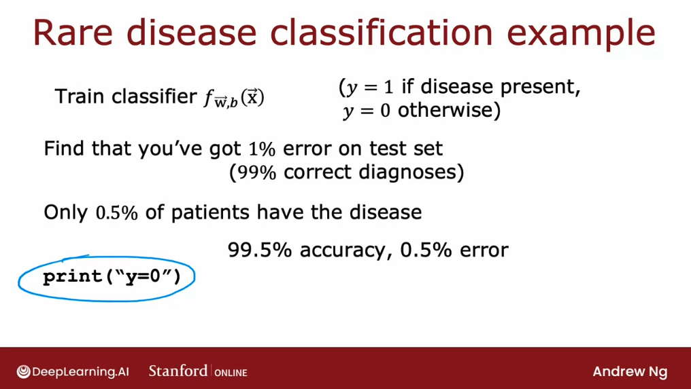
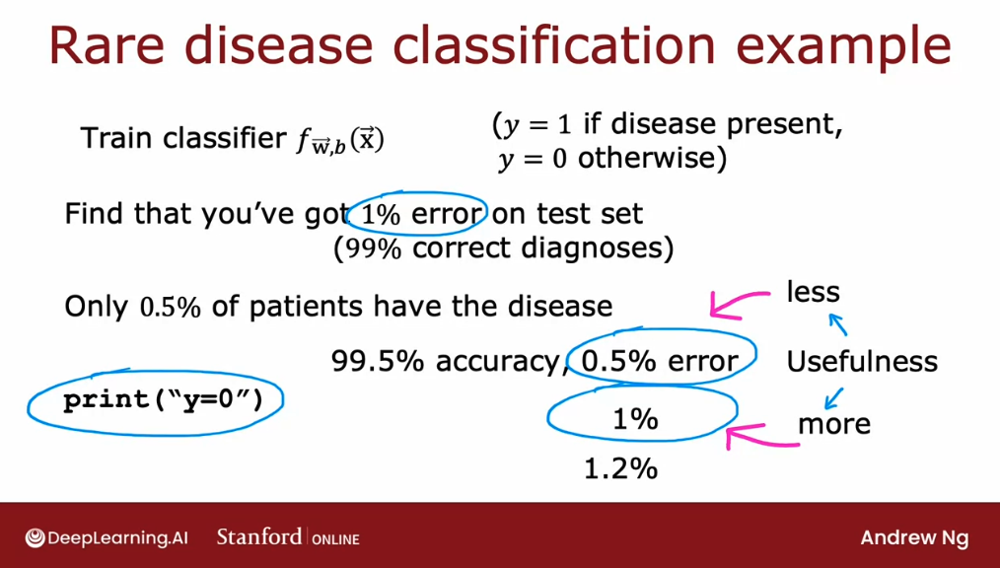
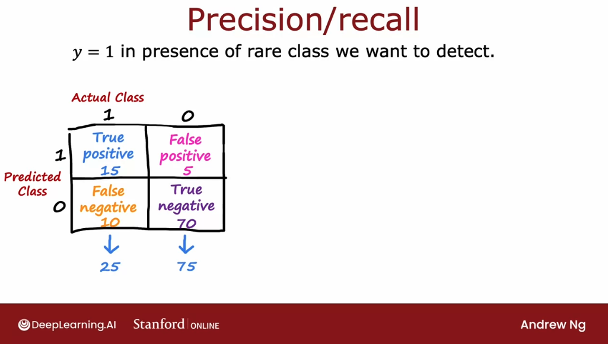

# Skewed datasets

## Error metrics for skewed datasets (precision and recall)

**If we're working on a machine learning application where the ratio of positive to negative examples is very skewed, (very far from 50-50), then the usual error metrics like accuracy don't work that well**. 

Let's start with an example where we're training a binary classifier to detect a rare disease in patients based on lab tests or based on other data from the patients:

- $y$ is equal to 1 if the disease is present
- $y$ is equal to 0 otherwise

Suppose we find that we've achieved 1% error on the test set, so we have a 99% correct diagnosis. A**lthough this seems like a great outcome, this is a rare disease, so $y$ is equal to 1 only very rarely**, then this may not be as impressive as it sounds. 

Specifically, if it is a rare disease and if only 0.5% of the patients in our population have the disease, then even an "algorithm" that just classified all patients as not having the disease would perform better.

So this really means is that **we can't tell if getting 1% error is actually a good result or a bad result**. 

In particular, if we have one algorithm that achieves 99.5% accuracy, different one that achieves 99.2% accuracy, different one that achieves 99.6% accuracy, but's difficult to know which of these is actually the best algorithm.

Why? Because if we have an algorithm that achieves 0.5% error and a different one that achieves 1% error and a different one that achieves 1.2% error, it's difficult to know which of these is the best algorithm, since the one with the lowest error might not be particularly useful with predictions - like the example which we mentioned, where $y$ always equals 0 and never ever diagnose any patient as having this disease. 

Quite possibly an algorithm that has 1% error, but that at least diagnosis some patients as having the disease could be more useful than just printing $y$ equals 0 all the time. 

When working on problems with **skewed data sets, we usually use a different error metric** rather than just classification error to figure out how well our learning algorithm is doing. A common pair of error metrics are **precision** and **recall**.

Let's define, in this example, when $y$ equals 1, it refers to the rare class, such as the rare disease that we may want to detect. 

To evaluate a learning algorithm's performance with one rare class it's useful to construct what's called a **confusion matrix**, which is a two-by-two matrix or a two-by-two table.

- On the horizontal axis on top, we're going to write the actual class, which could be one or zero. 
- On the vertical axis, we're going to write the predicted class, which is what did our learning algorithm predicts on a given example.

And we will thus have four grid cells:

- **True positives**: where the predicted class was 1 and the actual class was 1.
- **False negative**: where the predicted class was 0 and the actual class was 1.
- **False positive**: where the predicted class was 1 and the actual class was 0.
- **True negative**: where the predicted class was 0 and the actual class was 0.

Assigning our datapoints from our cross-validation or test sets into each of this quadrants, we can then calculate **precision** and **recall**:

### Precision

Of all the patientes where we predicted $y = 1$, what fraction actually have the rare disease?

$$ \text{Precision} = \frac{\text{True positives}}{\text{\# predicted positive}}$$
$$ \text{Precision} = \frac{\text{True positives}}{\text{True positives}+\text{False positives}}$$

In this example:

$$ \text{Precision} = \frac{15}{15+5} =  0.75$$

So, **for all the patients that it predicted to have the desease, it was right 75% of the times.**

### Recall

Of all the patients that actually have the rare disease, what fraction did we correctly detect as having it?

$$ \text{Recall} = \frac{\text{True positives}}{\text{\# actual positives}}$$
$$ \text{Recall} = \frac{\text{True positives}}{\text{True positives}+\text{False negatives}}$$

In this example:

$$ \text{Recall} = \frac{15}{15+10} =  0.6$$

---
Notice that these metrics will help we detect if the learning algorithm is just printing $y$ equals 0 all the time: in that case,  then the numerator of both of these quantities would be zero, since there wouldn't be any true positives. 

In practice, if an algorithm doesn't predict even a single positive, we just say that precision is also equal to zero. But we'll find that computing both precision and recall makes it easier to spot if an algorithm is both reasonably accurate, in that, when our model says a patient has a disease, there's a good chance the patient has a disease, such as 0.75 chance in this example. And also guarantees, with recall,that of all the patients that have the disease, it's helping to diagnose a reasonable fraction of them, such as here it's finding 60% of them. 

## Trading off precision and recall

In the ideal case, we like for learning algorithms that have high precision and high recall. High precision would mean that if a diagnosis of patients have that rare disease, probably the patient does have it and it's an accurate diagnosis. 

High recall means that if there's a patient with that rare disease, probably the algorithm will correctly identify that they do have that disease. But that in practice there's often a trade-off between precision and recall. In this section, we'll take a look at that trade-off and how we can pick a good point along that trade-off. 

Here are the definitions from the last section on precision and recall, I'll just write them here. Well, we recall precision is the number of true positives divided by the total number that was predicted positive, and recall is the number of true positives divided by the total actual number of positives. If we're using logistic regression to make predictions, then the logistic regression model will output numbers between 0 and 1. 

We would typically threshold the output of logistic regression at 0.5 and predict 1 if f of $x$ is greater than equal to 0.5 and predict 0 if it's less than 0.5. But suppose we want to predict that $y$ is equal to 1. That is, the rare disease is present only if we're very confident. 

If our philosophy is, whenever we predict that the patient has a disease, we may have to send them for possibly invasive and expensive treatment. If the consequences of the disease aren't that bad, even if left not treated aggressively, then we may want to predict $y$ equals 1 only if we're very confident. In that case, we may choose to set a higher threshold where we will predict $y$ is 1 only if f of $x$ is greater than or equal to 0.7, so this is saying we'll predict $y$ equals 1 only we're at least 70% sure, rather than just 50% sure and so this number also becomes 0.7. 

Notice that these two numbers have to be the same because it's just depending on whether it's greater than or equal to or less than this number that we predict 1 or 0. By raising this threshold, we predict $y$ equals 1 only if we're pretty confident and what that means is that precision will increase because whenever we predict one, we're more likely to be right so raising the thresholds will result in higher precision, but it also results in lower recall because we're now predicting one less often and so of the total number of patients with the disease, we're going to correctly diagnose fewer of them. By raising this threshold to 0.7, we end up with higher precision, but lower recall. 

In fact, if we want to predict $y$ equals 1 only if we are very confident, we can even raise this higher to 0.9 and that results in an even higher precision and so whenever we predict the patient has the disease, we're probably right and this will give we a very high precision. The recall will go even further down. On the flip side, suppose we want to avoid missing too many cases of the rare disease, so if what we want is when in doubt, predict $y$ equals 1, this might be the case where if treatment is not too invasive or painful or expensive but leaving a disease untreated has much worse consequences for the patient. 

In that case, we might say, when in doubt in the interests of safety let's just predict that they have it and consider them for treatment because untreated cases could be quite bad. If for our application, that is the better way to make decisions, then we would take this threshold instead lower it, say, set it to 0.3. In that case, we predict one so long as we think there's maybe a 30% chance or better of the disease being present and we predict zero only if we're pretty sure that the disease is absent. 

As we can imagine, the impact on precision and recall will be opposite to what we saw up here, and lowering this threshold will result in lower precision because we're now looser, we're more willing to predict one even if we aren't sure but to result in higher recall, because of all the patients that do have that disease, we're probably going to correctly identify more of them. More generally, we have the flexibility to predict one only if f is above some threshold and by choosing this threshold, we can make different trade-offs between precision and recall. that for most learning algorithms, there is a trade-off between precision and recall. 

Precision and recall both go between zero and one and if we were to set a very high threshold, say a threshold of 0.99, then we enter with very high precision, but lower recall and as we reduce the value of this threshold, we then end up with a curve that trades off precision and recall until eventually, if we have a very low threshold, so the threshold equals 0.01, then we end up with very low precision but relatively high recall. Sometimes by plotting this curve, we can then try to pick a threshold which corresponds to picking a point on this curve. The balances, the cost of false positives and false negatives or the balances, the benefits of high precision and high recall. 

Plotting precision and recall for different values of the threshold allows we to pick a point that we want. Notice that picking the threshold is not something we can really do with cross-validation because it's up to we to specify the best points. For many applications, manually picking the threshold to trade-off precision and recall will be what we end up doing. 
 that if we want to automatically trade-off precision and recall rather than have to do so yourself, there is another metric called the F1 score that is sometimes used to automatically combine precision recall to help we pick the best value or the best trade-off between the two. One challenge with precision recall is we're now evaluating our algorithms using two different metrics, so if we've trained three different algorithms and the precision-recall numbers look like this, is not that obvious how to pick which algorithm to use. If there was an algorithm that's better on precision and better on recall, then we probably want to go with that one. 

But in this example, Algorithm 2 has the highest precision, but Algorithm 3 has the highest recall, and Algorithm 1 trades off the two in-between, and so no one algorithm is obviously the best choice. In order to help we decide which algorithm to pick, it may be useful to find a way to combine precision and recall into a single score, so we can just look at which algorithm has the highest score and maybe go with that one. One way we could combine precision and recall is to take the average, this turns out not to be a good way, so I don't really recommend this. 

But if we were to take the average, we get 0.45, 0.4, and 0.5. But that computing the average and picking the algorithm with the highest average between precision and recall doesn't work that well because this algorithm has very low precision, and in fact, this corresponds maybe to an algorithm that actually does print $y$ equals 1 and diagnosis all patients as having the disease, that's why recall is perfect but the precision is really low. Algorithm 3 is actually not a particularly useful algorithm, even though the average between precision and recall is quite high. 

Let's not use the average between precision and recall. Instead, the most common way of combining precision recall is a compute something called the F1 score, and the F1 score is a way of combining P and R precision and recall but that gives more emphasis to whichever of these values is lower. Because if an algorithm has very low precision or very low recall is pretty not that useful. 

The F1 score is a way of computing an average of sorts that pays more attention to whichever is lower. The formula for computing F1 score is this, we're going to compute one over P and one over R, and average them, and then take the inverse of that. Rather than averaging P and R precision recall we're going to average one over P and one over R, and then take one over that. 

If we simplify this equation it can also be computed as follows. But by averaging one over P and one over R this gives a much greater emphasis to if either P or R turns out to be very small. If we were to compute the F1 score for these three algorithms, we'll find that the F1 score for Algorithm 1 is 0.444, and for the second algorithm is 0.175. 

we notice that 0.175 is much closer to the lower value than the higher value and for the third algorithm is 0.0392. F1 score gives away to trade-off precision and recall, and in this case, it will tell us that maybe the first algorithm is better than the second or the third algorithms. By the way, in math, this equation is also called the harmonic mean of P and R, and the harmonic mean is a way of taking an average that emphasizes the smaller values more. 

But for the purposes of this class, we don't need to worry about that terminology of the harmonic mean. Congratulations on getting to the last section of this week and thank we also for sticking with me through these two optional sections. In this week, we've learned a lot of practical tips, practical advice for how to build a machine learning system, and by applying these ideas, I think we'd be very effective at building machine learning algorithms. 

Next week, we'll come back to talk about another very powerful machine learning algorithm. In fact, of the advanced techniques that why we use in many commercial production settings, I think at the top of the list would be neural networks and decision trees. Next week we'll talk about decision trees, which I think will be another very powerful technique that we're going to use to build many successful applications as well. 

I look forward to seeing we next week.