# Decision tree learning

## Measuring purity

In this section, we'll look at the way of **measuring the purity of a set of examples**. 

If the examples are all cats of a single class then that's very pure, if it's all "not cats" that's also very pure. But if it's somewhere in between how do we quantify how pure is the set of examples? 

Let's take a look at **the definition of entropy, which is a measure of the impurity of a set of data**:

Given a set of six examples, three cats and three dogs, let's define $p_1$ to be the fraction of examples that are cats, that is, the fraction of examples with label one. $p_1$ in this example is equal to 3/6.


We're going to measure the impurity of a set of examples using a function called the entropy function, which looks as follows:


The entropy function is conventionally denoted as **H** of the number $p_1$: $H(p_1)$.

The function curve has as its horizontal axis $p_1$, the fraction of cats in the sample, and the vertical axis is the value of the entropy. In this example where $p_1$ is 3/6 or 0.5, the value of the entropy of $p_1$ would be equal to one.


Notice that this curve is highest when our set of examples is 50-50, so it's most impure: it has an impurity or entropy of 1 when our set of examples is 50-50. In contrast, if our set of examples was either all cats or "not cats" then the entropy is 0.

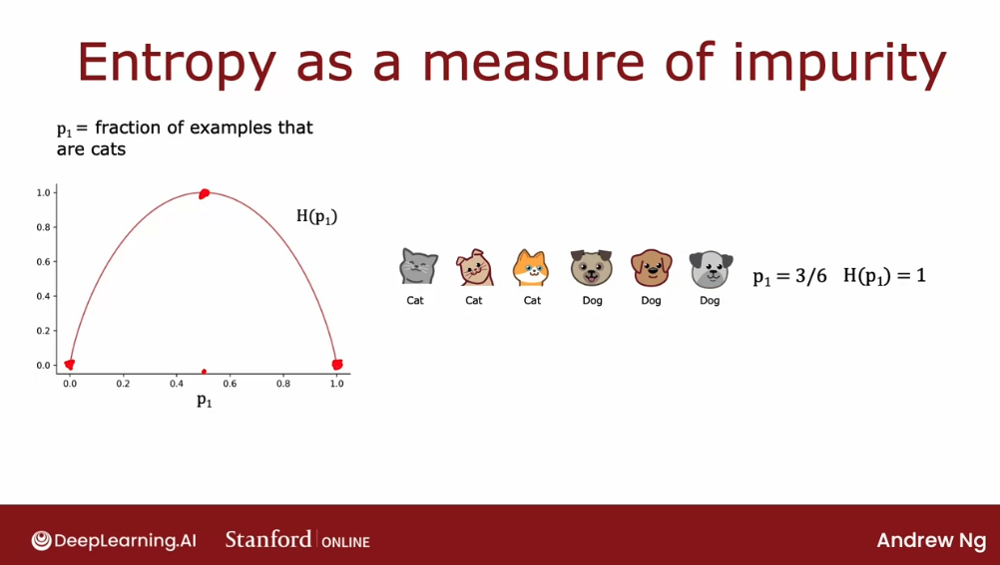

Let's just go through a few more examples to gain further intuition about entropy and how it works. Here's a different set of examples with five cats and one dog, so $p_1$ the fraction of positive examples, a fraction of examples labeled one is 5/6 and so $p_1$ is about 0.83. If we read off that value at about 0.83 we find that the entropy of $p_1$ is about 0.65.


One more examples: the following sample of six images has all cats. So $p_1$ is 6/6 because all six are cats and the entropy of $p_1$ is this point over here which is zero. We see that **as we go from 3/6 to 6/6 cats, the impurity decreases from 1 to 0 or in other words, the purity increases as we go from a 50-50 mix of cats and dogs to all cats. **


Let's look at a few more examples. 

Here's another sample with two cats and four dogs: so $p_1$ here is 2/6 which is 1/3. If we read off the entropy at 0.33 it turns out to be about 0.92. 

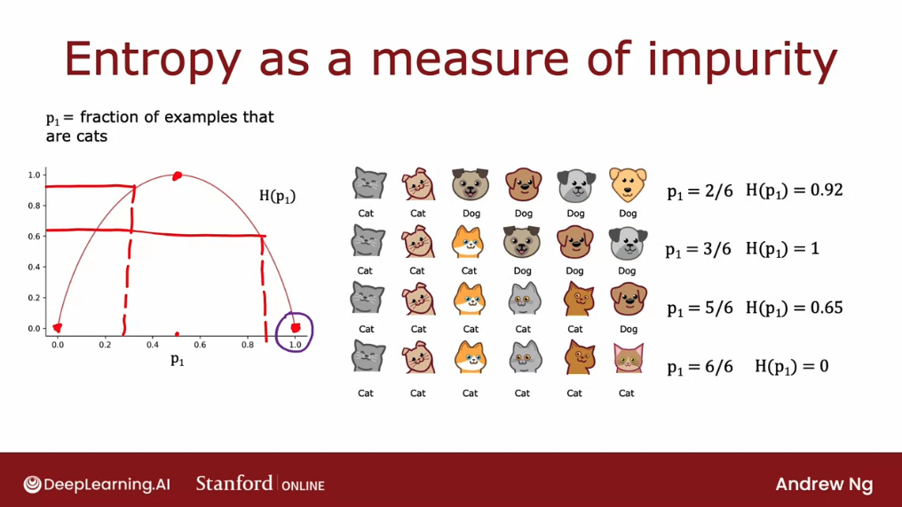


This is actually quite impure. In particular, this set is more impure the third set, which has an entropy of 0.65, because it's closer to a 50-50 mix.


Finally, one last example: if we have a set of all six dogs then $p_1$ is equal to 0 and the entropy of $p_1$ is equal to 0. So  there's zero impurity: a completely pure set of all "not cats" or all dogs.


Now, let's look at **the actual equation for the entropy function $H(p_1)$**. Recall that $p_1$ is the fraction of examples that are equal to cats so if we have a sample that is 2/3 cats then that sample must have 1/3 "not cats". Let's define $p_0$ to be equal to the fraction of examples that are "not cats" to be just equal to 1 minus $p_1$. 

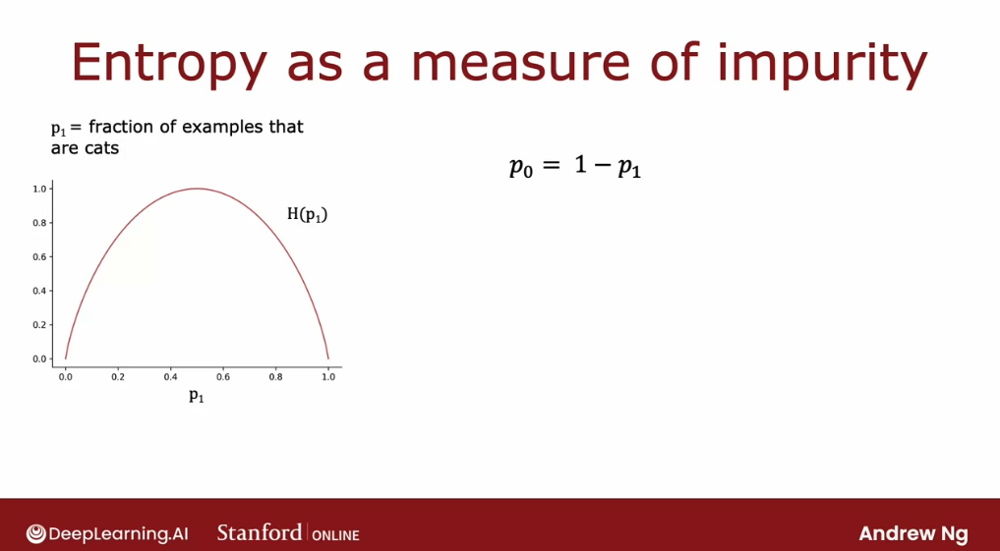

The entropy function is then defined: 

$$ -p_1 log_2(p_1) - p_0 log_2(p_0) $$


and by convention when computing entropy we use log of base-2 rather than base-e,

Alternatively, this is also equal:

$$ -p_1 log_2(p_1) - (1-p_1) \space log_2(1-p_1) $$

**We take $log_2$ just to make the peak of this curve equal to one**. If we were to take $log_e$ or the base of natural logarithms, then that just vertically scales this function. It would still work but the numbers become a bit hard to interpret because the peak of the function isn't a round number like 1 anymore. 

One note on computing this function: if $p_1$ or $p_0$ is equal to 0 then one of the terms will look like $0 \space log(0)$, which is technically undefined (tends to negative infinity). But by convention, for the purposes of computing entropy, we'll take $0 \space log(0)$, to be equal to 0. That will correctly compute the entropy as zero.

If we're thinking that this definition of entropy looks a little bit like the definition of the logistic loss that we learned about in the last course, there is actually a mathematical rationale for why these two formulas look so similar. 

To summarize: the entropy function is a measure of the impurity of a set of data. **It starts from zero, goes up to one, and then comes back down to zero as a function of the fraction of positive examples in our sample.** 

There are other functions that look, they go from zero up to one and then back down. For example, if we look in open source packages we may also hear about something called the Gini criteria, which is another function that looks a lot like the entropy function, and that will work well as well for building decision trees. But for the sake of simplicity, in these sections we're going to focus on using the entropy criteria which will usually work just fine for most applications. Now that we have this definition of entropy, in the next section let's take a look at how we can actually use it to make decisions as to what feature to split on in the nodes of a decision tree. 

## Choosing a split: Informational gain

**When building a decision tree, the way we will decide what feature to split on at a node will be based on what choice of feature reduces entropy the most.** "Reduces entropy" or "reduces impurity" which also means "maximizes purity". 

In decision tree learning, **the reduction of entropy is called information gain.**

Let's take a look, in this section, at how to compute information gain and therefore choose what features to use to split on at each node in a decision tree. 

Let's use the example of deciding what feature to use at the root node of the decision tree we were building for recognizing cats versus "not cats".

If we had split **using their ear shape feature at the root node**, we would have gotten five examples on the left and five on the right:

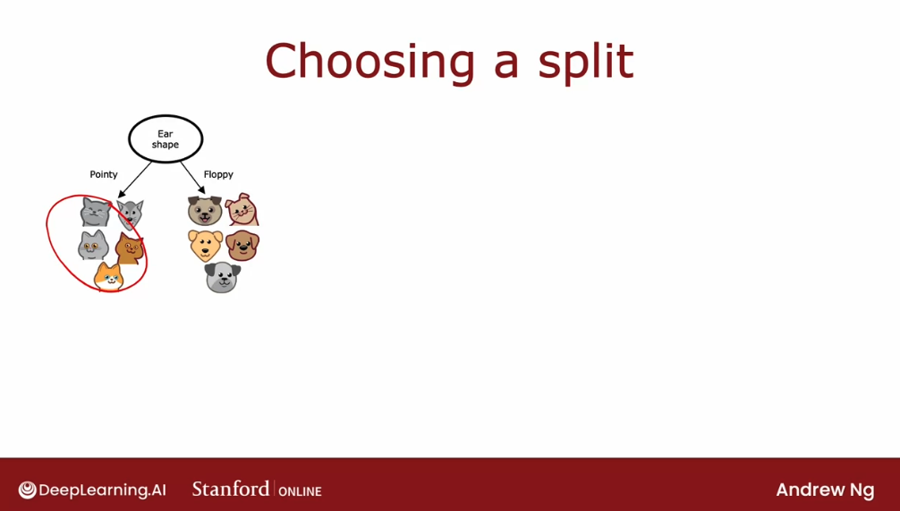

On the left, we would have 4/5 cats, so $p_1$ would be equal to 4/5 or 0.8. On the right, 1/5 are cats, so $p_1$ is equal to 1/5 or 0.2. If we apply the entropy formula from the last section to this left subset of data and this right subset of data, we find that the degree of impurity on the left is $H(0.8)$, which is about 0.72, and on the right, the entropy of 0.2, $H(0.2)$ turns out also to be 0.72. 


One other option would be to **split on the face shape feature on the root node**. If we'd done so, then on the left, 4/7 examples would be cats, so $p_1$ is 4/7, and on the right, 1/3 are cats, so $p_1$ on the right is 1/3. 

The entropy of 4/7 and the entropy of 1/3 are 0.99 and 0.92, respectively. So the degree of impurity in the left and right nodes seems much higher, 0.99 and 0.92 compared to 0.72 and 0.72, from the previous choice of feature.

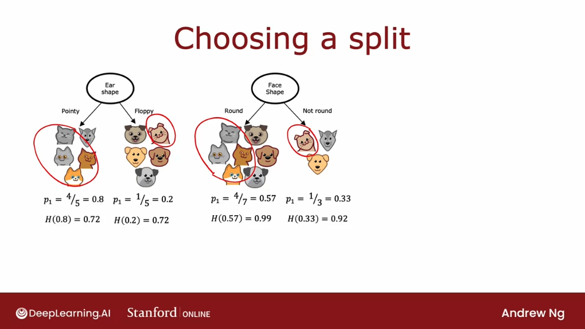

Finally, the third possible **choice of feature to use at the root node would be the whiskers feature**. In this case, $p_1$ on the left is 3/4, $p_1$ on the right is 2/6, and the entropy values are as seen below: 


The key question we need to answer is: g**iven these three options of a feature to use at the root node, which one works best?** Rather than looking at these entropy numbers and comparing them, it would be useful to **take a weighted average of them**:


If there's a node with a lot of examples in it, that has high entropy, that is "worse" than if there was a node with just a few examples in it, with also high entropy. **This is because entropy, as a measure of impurity, is worse if we have a very large and impure dataset compared to just a few examples and a branch of the tree that is very impure.** 

Of these three possible choices of features to use at the root node, which one do we want to use? 

So, associated with each of these splits is two numbers, the entropy on the left sub-branch and the entropy on the right sub-branch. In order to pick from these, we like to actually combine these two numbers into a single number by taking a weighted average.

In the first example we have that 5/10 examples went to the left sub-branch, so we can compute the weighted average as 5/10 times the entropy of 0.8, and then add to that 5/10 examples also went to the right sub-branch, plus 5/10 times the entropy of 0.2.  And the same formula applies for all cases:


**The way we will choose a split is by computing these three numbers and picking whichever one is lowest**, since that gives us the left and right sub-branches with the lowest average weighted entropy. 

Because of the way that decision trees are built, we're actually going to make one more change to these formulas to stick to the convention in decision tree building, but it won't actually change the outcome: **rather than computing this weighted average entropy, we're going to compute the reduction in entropy compared to the case in which we hadn't split at all.** 

So, if we go to the root node, where we have started off with all 10 examples, with five cats and dogs, there we had $p_1$ equals 5/10 or 0.5. The entropy of the root node was $H(0.5)$, which is 1. This was maximum impurity:


So, the formula that we're actually going to use for choosing a split is not this weighted entropy at the left and right sub-branches. Instead it's going to be: **the entropy at the root node, $H(0.5)$, minus the formula for the weighted average. **


In this example, if we work out the math, it turns out to be 0.28 for the face shape feature, 0.03 for the face shape feature, and 0.12 for the whiskers feature. **These numbers are called the information gain**, and **they measure the reduction in entropy that we get in our tree resulting from making a split**. 


**Why do we bother to compute reduction in entropy rather than just entropy at the left and right sub-branches?** 

Recall that one of the stopping criteria for deciding when **not to split any further is if the reduction in entropy is too small**. In such a case we could decide that we would be simply increasing the size of the tree unnecessarily and risking overfitting by splitting. So we just decide to not bother if the reduction in entropy is too small or below a threshold. 

In this particular example, **splitting on ear shape results in the biggest reduction in entropy,** since 0.28 is bigger than 0.03 or 0.12. We would therefore choose to split using the ear shape feature at the root node. 

One additional piece of notation that we'll introduce are: the fractions 5/10 and 5/10, 7/10 and 3/10, etc, we're going to call them $w_{\text{left}}$ because that's the fraction of examples that went to the left branch, and we're going to call the complement $w_{\text{right}}$ because that's the fraction of examples that went to the right branch. 

Let's now see **the general formula for how to compute information gain**:

Using the example of splitting on the ear shape feature, **let's define $p_1^{\text{left}}$ to be equal to the fraction of examples in the left subtree that have a positive label, i.e. that are cats**. In this example,$p_1^{\text{left}}$ will be equal to 4/5. Also, let's define $w_left$ to be the fraction of examples of all of the examples of the root node that went to the left sub-branch. So in this example, $w_left$ would be 5/10. And we can similarly define the same values for the right branch:


Let's also define $p_1^{\text{root}}$ to be the fraction of examples that are positive in the root node, which, in this case, would be 5/10 or 0.5. 

**Information gain** is then defined as:

$$ \text{Information gain} = H(p_1^{\text{root}}) - [w_{\text{left}} H(p_1^{\text{left}}) + w_{\text{right}} H(p_1^{\text{right}})] $$

With this definition of entropy, and we can calculate the information gain associated with choosing any particular feature to split on in the node. Then out of all the possible features we could choose to split on, **we can then pick the one that gives we the highest information gain**. 

That should result in, hopefully, increasing the purity of our subsets of data that we get on the left and right sub-branches of our decision tree.

Let's put all the things we've talked about together into the overall algorithm for building a decision tree given a training set. Let's go see that in the next section. 

## Putting it together

The information gain criteria lets us decide how to choose one feature to split a one-node. Let's take that and use that in multiple places through a decision tree in order to build a large decision tree with multiple nodes. 


First, the following is **the overall process of building a decision tree**:

1. Starts with all training examples at the root node of the tree.
2. Calculate the information gain for all possible features. Pick the feature to split on that gives the highest information gain.
3. Split the dataset into two subsets according to the selected feature, and create left and right branches of the tree. Send the training examples to either the left or the right branch, depending on the value of that feature for that example.
4. Keep on repeating the splitting process on both branches until the stopping criteria is met:
  -  when a node is 100% a single class (we have reached entropy of zero)
  - when further splitting a node will cause the tree to exceed the maximum depth that we had set
  - if information gain from an additional splits is less than the threshold
  - if the number of examples in a node is below a threshold

Let's look at an illustration of how this process will work: we started all of the examples at the root nodes and based on computing information gain for all three features, we decide that ear-shaped is the best feature to split on. Based on that, we create a left and right sub-branches and send the subsets of the data with pointy versus floppy ear to left and right sub-branches.


Let's for now just focus on the left sub-branch where we have five examples: if our splitting criteria is to keep splitting until everything in the node belongs to a single class, so either all cats or all dogs. We will look at this node and see if it meets the splitting criteria: it does not because there is a mix of cats and dogs here.


So, the next step is to then pick a feature to split on. We then go through the features one at a time and **compute the information gain of each of those features as if this node were the new root node of a decision tree that was trained using just five training examples**. We would compute the information gain for splitting on the whiskers feature, the information gain on splitting on the face shape feature and the ear shape feature.

The information gain for splitting on ear shape will be zero because all of these training example the same point ear shape. Between whiskers and face shape, face shape turns out to have a highest information gain. So, we're going to split on face shape and that allows us to build left and right sub branches as follows:


For the left sub-branch, we check for the criteria for whether or not we should stop splitting and we have all cats. So, **the stopping criteria is met**, and **we create a leaf node that makes a prediction of cat**. 

For the right sub-branch, we find that it is all dogs, so we also stop splitting since we've met the splitting criteria. We put a leaf node there, that predicts "not cat":


Having built out this left subtree, we can now turn our attention to building the right subtree. Let's' now again cover up the root node and the entire left subtree:


To build out the right subtree, we have five examples. Again, the first thing we do is check if the criteria to stop splitting has been met. Since the criteria is if all the examples are a single class, we know we have not met that criteria.

So we will decide to keep splitting in this right sub-branch as well. In fact, the procedure for building the right sub-branch will be a lot as if we were training a decision tree learning algorithm from scratch, where the dataset we have comprises just these five training examples. Again: computing information gain for all of the possible features to split on, we find that the whiskers feature has the highest information gain:


Now agaim, we check if the criteria to stop splitting are met, and we decide that they are. We end up with leaf nodes that predict cat and "not cat".


This is the overall process for building the decision tree. 

Notice that there's interesting aspects of what we've done: after we decided what to split on at the root node, the way we built the left subtree was by building a decision tree on a subset of five examples. The way we built the right subtree was by, again, building a decision tree on a subset of five examples.


In computer science, **this is an example of a recursive algorithm**: the way we build a decision tree at the root is by building other smaller decision trees in the left and the right sub-branches.

By the way, **how do we choose the maximum depth parameter?**

There are many different possible choices, but **some of the open-source libraries will have good default choices that we can use.**

One intuition is: **the larger the maximum depth, the bigger the decision tree we're willing to build.** This is a bit **like fitting a higher degree polynomial or training a larger neural network.** It lets the decision tree learn a more complex model, but it also increases the risk of overfitting if it is fitting a very complex function to our data. 

In theory, we could use cross-validation to pick parameters like the maximum depth, where we try out different values of the maximum depth and pick what works best on the cross-validation set. Although in practice, the open-source libraries have even somewhat better ways to choose this parameter for us. 

## Using one-hot encoding of categorical features

In the example we've seen so far, each of the features could take on only one of two possible values. The ear shape was either pointy or floppy, the face shape was either round or not round and whiskers were either present or absent. But what if we have features that can take on more than two discrete values?

Here's a new training set for our pet adoption center applicatio, where all the data is the same except for the ear shaped feature. Rather than ear shape only being pointy and floppy, it can now also take on an oval shape. And so the initial feature is still a categorical value feature, but it can take on three possible values instead of just two:

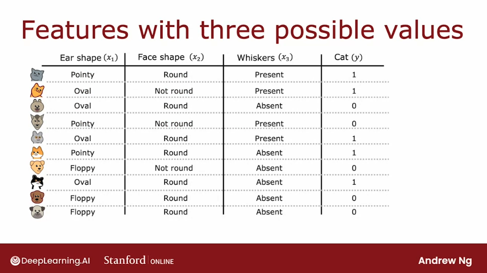

This means that when we split on this feature, we end up creating three subsets of the data and end up building three sub branches for this tree. 

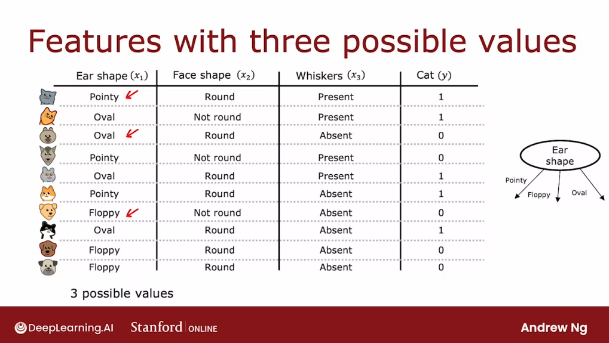

But there's a different way of addressing features that can take on more than two values, which is to **use one-hot encoding**.

 In particular rather than using an ear shaped feature, that can take on any of three possible values, we're instead going to create three new features:
 
 1. does this animal have pointy ears
 1. does this animal have floppy ears
 1. does this animal have ovala ears

And for each feature, we place a 1 or a 0 depending n the actual value for that training point:

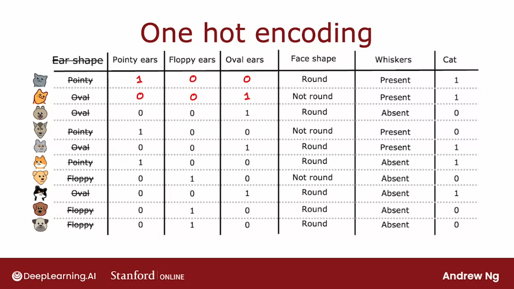

 And so: instead of one feature taking on three possible values, we've now constructed three new features each of which can take on only one of two possible values: either 0 or 1. 
 
 In a little bit more detail, **if a categorical feature can take on $k$ possible values -$k$ is three in our example-, then we will replace it by creating $k$ binary features that can only take on the values 0 or 1.**

Notice that, among all of these three features, if we look at any row here, exactly 1 of the values is equal to 1. That is what gives this method of feature construction the name **"one-hot encoding"**: only one of these features will take the value 1 and that's the hot feature.

Now, with this choice of features we're now back to the original setting, **where each feature only takes on one of two possible values**, and so the decision tree learning algorithm that we've seen previously will apply to this data with no further modifications. 

An additional note: even though this week's material has been focused on training decision tree models, **the idea of using one-hot encodings to encode categorical features also works for training neural networks.**

In particular, if we were to take the face shape feature we would replace round and not round with 1 and 0, respectively. For whiskers, similarly replace presence with 1 and absence with 0:

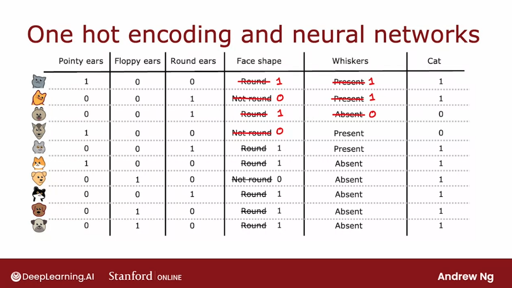

Then we can notice,  that we have taken all the categorical features we had and encoded them as a list of these five features. Three from the one-hot encoding of ear shape, one from face shape and another from whiskers. Now, **this list of five features can also be fed to a neural network or to logistic regression to try to train a cat classifier**.

## Continuous valued features

Let's look at how we can modify decision tree to work with features that aren't just discrete values, but continuous values, features that can be any number. 

Let's start with an example: 

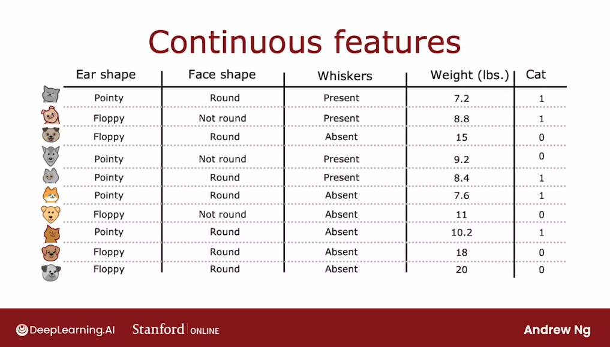

We modified the cat adoption center  data set to add one more feature which is **the weight of the animal in pounds**. On average, cats are a little bit lighter than dogs, although there are some cats are heavier than some dogs. But the weight of an animal is a useful feature for deciding if it is a cat or not. 

So how do we get a decision tree to use a feature? The decision tree learning algorithm will proceed similarly as before except that now we have to additionally split either on ear shape, face shape, whisker **or weight**. And **if splitting on the weight feature gives us better information gain than the other options, then we will split on the weight feature**. 

But how do we decide how to split on the weight feature? 

Here's a plot of the data at the root node. We plotted on the horizontal axis the wieght of the animal and the vertical axis is cat on top and "not cat" below. So the vertical axis indicates the label, $y$ being 1 or 0. 


**The way we split on the weight feature is by splitting based on whether or not the weight is less than or equal to some value.** Let's say 8 punds, although **that will be the job of the learning algorithm to choose**. And what we should do when constraint-splitting on the weight feature is to **consider many different values of this threshold and then to pick the one that is the best, i.e., that results in the best information gain** 

So in particular, if we were considering splitting the examples based on whether the weight is less than or equal to 8, then we would be splitting this data set into two subsets, where the subset on the left has two cats and the subset on the right has three cats and five dogs.

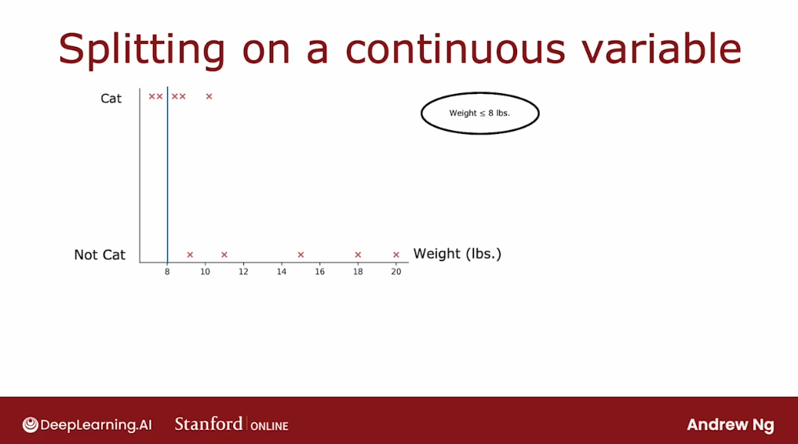

So if we were to calculate our usual information gain calculation, we'll be computing the entropy at the root node with our entropy formula, which turns out to be 0.24:

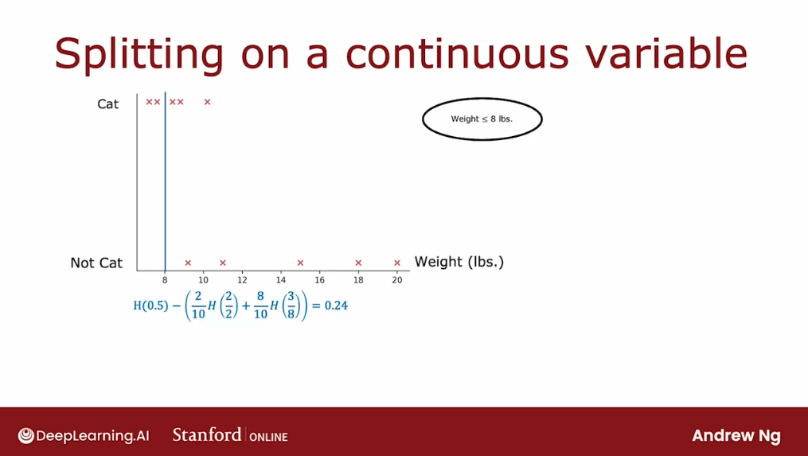

But we should try other values as well. What if we were to split on whether or not the weight is less than equal to 9? That corresponds to this new line over here:

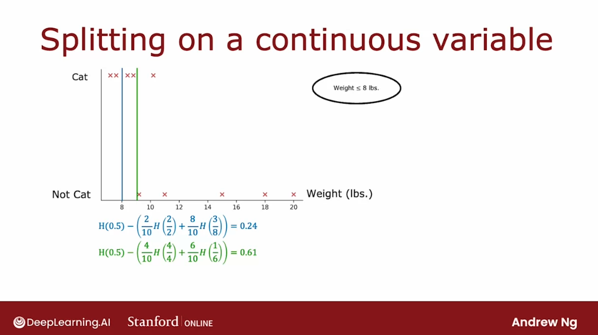

And the information gain here looks much better: 0.61, much higher than 0.24.

Orr we could try another value like 13:

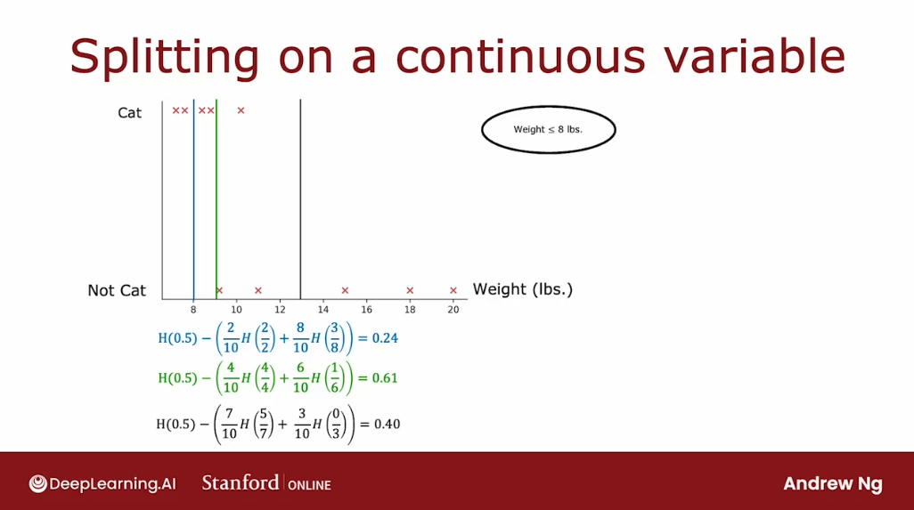

And the calculation for the information gain turns out be 0.40. 

In the more general case, we'll actually try not just three values, but multiple values along the $X$ axis. And one convention is to **sort all of the examples according to the weight or according to the value of this feature and take all the values that are mid points between the sorted list of training as examples of possible values for consideration for this threshold**. 

This way, **if we have 10 training examples, we will test nine different possible values for this threshold and then try to pick the one that gives we the highest information gain**. 

In this example an information gain of 0.61 turns out to be higher than that of any other feature. So, assuming the algorithm chooses this feature to split on, we will end up splitting the data set according to whether or not the weight of the animal is less than equal to 9 pounds.

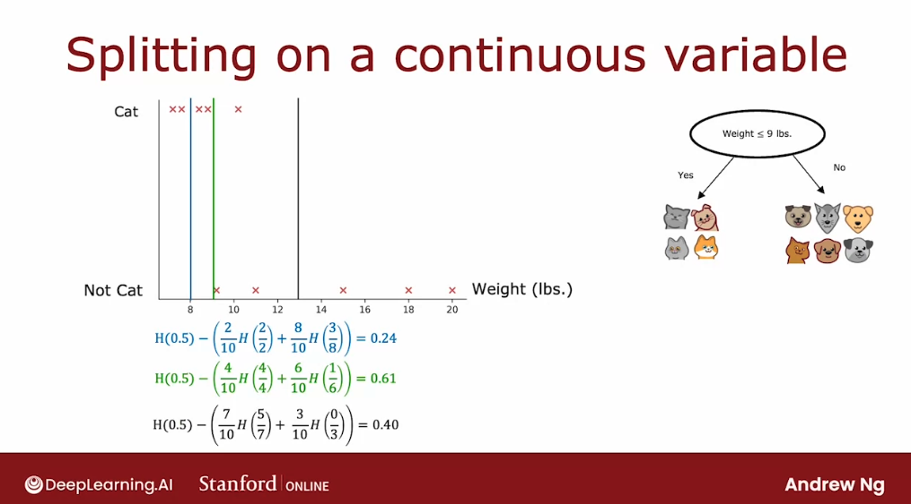

And so we end up with two subsets of the data so that we can then build recursively additional decision trees using these two subsets of the data to build out the rest of the tree. 

## Regression Trees

So far, we've only been talking about decision trees as **classification algorithms**. Now, we'll g**eneralize decision trees to be regression algorithms so that we can predict a number.**

The example we're going to use for this will be to use these three features that we had previously as $X$, in order to predict the weight of the animal, $Y$. So just to be clear, the weight, unlike the previous section is no longer an input feature, but the target output, $Y$, that we want to predict (instead of trying to predict whether or not an animal is or is not a cat.)

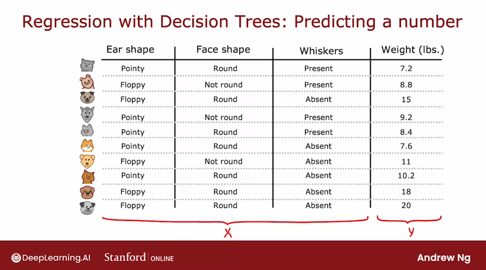

**This is a regression problem because we want to predict a number, $Y$.**

Let's look at what a regression tree will look like. Here we have an already constructed-tree for this regression problem where the root node splits on ear shape feature, and then the left and right sub tree split on face shape:


**There's nothing wrong with a decision tree that chooses to split on the same feature in both the left and right side branches.** It's perfectly fine **if the splitting algorithm chooses to do that.** 

If during training, we had decided on these splits, then the leaf nodes would have animals with the following weights:


So, the last thing we need to fill in for this decision tree is: if there's a test example that comes down to one of these nodes, for example, the left-most node, what is the weight that we should predict for an animal with pointy ears and a round face shape?

**The decision tree is going to make a prediction based on taking the average of the weights in the training examples on a leaf node.**

And by averaging the four numbers, of that node, it turns out we get 8.35 pounds:

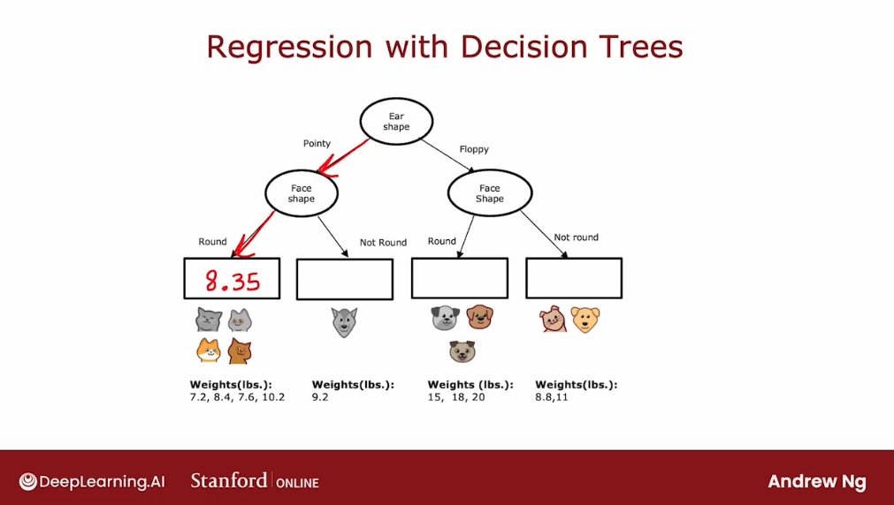

 If on the other hand, an animal has pointy ears and a not round face shape, then it will predict 9.2 pounds because that's the weight of this one animal in the corresponding node. And similarly for the other two nodes:

 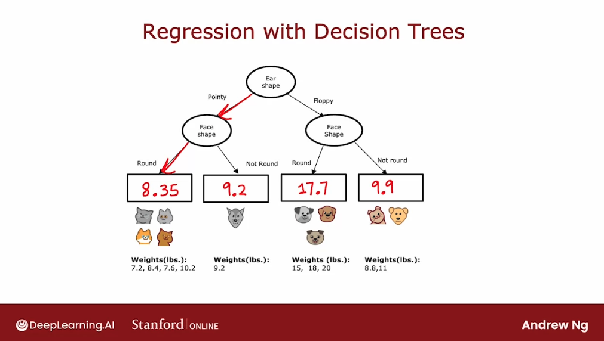

So, what this model will do is: **given a new test example, follow the decision nodes down as usual until it gets to a leaf node and then predict that value at the leaf node which I had just computed by taking an average of the weights of the animals that during training got to that same leaf node.** 

So, if we were constructing a decision tree from scratch using this data set in order to predict the weight, **the key decision, as before, is: how do we choose which feature to split on?** 

Let's illustrate how to make that decision with an example. At the root node, one thing we could do is split on the ear shape: if we do that, we end up with left and right branches of the tree with five animals on the left and right with the following weights:

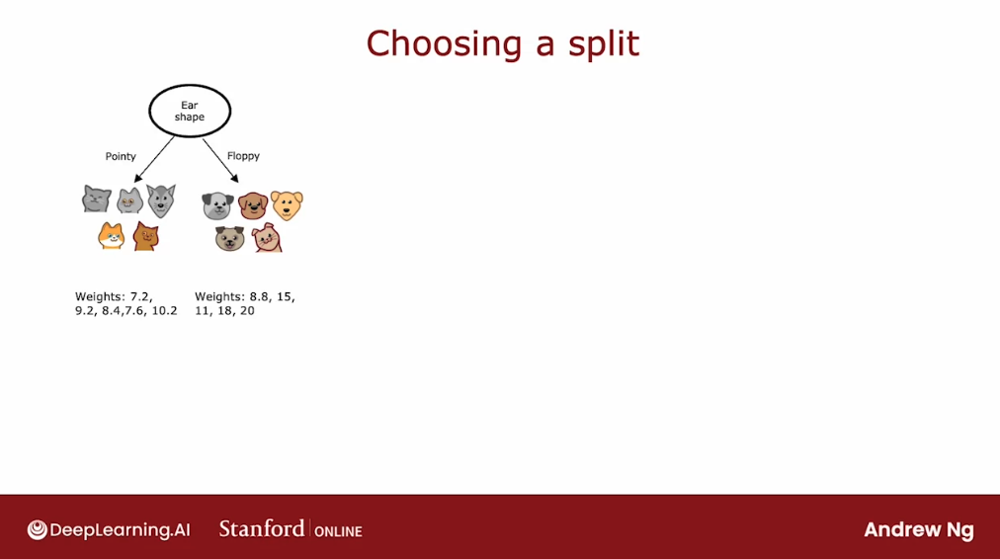

If we were to choose the split on the face shape, we end up with these animals on the left and right with the corresponding weights:


And if we were to choose to split on whiskers being present or absent, we end up with this: 


So, the question is: **given these three possible features to split on at the root node, which one do we want to pick that gives the best predictions for the weight of the animal?**

**When building a regression tree, rather than trying to reduce entropy,** which was that measure of impurity that we had for a classification problem, **we instead try to reduce the variance of the weight of the values $Y$ at each of these subsets of the data.** 

**Variant is the statistical mathematical notion of how widely a set of numbers varies.** So for the set of numbers 7.2, 9.2 and so on, up to 10.2, it turns out the variance is 1.47: it doesn't vary that much. Whereas, for 8.8, 15, 11, 18 and 20, these numbers go all the way from 8.8 all the way up to 20, so the variance is much larger: 21.87. 


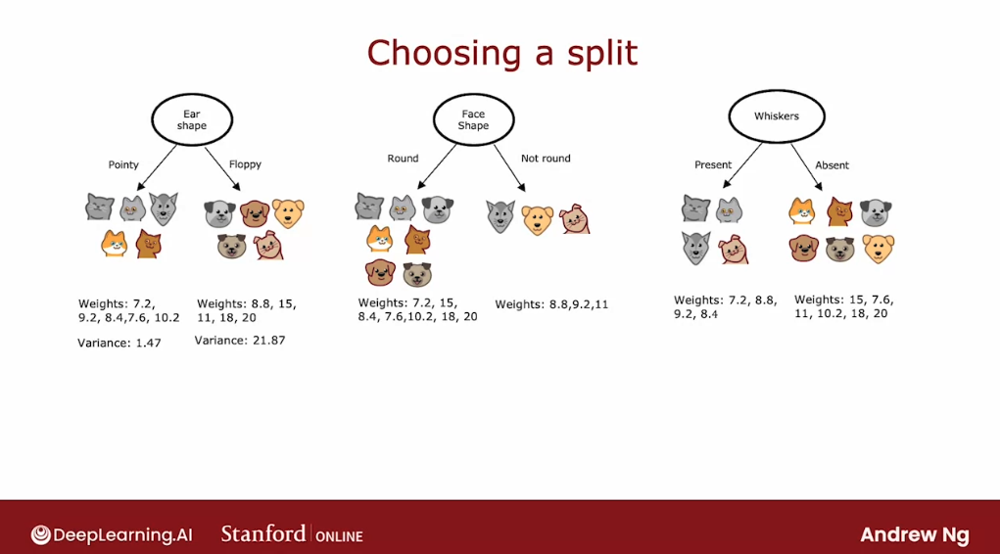

The way we'll evaluate the quality of the split is: first, we'll compute same as before, $w_{\text{left}}$  and $w_{\text{right}}$  as the fraction of examples that went to the left and right branches. And then, **the average variance** after the split is going to be $w_{\text{left}}$ times the left variance, plus $w_{\text{right}}$ times the right variance:

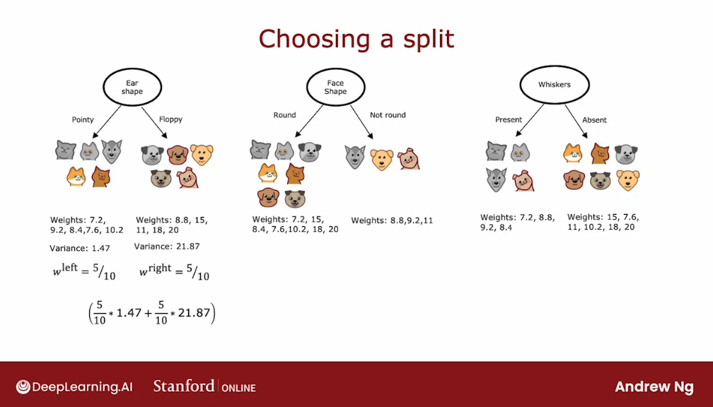

**This weighted average variance plays a very similar role to the weighted average entropy** that we had used when deciding what split to use for a classification problem. 

Then we repeat this calculation for the other possible choices of features to split on:

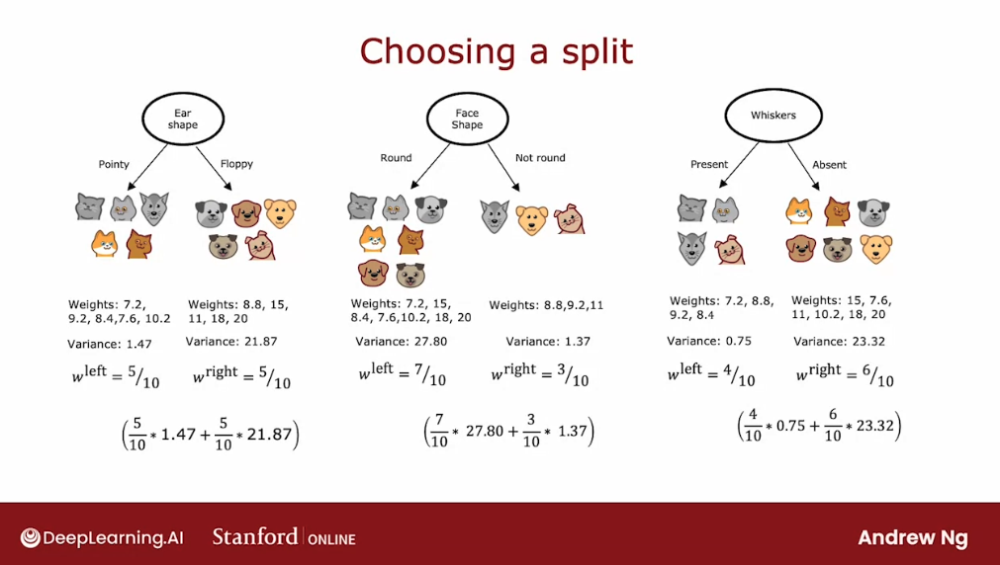

A good way **to choose a split would be to just choose the value of the weighted variance that is lowest.** 

Similar to when we're computing information gain, we're going to make just one more modification to this equation. Just as for the classification problem, we didn't just measure the average weighted entropy, we measured the reduction in entropy and that was information gain. For a regression tree, we'll also **similarly measure the reduction in variance**. 

Turns out, if we look at all of the examples in the training set, all ten examples and compute the variance of all of them, the variance of all the examples turns out to be 20.51. That's the same value for the roots node in all of these, of course, because it's the same ten examples at the roots node.


So what we'll actually compute is the variance of the roots node, which is 20.51, minus this average weighted variance in each of the possible splits:


So, between all three of these exampless, 8.84 gives we the largest reduction in variance. So, just as previously we would choose the feature that gives we the largest information gain for a regression tree, **we will choose the feature that gives we the largest reduction in variance, which is why we choose ear shape as the feature to split on.** 

Having chosen the ear shape feature to split on, we now have two subsets of five examples in the left and right side branches and we would then recursively split the tree according to a feature, taking the five examples and doing a new decision tree focusing on those five, evaluating different options of features to split on and picking the one that gives we the biggest variance reduction. And similarly on the right. And we keep on splitting until we meet the criteria for not splitting any further. 

## Optional Lab: Decision Trees

[LINK](https://www.coursera.org/learn/advanced-learning-algorithms/ungradedLab/hPtix/optional-lab-decision-trees/lab?path=%2Fnotebooks%2FC2_W4_Lab_01_Decision_Trees.ipynb)

[Internal Link](./labs/Work%204/C2_W4_Lab_01_Decision_Trees.ipynb)

In this notebook you will visualize how a decision tree is splitted using information gain.

We will revisit the dataset used in the video lectures.

As you saw in the lectures, in a decision tree, we decide if a node will be split or not by looking at the **information gain** that split would give us. (Image of video IG)

Where 

$$\text{Information Gain} = H(p_1^\text{node})- \left(w^{\text{left}}H\left(p_1^\text{left}\right) + w^{\text{right}}H\left(p_1^\text{right}\right)\right),$$

and $H$ is the entropy, defined as

$$H(p_1) = -p_1 \text{log}_2(p_1) - (1- p_1) \text{log}_2(1- p_1)$$

Remember that log here is defined to be in base 2. Run the code block below to see by yourself how the entropy. $H(p)$ behaves while $p$ varies.

Note that the H attains its higher value when $p = 0.5$. This means that the probability of event is $0.5$. And its minimum value is attained in $p = 0$ and $p = 1$, i.e., the probability of the event happening is totally predictable. Thus, the entropy shows the degree of predictability of an event.

```py
import pandas as pd
import numpy as np
import matplotlib.pyplot as plt
from utils import *
```

```py
%matplotlib widget
_ = plot_entropy()

```

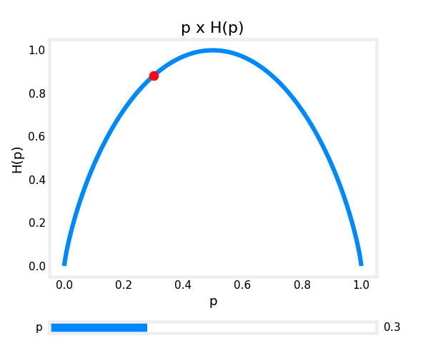


We will use **one-hot encoding** to encode the categorical features. They will be as follows:

- Ear Shape: Pointy = 1, Floppy = 0
- Face Shape: Round = 1, Not Round = 0
- Whiskers: Present = 1, Absent = 0

Therefore, we have two sets:

- `X_train`: for each example, contains 3 features:
            - Ear Shape (1 if pointy, 0 otherwise)
            - Face Shape (1 if round, 0 otherwise)
            - Whiskers (1 if present, 0 otherwise)
            
- `y_train`: whether the animal is a cat
            - 1 if the animal is a cat
            - 0 otherwise

```py
X_train = np.array([[1, 1, 1],
[0, 0, 1],
 [0, 1, 0],
 [1, 0, 1],
 [1, 1, 1],
 [1, 1, 0],
 [0, 0, 0],
 [1, 1, 0],
 [0, 1, 0],
 [0, 1, 0]])

y_train = np.array([1, 1, 0, 0, 1, 1, 0, 1, 0, 0])
```

```py
#For instance, the first example
X_train[0]
# array([1, 1, 1])
```

This means that the first example has a pointy ear shape, round face shape and it has whiskers.

On each node, we compute the information gain for each feature, then split the node on the feature with the higher information gain, by comparing the entropy of the node with the weighted entropy in the two splitted nodes.

So, the root node has every animal in our dataset. Remember that $p_1^{node}$ is the proportion of positive class (cats) in the root node. So

$$p_1^{node} = \frac{5}{10} = 0.5$$

Now let's write a function to compute the entropy.

```py
def entropy(p):
    if p == 0 or p == 1:
        return 0
    else:
        return -p * np.log2(p) - (1- p)*np.log2(1 - p)
    
print(entropy(0.5))
# 1.0
```

To illustrate, let's compute the information gain if we split the node for each of the features. To do this, let's write some functions.

```py
def split_indices(X, index_feature):
    """Given a dataset and a index feature, return two lists for the two split nodes, the left node has the animals that have 
    that feature = 1 and the right node those that have the feature = 0 
    index feature = 0 => ear shape
    index feature = 1 => face shape
    index feature = 2 => whiskers
    """
    left_indices = []
    right_indices = []
    for i,x in enumerate(X):
        if x[index_feature] == 1:
            left_indices.append(i)
        else:
            right_indices.append(i)
    return left_indices, right_indices
```

So, if we choose Ear Shape to split, then we must have in the left node (check the table above) the indices:

$$0 \quad 3 \quad 4 \quad 5 \quad 7$$

and the right indices, the remaining ones.

```py
split_indices(X_train, 0)
# ([0, 3, 4, 5, 7], [1, 2, 6, 8, 9])
```

Now we need another function to compute the weighted entropy in the splitted nodes. As you've seen in the video lecture, we must find:

- $w^{\text{left}}$ and $w^{\text{right}}$, the proportion of animals in **each node**.
- $p^{\text{left}}$ and $p^{\text{right}}$, the proportion of cats in **each split**.

Note the difference between these two definitions!! To illustrate, if we split the root node on the feature of index 0 (Ear Shape), then in the left node, the one that has the animals 0, 3, 4, 5 and 7, we have:

$$w^{\text{left}}= \frac{5}{10} = 0.5 \text{ and } p^{\text{left}} = \frac{4}{5}$$
$$w^{\text{right}}= \frac{5}{10} = 0.5 \text{ and } p^{\text{right}} = \frac{1}{5}$$

```py
def weighted_entropy(X,y,left_indices,right_indices):
    """
    This function takes the splitted dataset, the indices we chose to split and returns the weighted entropy.
    """
    w_left = len(left_indices)/len(X)
    w_right = len(right_indices)/len(X)
    p_left = sum(y[left_indices])/len(left_indices)
    p_right = sum(y[right_indices])/len(right_indices)
    
    weighted_entropy = w_left * entropy(p_left) + w_right * entropy(p_right)
    return weighted_entropy
```

```py
left_indices, right_indices = split_indices(X_train, 0)
weighted_entropy(X_train, y_train, left_indices, right_indices)
# 0.7219280948873623
```

So, the weighted entropy in the 2 split nodes is 0.72. To compute the **Information Gain** we must subtract it from the entropy in the node we chose to split (in this case, the root node). 

```py
def information_gain(X, y, left_indices, right_indices):
    """
    Here, X has the elements in the node and y is theirs respectives classes
    """
    p_node = sum(y)/len(y)
    h_node = entropy(p_node)
    w_entropy = weighted_entropy(X,y,left_indices,right_indices)
    return h_node - w_entropy
```

```py
information_gain(X_train, y_train, left_indices, right_indices)
# 0.2780719051126377
```

Now, let's compute the information gain if we split the root node for each feature:
```py
for i, feature_name in enumerate(['Ear Shape', 'Face Shape', 'Whiskers']):
    left_indices, right_indices = split_indices(X_train, i)
    i_gain = information_gain(X_train, y_train, left_indices, right_indices)
    print(f"Feature: {feature_name}, information gain if we split the root node using this feature: {i_gain:.2f}")

# Feature: Ear Shape, information gain if we split the root node using this feature: 0.28
# Feature: Face Shape, information gain if we split the root node using this feature: 0.03
# Feature: Whiskers, information gain if we split the root node using this feature: 0.12
```

So, the best feature to split is indeed the Ear Shape. Run the code below to see the split in action. You do not need to understand the following code block. 

```py
tree = []
build_tree_recursive(X_train, y_train, [0,1,2,3,4,5,6,7,8,9], "Root", max_depth=1, current_depth=0, tree = tree)
generate_tree_viz([0,1,2,3,4,5,6,7,8,9], y_train, tree)

# Depth 0, Root: Split on feature: 0
#  - Left leaf node with indices [0, 3, 4, 5, 7]
#  - Right leaf node with indices [1, 2, 6, 8, 9]
```


The process is **recursive**, which means we must perform these calculations for each node until we meet a stopping criteria:

- If the tree depth after splitting exceeds a threshold
- If the resulting node has only 1 class
- If the information gain of splitting is below a threshold

The final tree looks like this:

```py
tree = []
build_tree_recursive(X_train, y_train, [0,1,2,3,4,5,6,7,8,9], "Root", max_depth=2, current_depth=0, tree = tree)
generate_tree_viz([0,1,2,3,4,5,6,7,8,9], y_train, tree)

#  Depth 0, Root: Split on feature: 0
# - Depth 1, Left: Split on feature: 1
#   -- Left leaf node with indices [0, 4, 5, 7]
#   -- Right leaf node with indices [3]
# - Depth 1, Right: Split on feature: 2
#   -- Left leaf node with indices [1]
#   -- Right leaf node with indices [2, 6, 8, 9]
```

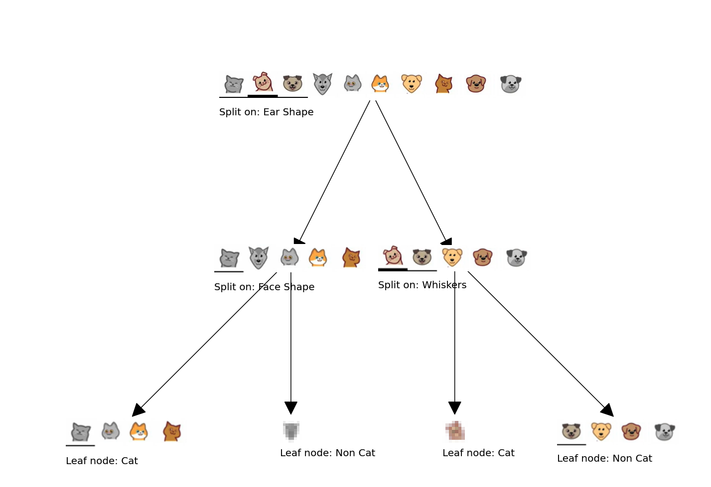