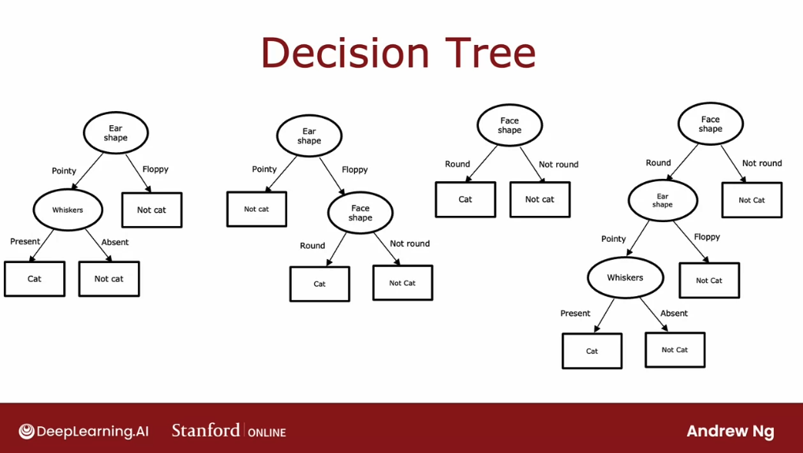

# Decision trees

## Decision tree model

One of the learning algorithms that is very powerful, widely used in many applications, also used by many to win machine learning competitions is **decision trees and tree ensembles**. 

They somehow haven't received that much attention in academia, and so we may not hear about decision trees nearly that much, but it is a tool well worth having in our toolbox.

To explain how decision trees work, we're going to use as a running example a cat classification example: we are running a cat adoption center and given a few features, we want to train a classifier to quickly tell we if an animal is a cat or not. We have here 10 training examples:

Associated with each of these 10 examples, we're going to have features regarding the animal's ear shape, face shape, whether it has whiskers, and then the ground truth label that we want to predict is if this animal cat is a cat. The first example has pointy ears, round face, whiskers are present, and it is a cat. The second example has floppy ears, the face shape is not round, whiskers are present, and yes, that is a cat, and so on for the rest of the examples.

The input features $X$ are the first three columns, and the target output that we want to predict, $Y$, is this final column of which defines if it is a cat or not? 

In this example, the features $X$ take on **categorical values**: in other words, the features take on just a few **discrete values**. Ear shapes are either pointy or floppy, the face shape is either round or not round and whiskers are either present or absent.

This is a binary classification task because the labels are also 1 or 0. For now, each of the features $X_1$, $X_2$, and $X_3$ take on only two possible values. But they can take on more than two possible values, as well as continuous-valued features.

**What is a decision tree?** Here's an example of a model that we might get after training a decision tree learning algorithm on the data set that we just saw:

Every one of the **ovals** or **rectangles** is called a **node** in the tree. 

The way this model works is if we have a new test example: we have a cat where the ear-shaped has pointy, face shape is round, and whiskers are present. The way this model will look at this example and make a classification decision is: it will start with this example at this topmost node of the tree, this is called the **root node of the tree**, and we will look at the feature written inside, which is ear shape. **Based on the value of the ear shape of this example we'll either go left or go right**. 

The value of the ear-shape with this example is pointy, and so we'll go down the left branch of the tree and end up at this oval node:

We then look at the face shape of this example, which turns out to be round, and so we will follow the arrow to the left. And thus, the algorithm will make a inference that it thinks this is a cat.

To introduce a bit more terminology, the **top-most node in the tree is called the root node.** 

All other nodes, but excluding the boxes at the bottom, are called **decision nodes**. They're decision nodes because they look at a particular feature and then based on the value of the feature decide whether to go left or right down the tree. Finally, these nodes at the bottom, these rectangular boxes are called **leaf nodes.**

Here are a few others decision trees for trying to classify cat versus not cat:

Among these different decision trees, some will do better and some will do worse on the training sets or on the cross-validation and test sets. **The job of the decision tree learning algorithm is: out of all possible decision trees, to try to pick one that hopefully does well on the training set, and then also ideally generalizes well to new data such as our cross-validation and test sets**.

There are lots of different decision trees one could build for a given application. How do we get an algorithm to learn a specific decision tree based on a training set? Let's take a look at that in the next section. 

## Learning process

The process of building a decision tree given a training set has a few steps. Let's take a look at the overall process of what we need to do to build a decision tree.

Given a training set of 10 examples of cats and dogs like we saw in the last section, **the first step of decision tree learning is, we have to decide what feature to use at the root node.** This is done by an algorithm that we will take a look at later.

Let's say that we decided to pick as the feature of the root node, the ear shape feature. What that means is we will decide to look at all of our training examples, all ten examples shown and split them according to the value of the ear shape feature. In particular, let's pick out the five examples with pointy ears and move them over down to the left. And let's pick the five examples with floppy ears and move them down to the right.

The second step is focusing just on the left part or sometimes called the left branch of the decision tree to decide what nodes to put over there. In particular, what feature that we want to split on or what feature do we want to use next. 

Let's say we decide, via an algorithm, to use the face shape feature there. What we'll do now is take these five examples and split these five examples into two subsets based on their value of the face shape. We'll take the four examples out of these five with a round face shape and move them down to the left. The one example with a not round face shape and move it down to the right. Finally, we notice that these four examples are all cats.

So, rather than splitting further, we created a leaf node that makes a prediction that things that get down to that node are cats. On the node to the right, we notice that none of the examples are cats - zero of the one examples are cats, or alternatively, 100 percent of the examples are dogs. We can create a leaf node there that makes a prediction of "not cat".

Having done this on the left part to the left branch of this decision tree, we now repeat a similar process on the right part or the right branch of this decision tree. 

Focus attention on just these five examples, which contains one cat and four dogs. We would have to pick some feature over here to use the split these five examples further. If we end up choosing the whiskers feature, we would then split these five examples based on where the whiskers are present or absent, like so:

Notice that 1/1 examples on the left are cats and 0/4 on the right are cats. Each of these nodes is completely **pure**, meaning that is, all cats or not cats, and there's no longer a mix of cats and dogs. We can create these leaf nodes, making a cat prediction on the left and a "not cat" prediction here on the right. 

This is a process of building a decision tree. Through this process, there were a couple of **key decisions that we had to make at various steps during the algorithm.** Let's talk through what those key decisions were.

The first key decision was: **how do we choose what features to use to split on at each node?** At the root node, as well as on the left branch and the right branch of the decision tree, we had to decide if there were a few examples at that node comprising a mix of cats and dogs. Did we want to split on the ear-shaped feature or the facial feature or the whiskers feature? 

We'll see later that **decision trees will choose what feature to split on in order to try to maximize purity.** By purity, I mean, **we want to get subsets, which are as close as possible to all cats or all dogs.** 

If we had a feature that said, does this animal have cat DNA, wwe could have split on this feature at the root node, which would have resulted in five out of five cats in the left branch and zero of the five cats in the right branch. Both these left and right subsets of the data wouldbe completely pure, meaning that there's only one class, either cats only or not cats only in both of these left and right sub-branches. So this would have been a great feature to use. 

But with the features that we actually have, we had to decide to split on either:

- ear shape, which result in four out of five examples on the left being cats, and one of the five examples on the right being cats 
- face shape where it resulted in the four of the seven on the left and one of the three on the right
- whiskers, which resulted in three out four examples being cast on the left and two out of six being not cats on the right. 

The decision tree learning algorithm has to choose between these 3 features. **Which of these features results in the greatest purity of the labels on the left and right sub branches?** 

In summary, the first decision we have to make when learning a decision tree is how to choose which feature to split on on each node. 

---
**The second key decision we need to make when building a decision tree is to decide when do we stop splitting.**

The criteria that we've used until now was: u**ntil I know there's either 100 percent all cats or a 100 percent of dogs and not cats**

Alternatively, we might also decide to stop splitting **when splitting a node further results in the tree exceeding the maximum depth.**

In decision tree, the depth of a node is defined as the number of hops that it takes to get from the root node that is denoted the very top to that particular node.

One reason we might want to limit the depth of the decision tree is to make sure for us to tree doesn't get too big and unwieldy and second, by keeping the tree small, it **makes it less prone to overfitting.** 

Another criteria we might use to decide to **stop splitting is if the improvements in the purity score are below a certain threshold**.

If splitting a node results in minimum improvements to purity or actually decreases in impurity we would not split further.

Finally, **if the number of examples that a node has is below a certain threshold, then we can also decide to stop splitting.** 

For example, if at the root node we have split on the face shape feature, then the right branch will have had just three training examples with one cat and two dogs. Rather than splitting this into even smaller subsets, if we decided not to split further set of examples with just three of our examples, then we will just create a decision node and because there are mainly dogs, 2 out three adults here, this would be a node and this makes a prediction of "not cat":

