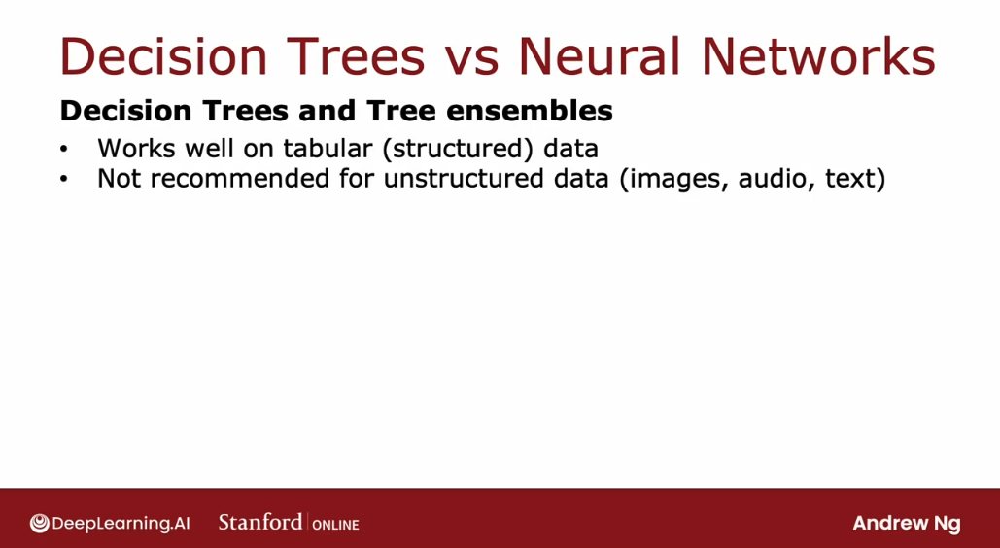

# Tree Ensembles

## Using multiple decision trees

**One of the weaknesses of using a single decision tree is that they can be highly sensitive to small changes in the data.** One solution to make the algorithm less sensitive or more robust is to build not one decision tree, but to **build a lot of decision trees, and we call that a tree ensemble**. 

Let's take a look. With the example that we've been using, the best feature to split on at the root node turned out to be the ear shape, resulting in the following two subsets of the dat,a and then building further sub trees on from them:


But if we were to take just one of the ten examples and change it to a different cat, so that instead of having pointy ears, round face, whiskers absent, this new cat has floppy ears, round face, whiskers present.**With just changing a single training example, the highest information gain feature to split on becomes the whiskers feature**, instead of the ear shape feature:


As a result of that, **the subsets of data we get in the left and right sub-trees become totally different**, and as we continue to run the decision tree learning algorithm recursively, **we build out totally different sub trees on the left and right**. 

**The fact that changing just one training example causes the algorithm to come up with a different split at the root and therefore a totally different treemakes this algorithm not robust.** That's why when we're using decision trees, we often get a much better result, more accurate predictions, if we train not just a single decision tree but a number of different decision trees. 

**This is what we call a tree ensemble, which is just a collection of multiple trees.** 


If we had this ensemble of three trees, each one of these is a plausible way to classify cat versus not-cat. 

If we had a new test example that we wanted to classify, **we run all three of these trees on our new example and get them to "vote" on whether it's the final prediction. **

This test example has pointy ears, a not round face shape and whiskers are present, so the trees would give the following result:


The majority votes of the predictions among these three trees is cat. **So, the final prediction of this ensemble of trees is that this is a cat**, which happens to be the correct prediction.


The reason we use an ensemble of trees is by having lots of decision trees and having them vote, it makes our overall algorithm less sensitive to what any single tree may be doing because it gets only one vote out of three or one vote out of all trees that have been trained.

Let's see next how to build the tree ensemble.

## Sampling with replacement

**In order to build a tree ensemble, we're going to need a technique called sampling with replacement.** 

In order to illustrate how sampling with replacement works, we're going to show we a demonstration of it using four tokens that are colored red, yellow, green, and blue.


If we put the four tokens in a bag and sample by replacement, we take the first token from the bag - turns out to be green-, and then, before the next time we take a token out of the bag, we put that green token that we took out in the first step back in.

If I do this for times, I'l gett a sequence that might be: **green, yellow, blue, blue.**

**Notice that we got blue twice, and didn't get red even a single time.** 

The replacement part of this is critical because if we were not replacing a token every time I sample, then we would always just get the same four tokens. That's why replacing a token is important to make sure I don't just get the same four tokens every single time. 


The way that sampling with replacement applies to building an ensemble of trees is as follows: **we are going to construct multiple random training sets that are all slightly different from our original training set.** 

Let's take our 10 examples of cats and dogs, and we're going to put the 10 training examples in a theoretical bag.

Using this theoretical bag, **we're going to create a new random training set of 10 examples of the exact same size as the original data set.** 


Notice now this fifth training example is identical to the second one that we had out there. But that's fine.

We keep going and we get another repeats the example, and so on and so forth. Until eventually we end up with 10 training examples, some of which are repeats.


Notice also that this training set does not contain all 10 of the original training examples, but that's okay. That is part of the sampling with replacement procedure. 

So in summary, **the process of sampling with replacement lets us construct a new training set that's a little bit similar to, but also pretty different from our original training set.**

This process is a key building block for building an ensemble of trees. 

## Random forest algorithm

Now that we have a way to use sampling with replacement to create new training, we're ready to build our first tree ensemble algorithm. In particular in this section, we'll talk about the **random forest algorithm which is one powerful tree ensamble algorithm that works much better than using a single decision tree**. 

Here's how we can generate an ensemble of trees:

- **if we are given a training set of size $m$, then for $b$ equals 1 to $B$, we can use sampling with replacement to create a new training set of size $m$.** So if we have 10 training examples, we will put the 10 training examples in that virtual bag and sample of replacement 10 times to generate a new training set with also 10 examples.


- **then, we would train a decision tree on that data set**. If we train the decision on this data said we end up with the following decision tree:


- **having done this once, we would then go and repeat this a $B$ amount of times**, and get a $B$ number of trees.


**A typical choice of $B$, the number of trees we built, might be around a 100.** It is recommended any value from around 64 even up to 128. 

- having built an ensemble of say 100 different trees, **we would then try to make a prediction by getting these trees to vote on the correct final prediction.**

Setting $B$ to be larger never hurts performance, but beyond a certain point, we end up with diminishing returns and it performance doesn't get much better after around 100 tress. Never use 1000 trees, as that just slows down the computation significantly without meaningfully increasing the performance of the overall algorithm. 

This specific instance of **creation of tree ensemble is sometimes also called a bagged decision tree**, which refers to putting our training examples in that virtual bag. 

But: there's **one modification** to this album that will actually make it work even much better and that changes this algorithm from the bagged decision tree **into the random forest algorithm.**

The key idea is that: **even with this sampling with replacement procedure sometimes we end up with always using the same split at the root node and very similar splits near the root note**. That didn't happen in this particular example where a small change the trainings that resulted in a different split at the root note. But for other training sets it's not uncommon that for many or even all $B$ training sets, we end up with the same choice of feature at the root node and at a few of the nodes near the root node. 

So there's one modification to further try to randomize the feature choice at each node, which causes the set of trees to become more different from each other. So when we make them vote, we end up with an even more accurate prediction. 

The way this is done is: **at every node, when choosing a feature to use to split on, if $n$ features are available, we will instead pick a random subset of $k$ features, which is less than $n$ and allow the algorithm to choose only from that subset of $k$ features**. 


In other words, we would pick $k$ features as the allowed features and then out of those $k$ features, **choose the one with the highest information gain as the choice of feature to use the split**. 

**When $n$ is large, dozens or even hundreds, a ypical choice for the value of $k$ would be the square root of $n$.**


In our example we have only three features, and this technique tends to be used more for larger problems with a larger number of features. 

With just this further change the algorithm we end up with **the random forest algorithm** which will work typically much better and becomes much more robust than just a single decision tree. 

One way to think about why this is more robust to than a single decision tree is: **the sampling with replacement procedure causes the algorithm to explore a lot of small changes to the data already** and its training different decision trees and its averaging over all of those changes to the data that the sampling with replacement procedure causes. **This means that any little change further to the training set makes it less likely to have a huge impact on the overall output of the overall random forest algorithm,** bcause it's already explored and it's averaging over a lot of small changes to the training set. 

Beyond the random forest, there's one other algorithm that works even better: **a boosted decision tree**. In the next section, let's talk about a boosted decision tree algorithm called **XGBoost**. 

## XGBoost

Today by far **the most commonly used way or implementation of decision tree ensembles** or decision trees **is an algorithm called XGBoost**. It runs quickly, there are open source implementations that are easily used, and has also been used very successfully to win many machine learning competitions as well as in many commercial applications. 

Let's take a look at how XGBoost works: it is just one modification to the ensemble decision trees algorithm that we saw in the last section, that can make it work much better. 

Here again, is the algorithm that we had written down previously:


Again, given the training set to size $m$, we repeat $B$ times, use sampling with replacement to create a new training set of size $m$ and then train the decision tree on the new data set. And so the first time through this loop, we create a training set with sampling with replacemente and train a decision tree.

But here's where we're going to change the algorithm: every time through this loop, other than the first time, when sampling, instead of picking from all $m$ examples of equal probability with $\frac{1}{m}$ probability, we will make it more likely that we'll pick misclassified examples that the previously trained trees do poorly on. 


In training and education, there's an idea called deliberate practice. And so this idea of boosting is similar: we're going to look at the decision trees we've trained so far and look at what we're still not yet doing well on. And then, when building the next decision tree, **we're going to focus more attention on the examples that we're not yet doing well on.** So rather than looking at all the training examples, we focus more attention on the subset of examples is not yet doing well on and get the new decision tree, the next decision tree reporting ensemble to try to do well on them. 

**This is the idea behind boosting and it turns out to help the learning algorithm learn to do better more quickly.**

So in detail: we will look at this tree that we have just built and go back to the original training set. Notice that this is the original training set, not one generated through sampling with replacement:


And we'll go through all ten examples and **look at what this learned decision tree predicts on all ten examples**. The fourth column shows its predictions and we put a checkmark next to each example, depending on whether the trees classification was correct or incorrect.

What we'll do in the second time through this loop is: **we will still use sampling with replacement to generate another training set of ten examples, but every time we pick an example from these ten, will give a higher chance of picking from one of these three examples that we are still misclassifying.** And the boosting procedure will do this for a total of $B$ times where on each iteration, we look at what the ensemble of trees for trees 1, 2... up to $(B - 1)$, are not yet doing that well on.


And when we're building tree number $B$ we will then have a higher probability of picking examples that the ensemble of the previously sample trees is still not yet doing well on. 

**The mathematical details of exactly how much to increase the probability of picking missclasified inputs vs correctly classified inputs are quite complex, but we don't have to worry about them in order to use boosted tree implementations.**


**Of different ways of implementing boosting the most widely used one today is XGBoost, which stands for extreme gradient boosting, which is an open source implementation of boosted trees that is very fast and efficient.**

XGBoost also has a **good choice of the default splitting criteria and criteria for when to stop splitting.** 

And one of the innovations in XGBoost is that it also has b**uilt in regularization to prevent overfitting.

In machine learning competitions such as the widely used competition site called Kaggle, **XGBoost is often a highly competitive algorithm.** 

In fact, **XGBoost and deep learning algorithms seem to be the two types of algorithms that win a lot of these competitions**.


And one technical note: **rather than doing sampling with replacement, XGBoost actually assigns different weights to different training examples.** So it doesn't actually need to generate a lot of randomly chosen training sets, which makes it even a little bit more efficient than using a sampling with replacement procedure. 

The details of XGBoost are quite complex to implement, which is why many practitioners will use the open source libraries that implement XGBoost. This is all we need to do in order to use XGBoost: 


```py
from xgboost import XGBClassifier

model = XGBClassifier()

mode.fit(X_train, Y_train)

y_pred = model.predict(X_test)
```

We just need import the XGBoost library, and initialize a model as an `XGBClassifier`. And this allows we to make predictions using this boosted decision trees algorithm. 

Or alternatively, **if we want to use XGBoost for regression rather than for classification,** then this just a small difference:

```py
from xgboost import XGBRegressor

model = XGBRegressor()

mode.fit(X_train, Y_train)

y_pred = model.predict(X_test)
```


So that's it for the XGBoost algorithm. We have just one last section for this week and for this course where we'll wrap up and also talk about when should we use a decision tree versus maybe use the neural network. Let's go on to the last and final section of this week. 

## When to use decision trees

Both algorithms, decision trees -including tree ensembles as well as neural networks, are very powerful, very effective learning algorithms. **So, when should we pick one or the other?** Let's look at some of the pros and cons of each. 

**Decision trees and tree ensembles will often work well on tabular data, also called structured data.** What that means is: if our dataset looks like a giant spreadsheet then decision trees would be worth considering.

For example, in the housing price prediction application we had a dataset with features corresponding to the size of the house, the number of bedrooms, the number of floors, and the age at home. That type of data stored in a spreadsheet with either categorical or continuous valued features and both for classification or for regression tasks, where we're trying to predict a discrete category or predict a number. All of these problems are ones that decision trees can do well on. 

In contrast, it is not recommended to use decision trees and tree ensembles on unstructured data: data such as images, section, audio, and texts that we're less likely to store in a spreadsheet format. Neural networks  will tend to work better for unstructured data task. 



One huge advantage of **decision trees and tree ensembles** is that they **can be very fast to train.**

Remember the diagram about the iterative loop of machine learning development: if our model takes many hours to train then that limits how quickly we can go through this loop and improve the performance of our algorithm. But because decision trees, including tree ensembles, tend to be pretty fast to train, that allows we to go to this loop more quickly and more efficiently improve the performance of our learning algorithm.


Finally, **small decision trees maybe human interpretable.** If we are training just a single decision tree and that decision tree has only say a few dozen nodes **we may be able to print out a decision tree to understand exactly how it's making decisions**.

However, **interpretability of decision trees is sometimes a bit overstated**: when we build an ensemble of 100 trees and if each of those trees has hundreds of nodes, then looking at that ensemble to figure out what it's doing does become difficult and may need some separate visualization techniques. 


**How about neural networks?** 

In contrast to decision trees and tree ensembles, **it works well on all types of data, including tabular or structured data as well as unstructured data, as well as mixed data that includes both structured and unstructured components.**

Whereas on tabular structured data, neural networks and decision trees are often both competitive, on unstructured data, such as images, section, audio, and text, a neural network will really be the preferred algorithm and not the decision tree or a tree ensemble. 


On the downside though, **neural networks may be slower than a decision tree.**

A large neural network can just take a long time to train. 


Another key benefit of **neural networks is that they work with transfer learning**. This is really important because, for many applications, we have only a small dataset and being able to use transfer learning to carry out pre-training on a much larger dataset is critical to getting competitive performance.


Finally, if **we're building a system of multiple machine learning models working together, it might be easier to string together and train multiple neural networks than multiple decision trees.**

The reasons for this are quite technical and we don't need to worry about it for the purpose of this course. But it relates to that, even when we string together multiple neural networks, we can train them all together using gradient descent. Whereas for decision trees we can only train one decision tree at a time.


## Optional Lab: Trees Ensembles, Random Forests and XGBoost

[LINK](https://www.coursera.org/learn/advanced-learning-algorithms/ungradedLab/kkC4N/optional-lab-tree-ensembles/lab?path=%2Fnotebooks%2FC2_W4_Lab_02_Tree_Ensemble.ipynb)

[Internal Link](./labs/Work%204/C2_W4_Lab_02_Tree_Ensemble.ipynb)

In this notebook, you will:

 - Use Pandas to perform one-hot encoding of a dataset
 - Use scikit-learn to implement a Decision Tree, Random Forest and XGBoost models

Let's import the libraries we will use.

```py
import numpy as np
import pandas as pd
from sklearn.tree import DecisionTreeClassifier
from sklearn.ensemble import RandomForestClassifier
from sklearn.model_selection import train_test_split
from sklearn.metrics import accuracy_score
from xgboost import XGBClassifier
import matplotlib.pyplot as plt
plt.style.use('./deeplearning.mplstyle')

RANDOM_STATE = 55 ## We will pass it to every sklearn call so we ensure reproducibility
```

### 1. Introduction

#### Datatset
- This dataset is obtained from Kaggle: [Heart Failure Prediction Dataset](https://www.kaggle.com/datasets/fedesoriano/heart-failure-prediction)

#### Context
- Cardiovascular disease (CVDs) is the number one cause of death globally, taking an estimated 17.9 million lives each year, which accounts for 31% of all deaths worldwide. Four out of five CVD deaths are due to heart attacks and strokes, and one-third of these deaths occur prematurely in people under 70 years of age. Heart failure is a common event caused by CVDs.
- People with cardiovascular disease or who are at high cardiovascular risk (due to the presence of one or more risk factors such as hypertension, diabetes, hyperlipidaemia or already established disease) need early detection and management.  
- This dataset contains 11 features that can be used to predict possible heart disease.
- Let's train a machine learning model to assist with diagnosing this disease.

#### Attribute Information
- Age: age of the patient [years]
- Sex: sex of the patient [M: Male, F: Female]
- ChestPainType: chest pain type [TA: Typical Angina, ATA: Atypical Angina, NAP: Non-Anginal Pain, ASY: Asymptomatic]
- RestingBP: resting blood pressure [mm Hg]
- Cholesterol: serum cholesterol [mm/dl]
- FastingBS: fasting blood sugar [1: if FastingBS > 120 mg/dl, 0: otherwise]
- RestingECG: resting electrocardiogram results [Normal: Normal, ST: having ST-T wave abnormality (T wave inversions and/or ST elevation or depression of > 0.05 mV), LVH: showing probable or definite left ventricular hypertrophy by Estes' criteria]
- MaxHR: maximum heart rate achieved [Numeric value between 60 and 202]
- ExerciseAngina: exercise-induced angina [Y: Yes, N: No]
- Oldpeak: oldpeak = ST [Numeric value measured in depression]
- ST_Slope: the slope of the peak exercise ST segment [Up: upsloping, Flat: flat, Down: downsloping]
- HeartDisease: output class [1: heart disease, 0: Normal]

Let's now load the dataset. As we can see above, the variables:

- Sex
- ChestPainType
- RestingECG
- ExerciseAngina
- ST_Slope

Are *categorical*, so we must one-hot encode them. 

```py
# Load the dataset using pandas
df = pd.read_csv("heart.csv")
```

```py
df.head()
```


We must perform some data engineering before working with the models. There are 5 categorical features, so we will use Pandas to one-hot encode them.

### 2. One-hot encoding using Pandas

First we will remove the binary variables, because one-hot encoding them would do nothing to them. To achieve this we will just count how many different values there are in each categorical variable and consider only the variables with 3 or more values.

```py
cat_variables = ['Sex',
'ChestPainType',
'RestingECG',
'ExerciseAngina',
'ST_Slope'
]
```

As a reminder, one-hot encoding aims to transform a categorical variable with `n` outputs into `n` binary variables.

Pandas has a built-in method to one-hot encode variables, it is the function `pd.get_dummies`. There are several arguments to this function, but here we will use only a few. They are:

 - data: DataFrame to be used
 - prefix: A list with prefixes, so we know which value we are dealing with
 - columns: the list of columns that will be one-hot encoded. 'prefix' and 'columns' must have the same length.
 
For more information, you can always type `help(pd.get_dummies)` to read the function's full documentation.

```py
# This will replace the columns with the one-hot encoded ones and keep the columns outside 'columns' argument as it is.
df = pd.get_dummies(data = df,
                         prefix = cat_variables,
                         columns = cat_variables)

df.head()
```


Let's choose the variables that will be the input features of the model.
- The target is `HeartDisease`.
- All other variables are features that can potentially be used to predict the target, `HeartDisease`.

```py
features = [x for x in df.columns if x not in 'HeartDisease'] ## Removing our target variable
```

We started with 11 features.  Let's see how many feature variables we have after one-hot encoding.

```py
print(features)
# ['Age', 'RestingBP', 'Cholesterol', 'FastingBS', 'MaxHR', 'Oldpeak', 'Sex_F', 'Sex_M', 'ChestPainType_ASY', 'ChestPainType_ATA', 'ChestPainType_NAP', 'ChestPainType_TA', 'RestingECG_LVH', 'RestingECG_Normal', 'RestingECG_ST', 'ExerciseAngina_N', 'ExerciseAngina_Y', 'ST_Slope_Down', 'ST_Slope_Flat', 'ST_Slope_Up']
print(len(features))
# 20
```
### 3. Splitting the Dataset

In this section, we will split our dataset into train and test datasets. We will use the function `train_test_split` from Scikit-learn. Let's just check its arguments.

```py
help(train_test_split)

# Help on function train_test_split in module sklearn.model_selection._split:

# train_test_split(*arrays, test_size=None, train_size=None, random_state=None, shuffle=True, stratify=None)
#     Split arrays or matrices into random train and test subsets.
    
#     Quick utility that wraps input validation and
#     ``next(ShuffleSplit().split(X, y))`` and application to input data
#     into a single call for splitting (and optionally subsampling) data in a
#     oneliner.
    
#     Read more in the :ref:`User Guide <cross_validation>`.
    
#     Parameters
#     ----------
#     *arrays : sequence of indexables with same length / shape[0]
#         Allowed inputs are lists, numpy arrays, scipy-sparse
#         matrices or pandas dataframes.
    
#     test_size : float or int, default=None
#         If float, should be between 0.0 and 1.0 and represent the proportion
#         of the dataset to include in the test split. If int, represents the
#         absolute number of test samples. If None, the value is set to the
#         complement of the train size. If ``train_size`` is also None, it will
#         be set to 0.25.
    
#     train_size : float or int, default=None
#         If float, should be between 0.0 and 1.0 and represent the
#         proportion of the dataset to include in the train split. If
#         int, represents the absolute number of train samples. If None,
#         the value is automatically set to the complement of the test size.
    
#     random_state : int, RandomState instance or None, default=None
#         Controls the shuffling applied to the data before applying the split.
#         Pass an int for reproducible output across multiple function calls.
#         See :term:`Glossary <random_state>`.
    
#     shuffle : bool, default=True
#         Whether or not to shuffle the data before splitting. If shuffle=False
#         then stratify must be None.
    
#     stratify : array-like, default=None
#         If not None, data is split in a stratified fashion, using this as
#         the class labels.
#         Read more in the :ref:`User Guide <stratification>`.
    
#     Returns
#     -------
#     splitting : list, length=2 * len(arrays)
#         List containing train-test split of inputs.
    
#         .. versionadded:: 0.16
#             If the input is sparse, the output will be a
#             ``scipy.sparse.csr_matrix``. Else, output type is the same as the
#             input type.
    
#     Examples
#     --------
#     >>> import numpy as np
#     >>> from sklearn.model_selection import train_test_split
#     >>> X, y = np.arange(10).reshape((5, 2)), range(5)
#     >>> X
#     array([[0, 1],
#            [2, 3],
#            [4, 5],
#            [6, 7],
#            [8, 9]])
#     >>> list(y)
#     [0, 1, 2, 3, 4]
    
#     >>> X_train, X_test, y_train, y_test = train_test_split(
#     ...     X, y, test_size=0.33, random_state=42)
#     ...
#     >>> X_train
#     array([[4, 5],
#            [0, 1],
#            [6, 7]])
#     >>> y_train
#     [2, 0, 3]
#     >>> X_test
#     array([[2, 3],
#            [8, 9]])
#     >>> y_test
#     [1, 4]
    
#     >>> train_test_split(y, shuffle=False)
#     [[0, 1, 2], [3, 4]]
```

```py
X_train, X_val, y_train, y_val = train_test_split(df[features], df['HeartDisease'], train_size = 0.8, random_state = RANDOM_STATE)

# We will keep the shuffle = True since our dataset has not any time dependency.
```

```py
print(f'train samples: {len(X_train)}')
print(f'validation samples: {len(X_val)}')
print(f'target proportion: {sum(y_train)/len(y_train):.4f}')

# train samples: 734
# validation samples: 184
# target proportion: 0.5518
```

### 4. Building the Models

#### 4.1 Decision Tree

In this section, let's work with the Decision Tree we previously learned, but now using the [Scikit-learn implementation](https://scikit-learn.org/stable/modules/generated/sklearn.tree.DecisionTreeClassifier.html). 

There are several hyperparameters in the Decision Tree object from Scikit-learn. We will use only some of them and also we will not perform feature selection nor hyperparameter tuning in this lab (but you are encouraged to do so and compare the results 😄 )

The hyperparameters we will use and investigate here are:

 - min_samples_split: The minimum number of samples required to split an internal node. 
   - Choosing a higher min_samples_split can reduce the number of splits and may help to reduce overfitting.
 - max_depth: The maximum depth of the tree. 
   - Choosing a lower max_depth can reduce the number of splits and may help to reduce overfitting.

```py
min_samples_split_list = [2,10, 30, 50, 100, 200, 300, 700] ## If the number is an integer, then it is the actual quantity of samples,
max_depth_list = [1,2, 3, 4, 8, 16, 32, 64, None] # None means that there is no depth limit.
```

```py
accuracy_list_train = []
accuracy_list_val = []
for min_samples_split in min_samples_split_list:
    # You can fit the model at the same time you define it, because the fit function returns the fitted estimator.
    model = DecisionTreeClassifier(min_samples_split = min_samples_split,
                                   random_state = RANDOM_STATE).fit(X_train,y_train) 
    predictions_train = model.predict(X_train) ## The predicted values for the train dataset
    predictions_val = model.predict(X_val) ## The predicted values for the test dataset
    accuracy_train = accuracy_score(predictions_train,y_train)
    accuracy_val = accuracy_score(predictions_val,y_val)
    accuracy_list_train.append(accuracy_train)
    accuracy_list_val.append(accuracy_val)

plt.title('Train x Validation metrics')
plt.xlabel('min_samples_split')
plt.ylabel('accuracy')
plt.xticks(ticks = range(len(min_samples_split_list )),labels=min_samples_split_list)
plt.plot(accuracy_list_train)
plt.plot(accuracy_list_val)
plt.legend(['Train','Validation'])
```


Note how increasing the the number of `min_samples_split` reduces overfitting.
- Increasing `min_samples_split` from 10 to 30, and from 30 to 50, even though it does not improve the validation accuracy, it brings the training accuracy closer to it, showing a reduction in overfitting.

Let's do the same experiment with `max_depth`.

```py
accuracy_list_train = []
accuracy_list_val = []
for max_depth in max_depth_list:
    # You can fit the model at the same time you define it, because the fit function returns the fitted estimator.
    model = DecisionTreeClassifier(max_depth = max_depth,
                                   random_state = RANDOM_STATE).fit(X_train,y_train) 
    predictions_train = model.predict(X_train) ## The predicted values for the train dataset
    predictions_val = model.predict(X_val) ## The predicted values for the test dataset
    accuracy_train = accuracy_score(predictions_train,y_train)
    accuracy_val = accuracy_score(predictions_val,y_val)
    accuracy_list_train.append(accuracy_train)
    accuracy_list_val.append(accuracy_val)

plt.title('Train x Validation metrics')
plt.xlabel('max_depth')
plt.ylabel('accuracy')
plt.xticks(ticks = range(len(max_depth_list )),labels=max_depth_list)
plt.plot(accuracy_list_train)
plt.plot(accuracy_list_val)
plt.legend(['Train','Validation'])
```


We can see that in general, reducing `max_depth` can help to reduce overfitting.
- Reducing `max_depth` from 8 to 4 increases validation accuracy closer to training accuracy, while significantly reducing training accuracy.
- The validation accuracy reaches the highest at tree_depth=4. 
- When the `max_depth` is smaller than 3, both training and validation accuracy decreases.  The tree cannot make enough splits to distinguish positives from negatives (the model is underfitting the training set). 
- When the `max_depth` is too high ( >= 5), validation accuracy decreases while training accuracy increases, indicating that the model is overfitting to the training set.

So we can choose the best values for these two hyper-parameters for our model to be:
- `max_depth = 4`
- `min_samples_split = 50` 

```py
decision_tree_model = DecisionTreeClassifier(min_samples_split = 50,
                                             max_depth = 3,
                                             random_state = RANDOM_STATE).fit(X_train,y_train)
```

```py
print(f"Metrics train:\n\tAccuracy score: {accuracy_score(decision_tree_model.predict(X_train),y_train):.4f}")
print(f"Metrics validation:\n\tAccuracy score: {accuracy_score(decision_tree_model.predict(X_val),y_val):.4f}")

# Metrics train:
# 	Accuracy score: 0.8583
# Metrics validation:
# 	Accuracy score: 0.8641
```

No sign of overfitting, even though the metrics are not that good.

#### 4.2 Random Forest

Now let's try the Random Forest algorithm also, using the Scikit-learn implementation. 
- All of the hyperparameters found in the decision tree model will also exist in this algorithm, since a random forest is an ensemble of many Decision Trees.
- One additional hyperparameter for Random Forest is called `n_estimators` which is the number of Decision Trees that make up the Random Forest. 

Remember that for a Random Forest, we randomly choose a subset of the features AND randomly choose a subset of the training examples to train each individual tree.
- Following the lectures, if $n$ is the number of features, we will randomly select $\sqrt{n}$ of these features to train each individual tree. 
- Note that you can modify this by setting the `max_features` parameter.

You can also speed up your training jobs with another parameter, `n_jobs`. 
- Since the fitting of each tree is independent of each other, it is possible fit more than one tree in parallel. 
- So setting `n_jobs` higher will increase how many CPU cores it will use. Note that the numbers very close to the maximum cores of your CPU may impact on the overall performance of your PC and even lead to freezes. 
- Changing this parameter does not impact on the final result but can reduce the training time.

We will run the same script again, but with another parameter, `n_estimators`, where we will choose between 10, 50, and 100. The default is 100.

```py
min_samples_split_list = [2,10, 30, 50, 100, 200, 300, 700]  ## If the number is an integer, then it is the actual quantity of samples,
                                             ## If it is a float, then it is the percentage of the dataset
max_depth_list = [2, 4, 8, 16, 32, 64, None]
n_estimators_list = [10,50,100,500]
```

```py
accuracy_list_train = []
accuracy_list_val = []
for min_samples_split in min_samples_split_list:
    # You can fit the model at the same time you define it, because the fit function returns the fitted estimator.
    model = RandomForestClassifier(min_samples_split = min_samples_split,
                                   random_state = RANDOM_STATE).fit(X_train,y_train) 
    predictions_train = model.predict(X_train) ## The predicted values for the train dataset
    predictions_val = model.predict(X_val) ## The predicted values for the test dataset
    accuracy_train = accuracy_score(predictions_train,y_train)
    accuracy_val = accuracy_score(predictions_val,y_val)
    accuracy_list_train.append(accuracy_train)
    accuracy_list_val.append(accuracy_val)

plt.title('Train x Validation metrics')
plt.xlabel('min_samples_split')
plt.ylabel('accuracy')
plt.xticks(ticks = range(len(min_samples_split_list )),labels=min_samples_split_list) 
plt.plot(accuracy_list_train)
plt.plot(accuracy_list_val)
plt.legend(['Train','Validation'])
```


Notice that, even though the validation accuraty reaches is the same both at `min_samples_split = 2` and `min_samples_split = 10`, in the latter the difference in training and validation set reduces, showing less overfitting.

```py
accuracy_list_train = []
accuracy_list_val = []
for max_depth in max_depth_list:
    # You can fit the model at the same time you define it, because the fit function returns the fitted estimator.
    model = RandomForestClassifier(max_depth = max_depth,
                                   random_state = RANDOM_STATE).fit(X_train,y_train) 
    predictions_train = model.predict(X_train) ## The predicted values for the train dataset
    predictions_val = model.predict(X_val) ## The predicted values for the test dataset
    accuracy_train = accuracy_score(predictions_train,y_train)
    accuracy_val = accuracy_score(predictions_val,y_val)
    accuracy_list_train.append(accuracy_train)
    accuracy_list_val.append(accuracy_val)

plt.title('Train x Validation metrics')
plt.xlabel('max_depth')
plt.ylabel('accuracy')
plt.xticks(ticks = range(len(max_depth_list )),labels=max_depth_list)
plt.plot(accuracy_list_train)
plt.plot(accuracy_list_val)
plt.legend(['Train','Validation'])
```


```py
accuracy_list_train = []
accuracy_list_val = []
for n_estimators in n_estimators_list:
    # You can fit the model at the same time you define it, because the fit function returns the fitted estimator.
    model = RandomForestClassifier(n_estimators = n_estimators,
                                   random_state = RANDOM_STATE).fit(X_train,y_train) 
    predictions_train = model.predict(X_train) ## The predicted values for the train dataset
    predictions_val = model.predict(X_val) ## The predicted values for the test dataset
    accuracy_train = accuracy_score(predictions_train,y_train)
    accuracy_val = accuracy_score(predictions_val,y_val)
    accuracy_list_train.append(accuracy_train)
    accuracy_list_val.append(accuracy_val)

plt.title('Train x Validation metrics')
plt.xlabel('n_estimators')
plt.ylabel('accuracy')
plt.xticks(ticks = range(len(n_estimators_list )),labels=n_estimators_list)
plt.plot(accuracy_list_train)
plt.plot(accuracy_list_val)
plt.legend(['Train','Validation'])
```


Let's then fit a random forest with the following parameters:

 - max_depth: 16
 - min_samples_split: 10
 - n_estimators: 100

```py
random_forest_model = RandomForestClassifier(n_estimators = 100,
                                             max_depth = 16, 
                                             min_samples_split = 10).fit(X_train,y_train)
```

```py
print(f"Metrics train:\n\tAccuracy score: {accuracy_score(random_forest_model.predict(X_train),y_train):.4f}\nMetrics test:\n\tAccuracy score: {accuracy_score(random_forest_model.predict(X_val),y_val):.4f}")

# Metrics train:
# 	Accuracy score: 0.9292
# Metrics test:
# 	Accuracy score: 0.8804
```

Note that we are searching for the best value one hyperparameter while leaving the other hyperparameters at their default values.
- Ideally, we would want to check every combination of values for every hyperparameter that we are tuning.
- If we have 3 hyperparameters, and each hyperparameter has 4 values to try out, we should have a total of 4 x 4 x 4 = 64 combinations to try.
- When we only modify one hyperparameter while leaving the rest as their default value, we are trying 4 + 4 + 4 = 12 results. 
- To try out all combinations, we can use a sklearn implementation called GridSearchCV. GridSearchCV has a refit parameter that will automatically refit a model on the best combination so we will not need to program it explicitly. For more on GridSearchCV, please refer to its [documentation](https://scikit-learn.org/stable/modules/generated/sklearn.model_selection.GridSearchCV.html).

#### 4.3 XGBoost

Next is the Gradient Boosting model, called XGBoost. The boosting methods train several trees, but instead of them being uncorrelated to each other, now the trees are fit one after the other in order to minimize the error. 

The model has the same parameters as a decision tree, plus the learning rate.
- The learning rate is the size of the step on the Gradient Descent method that the XGBoost uses internally to minimize the error on each train step.

One interesting thing about the XGBoost is that during fitting, it can take in an evaluation dataset of the form `(X_val,y_val)`.
- On each iteration, it measures the cost (or evaluation metric) on the evaluation datasets.
- Once the cost (or metric) stops decreasing for a number of rounds (called early_stopping_rounds), the training will stop. 
- More iterations lead to more estimators, and more estimators can result in overfitting.  
- By stopping once the validation metric no longer improves, we can limit the number of estimators created, and reduce overfitting.

First, let's define a subset of our training set (we should not use the test set here).

```py
n = int(len(X_train)*0.8) ## Let's use 80% to train and 20% to eval
```

```py
X_train_fit, X_train_eval, y_train_fit, y_train_eval = X_train[:n], X_train[n:], y_train[:n], y_train[n:]
```

We can then set a large number of estimators, because we can stop if the cost function stops decreasing.

Note some of the `.fit()` parameters:
- `eval_set = [(X_train_eval,y_train_eval)]`:Here we must pass a list to the eval_set, because you can have several different tuples ov eval sets. 
- `early_stopping_rounds`: This parameter helps to stop the model training if its evaluation metric is no longer improving on the validation set. It's set to 10.
  - The model keeps track of the round with the best performance (lowest evaluation metric).  For example, let's say round 16 has the lowest evaluation metric so far.
  - Each successive round's evaluation metric is compared to the best metric.  If the model goes 10 rounds where none have a better metric than the best one, then the model stops training.
  - The model is returned at its last state when training terminated, not its state during the best round.  For example, if the model stops at round 26, but the best round was 16, the model's training state at round 26 is returned, not round 16.
  - Note that this is different from returning the model's "best" state (from when the evaluation metric was the lowest).

```py
xgb_model = XGBClassifier(n_estimators = 500, learning_rate = 0.1,verbosity = 1, random_state = RANDOM_STATE)
xgb_model.fit(X_train_fit,y_train_fit, eval_set = [(X_train_eval,y_train_eval)], early_stopping_rounds = 10)

# [0]	validation_0-logloss:0.64479
# [1]	validation_0-logloss:0.60569
# [2]	validation_0-logloss:0.57481
# [3]	validation_0-logloss:0.54947
# [4]	validation_0-logloss:0.52973
# [5]	validation_0-logloss:0.51331
# [6]	validation_0-logloss:0.49823
# [7]	validation_0-logloss:0.48855
# [8]	validation_0-logloss:0.47888
# [9]	validation_0-logloss:0.47068
# [10]	validation_0-logloss:0.46507
# [11]	validation_0-logloss:0.45832
# [12]	validation_0-logloss:0.45557
# [13]	validation_0-logloss:0.45030
# [14]	validation_0-logloss:0.44653
# [15]	validation_0-logloss:0.44213
# [16]	validation_0-logloss:0.43948    <---- here
# [17]	validation_0-logloss:0.44088
# [18]	validation_0-logloss:0.44358
# [19]	validation_0-logloss:0.44493
# [20]	validation_0-logloss:0.44294
# [21]	validation_0-logloss:0.44486
# [22]	validation_0-logloss:0.44586
# [23]	validation_0-logloss:0.44680
# [24]	validation_0-logloss:0.44925
# [25]	validation_0-logloss:0.45383
# [26]	validation_0-logloss:0.45547

# XGBClassifier(base_score=0.5, booster='gbtree', callbacks=None,
#               colsample_bylevel=1, colsample_bynode=1, colsample_bytree=1,
#               early_stopping_rounds=None, enable_categorical=False,
#               eval_metric=None, gamma=0, gpu_id=-1, grow_policy='depthwise',
#               importance_type=None, interaction_constraints='',
#               learning_rate=0.1, max_bin=256, max_cat_to_onehot=4,
#               max_delta_step=0, max_depth=6, max_leaves=0, min_child_weight=1,
#               missing=nan, monotone_constraints='()', n_estimators=500,
#               n_jobs=0, num_parallel_tree=1, predictor='auto', random_state=55,
#               reg_alpha=0, reg_lambda=1, ...)

```

Even though we initialized the model to allow up to 500 estimators, the algorithm only fit 26 estimators (over 26 rounds of training).

To see why, let's look for the round of training that had the best performance (lowest evaluation metric).  You can either view the validation log loss metrics that were output above, or view the model's `.best_iteration` attribute:

```py
xgb_model.best_iteration
# 16
```

The best round of training was round 16, with a log loss of 4.3948.  
- For 10 rounds of training after that (from round 17 to 26), the log loss was higher than this.
- Since we set `early_stopping_rounds` to 10, then by the 10th round where the log loss doesn't improve upon the best one, training stops.
- You can try out different values of `early_stopping_rounds` to verify this.  If you set it to 20, for instance, the model stops training at round 36 (16 + 20).

```py
print(f"Metrics train:\n\tAccuracy score: {accuracy_score(xgb_model.predict(X_train),y_train):.4f}\nMetrics test:\n\tAccuracy score: {accuracy_score(xgb_model.predict(X_val),y_val):.4f}")

print(f"Metrics train:\n\tAccuracy score: {accuracy_score(xgb_model.predict(X_train),y_train):.4f}\nMetrics test:\n\tAccuracy score: {accuracy_score(xgb_model.predict(X_val),y_val):.4f}")

# Metrics train:
# 	Accuracy score: 0.9251
# Metrics test:
# 	Accuracy score: 0.8641
```

In this example, both Random Forest and XGBoost had similar performance (test accuracy).  