# Welcome

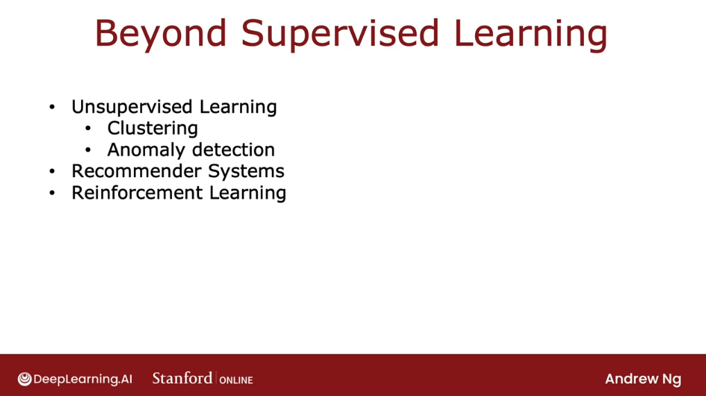

- Week 1: Unsupervised Learning
  - Clustering
  - Anomaly detection
- Week 2: Recommender Systems
- Week 3: Reinforcement Learning

# Clustering

## What is clustering? 

What is clustering? **A clustering algorithm looks at a number of data points and automatically finds data points that are related or similar to each other.** What does that mean?

Let's contrast **clustering**, which is an **unsupervised learning algorithm**, with what we had previously seen with supervised learning for binary classification:

Given a dataset like this with features $x_1$ and $x_2$:

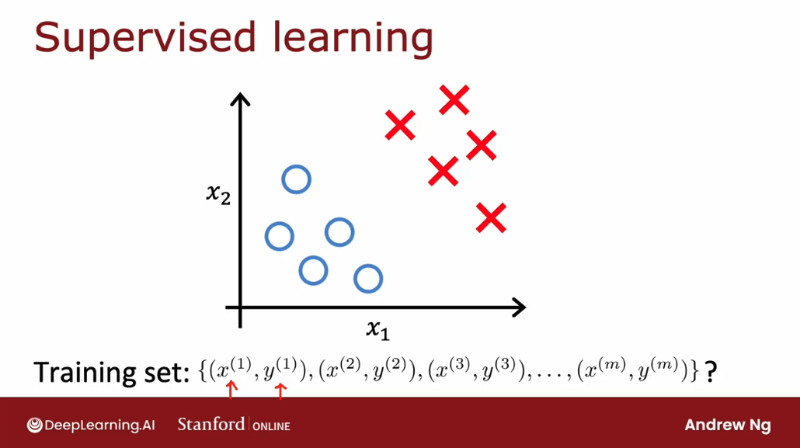

With supervised learning, we had a training set with both the input features $x$ as well as the labels $y$. We could therefore plot a dataset like the above and fit, say, a logistic regression algorithm or a neural network to learn a decision boundary like so:

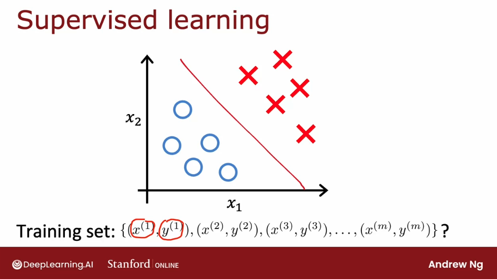

And, in supervised learning, the dataset included both the inputs $x$ as well as the target outputs $y$. 

In contrast, in unsupervised learning, we are given a dataset like this:

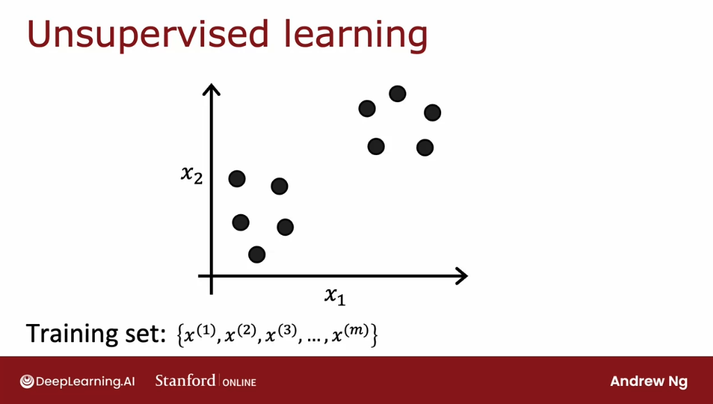

Notice that we have with just $x$, but not the labels or the target labels $y$. That's why when I plot a dataset, it looks like the above, with just dots rather than two classes denoted by the x's and the o's. 

**Because we don't have target labels $y$, we're not able to tell the algorithm what is the "right answer", $y$ that we wanted to predict.** 

Instead, we're going to ask the algorithm to find something interesting about the data, that is, to **find some interesting structure about this data.** 

The first unsupervised learning algorithm that we will learn about is called a **clustering algorithm**, which looks for one particular type of structure in the data:

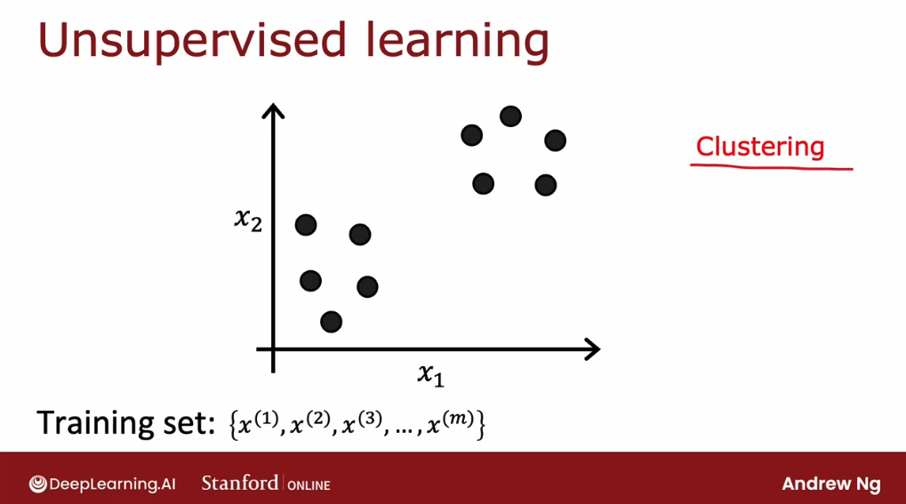

Namely, the clustering algorithm looks at a dataset like this and tries to see **if the data can be grouped into clusters, meaning groups of points that are similar to each other**. A clustering algorithm, in this case, might find that this dataset comprises of data from two clusters shown here: 

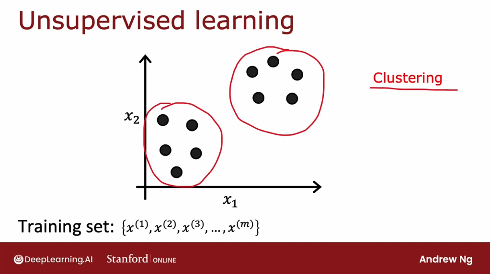

Here are some applications of clustering:

- grouping similar news articles together
- market segmentation
- analyze DNA data, where we will look at the genetic expression data from different individuals and try to group them into people that exhibit similar traits. 
- astronomical data analysis: group bodies in space together to figure out which ones form one galaxy or which one form coherent structures in space

## K-means intuition

Let's see what the **K-means clustering algorithm** does. 

Let's start with the example of a dataset with 30 unlabeled training examples"

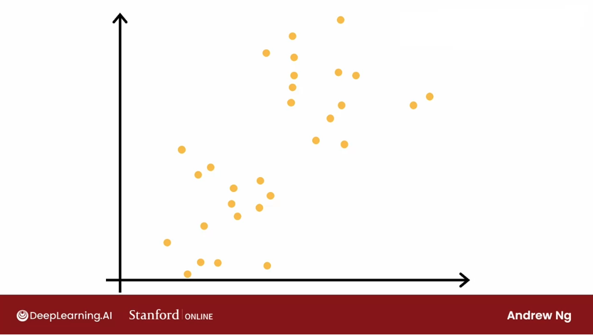

The first thing that the K-means algorithm does is: it will take a random guess at where the centers of the two clusters that we might ask it to find might be.

In this example we're going to ask it to try to find two clusters. (Later we'll talk about how we might decide how many clusters to find) 

But the very first step is it will randomly pick two points, which we see here as a red cross and the blue cross, at where might be the centers of two different clusters. Note that this is just a random initial guess and they're not particularly good guesses: 

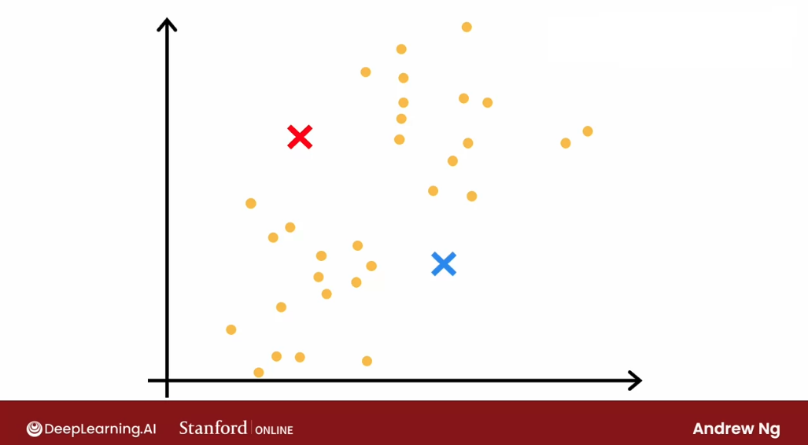

**K-means will repeatedly do two different things:**

**First, it will assign points to cluster centroids and, secondly, it will move cluster centroids to the average of the new clusters.**

Let's take a look at each step. The first of the two steps is: the algorithm will go through each of these points and look at whether it is closer to centers of the clusters, called cluster centroids, which were provided by initial guesses.

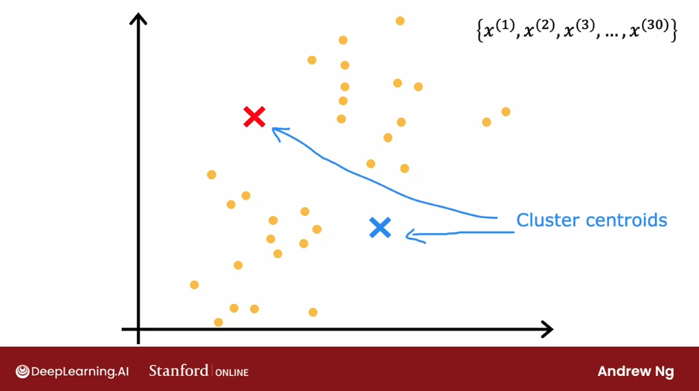

For each of them it will check if it is closer to the red cluster centroid, or if it's closer to the blue cluster centroid. **And it will assign each of these points to whichever of the cluster centroids tt is closer to**:

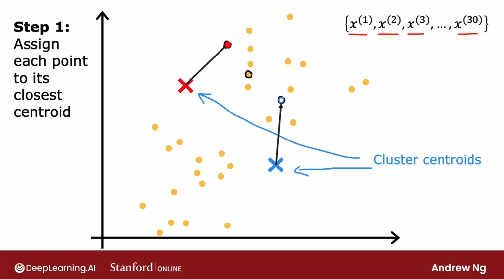

The **second** of the two steps that K-means does is: it will take all the data points of one cluster and take an average of them. And it will move the cluster centroid to whatever the average location of the dots in that cluster is:

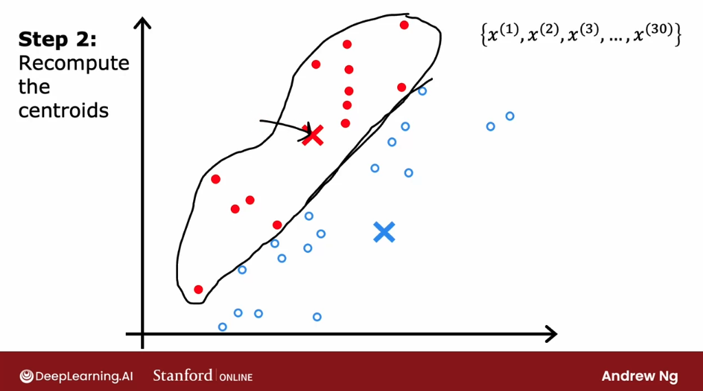
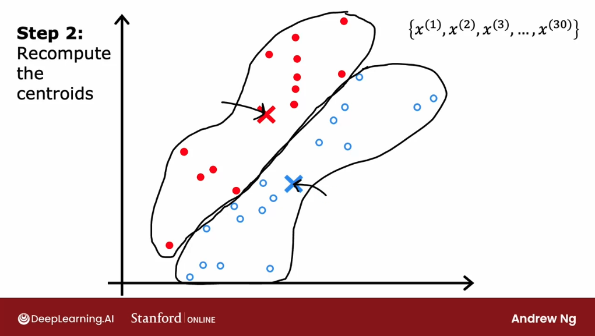

But now that we have these new and hopefully slightly improved guesses for the locations of the to cluster centroids, the algorithm will go through all of the 30 training examples again, and check for every one of them, whether it's closer to the new red or the blue cluster centroids. And we will reassign them to a cluster based on which cluster centroid is the nearset.

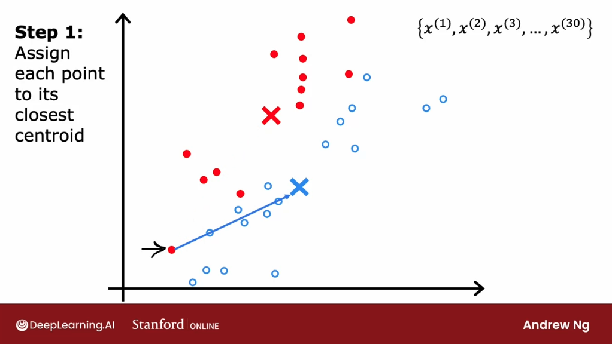

So if we go through and associate each point with the closer cluster centroids, we end up with this:

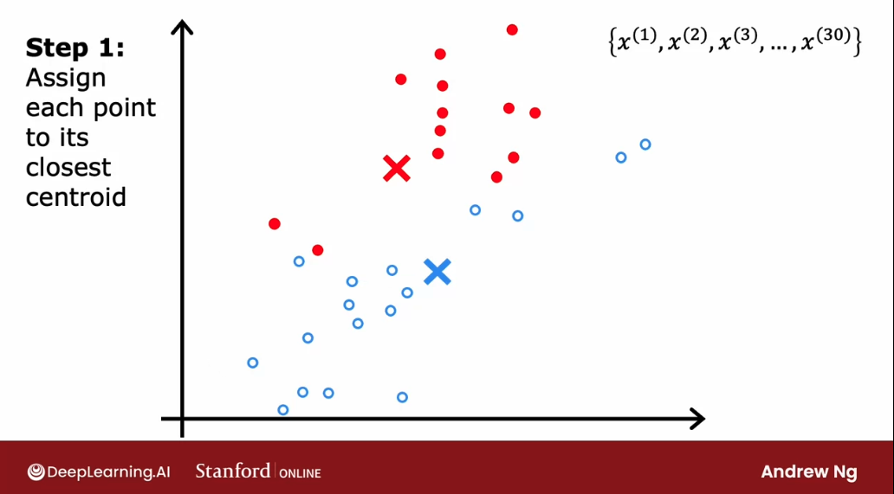

And then we just repeat the second part of K-means again, which is look at all of the data points in a cluster, compute the average and move the cluster centroids:

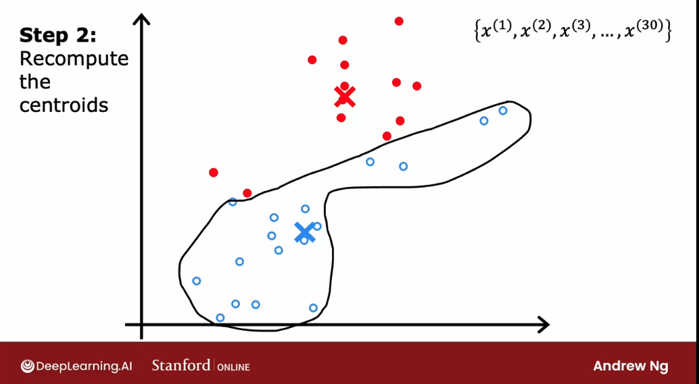

If we were to keep on repeating these two steps, we find that we reach a point in which there are no more changes to the colors of the points or to the locations of the clusters centroids. This means that at this point **the K-means clustering algorithm has converged:**

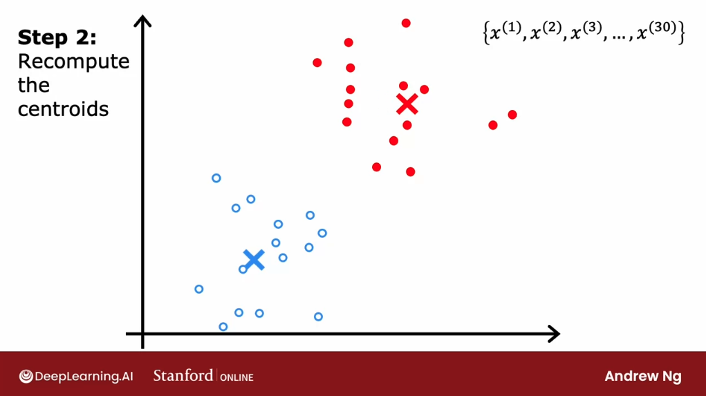

In this example, it looks like K-means has done a pretty good job and it has found two clusters.

## K-means algorithm

In the last section, we saw an illustration of the k-means algorithm running. Now let's write out the K-means algorithm in detail.

Here's the K-means algorithm: 

1. Randomly initialize $K$ cluster centroids, $\mu_1, \mu_2, ..., \mu_k$

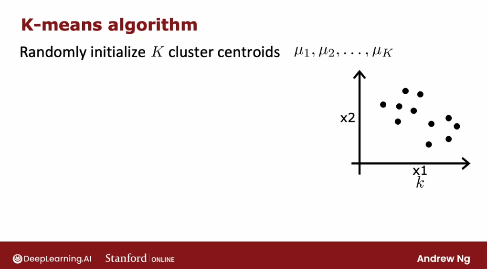

In the example that we had, $K$ was equal to 2and the red cross would be the location of $\mu_1$ and the blue cross would be the location of $\mu_2$. 

**$\mu_1$ and $\mu_2$ are vectors which have the same dimension as our training examples, $x_1$ through say $x_{30}$, in our example.**

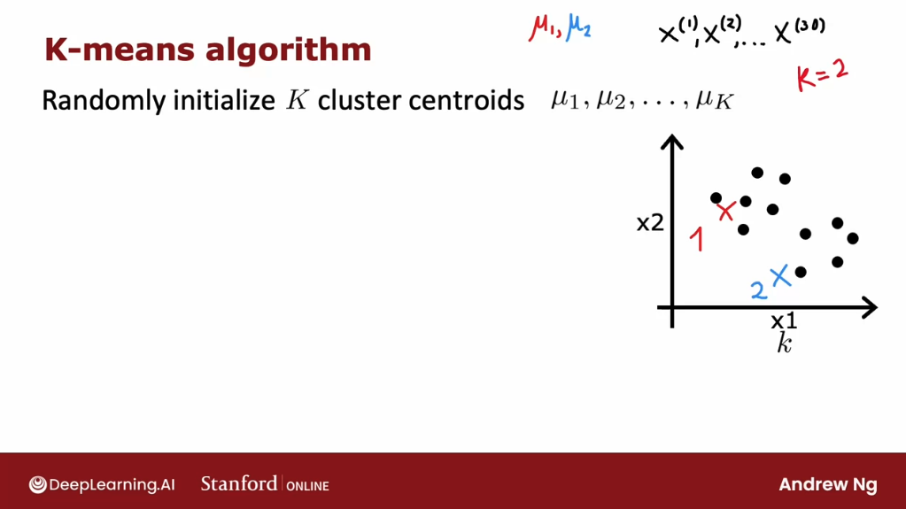

Having randomly initialized the $K$ cluster centroids, K-means will then repeatedly carry out the two steps that we saw in the last section:

**2. Repeat:**
  
- **2.1: assign points to cluster centroids**

The first substep is to assign points to clusters centroids: that is, to color each of the points either red or blue, corresponding to assigning them to cluster centroids 1 or 2 when $K$ is equal to 2. 

That means that we're going to:

$$
\begin{align*}
    \text{for } i &= 1 \text{ to } m: \\
    c^{(i)} &:= \text{index (from 1 to $K$ of cluster centroid closest to } x^{(i)}) \\
\end{align*}
$$

This means that, for each datapoint, we're going to set $c^i$ to be equal to the index of the cluster closest to the training example $x^i$, which can be anything from one to $K$ of the cluster centroid. 

Mathematically we can write this out as computing the distance between $x^i$ and $\mu_k$. 

In math, the distance between two points is often written with the **L2 norm:**

$$ \min {|| x^{(i)} - \mu_k ||}^2 $$

What we want to find is the value of $k$ that minimizes this, because that corresponds to the cluster centroid $\mu_k$ that is closest to the training example $x^{(i)}$. 

Then the value of $k$ that minimizes this is what gets set to $c^i$. 

When we implement this algorithm, we find that it's actually  more convenient to minimize the squared distance, because the cluster centroid with the smallest square distance should be the same as the cluster centroid with the smallest distance. 

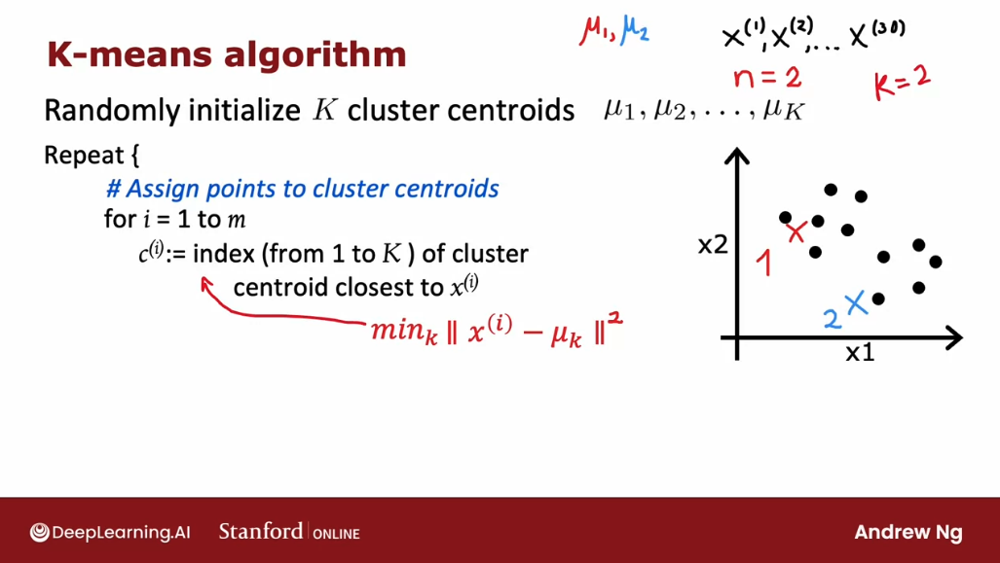

As a concrete example, this point up here is closer to the red or two cluster centroids 1. If this was training example x^1, we will set c^1 to be equal to 1. 

Whereas this point over here, if this was the 12th training example, this is closer to the second cluster centroids the blue one. We will set this, the corresponding cluster assignment variable to two because it's closer to cluster centroid 2. 

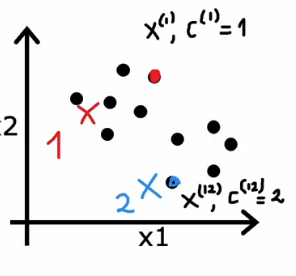

That's the first step of the K-means algorithm, assign points to cluster centroids. 

- **2.1: move cluster centroids**

The second step is to move the cluster centroids. What that means is:

$$
\begin{align*}
    \text{for } $K$ &= 1 \text{ to } K: \\
    \mu_k &:= \text{average (mean) of points assigned to cluster k} \\
\end{align*}
$$

This means: for each of the cluster, we're going to set the cluster centroid location to be updated to be the average (or the mean) of the points assigned to that cluster $k$.

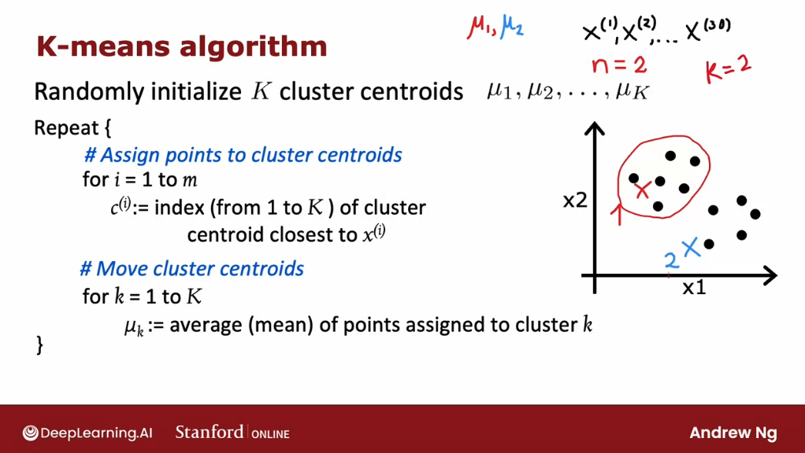

Concretely, what that means is: we'll look at all of the red points, look at their position on the horizontal axis -the value of the first feature $x^1$- and average that out. The, compute the average value on the vertical axis as well, the featrue $x_2$. Those two values gives us the coordinates of the new centroid of the cluster in vector form:

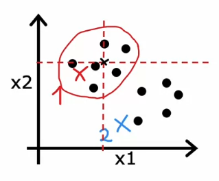

And the same for the blue points:

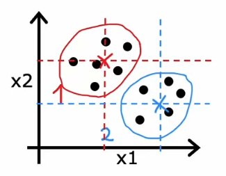

The mathematical formula would be:

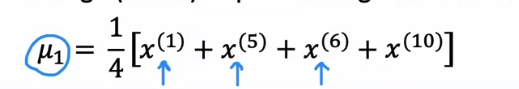

Again, each of these $x$ values are vectors with two numbers in them, or $n$ numbers in them if we have $n$ features. So, $\mu_k$ will also have two numbers in it, or $n$ numbers if we have $n$ features instead of two. 

Now, there is one **corner case** of this algorithm: **what happens if a cluster has zero training examples assigned to it?**. In that case, the second step, we would be trying to compute the average of zero points. 

If that ever happens, **the most common thing to do is to just eliminate that cluster. We end up with $K - 1$ clusters.**

**If really need $K$ clusters, an alternative is to just randomly reinitialize that cluster centroid and hope that it gets assigned at least some points next time round.** 

---
K-means is also frequently applied to data sets where the clusters are not that well separated, like the plot on the right:

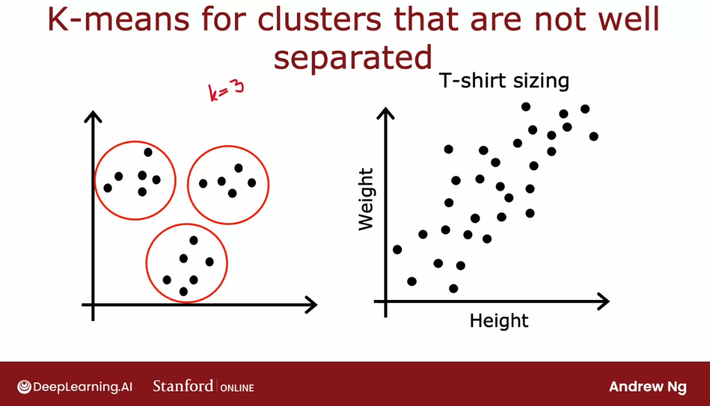

For example, we are a designer and manufacturer of T-shirts, and we want to decide how to size my small, medium, and large t-shirts. How small should a small be, how large should a large be, and what should a medium-size t-shirt really be? 

One thing we might do is collect data of people likely to buy our t-shirts based on their heights and weights. We find that the height and weight of people tend to vary continuously on the spectrum without some very clear clusters. 

Nonetheless, if we were to run K-means with three clusters centroids, we might find that K-means would group the points as follows:

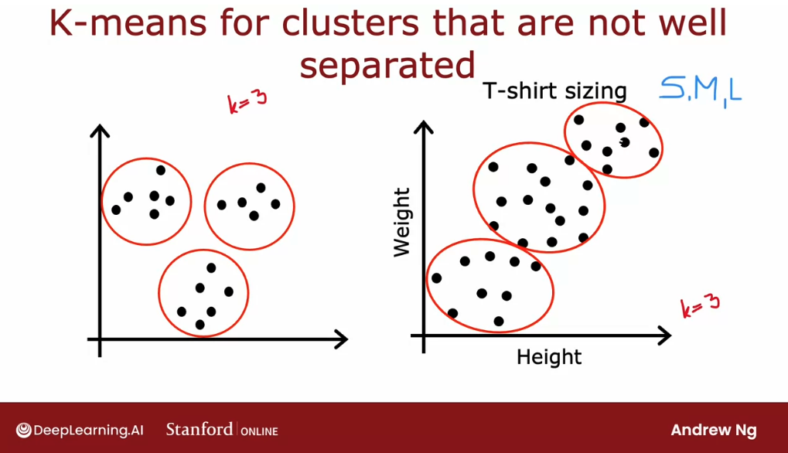

If we're trying to decide exactly how to size our small, medium, and large t-shirts, we might then choose the dimensions of each size to try to fit the datapoints in each cluster. **Potentially, the cluster centroids might provide a sense of what is the most representative height and weight that we will want our three t-shirt sizes to fit.** 

This is an example of K-means working just fine and giving a useful results even if the data does not lie in well-separated groups or clusters.

## Optimization objective

We have seen a lot of supervised learning algorithms that take atraining set, present a cost function, and then, using grading descent or some other algorithm, they attempt to optimize that cost function. 

It turns out that **the K-means algorithm is also optimizing a specific cost function**, although the optimization algorithm that it uses to optimize that is not gradient descent; it is actually the algorithm that we saw in the last section. Let's take a look at what all this means. 

Let's take a look at what is the cost function for K-means: to get started, a reminder of the notation until now:

$$c^{(i)} = \text{index of cluster (1, 2, ... K) to which example} \space x^{(i)}\space \text{is currently assigned} $$ $$ \mu_k = \text{cluster centroid} \space $K$ $$

And let's introduce one more piece of notation:

$$ \mu_{c^{(i)}} = \text{cluster centroid of cluster to which example }x^{(i)}\space \text{has benn assigned}$$

So for example, if I were to look at some training example $x^{(10)}$ and I were to ask: what's the location of the clustering centroidsto which that training example has been assigned? 

Well, I would then look up $c^{(10)}$ and that would give me a number from $1$ to $K$, which tells me to which cluster centroid my data point was assigned to. And then $\mu_{c^{10}}$ would be the location of the cluster centroid to which $x^{(10)}$ was assigned to. 

Armed with this notation, let's now write out **the cost function that K-means minimizes:**

$$ J(c^{(1)}, ..., c^{(m)}, \mu_1, ..., \mu_{K}) = \frac{1}{m} \sum_{i = 1}^m {|| x^{(i)} - \mu_{c^{(i)}} ||}^2 $$

- $c^{(1)}$ to $c^{(m)}$: all the assignments of points to clusters centroids
- $\mu_{c^{(1)}}$ to $\mu_{c^{(k)}}$ : the locations of all the clusters centroids

So, the cost function is the average of the squared distance between every training example $x^{(i)}$ (as $i$ goes from $1$ through $m$) and $\mu_{c^{(i)}}$. 

In other words, **the cost function for K-means is the average squared distance between every training example andd the location of the cluster centroid to which the training example has been assigned.**

What the K-means algorithm is doing is trying to find are two things:

**1. assignments of points of clusters centroid** 
**2. locations of clusters centroid**

which in combination that minimize the squared distance. 

Visually, here's what the cost function is trying to minimize. At each step:

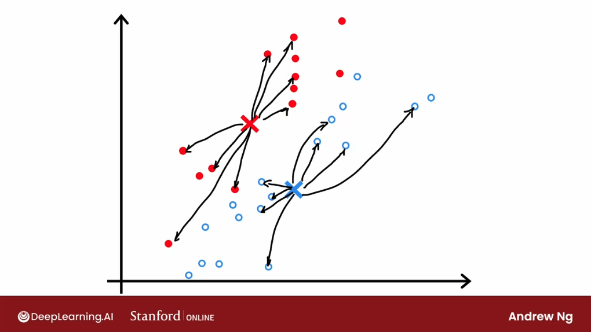

the algorithm is taking the distances of the red points to the red cluster centroid and calculating its squares, doing the same with the blue points and then averaging all of them, which is the value of the cost function $J$, at this particular configuration of the parameters for K-means. 

And the, what the algorithm they will do on every step is try to update the cluster assignments $c^{(i)}$, or update the positions of the cluster centroids $\mu_{c^{(i)}}$, in order to keep on reducing this cost function J. 

**This cost function $J$ also has the name of distortion function**.

Let's now take a deeper look at the algorithm and tru to understand why the algorithm is trying to minimize this cost function $J$:

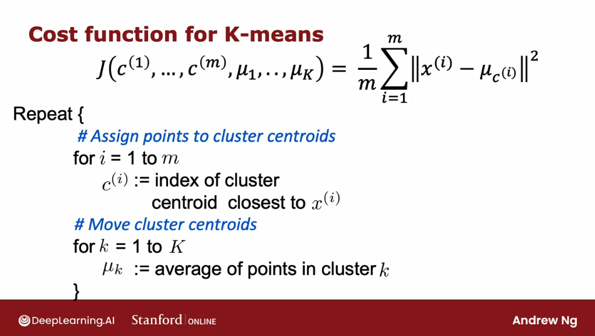

- In the **first part of K-means**, where we assign points to cluster centroids, that is actually trying to update $c^{(1)}$ through $c^{(im)}$ in order to try to minimize the cost function $J$ while holding $\mu_{1}$ through $\mu_{K}$ fixed. 

- **And the second step**, where we move the custom centroids, that is trying to update $\mu_{1}$ through $\mu_{K}$, while leaving $c^{(1)}$ through $c^{(im)}$ fixed.

Going back to the first step, if we want to minimize this distance or the square distance, what we should do is assign $x^{(i)}$ to the closest cluster centroid. So to take a simplified example:
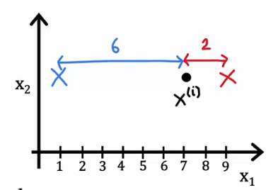

We have the two clusters centroids above and just a single training example, $x^{(i)}$. If we were to assign that data point to the blue cluster, this square distance betwen the data point and the blue cluster centroid would be much larger that between the data point and the red cluster centroid.

So if we want to minimize the term, we will take $x^{(i)}$ and assign it to the closer centroid, the blue centroid. And that's what the algorithm is doing, without changing the values for $\mu$ which are the location of the cluster centroids themselves. 

How about the second step of the K-means algorithm, where we move the clusters centroids? It turns out that **choosing $\mu_k$, the location of the centroid, to be average of the points assigned to that cluster is the best choice, that will minimize this expression.**

To take a simplified example, say we have a cluster with just two points assigned to it shown as follows: 
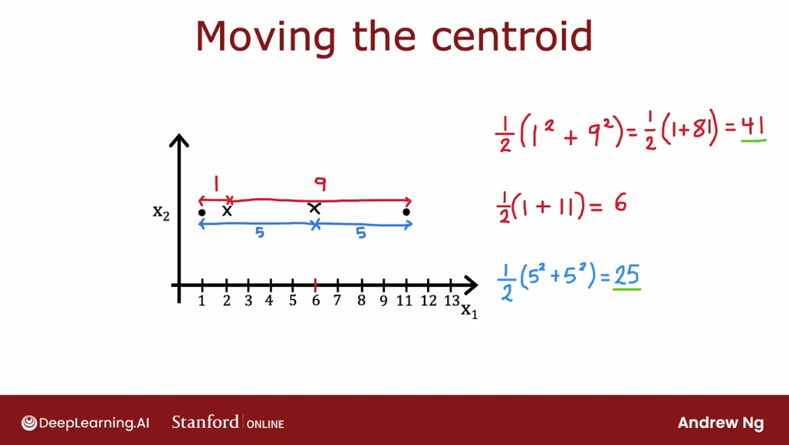

With the cluster centroid on the left, the average of the square distances would turn out to be 41. 

But if we were to take the average of these two points, so $(1 + 11) / 2$, that's equal to 6. And if we were to move the cluster centroid to the average of these two square distances, a distance of 5 and 5, we end up with a squared distance of 25. And this is a much smaller average squared distance than 41.

**The fact that the K-means algorithm is optimizing a cost function $J$ means that it is guaranteed to converge**, that is, on every single iteration, the distortion cost function should go down or stay the same.

If the cost function stops going down, once there's a single iteration where it stays the same,that gives an indications that Komeans has converged and we should just stop running the algorithm.

In some rare cases we will run K-means for a long time and the cost function of the distortion will go down very, very slowly: that's similar to might what happen with gradient descent, where maybe running even longer might help, but if the rate at which the cost function is going down has become very slow, we might also decide we have reached a good-enough state, close enough to the point of convergence.

## Initilizing K-means

The first step of the K-means clustering algorithm **was to choose random locations as the initial guesses for the cluster centroids**, $\mu_{1}$ through $\mu_{K}$. 

But how do we actually take that random gues?. Let's take a look at that, as well as how we can **take multiple attempts at the initial guesses** for $\mu_{1}$ through $\mu_{K}$, which **will result in our finding a better set of clusters.**

Here again is the K-means algorithm: let's take a look at how we can implement this first step, step 0: 

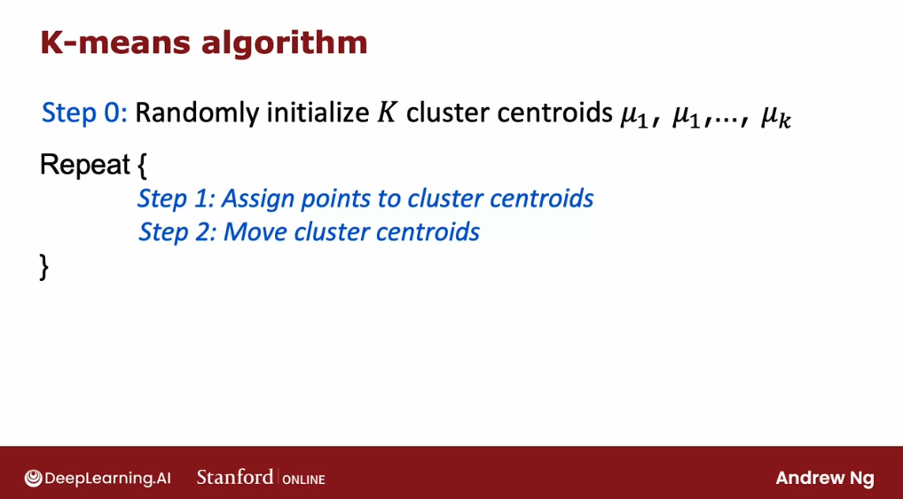

When running K-means we should **always choose the number of cluster centroids $K$ to be less than the amount of training examples $m$**: it doesn't really make sense to have $K$ greater than $m$ because then there won't even be enough training examples to have at least one training example per cluster centroid:

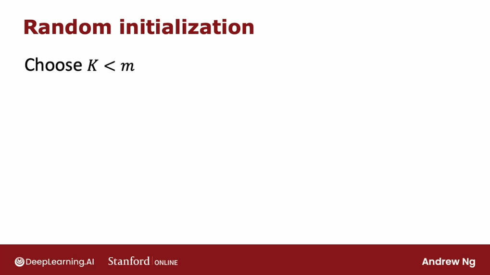

In our earlier example we had $K$ equals 2 and *m* equals 30. In order to choose the cluster centroids, the most common way is to **randomly pick $K$ training examples and set $\mu_{1}$ through $\mu_{K}$ in those locations**. For example, in the following training, I would randomly pick two training examples and initialize my red cluster centroid and my blue cluster centroids  here, in the example where $K$ was equal to 2:

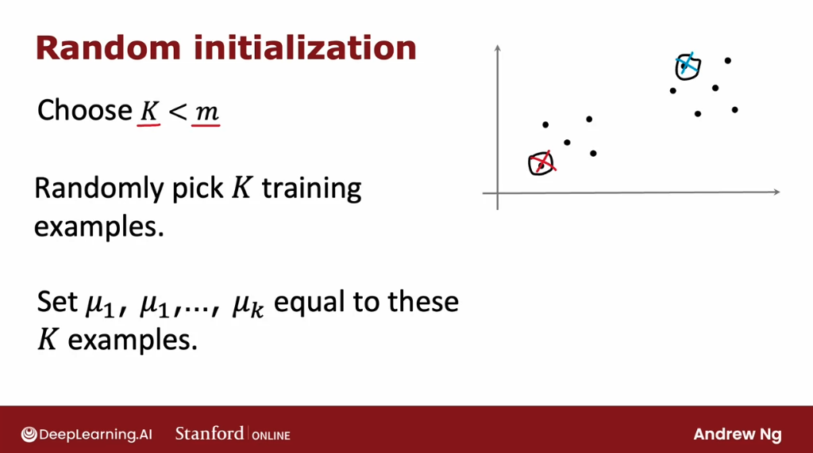

If this was our random initialization and we were to run K-means we pray end up with K-means deciding that these are the two classes in the data set:

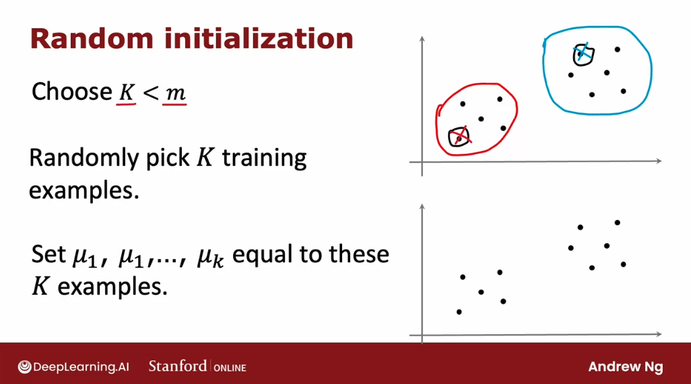

Notes that this method of initializing the cost of central is a little bit different than what I had used in the illustration in the earlier sections. Where I was initializing the cluster centroids mu one and mu two to be just random points rather than sitting on top of specific training examples. That was only to make the illustrations clearer in the earlier sections.But ,initialization by choosing random datapoints is actually a much more commonly used way of initializing the clusters centroids. 

However, with this method **there is a chance that, depending on how we choose the random initial central centroids, K-means will end up picking a difference set of clusters for our data set.**

Let's look at a slightly more complex example, where we're going to look at this data set and try to find three clusters, so $K$ equals 3:

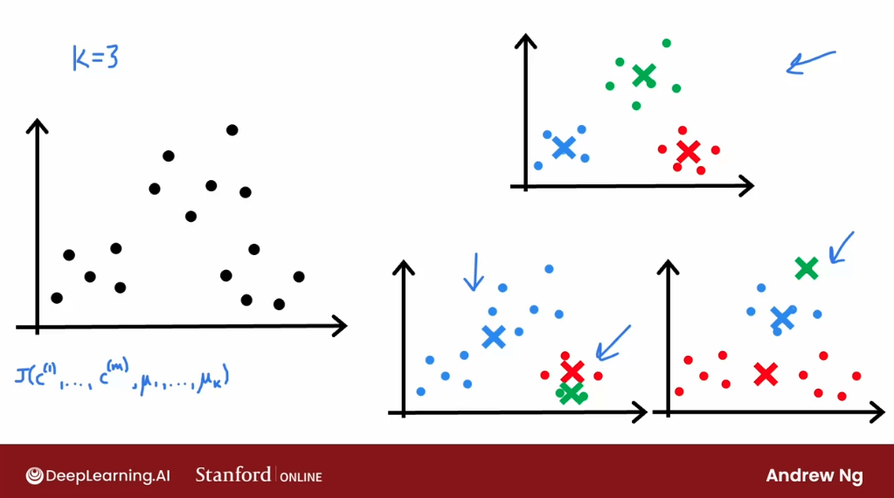

If we were to run K-means with random initialization of the cluster centroid, we may get the result in the top, which looks like a pretty good choice. 

But with a different initialization, we might end up with the other two alternatives seen below, which **are not fully optimized: with this less fortunate choice of random initialization, ithe algorithm gets stuck in a local minimum.**

So, **if we want to give K-means multiple shots at finding the best local optimum**, by trying  multiple random initialization, **we can run the algorithm multiple times and then to try to find the best local optima**. 

If we were to run K-means 3 times, for example, and end up with these three distinct clusterings, one way to choose between these three solutions is to **compute the cost function $J$ for all three solutions**, all three of these choices of clusters found by K-means, and get $J_1$, $J_2$ and $J_3$. **And then to pick one of these three according to which one of them gives we the lowest value for the cost function**.

You can see this graphically, by the distance of each of the dots assigned to each cluster to each cluster centroid, and how it would end up being much less on the top graph:

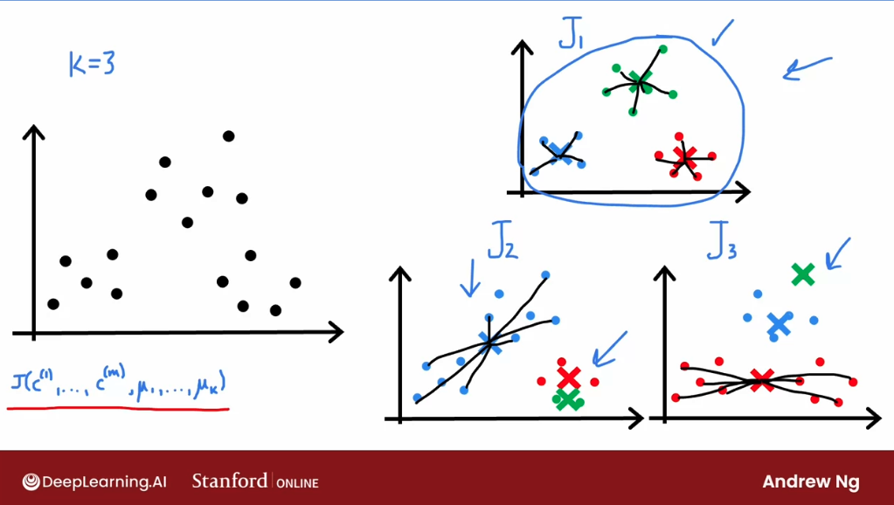

Let's more formally into an algorithm: 

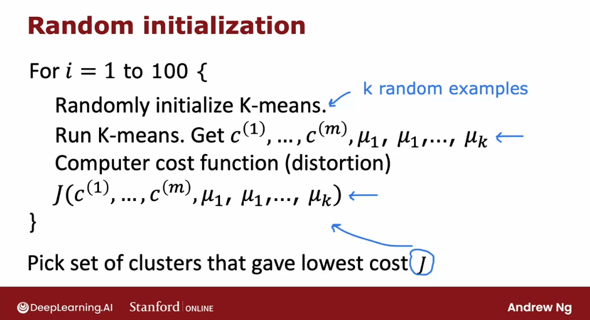

- If we want to use 100 random initialization for K-means, then we would run 100 times randomly initialized K-means using the method that we saw earlier in this section. 

- Pick $K$ training examples and let the cluster centroids initially be the locations of those $K$ training examples. 

- Using that random initialization, run the K-means algorithm to convergence. And that will give us a choice of cluster assignments and cluster centroids.

- Compute the distortion compute the cost function $J$.

- After doing this, say 100 times, we would finally pick the set of clusters that gave the lowest cost. 

When we're using this method, **repeating the process somewhere between 50 to 1000 times would be pretty common**. After 1000 times, it tends to get computational expensive and have diminishing returns.

## Choosing the number of clusters

The k-means algorithm requires as one of its inputs, k, the number of clusters we want it to find, but how do we decide how many clusters to used. Do we want two clusters or three clusters of five clusters or 10 clusters? Let's take a look. 

For a lot of clustering problems, the right value of $K$ is truly ambiguous. If I were to show different people the same data set and ask, how many clusters do we see? There will definitely be people that will say, it looks like there are two distinct clusters and they will be right. 

There would also be others that will see actually four distinct clusters. They would also be right. Because clustering is unsupervised learning algorithm we're not given the quote right answers in the form of specific labels to try to replicate. 

There are lots of applications where the data itself does not give a clear indicator for how many clusters there are in it. I think it truly is ambiguous if this data has two or four, or maybe three clusters. If we take say, the red one here and the two blue ones here say. 

If we look at the academic literature on K-means, there are a few techniques to try to automatically choose the number of clusters to use for a certain application. I'll briefly mention one here that we may see others refer to, although I had to say, I personally do not use this method myself. But one way to try to choose the value of $K$ is called the elbow method and what that does is we would run K-means with a variety of values of $K$ and plot the cost function or the distortion function J as a function of the number of clusters. 

What we find is that when we have very few clusters, say one cluster, the distortion function or the cost function J will be high and as we increase the number of clusters, it will go down, maybe as follows. and if the curve looks like this, we say, well, it looks like the cost function is decreasing rapidly until we get to three clusters but the decrease is more slowly after that. Let's choose $K$ equals 3 and this is called an elbow, by the way, because think of it as analogous to that's our hand and that's our elbow over here. 

Plotting the cost function as a function of $K$ could help, it could help we gain some insight. I personally hardly ever use the the elbow method myself to choose the right number of clusters because I think for a lot of applications, the right number of clusters is truly ambiguous and we find that a lot of cost functions look like this with just decreases smoothly and it doesn't have a clear elbow by wish we could use to pick the value of K. By the way, one technique that does not work is to choose $K$ so as to minimize the cost function J because doing so would cause we to almost always just choose the largest possible value of $K$ because having more clusters will pretty much always reduce the cost function J. 

Choosing $K$ to minimize the cost function J is not a good technique. How do we choose the value of $K$ and practice? Often we're running K-means in order to get clusters to use for some later or some downstream purpose. 

That is, we're going to take the clusters and do something with those clusters. What I usually do and what I recommend we do is to evaluate K-means based on how well it performs for that later downstream purpose. Let me illustrate to the example of t-shirt sizing. 

One thing we could do is run K-means on this data set to find the clusters, in which case we may find clusters like that and this would be how we size our small, medium, and large t-shirts, but how many t-shirt sizes should there be? Well, it's ambiguous. If we were to also run K-means with five clusters, we might get clusters that look like this. 

This will let shoe size t-shirts according to extra small, small, medium, large, and extra large. Both of these are completely valid and completely fine groupings of the data into clusters, but whether we want to use three clusters or five clusters can now be decided based on what makes sense for our t-shirt business. Does a trade-off between how well the t-shirts will fit, depending on whether we have three sizes or five sizes, but there will be extra costs as well associated with manufacturing and shipping five types of t-shirts instead of three different types of t-shirts. 

What I would do in this case is to run K-means with $K$ equals 3 and $K$ equals 5 and then look at these two solutions to see based on the trade-off between fits of t-shirts with more sizes, results in better fit versus the extra cost of making more t-shirts where making fewer t-shirts is simpler and less expensive to try to decide what makes sense for the t-shirt business. When we get to the programming exercise, we also see there an application of K-means to image compression. This is actually one of the most fun visual examples of K-means and there we see that there'll be a trade-off between the quality of the compressed image,

that is, how good the image looks versus how much we can compress the image to save the space. 

In that program exercise, we see that we can use that trade-off to maybe manually decide what's the best value of $K$ based on how good do we want the image to look versus how large we want the compress image size to be. That's it for the K-means clustering algorithm. Congrats on learning our first unsupervised learning algorithm. 

we now know not just how to do supervised learning, but also unsupervised learning. I hope we also have fun with the practice lab, is actually one of the most fun exercises I know of the K-means. With that, we're ready to move on to our second unsupervised learning algorithm, which is anomaly detection. 

How do we look at the data set and find unusual or anomalous things in it. This turns out to be another, one of the most commercially important applications of unsupervised learning. I've used this myself many times in many different applications. 

Let's go on to the next section to talk about anomaly detection.