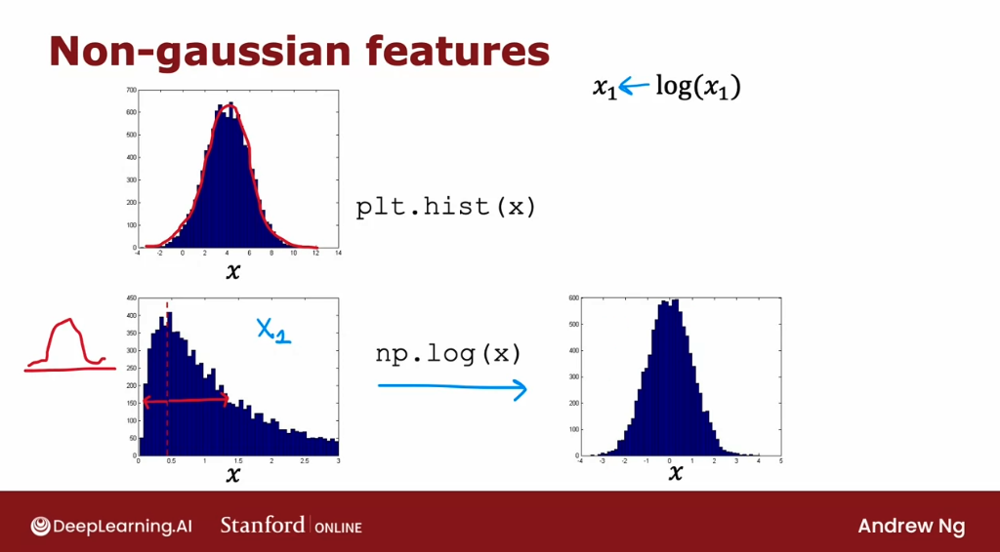

# Anomaly Detection

## Finding unusual events

Let's look at our second unsupervised learning algorithm: **Anomaly detection algorithms look at an unlabeled dataset of normal events and learns to detect or to raise a red flag if there is an unusual or an anomalous event.** 

People have used anomaly detection to detect possible problems with aircraft engines that were being manufactured, to check if after it was manufactured it seemed anomalous or if there seemed to be anything wrong with it. 

So, after an aircraft engine rolls off the assembly line, we measure a number of different features of the aircraft engine. So, say feature $x_1$ measures the heat generated by the engine, and feature $x_2$ measures the vibration intensity.

Since arcraft engine manufacturers don't make that many bad engines, the easier type of data to collect is: if we have manufactured $m$ aircraft engines, the features $x_1$ and $x_2$ about how these $m$ engines behave. Probably most of them are normal engines rather than ones with a defect or flaw in them. 


The anomaly detection problem is: **after the learning algorithm has seen these $m$ examples of how aircraft engines typically behave** in terms of how much heat is generated and how much they vibrate, if a brand new aircraft engine were to roll off the assembly line and **it had a new feature vector given by $x_{test}$, we'd like to know: _does this engine look similar to ones that have been manufactured before?_** 

Here's how an anomaly detection algorithm works. Let's plot the examples $x_1$ through $x_m$, and marke two new engines - an OK engine, and an anomaly:


How can we have an algorithm address this problem? The most common way to carry out **anomaly detection is through a technique called density estimation.** When we're given our training sets of $m$ examples, the first thing we do is **build a model for the probability of $x$**. In other words, **the learning algorithm will try to figure out what are the values of the features $x_1$ and $x_2$ that have high probability and what are the values that are less likely or have a lower chance or lower probability of being seen in the data set.** 


In this example that we have here, it is quite likely to see examples in the ellipse in the middle, and decreases outwards.


And having modeled or having learned to model for $p(x)$, when we are given the new test example $x_{test}$, we compute the probability of $x_{test}$. And if it is small or more precisely, if it is less than some small number epsilon $\epsilon$, which means that $p(x)$ is very small or in other words, the specific value of $x$ that we saw for a certain user was very unlikely, relative to other usage that we have seen. 

But if the $p(x_{test})$ is less than some small threshold or some small number epsilon, we will raise a flag to say that this could be an anomaly. 

So for example, if $x_{test}$ was all the way down and to the right of the graph, the probability of an example landing all the way out here is actually quite low. And so hopefully $p(x_{test})$ for this value of $x_{test}$ will be less than epsilon and so we would flag this as an anomaly.


In contrast, if $p(x_{test})$ is not less than epsilon, that is, if $p(x_{test})$ is greater than equal to epsilon, then we will say that it looks okay, this doesn't look like an anomaly. And that corresponds to an example where our model $p(x)$ will say that examples near the middle are actually quite high probability: there's a very high chance that the new airplane engine will have features close to these inner ellipses.


Anomaly detection is used today in many applications. 

It is frequently used in **fraud detection** where for example: if we are running a website with many different features $x^{(i)}$ (how often does this user login? how many web pages do they visit? How many transactions are they making? how many posts on the discussion forum are they making? what is their typing speed?) With data like this we can then model $p(x)$ from data to model what is the typical behavior of a given user. 

In the common workflow of fraud detection, we wouldn't automatically turn off an account just because it seemed anomalous. Instead we may ask the security team to take a closer look or put in some additional security checks such as ask the user to verify their identity with a cell phone number or ask them to pass a capture to prove that they're human and so on. But algorithms like this are routinely used today to try to find unusual or maybe slightly suspicious activity. So we can more carefully screen those accounts to make sure there isn't something fraudulent. 


Anomaly detection is also frequently used in **manufacturing**. Many manufacturers routinely use anomaly detection to see if whatever they just manufactured. Anything from an airplane engine to a printed circuit board to a smartphone to a motor, to many, many things to see if we've just manufactured the unit that somehow behaves strangely. 

Is also u**sed to monitor computers in clusters and in data centers** where if $x^{(i)}$ are the features of a certain machine (such as memory use, the number of disk accesses per second, CPU load, ratio of CPU load to network traffic) if ever a specific computer behaves very differently than other computers, it might be worth taking a look at that computer to see if something is wrong with it. For example, if it has had a hard disk failure or network card failure or something's wrong with it or if maybe it has been hacked into. 

## Gaussian (normal) distribution

Let's take a look at what is the Gaussian or the normal distribution. 

If $x$ is a random number, sometimes called the random variable, $x$ can take on random values. If the probability of $x$ is given by a Gaussian or normal distribution with mean parameter $\mu$ , and with variance $\sigma^2$, the probability of $x$ looks like a curve that goes like this:


The center or the middle of the curve is given by the mean $\mu$ , and the standard deviation or the width of this curve is given by that variance parameter $\sigma$. Technically, $\sigma$ is called the standard deviation and the square of $\sigma$ is called the variance of the distribution. This curve here shows what is $p(x)$ or the probability of x. 


If we're wondering what does $p(x)$ really means? Here's one way to interpret it: It means that if we were to get, say, 100 numbers drawn from this probability distribution, and we were to plot a histogram of these 100 numbers drawn from this distribution, we might get a histogram that looks like this:


It looks vaguely bell-shaped. What this curve on the left indicates is not if we have just 100 examples or 1,000 or a million or a billion, but if we had a practically infinite number of examples, and we were to draw a histogram of this practically infinite number of examples with a very fine histogram bins. Then we end up with essentially this bell-shaped curve here on the left. 

The formula for $p(x)$ is given by the expression:

$$ $p(x)$ = \frac{1}{\sqrt{2\pi\sigma^2}} e^{-\frac{(x-\mu)^2}{2\sigma^2}} $$

Let's look at a few examples of how changing $\mu$  and $\sigma$ will affect the Gaussian distribution. First, let me set $\mu$ equals 0 and $\sigma$ equals 1. Here's my plot of the Gaussian distribution with mean 0, $\mu$ equals 0, and standard deviation $\sigma$ equals 1. 

We notice that this distribution is centered at zero and that is the standard deviation $\sigma$ is equal to 1. 


Now, let's reduce the standard deviation $\sigma$ to 0.5. If we plot the Gaussian distribution with $\mu$ equals 0 and $\sigma$ equals 0.5, it now it looks like this.


Notice that it's still centered at zero because $\mu$ is zero. But it's become a much thinner curve because $\sigma$ is now 0.5. We might recall that $\sigma$ is the standard deviation is 0.5, whereas $\sigma$ squared is also called the variance. 

That's equal to 0.5 squared or 0.25. You may have heard that probabilities always have to sum up to one, so that's why the area under the curve is always equal to one, which is why when the Gaussian distribution becomes skinnier, it has to become taller as well. 


Now, we're going to increase $\sigma$ to 2, so the standard deviation is 2 and the variance is 4. This now creates a much wider distribution because $\sigma$ here is now much larger, and because it's now a wider distribution is become shorter as well because the area under the curve is still equals 1.


Finally, let's try changing the mean parameter $\mu$, and I'll leave $\sigma$ equals 0.5. 


In this case, the center of the distribution $\mu$ moves over here to the right. But the width of the distribution is the same as the one on top because the standard deviation is 0.5 in both of these cases on the right. This is how different choices of $\mu$ and $\sigma$ affect the Gaussian distribution. 

When we're applying this to anomaly detection, here's what we have to do: e are given a dataset of $m$ examples, and here $x$ is just a number. Here, are plotted of the training sets with 11 examples:


What we have to do is try to estimate what a good choice is for the mean parameter $\mu$, as well as for the variance parameter $\sigma$ squared. Given a dataset like this, it would seem that a Gaussian distribution maybe looking like that with a center here and a standard deviation like this. This might be a pretty good fit to the data.


The way we would compute $\mu$ and $\sigma$ squared mathematically is our estimate for $\mu$ will be just the average of all the training examples: 

$$ \mu = \frac{1}{m} \sum_{i=1}^m x^{(i)} $$

The value we will use to estimate $\sigma$ squared will be the average of the squared difference between two examples, and that $\mu$ that we just estimated here on the left:

$$ \sigma^2 = \frac{1}{m} \sum_{i=1}^m (x^{(i)} - \mu)^2 $$

These formulas for $\mu$ and $\sigma$ squared are technically called **the maximum likelihood estimates for $\mu$ and $\sigma$.** 

If we were to get an example near the tip of the bell, then $p(x)$ is pretty high, whereas if we were to get an example, at the ends of the bell then $p(x)$ is pretty low, which is why we would consider this example, okay, not really anomalous, not a lot like the other ones. 


Now, we've done this only for when $x$ is a number, as if we had only a single feature for our anomaly detection problem. But for practical anomaly detection applications, we will have many features, two or three or some even larger number $n$ of features. Let's take what we saw for a single Gaussian and use it to build a more sophisticated anomaly detection algorithm that can handle multiple features.

## Anomaly detection algorithm

Now that we've seen how the Gaussian or the normal distribution works for a single number, we're ready to build our anomaly detection algorithm. 

Let's dive in. We have a training set $x_1$ through $x_m$, where here each example $x$ has $n$ features. So, each example $x$ is a vector with $n$ numbers. 

In the case of the airplane engine example, we had two features corresponding to the heat and the vibrations. And so, each of these $\vec{\mathbf{x}}^{(i)}$'s would be a two dimensional vector and $n$ would be equal to 2. But for many practical applications $n$ can be much larger and we might do this with dozens or even hundreds of features.


Given this training set, what we would like to do is to carry out density estimation and all that means is, we will build a model or estimate the probability for $p(x)$. What's the probability of any given feature vector? And our model for $p(x)$ is going to be as follows:

$$ p(\vec{\mathbf{x}}) = p(x_1; \mu_1, \sigma_1^2) \space*\space p(x_2; \mu_2, \sigma_2^2) \space*\space p(x_3; \mu_3, \sigma_3^2)\space*\space \cdots \space*\space p(x_n; \mu_n, \sigma_n^2) $$

$x$ is a feature vector with values $x_1$, $x_2$ and so on, down to $x_n$. 

And we're going to model $p(x)$ as the probability of $x_1$, times the probability of $x_2$, times the probability of $x_3$ times the probability of $x_n$, for the $n$ th features in the feature vectors. 

This equation corresponds to assuming that the features $x_1$, $x_2$ and so on up to $x_n$ are statistically independent. But tis algorithm often works fine even that the features are not actually statistically independent. 

Note that we are saying that the probability of all the features of these vector features $x$ each correspond to a different $\mu$ $n$ and $\sigma$.

In case we're wondering why we multiply probabilities: let's see an example for an aircraft engine that has a 1/10 chance that it is really hot, unusually hot. And there is a 1 in 20 chance that it vibrates really hard. Then, what is the chance that it runs really hot and vibrates really hard?

We're saying that the chance of that is 1/10 times 1/20 which is 1/200. So it's really unlikely to get an engine that both run really hot and vibrates really hard. 


A somewhat more compact way to write this equation up here is:

$$ p(\vec{\mathbf{x}}) = \prod_{j=1}^n p(x_j; \mu_j, \sigma _j^2) $$

So let's put it all together to see how we can build an anamoly detection system. 

The first step is to choose features $x^{(i)}$ that we think might be indicative of anomalous examples.


Having come up with the features we want to use, we would then fit the parameters $\mu_1$  through $\mu_n$ and $\sigma_1^2$  1 through \sigma_n^2$, for the $n$ features in our data set. As we might guess, the parameter $\mu_j$ j will be just the average of $x_j$ of the feature $j$ of all the examples in our training set. And $\sigma_j^2$ will be the average of the square difference between the feature and the value $\mu_j$, that we just computed.


And by the way, if we have a vectorized implementation, we can also compute $\mu$ as the average of the training examples as follows: here $x$ and $\mu$ are both vectors. And so this would be the vectorized way of computing $\mu_1$ through $\mu_n$ and all at the same time.


And by estimating these parameters on our unlabeled training set, we've now computed all the parameters of our model. 

Finally, when we are given a new example, $x_{test}$  what we would do is compute $p(x)$ and see if it's large or small. So $p(x)$ as we saw on the last slide is the product from $j = 1$ to $n$ of the probability of the individual features:

$$ p(x) = \prod_{j=1}^n p(x_j; \mu_j, \sigma_j^2) = \prod_{j=1}^n \frac{1}{\sqrt{2\pi}\sigma_j} e^{-\frac{(x_j - \mu_j)^2}{2\sigma_j^2}} $$


And if we compute out this formula, we get some number for $p(x)$. 


And the final step is to see a $p(x)$ is less than epsilon. And if it is then we flag that it is an anomaly.


One intuition behind what this algorithm is doing is that it will tend to flag an example as anomalous if one or more of the features are either very large or very small relative to what it has seen in the training set. 

So for each of the features $x_j$, we're fitting a Gaussian distribution like this. And so if even one of the features of the new example was way out here, say, then $p(x_j)$ would be very small. And if just one of the terms in this product is very small, then this overall product, when we multiply together will tend to be very small and does $p(x)$ will be small.


So, what anomaly detection is doing in this algorithm is a systematic way of quantifying whether or not this new example $x$ has any features that are unusually large or unusually small. 

Now, let's take a look at what all this actually means on one example. Up ahead, a data set with features $x_1$ and $x_2$.

Notice that the features $x_1$ take on a much larger range of values than the features $x_2$. If we were to compute the mean of the Features $x_1$ , we end up with five, which is why we want is equal to 1. And it turns out that for this data said, if we compute $\sigma_1$, it will be equal to about 2. 

And if we were to compute $\mu$ to the average of the features on next to the average is 3 and similarly is variance or standard deviation is much smaller, which is why $\sigma_2$ is equal to 1.


If we were to actually multiply $p(x_1)$  and $p(x_2)$, then we end up with this  3D surface plot for $p(x)$ where any point, the height of this is the product of $p(x_1)$ times $p(x_2)$. 


And this signifies that values where $p(x)$ is higher are more likely. So, values near the middle kind of here are more likely, whereas values far outare much less likely. 

Now, let's pick two test examples, $x^1_{test}$  and $x^2_{test}$ and see what the algorithm is doing; which of these 2 examples the algorithm will flag as anomalous. We're going to pick the parameter ε to be equal to 0.02. 

If we were to compute $p(x^1_test)$, it turns out to be about 0.4, which is much bigger than epsilon $\epsilon$. The algorithm will say this looks okay, doesn't look like an anomaly. 

In contrast, if we were to compute $p(x^1_{test})$ for the point corresponding to $x_1$ equals about 8 and $x_2$ equals about 0.5. Then $p(x^2_{test})$ is 0.0021. 

So this is much smaller than epsilon $\epsilon$. And so the algorithm will flag this as a likely anomaly.

## Developing and evaluating an anomaly detection system

Let's see some practical tips for developing an anomaly detection system. The key idea will be that if we can have a way to evaluate a system, even as it's being developed, we'll be able to make decisions and change the system and improve it much more quickly. 

When we are developing a learning algorithm (for example, choosing different features or trying different values of the parameters like $\epsilon$) **making decisions about whether or not to change a feature is much easier if we have a way of evaluating the learning algorithm.** 


This is called **real number evaluation**, meaning that if we can quickly change the algorithm in some way (such as change a feature or change a parameter) and have a way of computing a number that tells us if the algorithm got better or worse, then it makes it much easier to decide whether or not to stick with that change.

This is how it's often done in anomaly detection. 

Rven though we've mainly been talking about unlabeled data, we're going to change that assumption and assume that we have some labeled data, including  a small number usually of previously observed anomalies. (For example, after making airplane engines for a few years, we've just seen a few airplane engines that were anomalous, and we're going to associate those to a label $y = 1$to indicate this anomaly, while normal = 0).


**The training set that the anomaly detection algorithm will learn from is still this unlabeled training set of $x_1$ through $x_m$**, and we're going to think of all of these examples as ones that we'll just assume are normal -not anomalous-, so $y$ is equal to 0. 


In practice, if a few anomalous examples where to slip into this training set, our algorithm will still usually perform okay. 


To evaluate our algorithm, that is, to come up with a way for we to have a real number evaluation, it turns out to be very useful i**f we have a small number of anomalous examples so that we can create a cross validation set**, which we're going to denote $x_{cv}^1$, $y_{cv}^1$ through $x_{cv}^m$, $y_{cv}^m$.


Also, we'd like to have a test set of some number of examples where both the cross validation and test sets hopefully includes a few anomalous examples. In other words, the cross validation and test sets will have a few examples of $y$ equals 1, but also a lot of examples where $y$ is equal to 0.


Let's illustrate this with the aircraft engine example. Let's say we have been manufacturing aircraft engines for years and so we've collected data from 10,000 good or normal engines, but over the years we had also collected data from 20 flawed or anomalous engines:


Usually the number of anomalous engines, that is $y$ equals 1, will be much smaller. It will not be a typical to apply this type of algorithm with anywhere from, say, 2-50 known anomalies. We're going to take this dataset and break it up into a training set, a cross validation set, and the test set:


Here's one example. We're going to put 6,000 good engines into the training set. (Again, if there are couple of anomalous engines that got slipped into this set is actually okay)

Then let's put 2,000 good engines and 10 of the known anomalies into the cross-validation set, and a separate 2,000 good and 10 anomalous engines into the test set. 


What we can do then is **train the algorithm on the training set, fit the Gaussian distributions to these 6,000 examples**.

And then **on the cross-validation set, we can see how many of the anomalous engines it correctly flags.** 

For example, we could use the cross validation set to **tune the parameter epsilon**: set it higher or lower depending on whether the algorithm seems to be reliably detecting these 10 anomalies without taking too many of these 2,000 good engines and flagging them as anomalies. 


After we have tuned the parameter epsilon and maybe **also added or subtracted or tuned features $X_J$** we can then take the algorithm and **evaluate it on our test set to see how many of these 10 anomalous engines it finds, as well as how many mistakes it makes by flagging the good engines as anomalous ones.** 

Notice that this is still primarily an unsupervised learning algorithm because the training sets really has no labels or they all have labels that we're assuming to be $y$ equals 0. So, we learned from the training set by fitting the Gaussian distributions as we saw in the previous section. But it turns out if we're building a practical anomaly detection system, having a small number of anomalies to use to evaluate the algorithm that our cross validation and test sets is very helpful for tuning the algorithm. 

Because the number of flawed engines is so small there's one other alternative used for anomaly detection: **not use a test set, but to have just a training set and a cross-validation set**. 


In this example, we will set train on 6,000 good engines, but take the remainder of the data, the 4,000 remaining good engines as well as all the anomalies, and put them in the cross validation set. We would then tune the parameters $\epsilon$ and add or subtract features $x_j$ to try to get it to do as well as possible as evaluated on the cross validation set. 


If we have very few flawed engines, so if we had only two flawed engines, then this really makes sense to put all of that in the cross validation set. Since we just don't have enough data to create a totally separate test set that is distinct from our cross-validation set. The downside of this alternative here is that after we've tuned our algorithm, we don't have a fair way to tell how well this will actually do on future examples because we don't have the test set. 

Just be aware that there's a higher risk that we will have over-fitted some of our decisions around $\epsilon$ and choice of features and so on, to the cross-validation set, and so its performance on real data in the future may not be as good as we were expecting.


### Algorithm evaluation

**Let's take a closer look at how to actually evaluate the algorithm on our cross-validation sets or on the test set.** Here's what we'd do. 

- We would first fit the model $p(x)$ on the training set. This was a 6,000 examples of goods engines.


- Then on any cross validation or test example $x$, we would compute $p(x)$ and we will predict $y$ equals 1. That is, anomalous if $p(x)$ is less than $\epsilon$ and we predict $y$ is 0, if $p(x)$ is greater than or equal to $\epsilon$. 


- Based on this, we can now look at how accurately this algorithm's predictions on the cross validation or test set matches the labels $y$ that we have in the cross validation or the test sets. 


In the third week of the second course, we had had a couple of optional sections on how to handle highly skewed data distributions where the number of positive examples, $y$ equals 1, can be much smaller than the number of negative examples where $y$ equals 0. This is the case as well for many anomaly detection in the applications where the number of anomalies in our cross-validation set is much smaller. 

In our previous example, we had maybe 10 positive examples and 2,000 negative examples because we had 10 anomalies and 2,000 normal examples. If we saw those optional sections, we may recall that we saw it can be useful to compute things like the true positive, false positive, false negative, and true negative rates. Also compute precision recall or $F_1$ score and that these are alternative metrics and classification accuracy that could work better when our data distribution is very skewed.


So, we might consider applying those types of evaluation metrics as well to tell how well our learning algorithm is doing at finding that small handful of anomalies or positive examples amidst this much larger set of negative examples of normal plane engines.

The intuition I hope we get is to use the cross-validation set to just look at how many anomalies is finding and also how many normal engines is incorrectly flagging as an anomaly. Then to just use that to try to choose a good choice for the parameter $\epsilon$.


## Anomaly detection vs. supervised learning

When we have a few positive examples with $y = 1$ and a large number of negative examples -$y = 0$-, **when should we use anomaly detection and when should we use supervised learning?** 

The decision is actually quite subtle in some applications. So, let's see some suggestions for how to pick between these two types of algorithms. 

**An anomaly detection algorithm will typically be the more appropriate choice when we have a very small number of positive examples (0-20 positive examples is not uncommon) and a relatively large number of negative examples with which to try to build a model for $p(x)$.**


Recall that the parameters for $p(x)$ are learned only from the negative examples and this much smaller set of positive examples is only used in our cross validation set and test set for parameter tuning and for evaluation. 

In contrast, **if we have a larger number of positive and negative examples, then supervised learning might be more applicable.** 


Now, even if we have only 20 positive training examples, it might be okay to apply a supervised learning algorithm. But it turns out that the way anomaly detection looks at the data set versus the way supervised learning looks at the data set are quite different. 

Here is the main difference: **if we think there are many different types of anomalies or many different types of positive examples, then anomaly detection might be more appropriate.**


For example: when there are many different ways for an aircraft engine to go wrong, and if tomorrow there may be a brand new way for an aircraft engine to have something wrong with it, then our 20 positive examples may not cover all of the ways that an aircraft engine could go wrong. **That makes it hard for any algorithm to learn from the small set of positive examples what the anomalies, what the positive examples look like. And future anomalies may look nothing like any of the anomalous examples we've seen so far.** 

If we believe this to be true for our problem, then I would gravitate to using an anomaly detection algorithm. Because what anomaly detection does is it looks at the normal examples that is the $y = 0$ negative examples and just try to model what they look like. And anything that deviates a lot from normal it flags as an anomaly, including if there's a brand new way for an aircraft engine to fail that had never been seen before in our data set.

In contrast, **supervised learning has a different way of looking at the problem: when we're applying supervised learning ideally we would hope to have enough positive examples for the average to get a sense of what the positive examples are like.**

And **with supervised learning, we tend to assume that the future positive examples are likely to be similar to the ones in the training set**.


Let's illustrate this with one example, if we are using a system to find, say financial fraud. There are many different ways unfortunately that some individuals are trying to commit financial fraud. 

And unfortunately there are new types of financial fraud attempts every few months or every year. And what that means is that because they keep on popping up completely new, and unique forms of financial fraud anomaly detection is often used to just look for anything that's different, then transactions we've seen in the past. 

In contrast, if we look at the problem of email spam detection, well, there are many different types of spam email, but even over many years. Spam emails keep on trying to sell similar things or get we to go to similar websites and so on. Spam email that we will get in the next few days is much more likely to be similar to spam emails that we have seen in the past. 

So that's why supervised learning works well for spam because it's trying to detect more of the types of spam emails that we have probably seen in the past in our training set. Whereas if we're trying to detect brand new types of fraud that have never been seen before, then anomaly detection maybe more applicable.


Let's go through a few more examples:


## Choosing what features to use

**When building an anomaly detection algorithm, making a good choice of features turns out to be really important.** 

In supervised learning, if we don't have the features quite right, or if we have a few extra features that are not relevant to the problem, that often turns out to be acceptable, because the algorithm has the supervised signal -that is, the labels for $y$- for the algorithm to figure out what features to ignore, or how to re-scale feature and to take the best advantage of the features we do give it. 

But for anomaly detection, which runs and learns from unlabeled data, it is harder for the algorithm to figure out what features to ignore. So carefully choosing the features, is far more important for anomaly detection than for supervised learning approaches. 

Let's take a look in this section at some practical tips, for how to tune the features for anomaly detection, to try to get the best possible performance. 

One step that can take to help our anomaly detection algorithm is to **try to make sure the features we give it are more or less gaussian**. If our features are not gaussian, sometimes we can change it to make it a little bit more gaussian. 

If we have a feature $x$, we can plot a histogram of the feature:


This distribution here looks pretty gaussia, so this would be a good candidate feature, if we think this is a feature that helps distinguish between anomalies and normal examples. 

But quite often when we plot a histogram of our features, we may find that the feature has a distribution like this: 


This does not at all look like a symmetric bell shaped curve. When that is the case, we need to take this feature $x$, and transform it in order to make a more gaussian distribution.


For example: if we compute the $log(x)$ and plot its histogram its looks much more gaussian. So we can replace the feature $x$ with the feature $log(x)$:



Other than than we might apply the following transformations:

- $x \rightarrow log(x) $
- $x \rightarrow log(x + c) $
- $x \rightarrow \sqrt{x} $
- $x \rightarrow x^c $ where $c$ can be fractions

Let's see how to actually do this in Python:

First you can plot the histogram with:
```py
plt.hist(x, bins=50, color='blue')
```


We want to try a transformation to make this distribution gaussian, so we can try for example to plot $\sqrt(x)$.

```py
plt.hist(x**0.5, bins=50, color='blue')
```


This actually looks somewhat more gaussian. But not perfectly, asond let's try a different parameter. 

```py
plt.hist(x**0.25, bins=50, color='blue')
```


That overdid it a little bit. So let's try 0.4:
```py
plt.hist(x**0.4, bins=50, color='blue')
```

That looks pretty gaussian. 

So we would set $x$ to be equal to X to the power of 0.4, and just use the value of thew new $x$ in our training process instead.

```py
xNew = x**0.4
```

We can also transform it using log:

```py
plt.hist(np.log(x+7), bins=50)
```


A reminder: **whatever transformation we apply to the training set, we also need to apply the same transformation to our cross validation and test set data as well.**

### Error analists for anomaly detection

Other than making sure that our data is approximately gaussian, after we've trained our anomaly detection algorithm, if it doesn't work that well on our cross validation set, **we can also carry out an error analysis process for anomaly detection.** In other words, we can try to look at where the algorithm is not yet doing well whereas making errors, and then use that to try to come up with improvements. 

So as a reminder, we want:

- $p(x)$ to be large for normal examples $x$ - greater than equal than $\epsilon$
- $p(x)$ to be small or less than $\epsilon$, for the anomalous examples $x$. 

When we've learned the model $p(x)$ from our unlabeled data, the most common problem that we may run into is that $p(x)$ is a comparable value for both normal and for anomalous examples (for example, a large value)


As a concrete example: if this is our data set:


And if we have an example in our cross validation set or test set, that is to the right as marked above and is anomalous, then it has a pretty high probability, and in fact, it looks quite similar to the other examples in our training set. 

And so, even though this is an anomaly, $p(x)$ is actually pretty large. And so the algorithm will fail to flag this particular example as an anomaly. In that case, we need to to look at that example and try to figure out what is it that made us think is an anomaly, even if this feature $x_1$ took on values similar to other training examples. 

If we can identify some new feature $x_2$ that helps distinguish this example from the normal examples, then adding that feature can help improve the performance of the algorithm. 

Here's a picture showing that:


If we can come up with a new feature $x_2$, say, we're trying to detect fraudulent behavior, and if $x_1$ is the number of transactions they make, maybe this user looks like they're making some of the transactions as everyone else. 

But if we discover that this user has some insanely fast typing speed, we can add a new feature $x_2$, that is the typing speed of this user. And if it turns out that when we plot this data using the old feature $x_1$ and this new feature $x_2$, causes $x_2$ to stand out to the upper right, then it becomes much easier for the anomaly detection algorithm to recognize from $x_2$ that we're dealing with an anomalous user.


## Practice Lab: Anomaly Detection

In this exercise, you will implement the anomaly detection algorithm and apply it to detect failing servers on a network. 

### Outline
- [ 1 - Packages ](#1)
- [ 2 - Anomaly detection](#2)
  - [ 2.1 Problem Statement](#2.1)
  - [ 2.2  Dataset](#2.2)
  - [ 2.3 Gaussian distribution](#2.3)
    - [ Exercise 1](#ex01)
    - [ Exercise 2](#ex02)
  - [ 2.4 High dimensional dataset](#2.4)

<a name="1"></a>
### 1 - Packages 

First, let's run the cell below to import all the packages that you will need during this assignment.
- [numpy](www.numpy.org) is the fundamental package for working with matrices in Python.
- [matplotlib](http://matplotlib.org) is a famous library to plot graphs in Python.
- ``utils.py`` contains helper functions for this assignment. You do not need to modify code in this file.

```py
import numpy as np
import matplotlib.pyplot as plt
from utils import *

%matplotlib inline
```

<a name="2"></a>
### 2 - Anomaly detection

<a name="2.1"></a>
#### 2.1 Problem Statement

In this exercise, you will implement an anomaly detection algorithm to
detect anomalous behavior in server computers.

The dataset contains two features - 
   * throughput (mb/s) and 
   * latency (ms) of response of each server.

While your servers were operating, you collected $m=307$ examples of how they were behaving, and thus have an unlabeled dataset $\{x^{(1)}, \ldots, x^{(m)}\}$. 
* You suspect that the vast majority of these examples are “normal” (non-anomalous) examples of the servers operating normally, but there might also be some examples of servers acting anomalously within this dataset.

You will use a Gaussian model to detect anomalous examples in your
dataset. 
* You will first start on a 2D dataset that will allow you to visualize what the algorithm is doing.
* On that dataset you will fit a Gaussian distribution and then find values that have very low probability and hence can be considered anomalies. 
* After that, you will apply the anomaly detection algorithm to a larger dataset with many dimensions. 

<a name="2.2"></a>
#### 2.2  Dataset

You will start by loading the dataset for this task. 
- The `load_data()` function shown below loads the data into the variables `X_train`, `X_val` and `y_val` 
    - You will use `X_train` to fit a Gaussian distribution 
    - You will use `X_val` and `y_val` as a cross validation set to select a threshold and determine anomalous vs normal examples

```py
# Load the dataset
X_train, X_val, y_val = load_data()
```

##### View the variables
Let's get more familiar with your dataset.  
- A good place to start is to just print out each variable and see what it contains.

The code below prints the first five elements of each of the variables

```py
# Display the first five elements of X_train
print("The first 5 elements of X_train are:\n", X_train[:5])

# The first 5 elements of X_train are:
#  [[13.04681517 14.74115241]
#  [13.40852019 13.7632696 ]
#  [14.19591481 15.85318113]
#  [14.91470077 16.17425987]
#  [13.57669961 14.04284944]]
```

```py
# Display the first five elements of X_val
print("The first 5 elements of X_val are\n", X_val[:5])

# The first 5 elements of X_val are
#  [[15.79025979 14.9210243 ]
#  [13.63961877 15.32995521]
#  [14.86589943 16.47386514]
#  [13.58467605 13.98930611]
#  [13.46404167 15.63533011]]
```

```py
# Display the first five elements of y_val
print("The first 5 elements of y_val are\n", y_val[:5])

# The first 5 elements of y_val are
#  [0 0 0 0 0]
```

##### Check the dimensions of your variables

Another useful way to get familiar with your data is to view its dimensions.

The code below prints the shape of `X_train`, `X_val` and `y_val`.

```py
print ('The shape of X_train is:', X_train.shape)
print ('The shape of X_val is:', X_val.shape)
print ('The shape of y_val is: ', y_val.shape)

# The shape of X_train is: (307, 2)
# The shape of X_val is: (307, 2)
# The shape of y_val is:  (307,)
```

##### Visualize your data

Before starting on any task, it is often useful to understand the data by visualizing it. 
- For this dataset, you can use a scatter plot to visualize the data (`X_train`), since it has only two properties to plot (throughput and latency)

```py
# Create a scatter plot of the data. To change the markers to blue "x",
# we used the 'marker' and 'c' parameters
plt.scatter(X_train[:, 0], X_train[:, 1], marker='x', c='b') 

# Set the title
plt.title("The first dataset")
# Set the y-axis label
plt.ylabel('Throughput (mb/s)')
# Set the x-axis label
plt.xlabel('Latency (ms)')
# Set axis range
plt.axis([0, 30, 0, 30])
plt.show()
```


<a name="2.3"></a>
#### 2.3 Gaussian distribution

To perform anomaly detection, you will first need to fit a model to the data’s distribution.

* Given a training set $\{x^{(1)}, ..., x^{(m)}\}$ you want to estimate the Gaussian distribution for each
of the features $x_i$. 

* Recall that the Gaussian distribution is given by

   $$ p(x ; \mu,\sigma ^2) = \frac{1}{\sqrt{2 \pi \sigma ^2}}\exp^{ - \frac{(x - \mu)^2}{2 \sigma ^2} }$$

   where $\mu$ is the mean and $\sigma^2$ is the variance.
   
* For each feature $i = 1\ldots n$, you need to find parameters $\mu_i$ and $\sigma_i^2$ that fit the data in the $i$-th dimension $\{x_i^{(1)}, ..., x_i^{(m)}\}$ (the $i$-th dimension of each example).

##### 2.3.1 Estimating parameters for a Gaussian distribution

**Implementation**: 

Your task is to complete the code in `estimate_gaussian` below.

<a name="ex01"></a>
### Exercise 1

Please complete the `estimate_gaussian` function below to calculate `mu` (mean for each feature in `X`) and `var` (variance for each feature in `X`). 

You can estimate the parameters, ($\mu_i$, $\sigma_i^2$), of the $i$-th
feature by using the following equations. To estimate the mean, you will
use:

$$\mu_i = \frac{1}{m} \sum_{j=1}^m x_i^{(j)}$$

and for the variance you will use:
$$\sigma_i^2 = \frac{1}{m} \sum_{j=1}^m (x_i^{(j)} - \mu_i)^2$$

If you get stuck, you can check out the hints presented after the cell below to help you with the implementation.

```py
# UNQ_C1
# GRADED FUNCTION: estimate_gaussian

def estimate_gaussian(X): 
    """
    Calculates mean and variance of all features 
    in the dataset
    
    Args:
        X (ndarray): (m, n) Data matrix
    
    Returns:
        mu (ndarray): (n,) Mean of all features
        var (ndarray): (n,) Variance of all features
    """

    m, n = X.shape
    
    ### START CODE HERE ###
    mu = np.mean(X, axis=0)
    var = np.var(X, axis=0)
    
    
    ### END CODE HERE ### 
        
    return mu, var
```

You can check if your implementation is correct by running the following test code:

```py
# Estimate mean and variance of each feature
mu, var = estimate_gaussian(X_train)              

print("Mean of each feature:", mu)
print("Variance of each feature:", var)
    
# UNIT TEST
from public_tests import *
estimate_gaussian_test(estimate_gaussian)

# Mean of each feature: [14.11222578 14.99771051]
# Variance of each feature: [1.83263141 1.70974533]
# All tests passed!
```


Now that you have completed the code in `estimate_gaussian`, we will visualize the contours of the fitted Gaussian distribution. 

You should get a plot similar to the figure below. 


From your plot you can see that most of the examples are in the region with the highest probability, while the anomalous examples are in the regions with lower probabilities.

```py
# Returns the density of the multivariate normal
# at each data point (row) of X_train
p = multivariate_gaussian(X_train, mu, var)

#Plotting code 
visualize_fit(X_train, mu, var)
```


#### 2.3.2 Selecting the threshold $\epsilon$

Now that you have estimated the Gaussian parameters, you can investigate which examples have a very high probability given this distribution and which examples have a very low probability.  

* The low probability examples are more likely to be the anomalies in our dataset. 
* One way to determine which examples are anomalies is to select a threshold based on a cross validation set. 

In this section, you will complete the code in `select_threshold` to select the threshold $\varepsilon$ using the $F_1$ score on a cross validation set.

* For this, we will use a cross validation set
$\{(x_{\rm cv}^{(1)}, y_{\rm cv}^{(1)}),\ldots, (x_{\rm cv}^{(m_{\rm cv})}, y_{\rm cv}^{(m_{\rm cv})})\}$, where the label $y=1$ corresponds to an anomalous example, and $y=0$ corresponds to a normal example. 
* For each cross validation example, we will compute $p(x_{\rm cv}^{(i)})$. The vector of all of these probabilities $p(x_{\rm cv}^{(1)}), \ldots, p(x_{\rm cv}^{(m_{\rm cv})})$ is passed to `select_threshold` in the vector `p_val`. 
* The corresponding labels $y_{\rm cv}^{(1)}, \ldots, y_{\rm cv}^{(m_{\rm cv})}$ are passed to the same function in the vector `y_val`.

<a name="ex02"></a>
#### Exercise 2
Please complete the `select_threshold` function below to find the best threshold to use for selecting outliers based on the results from the validation set (`p_val`) and the ground truth (`y_val`). 

* In the provided code `select_threshold`, there is already a loop that will try many different values of $\varepsilon$ and select the best $\varepsilon$ based on the $F_1$ score. 

* You need to implement code to calculate the F1 score from choosing `epsilon` as the threshold and place the value in `F1`. 

  * Recall that if an example $x$ has a low probability $p(x) < \varepsilon$, then it is classified as an anomaly. 
        
  * Then, you can compute precision and recall by: 
   $$\begin{aligned}
   prec&=&\frac{tp}{tp+fp}\\
   rec&=&\frac{tp}{tp+fn},
   \end{aligned}$$ where
    * $tp$ is the number of true positives: the ground truth label says it’s an anomaly and our algorithm correctly classified it as an anomaly.
    * $fp$ is the number of false positives: the ground truth label says it’s not an anomaly, but our algorithm incorrectly classified it as an anomaly.
    * $fn$ is the number of false negatives: the ground truth label says it’s an anomaly, but our algorithm incorrectly classified it as not being anomalous.

  * The $F_1$ score is computed using precision ($prec$) and recall ($rec$) as follows:
    $$F_1 = \frac{2\cdot prec \cdot rec}{prec + rec}$$ 

**Implementation Note:** 
In order to compute $tp$, $fp$ and $fn$, you may be able to use a vectorized implementation rather than loop over all the examples.


If you get stuck, you can check out the hints presented after the cell below to help you with the implementation.

```py
# UNQ_C2
# GRADED FUNCTION: select_threshold

def select_threshold(y_val, p_val): 
    """
    Finds the best threshold to use for selecting outliers 
    based on the results from a validation set (p_val) 
    and the ground truth (y_val)
    
    Args:
        y_val (ndarray): Ground truth on validation set
        p_val (ndarray): Results on validation set
        
    Returns:
        epsilon (float): Threshold chosen 
        F1 (float):      F1 score by choosing epsilon as threshold
    """ 

    best_epsilon = 0
    best_F1 = 0
    F1 = 0
    
    step_size = (max(p_val) - min(p_val)) / 1000
    
    for epsilon in np.arange(min(p_val), max(p_val), step_size):
    
        ### START CODE HERE ###
        predictions = p_val < epsilon
        
        tp = np.sum((predictions == 1) & (y_val == 1))
        fp = np.sum((predictions == 1) & (y_val == 0))
        fn = np.sum((predictions == 0) & (y_val == 1))
        
        prec = tp / (tp + fp)
        rec = tp / (tp + fn)
        
        F1 = 2 * prec * rec / (prec + rec)
        
        ### END CODE HERE ### 
        
        if F1 > best_F1:
            best_F1 = F1
            best_epsilon = epsilon
        
    return best_epsilon, best_F1
```


You can check your implementation using the code below

```py
p_val = multivariate_gaussian(X_val, mu, var)
epsilon, F1 = select_threshold(y_val, p_val)

print('Best epsilon found using cross-validation: %e' % epsilon)
print('Best F1 on Cross Validation Set: %f' % F1)
    
# UNIT TEST
select_threshold_test(select_threshold)

# Best epsilon found using cross-validation: 8.990853e-05
# Best F1 on Cross Validation Set: 0.875000
# All tests passed!
```


Now we will run your anomaly detection code and circle the anomalies in the plot (Figure 3 below).

```py
# Find the outliers in the training set 
outliers = p < epsilon

# Visualize the fit
visualize_fit(X_train, mu, var)

# Draw a red circle around those outliers
plt.plot(X_train[outliers, 0], X_train[outliers, 1], 'ro',
         markersize= 10,markerfacecolor='none', markeredgewidth=2)
```


<a name="2.4"></a>
### 2.4 High dimensional dataset

Now,  we will run the anomaly detection algorithm that you implemented on a more realistic and much harder dataset.

In this dataset, each example is described by 11 features, capturing many more properties of your compute servers.

Let's start by loading the dataset.

- The `load_data()` function shown below loads the data into variables `X_train_high`, `X_val_high` and `y_val_high`
    -  `_high` is meant to distinguish these variables from the ones used in the previous part
    - We will use `X_train_high` to fit Gaussian distribution 
    - We will use `X_val_high` and `y_val_high` as a cross validation set to select a threshold and determine anomalous vs normal examples

```py
# load the dataset
X_train_high, X_val_high, y_val_high = load_data_multi()
```

##### Check the dimensions of your variables

Let's check the dimensions of these new variables to become familiar with the data

```py
print ('The shape of X_train_high is:', X_train_high.shape)
print ('The shape of X_val_high is:', X_val_high.shape)
print ('The shape of y_val_high is: ', y_val_high.shape)

# The shape of X_train_high is: (1000, 11)
# The shape of X_val_high is: (100, 11)
# The shape of y_val_high is:  (100,)
```

#### Anomaly detection 

Now, let's run the anomaly detection algorithm on this new dataset.

The code below will use your code to 
* Estimate the Gaussian parameters ($\mu_i$ and $\sigma_i^2$)
* Evaluate the probabilities for both the training data `X_train_high` from which you estimated the Gaussian parameters, as well as for the the cross-validation set `X_val_high`. 
* Finally, it will use `select_threshold` to find the best threshold $\varepsilon$. 

```py
# Apply the same steps to the larger dataset

# Estimate the Gaussian parameters
mu_high, var_high = estimate_gaussian(X_train_high)

# Evaluate the probabilites for the training set
p_high = multivariate_gaussian(X_train_high, mu_high, var_high)

# Evaluate the probabilites for the cross validation set
p_val_high = multivariate_gaussian(X_val_high, mu_high, var_high)

# Find the best threshold
epsilon_high, F1_high = select_threshold(y_val_high, p_val_high)

print('Best epsilon found using cross-validation: %e'% epsilon_high)
print('Best F1 on Cross Validation Set:  %f'% F1_high)
print('# Anomalies found: %d'% sum(p_high < epsilon_high))

# Best epsilon found using cross-validation: 1.377229e-18
# Best F1 on Cross Validation Set:  0.615385
# Anomalies found: 117
```

