# Collaborative filtering

## Making recommendations

Every time we go to an online shopping website like Amazon or a movie streaming sites like Netflix or go to one of the apps or sites that do food delivery, these sites will recommend things to us that they think we may want to buy or movies they think we may want to watch or restaurants that they think we may want to try out. 

For many companies, a large fraction of sales is driven by their recommended systems. So today for many companies, the economics or the value driven by recommended systems is very large/

Let's dive in, using as a running example the application of predicting movie ratings. 

In our example, we run a large movie streaming website, where our users can rate movies using 0 to 5 stars.

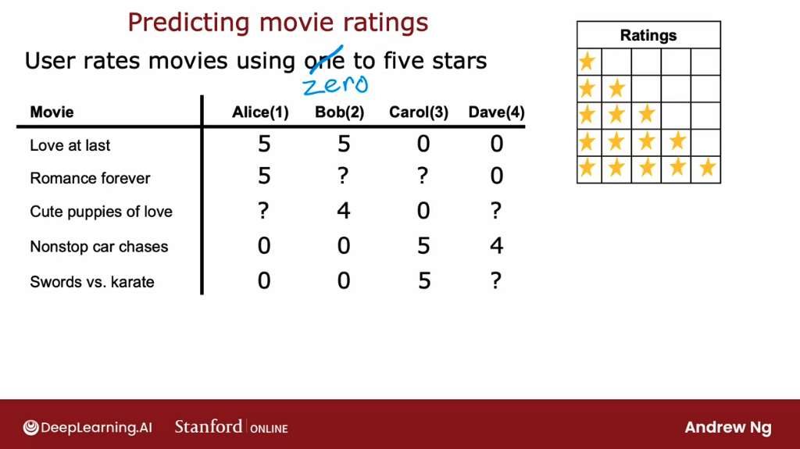

Notice that we denote via a question mark when a user has not rated a film.

The notation we're going to use is we're going to use is:

- $n_u$: number of users
- $n_m$: number of films
- $r(i,j) = 1$: if user $j$ has rated movie $i$, otherwise $0$
- $y(i,j)$: rating given by user $j$ to movie $i$

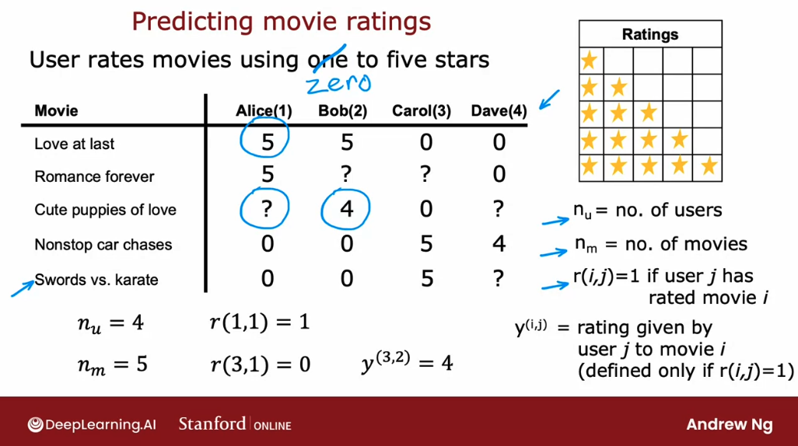

So with this framework for recommended systems **one possible way to approach the problem is to look at the movies that users have not rated, and to try to predict how users would rate those movies**. Based on this we can then try to recommend to users things that they are more likely to rate as five stars. 

We'll start to develop an algorithm for doing exactly that, but making one very special assumption: we're going to assume temporarily that we have access to features or extra information about the movies such as which movies are romance movies, which movies are action movies. 

However, later we will actually ask what if we don't have these features, how can we still get the algorithm to work then?

## Using per-item features

So let's take a look at how we can develop a recommender system if we have features of each item (movie). 

Here's the same data set that we had previously with the four users having rated some but not all of the five movies. What if we additionally have features of the movies?

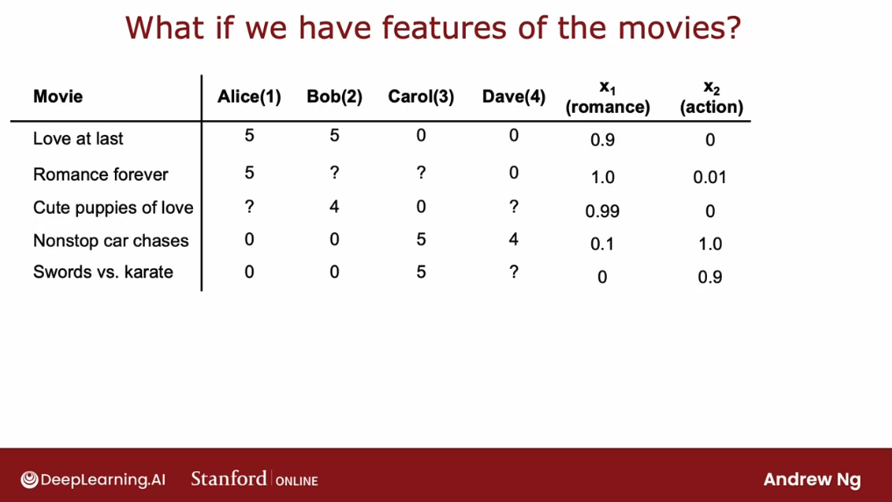

The two features $x_1$ and $x_2$, that tell us how much each of these is a romance movie, and how much each of these is an action movie.

Rcall that we had used the notation $n_u$ to denote the number of users, which is 4 and $m$ to denote the number of movies, which is 5. We'll also introduce $n$ to denote the number of features we have here. And so $n = 2$, because we have two features $x_1$ and $x_2$ for each movie.

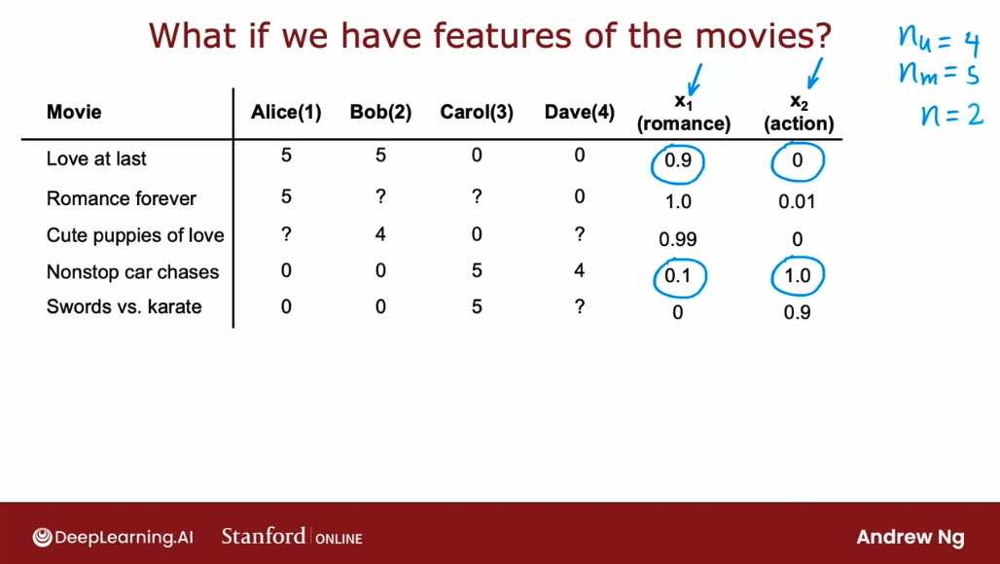

With these features we have for example that the features for movie one, "Love at Last", would be $[0.9 \space\space 0]$. And the features for the third movie "Cute Puppies of Love" would be $[0.99 \space\space 0]$. 

And let's start by taking a look at how we might make predictions for Alice's movie ratings. 

So for user one, that is Alice, let's say we predict the rating for movie $i$ as $w \cdot x^{(i)} + b$, which is just like linear regression. For example, if we had a parameter $w = [5 \space\space 0]$ (this is invented), then: 

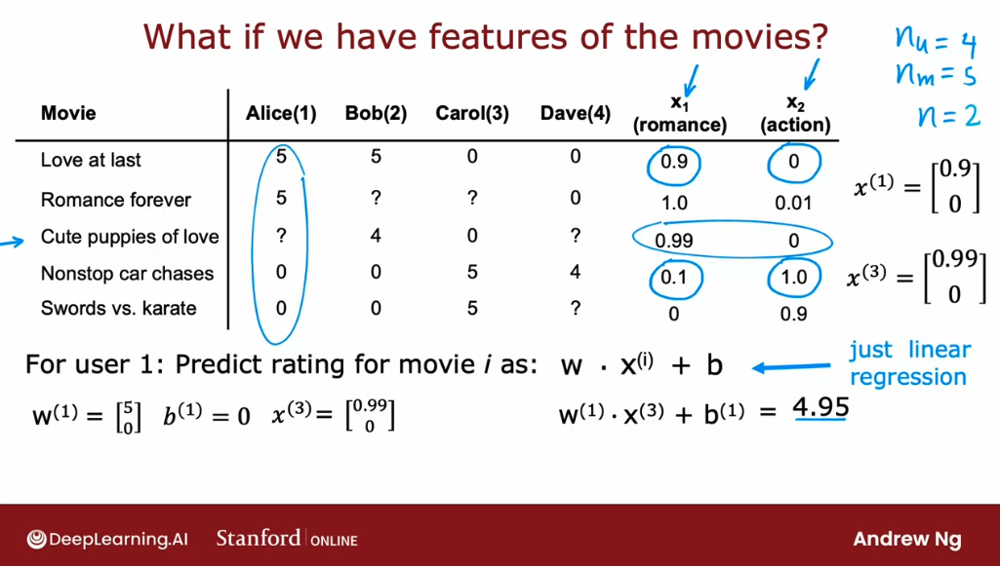

So for the first movie we would have a rating of 4.95. And this rating seems pretty plausible: Alice has given high ratings to "Love at Last" and Romance Forever, two highly romantic movies, but given low ratings to the action movies, "Nonstop Car Chases" and "Swords vs Karate". So if we look at "Cute Puppies of Love" predicting that she might rate that movie 4.95 seems quite plausible. 

So these parameters $w$ and $b$ for Alice seem like a reasonable model for predicting her movie ratings. 

Just adding a little the notation: because we have not just 1 user but multiple users, or really $n_u$ equals 4 users, we're going to add a superscript 1 to denote that this is the parameter $w^{(1)}$ for user 1 and add a superscript 1 for $b$ as well.

More generally for this model we have user $j$ and we can predict his rating for movie $i$ as: 

$$ \text{Rating for movie} \space i = w^{(j)} \cdot x^{(i)} + b^{(j)} $$

This is a lot like linear regression, except that we're fitting a different linear regression model for each of the 4 users in the dataset. 

Let's take a look at **how we can formulate the cost function for this algorithm**:

As a reminder, our notation is: 

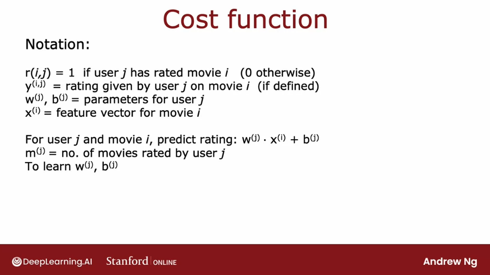

Notice that we introduce a new $m^{(j)}$ to denote the number of movies rated by user $j$.

Therefore given the ratings that a user $j$ has given to the movies they have seen, to learn the parameters $w^{(j)}$ and $b^{(j)}$, we have the cost function:

$$\text{min } J(w^{(j)},b^{(j)}) = \frac{1}{2m^{(j)}} \sum_{i:r(j, i) = 1} (w^{(j)} \cdot x^{(i)} + b^{(j)} - y^{(i, j)})^{2} $$

The avobe is using the mean squared error criteria. We're trying to choose parameters $w$ and $b$ to minimize the squared error between the predicted rating and the actual rating that was observed. **But the user hasn't rated all the movies, so if we're going to sum over this, we're going to sum over only over the values of $i$ where $r(i,j)=1$.** 

And we also do the usual normalization $\frac{1}{2m^{(j)}}$. And this is very much like the cost function we have for linear regression with $m$ or really $m^{(j)}$ training examples, where we're summing over the $m^{(j)}$ movies for which we have a rating, taking a squared error and then normalizing over $\frac{1}{2m^{(j)}}$.

If we minimize this function, then we should come up with a pretty good choice of parameters $w^{(j)}$ and $b^{(j)}$, for making predictions for user $j$'s ratings. 

Let's add one more term to this cost function, which is the **regularization term to prevent overfitting**:

$$\text{min } J(w^{(j)},b^{(j)}) = \frac{1}{2m^{(j)}} \sum_{i:r(j, i) = 1} (w^{(j)} \cdot x^{(i)} + b^{(j)} - y^{(i, j)})^{2} + \frac{\lambda}{2m^{(j)}} \sum_{k=1}^{n} (w_k^{(j)})^{2}$$

Its our usual regularization parameter: lambda divided by $2m^{(j)}$ and then times the sum of the squared values of the parameters $w$. And so $n$ is the number of features in $x^{(i)}$ and that's the same as a number of features in $w^{(j)}$.

Before moving on, it turns out that for recommender systems it is actually convenient to eliminate this division by $m^{(j)}$ term: it is just a constant in this expression. And so, even if we take it out, we should end up with the same value of $w$ and $b$:

$$\text{min } J(w^{(j)},b^{(j)}) = \frac{1}{2} \sum_{i:r(j, i) = 1} (w^{(j)} \cdot x^{(i)} + b^{(j)} - y^{(i, j)})^{2} + \frac{\lambda}{2} \sum_{k=1}^{n} (w_k^{(j)})^{2}$$

So for a single user, we have the cost function above.

But instead of focusing on a single user, let's look at how we learn the parameters for all of the users. To learn the parameters $w^{(1)}$, $b^{(1)}$, $w^{(2)}$, $b^{(2)}$,...,$w^{(n_u)}$, $b^{(n_u)}$, we would take this cost function on top and sum it over all the $n_u$ users. So we would have a sum from $j = 1$ to $n_u$ of the same cost function that we had written up above.:

$$\text{min } J(w^{(j)},b^{(j)}) = \frac{1}{2} \sum_{j = 1}^{n_u} \sum_{i:r(j, i) = 1} (w^{(j)} \cdot x^{(i)} + b^{(j)} - y^{(i, j)})^{2} + \frac{\lambda}{2}  \sum_{j = 1}^{n_u}  \sum_{k=1}^{n} (w_k^{(j)})^{2}$$

And this becomes the cost for learning all the parameters for all of the users. 

If we use gradient descent or any other optimization algorithm to minimize then we get a pretty good set of parameters for predicting movie ratings for all the users. And notice that this algorithm is a lot like linear regression, only now we're training a different linear regression model for each of the $n_u$ users. 

---

But where do these features come from? And what if we don't have access to such features that give we enough detail about the movies with which to make these predictions? 

## Collaborative filtering algorithm

What if we don't have the features $x_1$ and $x_2 that tell you how much of a movie is a romance or action movie$? Let's take a look at how we can learn or come up with those features $x_1$ and $x_2$ from the data. 

Here's the data that we had before. but what if instead of having these numbers for $x_1$ and $x_2$, we didn't know in advance what the values of the features $x_1$ and $x_2$ were?

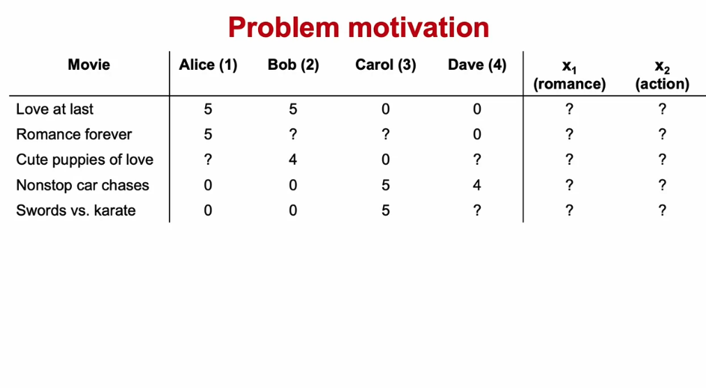

Now, just for the purposes of illustration, let's say we had somehow already learned parameters for the four users. To simplify this example, all the values of $b$ are actually equal to 0. Just to reduce a little bit of writing, we're going to ignore $b$ for the rest of this example.

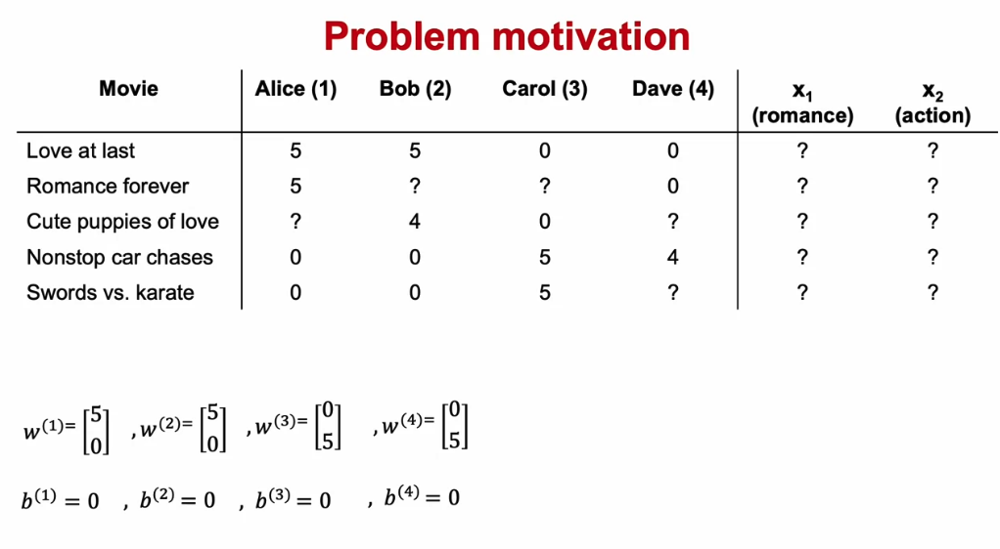

Let's take a look at how we can try to guess what might be reasonable features for movie 1. If these are the parameters we have on the left, then given that Alice rated movie 1, 5, we should have that $w^{(1)}\cdot x^{(1)}$ should be about equal to 5 and $w^{(2)} \cdot x^{(2)}$ should also be about equal to 5 because Bob rated it 5. $w^{(3)} \cdot x^{(1)}$ should be close to 0 and $w^{(4)} \cdot x^{(1)}$ should be close to 0 as well:

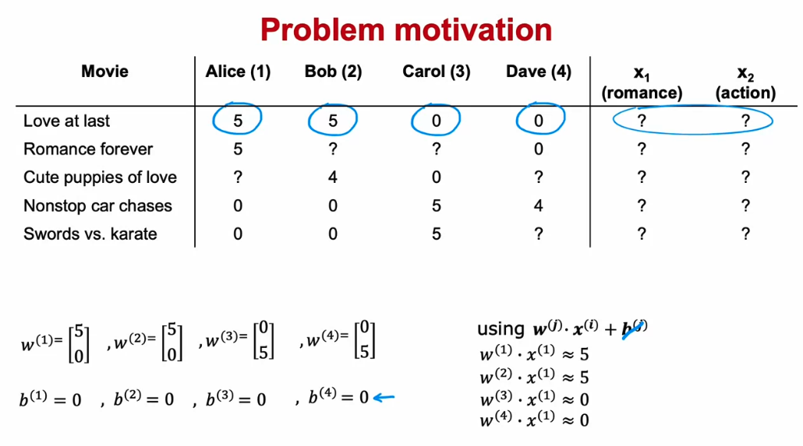

The question is: **given these values for $w$ that we have up here, what choice for $x_1$ will cause these values to be right?** 

One possible choice would be if the features for that first movie, were $\begin{bmatrix} 1 \\ 0 \end{bmatrix}$ in which case $w^{(1)}\cdot x^{(1)}$, the second equation as well 5, and the third and fourth would equal 0.

What we have is that if we have the parameters for all four users here, and if we have four ratings in this example that we want to try to match, we can take a reasonable guess at what is the feature vector $x_1$ for movie 1 that would make good predictions for these four ratings up on top. 

Similarly, if we have these parameter vectors, we can also try to come up with a feature vector $x_2$ for the second movie, feature vector $x_3$ for the third movie, and so on to try to make the algorithm's predictions on these additional movies close to what was actually the ratings given by the users.

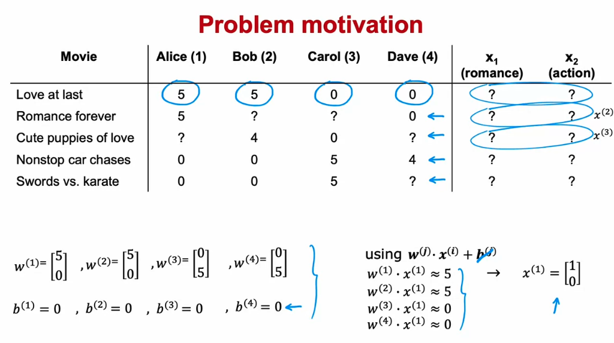

Let's come up with a cost function for actually learning the values of $x_1$ and $x_2$. By the way, notice that this works only because we have parameters for 4 users: that's what allows us to try to guess appropriate features, $x_1$. This is why in a typical linear regression application if we had just a single user, we don't actually have enough information to figure out what would be the features, $x_1$ and $x_2$, which is why in the linear regression contexts that we saw in course 1, we can't come up with features $x_1$ and $x_2$ from scratch. 

**But in collaborative filtering, it is because we have ratings from multiple users of the same item (the same movie), that's what makes it possible to try to guess what are possible values for these features.** 

---

Given $w^{(1)}$, $b^{(1)}$, $w^{(2)}$, $b^{(2)}$, and so on through $w^{n_u}$ and $b^{n_u}$, for $n_u$ users, if we want to learn the features $x^i$ for a specific movie, $i$, the following is a cost function we should use, as seen before:

$$\text{min } J(x^{(i)}) = \frac{1}{2} \sum_{j:r(i, j) = 1} (w^{(j)} \cdot x^{(i)} + b^{(j)} - y^{(i, j)})^{2} + \frac{\lambda}{2} \sum_{k=1}^{n} (x_k^{(i)})^{2}$$

Notice that now this will be a sum over all values of $j$ where $r(i, j) = 1$.

So if we minimize this cost function of $x^{(i)}$ we'll be choosing the features $x^{(i)}$ for the movie $i$ so that for all the users $j$ that have rated movie $i$, we will try to minimize the squared difference between what our choice of features $x^{(i)}$ results in terms of the predicted movie rating minus the actual movie rating that the user had given it. And we also add a regularization term as usual, which notice that uses the variable $x_k$.

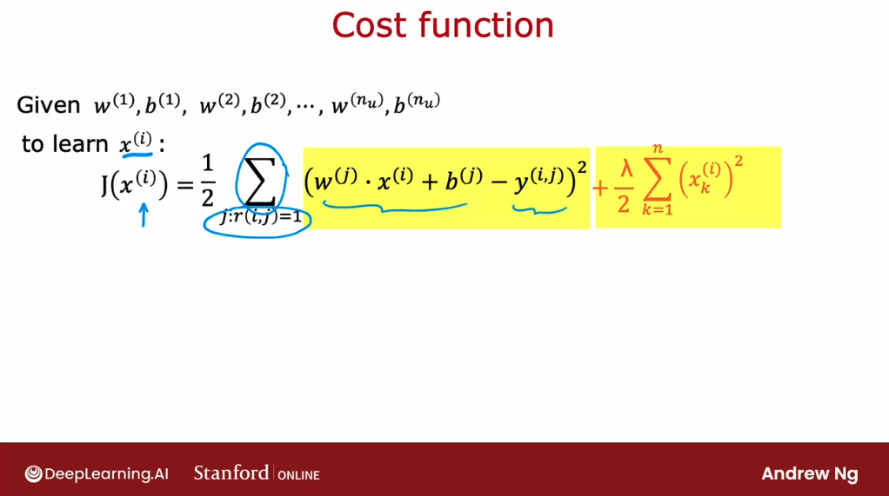

Lastly, to learn all the features $x_1$ through $x^n_m$ because we have $n_m$ movies, we can take this cost function on top and sum it over all the movies from $i = 1$ through the number of movies. And this becomes a cost function for learning the features for all of the movies in the dataset:

$$J(x^{(1)}, x^{(2)}, ..., x^{(n_m)}) = \frac{1}{2} \sum_{i = 1}^{n_m} \sum_{j:r(i, j) = 1} (w^{(j)} \cdot x^{(i)} + b^{(j)} - y^{(i, j)})^{2} + \frac{\lambda}{2} \sum_{i = 1}^{n_m} \sum_{k=1}^{n} (x_k^{(i)})^{2}$$

So if we have parameters $w$ and $b$, all the users, then minimizing this cost function as a function of $x_1$ through $x^{n_m}$ using gradient descent or some other algorithm, this will actually allow we to take a pretty good guess at learning good features for the movies.

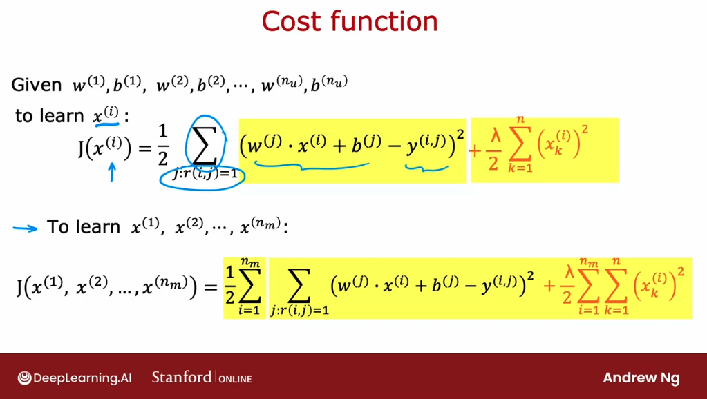

This is pretty remarkable: **for most machine learning applications the features had to be externally given but in this algorithm, we can actually learn the features for a given movie.** 

However, so far we we assumed we had those parameters $w$ and $b$ for the different users. Where do we get those parameters from? 

**Let's put together the algorithm from the last section for learning $w$ and $b$ and what we just talked about in this section for learning $x$ and that will give us our collaborative filtering algorithm.** 

Here's the cost function for learning the features and the cost function to learn $x^{(i)}$ through $x^{(n_m)}$:

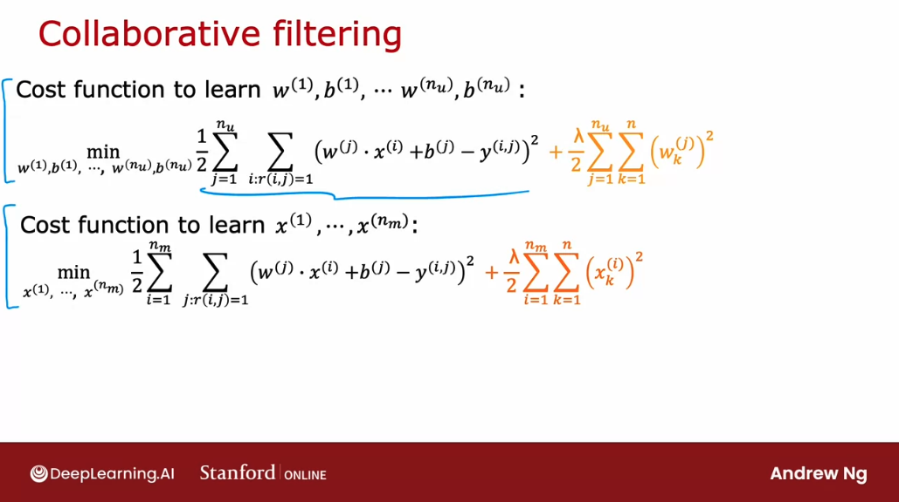

Now, if we put these two together, we see that the first term of each equation is exactly the same to the first of the other equation. Notice that the sum over $j$ of all values of $i$ where $r(j, i) = 1$ is the same as summing over all values of $i$ with all $j$ where $r(j, i) = 1$. This summation is just summing over all user-movie pairs where there is a rating. 

What we're going to do is put these two cost functions together, writing out the summation more explicitly as summing over all pairs $i$ and $j$, where we do have a rating of the usual squared cost function. And then add both regularization terms:

$$J(x^{(1)}, x^{(2)}, ..., x^{(n_m)}) = \frac{1}{2} \sum_{(i, j):r(i, j) = 1} (w^{(j)} \cdot x^{(i)} + b^{(j)} - y^{(i, j)})^{2} + \frac{\lambda}{2} \sum_{j = 1}^{n_m} \sum_{k=1}^{n} (w_k^{(i)})^{2} + \frac{\lambda}{2} \sum_{i = 1}^{n_m} \sum_{k=1}^{n} (x_k^{(i)})^{2}$$

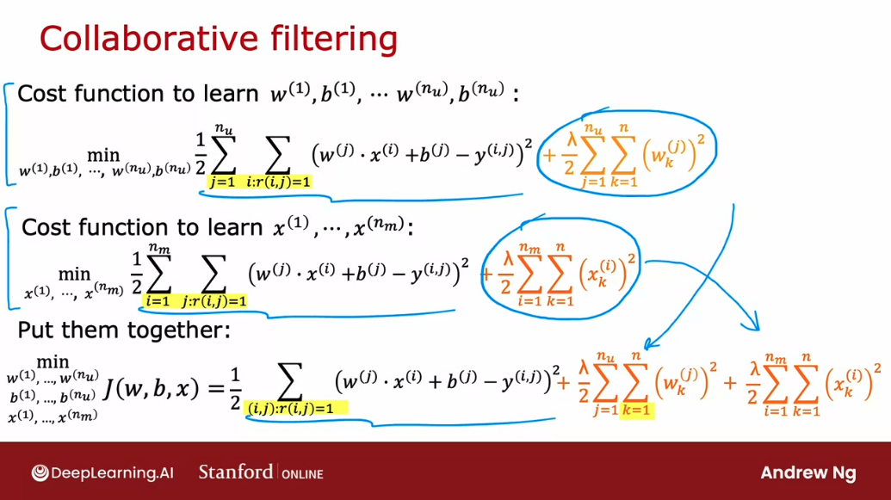

It turns out that if we minimize this cost function as a function of $w$ and $b$ as well as $x$, then this algorithm actually works.

Here's what I mean: If we had three users and two movies and if we have ratings for only 4 movies, what the cost function does is: it sums over all the users first and then having one term for each movie where there is a rating. 

But an alternative way to carry out the summation is to first look at movie 1 (summation of the first row) and then to include all the users that rated movie 1, and then look at movie 2 and have a term for all the users that had rated movie 2. 

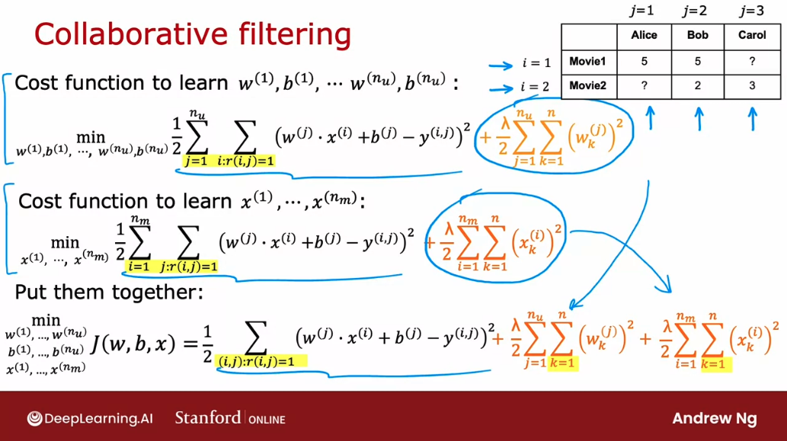

This summation on cost function for the features and the summation in the cost function for $x$s are the two ways of summing over all of the pairs where the user had rated that movie.

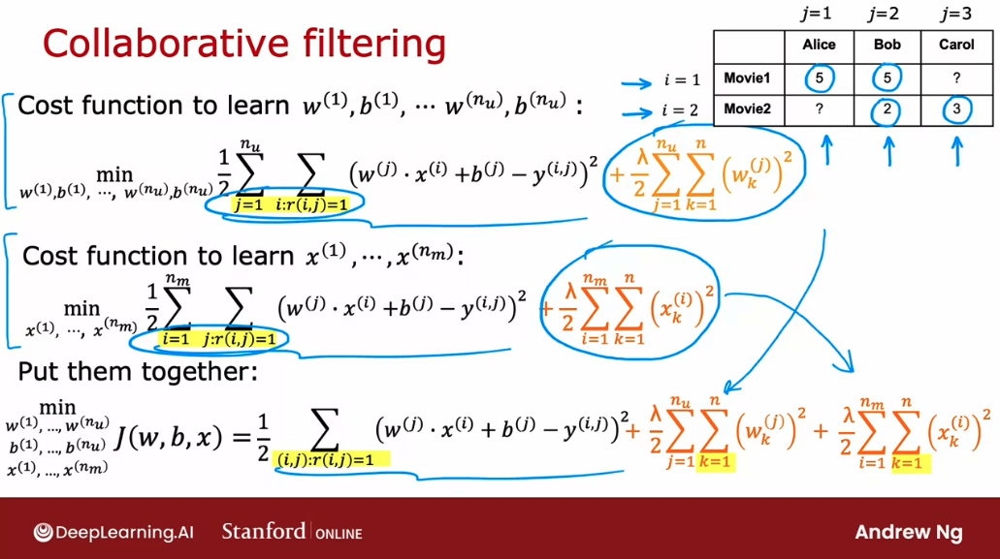

**How do we minimize this cost function as a function of $w$, $b$, and $x$?** Use gradient descent.

When we learned about linear regression, this is the gradient descent algorithm we had seen, where we had the cost function $J$, which is a function of the parameters $w$ and b, and we'd apply gradient descent as follows:

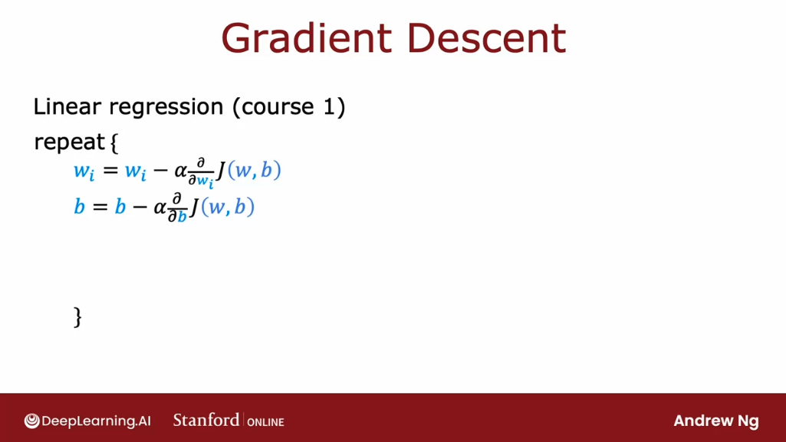

With collaborative filtering, the cost function isn't a function of just $w$ and $b$, is now also a function of $x$. We're using $w$ and $b$ here to denote the parameters for all of the users and $x$ here just informally to denote the features of all of the movies. But if we're able to take partial derivatives with respect to the different parameters, we can then continue to update the parameters as follows:

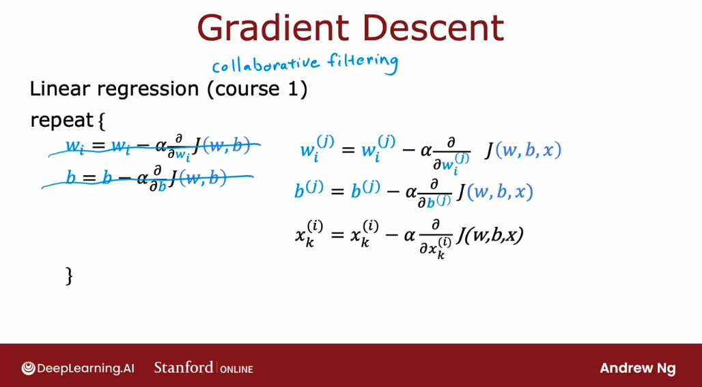

We're using the notation here a little bit informally and not keeping very careful track of the superscripts and subscripts, but the key takeaway I hope we have from this is that the parameters to this model are $w$ and b, and $x$ now is also a parameter, which is why we minimize the cost function as a function of all three of these sets of parameters, $w$ and b, as well as x. 

The algorithm we derived is called collaborative filtering, abd its name refers to the sense that because multiple users have rated the same movie collaboratively, it gives us sense of what this movie may be like, that allows us to guess what are appropriate features for that movie, and this in turn allows we to predict how other users that haven't yet rated that same movie may decide to rate it in the future. 

This collaborative filtering is this gathering of data from multiple users; this collaboration between users to help us predict ratings for even other users in the future. 

## Binary labels: favs, likes and clicks

Many important applications of recommender systems or collective filtering algorithms involve binary labels where instead of a user giving we a 1 to 5 star rating, they just somehow give we a sense of if like the item or not. Let's take a look at how to generalize the algorithm we've seen to this setting. 

The process we'll use to generalize the algorithm will be very much reminiscent to how we have gone from linear regression to logistic regression, to predicting numbers to predicting a binary label.

Here's an example of a collaborative filtering data set with binary labels. A 1 denotes that the user liked or engaged with a particular movie (1 means either clicked on liked or watched the full movie, 0 is dislike or changed after a few minutes) The question mark usually means the user has not yet seen the item and so they weren't in a position to decide.

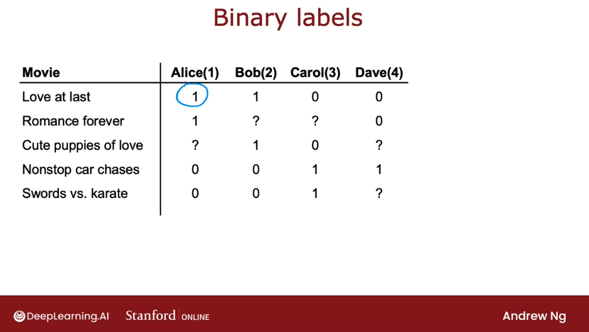

So the question is how can we take the collaborative filtering algorithm that we saw in the last section and get it to work on this dataset? By predicting how likely Alice, Bob, Carol and Dave are to like the items that they have not yet rated, we can then decide how much we should recommend these items to them. 

There are many ways of defining what is the label 1 and what is the label 0, and what is the label question mark in collaborative filtering with binary labels. Let's take a look at a few examples:

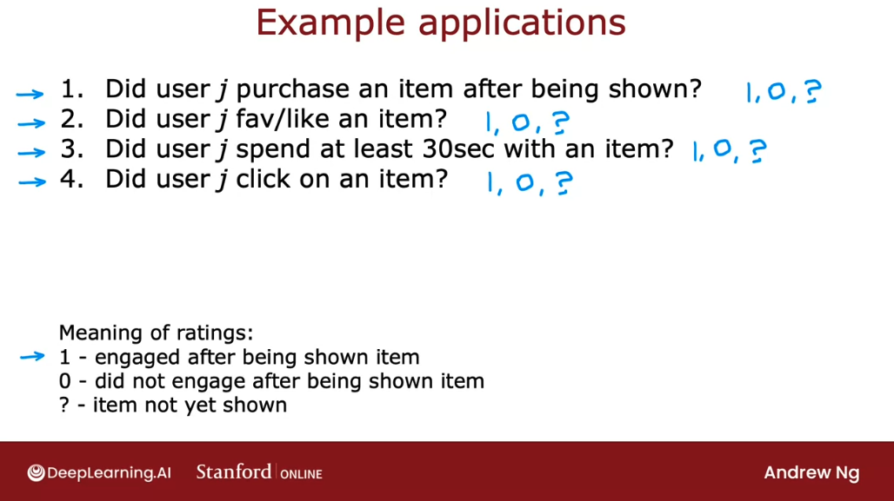

So given these binary labels, let's look at how we can generalize our algorithm which is a lot like linear regression from the previous couple sections to predicting these binary outputs. 

Previously we were predicting label $y^{(i, j)}$ as $w^{(j)} \cdot x^{(i)}+b^{(j)}$. Similar to a linear regression model. 

For binary labels, we're going to predict that the probability of $y^{(i, j)} = 1$, which is given by:

$$ g(w^{(j)} \cdot x^{(i)}+b^{(j)}) \quad\text{where} \space g(z) = \frac{1}{1 + e^{-z}}  $$

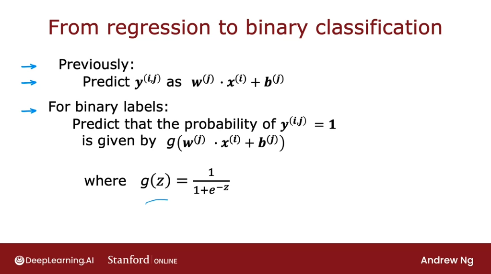

In order to build this algorithm, we'll also have to modify the cost function: from the squared error cost function to the cost function that is more appropriate for binary labels for a logistic-regression-like model. 

So previously, in our cost function the part played a role similar to $f(x)$, the prediction of the algorithm:

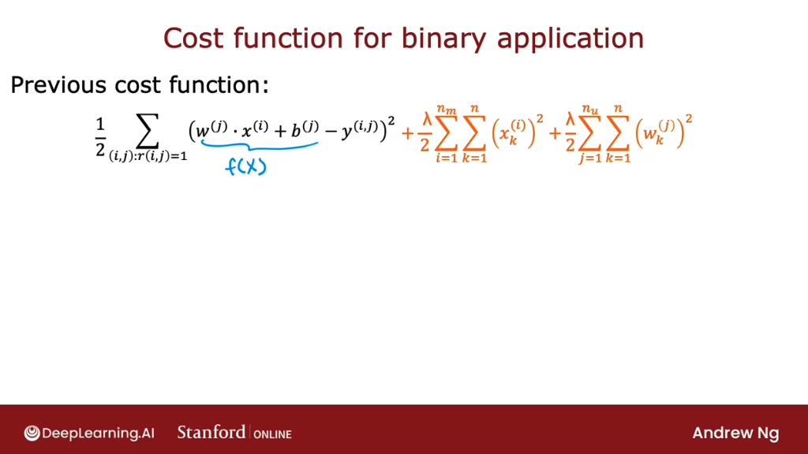

Now have binary labels, $y^{(i, j)}$ when the labels are 1 or 0 or question mark, then the prediction $f(x)$ becomes $g$, the logistic function. 

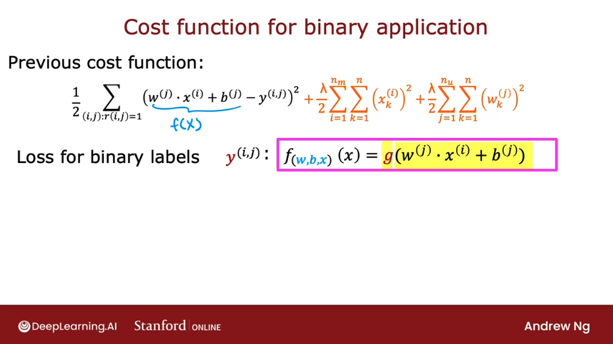

And similar to when we had derived logistic regression, we had written out the following loss function for a single example, which was at the loss if the algorithm predicts $f(x)$ and the true label was $y$, the loss was:

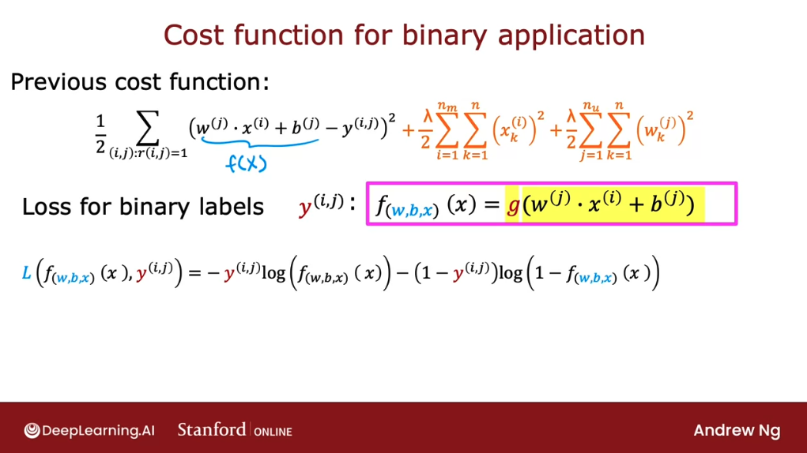

$$ L(f_{(w,b,x)}(x), y^{(i, j)} = - y^{(i, j)} \log [f_{(w,b,x)}(x)] - ( 1 - y^{(i, j)} ) \log (1 - [f_{(w,b,x)}(x)]) $$

This called the binary cross entropy cost function. It's the standard cost function that we used for logistic regression as was for the binary classification problems when we're training neural networks. 

And so to adapt this to the collaborative filtering setting, let's write the cost function which is now a function of all the parameters $w$ and $b$ as well as all the parameters $x$ which are the features of the individual movies. We now need to sum over all the pairs $(i, j)$ where $r(i, j) = 1$:

$$ J(w,b,x) = \sum_{(i,j):r(i,j)=1} L(f(x), y^{(i,j)}) $$
$$ J(w,b,x) = \sum_{(i,j):r(i,j)=1} L(g(w^{(j)} \cdot x^{(i)}+b^{(j)s}), y^{(i,j)}) $$