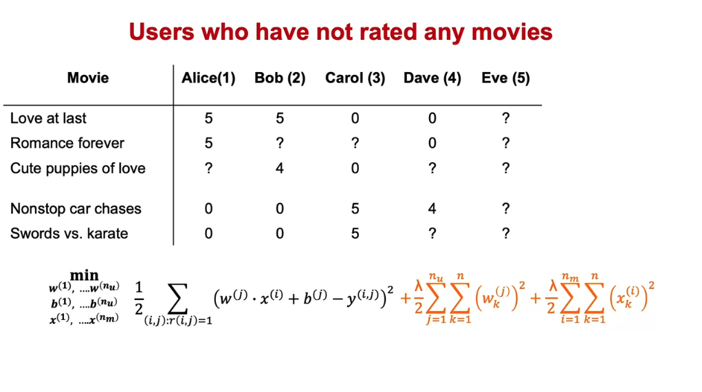
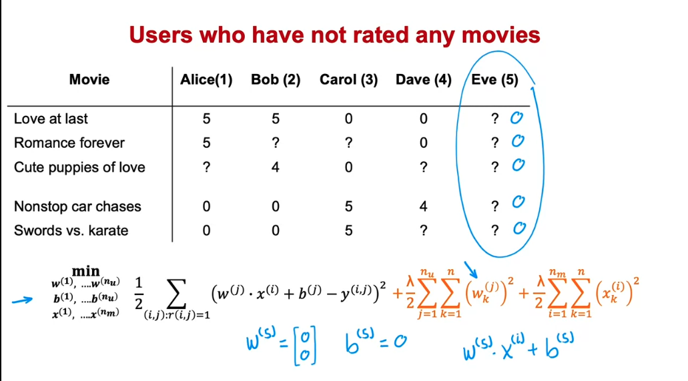
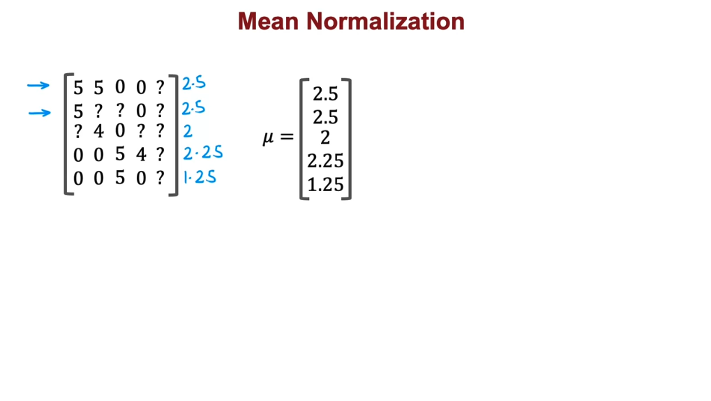
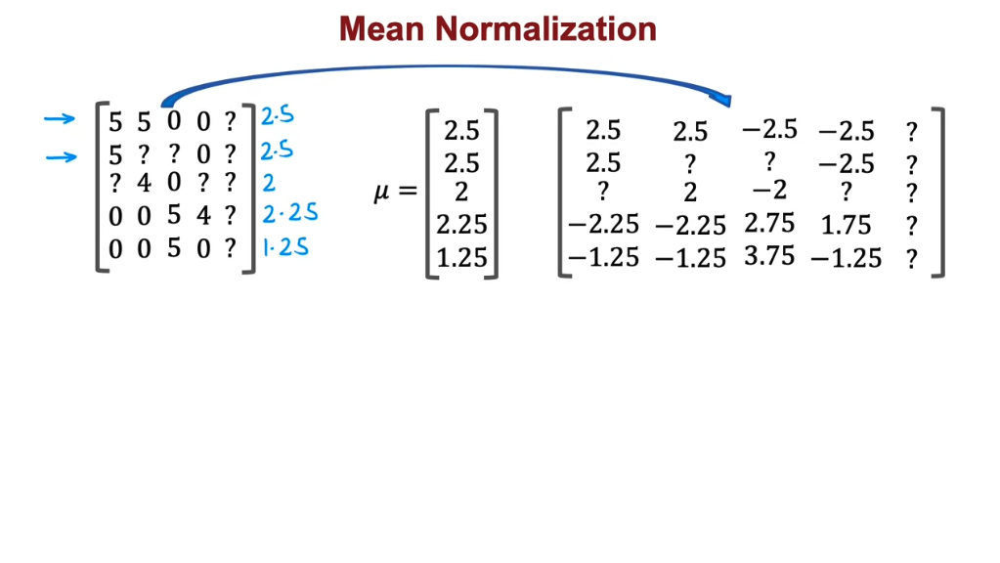
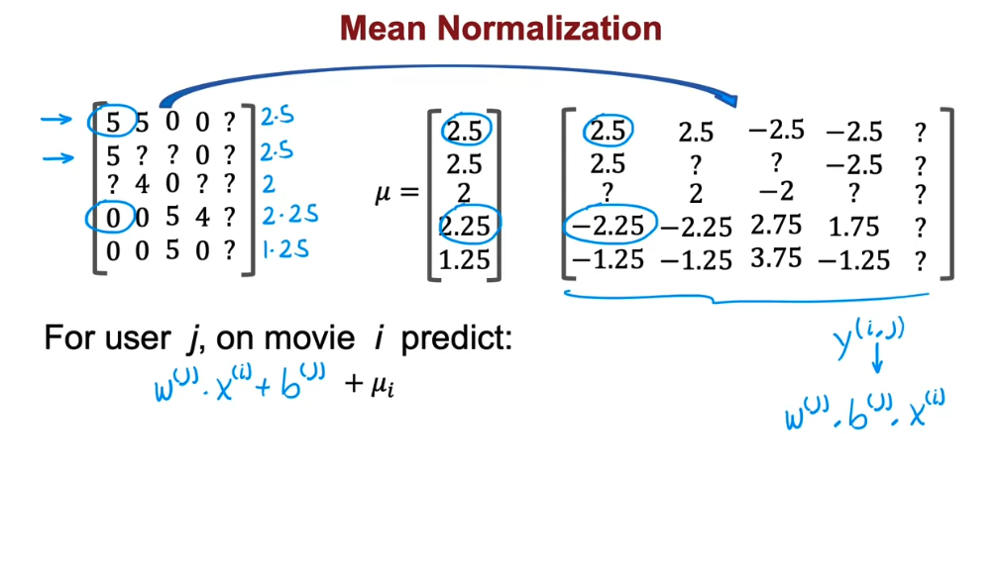
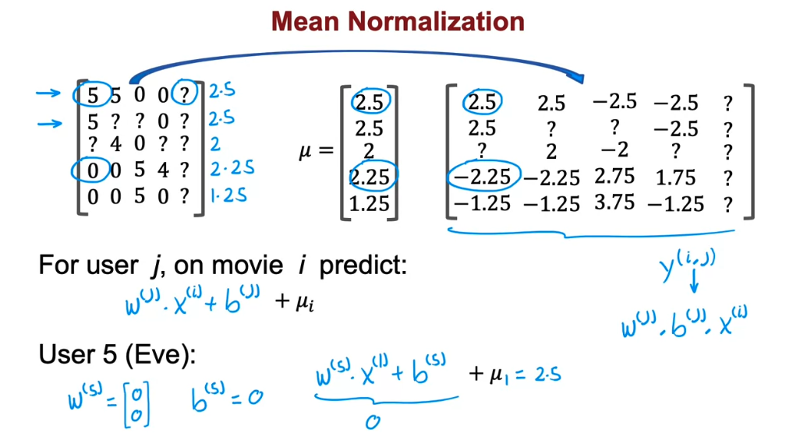
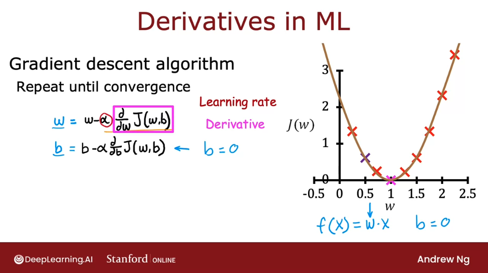
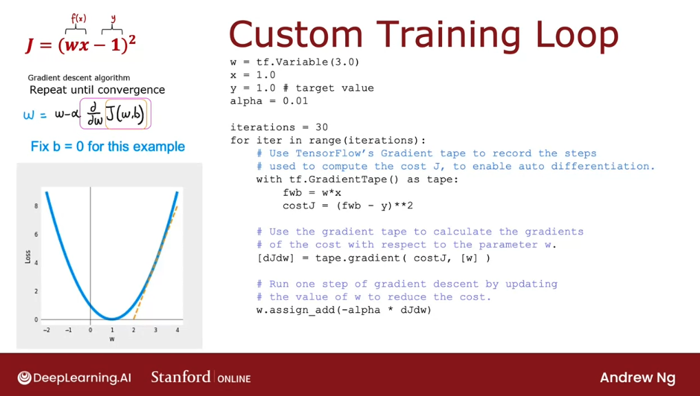
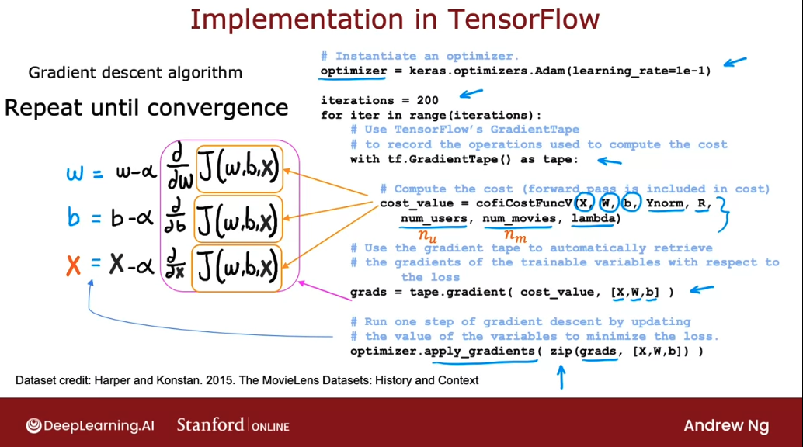
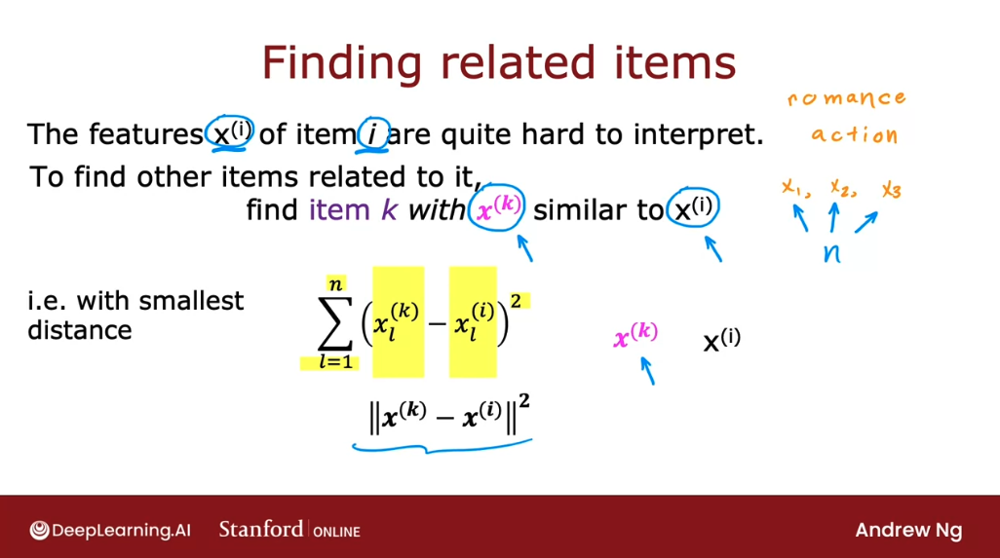

# Recommender systems implementation details

## Mean normalization

Back in the first course, we have seen how for linear regression, feature normalization can help the algorithm run faster. In the case of building a recommender system with numbers such as movie ratings from 1 to 5 stars, **our algorithm will run more efficiently and perform a bit better if we first carry out mean normalization.** That is: **if we normalize the movie ratings to have a consistent average value**.

Let's take a look. Here's the dataset we have been using and cost function we used to learn the parameters for the model:



 In order to explain mean normalization, we're actually going to add fifth user, Eve, who has not yet rated any movies. Adding mean normalization will help the algorithm make better predictions on the user Eve. 

In fact, if we were to train a collaborative filtering algorithm on this data, then because we are trying to make the parameters $w$ small because of the regularization term, if we were to run the algorithm on this dataset, we actually end up with the parameters $w$ for the fifth user, for the user Eve to be equal to $[0  \space 0]$, as well as $b^{(5)} = 0$. 

Because Eve hasn't rated any movies yet, the parameters $w$ and $b$ don't affect the first normalization term in the cost function, because none of Eve's movie's rating play a role in this squared error cost function. And so minimizing this means making the parameters $w$ as small as possible. (We didn't really regularize $b$, but if we initialize $b$ to 0 as the default, we end up with $b^{(5)} = 0$ as well). 

But if $w = [0 \space 0]$ and $b^{(5)} = 0$ are the parameters for user 5, (Eve), then what the algorithm will end up doing is predict that all of Eve's movies ratings would be $w(5) \cdot x^{(i)} + b^{(5)}$.  And this is equal to 0 if $w$ and $b$ above equals 0. **And so this algorithm will predict that if we have a new user that has not yet rated anything, we think they'll rate all movies with zero stars and that's not particularly helpful.**

**Mean normalization will help this algorithm come up with better predictions of the movie ratings for a new user that has not yet rated any movies.**



In order to describe mean normalization, we'll create a matrix with all user-movie ratings and then calculate a new vector $\mu$ that is the average rating of each movie, but only for user which have rated the movie, ignoring question marks:



Now, instead of using the original 0 to 5 star ratings over, we're going to take the averages and subtract from every rating the mean rating that it was given:



And these new values on the right become our new values of $y(i,j)$. So, we're going to pretend that user 1 had given a 2.5 rating to movie 1 and a -2.25 rating to movie 4. 

And using this, we can then learn $w^{(j)}, b^{(j})$ and $x^{(i)}$: in the same way as before, for user $j$ on movie $i$, we would predict $w^{(j)} \cdot x^{(i)} + b^{(j)}$. 

But because we had subtracted off $\mu_i$ for movie $i$ during this mean normalization step, in order to avoid predicting a negative star rating (which is impossible for user rates from 0 to 5 stars), we have to add back this $\mu_i$ which is just the value we have subtracted out.



For example, for Eve:



So this prediction of 2.5 seems more reasonable, as it is more reasonable to think that Eve is likely to rate this movie 2.5 rather than that she will rate all movie zero stars just because she hasn't rated any movies yet. 

And in fact **the effect of this algorithm is it will cause the initial guesses for the new user Eve to be just equal to the mean of whatever other users have rated these five movies.** And that seems more reasonable to take the average rating of the movies rather than to guess that all the ratings by Eve will be zero. 

It turns out that by normalizing the mean of the different movies ratings to be zero, the optimization algorithm for the recommender system will also run just a little bit faster. 

But it does make the algorithm behave much better for users who have rated no movies or very small numbers of movies. And the predictions will become more reasonable. 

In this example, what we did was normalize each of the rows of this matrix to have zero mean and we saw this helps when there's a new user that hasn't rated a lot of movies yet.  But there's one other alternative that we could use which is to instead normalize the columns of this matrix to have zero mean. And that would be a reasonable thing to do too. But I think in this application, normalizing the rows so that we can give reasonable ratings for a new user seems more important than normalizing the columns. 

Normalizing the columns would help if there was a brand new movie that no one has rated yet. But if there's a brand new movie that no one has rated yet, we probably shouldn't show that movie to too many users initially because we don't know that much about that movie. So this is a less helpful scenario than predicting ratings for a new user.


## TensorFlow implementation of collaborative filtering

In this section, we'll take a look at how we can use TensorFlow to implement the collaborative filtering algorithm.



Sometimes computing this derivative or partial derivative term can be difficult. But it turns out that TensorFlow can help with that. Let's see how:



Here we have a cost function $J = (wx - 1)^2$ and the gradient descent algorithm will repeat until convergence the update $ w = w - \alpha \frac{d}{dw}J(w,b) $. 

If we implement the cost function $J$ over here, TensorFlow can automatically compute for us the derivative term and thereby get gradient descent to work.

And the code is:

```py
# Initializes parameter w to 3. 
# This tells TF that w is a parameter that we want to optimized
w = tf.Variable(3.0)
x = 1.0
y = 1.0 # target value
alpha = 0.01

iterations = 30
for iter in range(iterations):
  #Use TensorFlows' Gradient Tape to record the steps
  # used to compute the cost J, to enable auto differentiation
  with tf.GradientTape() as tape:
    fwb = w*x
    costJ = (fwb - y)**2

  # Use the gradient tape to calculate the gradients
  # of the cost with respect to the parameter w. TF will have saved
  # the sequence of operations in the variable tape. We can use the
  # following syntax to calculate the derivatie dJdw
  # TF know that w is the parameter we want to optimize because we defined
  # it as a TF variable at the top, and also pass it to the gradient function below
  [dJdw] = tape.gradient(costJ, [w])

  # Finally, run one step of gradient descent by updating the value of
  # w to reduce the cost. Notice that we need to use the special syntax
  # `assign_add` becuase w is a tf.Variable
  w.assign_add(- alpha * dJdw)
  # Could also be:
  # w.assign(w - alpha * dJdw)
```

Notice that with the gradient tape feature of TensorFlow, the main work we need to do is to tell it how to compute the cost function $J$. And the rest of the syntax causes TensorFlow to automatically figure out for we what is that derivative?.

And with this TensorFlow we'll start with finding the slope of this, at 3, shown by the dashed line. It will take a gradient step and update $w$ and compute the derivative again and update $w$ over and over until eventually it gets to the optimal value of $w$, which is at $w$ equals 1. So this procedure allows we to implement gradient descent without ever having to figure out yourself how to compute this derivative term. 

This is a very powerful feature of TensorFlow called **Auto Diff.** And some other machine learning packages like pytorch also support Auto Diff.

Let's take this and look at how we can implement to collaborative filtering algorithm using Auto Diff. (In fact, once we can compute derivatives automatically, we're not limited to just gradient descent. we can also use a more powerful optimization algorithm, like the Adam optimization algorithm).

In order to implement the collaborative filtering algorithm TensorFlow, this is the syntax we can use:

```py
# Instantiate the Adam optimizer with a learning rate of 0.1
optimizer = tf.keras.optimizers.Adam(learning_rate=0.1)

iterations = 200
for iter in range(iterations):
  with tf.GradientTape() as tape:
    # Compute the cost function J. Recall that in collaborative filtering, the cost 
    # function J takes is input parameters x, w, and b as well as the ratings mean 
    # normalized, R (which specifies which pairs have ratings), number of users,
    # number os movies and lambda
    cost_value = cofiCostFuncV(X, W, b, Ynorm, R, num_users, num_movies, lambda)

  # Use the gradient tape to automatically retrieve the gradients 
  # of the trainable variables with respect to the loss. This will us we 
  # the derivative of the cost function with respect to x, w, and b
  grads = tape.gradient(cost_value, [X, W, b])

  # Update the parameters to minimize the loss (one step of gradient descent)
  optimizer.apply_gradients(zip(grads, [X, W, b]))
```

If we are using gradient descent for collateral filtering, recall that the cost function $J$ would be a function of $w$, $b$ as well as $x$. And if we are applying gradient descent, we take the partial derivative with respect to each of these three, and update them on each step, until convergence:



Maybe your're wondering why we couldn't just use a dense layer and then `model.compiler` and `model fit` like we've done previously?.The reason we couldn't use that old recipe is: **the collateral filtering algorithm and cost function don't neatly fit into the dense layer or the other standard neural network layer types of TensorFlow.**

That's why we had to implement it this other way where we would implement the cost function ourselves. But then use TensorFlow's tools for automatic differentiation (Auto Diff), and use TensorFlow's implementation of the aAdam optimization algorithm to let it do the work for us of optimizing the cost function. 

## Finding related items

How do the websites do recommendations so that when we're looking at one item, it gives us other similar or related items to consider? It turns out the collaborative filtering algorithm gives us a nice way to find related items.



To find item **_k_** with $x^{(k)}$ similar to $x^{(i)}$:

$$ \sum_{l = 1}^{n} (x_l^{(k)} - x_l^{(i)})^2 \space \equiv \space || x_l^{(k)} - x_l^{(i)} ||^2 $$

Before wrapping up this section, I want to mention a few limitations of collaborative filtering:

In collaborative filtering, we have a set of items and the users have rated some subset of items. One of these weaknesses is that is not very good at the cold start problem. For example, if there's a new item in our catalog, (someone's just published a new movie and hardly anyone hit yet), how do we rank the new item if very few users have rated it before? 

Similarly, for new users that have rated only a few items, how can we make sure we show them something reasonable? We could see in an earlier section, how mean normalization can help with this and it does help a lot. But perhaps there's an even better ways to show users that rated very few items, things that are likely to interest them. 

This is called **the cold start problem,** because when we have a new item, there are few users who have rated it, or we have a new user that's rated very few items, the results of collaborative filtering for that item or for that user may not be very accurate. 

The second limitation of **collaborative filtering is it doesn't give we a natural way to use side information or additional information about items or users.**

For example, for a given movie in our catalog, we might know what is the genre of the movie, who had a movie stars, whether it is a studio, what is the budget, and so on. We may have a lot of features about a given movie. Also, for a single user, we may know something about their demographics, such as their age, gender, location. They express preferences, such as if they tell we they like certain movies genres but not other movies genres. If we know the user's IP address, that can tell we a lot about a user's location, and knowing the user's location might also help we guess what might the user be interested in.Or if we know whether the user is accessing our site on a mobile or on a desktop, or if we know what web browser they're using. 