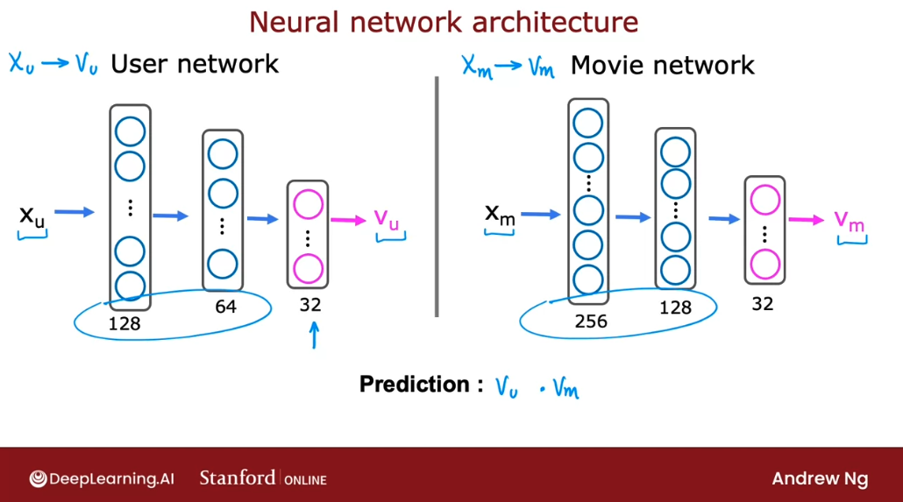
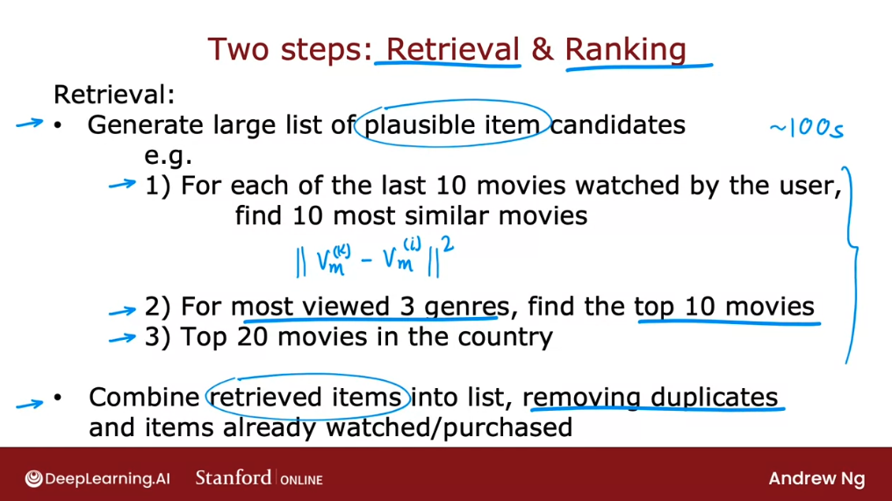
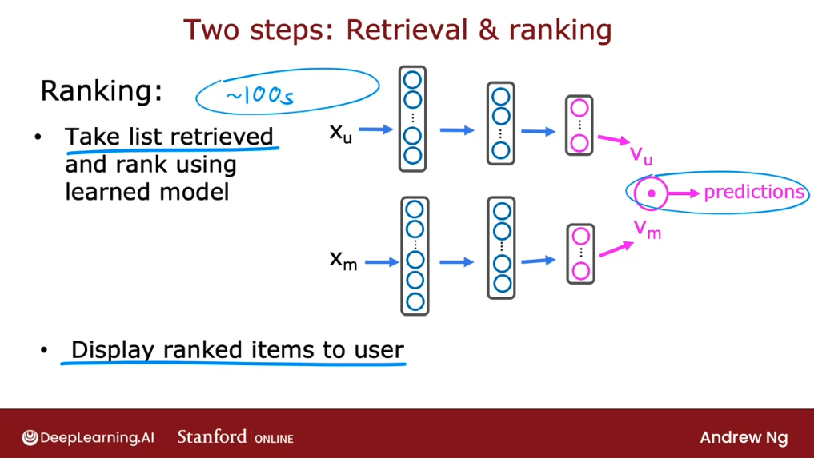

# Content-based filtering

## Collaborative vs. Content-based filtering

In this section, we'll start to develop a second type of recommender system called a **content-based filtering algorithm**. 

Let's compare and contrast the collaborative filtering approach vs this new content-based filtering approach.

- **collaborative filtering**: the general approach is that we would recommend items to users based on ratings of users who gave similar ratings as that user. 

We have some number of users give some ratings for some items, and the algorithm figures out how to use that to recommend new items to we. 

- **content-based filtering**: recommends items to useres based on the features of users and features of the items to find a good match. 

In other words, it requires having some features of each user, as well as some features of each item and it uses those features to try to decide which items and users might be a good match for each other.

With a content-based filtering algorithm, we still have data where users have rated some items. So we will continue to use $r(i, j)$ to denote whether or not user $j$ has rated item $i$ and will continue to use $y(i, j)$ to denote the rating that user $j$ has given item $i$, if it's defined. 


But the key to content-based filtering is that we will be able to make good use of features of the user and of the items to find better matches than potentially a pure collaborative filtering approach might be able to. 

Let's take a look at how this works. In the case of movie recommendations, here are some examples of features:


With features like these we can then come up with:
- a feature vector $x_u^{(j)}$ - for user $j$. 
- a feature vector $x_m^{(i)}$ - for movie $i$.
 
Given features like this, the task is to try to figure out whether a given movie $i$ is going to be good match for user $j$. 

Notice that the user features and movie features can be very different in size. For example, maybe the user features could be 1500 numbers and the movie features could be just 50 numbers. That's okay.


In content-based filtering, we're going to develop an algorithm that learns to match users and movies. Previously, we were predicting the rating of user $j$ on movie $i$ as $w^{(j)} \cdot x^{(i)} + b^{(j)}$. In order to develop content-based filtering, we're going to get rid of $b^{(j)}$. 

It turns out this won't hurt the performance of the content-based filtering at all. Instead, we're going to just replace this notation with $vj_u$, where $v$ stands for a vector, which will be a list of numbers computed for user $j$ and the $u$ subscript here stands for user.


Instead of $x^{(i)}$, we're going to compute a separate vector  withsubscript $m$ that stands for movie $i$r. 

So, $v^{(j)}_u$ as a vector as a list of numbers computed from the features of user $j$ and $v^{(i)}_m$ is a list of numbers computed from the features like the ones we saw on the previous slide of movie $i$. 


If we're able to come up with an appropriate choice of these vectors, $v^{(j)}_u$ and $v^{(i)}_m$, then hopefully **the dot product between these two vectors will be a good prediction of the rating that user $j$ gives movie $i$.** 

Just illustrate what a learning algorithm could come up with:


The challenge is: given features of a user, say $x_u^{(j)}$, how can we compute this vector $v^{(j)}_u$ that represents succinctly or compactly the user's preferences? 

Similarly given features of a movie, how can we compute $v^{(i)}_m$? Notice that whereas $x_u$ and $x_m$ could be different in size, one could be very long lists of numbers, one could be much shorter list, the two $v$ here have to be the same size. Because if we want to take a dot product between $v_u$ and $v_m$, then both of them have to have the same dimensions such as maybe both of these are say 32 numbers. 


So, how do we compute the $v_u$ and $v_m$? Let's take a look at that in the next section. 

## Deep-learning for content-based filtering

A good way to develop a content-based filtering algorithm is to use deep learning. 

The approach we see in this section is the way that many important commercial state-of-the-art content-based filtering algorithms are built today. Let's take a look. 

Recall that in our approach, given a feature vector describing a user, such as age and gender, and country, and so on, we have to compute the vector $v_u$, and similarly, given a vector describing a movie such as year of release, the stars in the movie, and so on, we have to compute a vector $v_m$.


In order to do both, we're going to use a neural network. The first neural network will be what we'll call the user network. Here's an example of user network, that takes as input the list of features of the user, $x_u$, so the age, the gender, the country of the user, and so on, and using a few layers, forming dense neural network layers, it will output this vector $v_u$ that describes the user. 


Notice that in this neural network, the output layer has 32 units, and so $v_u$ is actually a list of 32 numbers. Unlike most of the neural networks that we were using earlier, the final layer is not a layer with one unit, it's a layer with 32 units. 

Similarly, to compute $v_m$ for a movie, we can have a movie network as follows, that takes as input features of the movie and through a few layers of a neural network outputs $v_m$, that vector that describes the movie.


Finally, we'll predict the rating of this user on that movie as $v_u$ dot product $v_m$. Notice that the user network and the movie network can hypothetically have different numbers of hidden layers and different numbers of units per hidden layer but both output layers needs to have the same dimension.



In the description we've seen so far, we were predicting the 1-5 or 0-5 star movie rating. If we had binary labels, if $y$ was to the user like or favor an item, then we can also modify this algorithm to output, instead of $v_u \cdot v_m$, we can apply the sigmoid function to that and use this to predict the probability that $y(i,j)$ is 1:


We can actually draw both neural networks together in a single diagram as if it was a single neural network.  On the upper portion of this diagram, we have the user network which inputs $x_u$ and ends up computing $v_u$. On the lower portion of this diagram, we have what was the movie network, the input is $x_m$ and ends up computing $v_m$, and these two vectors are then dot-product together. 


Now, this model has a lot of parameters. Each of these layers of a neural network has a usual set of parameters of the neural network. How do we train all the parameters of both the user network and the movie network? 

What we're going to do is construct a cost function $J$, which is going to be very similar to the cost function that we saw in collaborative filtering, which is assuming that we do have some data of some users having rated some movies, we're going to sum over all pairs $i$ and $j$ of where we have labels, where i,j equals 1 of the difference between the prediction and the actual value. 

That would be:

$$ J = \sum_{(i,j):r(i, j) = 1} (v_{u}^{(j)} \cdot v_m^{(i)}- {y}^{(i,j)})^2 + \text{NN regularization term}$$


The way we would train this model is: depending on the parameters of the neural network, we end up with different vectors for the users and for the movies. What we'd like to do is train the parameters of the neural network so that we end up with vectors for the users and for the movies that results in small squared error in the predictions we get here. 

To be clear, there's no separate training procedure for the user and movie networks. This expression above is the cost function used to train all the parameters of the user and the movie networks.

We're going to judge the two networks according to how well $v_u$ and $v_m$ predict ${y}^{(i,j)}$, and with this cost function, we're going to use gradient descent or some other optimization algorithm to tune the parameters of the neural network to cause the cost function $J$ to be as small as possible. 

If we want to regularize this model, we can also add the usual neural network regularization term to encourage the neural networks to keep the values of their parameters small. 

It turns out, after we've trained this model, we can also use this to find similar items. This is akin to what we have seen with collaborative filtering features, helping we find similar items as well. Let's take a look. 

- $v_u^{(j)}$ is a vector of length 32 that describes a user $j$ that has features $x_u^{(j)}$.
- $v^{(i)}_m$ is a vector of length 32 that describes a movie with features $x_m^{(i)}$.

Given a specific movie, what if we want to find other movies similar to it? Well, this vector $v^i_m$ describes the movie $i$. If we want to find other movies similar to it, we can then look for other movies $k$ so that the squared distance between the vector describing movie $k$ and the vector describing movie $i$ is small.


This expression plays a role similar to what we had previously with collaborative filtering, where we talked about finding a movie with features $x^k$ that was similar to the features $x^i$. Thus, with this approach, we can also find items similar to a given item. 

This can be pre-computed ahead of time: we can run a compute server overnight to go through the list of all our movies and for every movie, find similar movies to it, so that tomorrow, if a user comes to the website and they're browsing a specific movie, we can already have pre-computed 10 or 20 of the most similar movies to show to the user at that time. The fact that we can pre-compute ahead of time what's similar to a given movie, will turn out to be important later when we talk about scaling up this approach to a very large catalog of movies. That's how we can use deep learning to build a content-based filtering algorithm. 

We mentioned before that one of the benefits of neural networks is that it's easier to take multiple neural networks and put them together to make them work in concert to build a larger system. What we just saw is actually an example of that, where we could take a user network and the movie network and put them together, and then take the inner product of the outputs. 

This ability to put two neural networks together this how we've managed to come up with a more complex architecture that turns out to be quite powerful.

One limitation that the algorithm as we've described it is it can be computationally very expensive to run if we have a large catalog of a lot of different movies we may want to recommend. In the next section, let's take a look at some of the practical issues and how we can modify this algorithm to make it scale that are working on even very large item catalogs. Let's go see that in the next section. 

## Recommending from a large catalogue: Retrieval and ranking

Today's recommender systems will sometimes need to pick a handful of items to recommend, from a catalog of thousands or millions or tens of millions or even more items. How do we do this efficiently computationally? Let's take a look. 

Here's network we've been using to make predictions about how a user might rate an item:


When a user shows up on our website, they have some feature $x_u$. 
But if we need to take thousands of millions of items to feed through this neural network in order to compute which products we should recommend, then having to run neural network inference every time a user shows up on our website becomes computationally infeasible. 

Many law scale recommender systems are implemented as two steps, which are called: **retrieval** and **ranking** steps.

The idea is that during the **retrieval** step will generate a large list of plausible item candidates that tries to cover a lot of possible items we might recommend to the user. 

During the retrieval step, it's acceptable ff we include a lot of items that the user is not likely to like and then during the ranking step will fine tune and pick the best items to recommend to the user.


See the 3 examples of what a re plausible item candidates above.

This would give us an initial set of somewhat plausible movies to recommend to user that just showed up on our website. So this retrieval step can be done very quickly and we may end up with a list of 100 or maybe 100s of plausible movies to recommend to the user. Hopefully this list will recommend some good options. But it's also okay if it includes some options that the user won't like at all. **The goal of the retrieval step is to ensure broad coverage to have enough movies at least have many good ones**.

Finally, we would then take all the items we retrieve during the retrieval step and combine them into a list, r duplicates and removing items that the user has already watched or that the user has already purchased and that we may not want to recommend to them again.



The second step of this is then the **ranking** step. 

During the ranking step we will take the list retrieved during the retrieval step and rank them using the learned model.

That means is we will feed the user feature vector and the movie feature vector into this neural network and for each of the user movie pairs compute the predicted rating. And based on this, we now have all for each of the 100 plus movies -the ones that the user is most likely to give a high rating to- in a ranked list that we can then just display to the user depending on what we think the user will give the highest rating to.



One additional optimization is that if we have computed $v_m$, for all the movies in advance, then all we need to do is to compute $v_u$ once. And then take that $v_u$ we just computed for the user on our website right now and take the dot product between it and $v_m$.So this computation can be done relatively quickly. 

One of the decisions we need to make for this algorithm is how many items do we want to retrieve during the retrieval step, to feed into the more accurate ranking step?


During the retrieval step, retrieving more items will tend to result in better performance. But the algorithm will end up being slower.

To analyze or to optimize the trade off between how many items to retrieve to retrieve 100 or 500 or 1000s of items, I would recommend carrying out offline experiments to see how much retrieving additional items results in more relevant recommendations. 

And, in particular, if the estimated probability that $y(i, j) = 1$ according to our neural network model, if only we were to retrieve say 500 items instead of only 100 items, then that would argue for maybe retrieving more items, even if it slows down the algorithm a bit. 

But with the separate retrieval step and the ranking step, this allows many recommender systems today to give both fast as well as accurate results. Because the retrieval step tries to prune out a lot of items that are just not worth doing a more detailed inference on. And then the ranking step makes a more careful prediction for what are the items that the user is actually likely to enjoy.
​
## TensorFlow implementation of content-based filtering

In the practice lab, we see how to implement content-based filtering in TensorFlow. Let's take a look. 

Recall that our code has started with a user network as well as a movie that's work. 

The way we can implement this in TensorFlow is, it's very similar to how we have previously implemented a neural network with a set of dense layers. We're going to use a sequential model. We then in this example have two dense layers with the number of hidden units specified here, and the final layer has 32 units and outputs 32 numbers. 


Then for the movie network, we're going to call it the item network, because the movies are the items here, this is what the code looks like. Once again, we have dense hidden layers, followed by this layer, which outputs 32 numbers. For the hidden layers, we'll use our default choice of activation function, which is the relu activation function.


Next, we need to tell TensorFlow/Keras how to feed the user features or the item features two neural networks. This is the syntax for doing so:


First we extract out the input features for the user and then feed it to the user and that we had defined to compute $v_u$, the vector for the user. 

Then one additional step that turns out to make this algorithm work a bit better is the line:
```
vu = tf.linalg.l2_normalize(vu, axis=1)
```
which normalizes the vector $v_u$ to have length one. This normalizes the length, also called the l2 norm, but basically the length of the vector vu to be equal to one. Then we do the same thing for the item network, for the movie network. 


After having computed $v_u$ and $v_u$, we then have to take the dot product between these two vectors. And this is the syntax for doing so in Keras, which has a special layer type, that just takes a dot product between two numbers.

```
output = tf.keras.layers.Dot(axis=1)([v_u, v_m])
```

This gives the output of the neural network. This gives the final prediction. 

Finally, to tell keras what are the inputs and outputs of the model, this line tells it that the overall model is a model with inputs being the user features and the movie or the item features and the output is what we just defined up above:

```
model = Model([input_user, input_item], output)
```
The cost function that we'll use to train this model is going to be the mean squared error cost function:
```
cost_fn = tf.keras.losses.MeanSquaredError()
```