# Reinforcement Learning introduction

## What is Reinforcement Learning? 

In machine learning, reinforcement learning is one of those ideas that, while not very widely applied in commercial applications today, is one of the pillars of machine learning. And it has lots of exciting research backing it up and improving it every single day. 

So let's start by taking a look at what is reinforcement learning. 

Let's start with an example. Here's a picture of an autonomous helicopter:

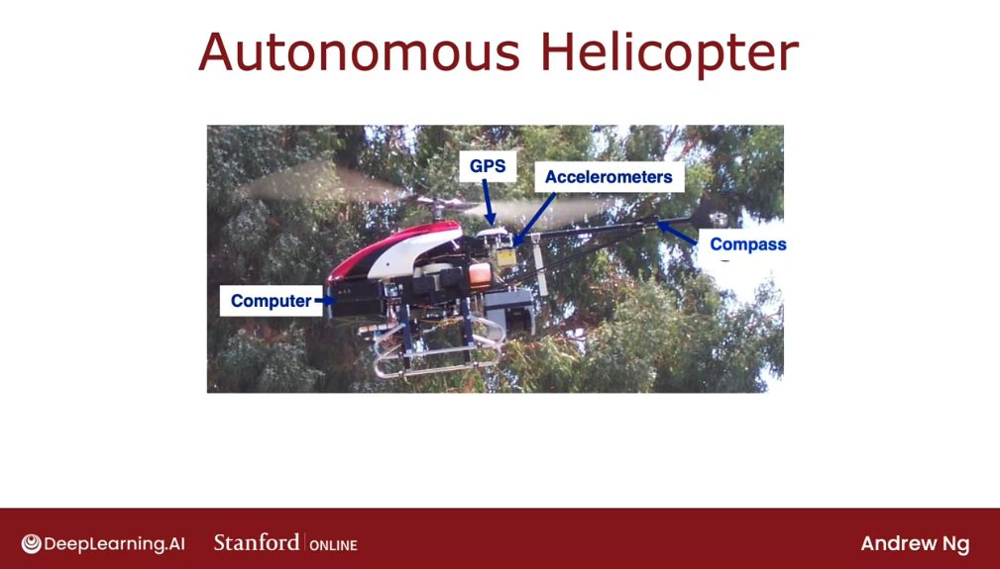

This is actually the Stanford autonomous helicopter, weighs 32 pounds. Like many other autonomous helicopters, it's instrumented with an onboard computer, GPS, accelerometers, and gyroscopes and the magnetic compass so it knows where it is at all times quite accurately. 

If we were to have the keys to this helicopter and ask ourself to write a program to fly it, how would we do so? 

Hw do we write a program to do this automatically, to keep an helicopter balanced in the air? How do we get a helicopter to fly itself using reinforcement learning? 

The task is: given the position of the helicopter, decide how to move the control sticks. 

In reinforcement learning, we call the position and orientation and speed and so on of the helicopter the state $s$. And so the task is to find a function that maps from the state $s$ of the helicopter to an action $a$, meaning how far to push the two control sticks in order to keep the helicopter balanced in the air and flying and without crashing.

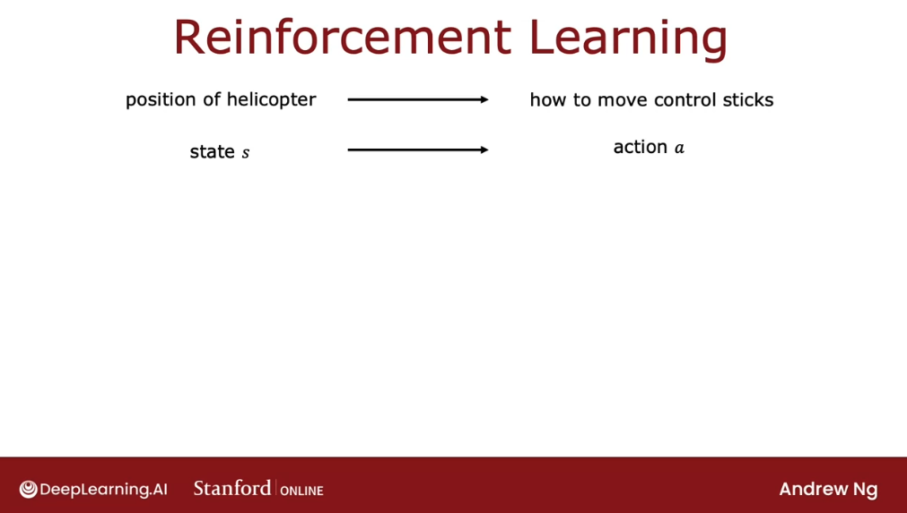

One (incorrect) way we could attempt this problem is to use supervised learning. If we could get a bunch of observations of states and maybe have an expert human pilot tell us what's the best action $y$ to take. We could then train a neural network using supervised learning to directly learn the mapping from the states $s$ which we're calling $x$ here, to an action a which we're calling the label $y$ here. 

But it turns out that when the helicopter is moving through the air is actually very ambiguous to decide what is the exact one right action to take. Do we tilt a bit to the left or a lot more to the left or increase the helicopter stress a little bit or a lot? It's actually very difficult to get a data set of $x$ and the ideal action $y$. 

So that's why for a lot of task of controlling a robot like a helicopter and other robots, the supervised learning approach doesn't work well and we instead use reinforcement learning.

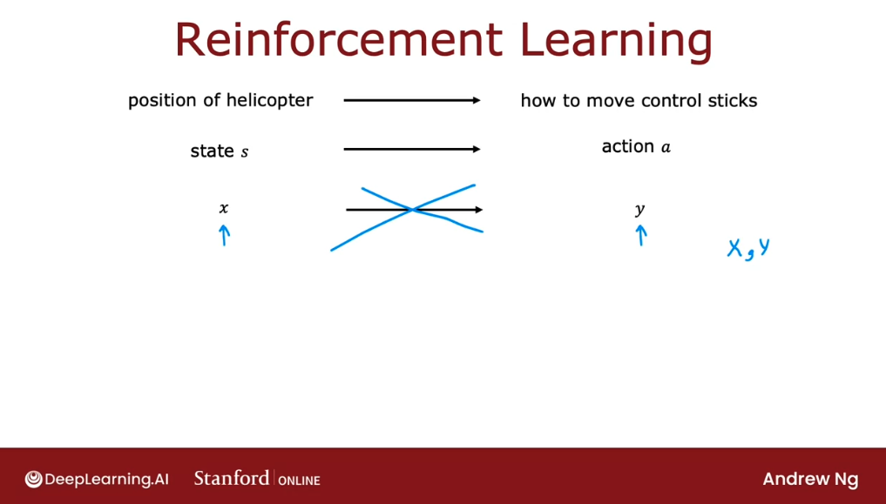

Now a key input to a reinforcement learning is something called **the reward or the reward function** which tells the helicopter when it's doing well and when it's doing poorly. 

We can think of the reward function is a bit like training a dog. How do we get a puppy to behave well? We can't demonstrate that much to the puppy; instead we let it do its thing and whenever it does something good, we go, "good dog". And whenever they did something bad, we go, "bad dog". And then hopefully it learns by itself based on these reactions. 

So training with the reinforcement learning algorithm is like that. When the helicopter's flying well, we go, "good helicopter" and if it does something bad like crash, we go, "bad helicopter". And then it's the reinforcement learning algorithm's job to figure out how to get more of the good helicopter and fewer of the bad helicopter outcomes. 

**Specifying the reward function rather than the optimal action gives we a lot more flexibility in how we design the system.** 

Concretely for flying the helicopter, whenever it is flying well, we may give it a reward of plus one (+1) every second it is flying well. 

And whenever it's flying poorly we may give it a negative reward or if it ever crashes, we may give it a very large negative reward like negative 1000. 

This would incentivize the helicopter to spend a lot more time flying well and hopefully to never crash. 

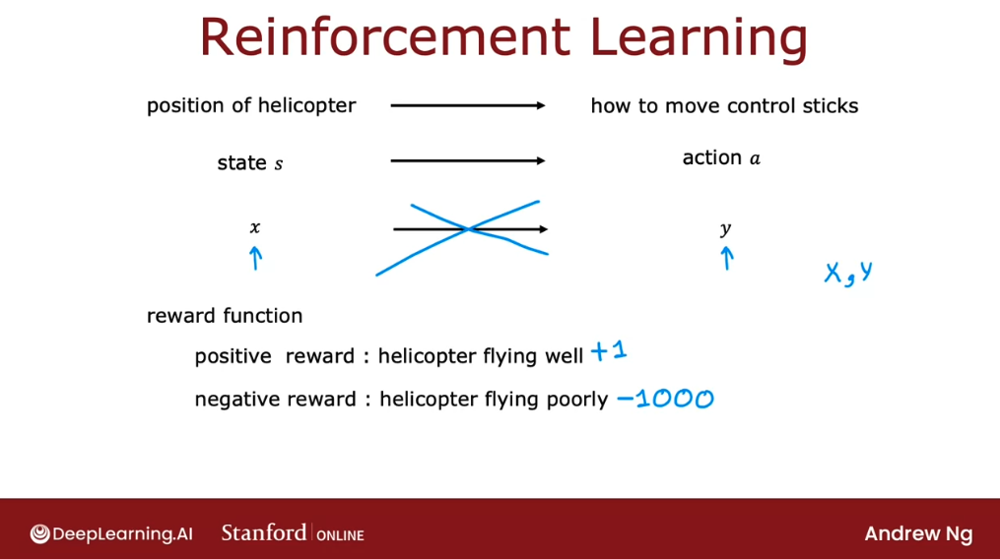

Also: when training a robot dog to walk to a certain point, we might not have any idea what it takes to program a dog like that. Even though we might not know how to tell it what's the best way to place its legs to get over a given obstacle, all of these things were figured out automatically by the robot just by giving it rewards that incentivizes it, making progress toward the goal on the left of the screen. 

Applications of reinforcement learning:

- Controlling robots
- Factory optimization
- Financial (stock) trading
- Playing games (including video games)

So, **the key idea is: rather than we needing to tell the algorithm what is the right output $y$ for every single input $x$, all we have to do instead is specify a reward function that tells it when it's doing well and when it's doing poorly. And it's the job of the algorithm to automatically figure out how to choose good actions.** 

## Mars Rover example

We'll develop reinforcement learning using a simplified example inspired by the Mars rover. 

In this application, the rover can be in any of six positions, as shown by the six boxes here. The rover, it might start off, say, in disposition into fourth box shown here. The position of the Mars rover is called the **state** in reinforcement learning, and we're going to call these six states, state 1, state 2, state 3, state 4, state 5, and state 6, and so the rover is starting off in state 4.

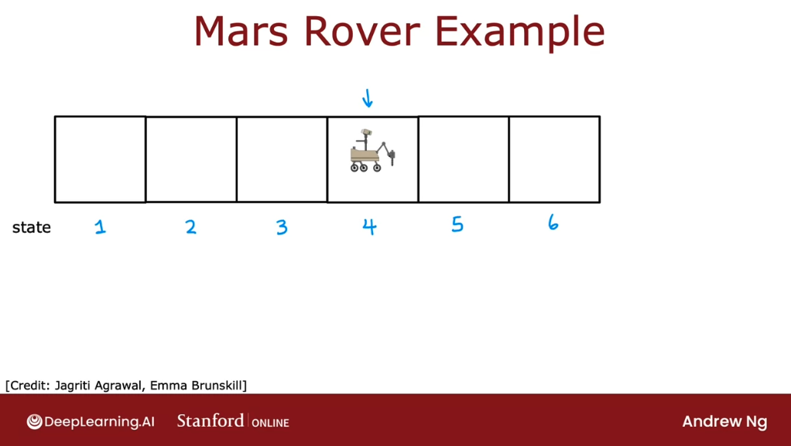

Now the rover was sent to Mars to try to carry out different science missions. It can go to different places to use its sensors such as a drill, or a radar, or a spectrometer to analyze the rock at different places on the planet, or go to different places to take interesting pictures for scientists on Earth to look at. 

In this example, state 1 here on the left has a very interesting surface that scientists would love for the rover to sample. 

State 6 also has a pretty interesting surface that scientists would quite like the rover to sample, but not as interesting as state 1. We would more likely to carry out the science mission at state 1 than at state 6, but state 1 is further away. 

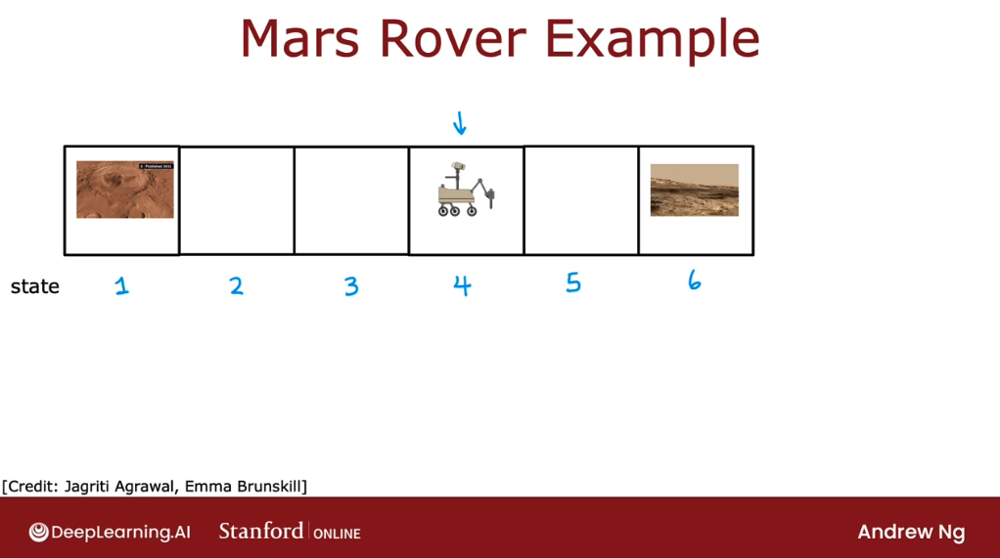

The way we will reflect state 1 being potentially more valuable is through the **reward** function. The reward at state 1 is a 100, and the reward at stage 6 is 40, and the rewards at all of the other states in-between, are going to be zero because there's not as much interesting science to be done at these states 2, 3, 4, and 5. 

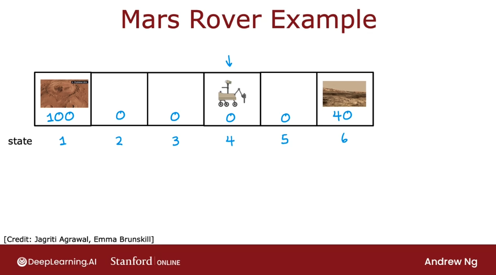 

On each step, the rover gets to choose one of two actions. It can either go to the left or it can go to the right. 

The question is, what should the rover do? 

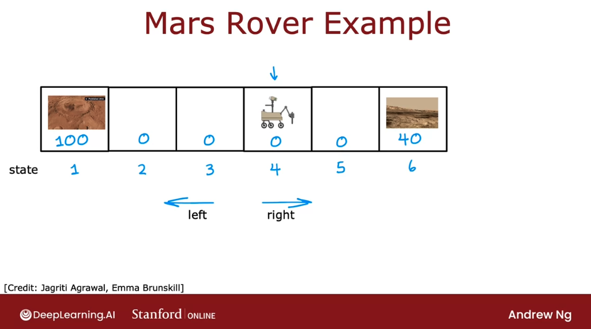

In reinforcement learning, we pay a lot of attention to the rewards because that's how we know if the robot is doing well or poorly. Let's look at some examples of what might happen if the robot was to go left, starting from state 4. 

So, initially starting from state 4, it will receive a reward of zero, and after going left, it gets to state 3, where it receives again a reward of zero. Then it gets to state 2, receives the reward is 0, and finally just to state 1, where it receives a reward of 100. 

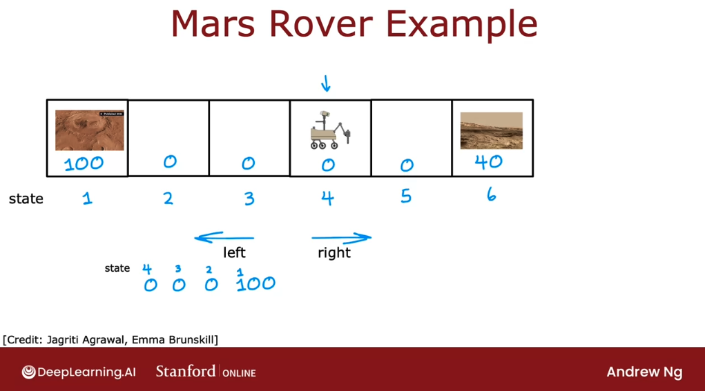

For this application, we're going to assume that when it gets either state 1 or state 6, that the day ends. 

In reinforcement learning, we call this a **terminal state**, and what that means is that, after it gets to one of these terminals states, gets a reward at that state, but then nothing happens after that. Maybe the robots run out of fuel or ran out of time for the day, which is why it only gets to either enjoy the 100 or the 40 reward, but then that's it for the day. **It doesn't get to earn additional rewards after that.**

Now instead of going left, the robot could also choose to go to the right, in which case from state 4, it would first have a reward of zero, and then it'll move right and get to state 5, have another reward of zero, and then it will get to this other terminal state on the right, state 6 and get a reward of 40. 

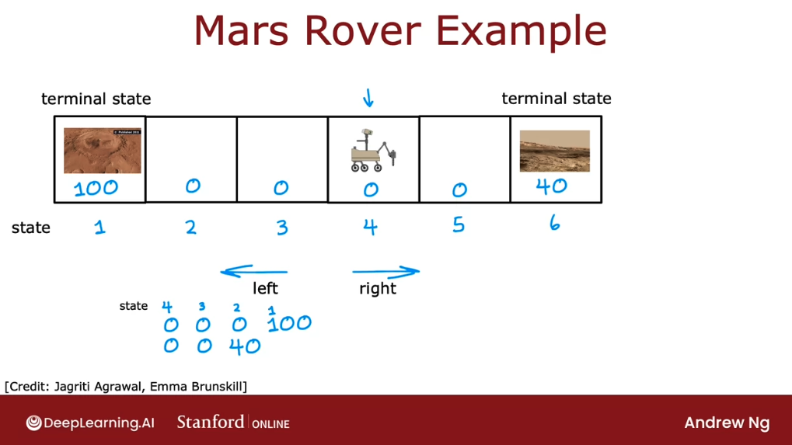

But going left and going right are the only options. One thing the robot could do is: it can start from state 4 and decide to move to the right. It goes from state 4 to 5, gets a reward of zero in state 4 and a reward of zero in state 5, and then maybe it changes its mind and decides to start going to the left as follows, in which case, it will get a reward of zero at state 4, at state 3, at state 2, and then the reward of 100 when it gets to state 1. In this sequence of actions and states, the robot is wasting a bit of time. So this maybe isn't such a great way to take actions, but it is one choice that the algorithm could pick, but hopefully we won't pick this one.

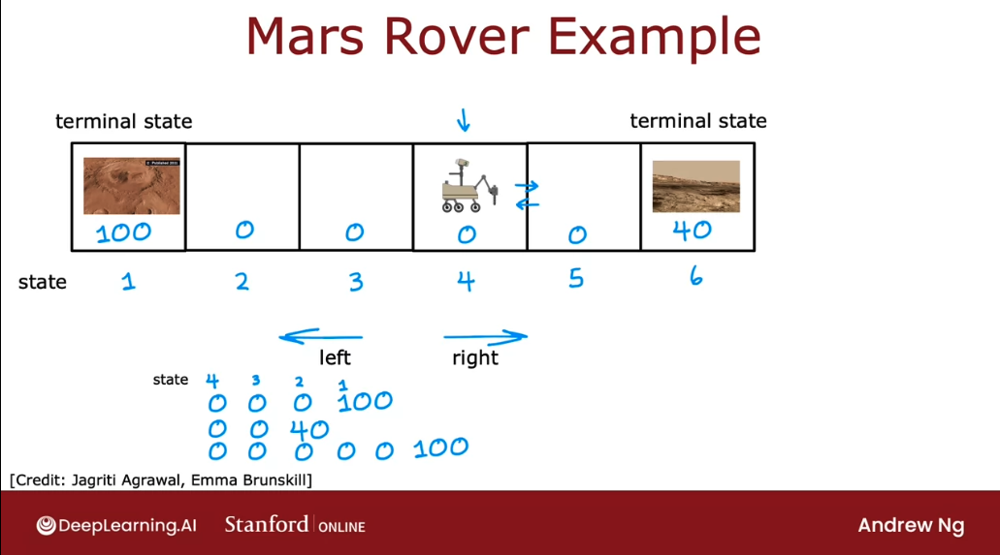

To summarize, at every time step, the robot is in some **state**, which we call $s$, and it gets to choose an action $a$, and it also enjoys some reward $R(s)$ that it gets from that state. And, as a result of this action, it gets to some new state $s'$. 

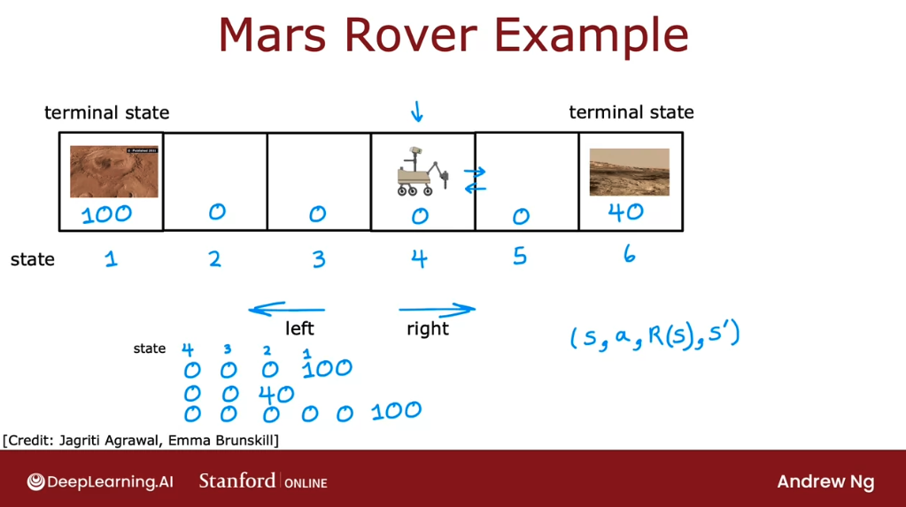

As a concrete example, when the robot was in state 4 and it took the action, go left, maybe didn't enjoy the reward of zero associated with that state 4 and it won't have any new state 3. 

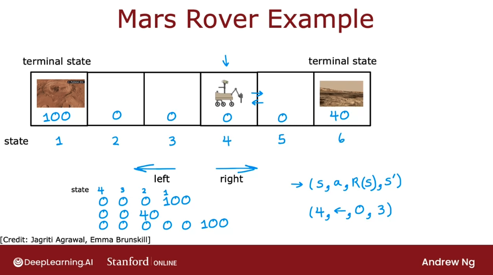

Just for clarity, the reward here, $R(s)$, this is the reward associated with the original state, not the new state $s'$. This reward of zero is associated with state 4 rather than with state 3. 

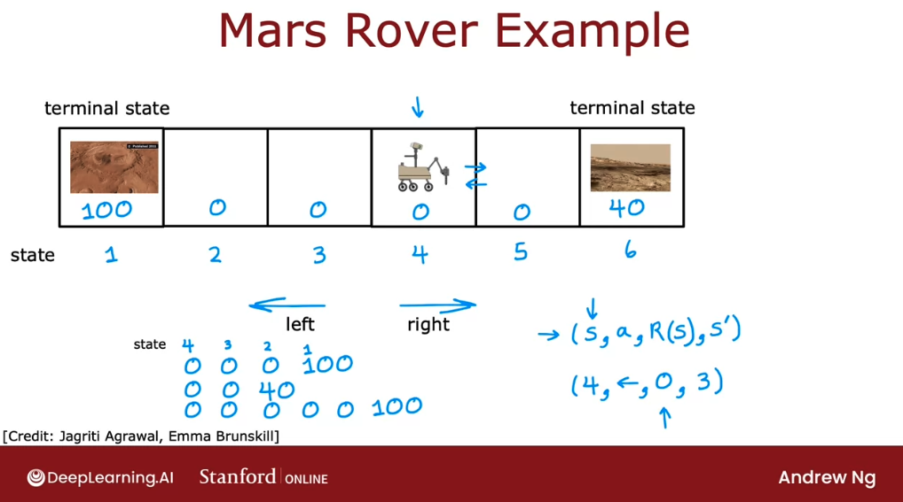

## The Return in reinforcement learning

we saw in the last section, what are the states of reinforcement learning application, as well as how depending on the actions we take we go through different states, and also get to enjoy different rewards. But **how do we know if a particular set of rewards is better or worse than a different set of rewards?** 

The **return** in reinforcement learning, which we'll define in this section, allows us to capture that. 

As we go through this, one analogy that we might find helpful is if we imagine we have a five-dollar bill at our feet, we can reach down and pick up, or half an hour across town, we can walk half an hour and pick up a 10-dollar bill. Which one would we rather go after? 

Ten dollars is much better than five dollars, but if we need to walk for half an hour to go and get that 10-dollar bill, then maybe it'd be more convenient to just pick up the five-dollar bill instead. 

**The concept of a return captures that rewards we can get quicker are maybe more attractive than rewards that take we a long time to get to.** Let's take a look at exactly how that works. 

Here's a Mars Rover example. If starting from state 4 we go to the left, we saw that the rewards we get would be zero on the first step from state 4, zero from state 3, zero from state 2, and then 100 at state 1, the terminal state. 

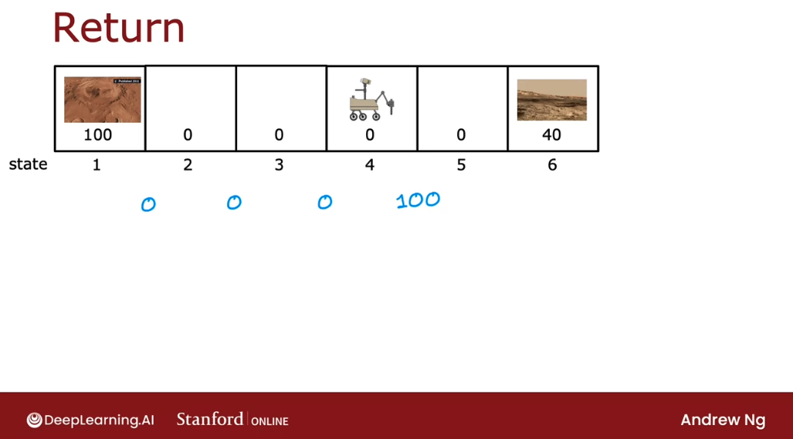

The return is defined as **the sum of these rewards but weighted by one additional factor, which is called the discount factor.** 

The discount factor is a number a little bit less than 1. We woll pick 0.9 as the discount factor, and we're going to weight the reward in the first step as just zero, the reward in the second step is a discount factor, 0.9 times that reward, and then plus the discount factor squared times that reward, and then plus the discount factor cubed times that reward. 

If we calculate this out, this turns out to be 0.729 times 100, which is 72.9. 

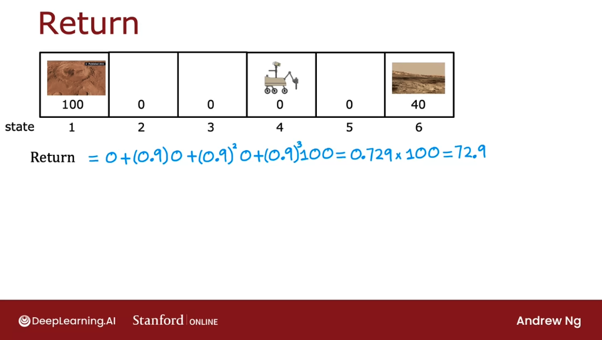

The more general formula for the return is that if our robot goes through some sequence of states and gets reward $R_1$ on the first step, and $R_2$ on the second step, and $R_3$ on the third step, and so on, then the return is $R_1$ plus the discount factor $\gamma$, the Greek alphabet letter **gamma** (which we've set to 0.9 in this example), the $\gamma$ times $R_2$ plus $\gamma$^2 times $R_3$ plus $\gamma$^3 times $R_4$, and so on, until we get to the terminal state. 

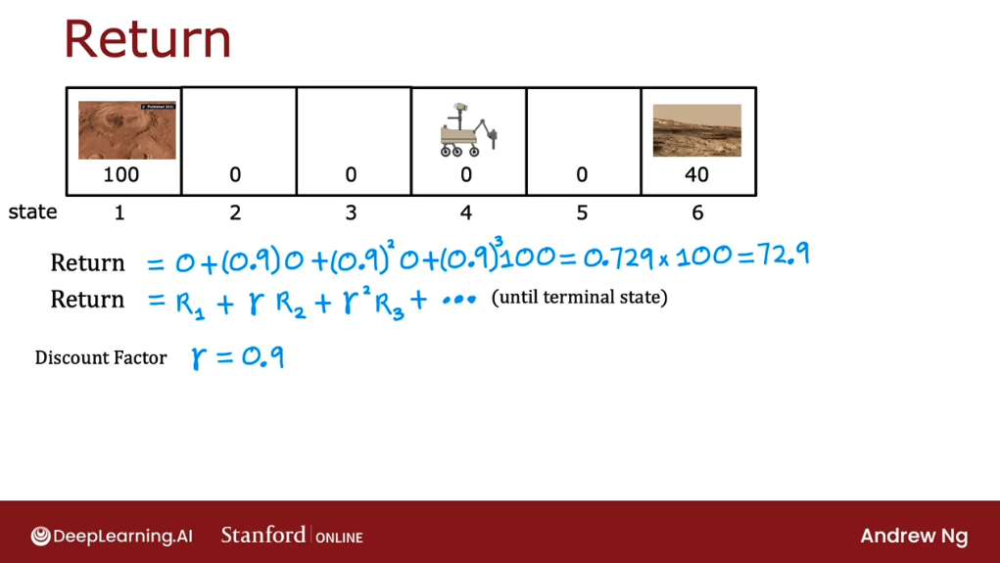

What the discount factor $\gamma$ does is it has the effect of making the reinforcement learning algorithm a little bit impatient, because the return gives full credit to the first reward (we see it is 1 times $R_1), but then it gives a little bit less credit to the reward we get at the second step, which is multiplied by 0.9, and then even less credit to the reward we get at the next time step $R_3$, and so on.

So, getting rewards sooner results in a higher value for the total return. In many reinforcement learning algorithms, a common choice for the discount factor will be a number pretty close to 1, like 0.9, or 0.99, or even 0.999. But for illustrative purposes in the running example we're going to use, we're actually going to use a discount factor of 0.5. 

This very heavily down weights or very heavily discounts rewards in the future, because with every additional passing timestamp, we get only half as much credit as rewards that we would have gotten one step earlier. 

If $\gamma$ were equal to 0.5, the return under the example above would have been 0 plus 0.5 times 0, plus 0.5^2 0 plus 0.5^3 times 100. That's lost reward because state 1 to terminal state, and this turns out to be a return of 12.5.

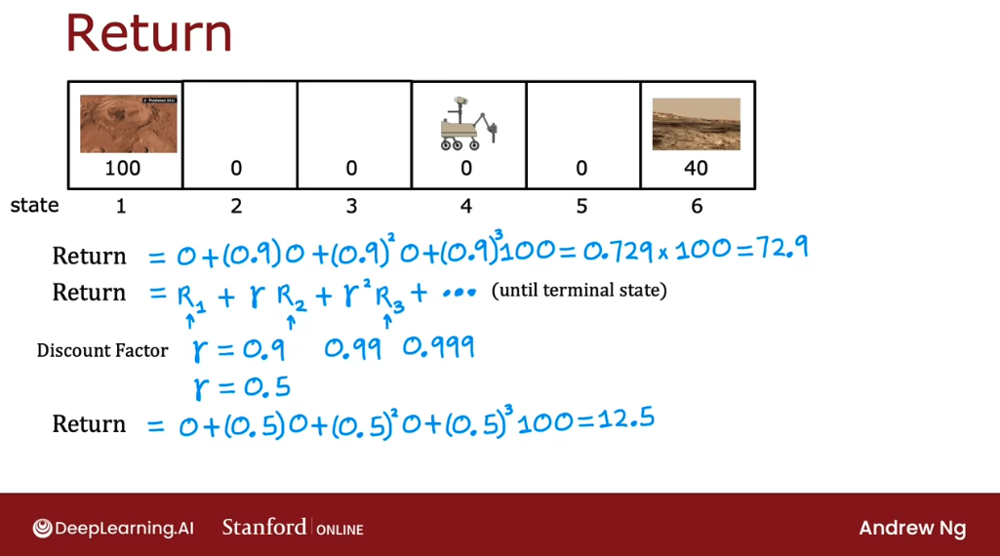

In financial applications, **the discount factor also has a very natural interpretation of being the interest rate or the time value of money.** If we can have a dollar today, that will be worth a little bit more than if we could only get a dollar in the future. Because a dollar today we can put in the bank, earn some interest, and end up with a little bit more money a year from now. 

For financial applications, often, that discount factor represents how much less is a dollar in the future than compared to a dollar today. 

Let's look at some concrete examples of returns. The return we get depends on the rewards, and the rewards depends on the actions we take, and so the return depends on the actions we take. 

Let's use our usual example and say for this example, we're going to always go to the left. We already saw previously that if the robot were to start off in state 4, the return is 12.5 as we worked out before. 

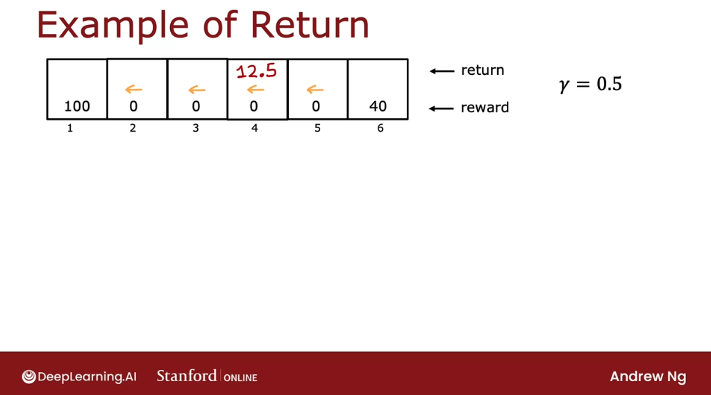

If it were to start off in position 3, the return would be 25 because it gets to the 100 reward one step sooner, and so it's discounted less.

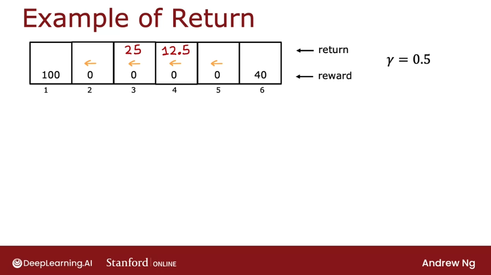

If it were to start off in state 2, the return would be 50. If it were to just start off and state 1, well, it gets the reward of 100 right away, so it's not discounted at all. The return if we were to start out in state 1 will be 100.

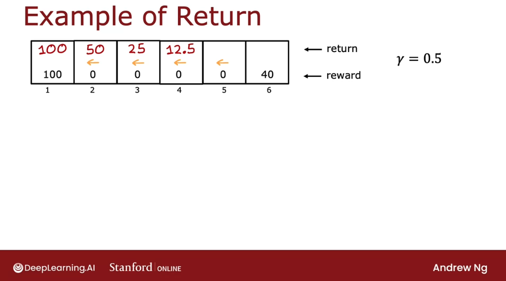

Then the return starting from position 5 would be 6.25. 

If we start off in state 6, which is terminal state, we just get the reward and thus the return is 40.

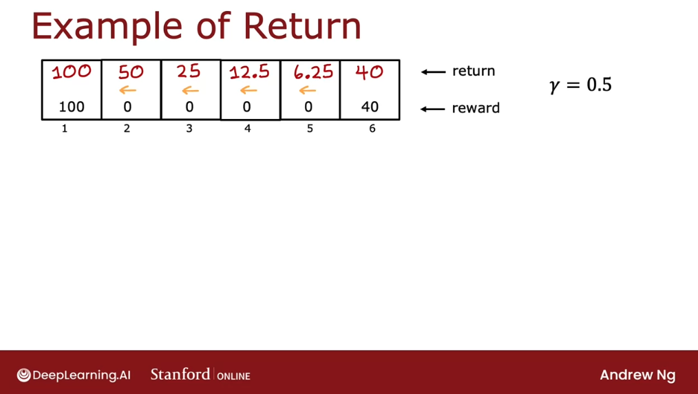

Now, if we were to take a different set of actions, the returns would actually be different. For example, if we were to always go to the right, if those were our actions, then we would have the following returns:

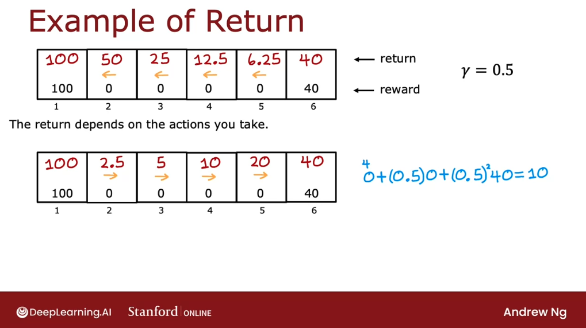

We see that if we always go to the right, the return we expect to get is lower for most states, than if we always went to the left.

Maybe always going to the right isn't as good an idea as always going to the left. But it turns out that we don't have to always go to the left or always go to the right. We can take a separate and distinct action based on the state we are in.

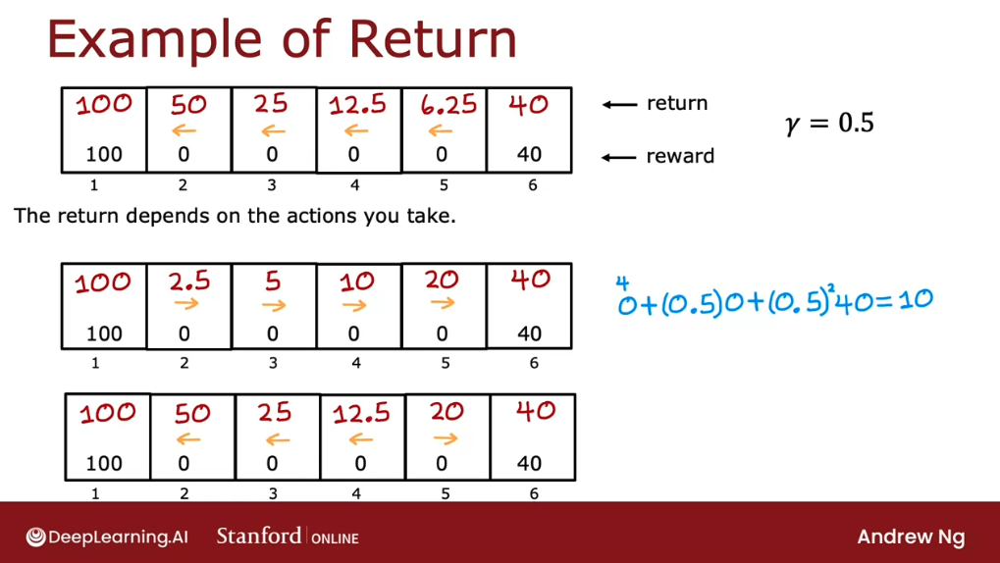

To summarize, **the return in reinforcement learning is the sum of the rewards that the system gets, weighted by the discount factor, where rewards in the far future are weighted by the discount factor raised to a higher power.**

Now, this actually has an interesting effect **when we have systems with negative rewards.** In the example we went through, all the rewards were zero or positive. **If there are any rewards are negative, then the discount factor actually incentivizes the system to push out the negative rewards as far into the future as possible.** 

Taking a financial example, if we had to pay someone $10, we could give that a negative reward of minus 10. But if we could postpone payment by a few years, then we're actually better off because $10 a few years from now, because of the interest rate is actually worth less than $10 that we had to pay today. 

So, for systems with negative rewards, it causes the algorithm to try to push out the make the rewards as far into the future as possible. For financial applications and for other applications, that actually turns out to be right thing for the system to do.

## Making decisions: Policies in reinforcement learning

Let's formalize how a reinforcement learning algorithm picks actions. In this section, we'll learn about what is a **policy** in reinforcement learning algorithm. Let's take a look. 

As we've seen, there are many different ways that we can take actions in the reinforcement learning problem. A couple of possibilites:

- **always go for the nearer reward**: so we go left if this leftmost reward is nearer or go right if this rightmost reward is nearer. 

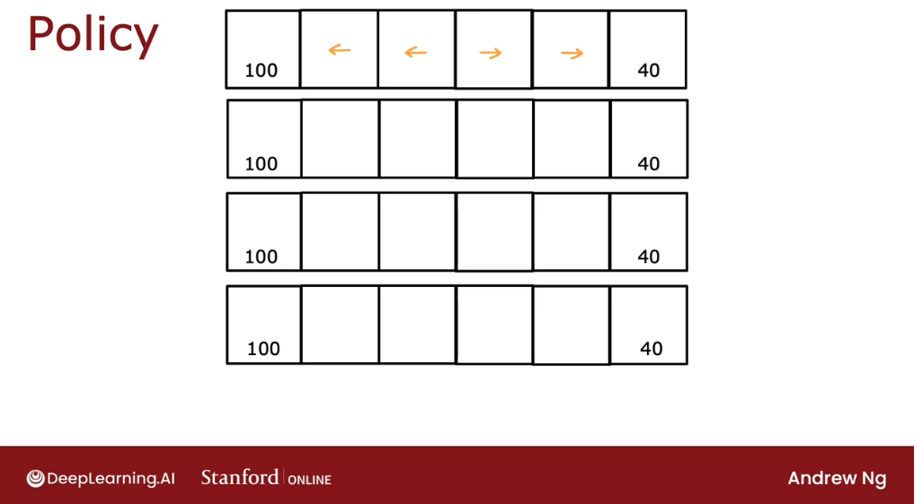

- **always go for the larger reward** or **always go for the smaller reward** (even though this wouldn't be a good idea)

- **always go left unless we're just one step away from the lesser reward, in which case, we go for that one.**

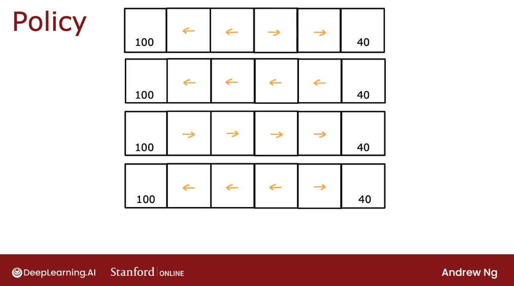

In reinforcement learning, our goal is to come up with a function which is called a **policy $\pi$**, whose job it is to take as input any state $s$ and map it to some action $a$ that it wants us to take. 

$$ \pi(s) = a$$

For example, for the last policy shown here, this policy would say that if we're in state 2, then it maps us to the left action. If we're in state 3, the policy says go left. If we are in state 4 also go left and if we're in state 5, go right. $\pi$ applied to state $s$, tells us what action it wants us to take in that state.

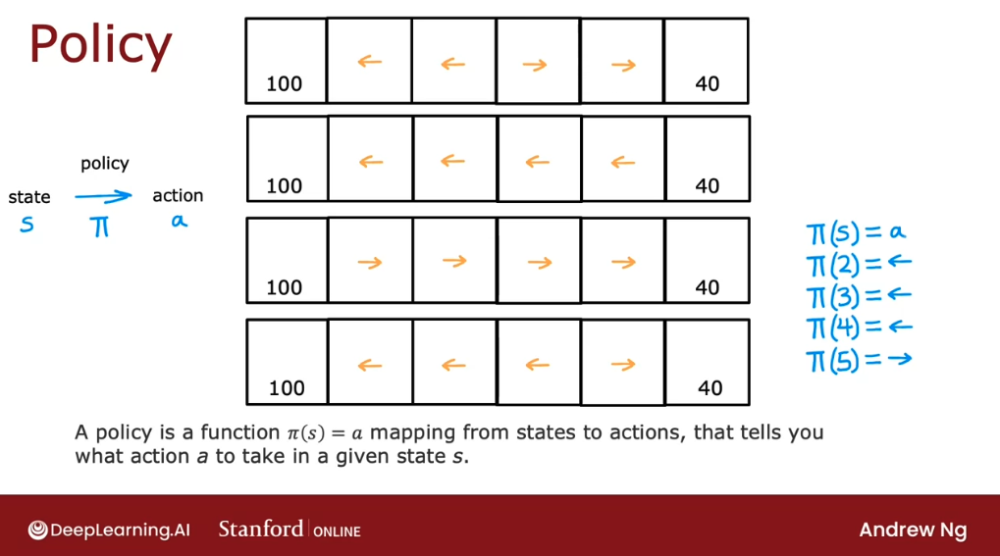

> A policy is a function $\pi(s) = a $ which maps from states to actions, and tells you what action $a$ to take in a given state $s$.

The goal of reinforcement learning is to find a policy $\pi(s) = a$ that tells we what action to take in every state so as to maximize the return. 

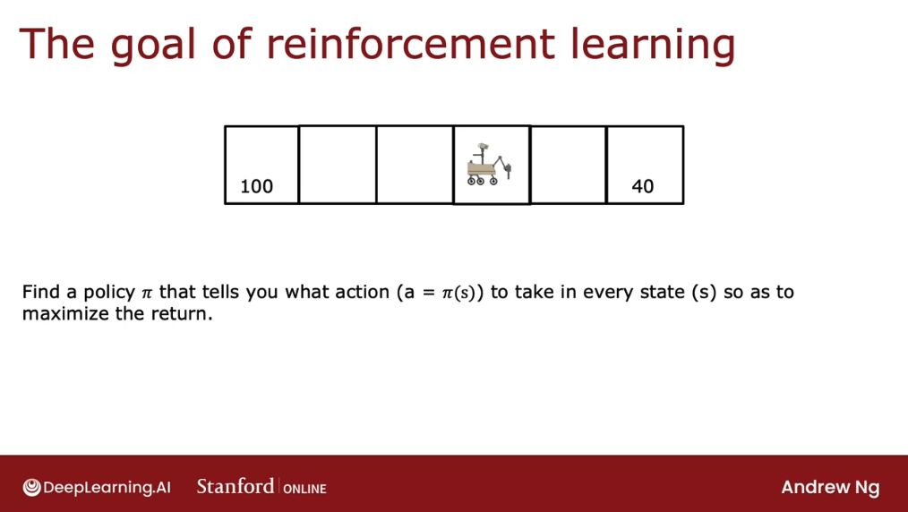

## Review of key concepts

We've developed a reinforcement learning formalism using the six state Mars rover example. 

Let's do a quick review of the key concepts and also see how this set of concepts can be used for other applications as well:

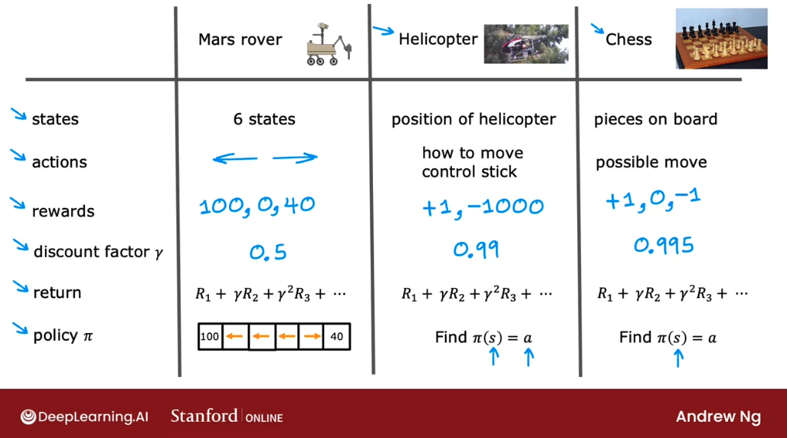

This formalism $\pi(s) = a$ of a reinforcement learning application actually has a name: **a Markov decision process (MDP)**.

A Markov Decision Process refers to that **the future only depends on the current state and not on anything that might have occurred prior to getting to the current state.** 

In other words, in a Markov decision process, **the future depends only on where we are now, not on how we got here**.

One other way to think of the Markov decision process formalism is that we have a robot or some other agent that we wish to control and what we get to do is choose actions $a$ and based on those actions, something will happen in the world or in the environment - such as our position in the world changes or we get to sample a piece of rock and execute the science mission.

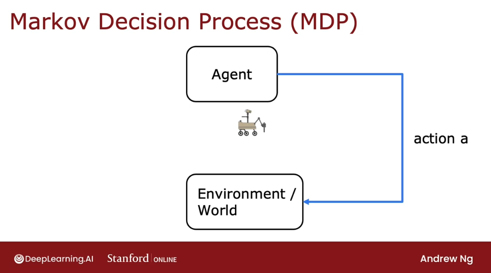

The way we choose the action $a$ is with a policy $\pi$ and based on what happens in the world, we then get to see or we observe back what state we're in, as well as what rewards $R$ that we get. We sometimes see different authors use a diagram like this to represent the MDP formalism but this is just another way of illustrating the set of concepts that we learnt about in the last few sections.

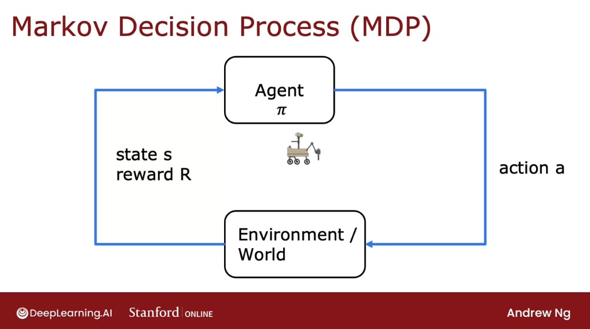