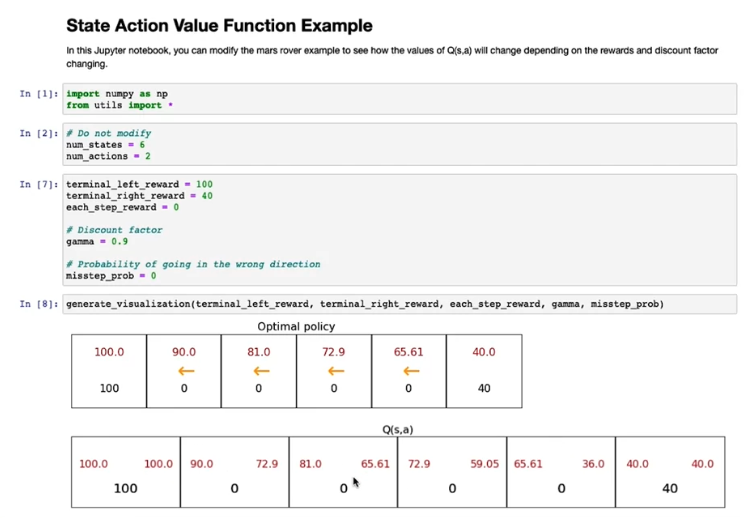
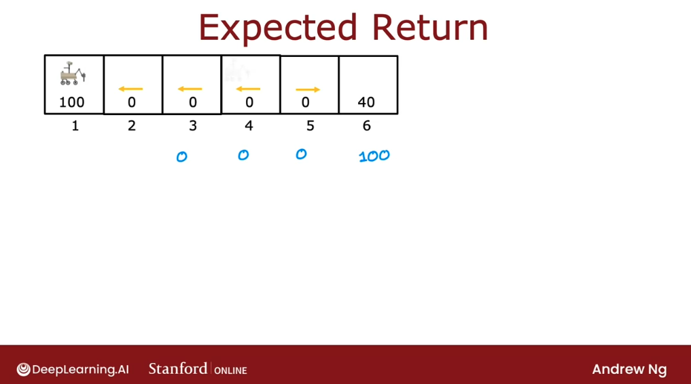

# State-action value function

## State-action value function definition

There's a key quantity that reinforcement learning algorithm will try to compute, called **the state action value function.** Let's take a look at what this function is. 

**The state action value function** is a function typically denoted by the letter uppercase **Q** and it's a function of:

- a state $s$ we might be in 
- the action $a$ we might choose to take in that state.

So:

$$Q(s, a) = \text{return if you:}$$

- start in state $s$
- take action $a$ (once)
- then follow the optimal policy $\pi$ thereafter
 
So after that we take whatever actions will result in the highest possible return. Now we might be thinking there's something a little bit strange about this definition, because how do we know what is the optimal behavior? 

If we knew what the optimal behavior, if we already knew what's the best action to take in every state, why do we still need to compute $Q(s, a)$, because we already have the optimal policy. So we have to acknowledge that there's something a little bit strange about this definition. 

There's almost something a little bit circular about this definition, but rest assured, when we look at specific reinforcement learning algorithms later will resolve this slightly circular definition and will come up with a way to compute the $Q$ function even before we've come up with the optimal policy.

Let's look at an example. We saw previously that this is a pretty good policy: Go left from stage 2, 3 and 4 and go right from state 5. 

It turns out that this is actually the optimal policy for the Mars rover application when the discount factor gamma $\gamma$ is 0.5. $Q(s, a)$ will be equal to the total return if we start from any state, take the action $a$ and then behave optimally after that, which means to take actions according to this policy. 

Let's figure out what $Q(s, a)$ is for a few different states. 

Let's look at say Q of state 2 and what if we take the action to go right?

$$ Q(2, \rightarrow) = 0 + (0.5) 0 + (0.5)^2 0 + (0.5)^3 100 = 12.5$$

Note that this passes, no judgment on whether going right is a good idea or not. It's actually not that good an idea from state 2 to go right, but it just faithfully reports out the return if we take action $a$ and then behave optimally afterwards. 

Here's another example. If we're in state 2 and we were to go left, then the sequence of rewards we get will be:

$$ Q(2, \leftarrow) = 0 + (0.5) 100 = 100$$

In the diagram, we're going to write these two possible values of $Q$ for state $2$:

Let's see the examples for $Q$ for state 4:

$$Q(4, \leftarrow) = 0 + (0.5) 0 + (0.5)^2 0 + (0.5)^3 100 = 12.5$$

$$Q(4, \rightarrow) = 0 + (0.5) 0 + (0.5)^2 40 = 10$$

And if we were to carry out this exercise for all of the other states and all of the other actions, we end up with this being the $Q(s, a)$ for different states and different actions:

Because the state action value function is almost always denoted by the letter Q it **is also often called the Q-function**. 

---
Once we can compute the Q function this will give we a way to pick actions as well. Here's the policy and return, as well as the values $Q(s, a)$ from the previous slide: 

When we look at the different states we notice that, if we take state 2 taking the action left results in $Q$ value or state action value of 50 which is actually the best possible return we can get from that state. In state 3. $Q(s, a)$ for the action left also gives us that higher return; and in state 4 the action left gives us the return we want; and in state 5, actually the action going to the right is what that gives us that higher return of 20. 

**So it turns out that the best possible return from any state $s$ is the largest value of $Q(s, a)$, maximizing over $a$.**

Just to make sure this is clear what we're saying is that, for example, in state 4 there is $Q$-value with the action to go left which is 12.5 but a Q-value to go right which is 10. And the larger of these two values, which is 12.5, is the best possible return from that state 4. 

So, **the best possible action in state $s$ is the action $a$ that maximizes $Q(s, a)$.**

This might give us a hint for why computing $Q(s, a)$ is an important part of the reinforcement learning algorithm that will build later. Namely: if we have a way of computing  $Q(s, a)$ for every state and for every action then, when we're in some state $s$, all we have to do is look at the different actions $a$ and pick the one that maximizes $Q(s, a)$. 

Therefore $\pi(s) = a$ can just pick the action $a$ and that will be the optimal action. 

---
Smetimes we also see the $Q$-function written as $Q^*$ or also called the **optimal Q function.** 

## State-action value function example

Let's see how the optimal policy changes when we change the rewards and the discount factor:

- Left reward: 100
- Right reward: 40
- Discount factor: 0.5

- Left reward: 100
- Right reward: 10
- Discount factor: 0.5

- Left reward: 100
- Right reward: 40
- Discount factor: 0.9

- Left reward: 100
- Right reward: 40
- Discount factor: 0.3

## Bellman Equation

If we can compute the state action value function $Q(s, a)$, then it gives we a way to pick a good action from every state: just pick the action $a$ that gives we the largest value of $Q(s, a)$. 

The question is: **how do we compute these values $Q(s, a)$**? 

In reinforcement learning, there's a key equation called **the Bellman equation** that will **help us to compute the state-action value function**. 

As a reminder, this is the definition of $Q(s, a)$:

In order to describe the Bellman equation, we're going to use the following notation: 

- $s$: denotes the current state. 
- $R(s)$: denotes the reward of the current state $s$.

For our little $MDP$ example, we will have that $R(1) = 100$,  $R(2) = 0$, and so on:

And we're going to use $a$ to denote the current action, that is, the action that we take in the state $s$. After we take the action $a$, we get to some new state. For example, if we're in state 4 and we take the action left, then we get to state 3. We're going to use $s'$ to denote the state we get to after taking that action $a$ from the current state $s$. We're also going to use $a'$ to denote the action that we might take in state $s'$, that is, the new state we got to.

**The Bellman equation is the following**:

$$ Q(s,a) = R(s) + \gamma \max_{a'} Q(s',a') $$

It says that $Q(s, a)$ -the return under this set of assumptions- is equal to reward we get for being in that state, plus the discount factor $\gamma$ times the maximum over all possible actions, $a'$, of $Q$ of $s'$, the new state we just got to. 

There's a lot going on in this equation. Let's first take a look at some examples. We'll come back to see why this equation might make sense. Let's look at an example. 

Let's look at $Q$ of State 2 and action, "move right". Let's apply the Bellman Equation to this to see what value it gives us. If the current state is state two and that the action is to go right, then the next day we get to, after going right -$S'$- would be the State 3:

The Bellman equation says:

$$ Q(2, \rightarrow) = R(2) + \gamma \max_{a'} Q(3,a') $$

$$ Q(2, \rightarrow) = R(2) + 0.5 \max(25, 6.25) $$

$$ Q(2, \rightarrow) = 0 + 0.5 * 25 = 12.5$$

The max of the $Q$ values in state $s'$ in State 3 is going to be the max of 25 and 6.25, since this is max over $a'$ of $Q(s', a')$. This is taking the larger of 25 or 6.25 because those are the two choices for State 3. 

And $ Q(2, \rightarrow)$ end ups being 12.5, which is what we had calculated before, and drawn in our optimal policy:

Let's look at just one more example:

$$ Q(4, \leftarrow) = R(4) + \gamma \max_{a'} Q(3, a') $$

$$ Q(4, \leftarrow) = 0 + 0.5 \max(25, 6.25) $$

$$ Q(4, \leftarrow) = 0 + 0.5 * 25 = 12.5$$

Just one note, if we're in a terminal state, then Bellman Equation simplifies to:

$$ Q(s, a) = R(s) $$

because there's no state $s'$ prime and so the second term would go away. This is why $Q(s, a)$ in the terminal states is just 100 or 40.

---
The intuition that the Bellman equation captures is: if we're starting from state $s$ and we're going to take action $a$ and then act optimally after that, then we're going to see some sequence of rewards over time. In particular, the return will be computed from the reward at the first step, plus $\gamma$ times the reward at the second step plus $\gamma$ squared times reward at the third step, and so on, until we get to the terminal state. 

What Bellman equation says is this sequence of rewards, and the discount factor, can be broken down into two components.

First, this $R(s)$, that's the reward we get right away. In the reinforcement learning literature, this is sometimes also called the immediate reward, but that's what $R_1$ is. It's the reward we get for starting out in some state $s$.

The second term then is the following: after we start in state $s$ and take action $a$, we get to some new state $s'$. The definition of $Q(s, a)$ assumes we're going to behave optimally after that, so after we get to $s'$, we are going to behave optimally and get the best possible return from the state $s'$. So, what the max in the second term is, - $max_{a'} Q(s',a')$-, is the return from behaving optimally, starting from the state $s'$.

The high level intuition I hope we take away is that the total return we get in the reinforcement learning problem has two parts. The first part is this reward that we get right away, and then the second part is $\gamma$ times the return we get starting from the next state $s'$. And these two components together are equal to the total return from the current state $s$. That is the essence of the Bellman equation. 

## Random (stochastic) environment

In some applications, when we take an action, the outcome is not always completely reliable. For example, if we command our Mars rover to go left maybe there's a little bit of a rock slide, or maybe the floor is really slippery and so it slips and goes in the wrong direction. In practice, many robots don't always manage to do exactly what we tell them because of wind blowing them off course or the wheel slipping or something else. 

There's a generalization of the reinforcement learning framework we've talked about so far, which models **random or stochastic environments**. In this section, we'll talk about how these reinforcement learning problems work. 

Continuing with our simplifying Mars Rover example, let's say we take the action and command it to go left. Most of the time we'll succeed but what if 10 percent of the time or 0.1 of the time, it actually ends up accidentally slipping and going in the opposite direction? So, if we command it to go left, it has a 90 percent chance or 0.9 chance of correctly going in the left direction, but a 0.1 chance of actually heading to the right so that it has a 90 percent chance of ending up in state 3 and a 10 percent chance of ending up in state 5.

Conversely, if we were to command it to go right, it has a 0.9 chance of ending up in state 5 and 0.1 chance of ending up in state 3.

This would be an example of a **stochastic environment**. Let's see what happens in this reinforcement learning problem. Let's say we use this policy shown here, where we go left in states 2, 3, and 4 and  try to go right in state 5.

If we were to start in state 4 and we were to follow this policy, then the actual sequence of states we visit may be random. For example, in state 4, we will go left, and maybe we're a little bit lucky, and it actually gets the state 3, and then we try to go left again, and maybe it actually gets there. We tell it to go left again, and it gets to the terminal that state. 

If this is what happens, we end up with the sequence of rewards $0 \rightarrow 0 \rightarrow 0 \rightarrow 100$.

But if we were to try this exact same policy a second time, maybe we're a little less lucky, the second time we start here. Try to go left and say it succeeds so a zero from state 4 zero from state 3, here we tell it to go left, but we've got unlucky this time and the robot slips and ends up heading back to state 4 instead. Then we tell it to go left, and left, and left, and eventually get to that reward of 100. In that case, this will be the sequence of rewards we observe: $0 \rightarrow 0 \rightarrow 0 \rightarrow  0 \rightarrow  0 \rightarrow 100$.

Itis even possible, if we tell from state 4 to go left following the policy, we may get unlucky even on the first step and we end up going to state 5 because it slipped. Then on state 5, we command it to go right, and it succeeds as we end up in the terminal case. In this case, the sequence of rewards we see will be $0 \rightarrow 0 \rightarrow 40$.

We had previously written out the return as this sum of discounted rewards. But when the reinforcement learning problem is stochastic, there isn't one sequence of rewards that we see for sure instead we see this sequence of different rewards.

**In a stochastic reinforcement learning problem**, what we're interested in is not maximizing the return because that's a random number. What **we're interested in is maximizing the average value of the sum of discounted rewards**. By average value, I mean if we were to take our policy and try it out a thousand times or a 100,000 times or a million times, we get lots of different reward sequences and if we were to take the average over all of these different sequences of the sum of discounted rewards, then that's what we call the **expected return**.

In statistics, the term expected is just another way of saying average. But what this means is we want to maximize what we expect to get on average in terms of the sum of discounted rewards. 

The mathematical notation for this is to write this as $E$, where $E$ stands for expected value:

$$ \text{Expected return} = E[R_1 + \gamma R_2 + \gamma^2 R_3 + \gamma^3 R_4 + ... ]$$

The job of reinforcement learning algorithm is to choose a policy $\pi$ to maximize the average or the expected sum of discounted rewards. 

To summarize: when we have a stochastic reinforcement learning problem or a stochastic Markov decision process the goal is to choose a policy to tell us what action to take in state $s$ so as to maximize the expected return.

The last way that this changes when in a stochastic environment is that it modifies the Bellman equation a little bit. The difference now is that when we take the action $a$ in state $s$, the next state $s'$ we get to is actually random.

When we're in state 3 and we tell it to go left the next state $s'$  could be the state 2, or it could be the state 4. $s'$ is now random, which is why we also put an average operator or unexpected operator sorrounding the max element:

$$ Q(s,a) = R_{s} + \gamma * E[ \max_{a'}Q(s',a')] $$

We say that the total return from state $s$, taking action $a$, once, and then behaving optimally, is equal to the reward we get right away, also called the immediate reward, plus the discount factor, gamma, plus what we expect to get on average of the future returns. 

If we want to sharpen our intuition about what happens with these stochastic reinforcement learning problems, go back to the optional lab where we have the parameter `misstep_prob` which is the probability of our Mars Rover going in the opposite direction than we had commanded it to. 

If we said misstep prop two is 0.1 and re-execute the Notebook and the numbers above are the optimal return if we were to take the best possible actions, take this optimal policy but the robot were to step in the wrong direction 10 percent of the time and below we see the $Q$ values for this stochastic MDP:

Notice that these values are now a little bit lower because we can't control the robot as well as before. The $Q$ values, as well as the optimal returns, have gone down a bit. 

In fact, if we were to increase the misstep probability, say 40 percent of the time, then these values end up even lower because our degree of control over the robot has decreased.

