# Continuous state spaces

## Example of continuous state space applications

Many robotic control applications, including the Lunar Lander application that we will work on in the practice lab, have continuous state spaces. Let's take a look at what that means and how to generalize the concept we've talked about to these continuous state spaces. 

The simplified Mars rover example we use uses a discrete set(states: it only be in one(six possible positions. But most robots can be in more than one(six or any discrete number of positions, instead, they can be in any of a very large number of continuous value positions.  

Let's look at another example: the application of controlling a car or a truck. 

If we're building a self-driving car or self-driving truck and we want to control this to drive smoothly, then the state of this truck might include a few numbers such as:

- $x$ position
- $y$ position
- $\theta$ angle or orientation (what way is it facing)

Assuming the truck stays on the ground, we probably don't need to worry about how high it is, or a $z$ axis. But we will also need its speeds in $x$-direction, the speed in the $y$-direction, and how quickly it's turning. 

<!-- Vertical array in latex -->
$$ s = \begin{bmatrix} x \\ y \\ \theta \\ \dot{x} \\ \dot{y} \\ \ \dot{\theta} \end{bmatrix} $$

So, for a car or truck, the state would comprise this vector(six numbers, and any of these numbers can take on any value within is valid range. For example, $\theta$ should range between zero and 360 degrees.

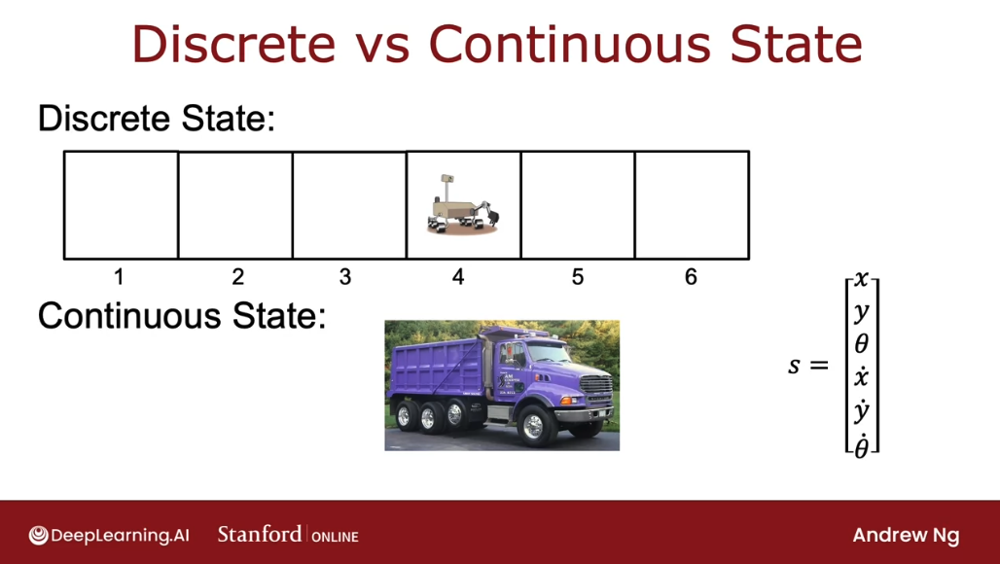

Let's look at another example. What if we're building a reinforcement learning algorithm to control an autonomous helicopter, how would we characterize the position of a helicopter? 

The positioning of the helicopter would include its:

- **$x$** position: how far north or south is a helicopter
- **$y$** position: how far on the east-west axis is the helicopter,
- **$z$** position: the height of the helicopter above ground. 

But other than the position, the helicopter also has an orientation, and conventionally we capture its orientation is with three additional numbers: 

- **roll $\phi$**: is it rolling to the left or right?
- **pitch $\theta$**: is it pitching forward or back? 
- **yaw $\omega$**: compass orientation, is it facing north, east, south, or west?

To write this down, the state therefore includes the position $x$, $y, $z$, and then the roll, pitch, and yaw denoted with the Greek alphabets Phi, Theta and Omega.

But to control the helicopter, we also need to know its speed in the x-direction, in the y-direction, and in the z direction, as well as its rate of turning, also called the angular velocity (how fast is its yaw changing?) 

So, the state used to control autonomous helicopters is a list of 12 numbers that is input to a policy, and the job of a policy is look at these 12 numbers and decide what's an appropriate action to take in the helicopter:

$$ s = \begin{bmatrix} x \\ y \\ z \\ \phi \\ \theta \\ \omega \\ \dot{x} \\ \dot{y} \\ \ \dot{\theta} \\ \dot{\phi} \\ \dot{\theta} \\ \dot{\omega}  \end{bmatrix} $$

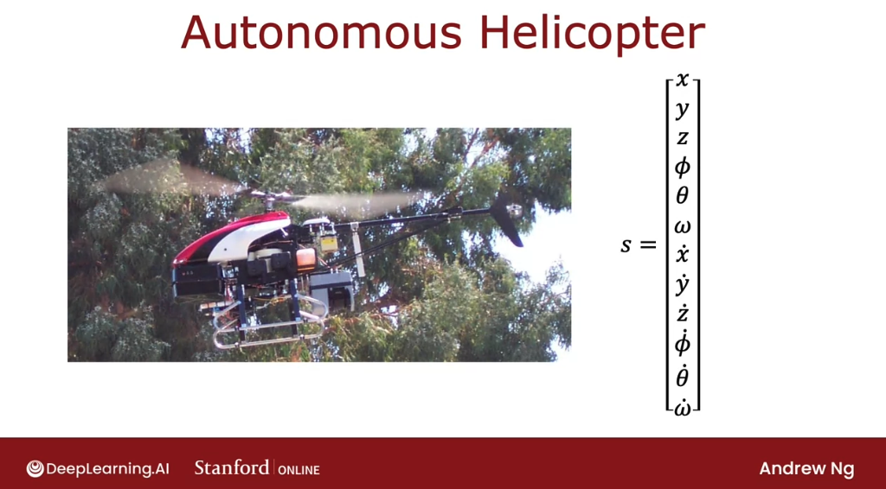

So in a continuous state reinforcement learning problem or a continuous state Markov Decision Pocess, (continuous MDP), the state of the problem isn't just one of a small number of possible discrete values, like a number from 1-6. Instead, it's a vector of numbers, any of which could take any of a large number of values. 

## Lunar Lander

The Lunar Lander lets us land a simulated vehicle on the moon. It's a fun little video game that's been used by a lot of reinforcement learning researchers. Let's take a look at what it is. 

In this application we're in command of a Lunar Lander that is rapidly approaching the surface of the moon. And our job is the fire thrusters at the appropriate times to land it safely on the landing pad. To give we a sense of what it looks like:

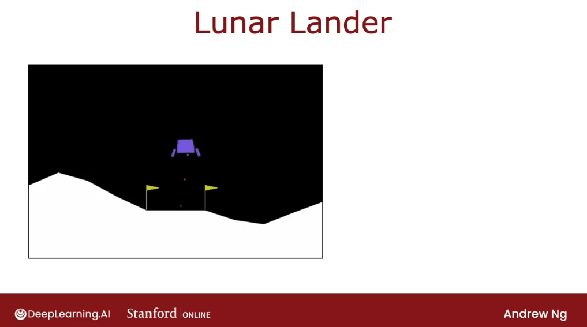

The lander can fire thrusters downward and to the left and right to position itself to land between these two yellow flags. Or, if the reinforcement landing algorithm policy does not do well then this is what it might look like where the lander unfortunately has crashed on the surface of the moon:

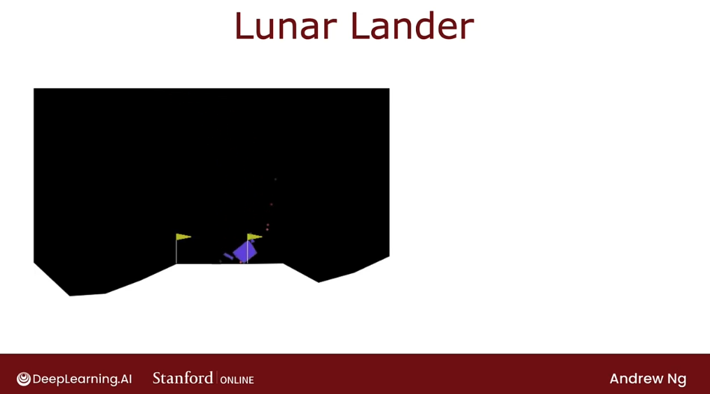

In this application we have four possible actions on every time step:

- **do nothing**: the forces of inertia and gravity pull us towards the surface of the moon
- **left thruster**: this is firing the left thruster which will push the lander to the right
- **main thruster**: this is firing the main engine which will push the lander upwards
- **right thruster**: this is firing the right thruster which will push the lander to the left

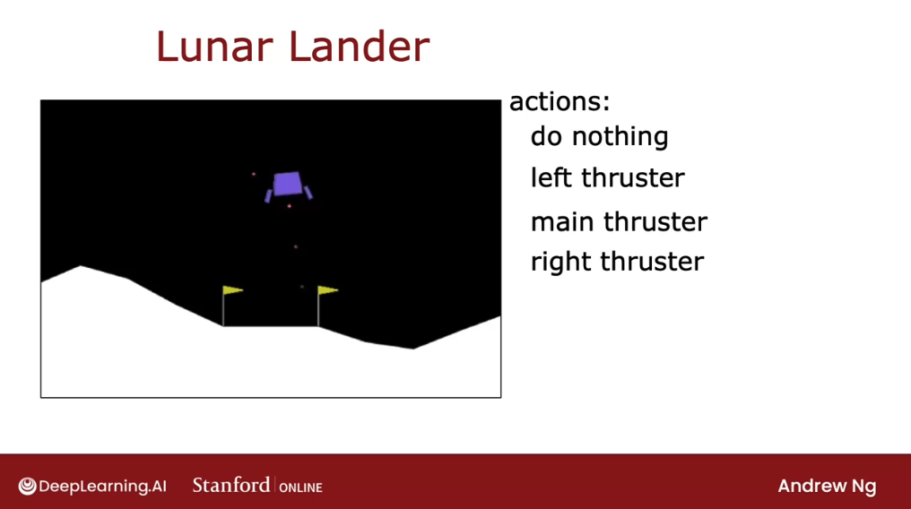

How about the state space of this MDP?

The states are:

$$ s = \begin{bmatrix} x \\ y \\ \dot{x} \\ \dot{y} \\ \theta \\ \dot{\theta} \\ L  \\ \ R  \end{bmatrix} $$

- $x$: position to the left and right
- $y$: position up and down
- $\dot{x}$: velocity to the left and right
- $\dot{y}$: velocity up and down
- $\theta$: angle of the lander
- $\dot{\theta}$: angular velocity
- $L$: boolean - is the left leg on the ground?
- $R$: boolean - is the right leg on the ground?

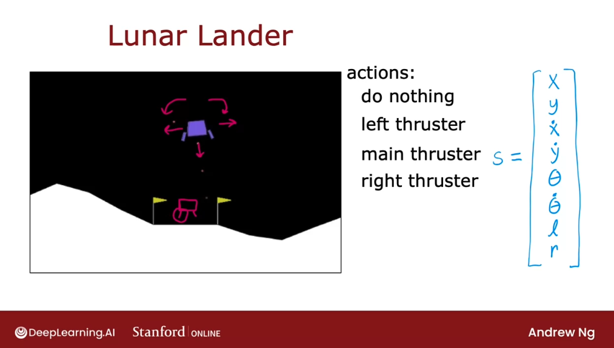

Finally the reward function for the Lunar Lander:

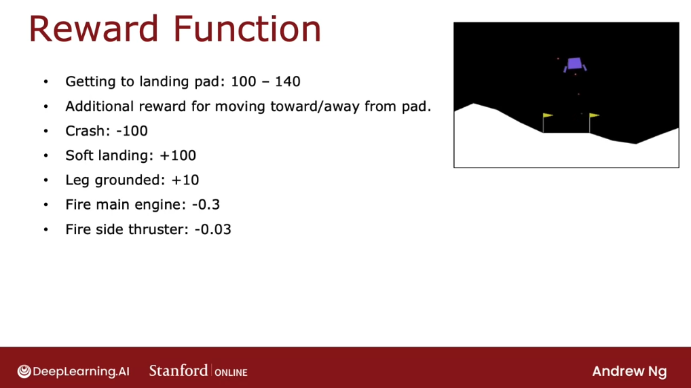

- If it manages to get to the landing pad, it will receive a reward between 100 and 140 depending on how well it's flown and gotten to the center of the landing pad. 
- Additional reward for moving toward or away from the pad: if it moves closer to the pad it receives a positive reward and if it moves away it receives a negative reward. 
- If it crashes it gets a large -100 reward.
- If it achieves a soft landing it gets a +100 reward.
- If the left leg or the right get grounded, it receives a +10 reward
- To encourage it not to waste too much fuel and fire thrusters unnecessarily, every time it fires the main engine we give it a -0.3 rewards and every time it fires the left or the right side thrusters we give it a -0.03 reward. 

Notice that this is a moderately complex reward function. The designers of the Lunar Lander application actually put some thought into exactly what behavior we want and codified it in the reward function to incentivize more of the behaviors we want and fewer of the behaviors -like crashing- that we don't want. 

We find when we're building our own reinforcement learning application usually it takes some thought to specify exactly what we want or don't want and to codify that in the reward function. But specifing the reward function should still turn out to be much easier than specifying the exact right action to take from every single state. 

So the Lunar Lander problem is as follows. Our goal is to:

- **learn a policy $\pi$, that when given state:**

$$ s = \begin{bmatrix} x \\ y \\ \dot{x} \\ \dot{y} \\ \theta \\ \dot{\theta} \\ L  \\ \ R  \end{bmatrix} $$\\

**picks an action $a = \pi(s)$ so as to maximize the return.**

Usually for the Lunar Lander would use a fairly large value for $\gamma$: **0.985**, so pretty close to 1. 

## Learning the state-value function

Let's see how we can use reinforcement learning to control the Lunar Lander or for other reinforcement learning problems. The key idea is that we're going to train a neural network to compute or to approximate the state action value function $Q(s, a)$ and that in turn will let us pick good actions. Let's see how it works. 

The heart of the learning algorithm is: we're going to train a neural network that inputs
- the current **state**, and 
-the current **action** 
and **computes** or approximates **$Q(s, a)$**.

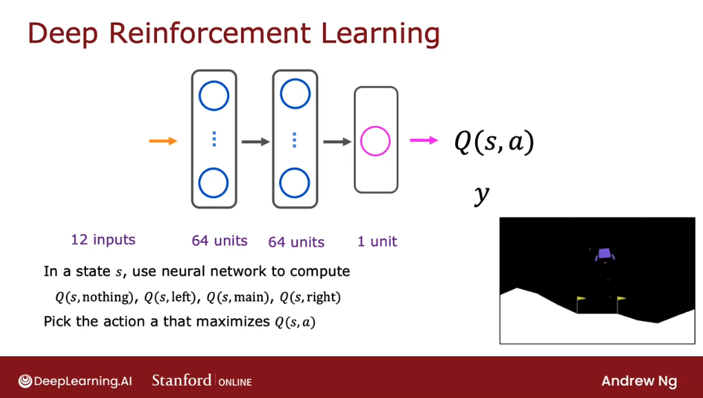

In particular, for the Lunar Lander, we're going to take the state $s$ and any action $a$ and put them together. Concretely, the state was that list of eight numbers that we saw previously, so we have:

$$ s = \begin{bmatrix} x \\ y \\ \dot{x} \\ \dot{y} \\ \theta \\ \dot{\theta} \\ L  \\ \ R  \end{bmatrix} $$

We also have four possible actions: nothing, left, main engine, and right. We can encode any of those four actions using a one-hot feature vector: `[1, 0, 0, 0]` or `[0, 1, 0, 0]`, etc

**This list of 12 numbers**, eight numbers for the state and then four numbers, a one-hot encoding of the action, **is the inputs we'll have to the neural network**, and we're going to call this $\vec{x}$:

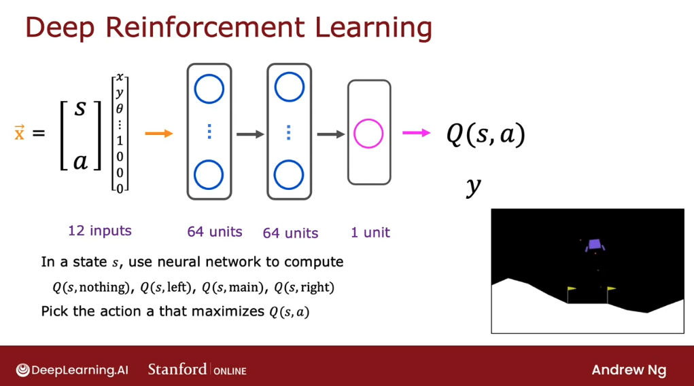

We'll then take these 12 numbers and feed them to a neural network with say, 64 units in the first hidden layer, 64 units in the second hidden layer, and then a single output in the output layer. The job of the neural network is to calculate the output $Q(s, a)$, the state action-value function for the Lunar Lander given the input $s$ and $a$.

Because we'll be using neural network training algorithms , we're also going to refer to this value $Q(s, a)$ as the target value $y$ that were training the neural network to approximate. 

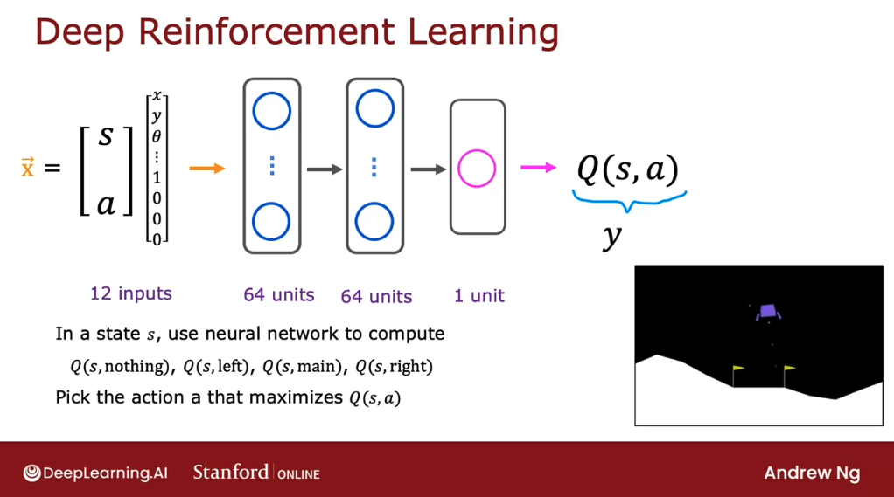

Notice that I did say reinforcement learning is different from supervised learning, but what we're going to do is **not** input a state and have it output an action. What we're going to do is input a state-action pair and have it try to output $Q(s, a)$, and using a neural network inside the reinforcement learning algorithm this way will turn out to work pretty well. 

If we can train a neural network with appropriate choices of parameters in the hidden layers and in the output layer to give us good estimates of $Q(s, a)$, then whenever our Lunar Lander is in some state $s$ we can then use the neural network to compute $Q(s, a)$ for all four actions. That is, we can compute $Q(s, nothing)$, $Q(s, left)$, $Q(s, main)$, $Q(s, right)$, **and then finally, whichever of these has the highest value, we pick the corresponding action $a$.** 

So the question becomes, how do we train a neural network to output $Q(s, a)$? 

It turns out **the approach will be to use Bellman's equations to create a training set with lots of examples, $x$ and $y$, and then we'll use supervised learning** exactly as we learned in the second course when we talked about neural networks to a mapping from $x$ to $y$ - that is, a mapping from the state-action pair to this target value $Q(s, a)$. 

But how do we get the training set with values for $x$ and $y$ that we can then train a neural network on? Let's take a look.

Here's the Bellman equation:

$$ Q(s,a) = R(s) + \gamma \max_{a'} Q(s',a') $$

The right-hand side is what we want $Q(s, a)$ to be equal to, so we're going to call this value on the right-hand side $y$. And the input to the neural network is a state and an action, so we're going to call that $x$.

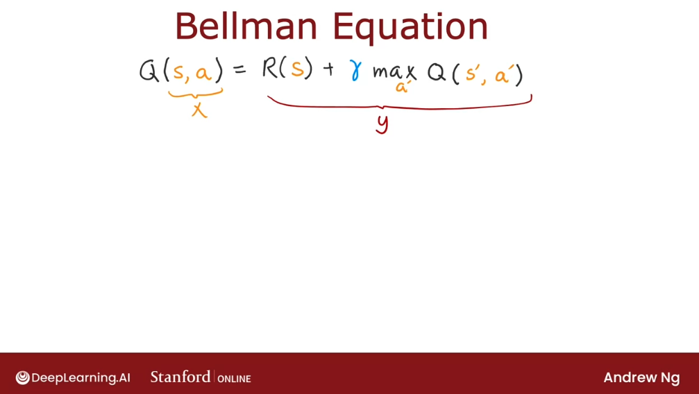

The job of the neural network is to input $x$ and try to accurately predict what will be the value on the right. In supervised learning, we were training a neural network to learn a function $f$, which depends on a bunch of parameters, $w$ and $b$ -the parameters of the various layers of the neural network- and it was the job of the neural network to input $x$ and output something close to the target value $y$. 

The question now is: **how can we come up with a training set with values $x$ and $y$ for a neural network to learn from**?

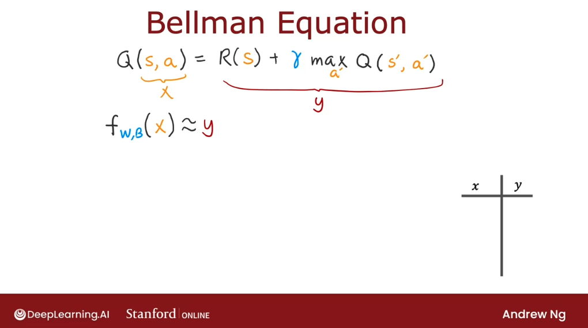

Here's what we're going to do. We're going to use the Lunar Lander and just try taking different actions in it. 

Since we don't have a good policy yet, we'll take actions randomly, fire the left thruster, fire the right thruster, fire the main engine, do nothing. By just trying out different things in the Lunar Lander simulator we'll observe a lot of examples of when we're in some state $s$, and we took some action $a$, so that we got some reward $R(s)$ for being in that state, and as a result of our action, we got to some new state, $s'$.

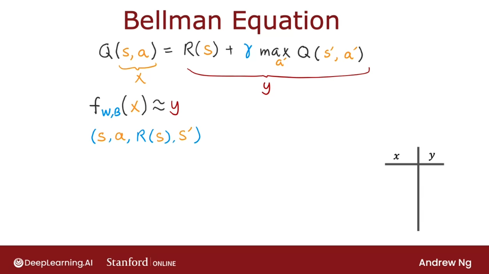

As we take different actions in the Lunar Lander, we see this $(s, a, R(s), s')$, which we call them tuples in Python, many times. 

For example, maybe one time we're in some state $s$ and just to give this an index and we call this $s^{(1)}$, and we happen to take some action $a^{(1)}$, this could be nothing left, main thrusters or right. As a result of which we've got some reward, and we wound up at some state $s'^{(1)}$ 

And we can record this way maybe 10,000 tuples:

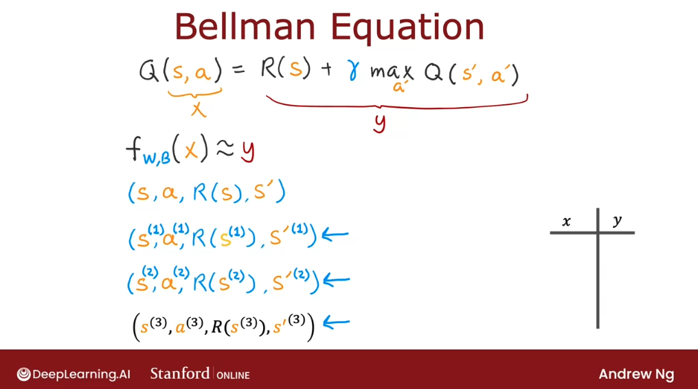

It turns out that each of these tuples will be enough to create a single training example, $(x^{(1)}$, $y^{(1)})$:

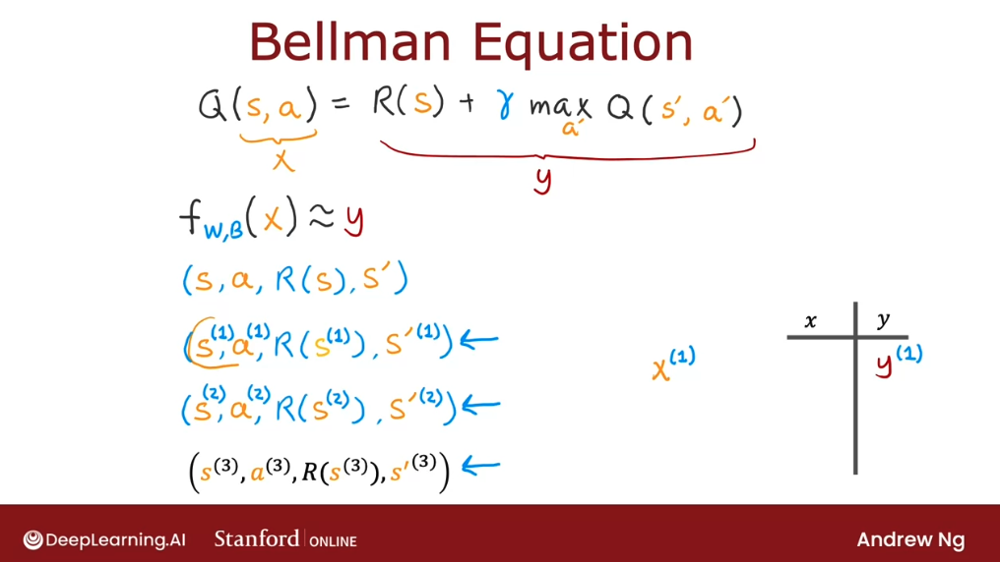

Here's how we do it. There are four elements in the first tuple. **The first two will be used to compute $x^{(1)}$, and the second two would be used to compute $y^{(1)}$.** 

In particular, $x^{(1)}$ is just going to be $s^{(1)}$ and $a^{(1)}$ put together: $(s^{(1)}, a^{(1)})$

$s^{(1)}$ is eight numbers, the state of the Lunar Lander, and $a^{(1)}$ is four numbers, the one-hot encoding of whatever action this is.

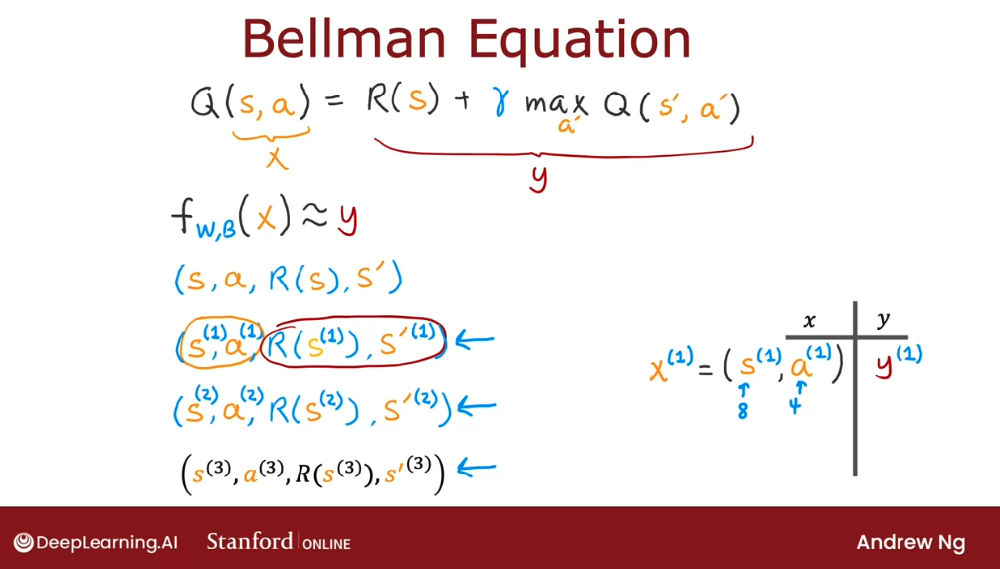

And $y^{(1)}$ would be computed using the right-hand side of the Bellman equation. In particular, the Bellman equation says, when we input $s^{(1)}$, $a^{(1)}$, we want $Q(s^{(1)}, a^{(1)})$ to be this right hand side, to be equal to: 
$$ R(s^{(1)}) = \gamma \max_{a'} Q(s'^{(1)},a') $$

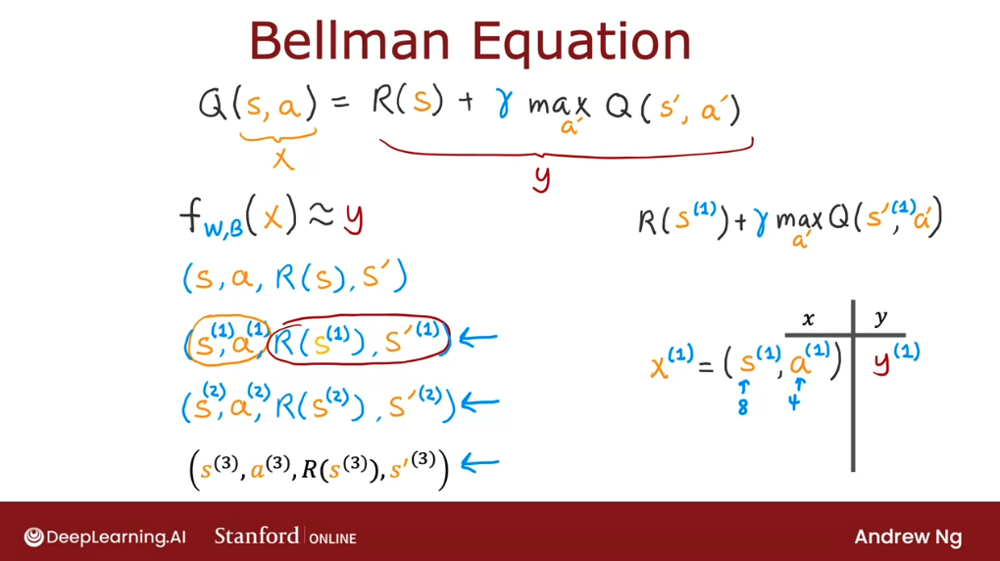

Notice that the two elements of the tuple on the right give us enough information to compute $ R(s^{(1)})$:

- we know what is $ R(s^{(1)})$, which is the reward we've saved in the tuple.
- we know discount factor $\gamma$ 
- we know the max over all actions, $a'$, of $Q(s'^{(1)})$, which is the state we got to in the second example, and then take the maximum over all possible actions, $a'$. 

We're going to call this $y^{(1)}$. When we compute this, it will be some number, like 12.5 or 17, or 0.5 or some other number:

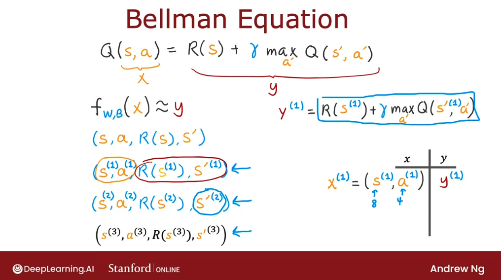

We'll save that number in the table as $y^{(1)}$, so that this pair $x^{(1)}$, $y^{(1)}$ becomes the first training example in this little dataset we're computing. 

Now, we may be wondering, where does $Q(S', a')$ or $Q(s'^{(1)}, a')$ come from? Well, initially we don't know what is the Q function. 

But it turns out that when we don't know what is the Q function, we can start off with taking a totally random guess and the algorithm will work nonetheless. 

The algorithm will learn in every step and get better over time until it reaches the actual $Q$ function. 

Then we can do this for our second experience:

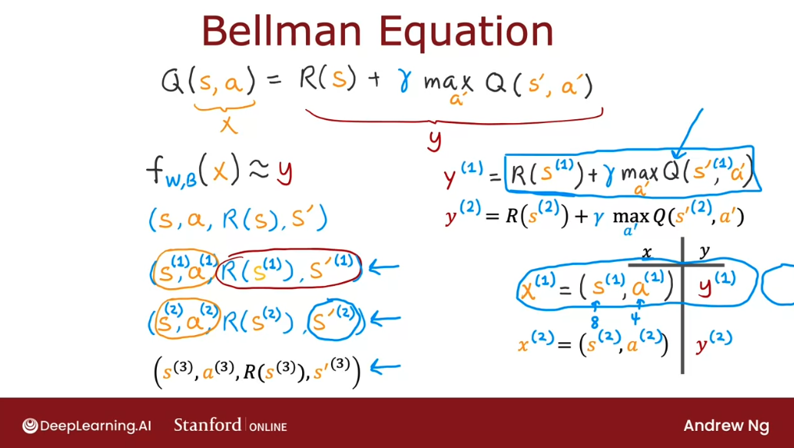

And then we can continue doing this for 10,000 different experiences and create a dataset of 10,000 training points.

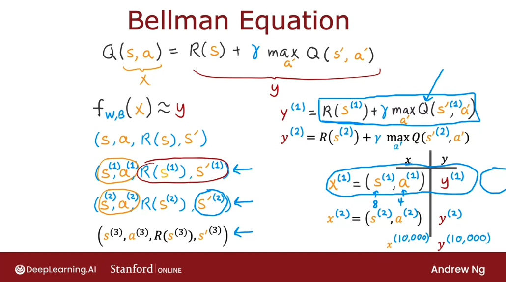

What we'll see later is that we'll actually take this training set where the $x$'s are inputs with 12 features and the $y$'s are just numbers and we'll train a neural network with, say, the mean squared error loss to try to predict $y$ as a function of the input $x$. What we describe here is just one piece of the learning algorithm we'll use. 

Let's put it all together and see how it all comes together into a single algorithm. Let's take a look at what a full algorithm for learning the Q-function is like. **First, we're going to take our neural network and initialize all the parameters of the neural network randomly.**

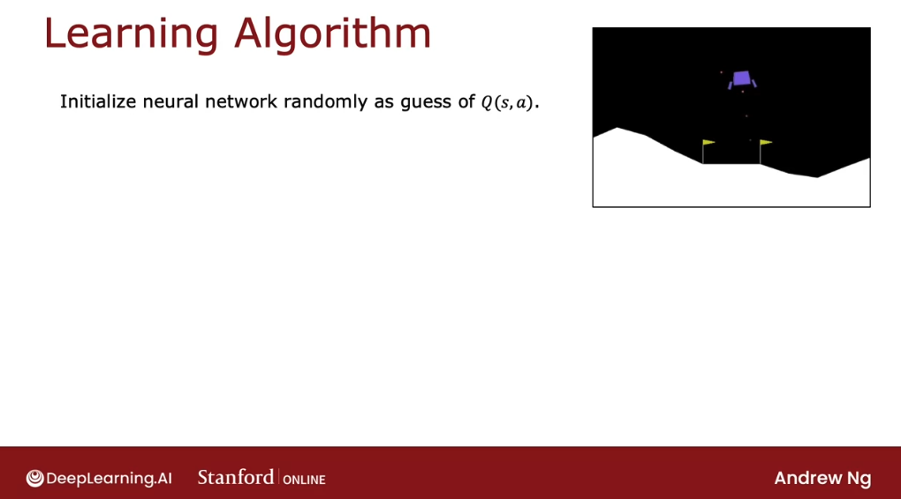

Initially we have no idea, what is the $Q$ function, so we just pick totally random values for the weights and that neural network is our initial random guess for the Q-function. This is a little bit like when we are training linear regression and we initialize all the parameters randomly and then use gradient descent to improve the parameters. 

Next, we will repeatedly do the following;

- take actions in the Lunar Lander, so float around randomly, take some good actions, take some bad actions. Get lots of  tuples of when it was in some state $s$, we took some action $a$, got a reward $R(s)$ and we got to some state $s'$. 
- store 10,000 most recent examples of the $(s, a, R(S), s')$ tuples.

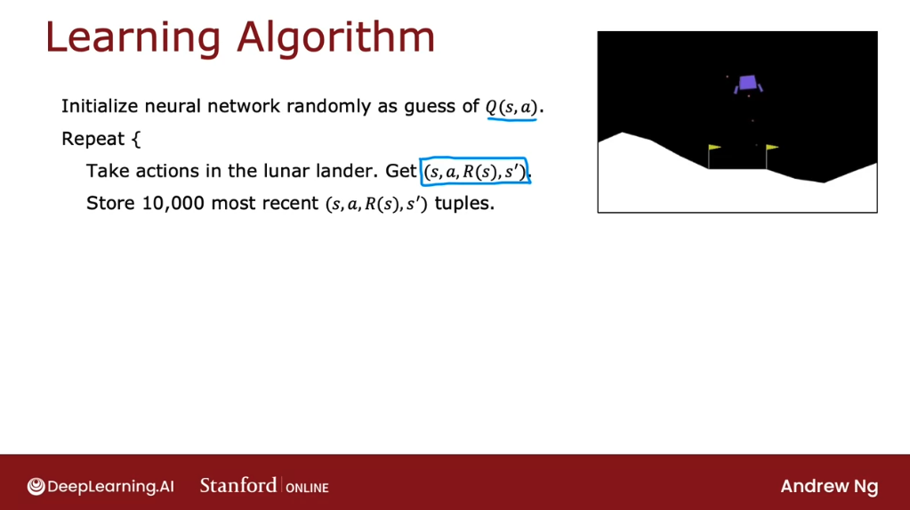

As we run this algorithm, we will see many steps in the Lunar Lander, maybe hundreds of thousands of steps. But to make sure we don't end up using excessive computer memory, common practice is to just remember the 10,000 most recent such tuples that we saw taking actions in the MTP. This technique of storing the most recent examples only is sometimes called the **replay buffer** in reinforcement learning algorithms. 

For now, we're just flying the Lunar Lander randomly, sometimes crashing, sometimes not and getting these tuples as experienced for our learning algorithm. 

Occasionally then we will train the neural network. In order to train the neural network, we we'll look at these 10,000 most recent tuples we had saved and:
- create a training set of 10,000 examples. As we said already, the training set needs lots of pairs of $x$ and $y$. For our training examples, $x$ will be the $(s, a)$ from the first two elements of the tuple (a list of 12 numbers, the 8 numbers for the state and the 4 numbers for the one-hot encoding of the action). Meanwhile, the target value that we want a neural network to try to predict would be $y$, which equals: $$R(s) + \gamma \max_{a} Q(s', a')$$

The values of $Q(s', a')$ from the previous equation will be initailly randomly initialized. It may not be a very good guess, but it's a guess, that will improve. After creating these 10,000 training examples we'll have training examples ($x_1$, $y_1$) through ($x_{10,000}$, $y_{10,000}$).

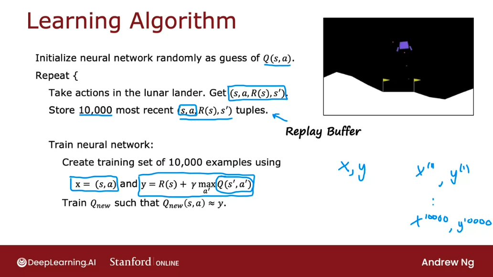

Next: **we'll train a neural network and we're going to call the new neural network $Q_{new}$, such that $Q_{new}(s, a)$ learns to approximate $y$**:

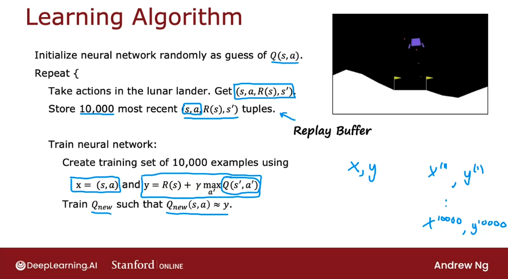

This is exactly training that neural network to output $f$ with parameters $w$ and $b$, to input $x$ to try to approximate the target value $y$. Now, this neural network should be a slightly better estimate of what the $Q$ function or the state action value function should be. 

What we'll do next is **we're going to take $Q$ and set it to this new neural network $Q_{new}$ that we had just learned.** It turns out that if we run this algorithm where we start with a really random guess of the Q function, then use Bellman's equations to repeatedly try to improve the estimates of the Q function, then by doing this over and over, taking lots of actions, training a model, that will improve our guess for the Q-function. 

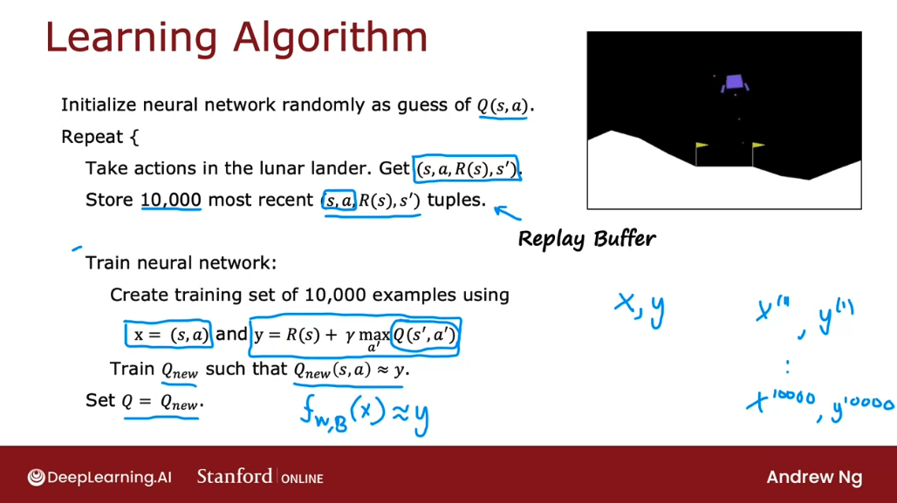

For the next model we train, we now have a slightly better estimate of what is the Q function. Then the next model we train will be even better. Then for the next time we train a model $Q(s', a')$ will be an even better estimate. As we run this algorithm on every iteration, $Q(s', a')$ will become an even better estimate of the $Q$ function so that when we run the algorithm long enough, this will actually become a pretty good estimate of the true value of $Q(s, a)$, so that we can then use this to pick good actions.

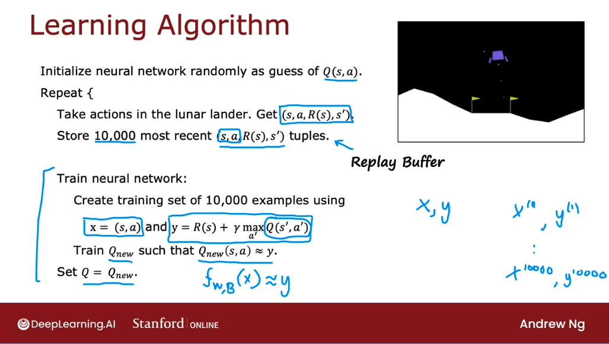

The algorithm we just saw is sometimes called the **DQN algorithm** which stands for **Deep Q-Network** because we're using deep learning and neural network to train a model to learn the Q functions.

If we use the algorithm as I described it, it will work on the Lunar Lander. However, it will probably take a long time to converge, maybe it won't land perfectly, but it'll work. But it turns out that with a couple of refinements to the algorithm, it can work much better. In the next few sections, let's take a look at some refinements to the algorithm that we just saw. 

## Algorithm refinement: Imporved neural network architecture

In the last section, we saw a neural network architecture that will input the state and action and attempt to output the $Q$ function, $Q(s, a)$. However, there's a change to neural network architecture that make this algorithm much more efficient. Most implementations of **DQN** actually use this more efficient architecture that we'll see in this section. 

This was the neural network architecture we saw previously, where it would input 12 numbers and output $Q(s, a)$: 

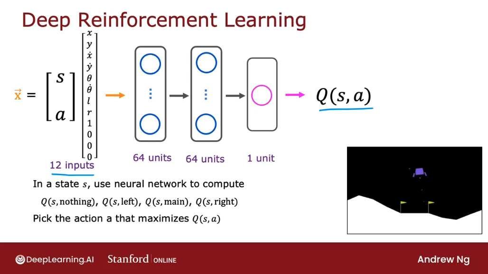

Whenever we are in some state $s$, we would have to carry out inference in the neural network separately four times to compute these four values so as to pick the action $a$ that gives us the largest $Q$ value. 

This is inefficient because we have to carry our inference four times from every single state. Instead, **we can more efficiently train a single neural network to output all four of these values simultaneously.** This is what it looks like:

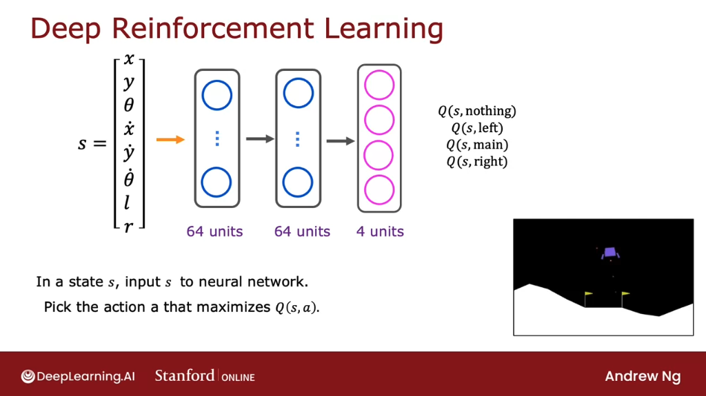

It is a modified neural network architecture where the input is eight numbers corresponding to the state of the Lunar Lander - notice the actions are not part of the input but of part of the output. It then goes through the neural network with 64 units in the first hidden layer, 64 units in the second hidden layer. And the output unit has four output units, and **the job of the neural network is to have the four output units output $Q(s, nothing)$, $Q(s, left)$, $Q(s, main)$, and $Q(s, right)$**. 

So, the job of the neural network is to **compute simultaneously the $Q$ value for all four possible actions for when we are in the state $s$**. This turns out to be more efficient because given the state $s$ we can run inference just once and get all four of these values, and then very quickly pick the action a that maximizes $Q(s, a)$. 

Notice also in Bellman's equations, there's a step in which we have to compute $\max_{a'} Q(s', a')$ to get the target value. With this architecture, it is much more efficient, because we can compute all the $Q(s', a')$ values for all actions a prime at the same time.

Then we can then just pick the max to compute this value for the right-hand side of Bellman's equations. This change to the neural network architecture makes the algorithm much more efficient, and so we will be using this architecture in the practice lab. 

## Algorithm refinement: $\epsilon$-greedy policy

In the learning algorithm that we developed, even while we're still learning how to approximate $Q(s,a)$, we need to take some actions in the Lunar Lander. 

So, how do we pick those actions while we're still learning? The most common way to do so is to use something called an $\epsilon-greedy policy$. Let's take a look at how that works. 

Here's the algorithm that we saw earlier. One of the steps in the algorithm is to take actions in the Lunar Lander: 

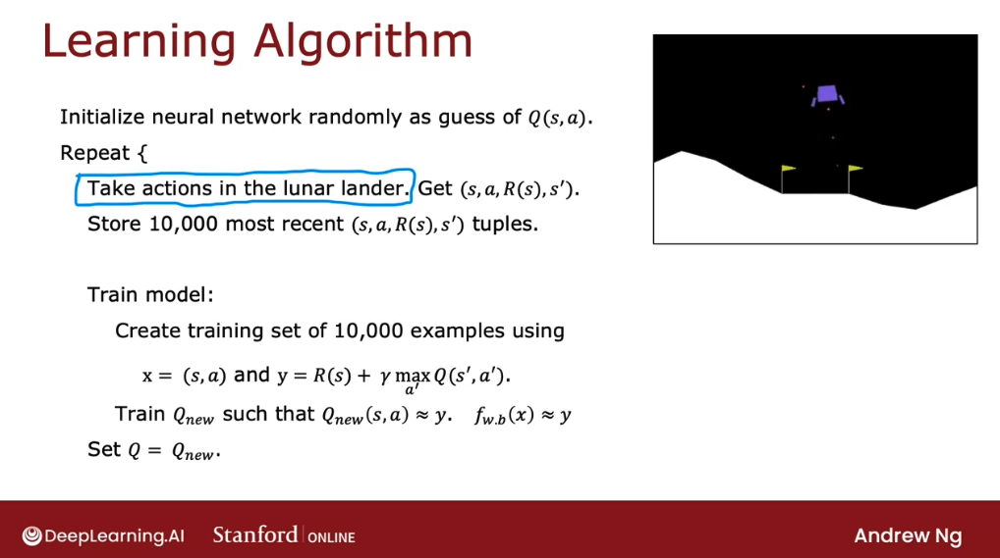

So, when the learning algorithm is still running, we don't really know what's the best action to take in every state. If we did, we'd already be done learning. 

But  **while we're still learning and don't have a very good estimate of $Q(s,a)$ yet, how do we take actions in this step of the learning algorithm?** Let's look at some options:

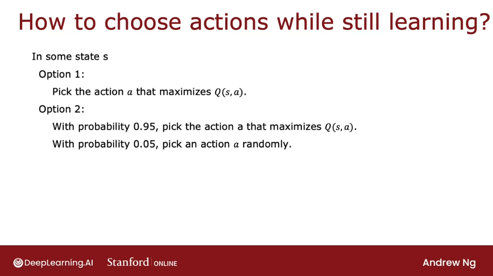

When we're in some state $s$, we will **not want to take actions totally at random because that will often be a bad action**. 

One natural - **option 1** - would be to p pick an action a that maximizes $Q(s,a)$. We may say, even if $Q(s,a)$ is not a great estimate of the $Q$ function yet, let's just do our best and use our current guess of $Q(s,a)$ and pick the action a that maximizes it. 

It turns out this may work okay, but isn't the best option. 

Instead, here's what is commonly done. In **Option 2**, most of the time, with for example, probability of 0.95, pick the action that maximizes $Q(s,a)$. The remaining 0.05 o of the time, pick an action randomly. 

Why do we want to occasionally pick an action randomly? Suppose for some strange reason $Q(s,a)$ was initialized randomly so that the learning algorithm thinks that firing the main thruster is never a good idea. Maybe the neural network parameters were initialized so that $Q(s, main)$ is always very low. 

If that's the case, then the neural network, because it's trying to pick the action a that maximizes $Q(s,a)$, will never ever try firing the main thruster. Because it never ever tries firing the main thruster, it will never learn that firing the main thruster is actually sometimes a good idea. Because of the random initialization, if the neural network somehow initially gets stuck in this mind that some things are bad idea, just by chance, then if using option 1, it means that it will never try out those actions and discover that maybe is actually a good idea to take that action.

Instead, under option 2 on every step, we have some small probability of trying out different actions so that the neural network can learn to overcome its own possible preconceptions about what might be a bad idea. **This idea of picking actions randomly is sometimes called an "exploration" step**.

On the other hand, **taking an action that maximizes $Q(s,a)$ is called a greedy action because we're trying to actually maximize our return by picking the action that we think will maximize the return.** In the reinforcement learning literature, this is called an "**exploitation**" step.

In reinforcement learning, we talk about the **exploration versus exploitation trade-off**, which refers to how often do we take actions randomly or take actions that may not be the best in order to learn more, versus trying to maximize our return by say, taking the action that maximizes $Q(s,a)$.

This approach is called the $\epsilon$-greedy policy, where here epsilon is 0.05, the probability of picking an action randomly. 

Lastly, one of the trick that's sometimes used in reinforcement learning is to s**tart off $\epsilon$ high**. 

Initially, we are taking random actions a lot at a time and then gradually decrease it, so that over time we are less likely to take actions randomly and more likely to use our improving estimates of the Q-function to pick good actions. For example, in the Lunar Lander exercise, we might start off with Epsilon very, very high, maybe even epslon equals 1.0, so we're just picking actions completely at random initially and then gradually decrease it all the way down to say 0.01, so that eventually we're taking greedy actions 99 percent of the time and acting randomly only a very small one percent of the time.

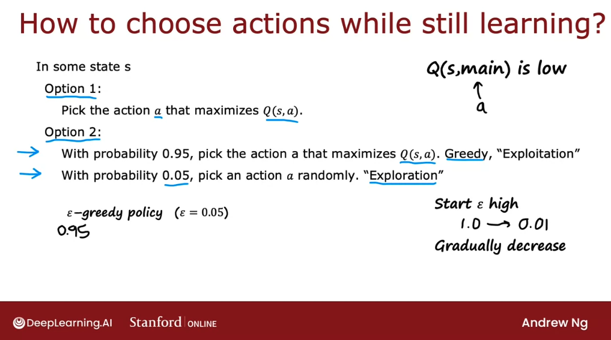

One additional realization: reinforcement learning algorithms, compared to supervised learning, are more finicky in terms of the choice of hyperparameters. For example, in supervised learning, if we set the learning rate a little bit too small, then maybe the algorithm will take longer to learn, maybe something like 3 times as long.

However, in reinforcement learning, we find that if we set the value of $\epsilon$ not quite as well, or set other parameters not quite as well, it doesn't take three times as long to learn, it may take 10 times or a 100 times as long to learn. 

Reinforcement learning algorithms, because they're are less mature than supervised learning algorithms, are much more finicky to little choices of parameters like that, and it actually sometimes is frankly more frustrating to tune these parameters with reinforcement learning algorithm compared to a supervised learning algorithm. 

## Algorithm refinement: Mini-batch and soft updates

In this section, we'll look at two further refinements to the reinforcement learning algorithm we've seen. 

### Mini-batches

The first idea is **using mini-batches**, an approach that can both speed up our reinforcement learning algorithm but is also applicable to supervised learning, including training a neural network, or training a linear regression, or a logistic regression model. 

The second idea we'll look at is **soft updates**, which it turns out will help our reinforcement learning algorithm do a better job to converge to a good solution. 

To understand **mini-batches**, let's just look at supervised learning to start. Here's the dataset of housing sizes and prices that we had seen way back in the first course of this specialization:

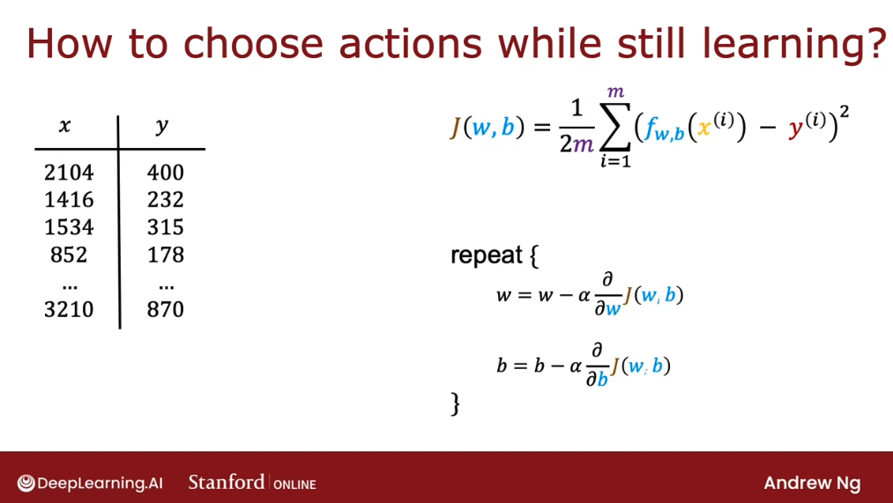

There we had come up with the cost function for the parameters $w$ and $b$ and the gradient descent algorithm. Let's replace the cost function into the algorithm:

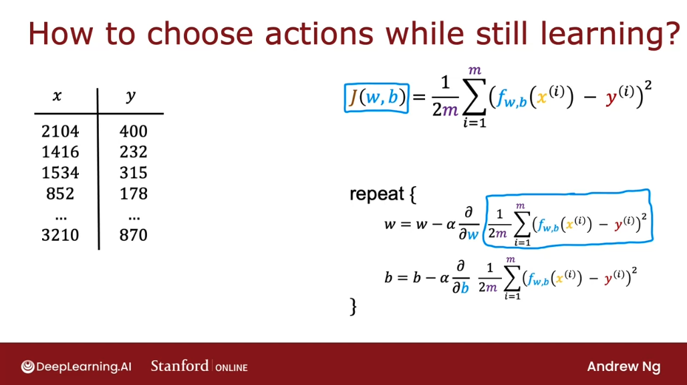

Now, when we looked at this example initially, the training set size $m$ was pretty small, around 47 training examples. But what if we have a very large training set? 

For example, $m$ equals 100 million. There are many countries including the United States with over a 100 million housing units, and so a national census will give us a dataset that is this order of magnitude or size. **The problem with this algorithm when our dataset is this big, is that every single step of gradient descent requires computing this average over 100 million examples, and this turns out to be very slow.** 

Every step of gradient descent means we would compute this sum or this average over 100 million examples. Then we take one tiny gradient descent step and we go back and have to scan over our entire 100 million example dataset again to compute the derivative on the next step, they take another tiny gradient descent step and so on and so on. When the training set size is very large, this gradient descent algorithm becomes quite slow. 

Instead of using all 100 million training examples on every single iteration through this loop, **the idea of mini-batch gradient descent is to pick a subset of a much smaller number than the total size of the dataset on each step**. On every step, instead of using all 100 million examples, we would pick some subset of 1,000 or $m'$ examples.

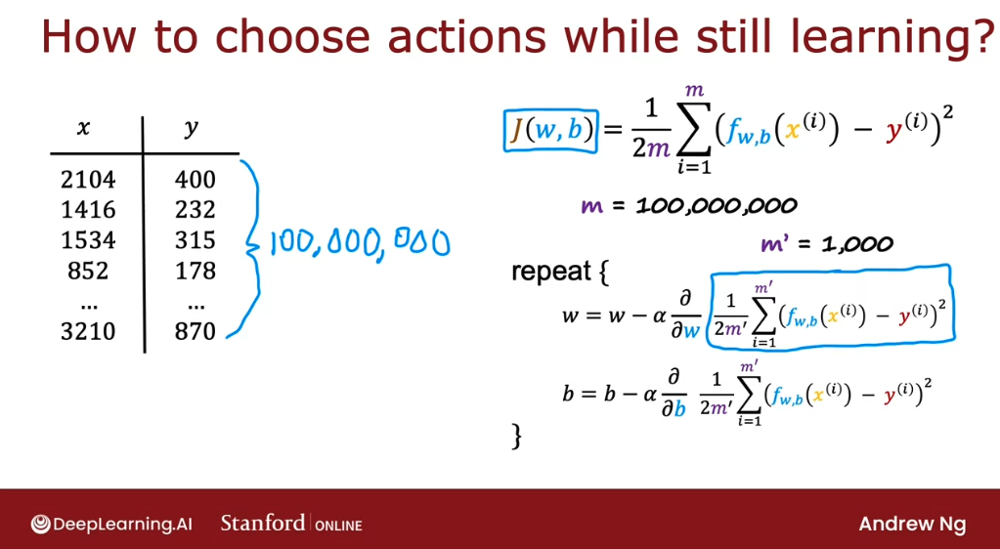

This inner term $\frac{1}{2m}$ becomes $\frac{1}{2m'}$. Now each iteration through gradient descent requires looking only at the 1,000 rather than 100 million examples, and every step takes much less time and just leads to a more efficient algorithm. 

What mini-batch gradient descent does is, on the first iteration through the algorithm, looks at the first $m'$ training examples, on the next, takes the next $m'$ training examples, and so on:

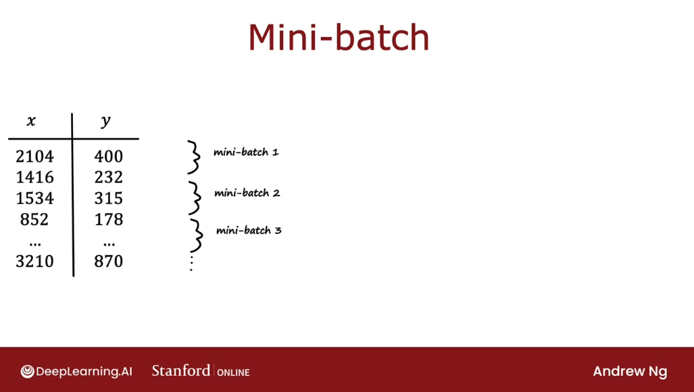

To see why this might be a reasonable algorithm, here's the housing dataset:

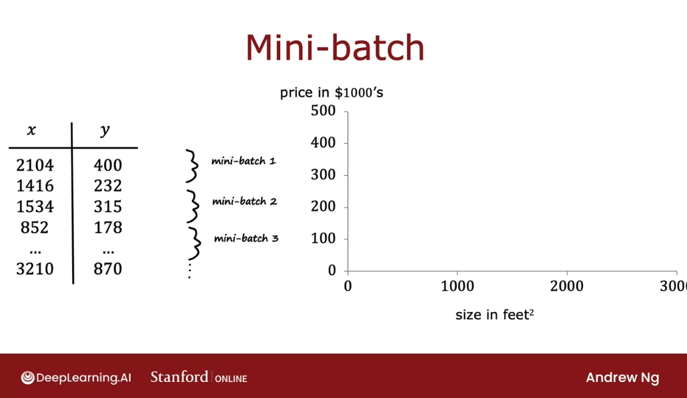

If on the first iteration we were to look at just say five examples, this is not the whole dataset but it's slightly representative of the straight line we might want to fit in the end, and so taking one gradient descent step to make the algorithm better fit these five examples is okay:

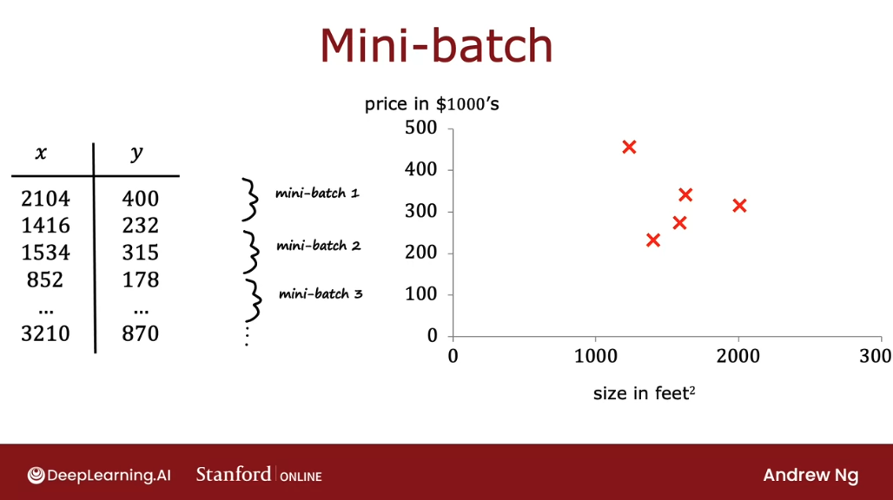

But then on the next iteration, we take a different five examples, take one gradient descent step using these five examples, and on the next iteration we use a different five examples and so on and so forth:

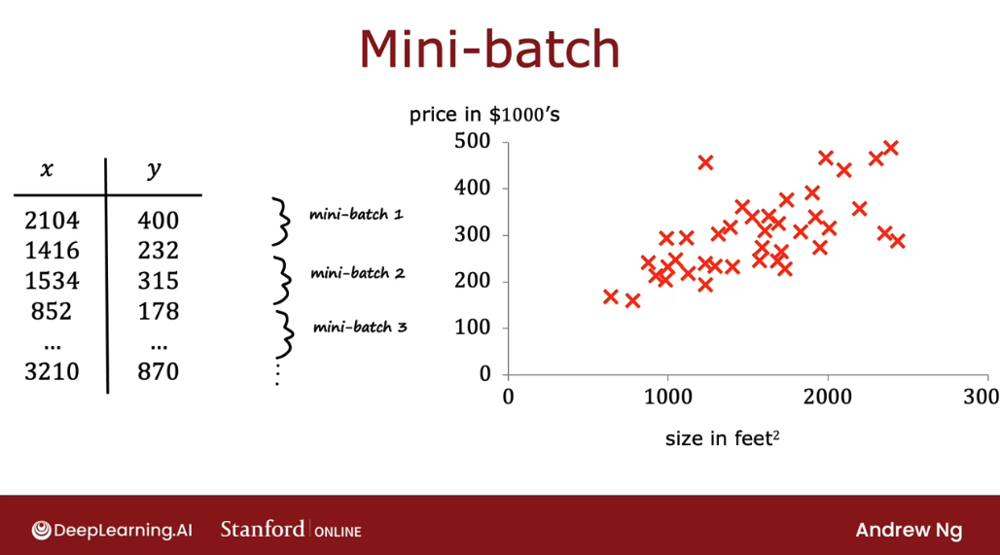

We can add from the list of examples from top to bottom, or we could, on every single iteration, just pick a totally different five examples to use, randomly.

We might remember with batch gradient descent, if the following are the contours of the cost function $J$:
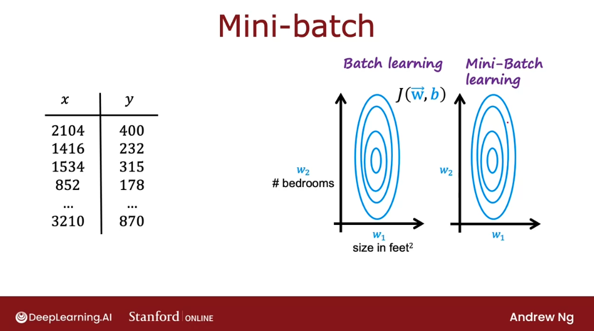

Then batch gradient descent would look like the graph in the left: start here and take a step, take a step, take a step, take a step, take a step. Every step of gradient descent causes the parameters to reliably get closer to the global minimum of the cost function in the middle:

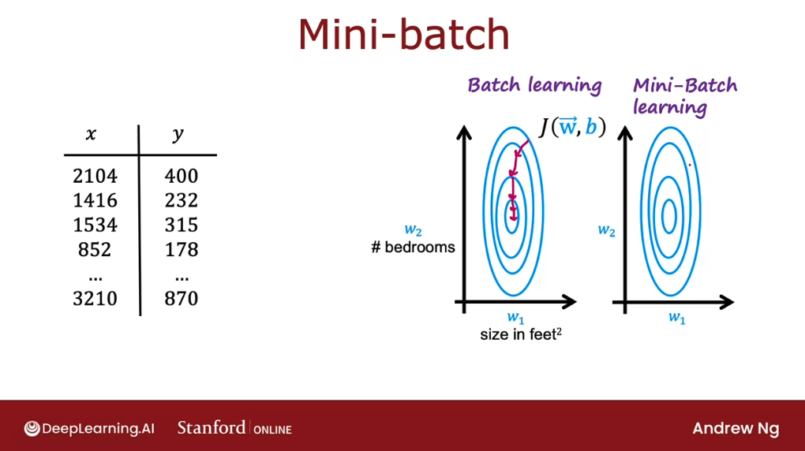

In contrast, mini-batch gradient descent or a mini-batch learning algorithm will do something like the following. If we start at the outer border, then the first iteration uses just five examples. It'll hit in the right direction but maybe not the best gradient descent direction. Sometimes just by chance, the five examples we chose may be an unlucky choice and even head in the wrong direction away from the global minimum, and so on and so forth. But on average, mini-batch gradient descent will tend toward the global minimum, although not fully reliably and somewhat noisily. 

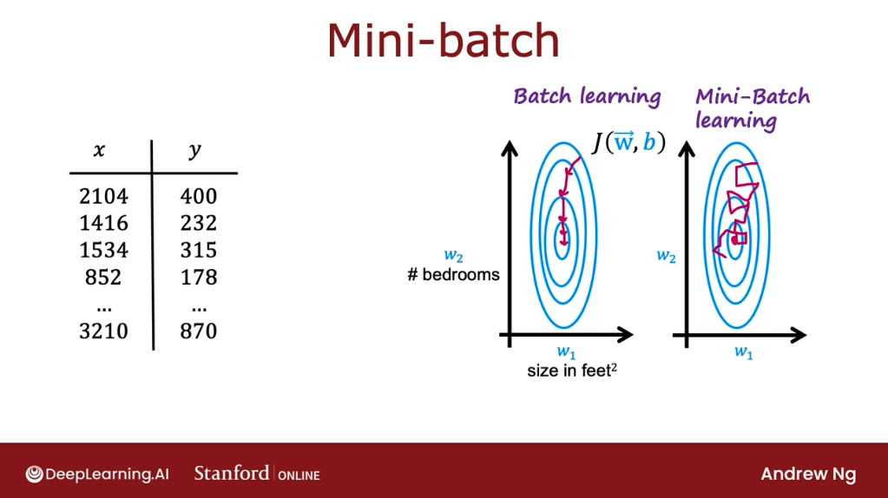

But, in this way, every iteration is much more computationally inexpensive and so mini-batch learning or mini-batch gradient descent turns out to be a much faster algorithm when we have a very large training set.

In fact, for supervised learning, where we have a very large training set, **mini-batch learning or mini-batch gradient descent, with other optimization algorithms like Adam, is used more common than batch gradient descent.**

Going back to our reinforcement learning algorithm, this is the algorithm that we had seen previously:

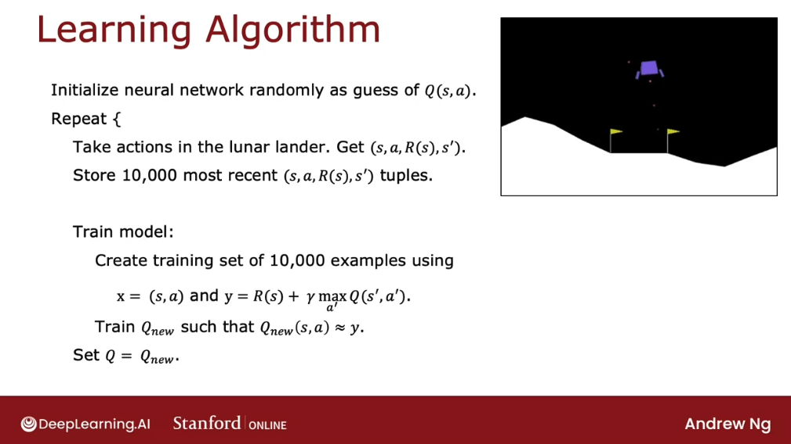

The mini-batch version of this would be, even if we have stored the 10,000 most recent tuples in the replay buffer, what we might choose to do is not use all 10,000 every time we train a model. 

Instead, what we might do is just take the subset: we choose just 1,000 examples of these $(s, a, R(s), s')$  tuples and use it to create just 1,000 training examples to train the neural network. This will make each iteration of training a model a little bit more noisy but much faster and this will overall tend to speed up this reinforcement learning algorithm. 

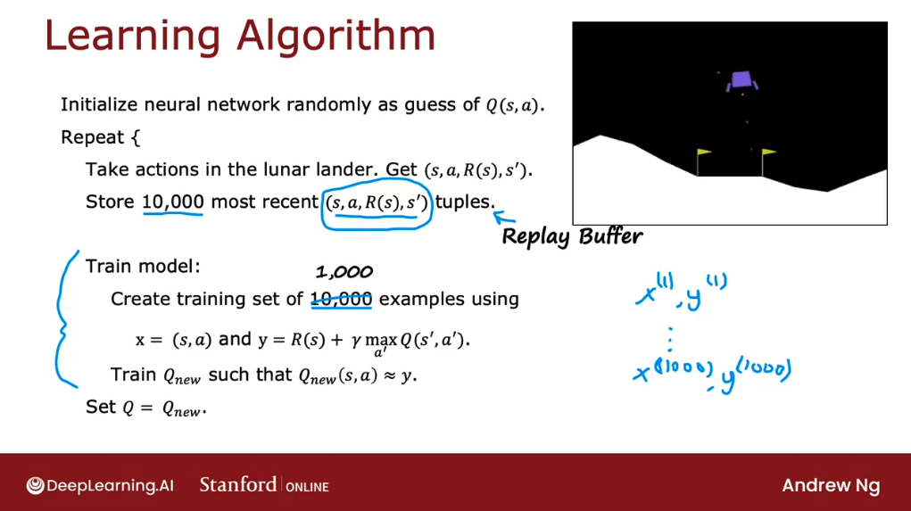

### Soft updates

We also have the **soft updates** refinement to the algorithm, that can make the reinforcement converge more reliably: in the algorithm, we've written out this step here which sets $Q$ equals $Q_{new}$. But this can make a very abrupt change to $Q$:

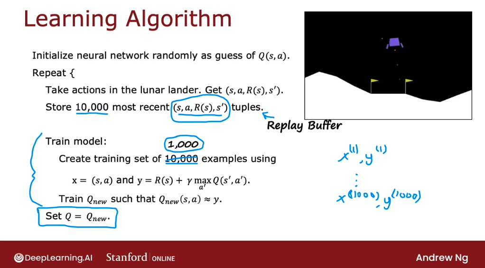

If we train a new neural network to and completely replace the old one, maybe, by chance, the new version is not a very good neural network, maybe even a little bit worse than the old one. In a scenario like that, then we just overwrote our $Q$ function with a potentially worse neural network. 

The soft update method helps to prevent $Q_{new}$ from getting worse through just one unlucky. 

In particular, the neural network $Q$ will have some parameters, $w$ and $b$, all the parameters for all the layers in the neural network. When we train the new neural network, we get some parameters $W_{new}$ and $B_{new}$:

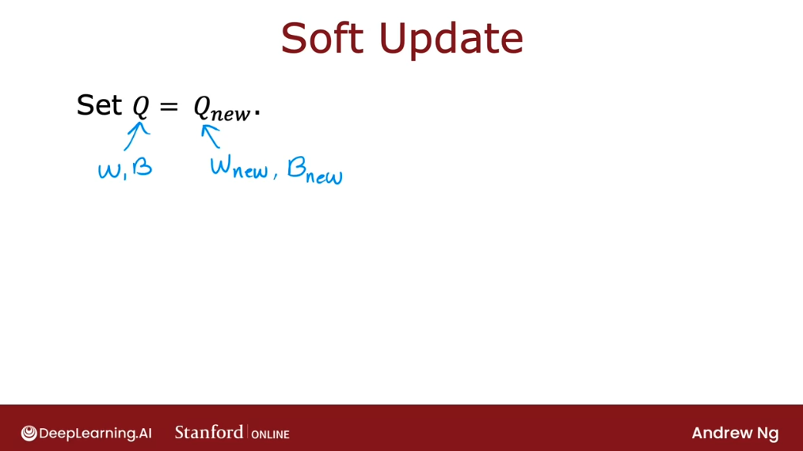

In the original algorithm $S$ as described previously, we would set $W$ to be equal to $W_{new}$ and $B$ equals $B_{new}$. That's what set $Q$ equals $Q_{new}$ means:

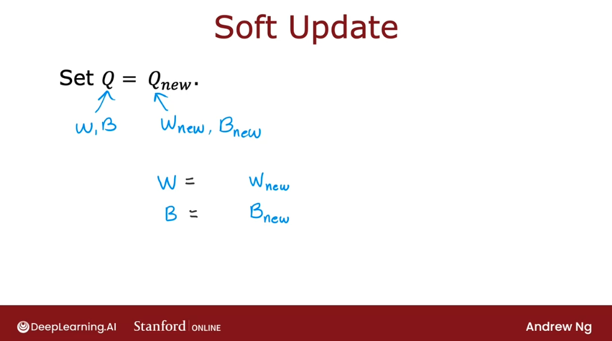

With the soft update, what we do is instead set $W$ equals $0.01$ times $W_{new}$ plus $0.99$ times $W$:

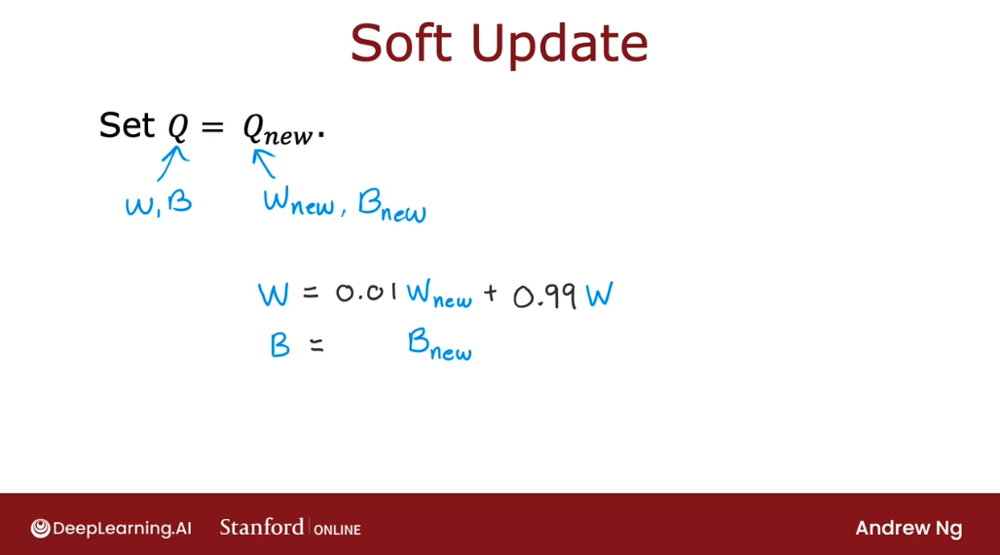

In other words, we're going to make $W$ to be 99 percent the old version of $W$ plus one percent of the new version $W_{new}$. This is called a soft update because whenever we train a new neural network $W_{new}$, we're only going to accept a little bit of the new value. 

And similarly, $B$ equals 0.01 times $B_{new}$ plus 0.99 times $B$: 

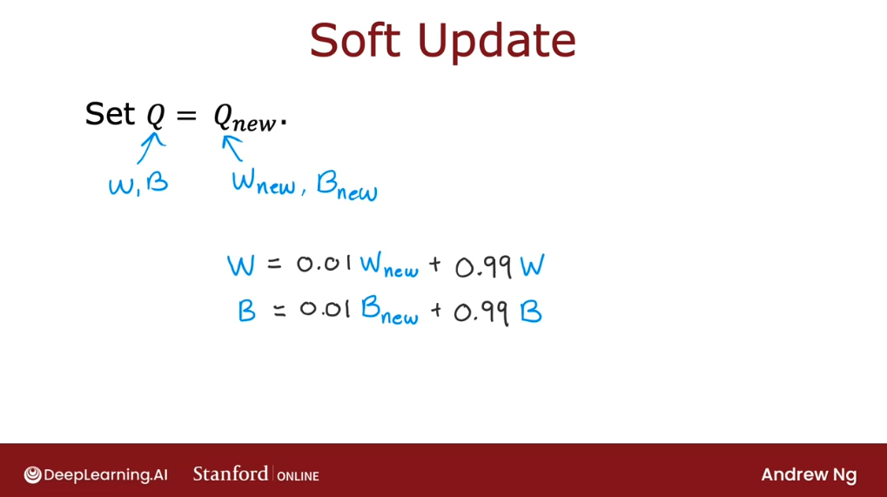

These numbers, 0.01 and 0.99, these are hyperparameters that we can set, but it controls how aggressively we move $W$ to $W_{new}$ and these two numbers are expected to add up to 1. One extreme would be if we were to set $W$ equals one times $W_{new}$ plus 0 times $W$, in which case, we're back to the original algorithm up here where we're just copying $W_{new}$ onto $W$:

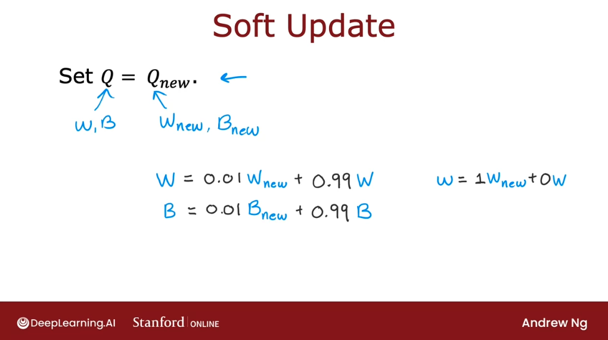

But a soft update allows we to make a more gradual change to Q or to the neural network parameters $W$ and $B$ that affect our current guess for the Q function $Q(s, a)$. **Using the soft update method causes the reinforcement learning algorithm to converge more reliably and makes it less likely that the reinforcement learning algorithm will oscillate or divert or have other undesirable properties.**

## The state of reinforcement learning

Reinforcement learning is an exciting set of technologies. In fact, when I was working on $my$ PhD thesis reinforcement learning was the subject of $my$ thesis. So I was and still am excited about these ideas. 

Despite all the research momentum and excitement behind reinforcement learning though, I think there is a bit or maybe sometimes a lot of hype around it. So what I hope to do is share with we a practical sense of where reinforcement learning is today in terms of its utility for applications. One of the reasons for some of the hype about reinforcement learning is, it turns out many of the research publications have been on simulated environments. 

And having worked in both simulations and on real robots myself, I can tell we that it's much easier to get a reinforcement learning album to work in a simulation or in a section game than in a real robot. So a lot of developers have commented that even after they got it to work in simulation, it turned out to be surprisingly challenging to get something to work in the real world or the real robot. And so if we apply these algorithms to a real application, this is one limitation that I hope we pay attention to to make sure what we do does work on the real application. 

Second, despite all the media coverage about reinforcement learning, today there are far fewer applications of reinforcement learning than supervised and unsupervised learning. So if we are building a practical application, the odds that we will find supervised learning or unsupervised learning useful or the right tool for the job, is much higher than the odds that we would end up using reinforcement learning. I have used reinforcement learning a few times myself especially on robotic control applications, but in $my$ day to day applied work, I end up using supervised and unsupervised learning much more. 

There is a lot of exciting research in reinforcement learning right now, and I think the potential of reinforcement learning for future applications is very large. And reinforcement learning still remains one of the major pillars of machine learning. And so having it as a framework as we develop our own machine learning algorithms, I hope will make we more effective at building working machine learning systems as well. 

So I hope we've enjoyed this week's materials on reinforcement learning, and specifically I hope we have fun getting the Lunar Lander to land for yourself. I hope will be a satisfying experience when we implement an algorithm and then see that Lunar Lander land safely on the moon because of code that we wrote. That brings us towards the end of this specialization. 

Let's go on to the last section where we wrap up.